# ⭐ **Why do we need User-Defined Data Types (UDTs)?**

A _data type_ tells the compiler **what kind of data** you are storing and **what operations** you can do on it.

C++ gives built-in types:

- `int`
    
- `float`
    
- `char`
    
- `double`
    
- `bool`
    

But these are **not enough** for real-world problems.


# 🔥 **1. Real-world entities are more complex than built-in types**

Built-in types store **one value**.

But a real-world thing has **multiple properties**.

Example: Representing a _Student_.

### Using built-in types (BAD)

`string name; int roll; float marks;`

These 3 things **belong together**, but the language doesn’t know that—  
They are not “glued” into one unit.

You can't create _multiple students_ easily or pass them around as a single unit.


# ⭐ **2. UDTs allow grouping related data + behavior together**

A **class**, **struct**, **enum** etc. are UDTs.  
They allow us to _define our own type_ that represents something meaningful.

Example:

`class Student { public:     string name;     int roll;     float marks; };`

Now **Student** becomes a new data type, just like `int`.

You can now do:

`Student s1, s2;`

Just like:

`int a, b;`


# ⭐ **3. UDTs allow attaching functions to data (behavior)**

A student isn’t only data. It has behavior.

Example:

`class Student { public:     string name;     void introduce() {         cout << "Hi, I'm " << name;     } };`

Now the **data** and its **operations** stay together → This is the core idea of OOP.

Builtin types cannot do this.


# ⭐ **4. Reusability (Don’t Repeat Yourself)**

Without UDT:

You will write the same 3 variables (name, roll, marks) again and again.

With UDT:

`Student s1, s2, s3, class1[50];`

One class → infinite objects.


# ⭐ **5. Abstraction: Hide complexity, expose only what matters**

Example: A **Car**.

You don’t care how the engine works internally.  
You only call:

`car.start(); car.accelerate();`

User-defined types allow you to hide complexity inside.


# ⭐ **6. Custom behavior and operator overloading**

UDTs allow you to define how operators work on your type.

Example:

`Complex c1, c2; c1 + c2; // you can define what + means`

Builtin types cannot do this for your own objects.


# ⭐ **7. Modeling Real World → Foundation of OOPS**

OOPS exists because real world problems cannot be solved with only built-in types.

We need:

- classes
    
- objects
    
- inheritance
    
- polymorphism
    
- encapsulation
    
- abstraction
    

All of these depend on **user-defined types**.

Without UDTs, OOPS cannot exist.

# ⭐ **What is a Class? (Simple Definition)**

A **class** is a **user-defined data type** that acts as a **blueprint** for creating objects.

It defines:

1. **Data (properties / attributes)**
    
2. **Functions (behavior / methods)**
    

But a class itself **does not occupy memory** (except for static members).  
Memory is allocated only when you create an **object** of that class.

# 🔥 **The Simplest Analogy**

Think of:

- **Class → Blueprint of a house**
    
- **Object → The actual house built from that blueprint**
    

Blueprint itself doesn't take space to live in.  
Only when you build (create object), memory is used.

# **Formal Interview Definition**

A **class** in C++ is a user-defined data type that **encapsulates** data and functions into a single unit.  
It allows you to model real-world entities by defining what an object **has** (data members) and **does** (member functions).

```c++
class Student {
public:
    string name;
    int age;

    void introduce() {
        cout << "Hi, I am " << name;
    }
};
```

### Points:

- `Student` is a **class** (a blueprint).
    
- `name` and `age` → **data members**
    
- `introduce()` → **member function**

# ⭐ No Memory → Until Object Creation

`Student s1;  // now memory is allocated`

`s1` now has memory for:

- 1 string
    
- 1 int
    

But **class Student itself takes no object memory**.


# ⭐ Why do we need a Class?

(Interviewer expects this)

Because real-life entities have:

- multiple properties
    
- behaviors
    
- and relationships
    

Example: A Car  
→ color, model, speed  
→ start(), stop(), accelerate()

A class allows you to combine them into **one type**.


# ⭐ **What is an Object? (Very Clear Definition)**

An **object** is an **instance** of a class.  
It is the **real, memory-allocated entity** created from the class blueprint.

Where the class defines _what it should have and do_,  
the object is the **actual thing** that **stores data** and **performs actions**.

An **object** in C++ is a memory-resident instance of a class that contains its own copy of the class’s data members and can use the class’s member functions.

⭐ Objects Use Memory — Classes Don’t

# What does an object contain?

An object contains:

- **Data members** (actual values)
    
- A hidden **vptr** pointer (only if class has virtual functions)
    

---

# ⭐ Objects Access Functions

Even though objects have their own data,  
**member functions are shared among all objects**.

Example:

`s1.introduce(); s2.introduce();`

Both call the same method,  
but `this` pointer ensures they use their **own** data.


|**Class**|**Object**|
|---|---|
|A **blueprint**, template, or definition.|A **real instance** created from the class.|
|Does **not occupy memory** (except static members).|**Takes memory** when created.|
|Represents a **concept** (e.g., Student).|Represents a **specific entity** (e.g., s1, s2).|
|Defines **properties (data members)** and **behaviors (methods)**.|**Owns its own copy of data members**, and **uses** the class's methods.|
|Created **once** but used to make multiple objects.|You can create **many objects** from the same class.|
|Exists at **compile-time** (just a definition).|Exists at **run-time** (actual object).|
|Cannot perform actions itself.|Performs actions using member functions.|
|Example: `class Student { ... };`|Example: `Student s1;`|


## Passing objects to functions

# **When you pass an object by value, a NEW object is created.**
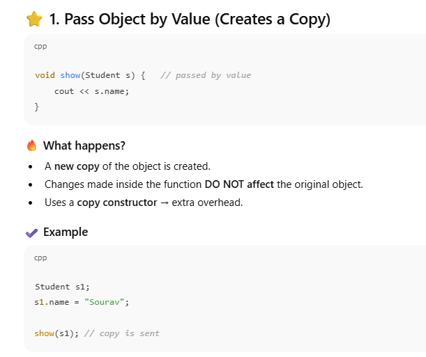
But this new object is created using the **copy constructor**.

That means:

- It **copies all the data members** from the original object.
    
- So the new object has **the same values**, but it is **NOT the same object**.
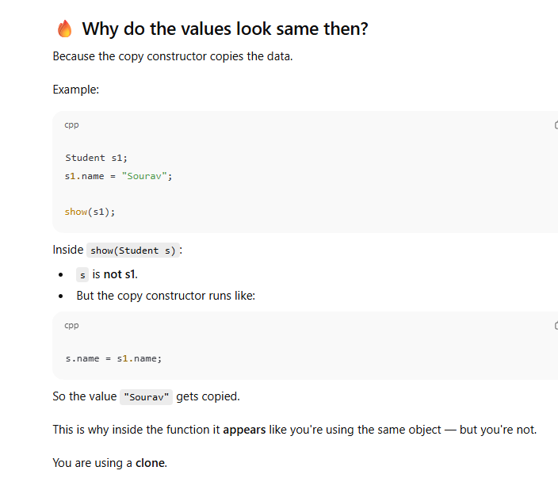


# ⭐ 2. **Pass Object by Reference** (No Copy — Most Efficient)
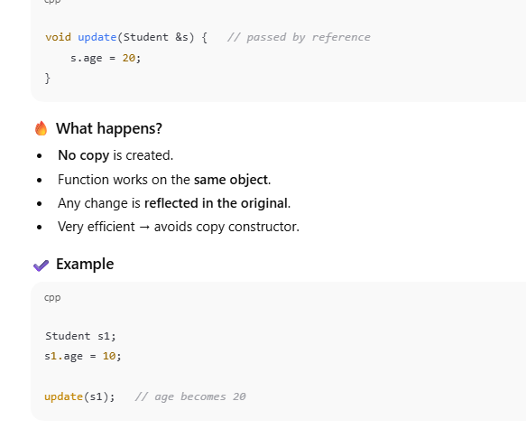

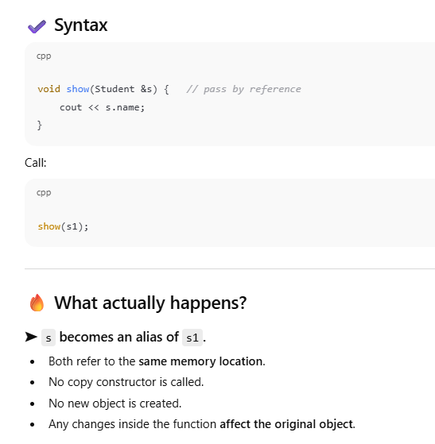


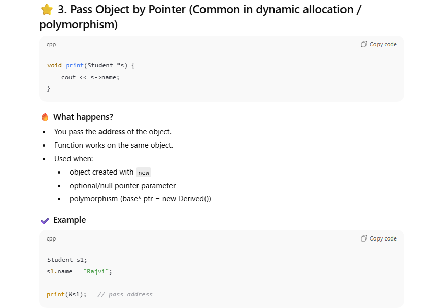


| Method                | Copy Created? | Can Modify Original? | Use Case                                   |
| --------------------- | ------------- | -------------------- | ------------------------------------------ |
| **Pass by Value**     | YES           | NO                   | When you don't want the original to change |
| **Pass by Reference** | NO            | YES                  | Most common, efficient                     |
| **Pass by Pointer**   | NO            | YES                  | Dynamic objects, polymorphism              |


# **Why Do We Need Constructors?**

A **constructor** solves one big problem:

### 🔥 **Objects need proper initial values before you use them.**

Whenever you create an object, you want its data members to start with **valid, meaningful, predictable values** — not garbage.

or even for avoiding repeating initialization code
```c++
class Student {
public:
    int age;
};

int main() {
    Student s;   // age = ??? (garbage value)
}

////////
Student s;
s.age = 10;
s.name = "Sourav";

Student s2;
s2.age = 10;
s2.name = "Sourav";
```


👉 **Constructors = automatic initialization functions**
A constructor is needed to **initialize objects** when they are created, ensuring that:

- they start in a valid state
    
- important resources are acquired
    
- default values are properly set

# ⭐ **Third reason: To enforce mandatory initialization**

Sometimes certain data MUST be initialized or the object is invalid.


# ⭐ **Fourth reason: To allocate resources**

Constructors can:

- allocate memory
    
- open files
    
- initialize sockets
    
- acquire locks

## **Types of Constructors**

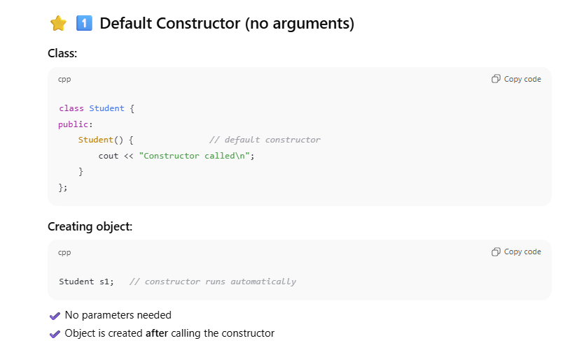


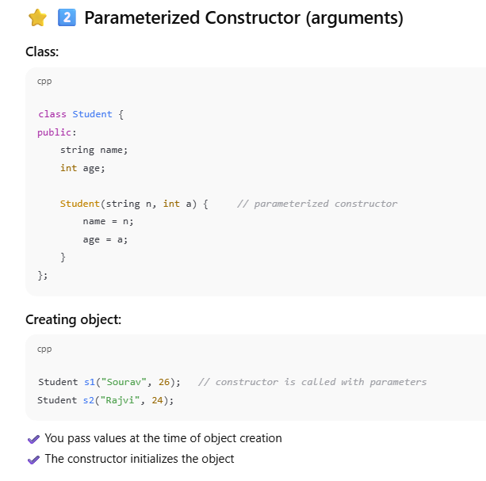


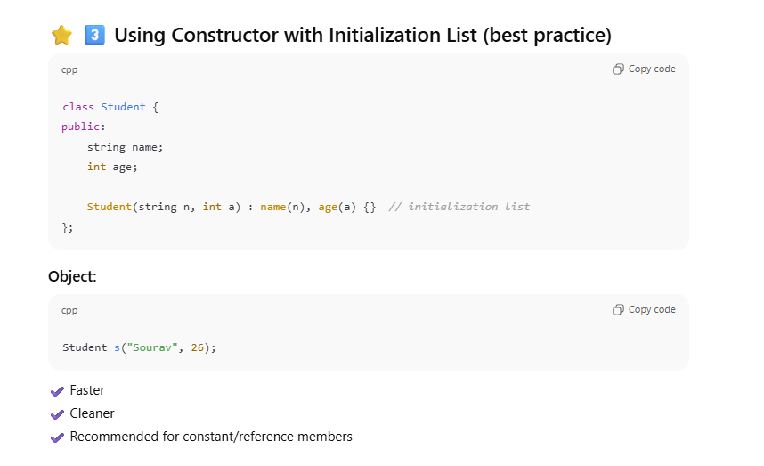


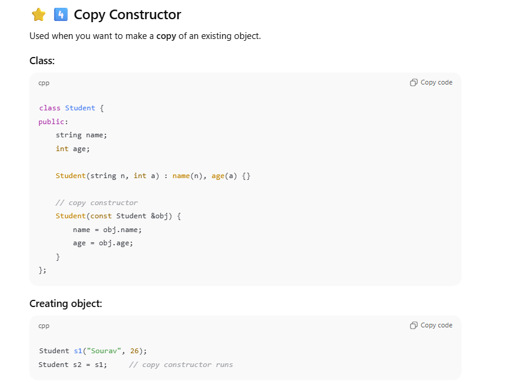


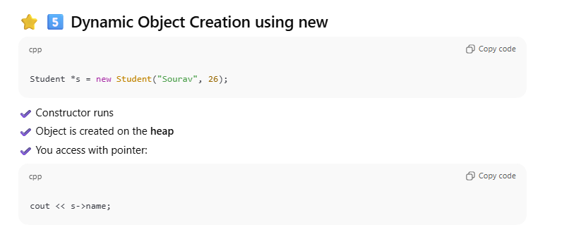


|Constructor Type|Object Creation Example|
|---|---|
|Default|`Student s;`|
|Parameterized|`Student s("name", age);`|
|Initialization List|`Student s("name", age);`|
|Copy Constructor|`Student s2 = s1;`|
|Dynamic Object|`Student *s = new Student("Sourav", 26);`|
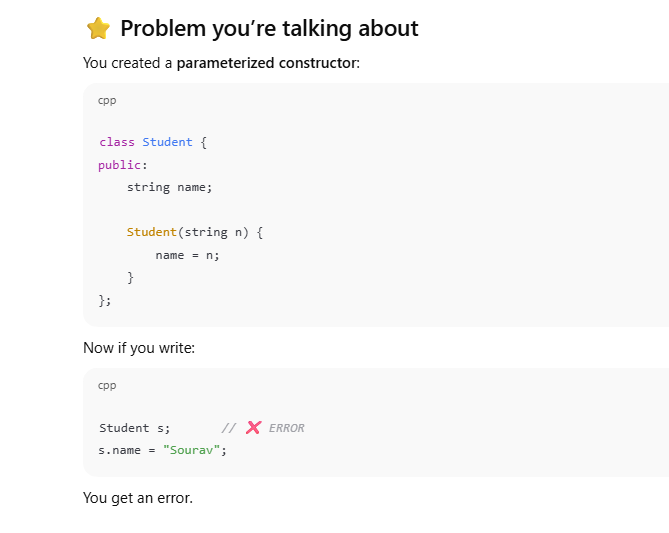


# ❓ Why does this give an error?

Because **you removed the default constructor** without realizing it.

When you define _any_ constructor yourself, C++ **stops generating the default constructor** automatically.

So now your class has ONLY this constructor:

`Student(string n);`

Meaning:

- The compiler now expects **one argument** every time you create a Student.
    
- So `Student s;` is illegal because it tries to call a constructor that **does not exist**.

# ⭐ Bigger Picture: How constructors work in C++

### ✔ If you define NO constructor

Compiler generates a **default constructor**:

`Student() { }`

So you can do:

`Student s;`

No issue.

---

### ✔ If you define _any constructor_

Compiler **stops generating**:

- default constructor
    
- copy constructor
    
- move constructor
    
- assignment operator
    

So now only the constructors YOU wrote exist.

So:

`Student s;  // ❌ No default constructor!`

fails because:

- You created ONLY a parameterized constructor.
    
- You did NOT create a default one.

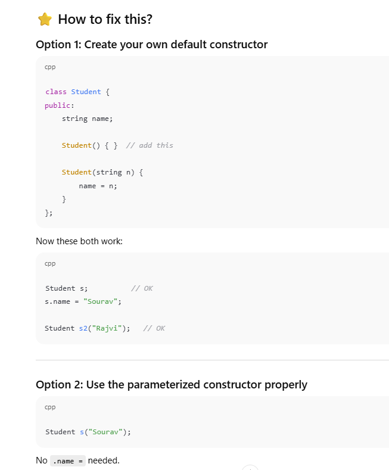


# ⭐ The Real Bigger Picture (Conceptual)

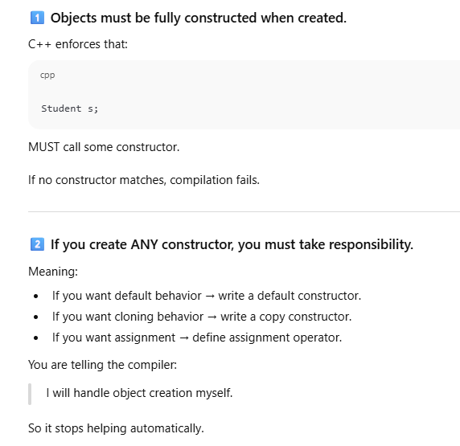


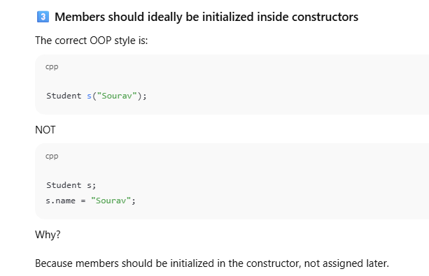


# ⭐ Why do we need **multiple constructors**?

Because **objects can be created in different ways**.

Example:

- Sometimes you know **everything**
    
- Sometimes you know **only partial data**
    
- Sometimes you want **default values**
    

Multiple constructors allow **flexible object creation**.


# ⭐ What is Constructor Overloading?

> **Defining more than one constructor in a class with different parameter lists is called constructor overloading.**

It is an example of **compile-time polymorphism**.


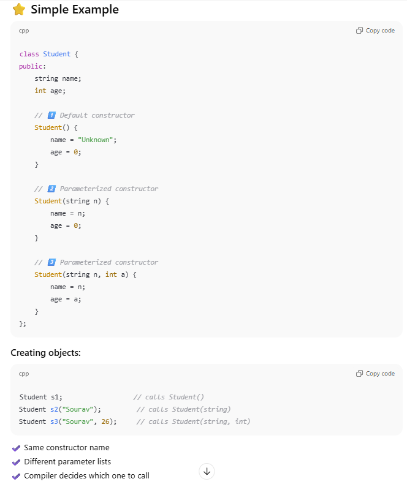


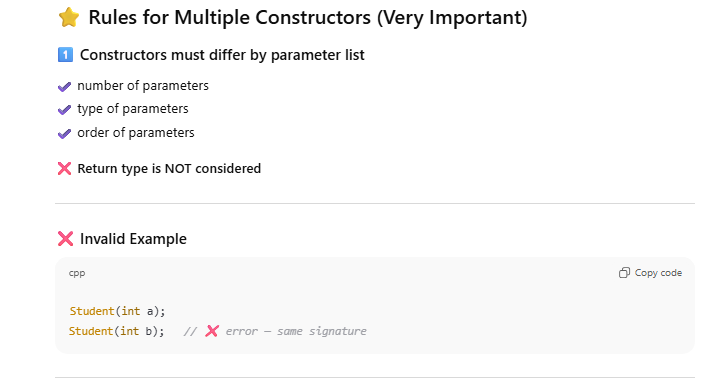


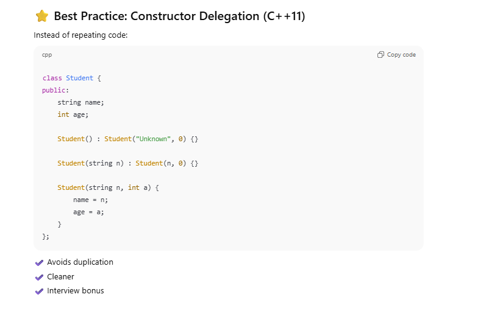

# ⭐ Constructor Overloading vs Function Overloading

| Aspect      | Constructor Overloading | Function Overloading |
| ----------- | ----------------------- | -------------------- |
| Name        | Same as class           | Any name             |
| Return type | ❌ No return type        | ✔ Has return type    |
| Purpose     | Object creation         | General logic        |
Yes, we can make multiple constructors using constructor overloading to allow different ways of object initialization.


### ❓ Can constructors be virtual?

❌ No — object must exist before virtual behavior.

---

### ❓ Can constructors be private?

✔ Yes — used in **Singleton pattern**.

---

### ❓ If no constructor is written, what happens?

✔ Compiler generates a **default constructor** (if no other constructor exists).


# ⭐ Why do we need a **Copy Constructor**?

Because **objects can be copied**, and sometimes a **simple bit-by-bit copy is dangerous**.

When an object holds:

- dynamic memory (`new`)
    
- file handles
    
- pointers
    
- resources
    

a default copy can cause:  
❌ double free  
❌ memory corruption  
❌ crashes

So we need **controlled copying**.

---

# ⭐ What is a Copy Constructor?

> A **copy constructor** is a special constructor that initializes a **new object using an existing object of the same class**.

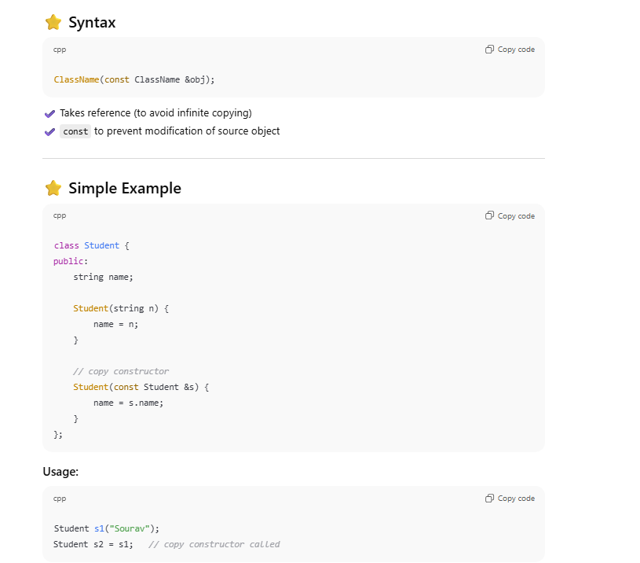


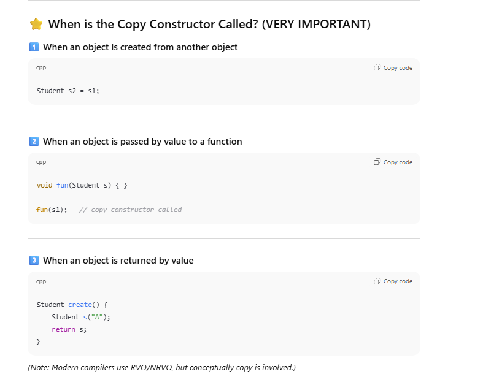


## 1️⃣ What is a copy constructor supposed to do?

A **copy constructor** is called when you create a new object **from an existing object**:

`Test t1; Test t2 = t1;   // copy constructor is called`

So conceptually:

> “Create `t2` using the data of `t1`”

---

## 2️⃣ ❌ Why `Test(Test t)` is WRONG (infinite recursion)

### Signature:

`Test(Test t);`

Here, the parameter `t` is passed **by value**.

### What does pass-by-value mean?

Passing by value means:

> To pass `t`, C++ must **make a copy** of the argument.

⚠️ **And how does C++ make that copy?**  
👉 By calling the **copy constructor again**.

---

### 🔁 What actually happens (step-by-step)

`Test t2 = t1;`

1. Compiler wants to call:
    
    `Test(Test t)`
    
2. To pass `t1` into parameter `t`, it needs to **copy `t1`**
    
3. Copying `t1` requires calling:
    
    `Test(Test t)`
    
4. Which again needs to copy…
    
5. Which again calls the copy constructor…
    
6. 🔥 **Infinite recursion → stack overflow**
    

📌 **Key insight**

> A copy constructor **cannot take its argument by value**, because copying requires copying again.

---

## 3️⃣ ✔ Why `Test(const Test& t)` is CORRECT

### Signature:

`Test(const Test &t);`

Here, the parameter is a **reference**, not a value.

### What does passing by reference mean?

- No new object is created
    
- No copy is made
    
- Just an **alias to the existing object**
    

So:

`Test t2 = t1;`

- `t` refers directly to `t1`
    
- No copy constructor is needed to pass the argument
    
- 🚀 **No recursion**
    

---

## 4️⃣ Why `const` is also necessary

`Test(const Test &t);`

### Reasons for `const`:

### ✅ 1. Prevent accidental modification

You should not modify the source object while copying.

### ✅ 2. Allows copying from const objects

Example:

`const Test t1; Test t2 = t1;  // ❌ fails if parameter is non-const`

Without `const`, this would be illegal.

---

## 5️⃣ Mental model (very important)

### ❌ Pass by value

> “To receive the object, I must first **copy** it”

### ✔ Pass by reference

> “I’ll just **look at the original object**”

A **copy constructor must look, not copy again**.

---

## 6️⃣ One-line rule to remember forever

> **A copy constructor must take its argument by `const reference`, because copying by value would require copying again — infinitely.**

---

## 7️⃣ Bonus: What the compiler expects

The C++ standard **requires** a copy constructor to have this form (or equivalent):

`Test(const Test&);`

Anything else breaks object construction semantics.


# ⭐ Compiler-Generated Copy Constructor

If you don’t define one:  
✔ Compiler creates a **default copy constructor**  
❌ It performs **shallow copy**

## If I don’t write a copy constructor, what happens?

Very important:

> ✅ **C++ automatically creates a copy constructor for you**

This **default copy constructor** does:

- member-by-member copy
    
- also called **shallow copy**

## Then WHEN do we NEED to write a copy constructor?

Here is the **ONLY rule you need to remember**:

> ❗ **If your class owns memory/resources, you MUST write a copy constructor.**

### What does “owns memory” mean?

When your class has:

- `new`
    
- raw pointers
    
- dynamic memory
    
- file handles
    
- resources that need manual cleanup

## FINAL RULE 

### 🔑 Golden Rule of Copy Constructor

> ✔ If your class has **only normal variables** →  
> ❌ You do **NOT** need to write a copy constructor

> ✔ If your class uses **new / pointers / resources** →  
> ✅ You **MUST** write a copy constructor


## Need of this **keyword**
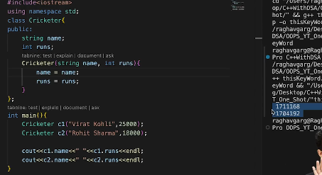

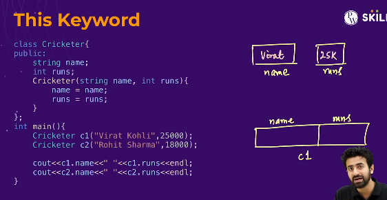

int x = 4 ;
 x = x won't do anything!
 so agar names different hote toh koi dikkat hi nahi hoti but name same hota hai this make sure karega ki ab object wale name and runs ki bat kar rahe hain!
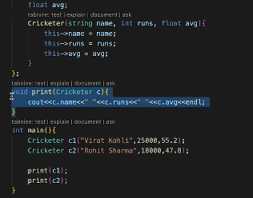
If I can write functions **outside** the class and still use the object,  then **why do we even put functions inside a class?**

## First: both are VALID in C++

Yes:

- You **can** write functions outside the class
    
- You **can** write functions inside the class
    

C++ allows **both**.

So the question is **not “can we”**  
The real question is **“when SHOULD we?”**

---

## Core idea (one sentence)

> **Functions that logically belong to the object should be inside the class.**

Everything else can stay outside.

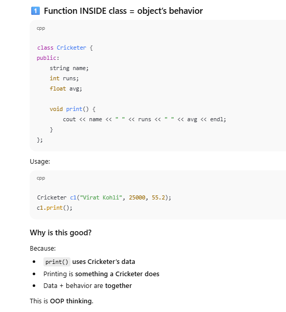


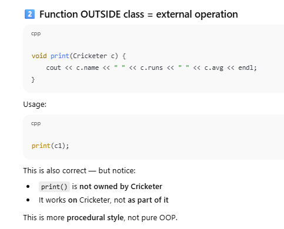


