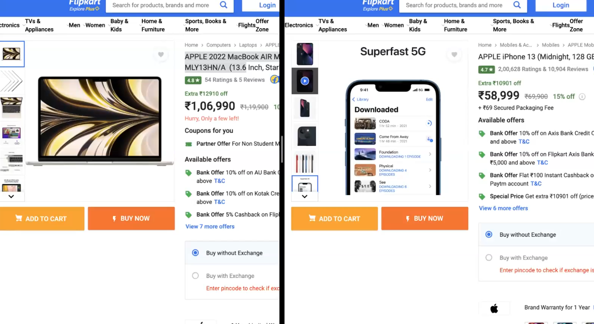
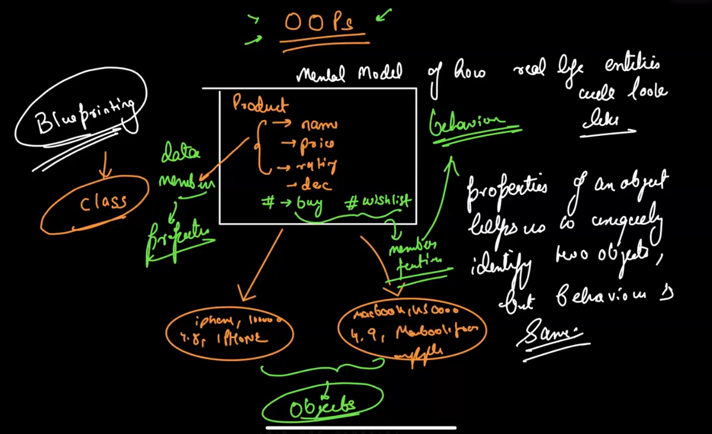
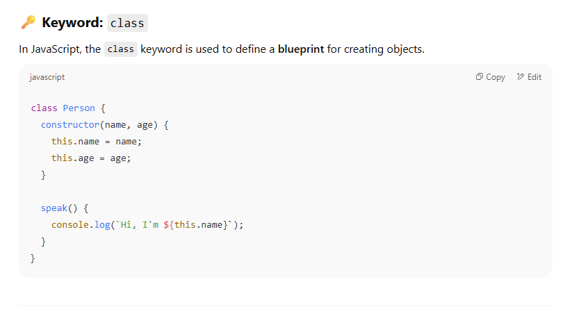
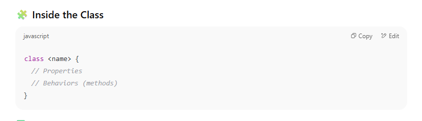
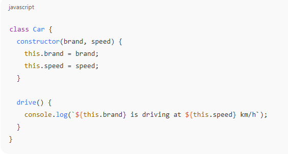
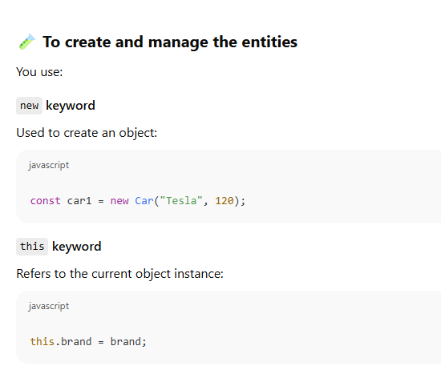

How many Products will be there on flipkart and amazon! Around 600 million!

## What is OOP (Object-Oriented Programming)?

**Object-Oriented Programming (OOP)** is a programming paradigm that uses "objects" to structure code. Objects represent real-world entities and contain:

- **Properties** (data)
    
- **Methods** (functions)

JS MEIN OOPS KAFFI DIFFERENT HOTA HAI! WRT TO C++

Object-Oriented Programming is not a language feature — it's a **design philosophy**. It’s about modeling the **real world** using **objects** that:

- **Store state** → via _data/properties_
    
- **Perform behavior** → via _functions/methods_

#### Example in human world:

- You = object
    
- `name`, `age` = properties
    
- `speak()`, `walk()` = methods

### How JavaScript Sees Objects

JavaScript is fundamentally **prototype-based**, not class-based like Java or C++. But ECMAScript (ES6+) gave us `class` syntax to _mimic_ classical OOP.

> Behind the scenes, JS still uses **prototypes** even if you use `class`.

#### ✅ Properties (State)

These are defined using the `constructor` method and typically assigned using `this`.

#### ✅ Behaviors (Methods)

Functions that define what the object can do.

