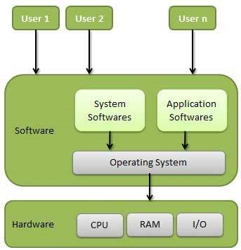

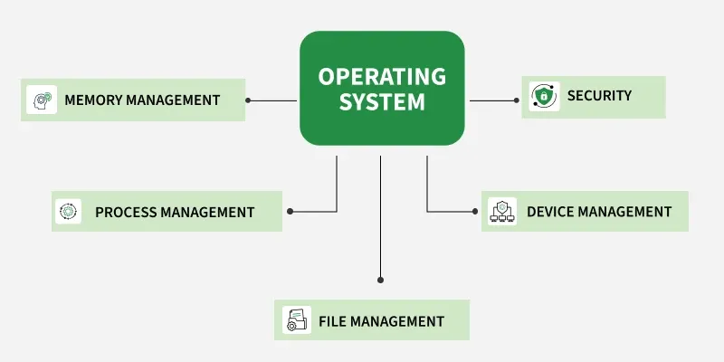

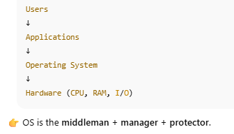

## 1️⃣ Primary Goal of an Operating System

Written on the board:

### ✅ **Primary Goal → Convenience**

This is a **very common interview line**.

### What does “Convenience” mean?

- OS makes hardware **easy to use**
    
- Hides hardware complexity
    

Example:

- You don’t manage RAM manually
    
- You don’t schedule CPU manually
    
- You don’t talk to disk controllers
    

You just write:

`printf("Hello");`

OS does **100 things behind the scenes**.

📌 Interview line:

> _Primary goal of OS is to make the computer system convenient for users._

## 3️⃣ Security 
On board:

`User  ↓  OS  ↓  Hardware`

### Why OS enforces security?

Because:

- Multiple users
    
- Multiple processes
    
- Shared hardware
    

OS ensures:  
✅ One app doesn’t read another app’s memory  
✅ Only permitted users access files  
✅ No direct hardware access

Example:

- Browser cannot access your filesystem arbitrarily
    
- App cannot crash whole OS (ideally)

📌 Interview line:

> OS provides isolation and protection between users, processes and hardware.

# Now the CORE: **Functions of an Operating System**

## 1️⃣ Resource Management

### What are resources?

- CPU
    
- Memory
    
- Disk
    
- Network
    
- I/O devices
    

OS decides:

- Who gets what
    
- For how long
    
- How much
    

Example:

- Chrome: 20% CPU
    
- VS Code: 10% CPU
    
- Spotify: background
    

📌 One-liner:

> OS manages and allocates system resources efficiently.

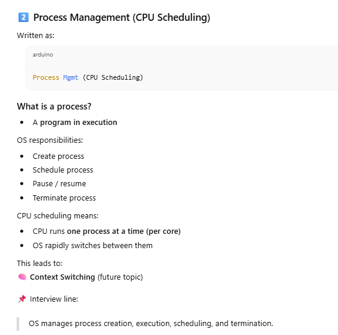

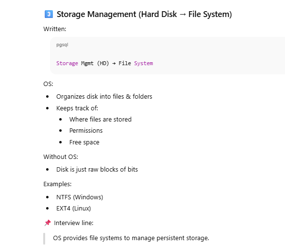

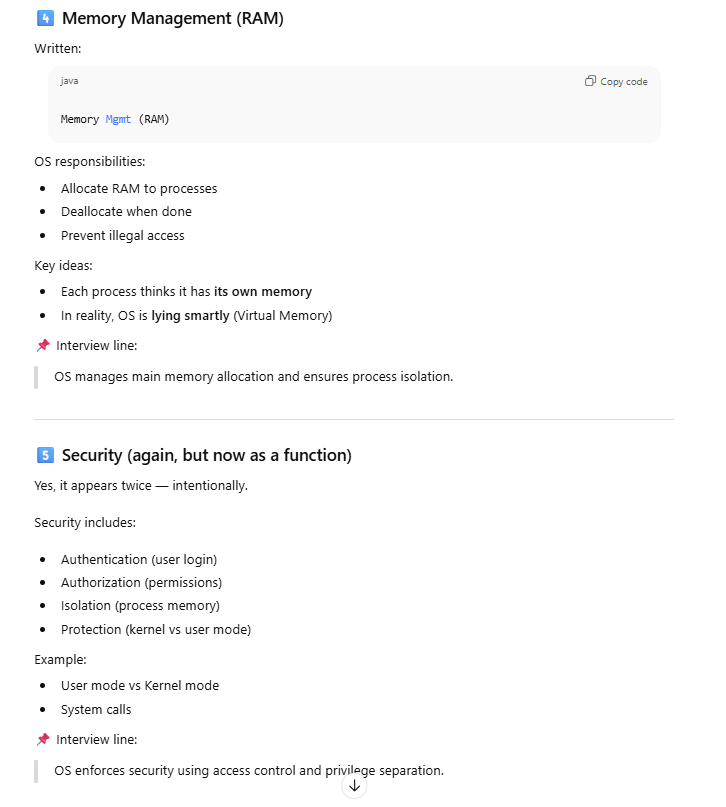

# Types of Operating Systems (from past → present)

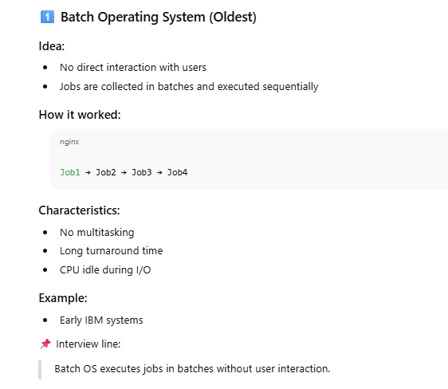

## 2️⃣ Multiprogramming Operating System

### Problem it solved:

CPU idle time in batch systems.

### Idea:

- Multiple programs in memory at the same time
    
- When one waits for I/O, CPU executes another
    

### Key benefit:

- Better CPU utilization
    

### Important note:

❌ No guarantee of response time

📌 Interview line:

> Multiprogramming OS improves CPU utilization by switching between jobs.

---

## 3️⃣ Time Sharing Operating System ⭐ (VERY IMPORTANT)

### Idea:

- CPU time is divided into small slices (time quantum)
    
- Each process gets CPU for a short time
    

### Result:

- Fast response
    
- Illusion of parallel execution
    

### Used in:

- Multi-user systems
    
- Interactive systems
    

### Examples:

- Linux
    
- Windows
    
- macOS
    

📌 Interview line:

> Time-sharing OS allows multiple users/processes to share CPU with quick response.

## 4️⃣ Multitasking Operating System

### Often confused with Time Sharing

✅ Multitasking:

- Multiple tasks at the same time
    
- Mostly used for **single user systems**
    

✅ Time Sharing:

- Multiple users sharing CPU
    

But in practice:  
➡ Modern OS does **both**

Example:

- You listening to music + coding + browser
    

📌 Interview line:

> Multitasking OS allows concurrent execution of multiple tasks.

> Time sharing and multitasking use similar mechanisms, but differ in their target: users vs tasks.

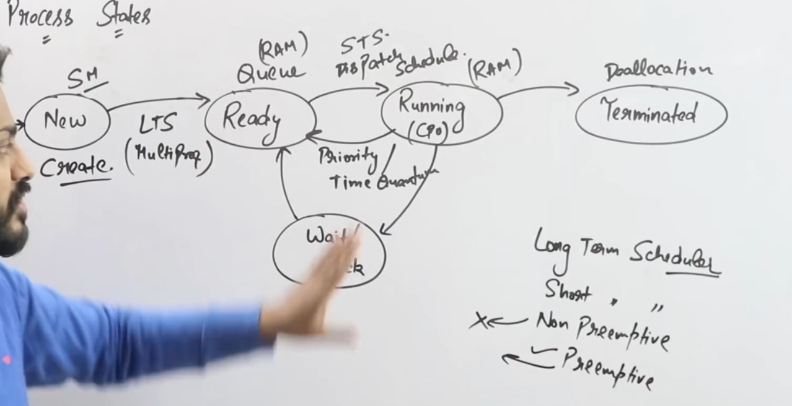

## 🟩 **1. NEW State**

Process has just been **created**.

- Program is loaded from disk
    
- OS has not yet allocated CPU time
    
- PCB (Process Control Block) is created
    

Arrow:  
**NEW → READY** (via Long Term Scheduler)

---

## 🟦 **2. READY State**

Process is in RAM, **ready to run**, waiting for CPU.

Think: "My turn kab ayega?"

- All resources allocated **except CPU**
    
- Sits in **Ready Queue**
    

Arrow:  
**READY → RUNNING** (via Short Term Scheduler / CPU Scheduler / Dispatcher)

## 🟧 **3. RUNNING State**

Process currently has the **CPU**.

Only **one process per core** can be in this state.

From RUNNING, 3 things can happen:

### A) **Time Quantum Over / Higher Priority Process Arrives** (Preemptive Scheduling)

`RUNNING → READY`

### B) **Process requests I/O**

`RUNNING → WAIT`

### C) **Process completes**

`RUNNING → TERMINATED`

## 🟨 **4. WAITING (or BLOCKED) State**
Ye ram mein hi hoti hai
Process is waiting for some event:

- I/O completion
    
- Resource availability
    
- Timer
    
- Network request
    

Arrow:

`WAIT → READY`

(when I/O completes)

---

## 🟥 **5. TERMINATED State**

Process finished or was killed.

- OS deallocates memory
    
- Removes PCB

# 🟦 2. THREE TYPES OF SCHEDULERS 

This is the **most important part** of the board.

---

## **A) Long Term Scheduler (LTS)**

Also called **Job Scheduler**.

Arrow: **NEW → READY**

### Job:

- Controls **degree of multiprogramming**  
    (# of processes in memory)
    

### Frequency:

- Rarely runs
    
- Sometimes NOT present in modern OS
    

### Example:

Batch systems use LTS  
Linux desktops **don’t** use LTS explicitly.

📌 **Key line:**

> LTS decides which processes enter RAM.

## **B) Short Term Scheduler (STS)**

Also called **CPU Scheduler**.

Arrow: **READY → RUNNING**

### Job:

- Picks which process gets the CPU **next**
    
- Runs **very frequently** (milliseconds)
    

### Uses:

- Preemptive scheduling
    
- Non-preemptive scheduling
    

📌 **Key line:**

> STS decides which process gets CPU time.

# 🟧 PREEMPTIVE vs NON-PREEMPTIVE (bottom right corner)

## **Preemptive Scheduling**

OS can interrupt a running process and put it back in READY.

Used in:

- Round Robin (time quantum)
    
- Priority scheduling
    
- Multilevel queue
    

### When does preemption occur?

- Time quantum expires
    
- Higher priority process arrives
    

---

## **Non-preemptive Scheduling**

Once the CPU is given to a process, it will not be removed until:

- It finishes OR
    
- It voluntarily moves to WAIT state
    

Examples:

- FCFS
    
- SJF (non-preemptive)

# 🟩 Summary of Flow (FULL LIFE OF A PROCESS)

`NEW --(LTS)--> READY --(STS)--> RUNNING RUNNING --(I/O req)----> WAIT WAIT --------------→ READY RUNNING → TERMINATED RUNNING --(preempt)--> READY`

# 🟦 What if the WAIT/BLOCKED queue becomes full because ALL processes request I/O?

Short answer:  
👉 **No, the system does NOT get stuck. The OS is designed to handle unlimited I/O waits using queues.**

But let’s explain **how**, and what actually happens internally.

---

# 🟧 1. WAIT (Blocked) is **not like RAM** — it cannot “fill up”

This is the most important point:

### ✅ READY queue lives in RAM → limited

### ❌ WAIT queue lives in kernel → uses dynamic kernel data structures → _not fixed-size_

**Blocked processes are NOT competing for memory**, because:

- They are **not executing**
    
- They don’t need CPU
    
- They don’t need extra RAM (other than what they already have)
    
- They simply get “marked” as waiting inside their PCB
So WAIT queue **scales**.

---

# 🟨 2. If MANY processes request I/O at the same time

What OS does:

### ✔ It simply puts them in the I/O device queue

Every I/O device has its own queue, example:

- Disk I/O queue
    
- Network I/O queue
    
- Printer queue
    
- Keyboard/mouse queue
    

Each queue can grow dynamically.

### ✔ These queues are managed by the I/O Scheduler

This scheduler decides:

- FCFS
    
- SCAN
    
- SSTF
    
- Deadline
    
- C-SCAN
    

If they are too long → just means **high I/O traffic**, not failure.

---

# 🟥 3. The system slows down, but does NOT stop

If CPU has **no READY processes**, and all processes go into WAIT:

### The system enters:

👉 **I/O-bound mode**  
CPU becomes idle (low CPU usage)

As soon as ANY I/O completes:

- Interrupt occurs
    
- OS moves that process from WAIT → READY
    
- CPU runs it
    

So the system recovers automatically.

---

# 🟦 4. What if queues become VERY large?

The OS still handles it, but:

### ⚠ Performance drops

- High waiting time
    
- High turnaround time
    
- Thrashing (if too many processes)
    
- Disk congestion
    

### ⚠ But NO logical failure

The process model is robust.

Only **extreme memory pressure** or **kernel bugs** cause failures — not normal I/O queue overload.

---

# 🟩 5. Real-world example (easy to visualize)

### Imagine:

- 100 processes ask for disk read
    
- Disk can handle maybe 100 ops per second
    

### What happens?

- All are placed in the disk queue
    
- OS schedules I/O one by one
    
- CPU stays mostly idle
    
- When each I/O finishes → IRQ → the process wakes up
    

Nothing breaks.

# ✅ **1. Suspended Ready State (NEW)**

This is an extra state _above READY_.

### What it means:

- Process is ready to run
    
- But **swapped out of RAM** (kept on disk)
    
- OS temporarily removed it from RAM to free space
    

### Why?

- Memory is full
    
- Too many processes
    
- Process has been idle for long
    
- Medium-Term Scheduler decides to swap it out
    

### Transition:

`READY → SUSPENDED READY   (swapped OUT) SUSPENDED READY → READY   (swapped IN)`

### Key point:

- Process cannot run until it **returns to READY** (i.e., back into RAM)

# ✅ **2. Suspended Wait / Suspended Block State (NEW)**

This is _below WAIT/BLOCK_.

### What it means:

- Process is blocked (waiting for I/O)
    
- But OS also **swapped it out of RAM**
    
- Now it is waiting **on disk**, not in memory
    

### Transition:

`WAIT/BLOCK → SUSPENDED WAIT   (RAM shortage) SUSPENDED WAIT → WAIT/BLOCK   (when swapped back into RAM)`

### Why needed?

Because blocked processes don’t need CPU or immediate access to memory.  
So OS removes them from RAM to:

- Reduce memory pressure
    
- Improve performance
    
- Free RAM for READY or RUNNING processes

# ✅ **3. Medium-Term Scheduler (MTS)**

### Role:

- Performs **swapping**
    
- Moves processes **OUT of RAM** and back **IN** later
    

### Responsible for transitions:

`READY ↔ SUSPENDED READY WAIT ↔ SUSPENDED WAIT`

### Purpose:

- Controls the degree of multiprogramming
    
- Avoids thrashing
    
- Optimizes RAM usage

# 🟦 Why do we even need two modes?

Because:

> **We must protect hardware from normal applications.**

If apps could directly access CPU, RAM, Disk, Network →  
❌ Security break  
❌ System crash  
❌ Corrupted memory

So CPU works in **two modes** to enforce protection.

---

# 🟩 1. USER MODE (Normal mode)

This is where **applications run**:

- Chrome
    
- VS Code
    
- Games
    
- Your Node.js backend
    

### 🔒 Restrictions:

- Cannot directly access hardware
    
- Cannot run privileged CPU instructions
    
- Cannot modify kernel memory
    
- Can only request services from OS  
    (via **system calls**, e.g., read, write, fork, open)
    

### Why restricted?

For **safety** and **stability**.

### If user-mode program crashes:

👉 Only that program dies  
👉 OS stays safe

---

# 🟥 2. KERNEL MODE (Privileged mode)

This is where the **Operating System runs**:

- Process scheduler
    
- Memory manager
    
- Disk controller
    
- Device drivers
    
- Interrupt handlers
    

### 🔓 Full permissions:

- Direct hardware access
    
- Can execute privileged CPU instructions
    
- Can manage memory
    
- Can interact with device controllers
    
- Can kill or schedule processes
    

### If kernel crashes:

❌ Entire OS crashes  
❌ Blue screen / Kernel panic

# 🟦 **What is a System Call?**

A **system call** is a _request made by a user-mode program to the operating system_ to perform a privileged operation that the program itself **cannot** do.

### In one line:

> **System call = Doorway from user mode → kernel mode.**

# 🟩 Why do we need system calls?

User-mode programs **cannot**:

- Access the disk directly
    
- Access hardware I/O ports
    
- Allocate memory freely
    
- Create or manage processes
    
- Access network hardware
    

Because this would break security.

So programs must ask the OS for help.  
This “asking” is done via **system calls**.

# 🟧 Examples of real system calls

### 👉 File related

`open() read() write() close()`

### 👉 Process related

`fork() exec() wait() exit()`

### 👉 Memory related

`brk() mmap()`

### 👉 Network related

`socket() bind() listen() accept() connect() send() recv()`

### 👉 Others

`kill() getpid() chmod()`

These are NOT library functions — they are **OS services**.

# 🟨 How system calls actually work?

### Step-by-step:

1️⃣ **User mode program calls a syscall**  
Example:

`read(fd, buffer, size)`

2️⃣ A special CPU instruction is executed:  
👉 `trap` or `interrupt`  
This switches CPU to **kernel mode**.

3️⃣ OS performs the operation  
(e.g., reading file from disk)

4️⃣ OS returns result to program

5️⃣ CPU switches back to **user mode**

# 🟦 System Call vs Function Call (important!)

| Function Call              | System Call             |
| -------------------------- | ----------------------- |
| Runs entirely in user mode | Switches to kernel mode |
| Fast                       | Slower (context switch) |
| No hardware access         | Can access hardware     |
| Handled by your program    | Handled by OS           |

# 🟩 Why system calls are slow (intellectually important)

Because:

- Mode switch from user → kernel → user
    
- Saving process state
    
- Checking permissions
    
- Executing privileged instructions
    

Still fast enough, but much slower than normal function calls.

---

# 🟥 Types of System Calls (interview list)

1. **Process control**  
    fork, exec, wait, exit
    
2. **File management**  
    open, read, write, close
    
3. **Device management**  
    ioctl, read, write
    
4. **Information maintenance**  
    getpid, alarm, time
    
5. **Communication (Network)**  
    socket, send, recv

# SYSTEM CALL TYPES (ALL 5 CATEGORIES)

Every OS system call belongs to one of these 5 groups.  
This is **VERY important for theory + interviews**.

---

# 1️⃣ **File-Related System Calls**

These involve **working with files**, which an app cannot do directly on disk.

Examples:

- `open()` → open a file
    
- `read()` → read data from file
    
- `write()` → write data to file
    
- `close()` → close file handle
    
- `creat()` → create a new file
    

### Why system call?

Because:

- Only OS can talk to the hard disk
    
- User programs cannot directly access storage hardware
    

---

# 2️⃣ **Device-Related System Calls**

These control **I/O devices** like keyboard, mouse, disk, printer, network card, etc.

Examples:

- `read` → read from device
    
- `write` → write to device
    
- `reposition` / `lseek()` → move file/device pointer
    
- `ioctl()` → device-specific controls
    
- `fcntl()` → file/device control
    

### Why?

Devices are dangerous → only OS can control them.

---

# 3️⃣ **Information System Calls**

These provide **system-level information** to the program.

Examples:

- `getpid()` → get process ID
    
- `getppid()` → parent process ID
    
- `gettimeofday()` → get system time
    
- `uname()` → get system details
    
- `stat()` → file metadata
    

### Why system call?

Because this information is stored in kernel space (protected).

---

# 4️⃣ **Process Control System Calls**

These are used to **create, manage, or terminate processes**.

Examples:

- `fork()` → create process
    
- `exec()` → replace process memory with another program
    
- `exit()` → terminate process
    
- `wait()` → wait for child process
    
- `kill(pid, signal)` → send signal
    
- `signal()` → handle signals
    
- `abort()` → force termination
    

### Why?

Processes are fully controlled by OS.  
User program cannot create another process directly.

---

# 5️⃣ **Communication System Calls (IPC)**

Used for **Inter-Process Communication**.

Examples:

- `pipe()` → pipeline between processes
    
- `shmget()` → create shared memory
    
- `shmat()` → attach shared memory
    
- `socket()` → create network socket
    
- `connect()` → connect to server
    
- `send()/recv()` → network data transfer
    
- `mkfifo()` → named pipes
    
- `create/delete connections` → refers to socket API
    

### Why system call?

Communication uses:

- kernel memory
    
- kernel-managed buffers
    
- network hardware  
    All require privilege.

# 🟦 **What is fork()?**

`fork()` is a **system call used to create a new process**.

When a process calls `fork()`, the OS creates a **child process** that is almost an exact copy of the parent.

### In simple words:

> **fork() duplicates the calling process.**

# 🟩 What actually happens during fork()?

When a program executes:

`pid_t pid = fork();`

The OS does this:

1️⃣ Creates a new **Process Control Block (PCB)** for the child  
2️⃣ Copies the **entire memory** of the parent  
3️⃣ Child gets its own:

- PID
    
- Memory space
    
- Registers
    
- Stack
    
- Heap
    

4️⃣ Parent and Child both continue executing **from the same line**, but with **different return values**.

# 🟥 SUPER IMPORTANT: fork() returns **different values** in parent and child

|Process|fork() returns|
|---|---|
|**Parent**|Returns **child's PID** (positive number)|
|**Child**|Returns **0**|
|**If fail**|Returns **-1**|

This is how you differentiate between parent & child.

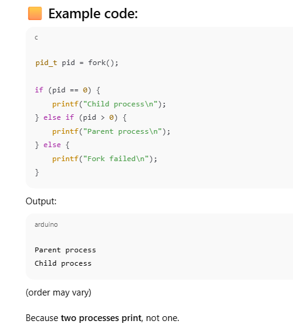

# 🟦 How many processes exist after fork()?

If 1 process calls `fork()`:

👉 **2 processes exist (parent + child)**

If 2 processes call `fork()` again → 4 processes  
If 3rd time → 8 processes

fork() duplicates processes each time it is called.

# Copy-on-Write Optimization (VERY INTERVIEW IMPORTANT)

Originally:

- fork() copied ENTIRE memory
    
- Very slow
    

Modern OS uses **Copy-on-Write (COW)**:

👉 Parent and Child **share the same memory pages** marked **read-only**  
👉 If either tries to write → OS makes a separate copy

This makes fork() extremely fast.

### 1️⃣ Creating new processes

This is how Linux creates every new process.

### 2️⃣ Used with exec()

fork() → create copy  
exec() → replace child memory with new program

Example:

`fork  ↓ exec("/bin/ls")`

### 3️⃣ Used in servers

Handling multiple clients.

# 🟥 Common interview question:

### ❓ After fork(), which parts of memory are copied?

Answer:

**Logical copy**, not physical.  
Using Copy-on-Write, parent and child share:

- Code segment
    
- Read-only data
    

Private copies only on write for:

- Heap
    
- Stack

> After **n fork() calls**, total processes = **2ⁿ**

Child processes = 2ⁿ − 1  
Parent process = 1

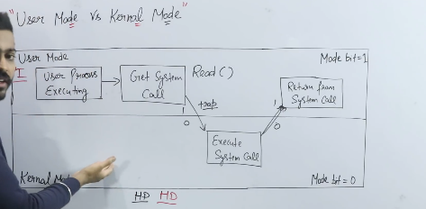

# 🟦 CPU MODES (Mode Bit)

### **Mode bit = 1 → User Mode**

Limited privileges (apps)

### **Mode bit = 0 → Kernel Mode**

Full privileges (OS)

The CPU switches this mode bit **automatically** when entering or exiting a system call.

---

# 🟩 DIAGRAM OVERVIEW (What's happening)

The board shows:

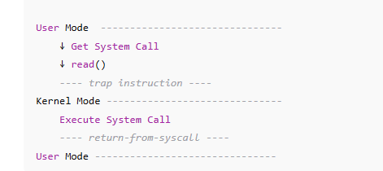

# 🟦 CPU MODES (Mode Bit)

### **Mode bit = 1 → User Mode**

Limited privileges (apps)

### **Mode bit = 0 → Kernel Mode**

Full privileges (OS)

The CPU switches this mode bit **automatically** when entering or exiting a system call.

---

# 🟩 DIAGRAM OVERVIEW (What's happening)

The board shows:

`User Mode  -------------------------------     ↓ Get System Call     ↓ read()     ---- trap instruction ---- Kernel Mode ------------------------------     Execute System Call     ---- return-from-syscall ---- User Mode -------------------------------`

Let’s break this down step-by-step.

---

# 🟧 1. User Process Executing (User Mode, mode bit = 1)

Your normal program is running.

Example:

`read(fd, buffer, size);`

At this moment:

- CPU is in **user mode**
    
- Process cannot access hardware
    
- Process cannot execute privileged instructions
    

---

# 🟨 2. Program Requests a System Call

Your code calls:

`read()`

But:  
👉 `read()` is NOT the system call  
👉 It is a **library wrapper function** (like in glibc)

This wrapper prepares registers and executes a **trap instruction**.

Example (Linux x86):

`int 0x80 syscall`

This instruction triggers:

### 🔥 **User Mode → Kernel Mode transition**

---

# 🟥 3. Trap Instruction (Mode Switch)

The trap instruction does 3 things:

1. Saves current user-mode state (PC, registers)
    
2. Switches **mode bit = 0** (enter kernel mode)
    
3. Jumps to a predefined location in the kernel syscall table
    

This is shown by the **downward arrow** into Kernel Mode in the diagram.

---

# 🟦 4. Kernel Executes System Call (Kernel Mode)

Now the OS is doing privileged work:

- Accessing the file system
    
- Reading from disk
    
- Checking permissions
    
- Copying data to user buffer
    

This is the **actual system call execution**.

On the board:  
“Execute System Call”

During this time:

- Your process is still running
    
- But running inside OS code
    
- With kernel privileges
    

---

# 🟩 5. Returning From System Call

After the OS completes work:

1. Kernel restores saved user registers
    
2. Switches **mode bit = 1** (back to user mode)
    
3. Jumps back to instruction after the system call
    

This is the **upward arrow** in the diagram.

# 🟧 6. User Process Continues Execution

Now execution is back in user mode.

Your program continues with:

`printf("Read successful");`

No longer in the kernel.

# 🟦 **What is a Process?**

A **process** is:

- A program in execution
    
- Has its **own memory space**
    
- Has its own **resources** (file handles, registers, stack, heap)
    
- Completely **independent** from other processes
    

### Key idea:

> Processes **do NOT share memory** with each other.

### Examples:

- Chrome is one process
    
- VS Code is another process
    
- Terminal is another process
    

Each has its own **address space**.

---

# 🟩 **What is a Thread?**

A **thread** is a **lightweight process** that lives **inside a process**.

### Key idea:

> Threads **share the same memory** (heap, global variables) of the process they belong to.

Each thread still has:

- Its own **stack**
    
- Its own **registers**
    
- Its own **program counter**
    

But threads inside the same process **share**:

- Heap
    
- Code
    
- Open files
    

### Example:

Chrome tabs = threads  
VS Code extensions = threads

# 🟦 Context Switching

### Process switching:

- Heavy
    
- Full context switch (all memory mappings, registers, page tables)
    
- Slow
    

### Thread switching:

- Light
    
- Only registers + stack need switching
    
- Fast

# 🟨 Inter-process Communication vs Inter-thread Communication

### Processes:

Need **IPC**:

- Pipes
    
- Message queues
    
- Shared memory
    
- Sockets
    

Because they **don’t share memory** naturally.

### Threads:

Communication is easy:

- They share the same memory
    
- Just read/write variables
    

But:  
🔥 **Requires synchronization** (mutex, semaphore) to avoid race conditions.

# 🟫 Creation Cost

|Process|Thread|
|---|---|
|Expensive|Cheap|
|OS allocates new memory|Uses same process memory|
|Heavy setup|Lightweight|

---

# 🟪 Stability

|Process|Thread|
|---|---|
|One crash does **not** kill others|One crash may kill entire process|
|Stable|Risky without synchronization|

---

# 🟩 Parallelism

- Processes → used for **heavy, isolated parallelism** (like microservices, container apps)
    
- Threads → used for **lightweight parallelism** (like handling multiple client requests)

| Feature       | Process            | Thread                |
| ------------- | ------------------ | --------------------- |
| Memory        | Separate memory    | Shared memory         |
| Communication | Hard (IPC)         | Easy                  |
| Creation      | Heavy              | Light                 |
| Switching     | Slow               | Fast                  |
| Stability     | Safe (isolated)    | Risky (shared space)  |
| Sharing       | File handles, code | Code + heap + globals |
| Example       | chrome.exe         | chrome tabs           |
# 🟦 **Processes vs Threads — One Perfect Table**

| Concept / Point                       | **Process**                                     | **Thread**                                                |
| ------------------------------------- | ----------------------------------------------- | --------------------------------------------------------- |
| **1. Definition**                     | Independent program in execution                | Lightweight unit of execution inside a process            |
| **2. Creation requires system call?** | **YES** (fork, exec → costly)                   | **NO** for user-level threads (fast)                      |
| **3. OS visibility**                  | OS sees each process separately                 | OS may see only _one_ process if threads are user-level   |
| **4. Memory space**                   | Separate memory for each process                | Shared memory within the process                          |
| **5. Copies of data/code**            | Each process has its own copy                   | All threads share same code, data, heap                   |
| **6. Stack**                          | Each process has its own stack                  | Each thread has its own stack                             |
| **7. File descriptors**               | Not shared                                      | Shared among threads                                      |
| **8. Communication**                  | Hard (requires IPC: pipes, sockets, shared mem) | Easy (read/write shared memory)                           |
| **9. Risk factor**                    | Safe — one process crash doesn’t affect others  | Risky — one thread crash can kill whole process           |
| **10. Context switching**             | Slow (changes page tables, TLB flush)           | Fast (same memory, just change stack/regs)                |
| **11. Scheduling**                    | OS schedules each process separately            | OS schedules threads _within_ the process                 |
| **12. Blocking behavior**             | Blocking one process doesn’t block others       | Blocking one thread may block entire process (user-level) |
| **13. Creation overhead**             | Heavy                                           | Lightweight                                               |
| **14. Resources used**                | More CPU + memory                               | Less CPU + memory                                         |
| **15. Use cases**                     | Isolated tasks (browsers processes, servers)    | Parallel tasks inside a program (tabs, async jobs)        |
| **16. Example**                       | `chrome.exe`, VS Code, Python interpreter       | Chrome tabs, Java threads, Go routines                    |
| **17. Crash impact**                  | Crash affects only that process                 | Crash affects all threads → whole process dies            |
# 🟦 **User-Level Threads (ULT)**

(Threads managed **in user space**, NOT by OS)

### Key idea:

> **The OS does NOT know these threads exist.**  
> The OS sees only ONE process.

### Characteristics:

- Thread creation happens using a library (pthreads, Java threads, Go routines)
    
- NO system call required → very fast
    
- Scheduling done in **user mode**, not kernel mode
    
- User decides which thread runs next
    

---

### ✅ **Advantages of ULT**

|Advantage|Why?|
|---|---|
|**1. Very fast** to create/switch|No kernel involvement|
|**2. Custom scheduling**|Application chooses scheduling algorithm|
|**3. Portable across OSes**|Because it’s user-level library|
|**4. No kernel mode switching needed**|Pure user mode = fast|

---

### ❌ **Disadvantages of ULT**

|Disadvantage|Why?|
|---|---|
|**1. If one thread blocks, ALL threads block**|Because OS thinks the whole process is blocked|
|**2. Cannot use multiple CPUs (no real parallelism)**|OS schedules only the process, not the threads|
|**3. Hard to integrate with long I/O operations**|Block the whole process|

---

### When to use ULT?

- When you need **many threads**
    
- When tasks are **small & lightweight**
    
- When you want custom thread behavior (e.g., green threads, goroutines)

# 🟥 **Kernel-Level Threads (KLT)**

(Threads managed **by the Operating System**)

### Key idea:

> **The OS knows about every thread.**  
> Each thread is scheduled **independently** by the OS.

### Characteristics:

- Thread creation involves a **system call**
    
- Kernel handles switching, scheduling
    
- True parallelism on multi-core CPUs
    

---

### ✅ **Advantages of KLT**

|Advantage|Why?|
|---|---|
|**1. Real parallelism**|Threads can run on multiple CPU cores|
|**2. If one thread blocks, others keep running**|Because OS schedules threads individually|
|**3. Better for multi-core systems**|OS distributes work across cores|
|**4. Good for CPU-bound tasks**|Each thread gets independent CPU time|

---

### ❌ **Disadvantages of KLT**

|Disadvantage|Why?|
|---|---|
|**1. Slower to create/switch**|Requires OS involvement + mode switching|
|**2. Higher overhead**|Kernel has to manage many TCBs (Thread Control Blocks)|
|**3. Less flexible**|Application cannot fully customize scheduling|

---

### When to use KLT?

- Multi-threaded web servers
    
- Databases
    
- Real parallel execution
    
- Heavy CPU tasks
    

---

---

# 🟩 **USER vs KERNEL THREADS — PERFECT TABLE**

|Feature|User-Level Thread (ULT)|Kernel-Level Thread (KLT)|
|---|---|---|
|Visibility to OS|OS sees only 1 process|OS sees every thread|
|Context switching|Very fast|Slow (kernel mode switch)|
|Blocking behavior|**One blocks = all block**|Other threads continue|
|Parallelism|**No real parallelism**|TRUE parallelism across CPUs|
|Creation cost|Cheap|Expensive|
|Scheduling|Done by user-level library|Done by OS kernel|
|System calls needed?|No|Yes|
|Switching mode|Stays in user mode|Switches between user ↔ kernel|
|Best for|Many small tasks, coroutines|CPU-heavy tasks, multithreading|
|Example|Java green threads, Go goroutines|POSIX pthreads in Linux|

---

---

# 🟦 Putting It Simply (Memory Trick)

### **ULT = Fast but Fake Parallelism**

OS sees ONE process → cannot use multiple CPUs.

### **KLT = Real Threads, Real Parallelism**

OS schedules each thread independently → uses multiple cores.

---

# 🟧 BONUS: Hybrid (Many-to-Many Model)

Most modern systems use:

> A mix of user-level + kernel-level threads  
> (e.g., threads mapped to kernel threads dynamically)