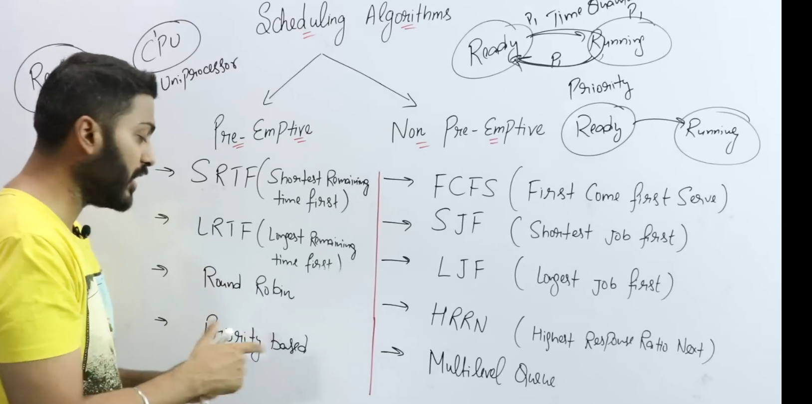
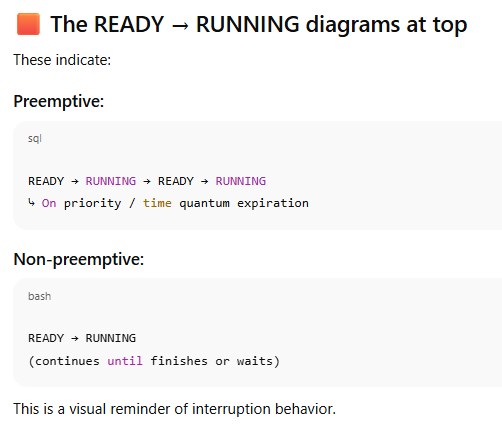
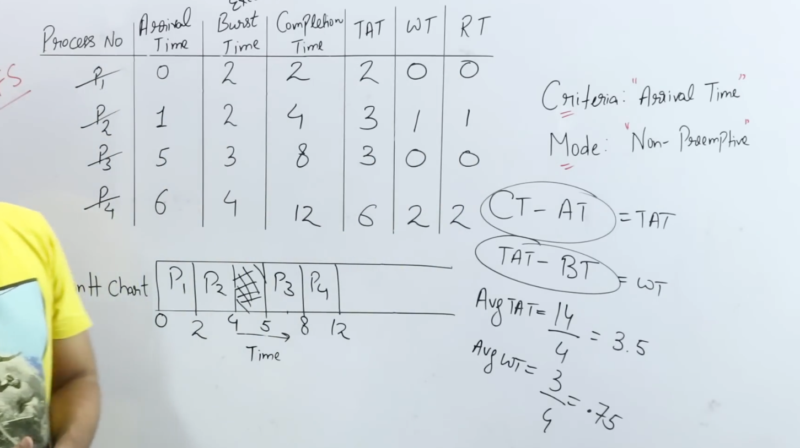
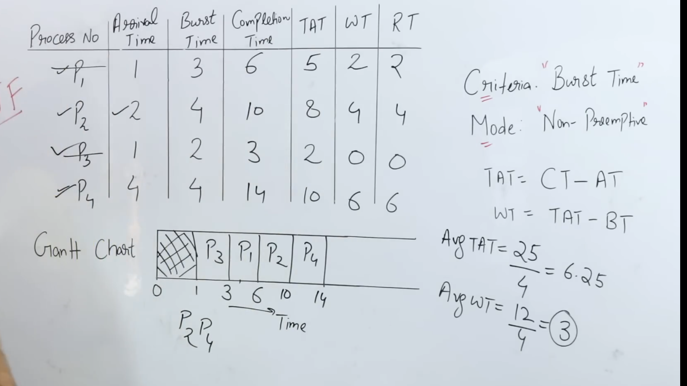
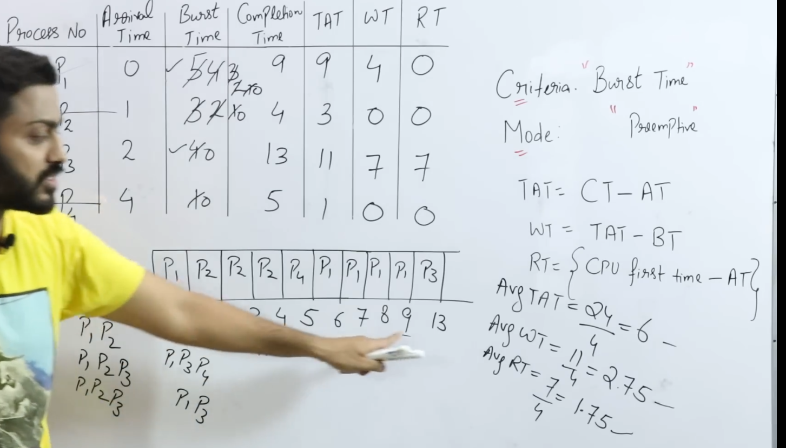
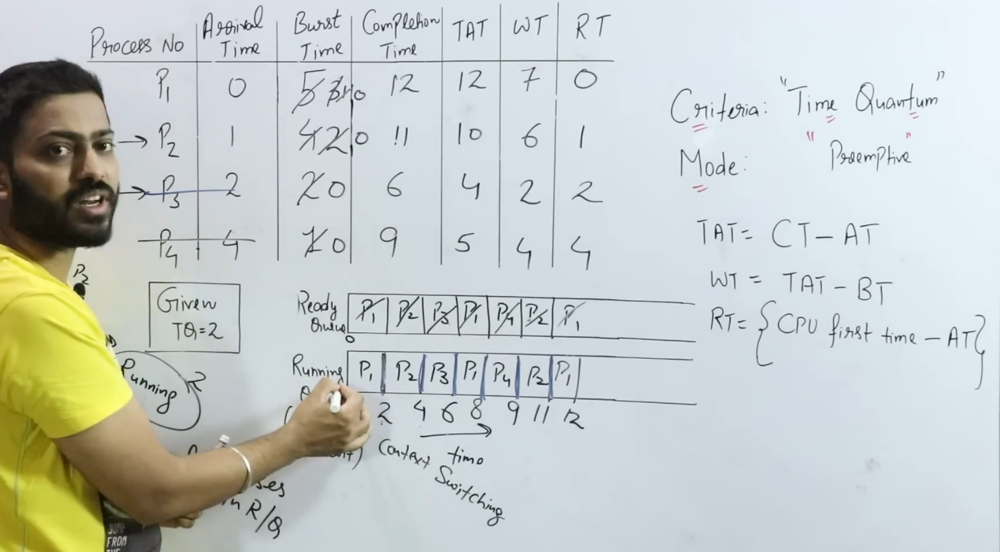

# 🟦 **Why do we need CPU Scheduling Algorithms?**

Because:

> **There are more processes than CPUs.**  
> OS must decide _which process_ gets the CPU _when_ and _for how long_.

Without a scheduling algorithm:

- Some processes might **never run**
    
- CPU might stay **idle** even when tasks exist
    
- System performance would drop
    
- Important tasks could get delayed
    

---

# 🟩 **Full Explanation (Point-by-Point)**

### **1️⃣ To maximize CPU utilization**

We want the CPU to stay **as busy as possible**.

Example:

- If one process is waiting for I/O
    
- Scheduler should immediately give CPU to another
    

Otherwise:  
❌ CPU remains idle  
❌ System becomes slow

---

### **2️⃣ To ensure fairness**

Every process should get a **fair chance** to run.

Without scheduling:

- One process could hog the CPU
    
- Others may starve (never run)
    

Schedulers prevent **starvation**, **priority inversion**, etc.

---

### **3️⃣ To minimize waiting time**

Users care about responsiveness.

Scheduling algorithms reduce:

- Average waiting time
    
- Turnaround time
    
- Response time
    

Example:

- SJF gives priority to shorter jobs to reduce average waiting.
    

---

### **4️⃣ To support multiprogramming**

More processes in memory → more efficient CPU usage.

Scheduling decides:

- Which processes stay in ready queue
    
- Which ones get swapped out (medium-term scheduler)
    

---

### **5️⃣ To improve system responsiveness**

Especially in:

- Time-sharing systems
    
- Interactive applications
    

Schedulers like **Round Robin** ensure:  
👉 Each process gets CPU for short time slices  
👉 User feels the system is responsive

Without it:  
❌ One long job can freeze the entire system.

---

### **6️⃣ To meet deadlines (Real-Time systems)**

In RTOS:

- Some tasks must complete **within a time limit**
    

Schedulers ensure:

- Hard deadlines are met
    
- Soft deadlines are optimized
    

---

### **7️⃣ To handle different goals**

Different systems have different goals:

|System Type|Scheduling Goal|
|---|---|
|Batch OS|Max throughput|
|Time-sharing OS|Min response time|
|Real-time OS|Meet deadlines|
|Server OS|Balance load|

Schedulers are chosen based on purpose.

---

# 🟥 **Perfect Interview Answer (memorize this)**

> We need scheduling algorithms because multiple processes compete for limited CPU resources.  
> A scheduler decides which process runs next to maximize CPU utilization, minimize waiting and response time, ensure fairness, keep the system responsive, and meet deadlines.  
> Without scheduling, processes could starve, the CPU could remain idle, and performance would drop.

# 🟥 **PREEMPTIVE SCHEDULING**

(Left side)

### Definition:

> OS can **interrupt** a running process and move it back to the ready queue.

This is used in:

- Multitasking
    
- Time-sharing OS
    
- Real-time scheduling
    

Processes are _forcibly_ stopped when:

- Time quantum expires
    
- Higher priority process arrives
    
- Interrupt occurs

# 🟦 **NON-PREEMPTIVE SCHEDULING**

(Right side)

### Definition:

> Once a process gets the CPU, it runs until it completes or blocks.

OS does **not interrupt** a running process.

Used in:

- Batch systems
    
- Simple schedulers
    
- Systems where context switching is costly

### **Preemptive algorithms:**

- SRTF
    
- LRTF
    
- Round Robin
    
- Priority (preemptive)
    

👉 OS can forcibly take away CPU.

---

### **Non-preemptive algorithms:**

- FCFS
    
- SJF
    
- LJF
    
- HRRN
    
- Multilevel Queue
    

👉 CPU is relinquished by the process itself.

# 🟦 **1. Arrival Time (AT)**

**Definition:**

> The time at which a process enters the ready queue.

Meaning:

- When the process becomes available for execution
    
- Before this time, it cannot run
    

Example:  
If P1 arrives at time = 2, it cannot run before time 2.

---

# 🟩 **2. Burst Time (BT)**

**Definition:**

> The total CPU time a process needs to complete.

It's the time the process needs **on CPU only**, not including waiting time.

Example:  
If burst time = 5 ms → needs 5 ms of CPU to finish.

---

# 🟧 **3. Completion Time (CT)**

**Definition:**

> The exact time when the process finishes execution.

This depends on:

- Scheduling order
    
- Preemption
    
- Arrival time
    
- Waiting time
    

Example:  
If a process finishes at time 20 → CT = 20.

---

# 🟨 **4. Turnaround Time (TAT)**

**Formula on board:**

Turnaround Time=Completion Time−Arrival Time\text{Turnaround Time} = \text{Completion Time} - \text{Arrival Time}Turnaround Time=Completion Time−Arrival Time

**Meaning:**  
How long the process lived in the system from arrival → finish.

Example:  
Arrival = 2  
Completion = 12  
TAT = 10

This includes both waiting + running time.

---

# 🟥 **5. Waiting Time (WT)**

**Formula on board:**

Waiting Time=Turnaround Time−Burst Time\text{Waiting Time} = \text{Turnaround Time} - \text{Burst Time}Waiting Time=Turnaround Time−Burst Time

Because:

- Turnaround time = Waiting time + CPU time
    
- So, waiting = TAT − BT
    

This is time spent in the **ready queue**, not on CPU.

Example:  
TAT = 10  
BT = 4  
WT = 6 (waiting in ready queue)

---

# 🟩 **6. Response Time (RT)**

**Formula on board:**

Response Time=(First time the process gets CPU)−(Arrival Time)\text{Response Time} = (\text{First time the process gets CPU}) - (\text{Arrival Time})Response Time=(First time the process gets CPU)−(Arrival Time)

Meaning:

> Time from arrival until the process **first starts executing**.

Important:

- In preemptive algorithms (like RR or SRTF), response time may be smaller than waiting time.
    
- Process may start, run a little, get preempted, and continue later.
    

Example:  
Arrival = 0  
Gets CPU for first time at = 5  
RT = 5

---

# 🟦 SUMMARY TABLE (easy to memorize)

| Metric                | Formula          | Meaning              |
| --------------------- | ---------------- | -------------------- |
| Arrival Time (AT)     | Given            | When process comes   |
| Burst Time (BT)       | Given            | CPU time required    |
| Completion Time (CT)  | From Gantt chart | When process ends    |
| Turnaround Time (TAT) | CT – AT          | Total time in system |
| Waiting Time (WT)     | TAT – BT         | Time spent waiting   |
| Response Time (RT)    | First CPU – AT   | First response delay |

# FCFS
# 🟦 **1. What is FCFS?**

FCFS = **First Come First Serve**  
Processes are executed **in order of arrival time**.

👉 No preemption  
👉 Once CPU is given, process runs until completion  
👉 Works like a **queue** (FIFO)

---

# 🟩 **2. How FCFS Works**

Rules:

- The process with **earliest arrival time** runs first.
    
- If two processes arrive at the same time → tie broken by **process ID**.
    
- CPU stays with a process until it finishes (non-preemptive).
    

---

# 🟥 **3. FCFS Gantt Chart Steps**

To solve a problem:

### Step 1 → Sort processes by arrival time

### Step 2 → Make a Gantt chart in same order

### Step 3 → Fill Completion Time (CT)

### Step 4 → Calculate:

- TAT = CT − AT
    
- WT = TAT − BT
    
- RT = WT (for FCFS, response time = waiting time)

# 🟥 ** Advantages of FCFS**

👍 Simple to understand  
👍 Fair (in terms of arrival order)  
👍 No starvation

---

# 🟧 ** Disadvantages of FCFS**

❌ **Convoy Effect**  
A long process at the front delays all others.

❌ Poor average waiting time  
❌ Not suitable for time-sharing systems  
❌ Response time can be bad

---

# 🟩 ** Quick Interview Summary**

> FCFS is a non-preemptive scheduling algorithm that executes processes in arrival order. It is simple but suffers from high waiting times and convoy effect.

# SJF
# **What is SJF?**

SJF = **Shortest Job First**  
The process with the **smallest burst time** is executed first.

👉 **NON-preemptive** version  
(Once a process gets CPU, it continues until completion.)

This is the **optimal algorithm** for minimizing **average waiting time**.

---

# 🟩 **Rules of SJF**

1️⃣ Among all processes that have **arrived**, choose the one with **smallest burst time**.  
2️⃣ If a process arrives later, it will only be considered **when it arrives**.  
3️⃣ No preemption → if a long job is running, it won’t be interrupted.

---

# 🟥 **Step-by-Step Method to Solve SJF**

### Step 1 → List Arrival Time (AT) and Burst Time (BT)

### Step 2 → At each time moment, check available processes

### Step 3 → Pick process with **smallest BT**

### Step 4 → Update CT, TAT, WT, RT

# 🟥 ADVANTAGES OF SJF

✅ Minimum average waiting time  
✅ Very efficient  
✅ Ideal for batch jobs

---

# 🟧 DISADVANTAGES OF SJF

❌ Need to know burst time in advance  
❌ Starvation possible (long jobs may never get CPU)  
❌ Not suitable for interactive systems

---

# 🟦 QUICK INTERVIEW SUMMARY

> SJF schedules the process with the smallest burst time first. It is non-preemptive and gives the minimum average waiting time but suffers from starvation and requires prior knowledge of burst times.

Hamesha pehle check karna hai kitne arrive hue is time par and then iske bad criteria check karna hai!!

# SRTF

# 🟥 **What is SRTF?**

SRTF = **Shortest Remaining Time First**

### Key idea (VERY IMPORTANT):

> At any moment, CPU selects the process with the **least remaining burst time**.

### Preemptive?

👉 **Yes.**  
If a new process arrives with a shorter remaining time than the running one, **preemption occurs**.

---

# 🟦 Rules of SRTF

1️⃣ Always choose the process with the **shortest remaining time**.  
2️⃣ If a new process arrives with smaller BT → **preempt** current process.  
3️⃣ Continue until all processes finish.

# 🟧 Advantages of SRTF

👍 Optimal for minimizing **average waiting time**  
👍 Responds early to short jobs  
👍 Better than SJF for dynamic arrivals

---

# 🟥 Disadvantages of SRTF

❌ Can cause starvation for long processes  
❌ Needs exact burst time knowledge  
❌ More complex (frequent preemption)

---

# 🟦 QUICK INTERVIEW SUMMARY

> SRTF is the preemptive version of SJF. At any moment, it selects the process with the shortest remaining time. It preempts the running process if a new one with a smaller remaining burst arrives. It gives minimum average waiting time but may cause starvation.

## **Round Robin** 
# 🟦 **What is Round Robin Scheduling?**

**Round Robin (RR)** is a **preemptive** CPU scheduling algorithm designed for **time-sharing systems**.

### Core idea:

> Each process gets the CPU for a **fixed time slice (time quantum)** in a cyclic order.

If a process doesn’t finish within its time quantum:

- It is **preempted**
    
- Moved to the **end of the ready queue**
    

---

# 🟩 **Key Properties**

- ⏱ **Time Quantum (TQ)** is mandatory (e.g., 2 ms, 4 ms)
    
- 🔁 Uses **circular queue**
    
- ⚡ Preemptive
    
- ⚖️ Fair — no starvation
    

---

# 🟥 **How Round Robin Works (Rules)**

1️⃣ Pick first process from ready queue  
2️⃣ Run it for **min(BT, TQ)**  
3️⃣ If process finishes → remove it  
4️⃣ If not finished → put it at **end of queue**  
5️⃣ Repeat until all processes finish

# 🟩 **Effect of Time Quantum (VERY IMPORTANT)**

### 🔹 If TQ is **too small**

- Too many context switches
    
- High overhead
    

### 🔹 If TQ is **too large**

- RR behaves like **FCFS**
    

👉 Ideal TQ is chosen experimentally.

---

# 🟥 **Advantages of Round Robin**

✅ Fair (no starvation)  
✅ Good response time  
✅ Suitable for time-sharing & interactive systems

---

# 🟧 **Disadvantages of Round Robin**

❌ Average waiting time can be high  
❌ Performance depends heavily on time quantum  
❌ Too many context switches if TQ is small

---

# 🟦 **Quick Interview Summary**

> Round Robin is a preemptive scheduling algorithm where each process is assigned a fixed time quantum in a cyclic order. If a process doesn’t finish within the quantum, it is preempted and placed at the end of the ready queue. It ensures fairness and good response time but depends heavily on the choice of time quantum.

## Priority **Scheduling**

# 🟦 **What is Priority Scheduling?**

In **Priority Scheduling**, the CPU is allocated to the process with the **highest priority**.

> **Lower number = higher priority** (this is the common convention in exams & interviews).

# 🟩 Types of Priority Scheduling

1️⃣ **Non-Preemptive Priority Scheduling**  
2️⃣ **Preemptive Priority Scheduling**

---

## 🟥 **1. Non-Preemptive Priority Scheduling**

### Rule:

- CPU is given to the **highest-priority ready process**
    
- Once a process starts, it **runs till completion**
    
- No interruption
### 🟦 Key points (Non-Preemptive)

✅ Simple  
❌ Poor response time  
❌ High waiting time for low-priority processes

## 🟥 **2. Preemptive Priority Scheduling**

### Rule:

- CPU always runs the **highest-priority process**
    
- If a new process arrives with **higher priority**, it **preempts** the running one
# 🟧 **Starvation Problem (VERY IMPORTANT)**

### What is starvation?

Low-priority processes may **never get CPU** if high-priority processes keep arriving.

This affects **both** preemptive and non-preemptive priority scheduling.

---

# 🟩 **Solution: Aging**

### Aging:

- Gradually **increase priority** of waiting processes
    
- Ensures every process eventually runs
    

> Aging prevents starvation.

# 🟦 **Preemptive vs Non-Preemptive (Quick Table)**

|Feature|Non-Preemptive|Preemptive|
|---|---|---|
|CPU taken forcibly?|❌ No|✅ Yes|
|Response time|Poor|Good|
|Context switches|Few|More|
|Complexity|Simple|Complex|
|Used in|Batch systems|Real-time, interactive|

---

# 🟥 **Interview-Perfect Summary**

> Priority scheduling assigns CPU to the highest-priority process. In non-preemptive priority scheduling, a running process is not interrupted, while in preemptive priority scheduling, a higher-priority arriving process can preempt the current one. Priority scheduling may cause starvation, which is solved using aging.

## Multilevel Queue **Scheduling**

# 🟦 What is Multilevel Queue Scheduling?

**Multilevel Queue Scheduling** divides the **ready queue into multiple separate queues**,  
each queue meant for a **different type of process**.

👉 **Each queue has its own scheduling algorithm**  
👉 **Processes are permanently assigned to one queue**  
👉 **No movement between queues**

This last point is the KEY difference.

---

# 🟩 Why do we need Multilevel Queue Scheduling?

Because **not all processes are the same**.

Examples:

- System processes → very critical
    
- Interactive processes → need fast response
    
- Batch jobs → long-running, low priority
    

Using one scheduler for all is inefficient.

---

# 🟦 Basic Structure (Very Important)

Example of queues (top = highest priority):

`Queue 1: System Processes        → Priority / RR Queue 2: Interactive Processes   → Round Robin Queue 3: Batch Processes         → FCFS`

The CPU always checks:  
1️⃣ Queue 1  
2️⃣ If empty → Queue 2  
3️⃣ If empty → Queue 3

---

# 🟥 Key Rules of MLQ

1️⃣ Ready queue is split into **multiple queues**  
2️⃣ Each queue has:

- its own priority
    
- its own scheduling algorithm  
    3️⃣ **Fixed priority between queues** (usually)  
    4️⃣ **Processes cannot move between queues**

# 🟧 Scheduling Between Queues

Two common methods:

### 🔹 1. Fixed Priority Scheduling (most common)

- Higher-priority queue **always runs first**
    
- Lower queues may starve
    

Example:

> System queue always preempts batch queue

---

### 🔹 2. Time Slicing Between Queues

- Each queue gets a fixed CPU percentage
    

Example:

- System queue → 60%
    
- Interactive queue → 30%
    
- Batch queue → 10%
    

This reduces starvation.

---

# 🟨 Scheduling Within Each Queue

Each queue uses a **different algorithm**:

|Queue Type|Scheduling Algorithm|
|---|---|
|System|Priority / FCFS|
|Interactive|Round Robin|
|Batch|FCFS|

So MLQ = **multiple schedulers working together**.

# Example Scenario (Interview-Friendly)

Processes are classified as:

|Process Type|Queue|Algorithm|
|---|---|---|
|Keyboard input|System|Priority|
|Browser|Interactive|RR|
|Data processing|Batch|FCFS|

CPU behavior:

- Always serve system tasks first
    
- Then interactive
    
- Batch runs only when others are idle
    

---

# 🟥 Advantages of Multilevel Queue Scheduling

✅ Clear separation of process types  
✅ Fast response for critical processes  
✅ Easy to implement  
✅ Suitable for systems with well-defined workloads

---

# 🟧 Disadvantages of Multilevel Queue Scheduling

❌ **Starvation** of lower-priority queues  
❌ Inflexible (no movement between queues)  
❌ Not adaptive to process behavior

---

# 🟦 MLQ vs Priority Scheduling (Important)

| Feature          | Priority Scheduling | Multilevel Queue |
| ---------------- | ------------------- | ---------------- |
| Queues           | Single ready queue  | Multiple queues  |
| Process movement | Yes                 | ❌ No             |
| Algorithms       | One                 | Multiple         |
| Flexibility      | More                | Less             |

## **MLFQ (Multilevel Feedback Queue)** ****

# What is MLFQ?

**MLFQ = Multilevel Feedback Queue Scheduling**

It is an **advanced version of Multilevel Queue (MLQ)** where:

> **Processes are allowed to MOVE between queues based on their behavior.**

That one line is the essence.

# 🟩 Why MLFQ is needed (Motivation)

Problems with earlier algorithms:

- **FCFS** → bad response time
    
- **SJF/SRTF** → need burst time in advance
    
- **Priority** → starvation
    
- **MLQ** → no flexibility (process stuck in one queue)
    

👉 **MLFQ solves all these without knowing burst time beforehand.**

# 🟥 Rules of MLFQ (Memorize for Interviews)

### Rule 1️⃣

If a process **uses full time quantum**,  
👉 **demote it** to lower queue.

### Rule 2️⃣

If a process **yields CPU early (I/O request)**,  
👉 **keep it in same or higher queue**.

### Rule 3️⃣

CPU always runs process from **highest non-empty queue**.

### Rule 4️⃣

Lower queues have **larger time quantum**.

### Rule 5️⃣

To prevent starvation → **priority boosting** is used.

# 🟨 Why it’s called **Feedback** Queue?

Because the scheduler **learns from past behavior**:

- “You used full CPU → you’re CPU-bound → lower priority”
    
- “You released CPU early → you’re interactive → higher priority”
    

👉 Scheduling is **dynamic**, not fixed.

---

# 🟥 Starvation Problem & Solution

### Problem:

Low-priority processes may starve.

### Solution: **Priority Boosting**

- After a fixed interval:
    
    - Move **all processes back to top queue**
        
    - Reset priorities
        

This guarantees fairness.

---

# 🟦 MLFQ vs MLQ (VERY COMMON QUESTION)

|Feature|MLQ|MLFQ|
|---|---|---|
|Process movement|❌ No|✅ Yes|
|Adaptiveness|❌ No|✅ Yes|
|Starvation handling|Poor|Good|
|Burst time needed|No|No|
|Complexity|Simple|Complex|
|Used in real OS|Rare|**YES**|

---

# 🟩 Real-World Usage

MLFQ-like schedulers are used in:

- **Unix / Linux (CFS is inspired by it)**
    
- **Windows scheduler**
    
- **macOS scheduler**
    

---

# 🟥 Interview-Perfect Summary (Memorize)

> Multilevel Feedback Queue Scheduling is an adaptive scheduling algorithm that uses multiple priority queues and allows processes to move between them based on CPU usage behavior. It favors interactive and I/O-bound processes while gradually lowering priority of CPU-bound processes, thus achieving good response time and fairness without prior knowledge of burst time.

# 🟦 **Comparison Table of ALL CPU Scheduling Algorithms**

|Algorithm|Preemptive?|Selection Basis|Response Time|Avg Waiting Time|Starvation|Use Case / Notes|
|---|---|---|---|---|---|---|
|**FCFS** (First Come First Serve)|❌ No|Arrival order|❌ Poor|❌ High|❌ No|Simple, causes **convoy effect**, batch systems|
|**SJF** (Shortest Job First)|❌ No|Shortest burst time|❌ Poor|✅ **Minimum**|⚠️ Yes|Optimal WT but needs BT in advance|
|**SRTF** (Shortest Remaining Time First)|✅ Yes|Shortest remaining time|✅ Very good|✅ **Minimum**|⚠️ Yes|Preemptive SJF, complex|
|**LJF** (Longest Job First)|❌ No|Longest burst time|❌ Very poor|❌ Very high|⚠️ Yes|Rarely used (theoretical)|
|**LRTF** (Longest Remaining Time First)|✅ Yes|Longest remaining time|❌ Poor|❌ High|⚠️ Yes|Opposite of SRTF, uncommon|
|**Round Robin (RR)**|✅ Yes|Time quantum (cyclic)|✅ **Good**|⚠️ Medium|❌ No|Best for **time-sharing**, depends on TQ|
|**Priority (Non-preemptive)**|❌ No|Highest priority|❌ Poor|⚠️ Medium|⚠️ Yes|Simple but unfair|
|**Priority (Preemptive)**|✅ Yes|Highest priority|✅ Good|⚠️ Medium|⚠️ Yes|Used in real-time systems|
|**HRRN** (Highest Response Ratio Next)|❌ No|(WT+BT)/BT|⚠️ Medium|✅ Low|❌ No|Fixes SJF starvation|
|**Multilevel Queue (MLQ)**|⚠️ Depends|Queue priority|✅ High (top queues)|❌ High (low queues)|⚠️ Yes|No movement between queues|
|**Multilevel Feedback Queue (MLFQ)**|✅ Yes|Behavior-based|✅ **Excellent**|⚠️ Balanced|❌ No|**Most practical**, adaptive|
|**Real-Time (EDF, RMS)**|✅ Yes|Deadlines|✅ Guaranteed|—|❌ No|Hard/Soft real-time systems|

---

# 🧠 **One-Glance Takeaways (VERY IMPORTANT)**

### 🔹 Best average waiting time

➡ **SJF / SRTF**

### 🔹 Best response time (interactive systems)

➡ **Round Robin / MLFQ**

### 🔹 No starvation

➡ **FCFS, RR, HRRN, MLFQ**

### 🔹 Most practical & used in real OS

➡ **MLFQ-inspired schedulers**

### 🔹 Simplest algorithm

➡ **FCFS**

---

# 🟥 **Interview Power Lines (Memorize 2–3)**

- _“SJF and SRTF minimize average waiting time but may cause starvation.”_
    
- _“Round Robin is preferred in time-sharing systems due to fairness and good response time.”_
    
- _“MLFQ is adaptive and does not require prior knowledge of burst time.”_
    
- _“Priority scheduling may cause starvation, which is solved using agin_