## Process **Synchronization**

Only when processes are cooperative and share resources

# 🟩 Two Types of Processes (on the board)

## 1️⃣ **Independent Processes**

### Definition:

Processes that **do NOT share anything**.

They have:

- Separate memory
    
- Separate variables
    
- Separate resources
    

### Example:

- Chrome process
    
- VS Code process
    
- Terminal process
    

### Key point:

> Independent processes **cannot affect each other’s execution**.

### So:

❌ No race condition  
❌ No synchronization needed

---

## 2️⃣ **Cooperative Processes** ✅ (CIRCLED ON BOARD)

### Definition:

Processes (or threads) that **share something**.

The board lists shared items:

- **Shared Variable**
    
- **Shared Memory**
    
- **Shared Code**
    
- **Shared Resources**
    
    - CPU
        
    - Printer
        
    - Scanner
        

### Key point:

> Execution of one process **can affect** another.

This is where problems begin.

---

# 🟥 WHY Cooperative Processes Need Synchronization

Because:

- Multiple processes access **same memory**
    
- Multiple processes update **same variable**
    
- Multiple processes use **same resource**
    

This leads to:  
❌ Race condition  
❌ Inconsistent data  
❌ Wrong output

Hence:  
👉 **Synchronization is required**

Example:
- **Shared variable**:
    
    `int shared = 5;`
    
- **Uniprocessor system** (important!)
    
- Two processes running **concurrently**:
    
    - **P1**
        
    - **P2**
        

Even on a **single CPU**, race condition happens due to **context switching**.

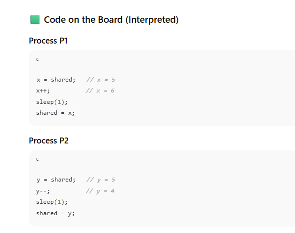

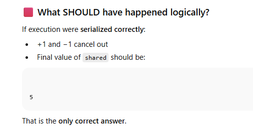

## 🟧 What ACTUALLY happens (Race Condition)

Because of **context switching**, execution interleaves like this:

### Possible execution order:

1. P1 reads `shared = 5`
    
2. P2 reads `shared = 5`
    
3. P1 increments → 6
    
4. P2 decrements → 4
    
5. P1 writes `shared = 6`
    
6. P2 writes `shared = 4`
    

👉 Final value = **4**

OR

Another order:

1. P2 writes first
    
2. P1 writes last
    

👉 Final value = **6**

## 🟦 Why does this happen?

Because:

- `shared++` and `shared--` are **NOT atomic**
    
- They internally do:
    
    - Read
        
    - Modify
        
    - Write
        
- Context switch can happen **between these steps**
    

This is the definition of **race condition**.

## 🟥 Why this happens even on a UNIPROCESSOR?

Very important point from the board:

> ❗ **Parallel ≠ Simultaneous**

On a single CPU:

- Only one process runs at a time
    
- But OS switches rapidly
    
- This interleaving causes race condition

## 🟦 How to FIX this? 

This problem occurs because the **critical section** is not protected.

Solution:

- Mutual Exclusion using:
    
    - Mutex
        
    - Semaphore
        
    - Spinlock
        

We’ll do that next.

## 🔴 What does **“NOT atomic”** mean?

### **Atomic = indivisible**

> An atomic operation **cannot be interrupted**.

If something is atomic:

- Either it **fully happens**
    
- Or it **doesn’t happen at all**
    
- No one else can see it **half done**

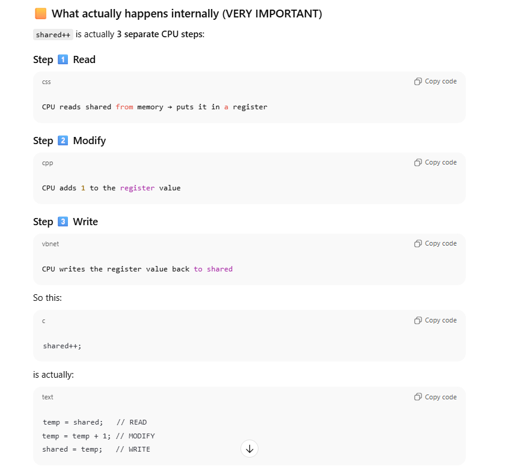

## 🔥 Where does the problem happen?

### **Context switch can happen BETWEEN these steps**

Meaning:

- OS can stop one process
    
- Run another process
    
- Then come back later

## 🟦 That’s the CORE of the problem

The problem is **NOT**:

- Two CPUs
    
- Parallel hardware
    

The problem **IS**:

- One operation is broken into steps
    
- Context switch happens in between
    
- Another process changes the same data
    

---

## 🟥 So what is a **Race Condition**, in simple words?

> A race condition happens when multiple processes access shared data, and the final result depends on **who runs first**.

If timing changes → output changes → **BUG**.

## What is the Producer–Consumer Problem?

It is a **classic synchronization problem** where:

- **Producer** produces items (data)
    
- **Consumer** consumes items
    
- They share a **common buffer**
    

👉 The buffer has **limited size**

## 🟩 Real-life analogy (very important)

Think of:

- A **factory (producer)** making products
    
- A **store shelf (buffer)** with limited space
    
- A **customer (consumer)** buying products
    

Rules:

- Producer **cannot produce** if shelf is full
    
- Consumer **cannot consume** if shelf is empty
    
- Both access the **same shelf**

## 🟥 Why is this a problem?

Because producer and consumer run **concurrently** and share:

- Buffer
    
- Counters
    
- Memory
    

Without synchronization:

- Producer may overwrite data
    
- Consumer may read garbage
    
- Race condition occurs

## Producer Consumer **Problem**

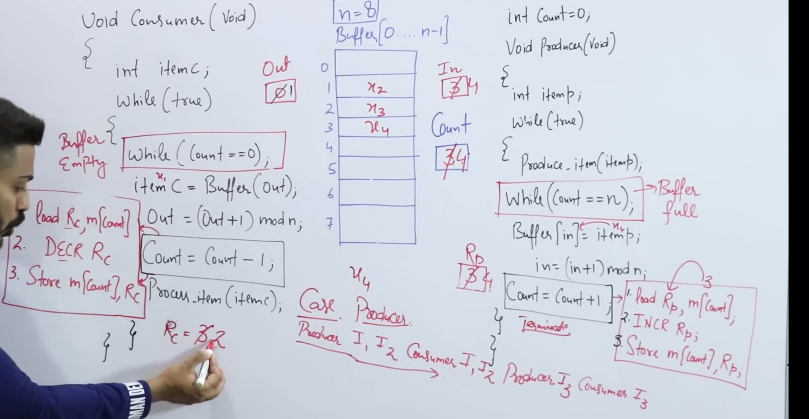

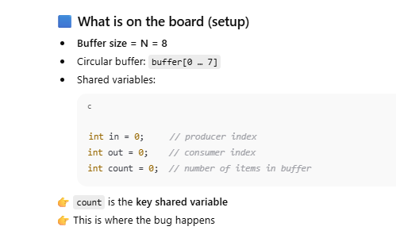

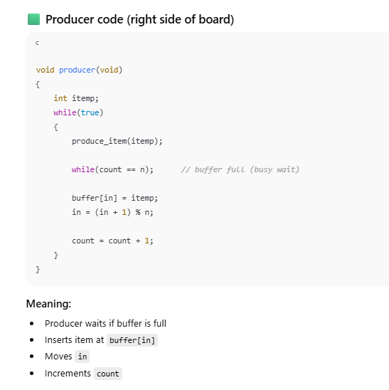

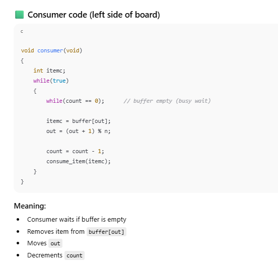

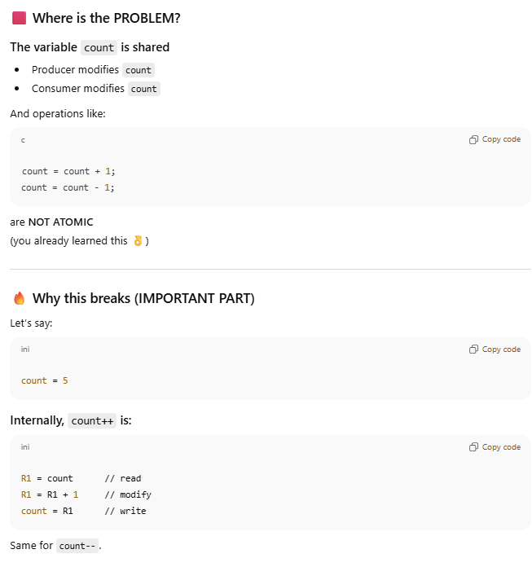

## Race Condition Scenario (from board notes)

### Step-by-step interleaving:

1. **Producer reads count = 5**
    
2. Context switch
    
3. **Consumer reads count = 5**
    
4. Consumer decrements → writes `count = 4`
    
5. Context switch
    
6. Producer increments → writes `count = 6`
    

### ❌ Final count = 6

### ❌ Correct value should be = 5

👉 **This is exactly what the board is highlighting in red**

---

## 🟦 Why `while(count == 0)` and `while(count == n)` are NOT enough

Because:

- They only **check**
    
- They do NOT **protect**
    

Between check and update:

- Another process can run
    
- Shared data becomes inconsistent
    

This is classic **check–then–act race condition**.

---

## 🟥 Core Problem (one line)

> Multiple processes are reading and writing `count` concurrently without mutual exclusion.

---

## 🟩 This is WHY we need synchronization primitives

What’s missing here?

✅ Mutual exclusion  
✅ Atomic update of `count`  
✅ Proper blocking (not busy waiting)

Which is why we introduce:

- **Mutex**
    
- **Semaphore (`empty`, `full`, `mutex`)**

## 🟦 How semaphore solution FIXES this (connection)

In the correct solution:

- `count` is **never directly manipulated**
    
- `empty` and `full` semaphores replace it
    
- `mutex` ensures only one process touches buffer at a time
    

This removes:  
❌ race condition  
❌ inconsistent count  
❌ busy waiting

---

## 🟧 Interview-ready conclusion (MEMORIZE)

> The unsynchronized producer–consumer solution fails because `count++` and `count--` are non-atomic operations. Concurrent access causes race conditions, leading to incorrect buffer state. This is solved using semaphores to ensure mutual exclusion and proper synchronization.

## 🟦 What is a Critical Section?

> A **critical section** is a part of a program where **shared data or shared resources are accessed or modified**.

In simple words:  
👉 **The dangerous part of code**  
👉 Where race condition can happen

## 🟥 Why is it called “critical”?

Because:

- If **two processes enter it at the same time**
    
- Data becomes **incorrect**
    
- Program breaks
    

So:

> Only **ONE process** should execute critical section **at a time**

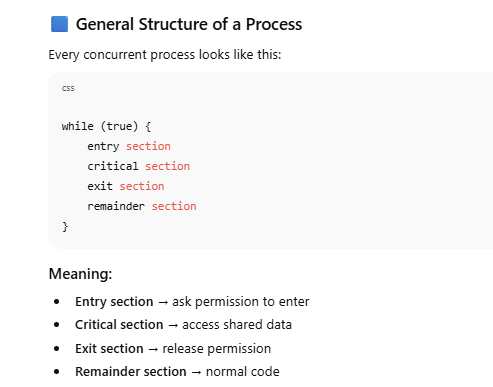

> The **Critical Section Problem** is to design a protocol that allows multiple processes to share data **without conflict**, ensuring correctness.

In short:  
👉 **How do we control entry into critical section?**

---

## 🟥 What MUST be guaranteed? (VERY IMPORTANT)

Any correct solution must satisfy **ALL 3 conditions** 👇

---

### ✅ 1️⃣ Mutual Exclusion

> **Only one process** can be inside the critical section at a time.

If P1 is inside:  
❌ P2 must NOT enter

This is **mandatory**.

---

### ✅ 2️⃣ Progress

> If no process is in the critical section, **some waiting process must be allowed to enter**.

Meaning:

- Decision cannot be postponed forever
    
- OS must not freeze entry
    

---

### ✅ 3️⃣ Bounded Waiting

> There must be a **limit** on how long a process waits before entering the critical section.

This prevents:  
❌ **Starvation**

Every process will eventually get a chance.

## 🟦 Why is this problem HARD?

Because of:

- **Context switching**
    
- **Preemptive scheduling**
    
- **Non-atomic operations**
    
- **Multiple CPUs (or concurrency illusion)**
    

Even on a **single CPU**, race condition occurs.

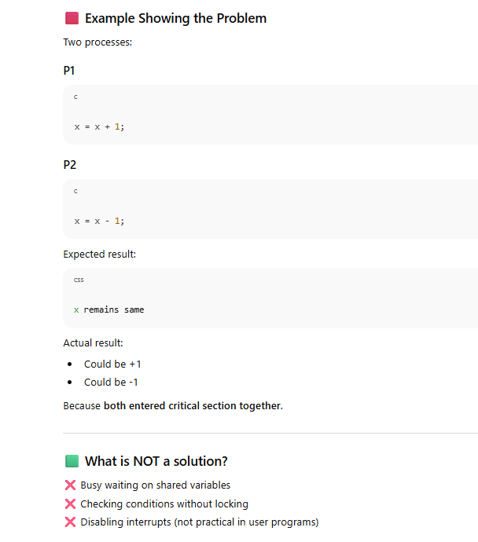

## 🟦 How is the problem solved? (Preview)

Solutions include:

- **Mutex (lock)**
    
- **Semaphore**
    
- **Peterson’s Algorithm**
    
- **Monitors**
    
- **Atomic instructions**
    

All of these are **ways to control entry** to the critical section.

---

## 🟧 One-line Interview Definition (MEMORIZE)

> The critical section problem is the problem of designing a protocol that ensures mutual exclusion, progress, and bounded waiting when multiple processes access shared resources concurrently.

## “Synchronization Mechanism – 4 Conditions / Rules”

This is the **heart of the Critical Section problem**.  
Any solution (mutex, semaphore, Peterson, etc.) is **CORRECT only if it satisfies ALL these**.

---

## ✅ **1️⃣ Mutual Exclusion** (Primary condition)

> **At most ONE process can be in the critical section at any time.**

From the board:

- P1 and P2 both have a **critical section**
    
- If P1 is inside CS → P2 **must wait**
    

Why this exists:

- Prevents race condition
    
- Protects shared data
    

If this fails → ❌ synchronization is useless.

---

## ✅ **2️⃣ Progress**

> If no process is in the critical section, **some waiting process must be allowed to enter**.

Meaning:

- The system should not “freeze”
    
- Decision of who enters CS **cannot be postponed indefinitely**
    
- Only **interested processes** participate in the decision
    

Example:

- CS is empty
    
- P1 and P2 want to enter
    
- OS must allow one of them to enter
    

---

## ✅ **3️⃣ Bounded Waiting**

> There must be a **limit** on how many times other processes can enter CS **before a waiting process gets its turn**.

Why this matters:

- Prevents **starvation**
    

Example:

- P1 keeps entering CS
    
- P2 waits forever ❌ (NOT allowed)
    

Bounded waiting guarantees:  
👉 Every process eventually enters CS

---

## ✅ **4️⃣ No Assumption about Hardware Speed**

_(Often ignored, but VERY important conceptually)_

> The solution must **NOT assume anything** about:

- CPU speed
    
- Number of CPUs
    
- Relative execution speed of processes
    

Why?

- OS must work on **slow, fast, single-core, multi-core systems**
    
- Correctness should not depend on timing
    

This is why **“just sleep()” is NOT a solution**.

## **Critical Section solution using a LOCK VARIABLE.**

## 🟦 What is a Lock Variable?

A **lock variable** is a shared variable used to indicate:

- `LOCK = 0` → Critical Section is **FREE**
    
- `LOCK = 1` → Critical Section is **BUSY**
    

Only one process should enter CS when `LOCK = 0`.

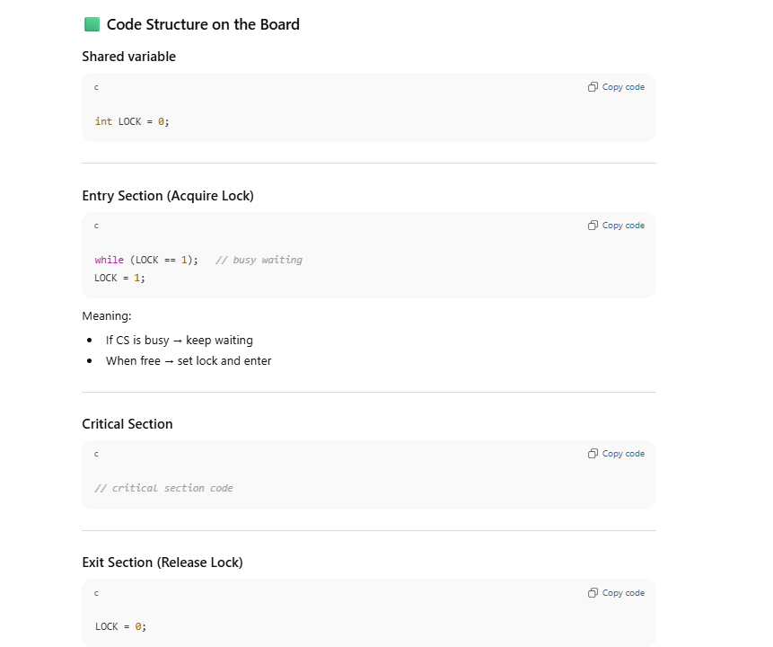

## 🟦 Full Flow (Single Process – looks fine)

1. Process checks `LOCK`
    
2. If `LOCK == 0` → enters
    
3. Sets `LOCK = 1`
    
4. Executes CS
    
5. Sets `LOCK = 0` and exits
    

So far → looks correct.

---

## 🟥 WHY THIS FAILS (VERY IMPORTANT)

This solution **DOES NOT guarantee mutual exclusion**.

### Reason:

The **check and set are NOT atomic**.

Let’s see the failure case 👇

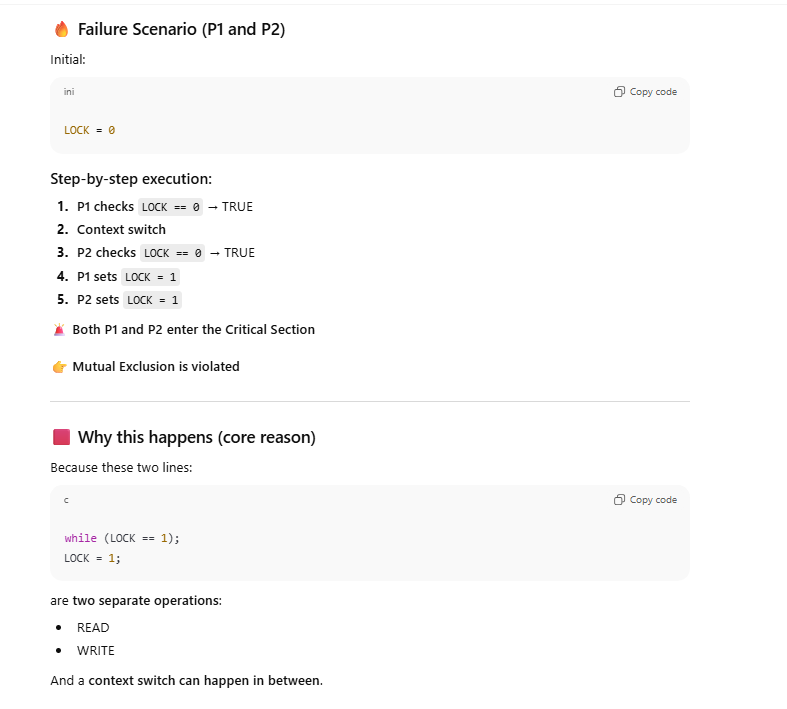

## 🟦 Which Critical Section conditions fail?

|Condition|Status|
|---|---|
|Mutual Exclusion|❌ FAIL|
|Progress|⚠️ Uncertain|
|Bounded Waiting|❌ FAIL|
|Hardware independence|❌ FAIL|

---

## 🟩 Important Board Notes Explained

### “Execute in User Mode”

- User-level code
    
- No atomic instruction
    
- No hardware support
    

### “Multiprocess Solution”

- Works incorrectly when multiple processes exist
    

### “No Mutual Exclusion Guarantee”

✅ Correct — this solution is **unsafe** because a simple lock variable solution fails because checking and setting the lock are not atomic operations, allowing multiple processes to enter the critical section simultaneously.

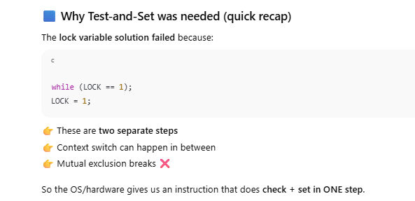

## 🟥 What is Test-and-Set?

> **Test-and-Set is a hardware-supported atomic instruction** that:
> 
> - Reads a variable
>     
> - Sets it to 1
>     
> - Returns the old value  
>     **ALL in one uninterruptible step**

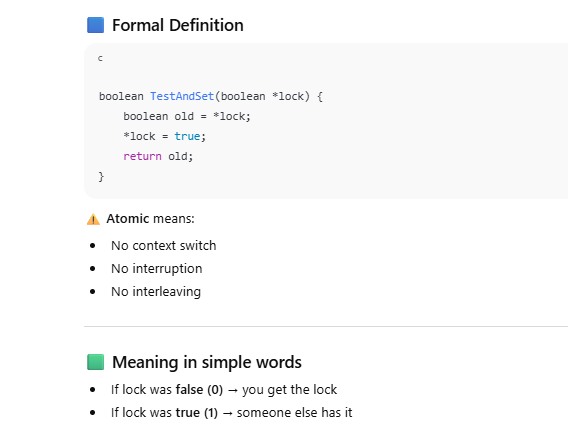

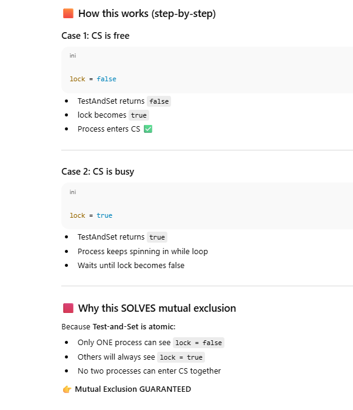

## 🟩 Critical Section Conditions Check

|Condition|Satisfied?|Why|
|---|---|---|
|Mutual Exclusion|✅ YES|Atomic operation|
|Progress|✅ YES|One waiting process enters|
|Bounded Waiting|❌ NO|Starvation possible|
|Hardware Independence|❌ NO|Needs hardware support|

## Major Drawback: Busy Waiting (Spinlock)

`while (TestAndSet(&lock));`

This loop:

- Keeps CPU busy
    
- Wastes CPU cycles
    
- Bad for long CS
    

This is called a **spinlock**.

---

## 🟦 When is Test-and-Set actually GOOD?

✔ Short critical sections  
✔ Multi-core systems  
✔ Kernel-level synchronization

❌ Bad for user-level long waiting

---

## 🟩 Interview-Perfect Explanation (MEMORIZE)

> Test-and-Set is a hardware atomic instruction that checks and sets a lock variable in one uninterruptible operation. It guarantees mutual exclusion and solves the critical section problem, but it uses busy waiting and may cause starvation.

## 🟦 Comparison with Lock Variable

|Feature|Lock Variable|Test-and-Set|
|---|---|---|
|Atomic|❌ No|✅ Yes|
|Mutual Exclusion|❌ No|✅ Yes|
|Busy Waiting|Yes|Yes|
|Hardware Support|❌ No|✅ Yes|
|Starvation|Yes|Yes|

## Turn **Variable**

## 🟦 What is a Turn Variable?

A **turn variable** is a shared variable that tells:

> **Whose turn it is to enter the critical section**

Example:

`int turn;   // 0 or 1`

- `turn = 0` → Process P0 can enter CS
    
- `turn = 1` → Process P1 can enter CS

## 🧠 Intuition (VERY IMPORTANT)

- Only the process whose **turn matches** can enter CS
    
- Others **busy wait**
    
- After finishing CS, process **hands over the turn**

## ✔ What does Turn Variable SOLVE?

|Condition|Status|
|---|---|
|Mutual Exclusion|✅ YES|
|Bounded Waiting|✅ YES|
|Atomic operations needed|❌ NO|

So far, so good.

---

## ❌ BIG PROBLEM with Turn Variable (IMPORTANT)

### ❗ Violates **Progress**

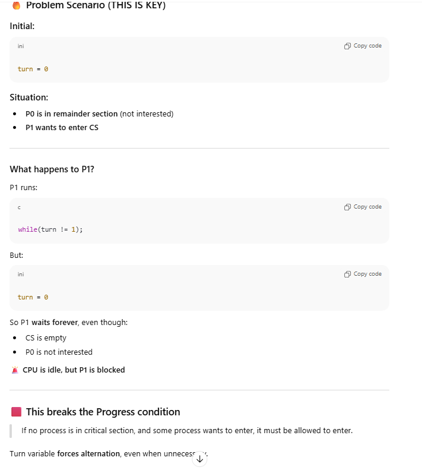

## **Semaphore**
# 🟦 What is a Semaphore? (INTUITION FIRST)

> A **semaphore** is an **integer variable** used to **control access to shared resources** by multiple processes/threads.

But the key point is:

👉 **You are NOT allowed to modify it directly**  
👉 You can only access it using **two atomic operations**

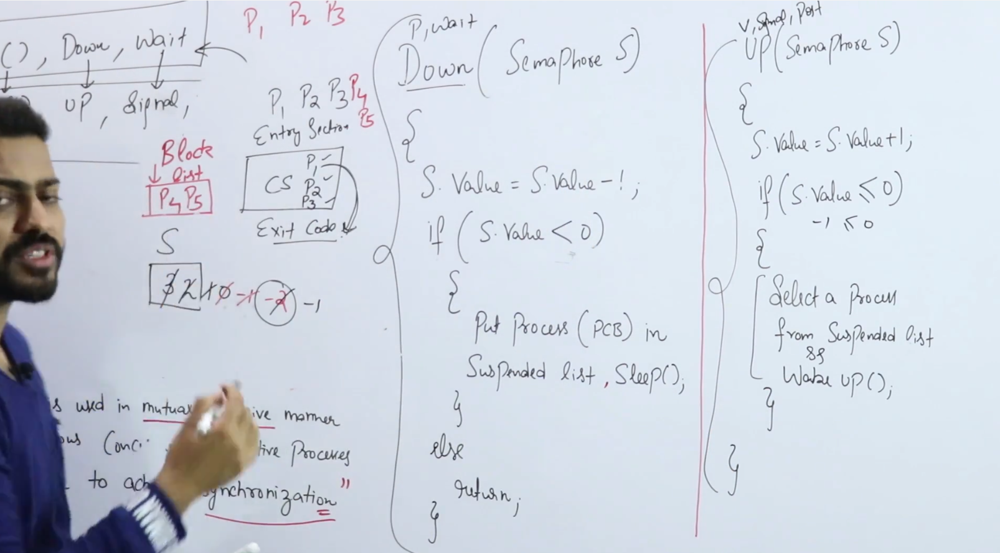
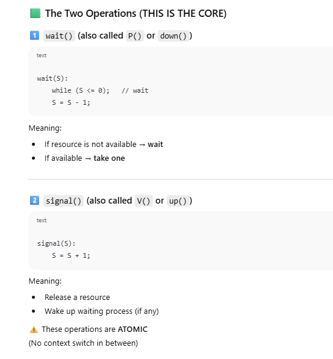

> A semaphore is like a counter that tells how many resources are available.

# 🟦 Semaphore vs Lock vs Test-and-Set

|Feature|Lock|Test-and-Set|Semaphore|
|---|---|---|---|
|Atomicity|❌|✅|✅|
|Busy Waiting|❌|✅|❌|
|Sleep/Wakeup|❌|❌|✅|
|Starvation Handling|❌|❌|Possible|
|Power|Low|Medium|🔥 High|

A semaphore is a synchronization primitive that uses an integer value and two atomic operations, wait and signal, to control access to shared resources and prevent race conditions.

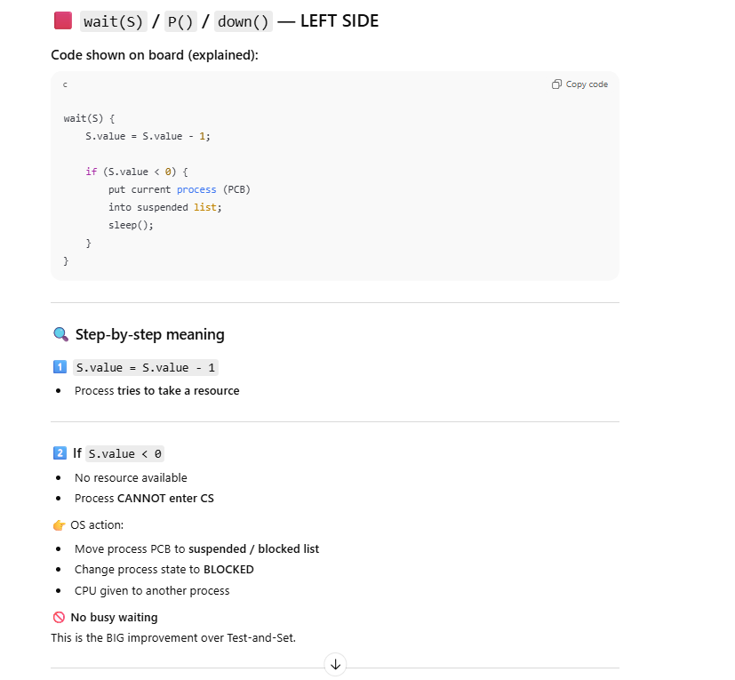

### 3️⃣ If `S.value >= 0`

- Resource is available
    
- Process continues directly to **Critical Section**
    

---

# 🟦 What the Left Diagram Shows (P1, P2, P3)

- P1 enters CS
    
- P2, P3 call `wait(S)`
    
- `S.value` becomes negative
    
- P2, P3 go into **blocked queue**
    
- They do NOT spin
    

This is why semaphore is efficient.

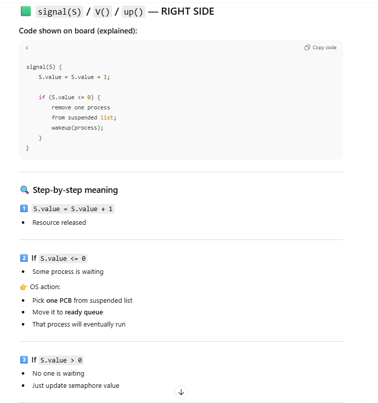

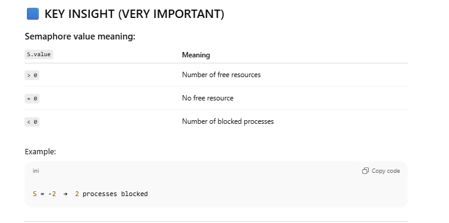

# 🟥 Why Semaphore is NOT Busy Waiting

Because when `S.value < 0`:

- Process is **blocked**
    
- Removed from CPU
    
- OS switches context
    

This is why semaphore is better than:

- Lock variable
    
- Turn variable

In semaphore implementation, the wait operation decrements the semaphore and blocks the process if the value becomes negative, while the signal operation increments the semaphore and wakes up a blocked process if one exists.

    
- Test-and-Set
    

---

# 🟩 Mutual Exclusion via Semaphore (Board Note)

The red text says:

> “Which is used in mutual exclusion mechanism by various concurrent cooperative processes in order to achieve synchronization”

Meaning:

- Semaphore coordinates **cooperative processes**
    
- Ensures **only one process enters CS**
    
- Prevents race condition

## Binary **Semaphore**

# 🟦 What is a Binary Semaphore?

> A **Binary Semaphore** is a semaphore that can have **only two values: 0 or 1**.

## 🟩 Meaning of Values

| Value of S | Meaning                                 |
| ---------- | --------------------------------------- |
| `S = 1`    | Resource / Critical Section is **FREE** |
| `S = 0`    | Resource / Critical Section is **BUSY** |
|            |                                         |
|            |                                         |
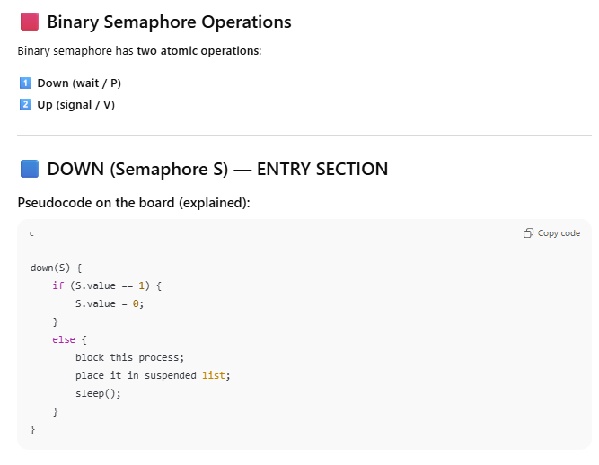
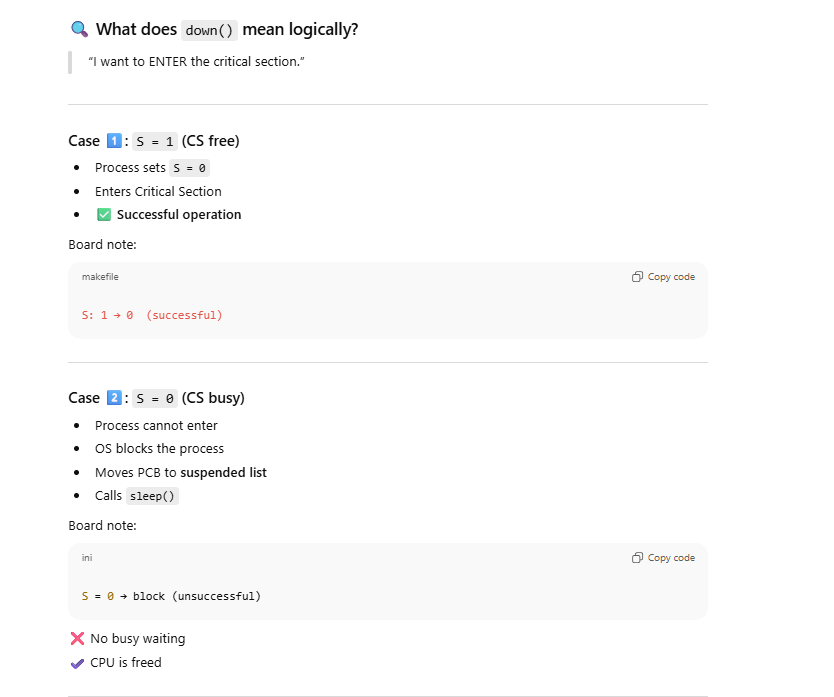

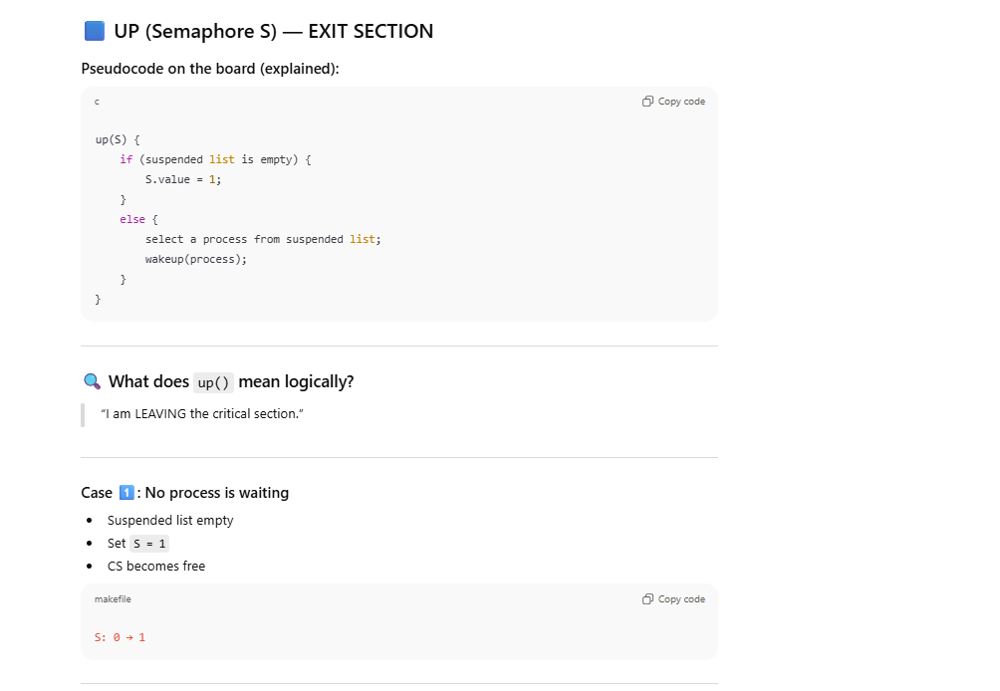

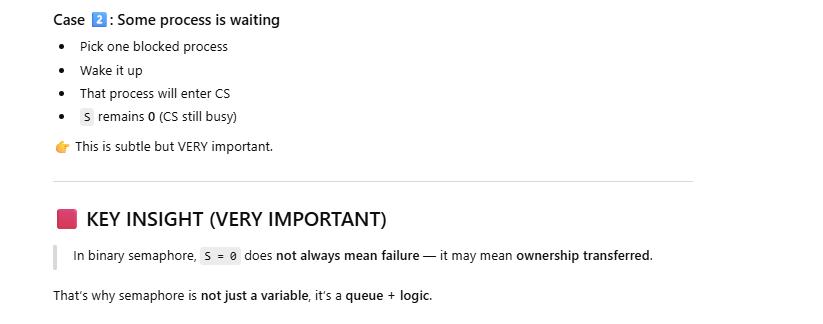

# 🟦 Binary Semaphore vs Mutex (INTERVIEW GOLD)

|Feature|Binary Semaphore|Mutex|
|---|---|---|
|Values|0 or 1|0 or 1|
|Ownership|❌ No owner|✅ Owner|
|Signal by other thread|✅ Allowed|❌ Not allowed|
|Used in OS|Yes|Yes|

👉 **Binary semaphore does NOT enforce ownership**  
👉 Mutex does

---

# 🟧 Why Binary Semaphore is better than Lock Variable

|Lock Variable|Binary Semaphore|
|---|---|
|Busy waiting|❌ Yes|
|Atomic|❌ No|
|Blocking|❌ No|
|Safe|❌ No|

---

# 🟩 Interview One-Liner (MEMORIZE)

> A binary semaphore is a synchronization primitive that uses values 0 and 1 to provide mutual exclusion, where wait blocks the process if the resource is unavailable and signal wakes a blocked process if one exists.

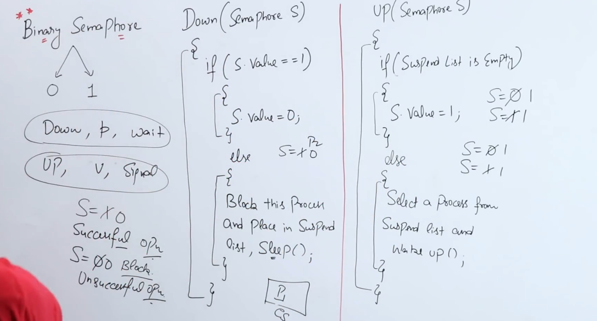

