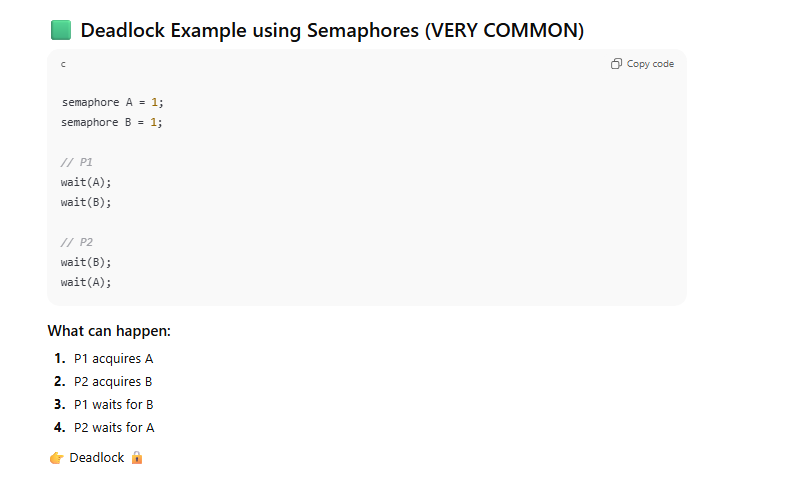
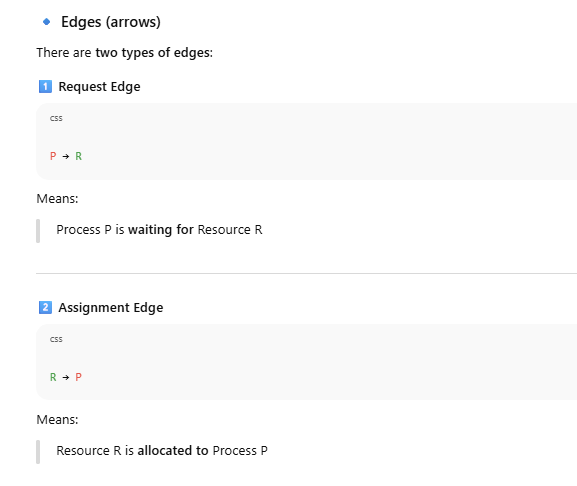
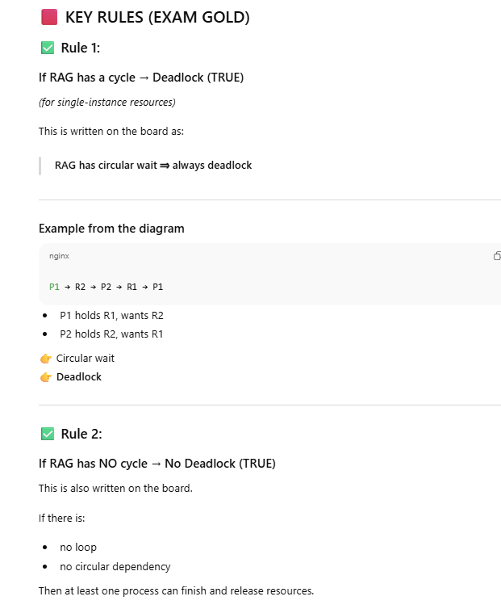
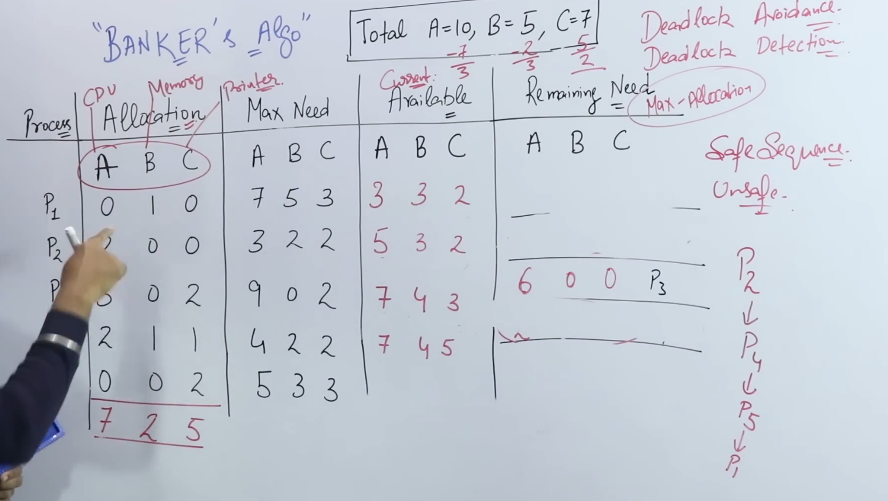

# 🟥 What is Deadlock? (INTUITION FIRST)

> **Deadlock** is a situation where a set of processes are **blocked forever**, because each process is **waiting for a resource held by another process**.

👉 Nobody can proceed  
👉 Nobody releases resources  
👉 System is stuck

## 🧠 One-line intuition

> “You wait for me, I wait for you — forever.”

---

# 🟦 Simple Real-Life Example (Classic)

Two people, two resources:

- P1 holds **Pen**, needs **Paper**
    
- P2 holds **Paper**, needs **Pen**
    

Both wait → ❌ deadlock

---

# 🟩 OS Example (using semaphore / resources)

Processes:

- **P1**
    
- **P2**
    

Resources:

- **R1**
    
- **R2**
    

### Execution:

1. P1 acquires R1
    
2. P2 acquires R2
    
3. P1 requests R2 → blocked
    
4. P2 requests R1 → blocked
    

👉 Both blocked forever → **deadlock**

---

# 🟥 Formal Definition (INTERVIEW)

> A deadlock is a condition in which a set of processes are permanently blocked because each process is holding at least one resource and waiting for additional resources held by other processes.

---

# 🟦 Necessary Conditions for Deadlock (VERY IMPORTANT)

Deadlock occurs **if and only if ALL FOUR conditions hold simultaneously**.

These are called **Coffman Conditions**.

## 1️⃣ Mutual Exclusion

> At least one resource must be **non-shareable**.

Example:

- Printer
    
- Mutex
    
- Binary semaphore
    

If resource were shareable → no deadlock.

---

## 2️⃣ Hold and Wait

> A process is holding **at least one resource** and waiting for others.

Example:

- P1 holds R1 and waits for R2
    

---

## 3️⃣ No Preemption

> Resources **cannot be forcibly taken** from a process.

Example:

- OS cannot take a mutex away
    
- Process must release it voluntarily
    

---

## 4️⃣ Circular Wait

> A circular chain of processes exists, where each process waits for a resource held by the next process.

Example:

`P1 → R2 P2 → R1`

This cycle is the **deadlock loop**.

---

## 🔥 KEY RULE (MEMORIZE)

> If **any one** of these four conditions is broken, **deadlock cannot occur**.

# 🟥 Why this happens (connect to your learning)

- Semaphores are correct
    
- But **order of acquisition is wrong**
    
- Hold-and-wait + circular wait created
    

Deadlock is a **design problem**, not a bug in semaphore

# 🟦 What is a Resource Allocation Graph (RAG)?

> A **Resource Allocation Graph** is a **directed graph** used to represent:

- which **processes** are holding resources
    
- which **processes** are requesting resources
    

It helps us **detect deadlock**.

---

## 🟩 Components of RAG (from the board)

### 🔹 Vertices (nodes)

- **Circle (◯)** → Process (P1, P2, P3)
    
- **Square (▢)** → Resource (R1, R2)

# Why “Single Instance” Matters

For **single-instance resources**:

- **Cycle is necessary AND sufficient** for deadlock
    

For **multiple-instance resources**:

- Cycle is **necessary but NOT sufficient**
    

(That’s why Banker’s Algorithm exists — but not needed here.)

# 🟧 Common Interview Traps

❌ Saying “cycle always means deadlock” (wrong for multi-instance)  
❌ Forgetting to mention **single instance**  
❌ Mixing request vs assignment edges

# 🟦 Various Methods to Handle Deadlocks

## 1️⃣ **Deadlock Ignorance (Ostrich Method)**

### What it means:

> **Pretend deadlocks do not exist.**  
> Do nothing to prevent, avoid, or detect them.

### Why the name “Ostrich”?

Like an ostrich putting its head in the sand 🐦

### Used in:

- Linux
    
- Windows
    
- UNIX
    

### Why OS uses this:

- Deadlocks are **rare**
    
- Detection/prevention is **expensive**
    
- Restarting system is cheaper
    

### Pros:

- Simple
    
- No overhead
    

### Cons:

- Deadlock may freeze the system
    
- User must reboot
    

### Interview one-liner:

> In deadlock ignorance, the OS assumes deadlocks are rare and ignores them completely, taking no action.

## 2️⃣ **Deadlock Prevention**

### What it means:

> Ensure that **at least one of the four deadlock conditions never occurs**.

Recall the 4 conditions:

1. Mutual Exclusion
    
2. Hold and Wait
    
3. No Preemption
    
4. Circular Wait
    

### How prevention works:

Break **any one** of these.

#### Examples:

- ❌ Hold & Wait → request all resources at once
    
- ❌ Circular Wait → enforce resource ordering
    
- ❌ No Preemption → forcefully take resources
    

### Pros:

- Deadlock **cannot occur**
    

### Cons:

- Poor resource utilization
    
- Starvation possible
    
- Not practical in general
    

### Interview one-liner:

> Deadlock prevention works by ensuring that at least one of the four necessary deadlock conditions is never satisfied.

## 3️⃣ **Deadlock Avoidance (Banker’s Algorithm)**

### What it means:

> The OS makes **intelligent decisions at runtime** and only allows resource allocation if the system stays in a **safe state**.

### Key idea:

- System knows:
    
    - Max resource requirement
        
    - Current allocation
        
    - Available resources
        

### Banker’s Algorithm:

- Checks if granting a request keeps system **safe**
    
- If unsafe → request denied
    

### Pros:

- No deadlock
    
- Better utilization than prevention
    

### Cons:

- Requires prior knowledge of max needs
    
- High overhead
    
- Rarely used in real OS
    

### Interview one-liner:

> Deadlock avoidance dynamically checks for safe states before allocating resources, typically using Banker’s Algorithm.

## 4️⃣ **Deadlock Detection & Recovery**

### What it means:

> **Let deadlock happen**, then:

1. Detect it
    
2. Recover from it
    

### Detection:

- Resource Allocation Graph
    
- Cycle detection
    

### Recovery methods:

- Kill one or more processes
    
- Preempt resources
    
- Rollback processes
    

### Pros:

- Better resource utilization
    
- No restriction upfront
    

### Cons:

- Detection overhead
    
- Process loss
    
- Complex recovery
    

### Interview one-liner:

> In deadlock detection and recovery, the system allows deadlocks to occur, detects them, and then recovers by terminating processes or preempting resources.

# 🟦 Quick Comparison Table (VERY IMPORTANT)

| Method               | Deadlock Possible? | Overhead | Used in Practice |
| -------------------- | ------------------ | -------- | ---------------- |
| Ignorance            | ✅ Yes              | None     | ✅ Yes            |
| Prevention           | ❌ No               | High     | ❌ Rare           |
| Avoidance            | ❌ No               | High     | ❌ Rare           |
| Detection & Recovery | ✅ Temporarily      | Medium   | ⚠️ Limited       |
# 🧠 Ultra-short revision (memorize)

- **Ignore** → do nothing (Linux)
    
- **Prevent** → break conditions
    
- **Avoid** → safe state (Banker)
    
- **Detect & Recover** → find + kill

# 🟦 What is Banker’s Algorithm?

> **Banker’s Algorithm is a deadlock avoidance algorithm** that checks whether granting a resource request will keep the system in a **safe state**.

💡 Idea:

- Like a banker giving loans
    
- Banker gives money **only if he’s sure everyone can be satisfied eventually**

# 🟦 Core Idea (MOST IMPORTANT)

👉 **Deadlock avoidance ≠ Deadlock prevention**

- We **do allow** processes to hold resources
    
- But before granting a request, we **simulate the future**
    
- If system remains **safe** → grant
    
- If **unsafe** → deny (wait)
    

---

# 🟥 What is a SAFE State?

> A system is in a **safe state** if there exists **at least one order** of process execution such that **all processes can finish** with available resources.

❌ Safe ≠ currently deadlocked  
❌ Unsafe ≠ deadlock  
👉 Unsafe means **deadlock is possible in future**

# 🟦 Data Structures Used (MEMORIZE THIS TABLE)

Let:

- `n` = number of processes
    
- `m` = number of resource types
    

### 1️⃣ **Available**

`Available[m]`

How many instances of each resource are currently free

---

### 2️⃣ **Max**

`Max[n][m]`

Maximum resources each process may need

---

### 3️⃣ **Allocation**

`Allocation[n][m]`

Resources currently allocated to each process

---

### 4️⃣ **Need** ⭐ MOST IMPORTANT

`Need = Max − Allocation`

# 🟩 Banker’s Algorithm has TWO parts

1️⃣ **Safety Algorithm** → checks if state is safe  
2️⃣ **Resource Request Algorithm** → checks if request can be granted

We ALWAYS use **Safety Algorithm first**.

### Step 0: Calculate `Need`

`Need[i][j] = Max[i][j] − Allocation[i][j]`

---

### Step 1: Initialize

`Work = Available; Finish[i] = false   for all i`

---

### Step 2: Find a process `Pi` such that:

`Finish[i] == false; AND Need[i] ≤ Work`

👉 Meaning: process can finish with current resources

---

### Step 3:

- Assume `Pi` finishes
    
- Release its resources:
    

`Work = Work + Allocation[i]; Finish[i] = true`

---

### Step 4:

Repeat Step 2–3 until:

- Either all `Finish[i] == true` → ✅ SAFE
    
- Or no such process exists → ❌ UNSAFE
    

---

# 🟦 VERY IMPORTANT RULE

> If **all processes can finish**, system is **SAFE**  
> If **even one process cannot finish**, system is **UNSAFE**

# 🟥 WHY Banker’s Algorithm Works

Because:

- It **never allows the system into an unsafe state**
    
- Deadlock is only possible from unsafe states
    

So:

> **No unsafe state → No deadlock**

---

# 🟩 Interview One-Liners (MEMORIZE)

**Definition**

> Banker’s Algorithm is a deadlock avoidance algorithm that grants resource requests only if the system remains in a safe state.

**Safe State**

> A state is safe if there exists a sequence of processes that can all complete with available resources.

---

# 🟦 Common Mistakes (VERY IMPORTANT)

❌ Forgetting `Need = Max − Allocation`  
❌ Not updating `Work` correctly  
❌ Thinking unsafe = deadlock  
❌ Skipping safety check after request

---

# 🟦 When is Banker’s Algorithm USED / NOT USED?

### Used:

- Theoretical OS
    
- Teaching deadlock avoidance
    

### Not used in real OS:

- Requires prior knowledge of max demand
    
- High overhead
    
- Dynamic systems don’t fit
    

---

# 🧠 Ultra-Short Revision

`Need = Max − Allocation Check safe sequence Grant only if safe`

