# 🟦 What is Memory Management? (1-line first)

> **Memory management** is the OS function that decides **how memory is allocated, used, and freed** by processes.

Main goal:

- Keep CPU busy
    
- Use RAM efficiently
    
- Support multiprogramming safely
    

---

# 🟦 What is Degree of Multiprogramming?

> **Degree of multiprogramming** =  
> **Number of processes present in main memory (RAM) at the same time**

Example:

- RAM contains P1, P2, P3 → degree = **3**
    
- RAM contains P1 only → degree = **1**

# 🟦 Why do we need Multiprogramming at all?

Because processes do **I/O**.

### Without multiprogramming:

- One process
    
- CPU idle during I/O
    
- ❌ Wasted CPU time
    

### With multiprogramming:

- One process does I/O
    
- Another uses CPU
    
- ✅ High CPU utilization
    

---

# 🟦 Where Memory Management comes in

RAM is **limited**.

So OS must decide:

- How many processes can be kept in memory
    
- Which process to load
    
- Which process to remove
    

👉 This decision **directly controls the degree of multiprogramming**.

# 🟥 Relationship: Memory ↔ Degree of Multiprogramming

### 🔹 Case 1: Plenty of free memory

- OS loads many processes
    
- Degree of multiprogramming ↑
    
- CPU utilization ↑
    

✅ Good performance

---

### 🔹 Case 2: Limited memory

- OS loads fewer processes
    
- Degree of multiprogramming ↓
    
- CPU may go idle
    

❌ Poor utilization

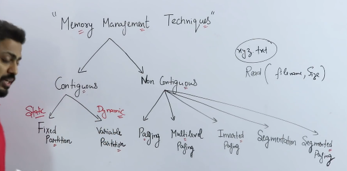

> **Memory management techniques** are ways the OS decides **how a process gets RAM**.

The **first split** is the most important:

`Memory Management │ ├── Contiguous │ └── Non-Contiguous`

## 1️⃣ Contiguous Memory Allocation

👉 **A process gets ONE continuous block of memory**

### 🔹 A) Fixed Partitioning (Static)

- RAM is divided **before execution**
    
- Partitions are of **fixed size**
    

**Problems:**

- ❌ Internal fragmentation (wasted space inside partition)
    
- ❌ Process must fit partition size
    

📌 **Example**  
Partition = 100MB  
Process = 60MB  
→ 40MB wasted

📌 **Interview keyword:** _Internal Fragmentation_

### 🔹 B) Variable Partitioning (Dynamic)

- Memory is allocated **on demand**
    
- Size depends on process requirement
    

**Problems:**

- ❌ External fragmentation (free memory scattered)
    
- Needs **compaction** (expensive)
    

📌 **Interview keyword:** _External Fragmentation_

---

### ❗ Why Contiguous Allocation Failed

- Fragmentation
    
- Scaling issues
    
- Poor utilization
    

👉 **This forced OS designers to move to non-contiguous memory**

## 2️⃣ Non-Contiguous Memory Allocation

👉 **A process can be split and stored in different locations**

This is what **modern OS actually use**.

## 🔹 A) Paging (MOST IMPORTANT ⭐)

- Memory divided into:
    
    - **Pages** (process)
        
    - **Frames** (RAM)
        
- Page size = Frame size
    

**Key points:**

- ✅ No external fragmentation
    
- ❌ Internal fragmentation (last page)
    

📌 **Address translation:**

`Logical Address = Page No + Offset → Page Table → Frame No + Offset`

📌 **Interview gold line:**

> Paging eliminates external fragmentation.

---

## 🔹 B) Multilevel Paging

👉 Used when page table becomes **too large**

- Page table itself is paged
    
- Reduces memory usage
    

📌 Used in **32-bit / 64-bit systems**

---

## 🔹 C) Inverted Paging

👉 Instead of **one page table per process**:

- **One page table for entire system**
    
- Entry = which process + which page
    

**Pros:**

- Saves memory
    

**Cons:**

- Slower lookup
    
- Needs hashing
    

📌 Asked less, but good bonus answer

---

## 🔹 D) Segmentation

👉 Memory divided **logically**, not fixed size

Examples:

- Code segment
    
- Stack segment
    
- Heap segment
    

**Address format:**

`Segment No + Offset`

**Problems:**

- ❌ External fragmentation
    
- ❌ Compaction needed
    

📌 **Advantage:** Matches programmer’s view

---

## 🔹 E) Segmented Paging (BEST of both)

👉 **Segmentation + Paging**

- Logical view like segmentation
    
- Physical allocation like paging
    

**Result:**

- ✅ No external fragmentation
    
- ✅ Logical structure preserved
    

📌 **Used in real systems**

---

## 🔥 One Interview Table (MEMORIZE THIS)

| Technique          | Internal Frag | External Frag | Used Today |
| ------------------ | ------------- | ------------- | ---------- |
| Fixed Partition    | ✅             | ❌             | ❌          |
| Variable Partition | ❌             | ✅             | ❌          |
| Paging             | ✅             | ❌             | ✅          |
| Segmentation       | ❌             | ✅             | ⚠️         |
| Segmented Paging   | ✅             | ❌             | ✅          |
|                    |               |               |            |

## What is Fixed Partitioning (Static)?

**One-line definition (interview-safe):**

> In fixed partitioning, **main memory is divided into fixed-size partitions before execution**, and **each process is loaded into exactly one partition**.

Key word: **before execution** → that’s why it’s called **static**.

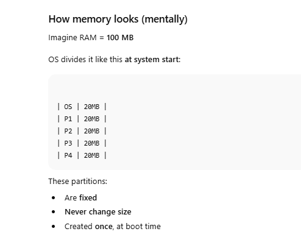

## How process allocation works (step-by-step)

1. Process comes with a size requirement  
    Example: Process A = **15 MB**
    
2. OS looks for:  
    👉 **Any partition large enough**
    
3. Process is placed **entirely inside one partition**
    
4. **One process per partition** (no sharing)

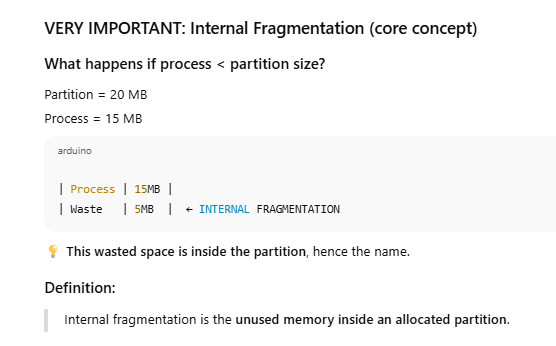

## What if process > partition size?

Process = 25 MB  
Partition = 20 MB

❌ **Process cannot be loaded**, even if total free memory exists.

This is a **big drawback**.

## What if process > partition size?

Process = 25 MB  
Partition = 20 MB

❌ **Process cannot be loaded**, even if total free memory exists.

This is a **big drawback**.

---

## Types of Fixed Partitioning (quick note)

### 1️⃣ Equal-sized partitions

All partitions same size.

- Simple
    
- High internal fragmentation
    

### 2️⃣ Unequal-sized partitions

Different partition sizes (e.g., 10MB, 20MB, 30MB)

- Slightly better utilization
    
- Still internal fragmentation
    

---

## Why Fixed Partitioning is BAD (interview angle)

### ❌ Problems

1. **Internal Fragmentation**
    
2. **Limited number of processes**
    
    - No. of partitions = max no. of processes
        
3. **Poor memory utilization**
    
4. **Inflexible** (static)
    

---

## Why it existed at all?

Because:

- Simple hardware
    
- Early operating systems
    
- Easy to implement
    

📌 Used in **very old systems** (early batch OS).

---

## One-line comparison (they love this)

> Fixed partitioning suffers from **internal fragmentation**, whereas variable partitioning suffers from **external fragmentation**

## What is Variable (Dynamic) Partitioning?

**One-line definition (interview-safe):**

> In variable partitioning, memory is **allocated dynamically according to process size**, instead of using fixed partitions.

Key word: **dynamic** → memory is divided **at runtime**, not beforehand

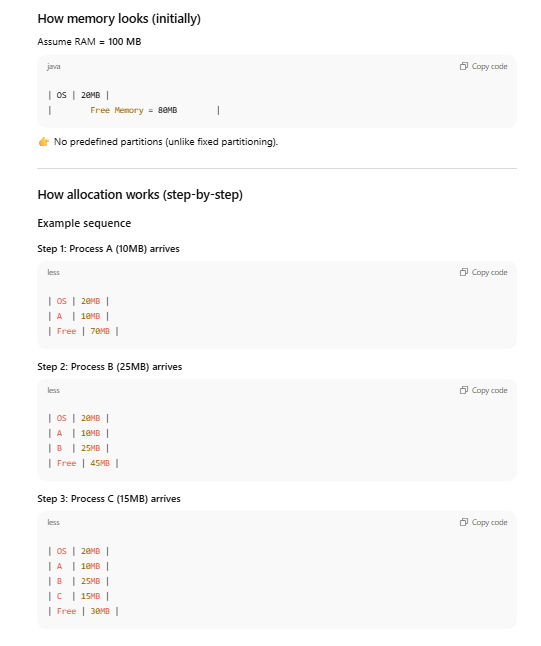

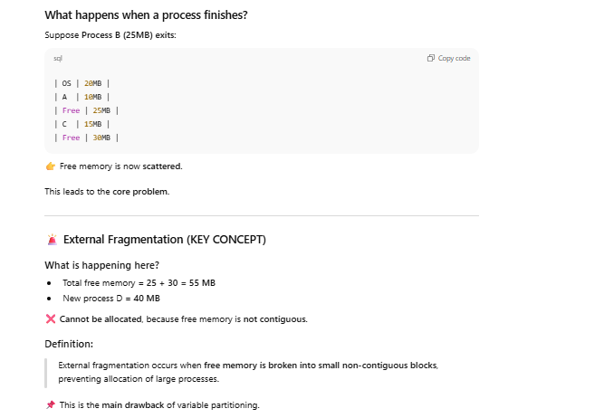

# Allocation Strategies (Variable / Dynamic Partitioning)

👉 **Problem being solved:**  
When multiple free memory holes exist, **which one should the OS choose** for a new process?

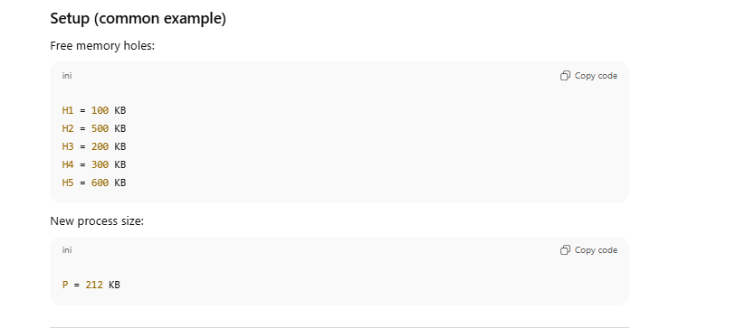

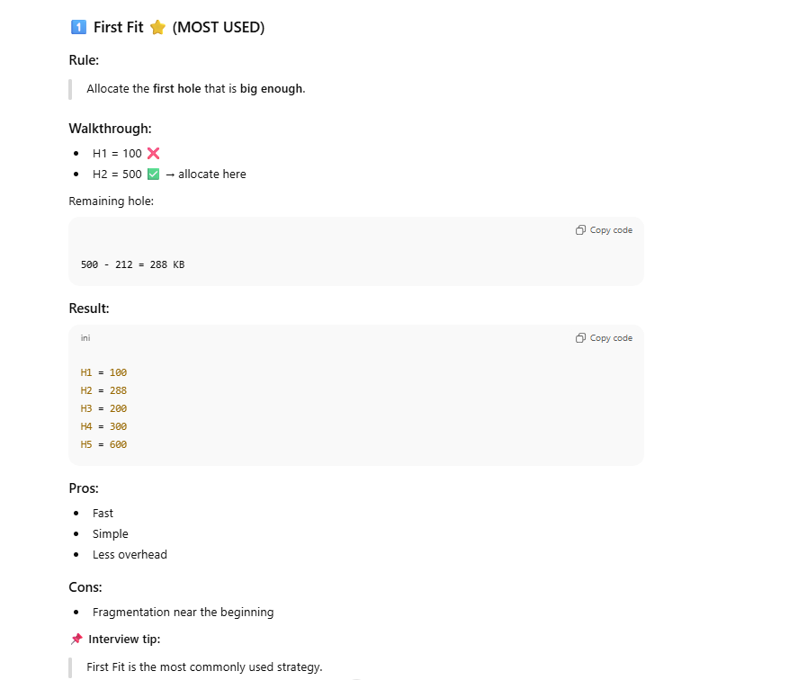

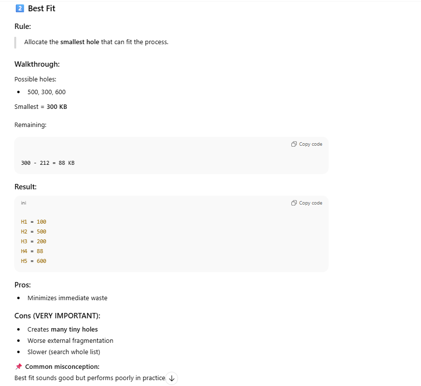

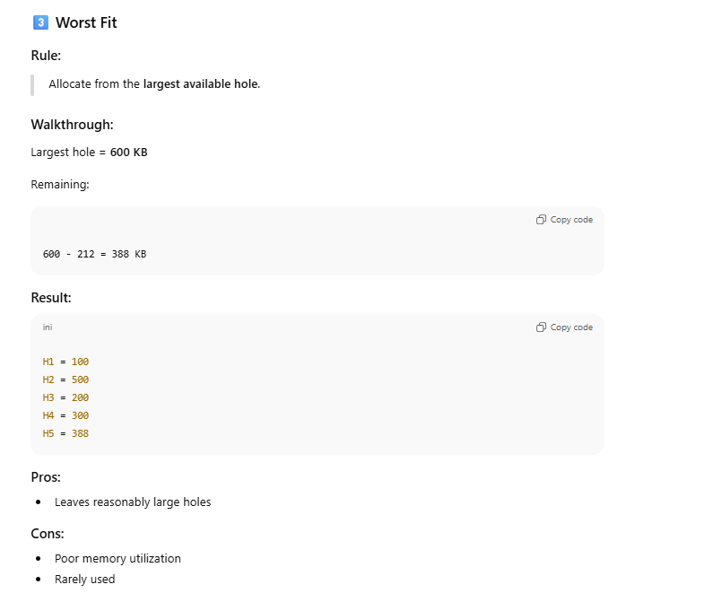

## 4️⃣ Next Fit (variation of First Fit)

### Rule:

> Like First Fit, but search starts **from last allocated position**.

### Pros:

- Slightly better performance than First Fit
    

### Cons:

- Fragmentation still exists
    

---

## 🔥 ONE INTERVIEW TABLE (MEMORIZE)

|Strategy|Search Method|Speed|Fragmentation|Used|
|---|---|---|---|---|
|First Fit|First suitable hole|Fast|Moderate|✅|
|Best Fit|Smallest suitable hole|Slow|High|❌|
|Worst Fit|Largest hole|Slow|High|❌|
|Next Fit|From last position|Fast|Moderate|⚠️|

---

## Interview-perfect summary (1–2 lines)

> In variable partitioning, allocation strategies decide which free hole to use. First Fit is most common due to simplicity and speed, while Best and Worst Fit cause higher fragmentation.

**Q: Which strategy is best?**  
👉 First Fit (practically)

**Q: Which causes most fragmentation?**  
👉 Best Fit

**Q: Why not Best Fit?**  
👉 Creates many small unusable holes

### 🔴 Contiguous Memory Allocation

👉 **One process = one continuous block of RAM**

### 🟢 Non-Contiguous Memory Allocation

👉 **One process = broken into pieces placed anywhere in RAM**

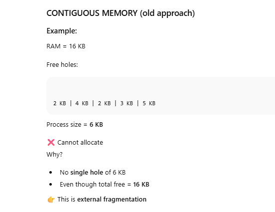

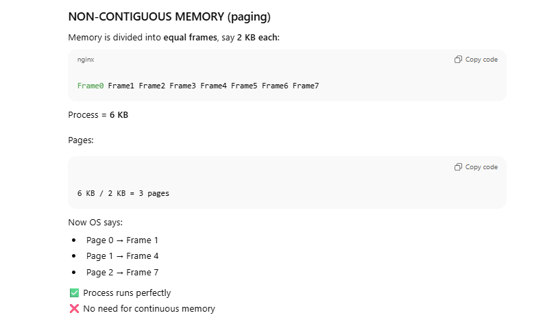

## What does “Non-Contiguous Memory Allocation” mean?

**One-line definition (interview-safe):**

> In non-contiguous memory allocation, a process is **split into smaller parts** and stored in **different locations** in main memory.

👉 A process **does NOT need one continuous block** anymore.

This **solves external fragmentation** completely.

## First key idea on the board: FIXED SIZE BLOCKS

On the board you see:

- **Page size = Frame size = 2 KB**
    

This is mandatory.

### Two terms (must not confuse):

- **Page** → chunk of a **process**
    
- **Frame** → chunk of **physical memory (RAM)**
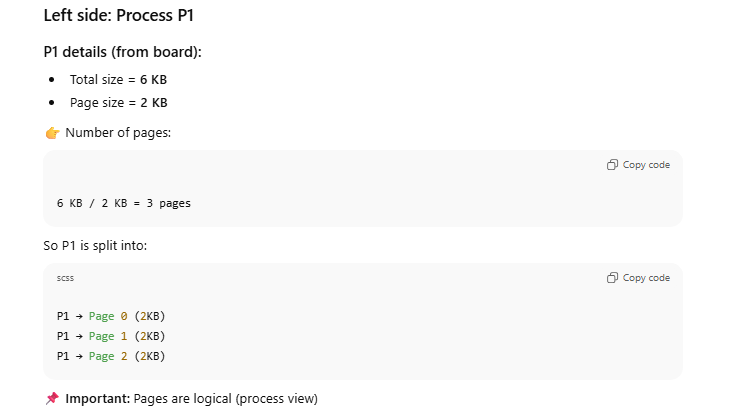

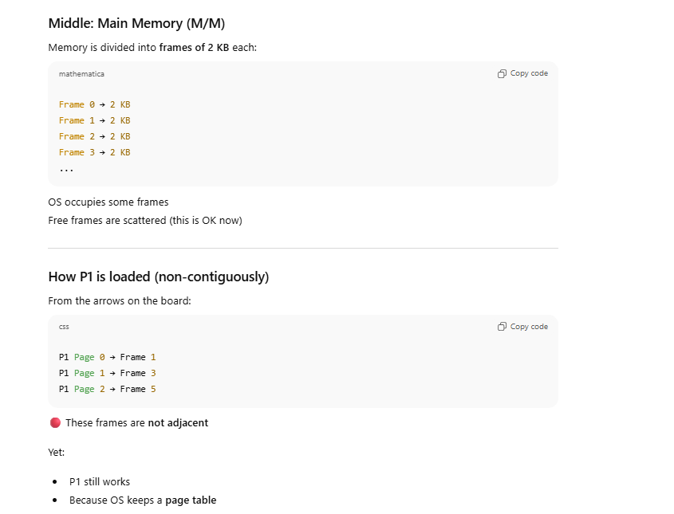

## ⭐ WHY THIS SOLVES EXTERNAL FRAGMENTATION

Earlier (variable partitioning):

- We needed **one large continuous hole**
    

Now:

- We just need **any free frames**
    
- Frames can be **anywhere**
    

👉 Scattered memory is **no longer a problem**

## Address translation (very important)

CPU generates:

`Logical Address = (Page Number, Offset)`

Steps:

1. Use **Page Number** to index page table
    
2. Get **Frame Number**
    
3. Physical Address = (Frame Number, Offset)
    

Offset stays the same.

---

## Fragmentation situation here

### External Fragmentation?

❌ NO  
(because any frame can be used)

### Internal Fragmentation?

✅ YES (last page only)

Example:

- Process needs 5 KB
    
- Pages = 3 (6 KB allocated)
    
- 1 KB wasted inside last page
    

---

## One interview-perfect summary

> Non-contiguous memory allocation divides a process into fixed-size pages and stores them in any available frames in memory, eliminating external fragmentation at the cost of small internal fragmentation.

---

## Why OS moved to this approach

| Problem earlier        | Paging fixes it |
| ---------------------- | --------------- |
| External fragmentation | ✅ Eliminated    |
| Compaction needed      | ❌ Not required  |
| Process size limits    | ❌ No            |
| Memory utilization     | ✅ High          |

## ERA 1️⃣: Fixed Partitioning (Static)

### What OS did

- Memory divided **once** into fixed blocks
    
- One process per block
    

### What goes wrong

If:

- Partition = 10 MB
    
- Process = 6 MB
    

➡ **4 MB wasted INSIDE the partition**

### 🔴 Fragmentation here:

✅ **INTERNAL fragmentation**

### Why?

> Because memory block is **bigger than the process**, and the unused part is **inside** the allocated block.

✔ You understood this correctly.

---

## ERA 2️⃣: Variable (Dynamic) Partitioning

⚠️ This is where your confusion starts — so listen carefully.

### What OS changed

- No fixed blocks
    
- Give process **exact size**
    
- Memory stays **contiguous per process**
    

### Initially, this is GOOD:

- ❌ No internal fragmentation
    
- ✔ Perfect fit
    

---

### Then processes finish…

Memory becomes like:

`| P1 | FREE | P2 | FREE | P3 |`

### 🔴 Fragmentation here:

✅ **EXTERNAL fragmentation**

❌ NOT internal  
(you said internal — this is the correction)

### Why?

> Free memory is broken into **separate holes OUTSIDE allocated regions**.

Even if total free memory is large, no single block may be big enough.

---

## Important correction (lock this)

❌ Variable partitioning does **NOT** cause internal fragmentation  
✅ It causes **EXTERNAL fragmentation**

---

## ERA 3️⃣: Non-Contiguous Memory Allocation (Paging)

Now OS changes the **RULE itself**.

### New rule:

> A process **does not need to be contiguous anymore**

This is the key shift.

---

## What OS does differently (VERY IMPORTANT)

1. Memory is divided into **fixed-size frames**
    
2. Process is divided into **fixed-size pages**
    
3. Pages can go into **any frame**
    

So memory looks like:

`Frame | Used / Free | Owner`

---

## Now answer your core confusion:

### ❓ “What happens to holes in non-contiguous memory?”

👉 **Holes still exist**  
👉 BUT they **DON’T MATTER anymore**

Why?

Because:

- OS does NOT need one big hole
    
- It only needs **any free frame**
    

Scattered free memory is **perfectly usable**

---

## Fragmentation in NON-CONTIGUOUS (very clear)

### External Fragmentation?

❌ NO

Why?

> Because frames can be used independently

---

### Internal Fragmentation?

✅ YES (only inside LAST PAGE)

Why?

> If process size ≠ multiple of page size

Example:

- Page size = 4 KB
    
- Process size = 10 KB
    
- Allocated = 12 KB
    
- Wasted = 2 KB (inside last page)
    

This is **internal fragmentation**, but **very small & bounded**.

---

## 🔥 One clean table (this should clear everything)

|Technique|Memory per process|Fragmentation|
|---|---|---|
|Fixed partitioning|Contiguous|Internal|
|Variable partitioning|Contiguous|External|
|Non-contiguous (paging)|Non-contiguous|Internal (last page only)|

---

## Where your mental model was slipping

You mixed:

- **“Process leaves → internal fragmentation”** ❌
    

Correct is:

- **Process leaves → EXTERNAL fragmentation** (in variable partitioning)
    

Internal fragmentation only happens when:

> Allocated block > required memory

Fixed partitioning wastes memory inside blocks (internal fragmentation).  
Variable partitioning wastes memory between blocks (external fragmentation).  
Paging avoids both by allowing non-contiguous allocation, leaving only small internal fragmentation in the last page.

# **PAGING**

### 🧠 CPU

- Generates **logical address**
    
- CPU **never sees physical memory directly**
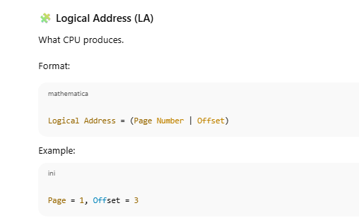

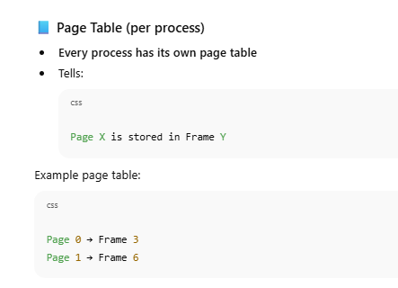

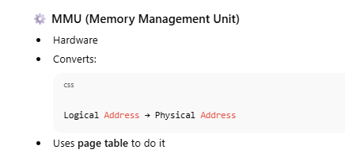

Example:
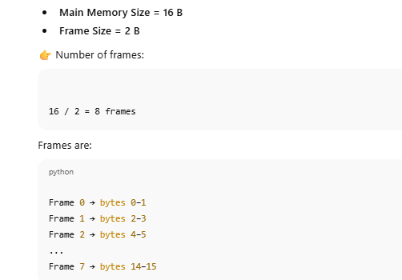

## Process details 

- **Process size = 4 B**
    
- **Page size = 2 B**
    

👉 Number of pages:

`4 / 2 = 2 pages`

So process is split into:

`Page 0 → bytes 0–1 Page 1 → bytes 2–3`

## Page Table (this is the mapping)

From your diagram, suppose:

`Page 0 → Frame 3 Page 1 → Frame 1`

This is stored in **process’s page table**.

### Address translation (step-by-step)

Let’s do a **real dry run**, exactly like the board.

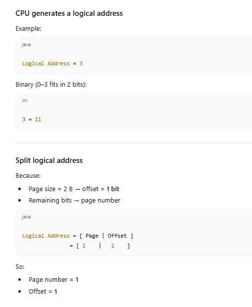

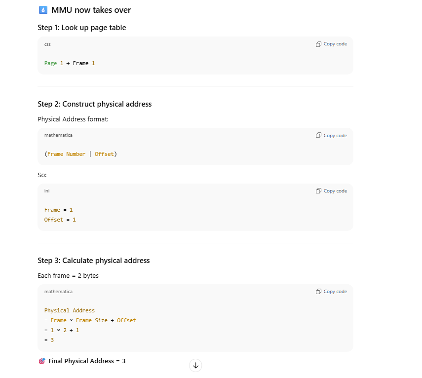

## 7️⃣ What just happened (important realization)

- CPU thought it was accessing **byte 3 of the process**
    
- Actually accessed **byte 3 of RAM**
    
- CPU **never knew** where the process actually lives
    

👉 This is **virtualization of memory**

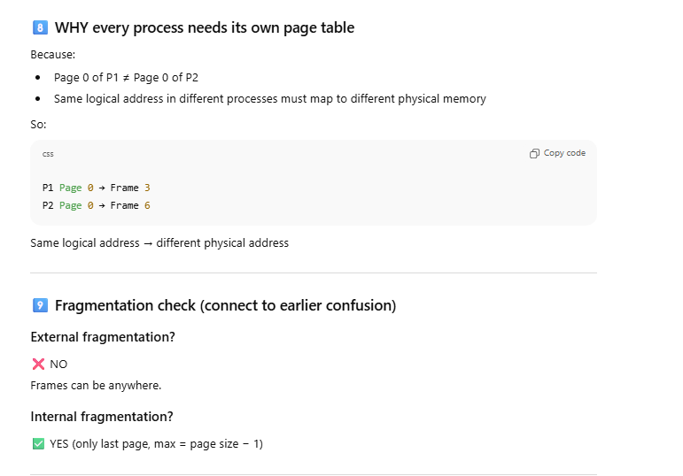

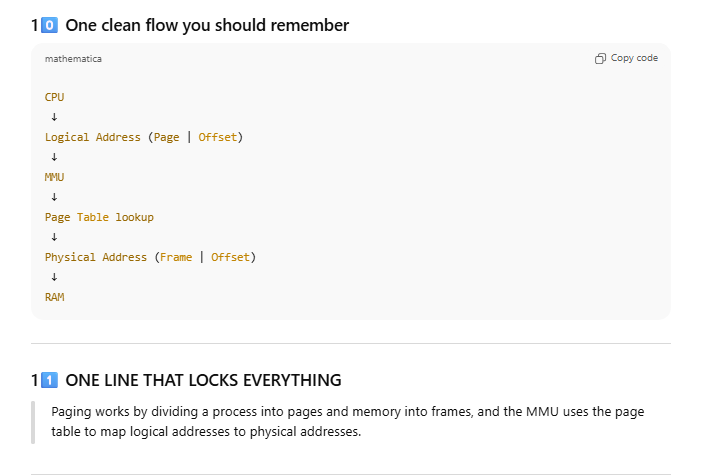

# What is a Page Table Entry (PTE)?

> A **Page Table Entry** is **one row** in the page table that tells the OS and MMU **where a page is**, **whether it’s usable**, and **how it can be accessed**.

Each **page of a process** has **one PTE**.

---

## Big picture (one glance)

A PTE typically contains:

`| Frame No | Valid | Protection | Reference | Caching | Dirty |`

Some are **mandatory**, some are **optional (performance-related)**.

---

## 1️⃣ Frame Number (MANDATORY)

### What it is:

- Physical **frame index** in RAM
    

### Why needed:

MMU needs this to form the **physical address**.

`Physical Address = Frame No × Frame Size + Offset`

📌 Without this, mapping is impossible.

---

## 2️⃣ Valid / Invalid Bit (Present / Absent)

### Values:

- `1` → Page is **present in RAM**
    
- `0` → Page is **not in RAM**
    

### Why it exists:

To detect **page faults**.

### What happens if Valid = 0?

1. MMU raises a **page fault**
    
2. OS loads page from disk
    
3. Updates page table
    
4. Instruction restarts
    

📌 **This bit enables virtual memory**

---

## 3️⃣ Protection Bits (R / W / X)

### Controls:

- **Read**
    
- **Write**
    
- **Execute**
    

Examples:

- Code segment → `R-X`
    
- Data segment → `RW-`
    
- Stack → `RW-`
    

### Why needed:

- Prevent illegal memory access
    
- Enforce security
    

📌 If violated → **segmentation fault / protection fault**

---

## 4️⃣ Reference Bit (Accessed Bit)

### Value:

- `0` → Page not used recently
    
- `1` → Page was accessed
    

### Who sets it?

👉 **Hardware (MMU)**

### Why it exists:

Used by **page replacement algorithms**:

- LRU
    
- Clock
    
- Second chance
    

📌 Helps OS decide **which page to evict**

---

## 5️⃣ Dirty Bit (Modified Bit)

### Value:

- `0` → Page NOT modified
    
- `1` → Page WAS modified
    

### Why important:

If dirty = 1:

- Page must be **written back to disk** before eviction
    

If dirty = 0:

- Can be **discarded directly**
    

📌 Saves disk I/O (very expensive)

---

## 6️⃣ Caching Bit (Enable / Disable)

### Controls:

- Whether page can be cached
    

Used for:

- Memory-mapped I/O
    
- Device registers
    

📌 Some pages should **never be cached**

---

## 7️⃣ Optional / Architecture-dependent fields

May include:

- User / Kernel mode
    
- Copy-on-write
    
- Global bit
    
- Age counter (for advanced LRU)
    

Interview note:  
👉 You **don’t need to list all**, just say _“architecture dependent”_.

---

## How this works together (real execution flow)

1. CPU generates logical address
    
2. MMU checks **Valid bit**
    
    - 0 → Page fault
        
3. MMU checks **Protection bits**
    
    - Violation → trap
        
4. MMU uses **Frame number**
    
5. Reference bit set to 1
    
6. Dirty bit set if write happens
    

---

## One killer interview explanation (memorize this)

> A page table entry stores the frame number along with control bits like valid, protection, reference, and dirty bits to support address translation, protection, and efficient page replacement.

---

## Common interview traps (avoid these mistakes)

❌ “Valid bit means permission”  
✔ No — it means **presence in RAM**

❌ “Dirty bit is for protection”  
✔ No — it tracks **modification**

❌ “Reference bit is set by OS”  
✔ No — **hardware sets it**

---

## One clean mental grouping

### Mandatory:

- Frame number
    
- Valid bit
    

### Safety:

- Protection bits
    

### Performance:

- Reference bit
    
- Dirty bit
    
- Caching bit

# What is Thrashing?

### One-line (interview-perfect):

> **Thrashing is a condition where the system spends most of its time handling page faults instead of executing processes.**

In short:  
👉 **Too much paging, too little useful work**

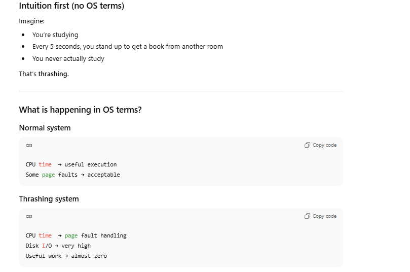

## Why does thrashing happen?

### Root cause (VERY IMPORTANT)

> **Processes do not have enough frames to hold their working set.**

Let’s break that sentence.

---

## Working Set (key idea)

> **Working set = pages a process needs right now to run smoothly**

If:

- Process needs 5 pages
    
- OS gives only 2 frames
    

➡ Page faults happen continuously

---

## How thrashing starts (step-by-step)

1️⃣ OS increases **degree of multiprogramming**  
(more processes to improve CPU utilization)

2️⃣ Each process gets **fewer frames**

3️⃣ Page faults increase

4️⃣ OS thinks:

> “CPU is idle, add MORE processes”

5️⃣ Frames per process reduce even more

6️⃣ Page fault rate explodes 💥

👉 System enters **thrashing**

---

## What you see during thrashing (symptoms)

- Very high disk I/O
    
- Very high page fault rate
    
- Very low CPU utilization
    
- System feels **slow / frozen**
    

📌 Adding RAM suddenly improves performance — classic sign.

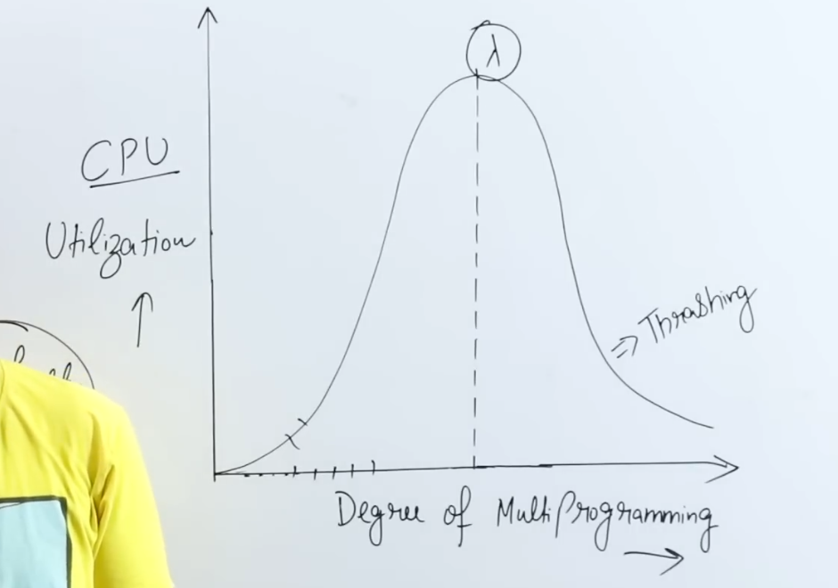

After a point:

- More page faults → less CPU utilization

## Relation with Page Replacement

Bad replacement algorithms:

- FIFO
    
- Random
    

Can make thrashing worse.

Good ones:

- LRU
    
- Working Set
    

Reduce it.

---

## How OS prevents thrashing

### 1️⃣ Working Set Model

- Track active pages
    
- Ensure enough frames
    

### 2️⃣ Page Fault Frequency (PFF)

- If page faults too high → give more frames
    
- Or suspend some processes
    

### 3️⃣ Reduce multiprogramming

- Fewer active processes
    
- More frames per process

## Important clarification (many students mess this up)

❌ Thrashing ≠ deadlock  
❌ Thrashing ≠ starvation

✔ Thrashing = **memory overload problem**

---

## One-line answer you can safely say in interview

> Thrashing occurs when the system spends most of its time servicing page faults due to insufficient frames for processes, leading to very low CPU utilization.