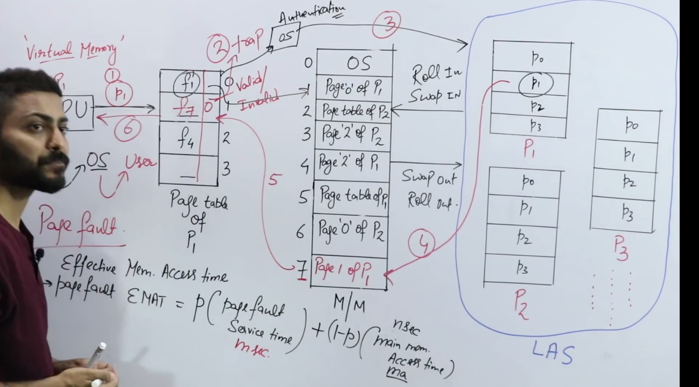
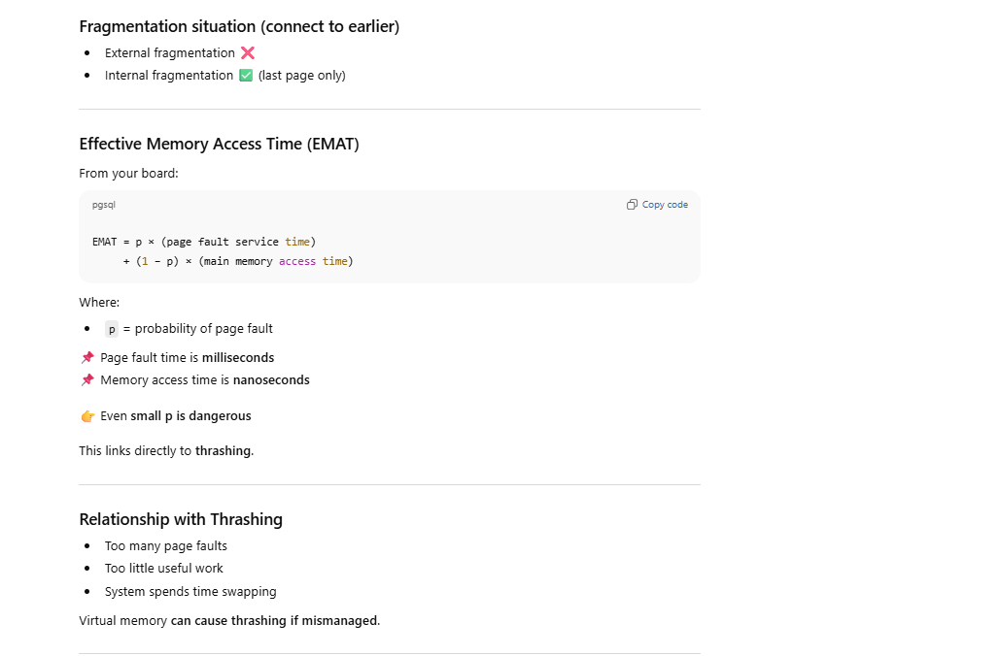

# What is Virtual Memory? (1-line, lock this)

> **Virtual memory is a technique where only the needed pages of a process are kept in RAM, and the rest stay on disk, giving the illusion of a large continuous memory.**

You’re seeing **three levels**:

1️⃣ **CPU + Page Table (Logical view)**  
2️⃣ **Main Memory (RAM)**  
3️⃣ **Secondary Storage (Disk / Backing Store)**

---

## Step-by-step execution (FOLLOW THE NUMBERS ON BOARD)

---

## 🟢 Step 1: CPU generates a logical address

CPU wants:

`Process P1 → Page i → Offset j`

CPU sends this to **MMU**.

---

## 🟢 Step 2: MMU checks Page Table of P1

In the page table entry:

- **Valid bit = 1** → page is in RAM → go ahead
    
- **Valid bit = 0** → page NOT in RAM → **PAGE FAULT**
    

This is where your diagram shows:

`Valid / Invalid`

---

## 🔴 Step 3: Page Fault occurs (INTERRUPT)

Page fault is **not an error**.  
It’s a **normal OS mechanism**.

What happens:

1. MMU raises a **trap**
    
2. Control switches from **user mode → kernel mode**
    
3. OS page fault handler runs
    

---

## 🟢 Step 4: OS checks disk (Backing Store)

OS finds:

`Page i of Process P1`

on disk (right side of diagram).

---

## 🟢 Step 5: Bring page into RAM (Swap-in / Roll-in)

If a **free frame exists**:

- Load page directly
    

If **no free frame**:

1. Choose a victim page (LRU / FIFO)
    
2. If dirty → write back to disk
    
3. Remove it (**swap out / roll out**)
    
4. Load required page (**swap in / roll in**)
    

---

## 🟢 Step 6: Update Page Table

OS updates:

- Frame number
    
- Valid bit = 1
    

---

## 🟢 Step 7: Restart instruction

CPU **re-executes** the instruction that caused the page fault.

Process continues like nothing happened.

---

## WHY this is called “Virtual” memory

Because:

- Process thinks **all pages are in RAM**
    
- But actually:
    
    - Some are in RAM
        
    - Some are on disk
        

👉 **Illusion of large memory**

---

## Key advantages (why OS does this)

### ✅ Programs larger than RAM can run

### ✅ Better memory utilization

### ✅ Less I/O than loading whole process

### ✅ More multiprogramming

---

## Fragmentation situation (connect to earlier)

- External fragmentation ❌
    
- Internal fragmentation ✅ (last page only)

## ONE INTERVIEW-PERFECT ANSWER

> Virtual memory allows processes to execute without being fully loaded into RAM by keeping only required pages in main memory and the rest on disk, using page tables and page faults to manage address translation transparently.