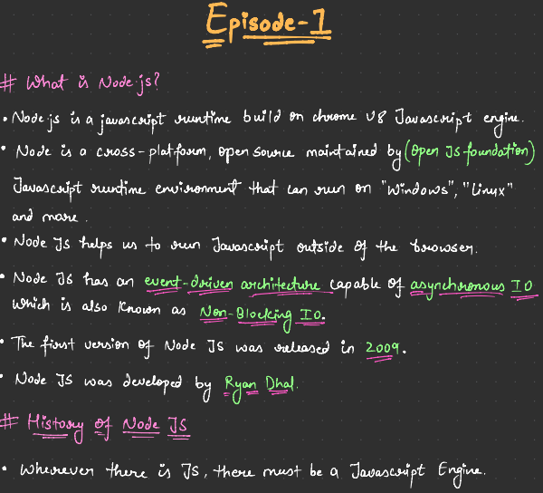

→EVEN JS ENGINES FOLLOW THESE STANDARDS!


The Node.js **REPL** (Read-Eval-Print Loop) is an interactive shell that allows you to write, execute, and test JavaScript code in real-time. It's a simple and immediate way to experiment with JavaScript code and interact with the Node.js environment.

### Breaking Down REPL:

1. **Read**: The REPL reads your input, which can be a single line or a block of JavaScript code.
2. **Eval**: It evaluates (executes) the code you've written.
3. **Print**: The result of the evaluation is printed to the console.
4. **Loop**: It then loops back, allowing you to enter more commands.

This cycle of "read, evaluate, print, loop" continues until you exit the REPL.

### How to Use Node.js REPL

You can access the Node.js REPL by simply typing `node` in your terminal and pressing Enter. This starts the REPL environment, where you can interact with Node.js directly.

```Bash
$ node
> 2 + 2
4
> const name = "Alice"
undefined // This Statement returned a undefined but intialised a variable!
> name
'Alice'
> name.toUpperCase()
'ALICE'
```

  

### Features of Node.js REPL

1. **Immediate Execution**: You can run JavaScript code interactively and get immediate feedback.
    
  ```JavaScript
    
    > 3 * 4
    12
    
    ```
    
2. **Multiline Code**: You can enter multi-line JavaScript expressions, such as loops or functions. The REPL will wait for you to complete the block before executing it.
    
    ```JavaScript
   
    > function sayHello(name) {
    ...   return `Hello, ${name}!`;
    ... }
    undefined
    > sayHello("Bob")
    'Hello, Bob!'
    
    ```
    
3. **Special Commands**: There are some special commands available in the REPL:
    - `.exit` – Exit the REPL session.
    - `.help` – Display all available commands.
    - `.clear` – Clear the current session's context (similar to resetting the REPL).
    - `.save [filename]` – Save the REPL session to a file.
    - `.load [filename]` – Load JavaScript from a file into the current session.
4. **History**: The REPL keeps a history of the commands you've typed during the session, allowing you to scroll through them using the arrow keys.
5. **_ (underscore)**: The last evaluated expression is stored in a special variable `_`. You can reuse it in subsequent commands.
    
    ```JavaScript
    > 5 + 5
    10
    > _ * 2
    20
    
    ```
    
6. **Access to Node.js APIs**: You can access built-in Node.js modules (like `fs`, `http`, `path`, etc.) directly within the REPL.
    
    ```JavaScript

    > const fs = require('fs');
    > fs.readFileSync('example.txt', 'utf-8');
    
    ```
    
7. **Automatic Variable Declaration**: You can assign values to variables without explicitly using `var`, `let`, or `const`. The REPL automatically declares variables.
    
    ```JavaScript
    
    > x = 10
    10
    > x + 5
    15
    
    ```
    

### Use Cases of Node.js REPL

- **Quick Testing**: Test small pieces of JavaScript code or Node.js functionality without writing an entire script.
- **Learning**: Great for beginners to practice and learn JavaScript/Node.js interactively.
- **Debugging**: Experiment with code snippets or debug small parts of your application.
- **Exploring Node.js APIs**: Directly try out Node.js' built-in modules like `fs`, `http`, `crypto`, etc.

### Exiting the REPL

You can exit the REPL in a few ways:

- Type `.exit` and press Enter.
- Use the keyboard shortcut `Ctrl + C` twice.
- Close the terminal window.

### Example REPL Session

```javascript
bash
Copy code
$ node
> const os = require('os');
undefined
> os.platform()
'linux'
> os.totalmem()
17179869184
> .exit

```

### Conclusion

The Node.js REPL is a powerful, real-time interactive environment that simplifies testing, debugging, and experimentation with JavaScript code. It’s especially useful for quick snippets, exploring Node.js modules, and educational purposes.

→ IN VS CODE IF YOU WANT TO OPEN TERMINAL CTRL+ Tilda(~)

→ How To execute the JS file You’ve created using node ???

```JavaScript
node filename.js
```

  
In  **VS Code**, if you're writing code in a fresh, unsaved file and try to run it, the code **will not execute** unless the file is saved first.  
  
Even though you gave the file a name (  `app.js`), it doesn't exist on disk until it's saved. Make sure to save the file before trying to run it, otherwise the interpreter won’t be able to find the file to execute.  
  


→ if we do write **window** in the Browser console we get an window object and if we write **this** we get an window object .


→It is given to us by the browsers!

→And If we Write console.log(**global**) in a JS file and run it on Node js. Then We get an global object!

→ global is not a part of V8 it’s outside! So It’s one of those super Powers provided by Node js!


→ It has so many functionalities in it!

→ setTimeout global se ata hai!

  

  

  


  

  


→So in Node if we do console.log(global==globalThis)→ this will give true!