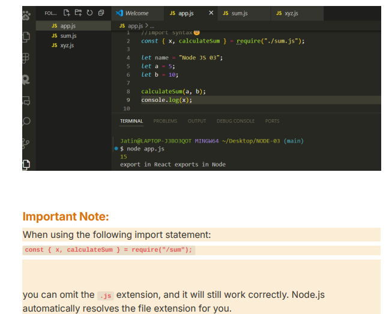
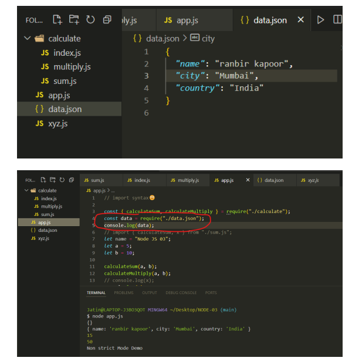

→EveryTime we run a node js application, there is one entry point in our application, that entry point is the file we give in command→ node app.js ⇒ app.js(is the entry point)


Now these two are different files/modules but what if I need both of em to execute!
Here we call xyz is a different module!


→


→ require(path) and since they are both in same directory sirf file ka name likhne se kaam hojaega! but ./ k bad likhna file name 


→ pehle dusri wali file ka code chla!

→`**require()**` **Function**:

- The `require()` function is a built-in Node.js function used to load modules. This can be used to import built-in modules (like `fs`, `http`, etc.), third-party modules (like `express`), or local modules that you create.

### Path Variations

- `**./xyz.js**`: Refers to a file named `xyz.js` in the **same directory** as the current file.
- `**../xyz.js**`: Refers to a file named `xyz.js` in the **parent directory** of the current file. The `..` represents moving up one directory level.
- `**/xyz.js**`: Refers to an absolute path starting from the root of the filesystem. This is generally not used for requiring local files in Node.js.
- `**xyz**`: If you just write the module name without any path indicators (like `require("xyz")`), Node.js will look for `xyz` in the following places:
    - Built-in modules (like `fs`, `http`, etc.).
    - `node_modules` folder (for installed packages

**Absolute Path**:

- The path `/xyz.js` is indeed an **absolute path**. It specifies a location starting from the **root directory** of the files system

---

---


→ So The function part when used inside the body of a different function will give error even if we require that module that is containing the function!

→While The other code from Sum module is running!

→ CalculateSum won’t be available!


→


  

→In Node.js, `module.exports` and `require` are fundamental components of the CommonJS module system, enabling code modularity and reusability.

- In a JavaScript file (module), you assign to `module.exports` the functions, objects, or variables you intend to make available to other modules.
- For example, to export a function:
    
    ```JavaScript
    module.exports = function add(a, b) {
      return a + b;
    };
    ```


**Importing a Module:**

- In another file, you use `require` to load the module, specifying the path to the module file.
- The `require` function returns the `module.exports` object from the specified module.

```JavaScript
const add = require('./mathUtils');
console.log(add(2, 3)); // Outputs: 5
```

**Why Exporting Is Necessary:**

- **Encapsulation:** By default, variables and functions defined in a module are scoped to that module and aren't accessible from other modules. Assigning them to `module.exports` explicitly makes them available for import.
- **Interface Definition:** Exporting allows you to define a clear interface for your module, specifying which parts are intended for external use.

**Why** `require` **Doesn't Automatically Expose Functions and Variables:**

- **Module Scope:** Each module in Node.js operates in its own scope. This design prevents variables and functions from polluting the global namespace, enhancing modularity and reducing the risk of conflicts.
- **Explicit Exports:** Only the properties and methods assigned to `module.exports` are exposed to other modules. This explicit approach ensures that only intended parts of the module are accessible externally.

  

### 1. **What Is an Object?**

An object in JavaScript is a collection of properties, where each property has a **key** (or name) and a **value**. The value can be anything — a number, string, another object, or even a function.

In JavaScript, object keys can be strings, symbols, or numbers (though numbers are treated as strings)


```javascript
const car = {
    make: 'Toyota',
    model: 'Camry',
    year: 2020,
    color: 'blue',
    start: function() {
        console.log('The car has started.');
    },
    stop: function() {
        console.log('The car has stopped.');
    }
};

// Accessing properties
console.log(car.make);  // Output: Toyota
console.log(car.year);  // Output: 2020

// Calling methods
car.start();  // Output: The car has started.
car.stop();   // Output: The car has stopped.

```


  

```JavaScript
const obj = {};
obj[123] = "value";
console.log(obj); // { '123': 'value' }
//A newer addition to JavaScript, symbols are unique and immutable. They can be used as keys to avoid property name collisions.
const sym = Symbol('key');
const obj = {
  [sym]: 'value'
};
console.log(obj[sym]); 
```

```JavaScript
const mathOperations = {
  add: function(a, b) {
    return a + b;
  },
  subtract: function(a, b) {
    return a - b;
  }
};
```

In this case:

- The **keys** are `add` and `subtract`.
- The **values** are the functions `function(a, b) { return a + b; }` and `function(a, b) { return a - b; }`.

So, the object `mathOperations` has two keys: `add` and `subtract`, and both of these keys map to functions.

### 2. **What Are Keys Like** `add` **and** `subtract`**?**

In the `mathOperations` object, `add` and `subtract` are **keys** (or properties). The **value** of each key is a function.

- `add` is a function that takes two arguments (`a` and `b`) and returns their sum.
- `subtract` is a function that takes two arguments (`a` and `b`) and returns their difference.

You can think of keys as labels, and the values are what’s stored under those labels.

When you import the `mathOperations` object using `require`, you can access its properties (keys) using **dot notation** or **bracket notation**.

### Dot Notation:

Dot notation is the most common way to access an object's properties. Here's how you use it:

```JavaScript
// Assuming you've imported mathOperations into mathOps
const mathOps = require('./mathOperations');

// Accessing the 'add' method of the mathOps object
console.log(mathOps.add(5, 3)); // Outputs: 8

// Accessing the 'subtract' method of the mathOps object
console.log(mathOps.subtract(5, 3)); // Outputs: 2
```

### Bracket Notation:

You can also access an object's properties using bracket notation, which is useful when you want to access a property dynamically or when the property name contains spaces or special characters.


  WE **cannot** do `obj.1` because numeric keys are not valid identifiers for **dot notation** in JavaScript. Dot notation requires the key to be a valid **JavaScript identifier**, which means:

1. It must start with a letter, underscore (`_`), or dollar sign (`$`).
2. It can only contain letters, numbers, underscores, or dollar signs.
3. It cannot be a number directly.

```JavaScript
// Using bracket notation
console.log(mathOps['add'](5, 3)); // Outputs: 8
console.log(mathOps['subtract'](5, 3)); // Outputs: 2
```

### . **Modifying the Object After Importing:**

After importing the object, you can also add, modify, or delete properties from the object:

- **Adding a new method:**
    
    ```JavaScript
    
    mathOps.multiply = function(a, b) {
      return a * b;
    };
    
    console.log(mathOps.multiply(5, 3)); // Outputs: 15
    ```
    
- **Modifying an existing method:**
    
    ```JavaScript
    
    mathOps.add = function(a, b) {
      return a + b + 1; // Slightly modified the function
    };
    
    console.log(mathOps.add(5, 3)); // Outputs: 9
    
    ```
    
- **Deleting a property:**
    
    ```JavaScript
    
    delete mathOps.subtract;
    
    console.log(mathOps.subtract); // Outputs: undefined
    ```
    

### **Why Objects Are Useful in This Case:**

Objects are useful because they allow you to bundle related functions (like `add`, `subtract`, etc.) together into one cohesive unit. This is especially helpful for modularity and code organization.

In this case, by using an object like `mathOperations`, you can group all your mathematical operations together and expose only the methods you want to other files through `module.exports`.

Now when we import an object using require we don’t have to store it another object, we can de -structure it on the fly!


```JavaScript
// app.js
const { add, subtract } = require('./mathOperations');

console.log(add(5, 3));      // Outputs: 8
console.log(subtract(5, 3)); // Outputs: 2
```

### **Why Destructuring Is Useful:**

- **Cleaner Code:** You avoid having to reference the object itself repeatedly (e.g., `mathOps.add`). Instead, you work directly with the functions or properties you're interested in.// BUT UNKI HI KEYS LIKHNA WHILE DESTRUCTURING 
- **Selective Importing:** If your module exports a large object with many properties, you can destructure only the parts that you need. This can make your code more readable and concise.

**Renaming Variables on the Fly:** You can also rename the variables while destructuring, which is useful if you want to avoid naming conflicts:

```JavaScript
javascript
Copy code
const { add: addition, subtract: minus } = require('./mathOperations');

console.log(addition(5, 3)); // Outputs: 8
console.log(minus(5, 3));    // Outputs: 2
```

### **What Happens Under the Hood:**

Destructuring simply pulls the keys (`add`, `subtract`, etc.) from the object returned by `require` and assigns their corresponding values to new variables. It's the same as:

```JavaScript

const mathOps = require('./mathOperations');
const add = mathOps.add;
const subtract = mathOps.subtract;

```

But destructuring lets you do it all in one concise statement.

**→When destructuring an object in JavaScript, you need to use the exact keys of the object if you want to access the properties directly. However, you can also rename the keys during destructuring if you want to use different variable names.**

### Using Exact Keys

```JavaScript
const { key1, key2 }  = require('./myModule');

// key1 and key2 must match the property names in myModule

```

### Renaming Keys

```JavaScript
const { key1: newName1, key2: newName2 } = require('./myModule');

// newName1 and newName2 are now the variables you can use instead of key1 and key2
```

### 1. **Destructuring a Large Object with Many Keys:**

If your module exports an object with many keys and you only need a few of them, you can destructure just those specific keys without worrying about the rest of the object. Let's assume the module exports an object with 100 keys, but you only need 2 of them.

```JavaScript
// largeModule.js
const largeObject = {
  key1: 'value1',
  key2: 'value2',
  key3: 'value3',
  // ... (up to 100 keys)
  key99: 'value99',
  key100: 'value100'
};

module.exports = largeObject;
```

Now, when importing, you only need `key2` and `key99`. You can selectively destructure them like this:

While DE structuring it only the the order of keys don’t matter since we’re DE structuring using the name of the keys!

```JavaScript

// app.js
const { key2, key99 } = require('./largeModule');

console.log(key2);  // Outputs: value2
console.log(key99); // Outputs: value99
```

If the exported object contains only one key, you can still destructure it, even though it might not be necessary in most cases. Destructuring can still be used if you prefer the syntax or want to maintain consistency in how you import values.

In JavaScript, **destructuring** is not limited to objects. It can be applied to **arrays** as well. However, you cannot destructure non-iterable types like strings, numbers, or `null`/`undefined`

### 1. **Destructuring Objects:**

Destructuring is most commonly used with objects. As you already know, it allows you to extract values by matching the **keys** in the object to the variable names you define.

```JavaScript

const user = {
  name: 'Alice',
  age: 25,
  country: 'USA'
};

const { name, age } = user; // Destructuring
console.log(name);  // Outputs: 'Alice'
console.log(age);   // Outputs: 25
```

### 2. **Destructuring Arrays:**

You can also destructure arrays. The syntax is similar, but with arrays, you extract based on the **position** of the elements rather than key names.

```JavaScript

const numbers = [1, 2, 3];

// Destructuring an array
const [first, second] = numbers;
console.log(first);  // Outputs: 1
console.log(second); // Outputs: 2
```

In array destructuring:

- `first` corresponds to `numbers[0]` (the first element).
- `second` corresponds to `numbers[1]` (the second element).

You can also skip certain elements in an array:

```JavaScript
javascript
Copy code
const [first, , third] = numbers;
console.log(first);  // Outputs: 1
console.log(third);  // Outputs: 3

// first ,space, third
```

### 3. **Destructuring Strings:**

You can destructure strings because strings are iterable (i.e., you can iterate over their characters like an array):

```JavaScript
javascript

const str = "Hello";

// Destructuring a string
const [firstChar, secondChar] = str;
console.log(firstChar);   // Outputs: 'H'
console.log(secondChar);  // Outputs: 'e'

```

### 4. **Destructuring with Default Values:**

You can provide default values in case the value you’re trying to destructure is `undefined`.

```JavaScript
javascript

const { name = 'Anonymous', age = 30 } = {}; // Empty object
console.log(name);  // Outputs: 'Anonymous'
console.log(age);   // Outputs: 30

```

This also works for arrays:

```JavaScript
javascript
const [a = 10, b = 20] = [];
console.log(a);  // Outputs: 10
console.log(b);  // Outputs: 20
```

### 5. **Destructuring Functions' Parameters:**

You can destructure objects or arrays when they are passed as arguments to a function:

### Object as Parameter:

```JavaScript
javascript
Copy code
function greet({ name, age }) {
  console.log(`Hello, my name is ${name} and I am ${age} years old.`);
}

const user = { name: 'Alice', age: 25 };
greet(user);  // Outputs: 'Hello, my name is Alice and I am 25 years old.'

```

### Array as Parameter:

```JavaScript
javascript
Copy code
function sum([a, b]) {
  return a + b;
}

console.log(sum([5, 10]));  // Outputs: 15

```

### 6. **Destructuring Non-Objects and Non-Arrays:**

Destructuring **does not work** with primitive values like numbers, `null`, `undefined`, or booleans. These are not iterable or structured in key-value pairs, so destructuring them throws an error.

For example:

```JavaScript
javascript
Copy code
const { length } = 5;  // Error: Cannot destructure property `length` of '5'

```

But note that **strings**, which are primitive, can be destructured because they are iterable, as shown earlier.


-Both are same only JS gives us a shortcut , when you’re about to make the name of the key and value same!



→


Yes, in a JSON object, you need to add a comma (`,`) at the end of each key-value pair except for the last one on the other hand in a js object last wali key-value pair k end mein bhi aega comma// aa skta hai. For example:

```JSON
{
  "type": "commonjs",
  "main": "index.js"
}
```

### 1. **Exporting Multiple Variables and Functions**

You can export multiple variables and functions from a module using named exports. Here’s how you can do that:

### Example: Exporting from `mathOperations.js`

```JavaScript
javascript
Copy code
// mathOperations.js

// Exporting multiple functions and variables
export const PI = 3.14;

export function add(a, b) {
  return a + b;
}

export function subtract(a, b) {
  return a - b;
}

```

### 2. **Receiving the Exports**

When you want to use the exported items in another module, you can import them using the `import` statement.

### Example: Importing in `app.js`

You can import specific named exports like this:

Name exact rakhna , since we're cherry picking things from the other module

```JavaScript
javascript
Copy code
// app.js

// Importing specific items from the module
import { PI, add, subtract } from './mathOperations.js';

console.log(PI);               // Outputs: 3.14
console.log(add(5, 3));        // Outputs: 8
console.log(subtract(5, 3));   // Outputs: 2
```

### 3. **Importing All Exports as an Object**

If you want to import all the exports from a module under a single namespace, you can do so with the `* as` syntax:

```JavaScript
javascript
Copy code
// app.js

// Importing everything as mathOps
import * as mathOps from './mathOperations.js';

console.log(mathOps.PI);              // Outputs: 3.14
console.log(mathOps.add(5, 3));       // Outputs: 8
console.log(mathOps.subtract(5, 3));  // Outputs: 2
```

### 4. **Default Exports vs Named Exports**

- **Named Exports:** You can have multiple named exports in a single module. When importing, you use curly braces to specify which items you want.
- **Default Export:** A module can also export a single default item, which can be imported without curly braces. Here’s an example of combining both:

### Example: Using Default and Named Exports

```JavaScript

// mathOperations.js

export const PI = 3.14;

export function add(a, b) {
  return a + b;
}

export function subtract(a, b) {
  return a - b;
}

// Default export
export default function multiply(a, b) {
  return a * b;
}

```

### Importing Default and Named Exports

```JavaScript

import multiply, { PI, add, subtract } from './mathOperations.js';

console.log(PI);               // Outputs: 3.14
console.log(add(5, 3));        // Outputs: 8
console.log(subtract(5, 3));   // Outputs: 2
console.log(multiply(5, 3));   // Outputs: 15
```

### 1. **Named Exports and Curly Braces:**

In ESM, when you export multiple named items from a module (e.g., variables, functions, classes), you use **curly braces** during import to specify which named exports you want to import.

```JavaScript
export const PI = 3.14;
export function add(a, b) {
  return a + b;
}
export function subtract(a, b) {
  return a - b;
}
```

To import these named exports, you use curly braces:

```JavaScript

// app.js
import { PI, add } from './mathOperations.js'; // YAHAN NAME EKDM EXACT MATCH KARNA CHAHIYE JO PADA HAI USEE DUSRE MODULE MEIN USSE
console.log(PI); // 3.14
```

### **Why Curly Braces?**

The curly braces `{}` in this case indicate that you're explicitly importing **specific named exports** from a module. It’s like saying, "Give me exactly `PI` and `add` from that file."

- **Without curly braces**, JavaScript would not know which specific named export you are referring to.
- This is **not destructuring**, but it does have a similar feel since you are "picking" specific properties from the module (like destructuring an object).

### 2. **Default Export: No Curly Braces Needed**

When you use a **default export**, you don’t need curly braces because there’s only **one item being exported as the default**. This is the main export of the module, and you can name it anything you like when importing.

```JavaScript

// mathOperations.js
export default function multiply(a, b) {
  return a * b;
}

```

You can import the default export without curly braces:

```JavaScript

// app.js
import multiply from './mathOperations.js';
console.log(multiply(5, 3)); // 15
```

### 3. **Comparison with Destructuring:**

Though the curly braces give the feel of destructuring, the mechanisms are different.

- **Named Import:** You use curly braces to **import specific exports** from a module. The curly braces are required for importing named exports so that the module system knows which part of the module you are requesting.
    
    ```JavaScript
  
    import { add, subtract } from './mathOperations.js';
    
    ```
    
- **Destructuring:** In destructuring, you extract properties or elements from objects or arrays.
    
    ```JavaScript
    javascript
    Copy code
    const { property1, property2 } = object;
    ```
    

  
When you receive an  **object** from an export in ECMAScript Modules (ESM), you cannot destructure it **directly during the** `**import**` **statement**.  
  
  

### Why Can't We Destructure During Import?

The **import statement** only handles importing **modules**, not destructuring values. The import system is part of the module resolution mechanism, and it's different from JavaScript's object destructuring.

For example, this would result in a syntax error:

```JavaScript
javascript
Copy code
// ❌ This will throw an error!
import { PI, add } = mathOps from './mathOperations.js'; // Incorrect!

```

The correct way is to first import the entire object/module, and then destructure it **afterwards**

### Step 1: Import the Object

You can import the whole object using a default import:

```JavaScript
import mathOps from './mathOperations.js';

```

### Step 2: Destructure After Importing

Once you have imported the object, you can destructure it like this:

```JavaScript

// app.js

import mathOps from './mathOperations.js';

// Destructuring the object after import
const { PI, add, subtract } = mathOps;

console.log(PI);             // 3.14
console.log(add(5, 3));       // 8
console.log(subtract(5, 3));  // 2
```


Since it’s any empty object then we can do this too!


→ EK PATTERN KO PAKDO ISKO HAMESHA OBJECTS KO EXPORT KARO , EVEN FUNCTION HAI TOH USKO BHI EXPORT OBJECT BANAKE KRO!

We can change the names of the keys while destructuring an object "on the fly" by using **aliasing**. This is done by specifying a new variable name after the original key using the syntax `key: newName`.

### Example: Renaming Keys during Destructuring

Suppose you have the following object:

```JavaScript
javascript
Copy code
const mathOps = {
  PI: 3.14,
  add(a, b) {
    return a + b;
  },
  subtract(a, b) {
    return a - b;
  }
};

```

You can destructure and rename the keys like this:

```JavaScript
javascript
Copy code
// Destructuring and renaming keys
const { PI: circleConstant, add: sum, subtract: difference } = mathOps;

console.log(circleConstant);  // Outputs: 3.14
console.log(sum(5, 3));       // Outputs: 8
console.log(difference(5, 3));// Outputs: 2

```

### Explanation:

- `PI: circleConstant` means you are destructuring the `PI` property from the object and assigning it to the variable `circleConstant`.
- Similarly, `add: sum` renames the `add` function to `sum`, and `subtract: difference` renames `subtract` to `difference`.

This way, you can change the names of the keys on the fly while destructuring.

### Important Notes:

- The **key on the left** of the colon (`:`) refers to the original key in the object.
- The **name on the right** of the colon is the new variable name that you want to use.


  


→ we don’t even have to write in the path this ./calculate/index just ./calculate likhne se hi kam hojayega!

**→**`**require('./calculate')**` **works** because Node.js looks for an `index.js` file in the `calculate` folder by default, which serves as the main entry point.  
→  
`require('./calculate/index')` works because you're providing an explicit path to the `index.js` file. Both methods are valid, but the first is shorter and takes advantage of Node.js’s module resolution behavior.  
  
  




```JavaScript
console.log(JSON.stringify(data));
```

  
•  
`JSON.stringify(data)` converts a JavaScript object or value to a JSON string. This is useful for debugging or sending data over a network.

  

```JavaScript
const util = require("util"); // 'util' bhi use kar skte ho
```

### Explanation:

- `**require("util")**`: This imports the built-in `util` module from Node.js, which provides various utility functions for debugging and working with objects.
- `**const util**`: This assigns the imported `util` module to the constant variable `util`.

→In general, a **module** can be a single file or a folder. A module is essentially a collection of JavaScript code that is private to itself and organized separately. If  
you want to export something from a module, you can use module.exports to expose the desired functionality to other parts of your application


**JSON (JavaScript Object Notation) and JavaScript objects have similarities but are fundamentally different in their nature and use cases. Here's a detailed explanation of their differences:**

### 1. **Format**

- **JSON**: A text-based format that is used to represent data as a string.
    - **Example**:
```json 
        {   "name": "Alice", 
            "age": 25, 
            "isStudent": true
        }
```

        
    - In JSON, **all keys must be strings** and values must be valid JSON data types (strings, numbers, booleans, arrays, objects, or `null`).
- **JavaScript Object**: A data structure in JavaScript that can store key-value pairs (or properties). The keys do not have to be strings; they can also be variables or symbols.
    - **Example**:
```javascript
        const person = {   
         name: "Alice",  
         age: 25,   
         isStudent: true ,
         };
```

### 2. **Data Types**

- **JSON**: Can only contain specific data types as keys:
    
    - Strings
    - Numbers
    - Booleans (`true`, `false`)
    - Arrays
    - Objects (which map to JSON objects)
    - `null`
    
    **JSON does NOT support**: Functions, `undefined`, or symbols.
    
- **JavaScript Object**: Can contain all JavaScript data types, including:
    
    - Strings, numbers, Booleans
    - Functions
    - `undefined`
    - Symbols
    - Methods (functions attached to objects)
    
    **Example**:

```javascript
    const person = {   
    name: "Alice",   
    age: 25,   
    greet: function() { 
    console.log("Hello!");
       } 
    };
```


### 3. **Usage**

- **JSON**: Used for **data interchange** between systems (usually between a client and server, or different systems). It's purely a **data representation format** and can be used in other programming languages, not just JavaScript.
    - JSON is widely used in web APIs to transmit data between the client (browser) and the server.
- **JavaScript Object**: Used in actual JavaScript code for storing and manipulating data. It can contain functions and other advanced types, making it more powerful for use in a programming environment.

### 4. **How They're Used Together**

- **JSON**: Usually needs to be parsed into a JavaScript object before you can work with it in your JavaScript code. Similarly, JavaScript objects can be converted into JSON strings when you need to send them over a network.
    
    - **Converting JSON to a JavaScript object**: `JSON.parse()`
    - **Converting a JavaScript object to JSON**: `JSON.stringify()`
    
    **Example**:
    
    
```javascript
    const jsonString = {"name": "Alice", "age": 25};  
    JSON format (string)  // Parsing JSON string to a JavaScript object 
    const jsObject = JSON.parse(jsonString); 
    console.log(jsObject);  // Output: {name: "Alice", age: 25}  // Converting a JavaScript object to JSON format 
    const jsonObject = JSON.stringify(jsObject); console.log(jsonObject);  // Output: '{"name":"Alice","age":25}'`
```


### 5. **Syntax Rules**

- **JSON**: Stricter syntax:
    
    - All keys must be **enclosed in double quotes**.
    - Only specific data types are allowed.
    
    **Example**:
    
    
``` json
    
    Copy code
    
    {   "name": "Alice",   "age": 25 }
```

    
- **JavaScript Object**: More flexible syntax:
    
    - Keys do not need to be in quotes (unless they contain special characters).
    - Can include any valid JavaScript expression.
    
    **Example**:
    
    
```javascript
    
    Copy code
    
    const person = {   name: "Alice",   age: 25 };
```

    

### Summary:

| **Aspect**       | **JSON**                                                     | **JavaScript Object**                                       |
| ---------------- | ------------------------------------------------------------ | ----------------------------------------------------------- |
| **Format**       | Text format (string)                                         | In-memory data structure                                    |
| **Use Case**     | Data interchange, often between systems                      | Manipulating data within JavaScript code                    |
| **Keys**         | Must be strings, in double quotes                            | Can be unquoted if valid JavaScript identifiers             |
| **Data Types**   | Limited to strings, numbers, booleans, arrays, objects, null | Can include functions, `undefined`, `symbol`, methods, etc. |
| **Supported in** | Used in many languages, not just JavaScript                  | Only within JavaScript                                      |
| **Conversion**   | Needs `JSON.parse()` and `JSON.stringify()` to convert       | Native to JavaScript, no conversion needed                  |

---

In essence, JSON is a lightweight format for storing and transmitting data, while JavaScript objects are more versatile and used for actual coding and logic within JavaScript programs.

