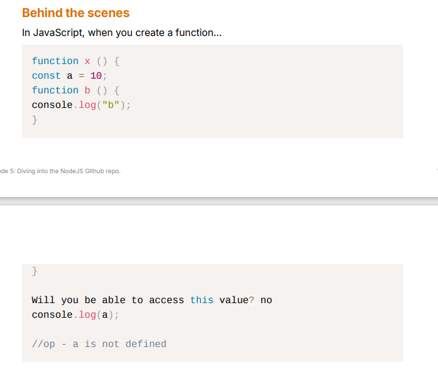

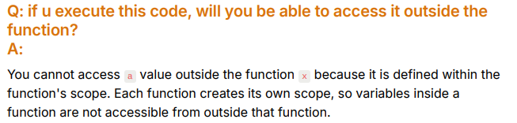

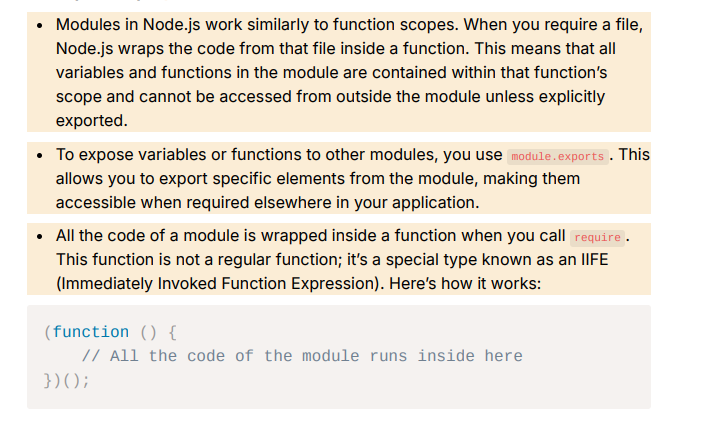

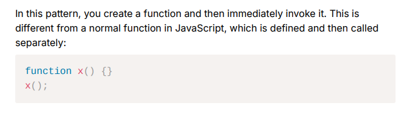

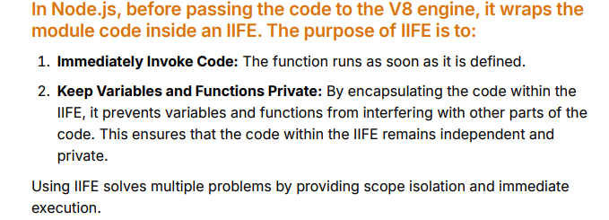

**FUNCTION BNATE HI IMMEDIATELY INVOKE KAR DIYA!**

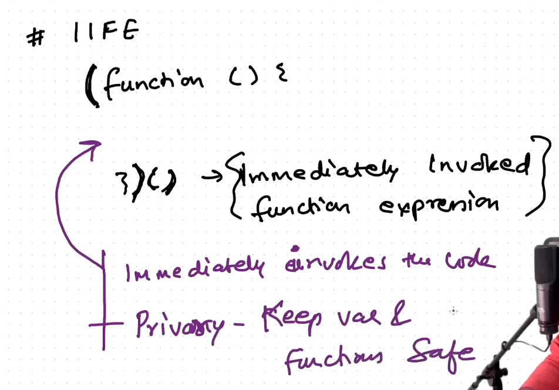

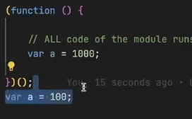

→Ye ek dusre se interferre nahi karenge!


→Wrapping Some code in the IIFY makes it some sort of independent code!

**Node.js wraps every module, including the main file, for several important reasons, even if that file is not being required by another module. Here are the key reasons for wrapping the main file:**

1. **Module Isolation**
    - **Scope Management:** Wrapping the main file ensures that the variables and functions defined in that file do not pollute the global scope. If a file were not wrapped, any variables defined in it would be added to the global scope, which could lead to naming conflicts and unintended behavior when running multiple modules.
2. **Consistency Across Modules**
    - **Uniform Module System:** By wrapping all modules (including the main file) in the same way, Node.js provides a consistent mechanism for handling modules. This uniformity simplifies the understanding of how modules work in Node.js, whether they are the entry point of the application or other dependent modules.
3. **Access to Module-Specific Variables**
    - **Access to module, exports, require, etc.:** The wrapped function provides access to special variables like `module`, `exports`, `require`, `__filename`, and `__dirname`. This access is important for:
        - Exporting functionality using `module.exports`.
        - Importing other modules with `require`.
        - Getting the path of the current module file and directory.
4. **Encapsulation**
    - **Encapsulation of Logic:** The wrapping mechanism allows you to encapsulate the logic of your application, keeping internal variables and functions private to the module. This means that code within the module cannot interfere with code in other modules, unless explicitly exposed through exports.
5. **Facilitates Testing and Debugging**
    - **Isolated Testing:** Since each module is wrapped in its own function, it can be tested independently. This isolation makes debugging easier, as you can focus on one module without worrying about the state of others.

### Who Wraps the File?

1. **Node.js Internals**:
    - When you execute a JavaScript file using Node.js, the Node.js runtime automatically wraps the file's contents in a function. This process is handled internally by Node.js and is not something you see in the code.

### Wrapping Structure

- **Initial Wrap**: When you run a file, like `myFile.js`, Node.js wraps it in a function:
    
    ```JavaScript
    
    (function (exports, require, module, __filename, __dirname) { // these parametres are given by node
      // Your code here
    });
    
    ```
    
- **Nested Wraps with** `**require**`: If you use `require` to load another module (e.g., `anotherModule.js`), Node.js will also wrap that module in a similar function when it is loaded:
    
    ```JavaScript
    
    (function (exports, require, module, __filename, __dirname) {
      // Code from anotherModule.js
    });
    
    ```
    

### How Nested Wrapping Works

1. **Parent Module**: When you run the parent module (`myFile.js`):
    - The code in `myFile.js` is wrapped and executed, giving access to the `module`, `exports`, and other variables.
2. **Child Module**: When `myFile.js` calls `require('./anotherModule.js')`:
    - Node.js wraps the contents of `anotherModule.js` in its own function. The `module` and `exports` in this context refer to `anotherModule.js`, not the parent module.

### **How** `**require**` **Imports a Module**

When you use `require('./myModule.js')`, the following happens:

- Node.js looks for `myModule.js` based on the given path.
- Node.js reads the contents of `myModule.js`, wraps it in a function, and executes it.
- During execution, the `module.exports` object from `myModule.js` is created, and anything attached to `module.exports` is what will be made available to other modules that `require()` it.
- The result of `require('./myModule.js')` is whatever the `module.exports` object contains.

  
The  `require` function is a built-in feature of Node.js, and it is injected into each module when Node.js wraps it in the function. This makes `require` available in the local scope of every module.

**Module Loader**: The `require` function is part of Node.js's **module loader system**. It allows you to import modules by specifying a file path or module name. When you call `require()`:

- Node.js looks for the module file (e.g., `./myModule.js`).
- It loads, compiles, and wraps the module in the function.
- It executes the module code.
- It returns the value of `module.exports` from the loaded module

**WRAPPING TOH SABKI HOTI HAI! LOL**

→By default, `module.exports` is an empty object (`{}`), and anything assigned to `module.exports` or `exports` becomes accessible to the requiring module.

  

**Function Wrapping** occurs when a module is loaded (not specifically when `require()` is called but as part of the module-loading process). Node.js wraps the contents of each module inside a function to provide things like `module`, `exports`, `require`, `__dirname`, and `__filename`. This wrapping ensures that each module has its own scope and can safely use these objects.  
  
  

```C++

// myModule.js
const someVar = 'Hello';

function greet() {
  return 'Hi';
}

module.exports = { greet };

```

Behind the scenes, Node.js wraps this code into a function like this:

```C++

(function (exports, require, module, __filename, __dirname) {
  const someVar = 'Hello';

  function greet() {
    return 'Hi';
  }

  module.exports = { greet };
});

```

- **When is it executed?**: The wrapping happens the moment Node.js loads a module for the first time. So, when you call `require('myModule')`, Node.js first checks whether the module is cached. If not, it loads the module, wraps its code in the function, executes that function, and returns the `module.exports` object to the `require` caller.

  

→When you use module.exports , you're modifying the exports object of the current module. Node.js relies on this object to determine what will be exported from the module when it's required in another file. The module object is automatically provided by Node.js and is passed as a parameter to the function that wraps your code. This mechanism allows you to define which parts of your module are accessible externally

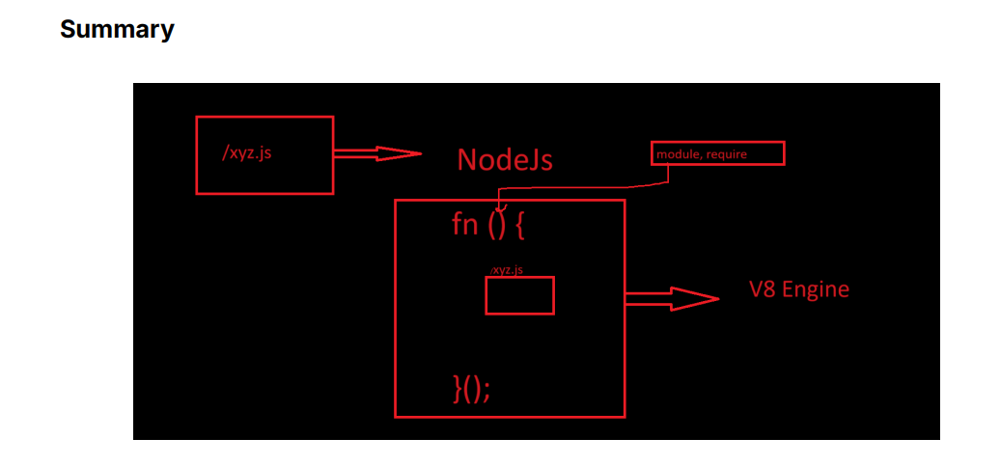


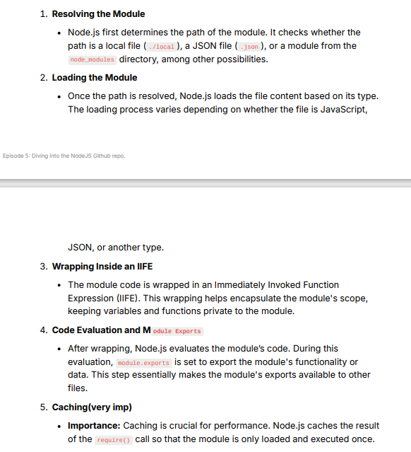

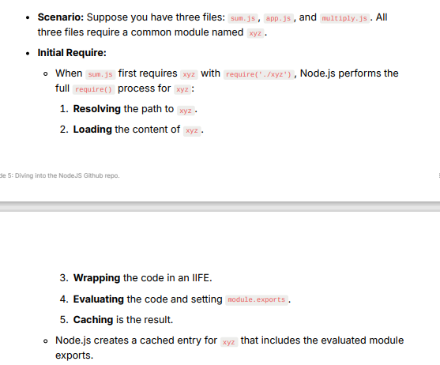

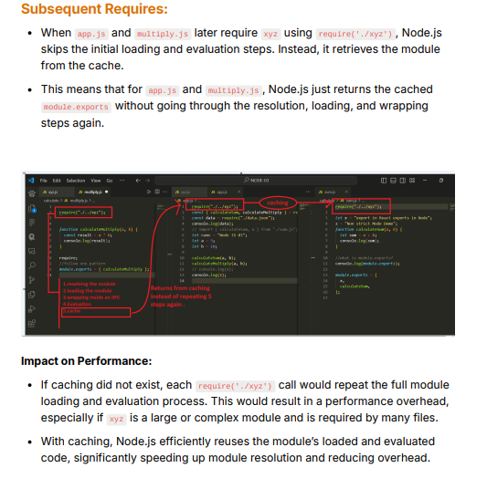

→In Node.js, the `require` function has a built-in caching mechanism that helps improve performance and manage module loading efficiently. When a module is required, it is loaded and executed only once. Subsequent calls to `require` for the same module will return the cached version instead of loading it again.  
  

### CACHING

`moduleZ.js`:

```JavaScript

console.log('Loading Module Z');

const moduleX = require('./moduleX'); // Require Module X
const moduleY = require('./moduleY'); // Require Module Y

moduleX.increment(); // Call increment from Module X

```

`**moduleY.js**`:

```JavaScript

console.log('Loading Module Y');

const moduleX = require('./moduleX'); // Require Module X

moduleX.increment(); // Call increment from Module X
moduleX.increment(); // Call increment again

```

`**moduleX.js**`:

```JavaScript

console.log('Loading Module X');

let count = 0;

module.exports = {
  increment: function () {
    count++;
    console.log('Count in Module X:', count);
  },
};

```

### Execution Order Breakdown

1. **Starting with** `**app.js**`:
    - When you run `app.js`, it begins executing and requires **Module Z**.
2. **Loading Module Z**:
    - Upon requiring **Module Z**, Node.js checks if it’s cached. Since it’s the first require, it’s not cached yet, so Node.js loads **Module Z**.
    - It encounters the line `const moduleX = require('./moduleX');` first.
3. **Loading Module X**:
    - Node.js checks if **Module X** is cached. Since it’s the first time **Module X** is being required, it’s not cached yet.
    - Node.js executes **Module X**, printing "Loading Module X" and initializing `count` to 0.
    - Control returns to **Module Z**, and now `moduleX` holds the reference to the exported functions from **Module X**.
4. **Back to Module Z**:
    - After requiring **Module X**, control returns to **Module Z**, which then has:
        - `const moduleX` containing the exports from **Module X**.
    - Next, it executes the line `const moduleY = require('./moduleY');`.
5. **Loading Module Y**:
    - Node.js checks if **Module Y** is cached. Since it’s not cached yet, it loads **Module Y**.
    - Inside **Module Y**, it requires **Module X** again with `const moduleX = require('./moduleX');`.
6. **Checking Cache for Module X Again**:
    - This time, Node.js finds **Module X** in the cache (from the earlier execution) and retrieves it without executing it again.
    - Control returns to **Module Y**, where `moduleX.increment()` is called twice, incrementing `count` to 1 and then to 2.
7. **Back to Module Z**:
    - After **Module Y** has finished executing, control returns to **Module Z**.
    - Now, **Module Z** calls `moduleX.increment()` again. Since **Module X** was previously required and the state of `count` is now 2, this increments `count` to 3.

### Final Output

The final output when running `app.js` will be:

```Mathematica

Starting application
Loading Module Z
Loading Module X
Loading Module Y
Count in Module X: 1
Count in Module X: 2
Count in Module X: 3

```

### Conclusion

So, to summarize:

- When **Module Z** is loaded, it first requires **Module X** and loads it, which executes and caches **Module X**.
- After that, when **Module Z** requires **Module Y**, **Module Y** also requires **Module X**. However, since **Module X** is cached, it uses the existing instance instead of executing it again.
- This sequence ensures that the functions from **Module X** can be used in both **Module Y** and **Module Z** without reloading the module, preserving the state as designed.

Your original observation about the order of execution is correct; **Module Z** indeed requires **Module X** first, followed by **Module Y**. The key takeaway is that while **Module Y** is loaded after **Module Z**, it doesn't affect the already established cache for **Module X** when it is required again.

  
→In Node.js, when a module is required using the   `require()` function, it is loaded and cached the first time it is requested. Any subsequent calls to `require()` for the same module do not create a new instance or copy of that module; instead, they return the cached version. This behavior is crucial for ensuring efficiency and maintaining state across different parts of your application.  
  
  

### Key Points About Module Caching in Node.js

1. **Single Execution**:
    - A module is executed only once, no matter how many times it is required from different modules. The first time a module is required, Node.js runs its code, and the exports are made available.
2. **Caching Mechanism**:
    - After a module is executed, it is stored in the cache. The next time that module is required, Node.js retrieves the cached instance instead of re-executing the module code.
3. **Shared State**:
    - Because only one instance of the module exists, any state held within that module (like variables or functions) is shared across all requires. This means changes to variables or states in one module will reflect in all other modules that require it.
4. **No New Copies**:
    - There are no new copies or instances of the module created after the first load. This means that any modifications or operations performed on the exports of the module will affect the same instance shared across all requiring modules.

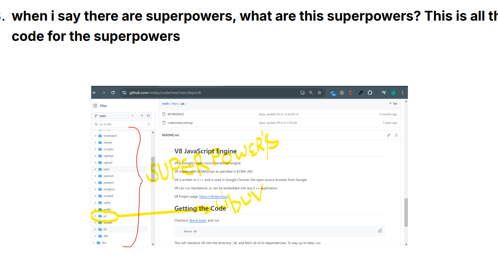


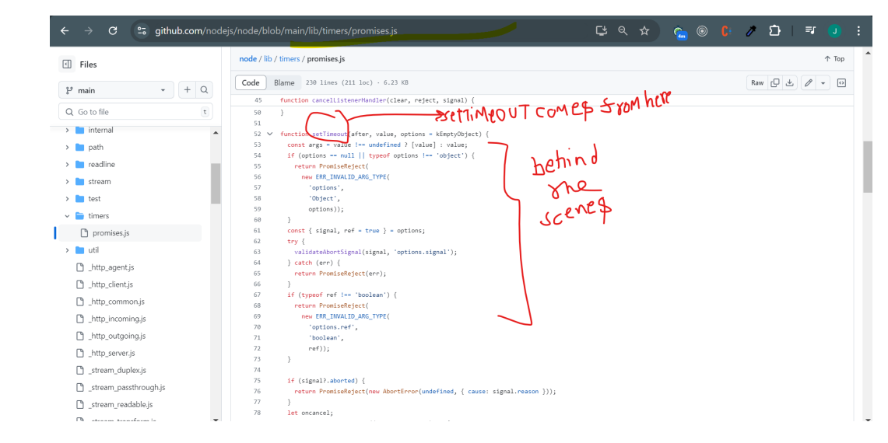


https://github.com/nodejs/node/blob/main/lib/internal/modules/helpers.js

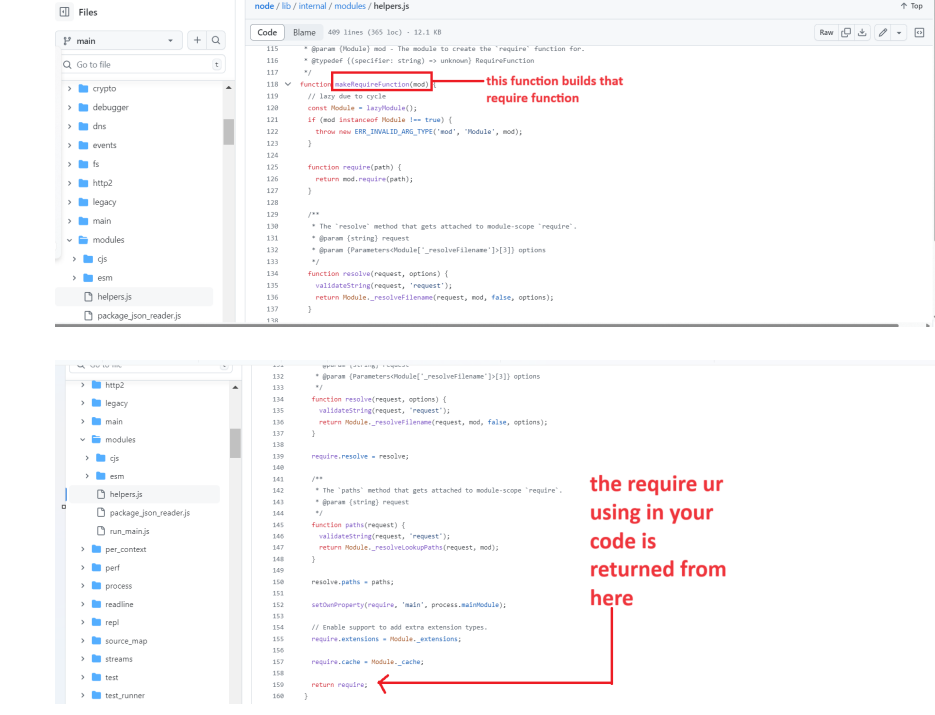

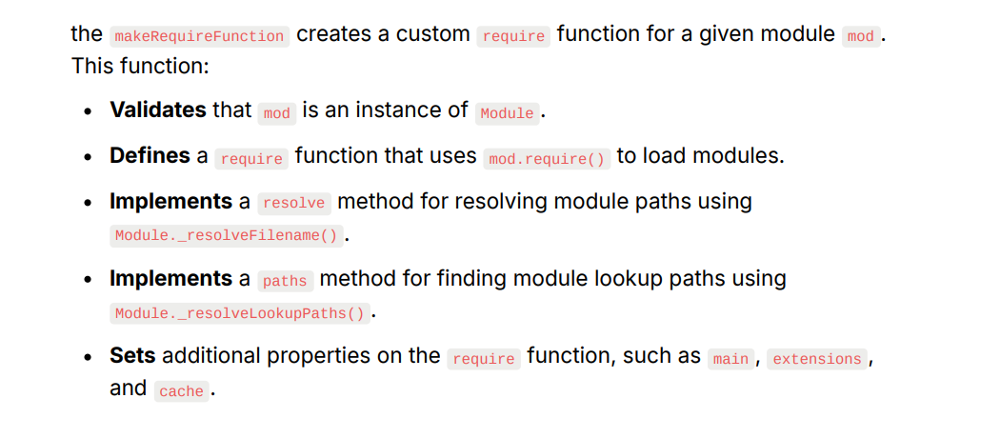