**"Node.js has an event-driven architecture capable of asynchronous I/O.”**

→JavaScript is Synchronous, Single Threaded Language!

### **Synchronous:**

Think of **synchronous** as doing things **one after the other**, in a strict order.  
In programming,  **synchronous** means that when a task starts, the program **waits** for it to finish before moving on to the next task. All tasks happen in a sequence.

### **Asynchronous:**

Now, imagine **asynchronous** like **multitasking**. You can do multiple things at once.  In programming, **asynchronous** means the program doesn’t wait for one task to finish before starting another. Some tasks, like fetching data from a server or waiting for a timer, are done in the background while the rest of the program continues to run.  
  

### **Synchronous in JavaScript:**

JavaScript executes code **line by line**, and each line must finish before the next one starts. If one task takes a long time, everything else has to wait.

### **Asynchronous in JavaScript:**

When JavaScript encounters something that might take a while (like a web request or a timer), it doesn’t just stop and wait. Instead, it moves on to the next task while that long task happens **in the background**. Once the background task finishes, it will notify JavaScript, which will come back to it when it's ready.

### **What’s a Thread?**

Think of a **thread** as a **line of workers** or a **path** that a program follows to complete tasks.  
  
**Single-threaded**: If you have only **one thread**, the program can only do **one thing at a time** (like a chef with one pair of hands who can only cook one dish at a time).

In a **multithreaded** program:

- **Multiple threads** (like multiple workers) are running **at the same time**, executing different parts of the program.
- Each thread can handle its own task independently.

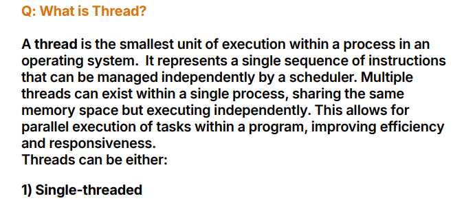

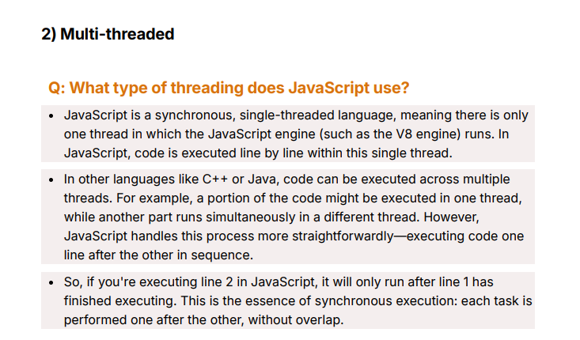

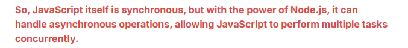

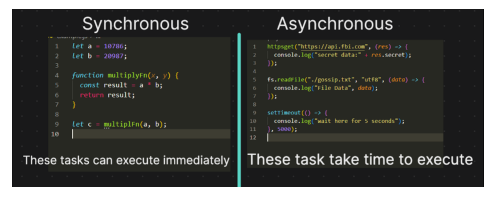

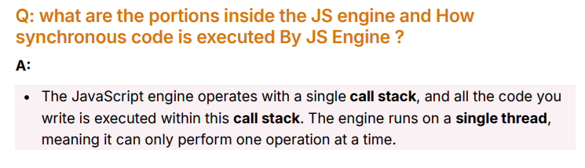

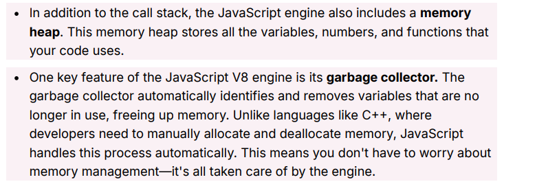

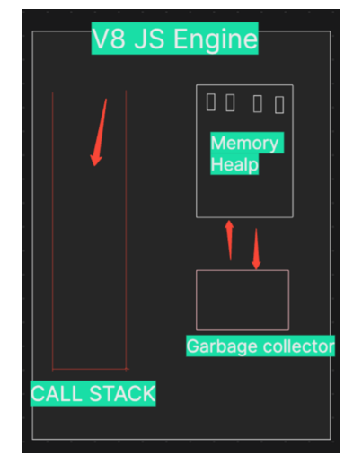


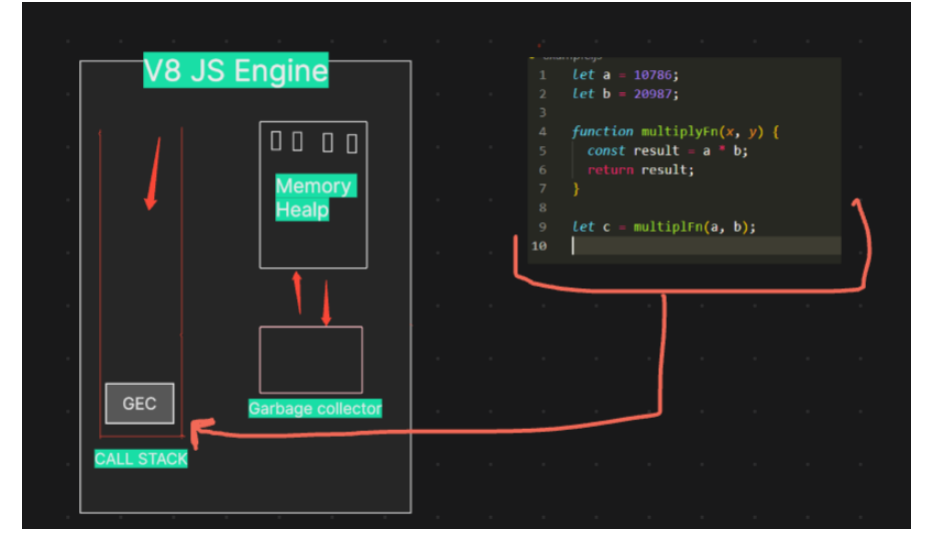

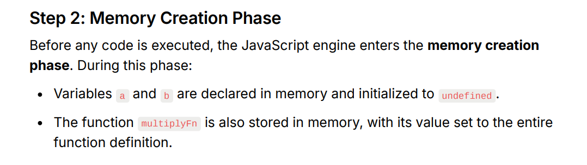

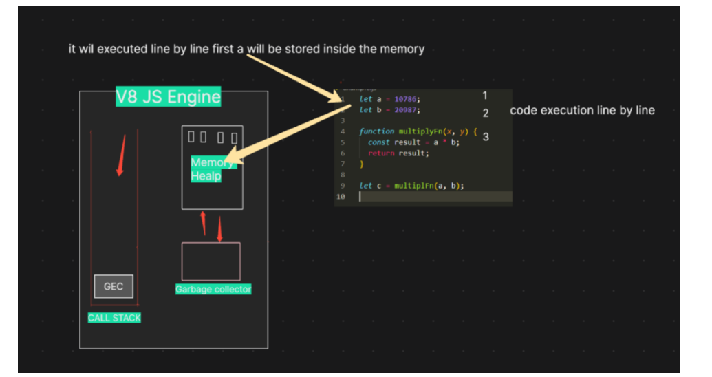

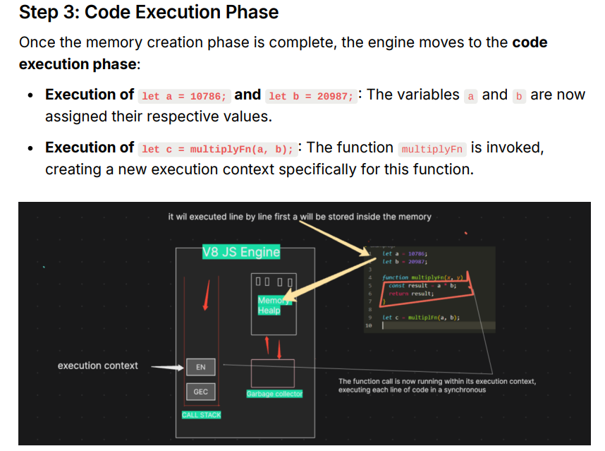

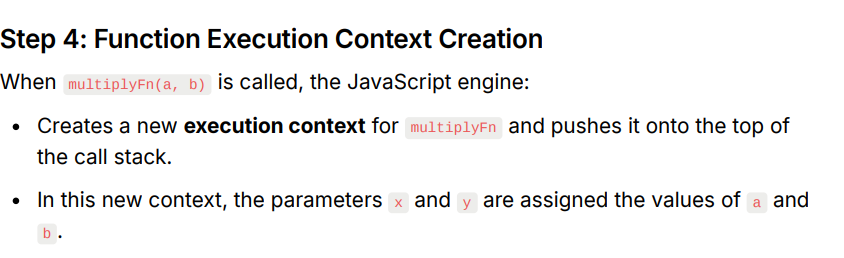

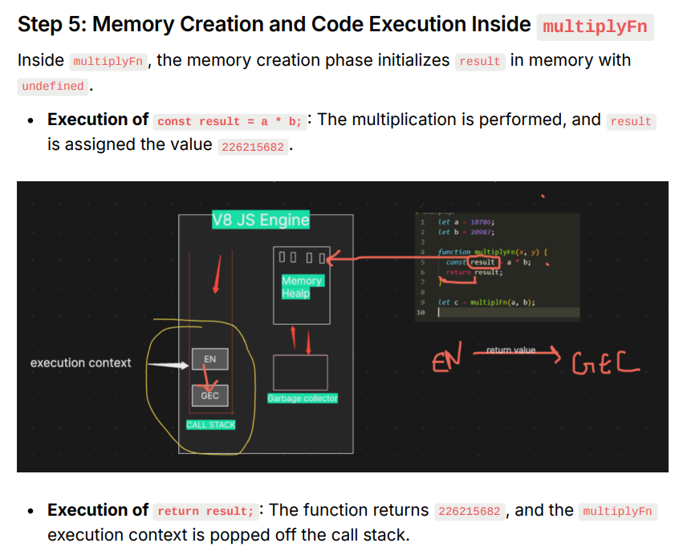

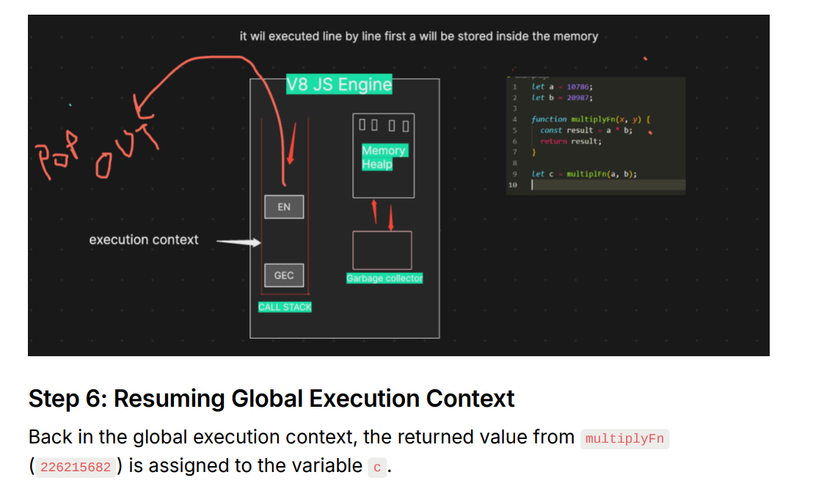

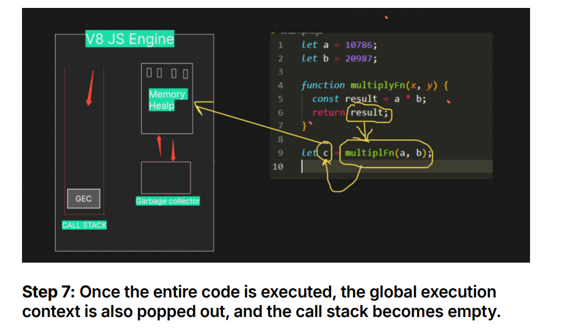


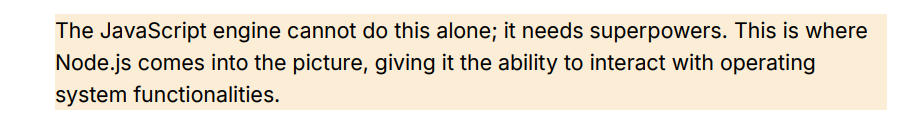


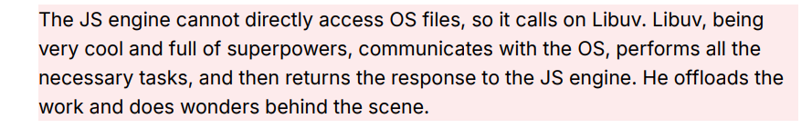

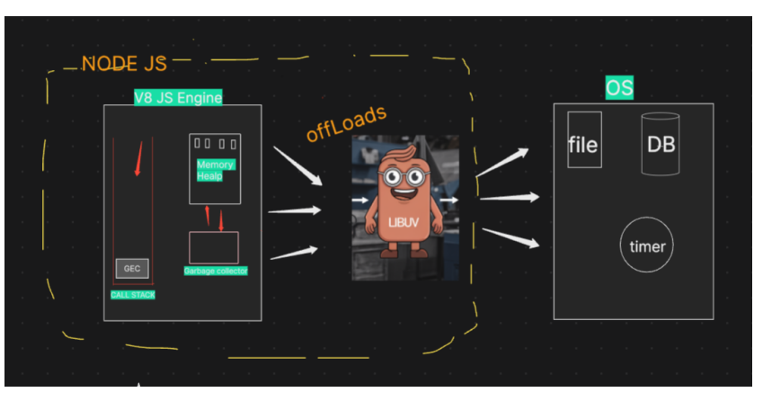

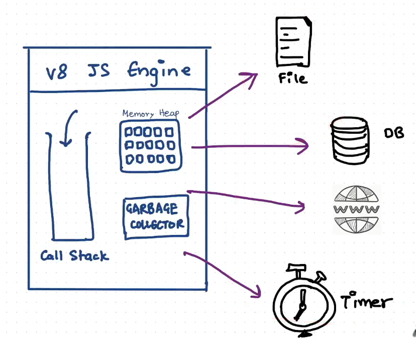

→ JAVASCRIPT ENGINE CAN’T DO ANY OF THESE THINGS!

→In **pure JavaScript**, the **V8 engine** is responsible for executing and optimizing JavaScript code. It handles things like:

- **Compiling JavaScript to machine code**.
- **Memory management and garbage collection**.
- **Running the core JavaScript language**, including loops, conditionals, functions, and more.

However, V8 cannot handle **asynchronous tasks** like network requests, timers, or file handling **without the help of external APIs** (like browser APIs or Node.js APIs). It is responsible for **executing JavaScript** efficiently, but it relies on the **environment (browser or Node.js)** to manage tasks that require asynchronous behavior.

→ Then Jo ye Unsynchronus piece of code milta hai uska usko use krne k liye humein WEB browser api ya node js chahiye hota hai!

  

→The V8 engine is focused on **executing JavaScript code efficiently**, but it’s **not responsible for handling input/output (I/O) operations**, like reading files, making HTTP requests, or handling timers. These tasks are typically managed by the environment in which JavaScript is running (like the **browser** or **Node.js**), and they use **system-level features** that are beyond the scope of a JavaScript engine.

This separation of concerns keeps V8 optimized for executing code, while the **asynchronous task handling** is managed by the broader environment (browser or Node.js) using the event loop.

**→Single-threaded nature**: The V8 engine itself runs JavaScript on a **single thread**, meaning it handles tasks one at a time. It can’t do two things simultaneously in that one thread. If JavaScript were purely synchronous, it would block on long-running tasks (like file reads or network requests), freezing the program until those tasks finish.  
  
  

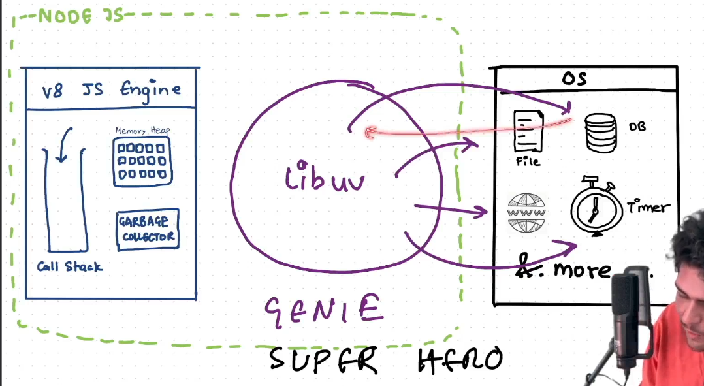

→ Libuv


→ libuv is WRITTEN IN C LANGUAGE

### **High-Level Languages:**

**Definition**: High-level languages are programming languages that provide a **strong abstraction from the hardware**. They are designed to be easy for humans to read, write, and understand, often resembling natural language or math-like notation.

**Characteristics**:

- **Abstraction**: They hide the complexity of the computer's hardware, meaning you don’t need to worry about things like memory management, register access, or machine-specific details.
- **Portability**: High-level languages are generally portable across different machines and platforms. The same code can run on Windows, Mac, Linux, etc., with little to no changes.
- **Easier to learn and use**: High-level languages have a simpler syntax and are closer to human languages, which makes them easier for programmers to learn and write.
- **Built-in features**: They often come with rich standard libraries, making it easier to perform tasks like file handling, networking, or creating user interfaces without writing much code from scratch.

Python,Java,JavaScript,Ruby

### **Low-Level Languages:**

**Definition**: Low-level languages are programming languages that provide **little or no abstraction from the hardware**. They are closer to the machine’s **binary code (machine code)** or **assembly language**, which is why they are more difficult to write and understand.

**Characteristics**:

- **Hardware interaction**: Low-level languages allow programmers to interact directly with the computer's hardware (like processors, memory, registers).
- **More control**: They offer greater control over the machine’s resources, allowing you to manage things like memory manually and optimize code for performance.
- **Less portable**: Low-level languages are often platform-specific. Code written for one type of CPU might not work on another without significant modification.
- **More difficult to write**: Since the syntax is closer to machine code, low-level languages are harder for humans to read and write. You need a deep understanding of the hardware to write effective low-level code.

Examples!

- **Assembly language**: A symbolic representation of machine code that is specific to a computer’s architecture. It’s one step above binary machine code.
- **Machine code**: The binary instructions that a computer’s CPU executes directly (0s and 1s).
- **C (closer to low-level)**: While not as low-level as assembly, C is considered a “middle-level” language because it allows for direct memory manipulation (through pointers) and is closer to the hardware compared to modern high-level languages

### **Key Differences Between High-Level and Low-Level Languages:**

|   |   |
|---|---|
|**High-Level Languages**|**Low-Level Languages**|
|**Abstracted from hardware**|**Close to hardware**|
|**Easier to read, write, and learn**|**Harder to read, write, and learn**|
|**Handles memory management automatically**|**Manual memory management**|
|**Portable across platforms**|**Platform-specific**|
|**Slower in performance** (due to abstraction)|**Faster in performance** (due to direct hardware access)|
|**Used for complex application development**|**Used for system programming and performance-critical tasks**|

### **When to Use Each Type**:

- **High-Level Languages**: Ideal for **application development**, web development, data science, etc. They prioritize **ease of use** and **developer productivity**. Most modern software, websites, and applications are written in high-level languages.
- **Low-Level Languages**: Used in **system programming** (like developing operating systems, drivers, or embedded systems) where **performance** and **control** over hardware are crucial. They are also used for situations where **direct hardware interaction** is required (e.g., writing firmware).

### **Middle-Level Languages**:

Some languages, like **C**, can be considered **middle-level languages** because they combine features of both high-level and low-level languages.

---

**→That’s Why LIBUV IS WRITTEN IN C LANGUAGE**

→ Node js handles Asynchronous operation with the help of libuv library!

**libuv** is a **multi-platform support library** that provides asynchronous I/O operations, primarily used by **Node.js**. It was designed to abstract away the differences in I/O mechanisms across various operating systems (such as Linux, Windows, and macOS), allowing Node.js to provide non-blocking I/O across platforms.  
  
  

### **What libuv Does:**

libuv enables Node.js (and other environments that use it) to handle I/O operations **asynchronously**, allowing the event loop to continue processing while tasks like file reading, network requests, and timers run in the background. Here’s a breakdown of what it handles:

1. **Asynchronous I/O**:
    - libuv provides non-blocking I/O, which means operations like reading files, making network requests, or interacting with the file system happen asynchronously without blocking the main thread.
    - For example, when you make a network request in Node.js, libuv handles the underlying operations, allowing the event loop to keep running other code while waiting for a response.
2. **Thread Pool**:
    - libuv includes a built-in **thread pool** to handle operations that cannot be performed asynchronously by the operating system. This includes file system operations and DNS lookups (on some platforms).
    - By offloading these tasks to the thread pool, libuv ensures they don’t block the event loop, keeping the overall application responsive.
3. **Event Loop**:
    - libuv provides the **event loop** that drives Node.js’s asynchronous, non-blocking I/O. The event loop is the mechanism that schedules and manages tasks like I/O events, timers, and callbacks.
    - The event loop checks the status of pending tasks and runs callbacks when they are ready. libuv ensures these callbacks are executed without blocking the main program.
4. **Timers**:
    - libuv includes functionality for handling **timers** (like `setTimeout` and `setInterval` in Node.js), allowing you to schedule code to run after a certain delay or repeatedly.
5. **File System**:
    - libuv abstracts file system operations, providing asynchronous methods for reading and writing files. It allows Node.js to interact with the file system without blocking the event loop.
6. **Network**:
    - libuv handles **networking tasks**, like opening and closing sockets, sending and receiving data over TCP and UDP, and resolving domain names (DNS).
7. **Child Processes**:
    - libuv can also spawn and manage **child processes**. Node.js uses this feature to handle external processes asynchronously, such as running shell commands or other programs from within Node.js applications.
8. **Signal Handling**:
    - libuv can also handle **signals** (such as `SIGINT` or `SIGTERM`), allowing Node.js to respond to operating system-level events like shutdown signals.

---

### **Key Components of libuv**:

1. **Event Loop**:
    - The core of libuv, where asynchronous operations are tracked and executed. The event loop has multiple phases, such as checking timers, handling pending I/O callbacks, and running microtasks.
    - Each iteration of the event loop is called a **tick**. During each tick, libuv processes events (like I/O completion), executes callbacks, and manages timers.
2. **Thread Pool**:
    - The thread pool in libuv is typically limited to four threads by default, but it can be configured. It is used for tasks like file system operations or DNS queries that can't be handled in a non-blocking way by the OS.
3. **I/O Polling**:
    - libuv uses different mechanisms to check for completed I/O operations depending on the platform:
        - **epoll** on Linux
        - **kqueue** on macOS
        - **IOCP** (Input/Output Completion Ports) on Windows
    - These mechanisms allow libuv to efficiently detect when I/O tasks (like reading a file or receiving data from a socket) are complete.
4. **Timers**:
    - libuv has a mechanism to manage timers and execute callbacks when the timers expire. This is how `setTimeout` and `setInterval` are implemented in Node.js.
5. **Platform Abstraction Layer**:
    - libuv provides an abstraction over various platform-specific details, such as file systems, networking, and threads. This makes Node.js cross-platform because libuv handles the complexity of different operating systems behind the sc

### **Why libuv Matters**:

Without libuv, Node.js would not be able to provide its non-blocking, asynchronous I/O features. It allows Node.js to handle many I/O tasks in parallel while **keeping the event loop free** to handle new tasks, making it ideal for building scalable, high-performance applications.

### **Summary**:

- **libuv** is a library that powers Node.js’s **asynchronous** and **non-blocking I/O** by handling the event loop, I/O operations, thread pools, and platform abstraction.
- It provides the backbone for many of Node.js’s key features, including file system access, networking, timers, and child processes, all while ensuring the event loop can remain responsive and not blocked by long-running tasks.

```JavaScript
console.log();
THIS IS SYNCHRONUS IN NATURE!
```

- **Synchronous Behavior**: Even though `console.log()` is part of the Web API or Node.js environment, it behaves synchronously within the execution context of JavaScript. This means it completes its logging task immediately and in sequence before moving on to the next line of code.
- Thus, its synchronous nature is a result of how JavaScript's execution model is designed, rather than being a characteristic of the Web API or Node.js itself.

→ Asynchronous I/O or non Blocking I/O means the same thing! Because it doesn’t block the main thread!

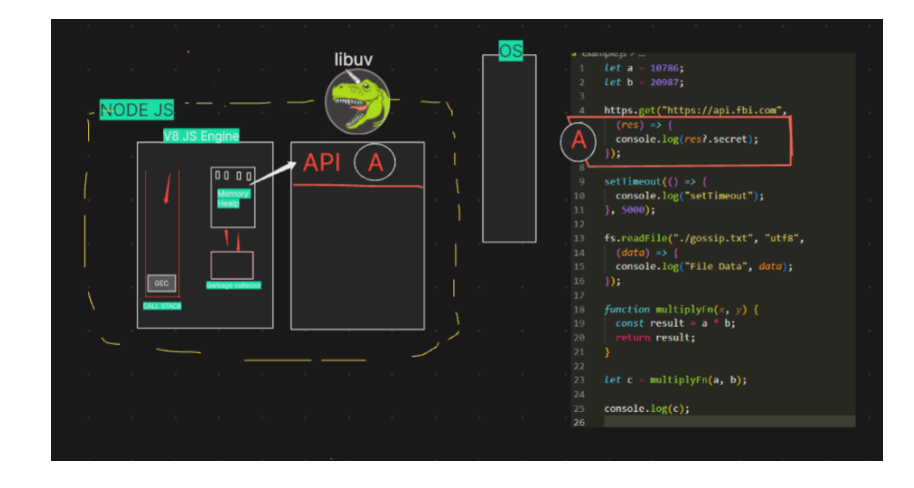


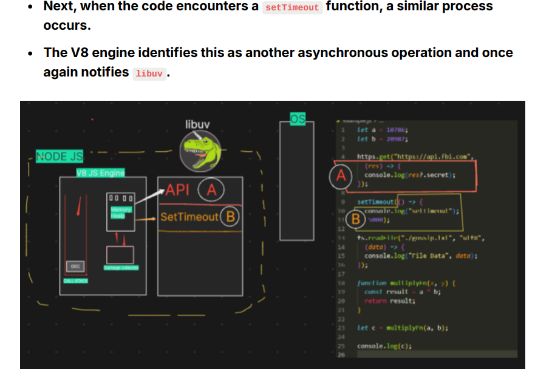

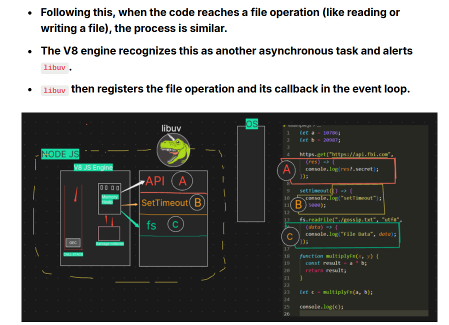

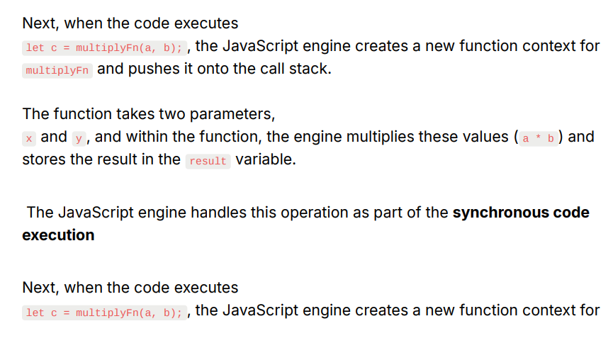

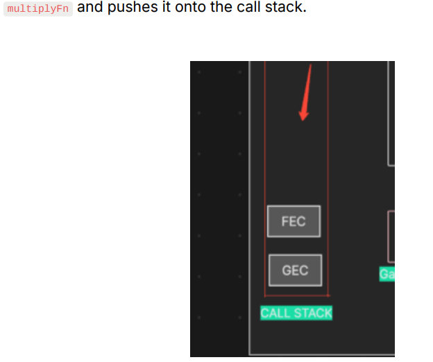

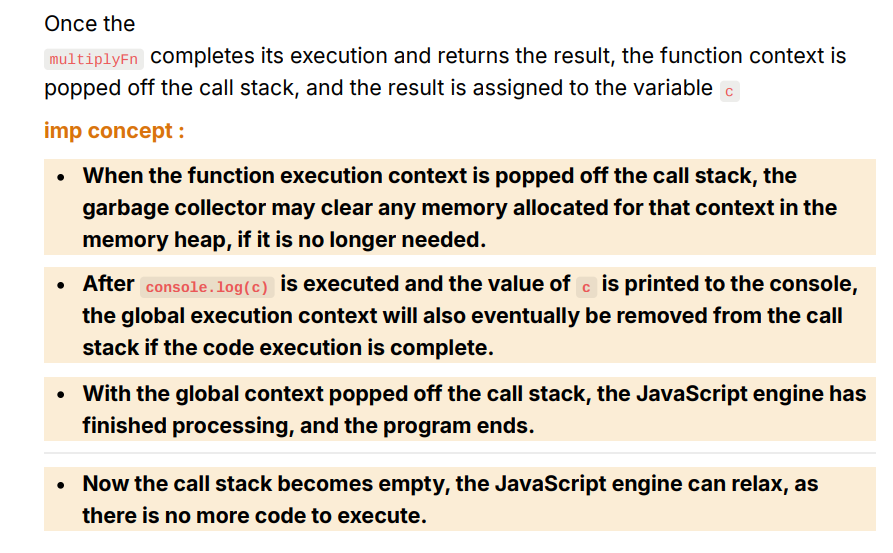

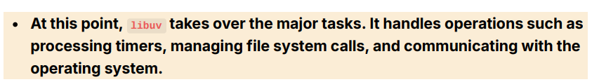


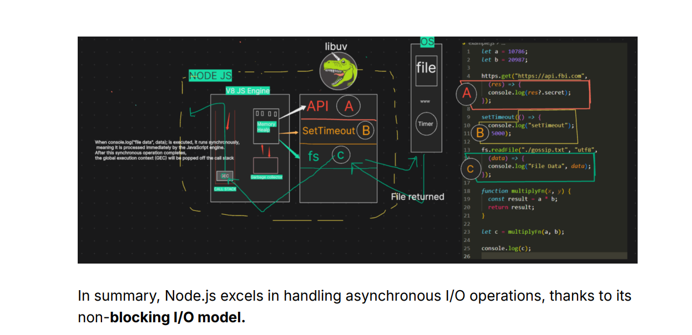

Let's break down the code you described with `setTimeout` and a blocking `for` loop. Here's how the execution will unfold, assuming you have a code snippet like this:

```JavaScript
javascript
Copy code
console.log("Start"); // Time 0

setTimeout(() => {
    console.log("setTimeout callback getting printed"); // This will run after 5 seconds
}, 5000);

for (let i = 0; i < 1e9; i++) {
    // A blocking loop that takes time to execute (let's assume it takes about 20 seconds)
}

console.log("End"); // This will execute after the loop is done

```

### Execution Timeline

- **Time 0 seconds**:
    - `console.log("Start");` executes and prints `Start`.
- **Time 0 seconds** (Still):
    - `setTimeout` is called, scheduling the callback to execute after 5 seconds. However, it doesn't execute immediately. It registers the callback and moves to the next line of code.
- **Time 0-20 seconds**:
    - The `for` loop runs. This is a blocking operation that prevents any other code from executing (including the `setTimeout` callback) until the loop is finished. Let's assume this loop takes about 20 **seconds** to complete.
- **Time 20 seconds**:
    - The `for` loop finishes executing. Now, the event loop checks if there are any callbacks that need to be executed. The `setTimeout` callback is now ready to run.
- **Time 20 seconds** (Still):
    - `console.log("setTimeout callback getting printed");` executes and prints `setTimeout callback getting printed`.
- **Time 20 seconds** (Still):
    - After the `setTimeout` callback finishes executing, the next line of code, `console.log("End");`, executes and prints `End`.

### Final Timeline:

|   |   |   |
|---|---|---|
|**Time (seconds)**|**Action**|**Output**|
|0|`console.log("Start");`|Start|
|0|`setTimeout(...)` (schedules callback)|(no output yet)|
|0-20|`for` loop executes (blocking)|(no output during this time)|
|20|`console.log("setTimeout callback getting printed");`|setTimeout callback getting printed|
|20|`console.log("End");`|End|

### Summary:

- The `setTimeout` schedules the callback but does not execute it immediately.
- The blocking `for` loop prevents any other code from executing until it's finished.
- After the loop completes, the callback from `setTimeout` is executed, followed by any subsequent code. In this scenario, the final output order is:
    
    ```SQL
    sql
    Copy code
    Start
    setTimeout callback getting printed
    End
    
    ```
    

This demonstrates how JavaScript’s single-threaded nature and blocking code can affect the execution of asynchronous callbacks.