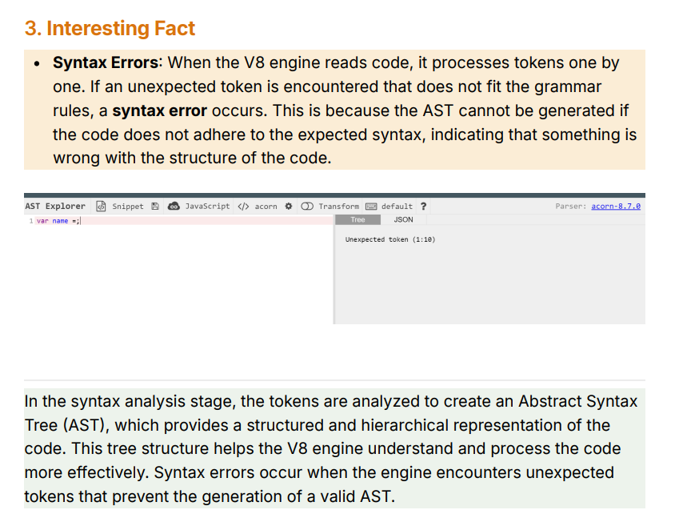
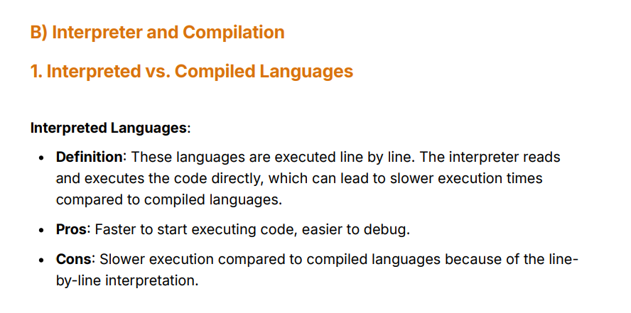
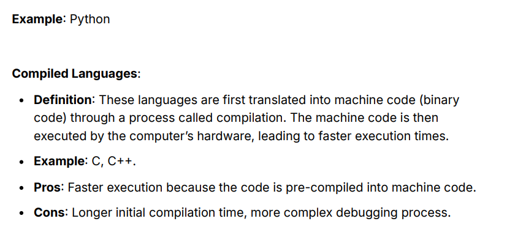
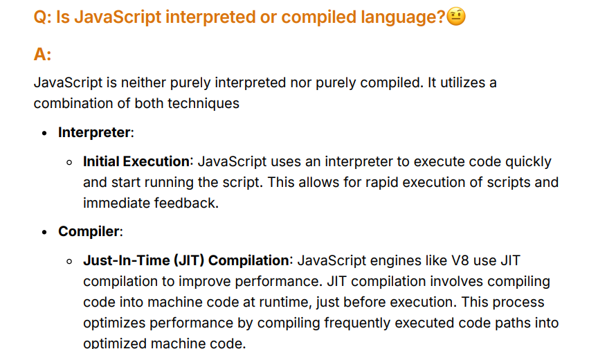

1. **Traditional Interpretation**: In the early days, JavaScript was purely interpreted. This means that when you ran a JavaScript program, the code was directly read, parsed, and executed line by line by the JavaScript engine (like the browser's engine). This was simpler but not very fast, since no prior optimizations were made.
2. **Modern Compilation**: With the introduction of Just-In-Time (JIT) compilation in modern engines like V8 (used by Chrome and Node.js), JavaScript is now compiled during execution. Here's how it works:
    - **Initial Interpretation**: The engine starts by interpreting the JavaScript code, executing it line by line as before.
    - **JIT Compilation**: While the code is running, the engine analyzes which parts of the code are used frequently (hot code) and compiles those sections into machine code on the fly. This machine code is stored and reused, making subsequent executions faster.
    - **Optimization**: The engine continuously optimizes the compiled code based on runtime feedback, dynamically recompiling parts of the code for better performance.

### So why both?

- **Flexibility of Interpretation**: Interpreting the code initially allows JavaScript to be highly dynamic, making it easier to run code immediately and adapt to changes during execution.
- **Speed of Compilation**: By compiling the frequently used parts of the code into optimized machine code, JIT compilation improves performance without losing the flexibility of interpretation.

### Process:

1. **Initial Execution**: When the JavaScript code is first run, the engine reads and executes it. Initially, this might be slow because it's interpreting the code without any optimizations.
2. **Frequent Code Analysis**: As the JavaScript engine runs the code, it keeps track of which sections of the code are run frequently (often called "hot code"). For example, loops or functions called multiple times.
3. **Compilation into Machine Code**: The engine takes these frequently executed sections (hot code) and **compiles** them into machine code while the program is still running. This compiled machine code is much faster for the computer to execute.
4. **Reusing Compiled Code**: Once a section of the code has been compiled into machine code, the engine can reuse it. So, the next time that piece of code is run, it executes faster because it doesn't need to be interpreted again—it just runs the compiled machine code.

→ Jabh tak input mein integers aarahe the tanbh tab koi dikakt nahi hui!

→Jaise Sum(”a”,”b”) will come now humein ab deoptimse karna padega! In that way then I’ll just interpret it again into byte code and then execute it!

### How Inline Caching Works

Inline caching optimizes this process by **caching the result of the first lookup** and assuming that future lookups will follow the same pattern. It relies on the idea that **objects are often used in predictable, repetitive ways**.

- **First Access (Cold Path)**: When the property (`obj.name`) is accessed for the first time, the engine performs the usual lookup and stores information about the object type and the location of the property.
- **Subsequent Accesses (Hot Path)**: On future accesses, instead of doing a full lookup again, the engine uses the cached information. If the object structure hasn't changed, it directly retrieves the property from the cached location, avoiding the need for repeated type checks and lookups.

This speeds up property access significantly when the same type of object is used multiple times in similar contexts.

  

  

  

