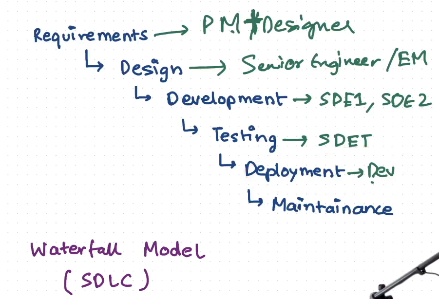
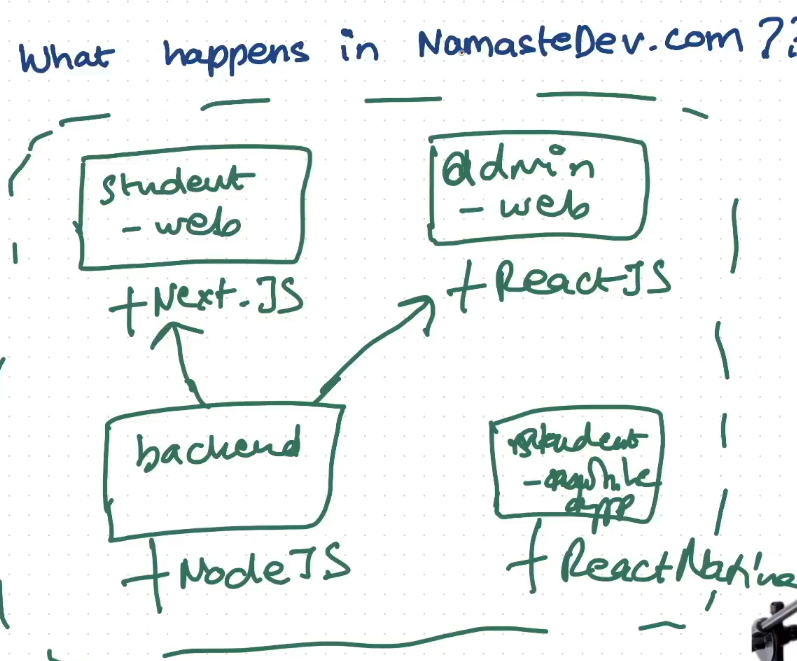

## Monolith vs. Microservices

### 1. **What is a Monolithic Architecture?**

In **simple terms**, a **monolithic architecture** is like having one big building where everything is inside. If it's a software application, it's a single, large codebase where all the functionalities and services (like user login, database operations, payment processing, etc.) are tightly integrated into one system.

**Key Characteristics of Monolithic Architecture**:

- **Single Codebase**: All functionalities are bundled into one application.
- **Shared Resources**: The entire application shares the same database, memory, etc.
- **Single Deployment**: You deploy the whole application at once. So, even if you change a small part (like adding a feature), you need to redeploy the entire app.

**Example**:  
Imagine you are running an e-commerce platform. The website handles user login, product listings, payment processing, and order management all in one piece of software. If you need to update the payment process, you have to touch the entire application.  

**Advantages**:

- **Simplicity**: Easier to develop in the beginning because everything is in one place.
- **Easier Debugging**: All logs and issues are centralized in one system.

**Disadvantages**:

- **Scaling is hard**: You can’t scale individual parts. If your payment system needs more resources but your login system doesn’t, you still need to scale the entire application.
- **Hard to maintain**: As the application grows, the codebase becomes complex and harder to manage.
- **Risk of failure**: If one part crashes, the whole application goes down.

### 2. **What is a Microservices Architecture?**

In **layman’s terms**, microservices architecture is like splitting up that big building into smaller, independent shops. Each shop does one thing, and they communicate with each other when needed. In software, each **microservice** is an independent, smaller application responsible for a specific task (like user authentication, payment, or product management).

**Key Characteristics of Microservices Architecture**:

- **Independent Services**: Each service (microservice) has its own codebase and database.
- **Decentralized**: Each microservice runs independently and can be deployed separately.
- **Communication via APIs**: Microservices communicate with each other via APIs or messaging systems.

**Example**:  
In the same e-commerce example, the payment system, user login, product catalog, and order management would all be separate services. Each service could be developed and maintained independently, and they communicate when necessary.  
  

**Advantages**:

- **Scalability**: You can scale each service independently. If your payment system gets more traffic, you can scale just that service. For example, in an e-commerce app, different services handle different tasks: one manages payments, another handles the product catalog, and another manages customer reviews. If a huge sale is happening, the payment service might get hit with lots of traffic because more people are trying to buy things at the same time. With scalable microservices, you can "scale up" the payment service—like adding more virtual machines or servers just for that service—to keep up with the demand. This way, only the payment service is scaled up, leaving other parts like the product catalog or reviews unaffected, and everything continues to run smoothly.
- **Faster Development**: Since teams can work on different microservices independently, new features can be developed and deployed faster.
- **Fault Isolation**: If one microservice fails (e.g., the payment system), other parts (e.g., the product catalog) can continue working.

**Disadvantages**:

- **Complexity**: Managing multiple services requires more effort. You need systems for communication, logging, and monitoring.
- **Distributed Nature**: Since microservices are decentralized, there’s more complexity in handling data consistency, security, and network communication.

### 3. **When to Choose Monolith vs Microservices?**

- **Monolithic**:
    - **When you’re just starting out**: For small teams or new projects, monolithic architecture is simpler and faster to develop.
    - **Less complexity**: If the application is small and not expected to grow a lot in terms of features or traffic, a monolithic approach might be enough.
- **Microservices**:
    - **When scaling becomes important**: For large applications with millions of users or high traffic, microservices offer better scalability.
    - **Faster development cycles**: When teams grow larger and work on different parts of the application simultaneously, microservices allow teams to work independently.
    - **Flexibility in technology**: Each microservice can use a different technology stack (programming language, database, etc.), depending on its needs. For example, you can use Node.js for one service and Python for another.

### 4. **Advanced Concepts in Microservices**:

- **Service Discovery**: Since microservices are independent, they need to find and communicate with each other dynamically. Service discovery is the mechanism that helps microservices find their “friends” in a large ecosystem.
- **Load Balancing**: Because microservices are scaled independently, load balancers help distribute the incoming traffic across multiple instances of a microservice to avoid overload.
- **API Gateway**: This acts like the front door to your microservices. Instead of exposing all microservices directly to users, an API Gateway aggregates their services into one entry point for users, simplifying communication.
1. **Load Balancer**: A load balancer sits in front of the instances of a microservice, not within each instance. Its job is to manage the traffic coming to that specific service by distributing it evenly across all instances of that service. For example, if your payment service has five instances running, the load balancer will receive incoming requests and direct each to one of the instances based on the current load and predefined balancing rules. This prevents any single instance from getting overloaded.
    
2. **API Gateway**: An API gateway acts as the main entry point for all user requests to the microservices. Instead of each microservice being accessed individually, the API gateway funnels requests to the appropriate services. Once the API gateway receives a request, it forwards it to the relevant microservice, often through the load balancer for that service. The gateway is a single point, handling authentication, routing, and sometimes caching and logging.
### How They Work Together:

- The **API Gateway** handles routing and front-door access to all microservices, directing requests to the right service.
- Behind the API Gateway, each **Load Balancer** distributes requests to multiple instances of a specific microservice.

- **Data Management**: In monolithic systems, the application shares a single database. In microservices, each service can have its own database, which leads to challenges like **data consistency** and **synchronization**.
- **Event-Driven Architecture**: Many microservices systems use an event-driven approach, where services communicate by sending events to each other, ensuring that the system is loosely coupled.
- **Containerization (e.g., Docker)**: Microservices are often run in containers (like Docker), making it easier to package, deploy, and scale them independently across environments.
- **Orchestration (Kubernetes)**: Managing many microservices can become complex, so tools like Kubernetes help automate the deployment, scaling, and management of containerized applications.
- **Monolithic**: A single, large, tightly integrated application. Simpler at first, but harder to maintain and scale as the application grows.
- **Microservices**: A collection of small, independent services. More scalable and flexible, but also more complex to manage, especially as the system grows.

**MONOLITH VS MICROSERVICES**

### 1. **Dev Speed**

- **Monolith**:
    - Faster to develop initially because everything is in one place. You don't need to manage communication between services or orchestrate complex systems.
- **Microservices**:
    - Slower in the beginning due to the need for setting up multiple services, communication mechanisms (APIs), and infrastructure. However, once in place, different teams can work in parallel, speeding up overall development.

### 2. **Code Repo**

- **Monolith**:
    - Single code repository where all the code is stored together.
- **Microservices**:
    - Multiple code repositories for each independent service. Each microservice has its own repo.

### 3. **Scalability**

- **Monolith**:
    - Harder to scale because you need to scale the whole application even if only one part needs more resources.
- **Microservices**:
    - Easier to scale. You can scale individual services independently based on demand.

### 4. **Deployment**

- **Monolith**:
    - Deployment is straightforward but risky. You deploy the entire application at once, and if one feature breaks, it can bring down the whole system.
- **Microservices**:
    - Independent deployment for each service. If you update or deploy a single microservice, it doesn’t affect others.

### 5. **Tech Stack**

- **Monolith**:
    - Typically uses a single technology stack for the entire application (e.g., one programming language, one database).
- **Microservices**:
    - Flexibility to use different technologies for each service. For example, one microservice could use Python while another uses Node.js.

### 6. **Infrastructure Cost**

- **Monolith**:
    - Lower initial infrastructure costs, as everything is bundled into one system.
- **Microservices**:
    - Higher infrastructure costs, as each microservice might require its own servers, databases, etc.

### 7. **Complexity**

- **Monolith**:
    - Simpler to manage initially because everything is centralized. However, as the application grows, it can become harder to maintain.
- **Microservices**:
    - More complex because you have multiple services that need to communicate and be managed independently.

### 8. **Fault Isolation**

- **Monolith**:
    - A failure in one part of the system can affect the entire application.
- **Microservices**:
    - Faults are isolated. If one microservice fails, others can continue running without issue.

### 9. **Testing**

- **Monolith**:
    - Easier to test in the beginning because all the code is in one place.
- **Microservices**:
    - Testing is more complicated since each service is independent and needs to be tested both individually and as a part of the larger system.

### 10. **Ownership**

- **Monolith**:
    - Ownership of code is centralized. It’s harder to assign responsibility to specific teams or developers for certain parts of the application.
- **Microservices**:
    - Each microservice is owned by a specific team or developer, making it easier to assign responsibility.

### 11. **Maintenance**

- **Monolith**:
    - Harder to maintain as the codebase grows larger and more features are added.
- **Microservices**:
    - Easier to maintain because each service is smaller and more focused, although you need to manage multiple services.

### 12. **Rewamps**

- **Monolith**:
    - Harder to refactor or rebuild a specific part of the system without affecting the whole application.
- **Microservices**:
    - Easier to rework or rebuild individual microservices without affecting the entire system.

### 13. **Debugging**

- **Monolith**:
    - Easier to debug because everything is in one place and centralized logging is simpler.
- **Microservices**:
    - Harder to debug due to the distributed nature of the services. You need to track logs and errors across multiple services.

### 14. **Dev Experience**

- **Monolith**:
    - Developers work on a single codebase, which can make collaboration simpler but can also lead to bottlenecks when multiple people work on the same code.
- **Microservices**:
    - Developers can work independently on their own services, leading to a more streamlined experience for larger teams, but it requires more coordination.

### **Basic Concepts**

- **Frontend**: The part of the application that the user interacts with directly. It’s what you see in the browser (HTML, CSS, JavaScript).
- **Backend**: The server-side part of the application. It handles business logic, database operations, and serves data to the frontend.

### A. **HTTP Requests and Responses (REST APIs)**
An **HTTP request** is a message sent by a client (typically a web browser or app) to a server to ask for a specific resource or perform an action. This request follows the HTTP protocol, ensuring that both the client and server understand each other.

- **What it is**: This is the most common form of communication. The frontend sends an HTTP request (GET, POST, PUT, DELETE) to the backend, and the backend sends back an HTTP response, usually in the form of **JSON** (JavaScript Object Notation) or **XML**.
- **How it works**:
    1. **Frontend Request**: When a user interacts with the frontend (e.g., clicking a button or submitting a form), the frontend makes a request to the backend.
    2. **Backend Processing**: The backend server receives the request, processes the business logic (such as fetching data from the database), and prepares a response.
    3. **Frontend Receives Response**: The backend sends a response back to the frontend, often in JSON format, which the frontend processes and displays to the user.

**Example**:

- User fills out a form on the frontend.
- The frontend sends a `POST` request to the backend with the form data.
- The backend processes the data (maybe stores it in a database) and sends a success or error message back to the frontend.
- The frontend updates the user interface based on the response (e.g., showing a "Form submitted successfully" message).

### B. **GraphQL (Alternative to REST)**

- **What it is**: GraphQL is a query language that allows the frontend to specify exactly what data it needs from the backend. It’s an alternative to REST where the frontend can get all the required data in a single request.
- **How it works**:
    1. The frontend makes a GraphQL request specifying the data it needs.
    2. The backend server processes the query and sends back only the requested data.
- **Benefit**: More efficient than REST in certain cases because the frontend can avoid over-fetching or under-fetching data.

### C. **WebSockets (Real-Time Communication)**

- **What it is**: WebSockets provide full-duplex communication, meaning the frontend and backend can send messages to each other **in real time**. This is often used in applications like chat apps, stock tickers, or live notifications.
- **How it works**:
    1. The frontend establishes a WebSocket connection with the backend.
    2. Both frontend and backend can send messages to each other without having to wait for a request/response cycle.
- **Example**: In a chat application, WebSockets allow the frontend to receive new messages instantly as soon as they are sent, without refreshing the page.

### D. **AJAX (Asynchronous JavaScript and XML)**

- **What it is**: AJAX is a technique that allows the frontend to send requests to the backend **asynchronously** without reloading the entire page.
- **How it works**:
    1. The frontend sends a request to the backend (via JavaScript, typically).
    2. The backend processes the request and sends a response.
    3. The frontend dynamically updates the webpage without a full refresh.
- **Example**: Loading new data on a page when scrolling down without refreshing the whole page (infinite scroll).

GraphQL and REST API are both ways to communicate between a client (like a web or mobile app) and a server, but they work differently in terms of structure, flexibility, and efficiency. Here’s a quick comparison of each
### 1. **Data Fetching**

- **REST**: Data is typically fetched through multiple, fixed endpoints for different resources, each returning a predefined data structure. For instance, `/users` might return a list of users, and `/users/{id}` would return details of a specific user.
- **GraphQL**: Data is fetched through a single endpoint (`/graphql`), where you specify the exact data you need. It allows you to query multiple resources in one request, reducing the need for multiple requests.

### 2. **Flexibility**

- **REST**: Each endpoint is designed to return a fixed data structure. If you need more or less data, you might have to use a different endpoint or request all data and filter it on the client side.
- **GraphQL**: The client specifies the fields it needs, and the server responds with only that data. For instance, you could request just the `name` and `email` of a user, without other user details, making it highly flexible.

### 3. **Over-fetching and Under-fetching**

- **REST**: Over-fetching (getting more data than needed) and under-fetching (not getting all needed data in one request) are common. If a REST endpoint gives you more data than you need, it’s called over-fetching. If you have to call multiple endpoints to gather all required data, it’s under-fetching.
- **GraphQL**: Since you specify exactly what data you want, there’s little to no over-fetching or under-fetching. You get precisely what’s requested.

### 4. **Versioning**

- **REST**: Changes to REST APIs often involve creating new versions (e.g., `/api/v1`, `/api/v2`) to avoid breaking clients dependent on the older API.
- **GraphQL**: Changes are managed by adjusting the schema. Since clients request only specific fields, adding new fields or types doesn’t affect existing clients, reducing the need for versioning.

### 5. **Response Structure**

- **REST**: Responses are structured based on the endpoint, with a fixed format for each resource. For example, `/users` returns all user data, regardless of what the client actually needs.
- **GraphQL**: The response is structured based on the query. The client can request specific data points and get a response that matches exactly, without any extra information.