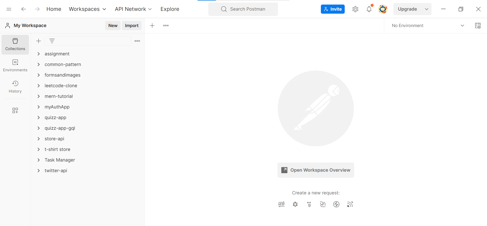
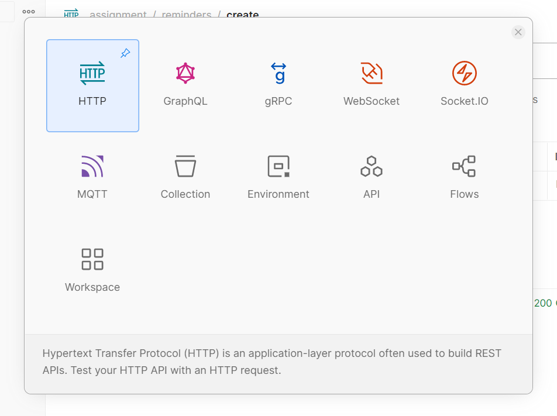

# How to use POSTMAN

Postman is a popular API development and testing tool that allows you to make HTTP requests to a server and view the responses. It's commonly used for testing APIs during development.

  

### Download and Install Postman

Download and install Postman from the official website: [Postman Download](https://www.postman.com/downloads/).

  

### Open Postman:

On the Postman application interface, you'll encounter a screen with existing collections, but to create a new one, simply click on the "New" button located at the top left corner of the interface.

  

Then you will see a screen similar to this one

Select the HTTP option and hit enter

  

Place the URL where your server is running, in our case, it is [http://localhost:3000/](http://localhost:3000/). Select the appropriate method, which, in our case, is GET, and click the SEND button. You will receive the response, similar to what is shown above.