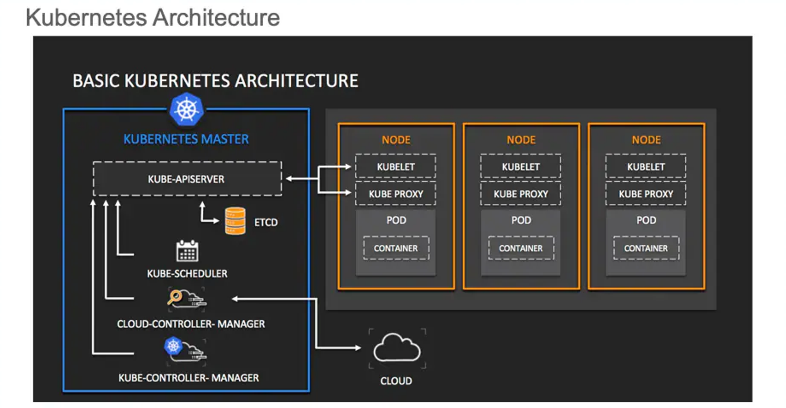
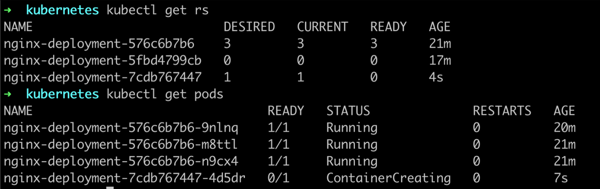
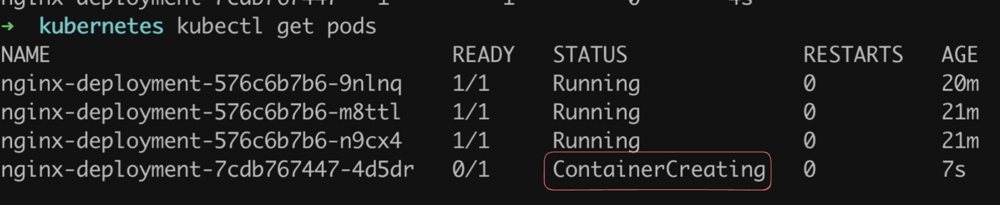
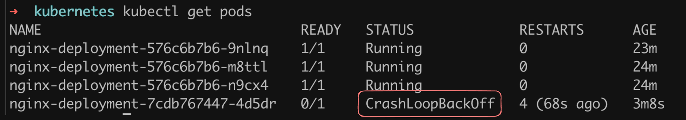

In this lecture, Harkirat dives deeper into Kubernetes, focusing on key concepts essential for deploying and managing applications at scale. He covers Kubernetes Deployments and ReplicaSets, demonstrating how to create and manage these resources effectively. The lecture also explores Kubernetes Services, with a particular emphasis on the LoadBalancer service type.

  

  

Checkpoint: Key Kubernetes Concepts

Relationships Between These Concepts:

Practical Application:

Kubernetes Deployments

What is a Deployment?

Deployment vs. Pod: Key Differences

Benefits of Using Deployments

Creating a Deployment

Managing Deployments

Best Practices

ReplicaSets in Kubernetes

What is a ReplicaSet?

ReplicaSets in the Kubernetes Hierarchy

How ReplicaSets Work

Series of Events

Example ReplicaSet YAML

Key Concepts

ReplicaSets vs. Deployments

Best Practices

Conclusion

Series of Events in Kubernetes Deployment

1. Command Execution

2. API Request

3. API Server Processing

4. Storage in etcd

5. Deployment Controller Monitoring

6. ReplicaSet Creation

7. Pod Creation

8. Scheduler Assignment

9. Node and Kubelet

Hierarchical Relationship

Why Use Deployments Over ReplicaSets?

Creating a ReplicaSet

Step 1: Create the ReplicaSet Manifest

Step 2: Apply the ReplicaSet Manifest

Step 3: Verify the ReplicaSet

Step 4: Check the Pods

Step 5: Test Self-Healing

Step 6: Test Pod Management

Step 7: Clean Up

Key Observations

Conclusion

Creating a Deployment

Step 1: Create the Deployment Manifest

Step 2: Apply the Deployment

Step 3: Verify the Deployment

Step 4: Check the ReplicaSet

Step 5: Check the Pods

Step 6: Test Self-Healing

Step 7: Verify Self-Healing

Key Observations

Conclusion

Why Do We Need Deployments?

Experiment: Updating to a Non-existent Image

Role of Deployments

Rollbacks

Updating to PostgreSQL

Key Advantages of Deployments

Conclusion

How to Expose the App

Step 1: Create a New Deployment

Understanding Pod IPs

Step 2: Creating a Service

Step 3: Accessing the Application

Additional Exposure Methods

Conclusion

Services in Kubernetes

Key Concepts

Creating a Service

Setting Up a Cluster with Exposed Ports

Types of Services in Detail

Best Practices

Conclusion

LoadBalancer Service

Creating a Kubernetes Cluster in Vultr

Deploying an Application

Creating a LoadBalancer Service

Key Points About LoadBalancer Services

Checking the Service Status

Accessing Your Application

Best Practices

Conclusion

Series of Events

Step 1: Create Your Cluster

Step 2: Deploy Your Pod

Step 3: Expose Your App over a NodePort

Step 4: Expose it over a LoadBalancer

Key Observations

Best Practices

Conclusion

  

  

# Checkpoint: Key Kubernetes Concepts

  



  

Let's summarize the key terms we've covered so far in our journey to understand Kubernetes:

1. **Cluster**
    
    - Definition: A set of machines (nodes) that run containerized applications managed by Kubernetes.
    - Key points:
        - Consists of at least one control plane node and multiple worker nodes.
        - Provides a unified platform for deploying and managing containerized applications.
    
    A Kubernetes cluster is a set of machines, called nodes, that run containerized applications managed by Kubernetes. It consists of at least one control plane node and multiple worker nodes, providing a unified platform for deploying and managing containerized applications. This structure allows for efficient orchestration and scaling of applications across the cluster.
    
2. **Nodes**
    - Definition: Physical or virtual machines that make up a Kubernetes cluster.
    - Types:
        - Control Plane Node: Manages the cluster state and control processes.
        - Worker Nodes: Run the actual application workloads (pods).
    - Key components:
        - Kubelet: Ensures containers are running in a pod.
        - Kube-proxy: Maintains network rules on nodes.
        - Container runtime: Software responsible for running containers.
3. **Images**
    - Definition: Lightweight, standalone, executable packages that include everything needed to run a piece of software.
    - Key points:
        - Contains application code, runtime, libraries, and dependencies.
        - Stored in container registries (e.g., Docker Hub).
        - Used to create containers.
4. **Containers**
    - Definition: Runnable instances of images.
    - Key points:
        - Provide consistent environments across different computing environments.
        - Isolate applications from one another and the underlying infrastructure.
        - Managed by container runtimes like Docker or containerd.
5. **Pods**
    - Definition: The smallest deployable units in Kubernetes, representing a single instance of a running process in a cluster.
    - Key points:
        - Can contain one or more containers.
        - Share network namespace and storage.
        - Ephemeral by nature (can be created, destroyed, and replaced dynamically).
        - Scheduled onto nodes in the cluster.

### Relationships Between These Concepts:

- A Kubernetes cluster is composed of nodes.
- Nodes run pods.
- Pods contain one or more containers.
- Containers are created from images.

### Practical Application:

We've learned how to:

- Create a Kubernetes cluster (using tools like kind or minikube).
- Interact with the cluster using kubectl.
- Deploy a simple pod running an NGINX container.

This foundation sets the stage for more advanced Kubernetes concepts and operations, such as deployments, services, and scaling applications.

  

  

  

# Kubernetes Deployments

Deployments are a crucial concept in Kubernetes, providing a higher level of abstraction for managing pods. Let's dive into the key aspects of Deployments and how they differ from individual pods.


  

### What is a Deployment?

A Deployment in Kubernetes is a resource object that provides declarative updates to applications. It allows you to:

- Describe an application's life cycle
- Define the desired state for your pods and ReplicaSets
- Update that state in a controlled manner

### Deployment vs. Pod: Key Differences

1. **Abstraction Level**
    - Pod: The smallest deployable unit in Kubernetes.
    - Deployment: A higher-level controller managing multiple pods.
2. **Management**
    - Pod: Ephemeral and can be frequently created/destroyed.
    - Deployment: Ensures a specified number of pod replicas are running.
3. **Updates**
    - Pod: Direct updates require manual intervention and can cause downtime.
    - Deployment: Supports rolling updates for gradual changes and easy rollbacks.
4. **Scaling**
    - Pod: Manual scaling by creating/deleting individual pods.
    - Deployment: Easy scaling by specifying desired replicas; automatic adjustment.
5. **Self-Healing**
    - Pod: Requires manual restart if crashed (unless managed by a controller).
    - Deployment: Automatically replaces failed pods to maintain desired state.

### Benefits of Using Deployments

1. **Declarative Updates**: Define the desired state, and Kubernetes works to maintain it.
2. **Rolling Updates and Rollbacks**: Easily update applications with minimal downtime and roll back if issues occur.
3. **Scaling**: Quickly scale applications up or down.
4. **Self-Healing**: Automatic replacement of failed pods.
5. **Version Control**: Track and control changes to your application deployments.

### Creating a Deployment

Here's a basic example of creating a Deployment:

```YAML
apiVersion: apps/v1
kind: Deployment
metadata:
  name: nginx-deployment
spec:
  replicas: 3
  selector:
    matchLabels:
      app: nginx
  template:
    metadata:
      labels:
        app: nginx
    spec:
      containers:
      - name: nginx
        image: nginx:1.14.2
        ports:
        - containerPort: 80
```

Apply this with:

```Plain
kubectl apply -f nginx-deployment.yaml
```

### Managing Deployments

1. **Scaling**:
    
    ```Plain
    kubectl scale deployment nginx-deployment --replicas=5
    ```
    
2. **Updating**:
    
    ```Plain
    kubectl set image deployment/nginx-deployment nginx=nginx:1.16.1
    ```
    
3. **Rolling Back**:
    
    ```Plain
    kubectl rollout undo deployment/nginx-deployment
    ```
    
4. **Checking Status**:
    
    ```Plain
    kubectl rollout status deployment/nginx-deployment
    ```
    

### Best Practices

1. **Use Labels**: Properly label your Deployments and Pods for easy management and selection.
2. **Set Resource Limits**: Define CPU and memory limits to ensure efficient resource allocation.
3. **Use Readiness and Liveness Probes**: Ensure your application is healthy and ready to serve traffic.
4. **Version Control**: Keep your Deployment YAML files in version control.
5. **Use Rolling Updates**: Minimize downtime by using rolling update strategy.

  

  

# ReplicaSets in Kubernetes

ReplicaSets are a crucial component in Kubernetes' ability to maintain the desired state of your application. Let's dive into what ReplicaSets are, how they work, and their relationship with Deployments and Pods.


### What is a ReplicaSet?

A ReplicaSet is a Kubernetes controller that ensures a specified number of identical Pods are running at any given time. It's responsible for maintaining the stability and availability of a set of Pods.

Key features of ReplicaSets:

- Ensures a specified number of Pod replicas are running
- Automatically replaces Pods that fail or are deleted
- Can be scaled up or down by changing the desired number of replicas

### ReplicaSets in the Kubernetes Hierarchy

The relationship between Deployments, ReplicaSets, and Pods can be visualized as follows:

```Plain
Deployment
    └── ReplicaSet
        └── Pods
```

### How ReplicaSets Work

1. **Creation**: When you create a Deployment, it automatically creates a ReplicaSet.
2. **Pod Management**: The ReplicaSet creates and manages the specified number of Pods based on the template defined in the Deployment.
3. **Monitoring**: The ReplicaSet constantly monitors the state of its Pods.
4. **Self-Healing**: If a Pod fails or is deleted, the ReplicaSet automatically creates a new Pod to maintain the desired number of replicas.

### Series of Events

1. User creates a Deployment.
2. Deployment creates a ReplicaSet.
3. ReplicaSet creates the specified number of Pods.
4. If Pods go down, the ReplicaSet controller ensures to bring them back up.


### Example ReplicaSet YAML

While you typically won't create ReplicaSets directly (as they're managed by Deployments), here's what a ReplicaSet definition looks like:

```YAML
apiVersion: apps/v1
kind: ReplicaSet
metadata:
  name: frontend
  labels:
    app: guestbook
    tier: frontend
spec:
  replicas: 3
  selector:
    matchLabels:
      tier: frontend
  template:
    metadata:
      labels:
        tier: frontend
    spec:
      containers:
      - name: php-redis
        image: gcr.io/google_samples/gb-frontend:v3
```

### Key Concepts

1. **Selector**: ReplicaSets use selectors to identify which Pods to manage.
2. **Template**: Defines the Pod specification that the ReplicaSet will use to create new Pods.
3. **Replicas**: Specifies the desired number of Pod replicas.

### ReplicaSets vs. Deployments

While ReplicaSets are powerful, Deployments are generally preferred because they provide additional features:

- Deployments manage ReplicaSets and provide declarative updates to Pods.
- Deployments allow for easy rolling updates and rollbacks.
- Deployments automatically create a new ReplicaSet when the Pod template changes.

### Best Practices

1. **Use Deployments**: Instead of directly creating ReplicaSets, use Deployments to manage them.
2. **Label Properly**: Use clear and consistent labels to help ReplicaSets identify their Pods.
3. **Set Resource Limits**: Define CPU and memory limits in your Pod templates to ensure efficient resource allocation.
4. **Use Probes**: Implement readiness and liveness probes in your Pods to help the ReplicaSet make informed decisions about Pod health.

### Conclusion

> ReplicaSets are a fundamental building block in Kubernetes that ensure the desired number of Pods are always running. While you typically interact with Deployments rather than ReplicaSets directly, understanding how ReplicaSets work is crucial for grasping Kubernetes' self-healing and scaling capabilities.

By maintaining the specified number of Pod replicas, ReplicaSets play a vital role in ensuring the reliability and availability of your applications in a Kubernetes cluster. This automatic management of Pods allows developers to focus on application logic rather than worrying about the intricacies of maintaining individual containers.

  

  

# Series of Events in Kubernetes Deployment

When you run the command `kubectl create deployment nginx-deployment --image=nginx --port=80 --replicas=3`, a complex series of events unfolds within the Kubernetes cluster. Let's break down this process step-by-step:

### 1. Command Execution

- You execute the command on a machine with kubectl installed and configured to interact with your Kubernetes cluster.

### 2. API Request

- kubectl sends a request to the Kubernetes API server to create a Deployment resource with the specified parameters.

### 3. API Server Processing

- The API server receives the request, validates it, and processes it.
- If valid, the API server updates the desired state of the cluster stored in etcd.

### 4. Storage in etcd

- The Deployment definition is stored in etcd, the distributed key-value store used by Kubernetes.
- etcd serves as the source of truth for the cluster's desired state.

### 5. Deployment Controller Monitoring

- The Deployment controller, part of the kube-controller-manager, continuously watches the API server for changes to Deployments.
- It detects the new Deployment you created.

### 6. ReplicaSet Creation

- The Deployment controller creates a ReplicaSet based on the Deployment's specification.
- This ReplicaSet is responsible for maintaining the stable set of replica Pods.

### 7. Pod Creation

- The ReplicaSet controller ensures that the desired number of Pods (3 in this case) are created and running.
- It sends requests to the API server to create these Pods.

### 8. Scheduler Assignment

- The Kubernetes scheduler watches for new Pods in the "Pending" state.
- It assigns these Pods to suitable nodes based on available resources and scheduling policies.

### 9. Node and Kubelet

- The kubelet on the selected nodes receives the Pod specifications from the API server.
- It pulls the necessary container images (nginx in this case) and starts the containers.

### Hierarchical Relationship

1. **Deployment**
    - High-Level Manager: Manages the entire lifecycle of an application.
    - Creates and Manages ReplicaSets: Reflects the desired state of your application.
    - Handles Rolling Updates and Rollbacks: Manages the creation of new ReplicaSets and scaling down old ones.
2. **ReplicaSet**
    - Mid-Level Manager: Ensures a specified number of identical Pods are running.
    - Maintains Desired State of Pods: Creates and deletes Pods as needed.
    - Uses Label Selectors: To identify and manage Pods.
3. **Pods**
    - Lowest-Level Unit: The smallest and simplest Kubernetes object.
    - Represents a single instance of a running process in your cluster.

### Why Use Deployments Over ReplicaSets?

While ReplicaSets are capable of bringing up and healing pods, Deployments offer several advantages:

1. **Rolling Updates and Rollbacks**: Deployments provide built-in support for rolling updates and easy rollbacks.
2. **Version Control**: Deployments maintain a history of rollouts for easy reversion.
3. **Pause and Resume**: Allow pausing and resuming of updates for more control.
4. **Declarative Updates**: Enable declarative updates to applications.
5. **Advanced Scaling**: Provide a higher-level abstraction for scaling complex applications.
6. **Better Integration**: Integrate well with other Kubernetes features like Horizontal Pod Autoscalers.
7. **Lifecycle Management**: Designed to manage the entire lifecycle of an application.
8. **Simplicity**: Offer a higher level of abstraction, simplifying application management.

In essence, while ReplicaSets are powerful, Deployments provide a more comprehensive and user-friendly approach to managing applications in Kubernetes, making them the preferred choice for most scenarios.

  

  

  

# Creating a ReplicaSet

In this section, we'll create a ReplicaSet directly, without using a Deployment. This will help us understand how ReplicaSets work and their self-healing capabilities.

### Step 1: Create the ReplicaSet Manifest

Create a file named `rs.yml` with the following content:

```YAML
apiVersion: apps/v1
kind: ReplicaSet
metadata:
  name: nginx-replicaset
spec:
  replicas: 3
  selector:
    matchLabels:
      app: nginx
  template:
    metadata:
      labels:
        app: nginx
    spec:
      containers:
      - name: nginx
        image: nginx:latest
        ports:
        - containerPort: 80
```

### Step 2: Apply the ReplicaSet Manifest

Apply the manifest to create the ReplicaSet:

```Shell
kubectl apply -f rs.yml
```

### Step 3: Verify the ReplicaSet

Check the status of the ReplicaSet:

```Shell
kubectl get rs
```

Output:

```Plain
NAME               DESIRED   CURRENT   READY   AGE
nginx-replicaset   3         3         3       23
```

### Step 4: Check the Pods

Verify that the ReplicaSet has created three pods:

```Shell
kubectl get pods
```

Output:

```Plain
NAME                     READY   STATUS    RESTARTS   AGE
nginx-replicaset-7zp2v   1/1     Running   0          35s
nginx-replicaset-q264f   1/1     Running   0          35s
nginx-replicaset-vj42z   1/1     Running   0          35s
```

### Step 5: Test Self-Healing

Delete one of the pods to see if the ReplicaSet recreates it:

```Shell
kubectl delete pod nginx-replicaset-7zp2v
kubectl get pods
```

You should see that a new pod is created to replace the deleted one.

### Step 6: Test Pod Management

Try to add a pod with the same label as the ReplicaSet:

```Shell
kubectl run nginx-pod --image=nginx --labels="app=nginx"
```

The ReplicaSet will immediately terminate this pod to maintain the desired number of replicas.

### Step 7: Clean Up

Delete the ReplicaSet:

```Shell
kubectl delete rs nginx-replicaset
```

### Key Observations

1. **Naming Convention**: Pods created by the ReplicaSet are named after the ReplicaSet followed by a unique identifier (e.g., `nginx-replicaset-vj42z`).
2. **Self-Healing**: When a pod is deleted, the ReplicaSet automatically creates a new one to maintain the desired number of replicas.
3. **Pod Management**: The ReplicaSet ensures that only the specified number of pods with matching labels are running. It will terminate excess pods or create new ones as needed.
4. **Label Importance**: The ReplicaSet uses labels to identify which pods it should manage. This is why adding a pod with the same label causes the ReplicaSet to terminate it.

### Conclusion

This exercise demonstrates the core functionality of a ReplicaSet:

- Maintaining a specified number of pod replicas
- Self-healing by recreating deleted pods
- Ensuring only the desired number of pods with matching labels are running

While ReplicaSets are powerful for maintaining a set of identical pods, they lack some of the advanced features provided by Deployments, such as rolling updates and easy rollbacks. This is why Deployments are generally preferred for managing applications in Kubernetes.

  

  

  

  

# Creating a Deployment

In this section, we'll create a Kubernetes Deployment, which is a higher-level abstraction that manages ReplicaSets and provides additional features for managing application lifecycles.

### Step 1: Create the Deployment Manifest

Create a file named `deployment.yml` with the following content:

```YAML
apiVersion: apps/v1
kind: Deployment
metadata:
  name: nginx-deployment
spec:
  replicas: 3
  selector:
    matchLabels:
      app: nginx
  template:
    metadata:
      labels:
        app: nginx
    spec:
      containers:
      - name: nginx
        image: nginx:latest
        ports:
        - containerPort: 80
```

### Step 2: Apply the Deployment

Apply the manifest to create the Deployment:

```Shell
kubectl apply -f deployment.yml
```

### Step 3: Verify the Deployment

Check the status of the Deployment:

```Shell
kubectl get deployment
```

Output:

```Plain
NAME               READY   UP-TO-DATE   AVAILABLE   AGE
nginx-deployment   3/3     3            3           18s
```

### Step 4: Check the ReplicaSet

Verify that the Deployment has created a ReplicaSet:

```Shell
kubectl get rs
```

Output:

```Plain
NAME                         DESIRED   CURRENT   READY   AGE
nginx-deployment-576c6b7b6   3         3         3       34s
```

### Step 5: Check the Pods

Verify that the ReplicaSet has created three pods:

```Shell
kubectl get pod
```

Output:

```Plain
NAME                               READY   STATUS    RESTARTS   AGE
nginx-deployment-576c6b7b6-b6kgk   1/1     Running   0          46s
nginx-deployment-576c6b7b6-m8ttl   1/1     Running   0          46s
nginx-deployment-576c6b7b6-n9cx4   1/1     Running   0          46s
```

### Step 6: Test Self-Healing

Delete one of the pods to see if the Deployment (via its ReplicaSet) recreates it:

```Shell
kubectl delete pod nginx-deployment-576c6b7b6-b6kgk
```

### Step 7: Verify Self-Healing

Check that the pods are still up and a new one has been created:

```Shell
kubectl get pods
```

You should see that a new pod has been created to replace the deleted one, maintaining the desired number of replicas.

### Key Observations

1. **Deployment Creation**: The Deployment creates a ReplicaSet, which in turn creates the desired number of Pods.
2. **Naming Convention**:
    - The ReplicaSet name includes the Deployment name and a hash.
    - Pod names include the ReplicaSet name and a unique identifier.
3. **Self-Healing**: When a pod is deleted, the Deployment (through its ReplicaSet) automatically creates a new one to maintain the desired state.
4. **Hierarchy**:  
    Deployment -> ReplicaSet -> Pods  
    
5. **Scalability**: The Deployment manages the ReplicaSet, which in turn manages the Pods, providing a scalable and manageable structure.

### Conclusion

This exercise demonstrates the key features of a Kubernetes Deployment:

- Creating and managing a ReplicaSet
- Maintaining a specified number of pod replicas
- Self-healing by recreating deleted pods
- Providing a higher-level abstraction for managing applications

Deployments offer several advantages over directly using ReplicaSets:

- Easy rolling updates and rollbacks
- More sophisticated update strategies
- Better integration with other Kubernetes features

By using Deployments, you can manage your application's lifecycle more effectively, including updates, scaling, and recovery from failures, making it the preferred method for deploying applications in Kubernetes.

  

  

  

# Why Do We Need Deployments?

While ReplicaSets are capable of managing pods, Deployments offer several crucial advantages that make them the preferred choice for managing applications in Kubernetes. Let's explore why Deployments are necessary and how they enhance application management.

### Experiment: Updating to a Non-existent Image

1. Update the Deployment YAML to use a non-existent image:

```YAML
apiVersion: apps/v1
kind: Deployment
metadata:
  name: nginx-deployment
spec:
  replicas: 3
  selector:
    matchLabels:
      app: nginx
  template:
    metadata:
      labels:
        app: nginx
    spec:
      containers:
      - name: nginx
        image: nginx2:latest
        ports:
        - containerPort: 80
```

1. Apply the updated Deployment:

```Shell
kubectl apply -f deployment.yml
```

1. Check the ReplicaSets:

```Shell
kubectl get rs
```

Output:



1. Check the Pods:

```Shell
kubectl get pods
```

Output:



  

After some time:



  

### Role of Deployments

1. **Smooth Deployments**: Deployments ensure smooth transitions between different versions of your application.
2. **Failure Handling**: If a new image fails, the old ReplicaSet is maintained, ensuring application availability.
3. **ReplicaSet Management**: While ReplicaSets manage pods, Deployments manage ReplicaSets.

### Rollbacks

1. Check deployment history:

```Shell
kubectl rollout history deployment/nginx-deployment
```

1. Undo the last deployment:

```Shell
kubectl rollout undo deployment/nginx-deployment
```

### Updating to PostgreSQL

1. Update the Deployment to use PostgreSQL:

```YAML
apiVersion: apps/v1
kind: Deployment
metadata:
  name: nginx-deployment
spec:
  replicas: 3
  selector:
    matchLabels:
      app: nginx
  template:
    metadata:
      labels:
        app: nginx
    spec:
      containers:
      - name: nginx
        image: postgres:latest
        ports:
        - containerPort: 80
```

1. Apply and check the new ReplicaSets and Pods.
2. Check pod logs:

```Shell
kubectl logs -f nginx-deployment-7cdb767447-4d5dr
```

1. Update the manifest to include the required environment variable:

```YAML
spec:
  containers:
  - name: nginx
    image: postgres:latest
    ports:
    - containerPort: 80
    env:
    - name: POSTGRES_PASSWORD
      value: "yourpassword"
```

1. Apply the updated manifest and verify that PostgreSQL is running correctly.

### Key Advantages of Deployments

1. **Rolling Updates**: Deployments support rolling updates, allowing you to update your application with zero downtime.
2. **Rollback Capability**: Easy rollback to previous versions if issues are detected.
3. **Version Control**: Maintain a history of deployment revisions.
4. **Pause and Resume**: Ability to pause and resume updates for more control over the deployment process.
5. **Scaling**: Easy scaling of applications by updating the replica count.
6. **Self-healing**: Automatically replace failed pods.
7. **Declarative Updates**: Define the desired state, and let Kubernetes handle the details of reaching that state.

### Conclusion

While ReplicaSets are powerful for maintaining a set of identical pods, Deployments provide a higher level of abstraction that is crucial for managing the complete lifecycle of an application. They offer sophisticated update strategies, rollback capabilities, and better integration with other Kubernetes features, making them the preferred choice for deploying and managing applications in Kubernetes environments.

  

  

  

# How to Expose the App

After creating a Deployment, the next step is to make your application accessible. Let's go through the process of exposing an NGINX application deployed in Kubernetes.

### Step 1: Create a New Deployment

First, let's create a fresh Deployment for NGINX with 3 replicas:

1. Create a file named `deployment.yml` with the following content:

```YAML
apiVersion: apps/v1
kind: Deployment
metadata:
  name: nginx-deployment
spec:
  replicas: 3
  selector:
    matchLabels:
      app: nginx
  template:
    metadata:
      labels:
        app: nginx
    spec:
      containers:
      - name: nginx
        image: nginx:latest
        ports:
        - containerPort: 80
```

1. Apply the configuration:

```Shell
kubectl apply -f deployment.yml
```

1. Verify the pods are running:

```Shell
kubectl get pods -o wide
```

Output:

```Plain
NAME                               READY   STATUS    RESTARTS   AGE     IP            NODE            NOMINATED NODE   READINESS GATES
nginx-deployment-576c6b7b6-7jrn5   1/1     Running   0          2m19s   10.244.2.19   local-worker2   <none>           <none>
nginx-deployment-576c6b7b6-88fkh   1/1     Running   0          2m22s   10.244.1.13   local-worker    <none>           <none>
nginx-deployment-576c6b7b6-zf8ff   1/1     Running   0          2m25s   10.244.2.18   local-worker2   <none>           <none>
```

### Understanding Pod IPs

The IPs you see (10.244.x.x) are private IPs within the Kubernetes cluster network. These are not directly accessible from outside the cluster. To make your application accessible externally, you need to create a Kubernetes Service.

### Step 2: Creating a Service

To expose your application, you'll need to create a Kubernetes Service. There are different types of Services, but for this example, we'll use a NodePort Service.

1. Create a file named `service.yml` with the following content:

```YAML
apiVersion: v1
kind: Service
metadata:
  name: nginx-service
spec:
  type: NodePort
  selector:
    app: nginx
  ports:
    - port: 80
      targetPort: 80
      nodePort: 30080
```

1. Apply the Service configuration:

```Shell
kubectl apply -f service.yml
```

1. Verify the Service is created:

```Shell
kubectl get services
```

You should see your new service listed.

### Step 3: Accessing the Application

Now that you've created a NodePort Service:

1. The application is accessible on each node of your cluster at port 30080.
2. If you're using a local Kubernetes setup (like Minikube or Kind), you might need to use a specific IP or localhost.
3. For cloud-based Kubernetes services, you might need to configure additional networking rules to allow external traffic.

### Additional Exposure Methods

1. **LoadBalancer**: In cloud environments, you can use a LoadBalancer type Service, which provisions an external load balancer.
2. **Ingress**: For more advanced HTTP routing, you can set up an Ingress controller and Ingress resources.
3. **Port-Forwarding**: For quick testing, you can use `kubectl port-forward`:
    
    ```Plain
    kubectl port-forward deployment/nginx-deployment 8080:80
    ```
    
    This forwards local port 8080 to port 80 of a pod in the deployment.
    

### Conclusion

Exposing applications in Kubernetes involves creating Services that define how to access your pods. The method you choose (NodePort, LoadBalancer, Ingress, etc.) depends on your specific requirements and the environment where your Kubernetes cluster is running.

Remember:

- Pod IPs are internal to the cluster and not directly accessible externally.
- Services provide a stable endpoint to access your application.
- Different Service types offer various levels of accessibility and features.

By understanding these concepts, you can effectively expose your Kubernetes applications to external traffic or to other services within your cluster.

  

  

  

# Services in Kubernetes

Services in Kubernetes are a crucial abstraction that defines a logical set of Pods and a policy to access them. They provide a stable endpoint for accessing a group of Pods, enabling loose coupling between different parts of an application.

### Key Concepts

1. **Pod Selector**: Services use label selectors to identify the set of Pods they target.
2. **Service Types**:
    - **ClusterIP**: Default type. Exposes the Service on an internal IP within the cluster.
    - **NodePort**: Exposes the Service on each Node's IP at a static port.
    - **LoadBalancer**: Exposes the Service externally using a cloud provider's load balancer.
3. **Endpoints**: Automatically created and updated by Kubernetes when the selected Pods change.

### Creating a Service

1. Create a file named `service.yml`:

```YAML
apiVersion: v1
kind: Service
metadata:
  name: nginx-service
spec:
  selector:
    app: nginx
  ports:
    - protocol: TCP
      port: 80
      targetPort: 80
      nodePort: 30007
  type: NodePort
```

1. Apply the Service configuration:

```Shell
kubectl apply -f service.yml
```

### Setting Up a Cluster with Exposed Ports

For local development with Kind, you can create a cluster configuration that maps specific ports:

1. Create a file named `kind.yml`:

```YAML
kind: Cluster
apiVersion: kind.x-k8s.io/v1alpha4
nodes:
- role: control-plane
  extraPortMappings:
  - containerPort: 30007
    hostPort: 30007
- role: worker
- role: worker
```

1. Create the cluster:

```Shell
kind create cluster --config kind.yml
```

1. Apply your Deployment and Service:

```Shell
kubectl apply -f deployment.yml
kubectl apply -f service.yml
```

1. Access the application:  
    Visit  
    `localhost:30007` in your web browser.

### Types of Services in Detail

1. **ClusterIP**
    - Default Service type
    - Exposes the Service on a cluster-internal IP
    - Only reachable from within the cluster
    - Useful for internal communication between services
2. **NodePort**
    - Exposes the Service on each Node's IP at a static port
    - Accessible from outside the cluster using `<NodeIP>:<NodePort>`
    - Automatically creates a ClusterIP Service
    - Useful for development and when you have direct access to nodes
3. **LoadBalancer**
    - Exposes the Service externally using a cloud provider's load balancer
    - Automatically creates NodePort and ClusterIP Services as well
    - Provides an externally-accessible IP address that sends traffic to the correct Port on your cluster nodes
    - Ideal for production environments in cloud platforms

### Best Practices

1. **Use Appropriate Service Type**: Choose the right type based on your access requirements and environment.
2. **Label Your Pods**: Ensure your Pods have appropriate labels that Services can select.
3. **Consider Network Policies**: Use Network Policies to control traffic flow to your Services.
4. **Use ReadinessProbes**: Implement readiness probes in your Pods to ensure traffic is only sent to Pods that are ready to handle requests.
5. **Service Discovery**: Leverage Kubernetes DNS for service discovery within the cluster.

### Conclusion

Services in Kubernetes provide a flexible way to expose applications running on a set of Pods. They abstract away the complexities of pod IP changes and provide a stable endpoint for accessing your applications. By understanding and effectively using Services, you can create robust, scalable, and easily accessible applications in Kubernetes.

Remember, the choice of Service type depends on your specific use case, environment, and how you want your application to be accessed. ClusterIP for internal communication, NodePort for development and testing, and LoadBalancer for production deployments in cloud environments are common patterns.

  

  

# LoadBalancer Service

A LoadBalancer service in Kubernetes is a powerful way to expose your application to external traffic, especially in cloud environments. It automatically provisions an external load balancer from your cloud provider to route traffic to your Kubernetes service.


### Creating a Kubernetes Cluster in Vultr

1. Sign up for a Vultr account if you haven't already.
2. Navigate to the Kubernetes section in the Vultr dashboard.
3. Create a new Kubernetes cluster, specifying the desired node configuration and region.
4. Once the cluster is provisioned, download the kubeconfig file to access your cluster.

### Deploying an Application

1. Create a file named `deployment.yml`:

```YAML
apiVersion: apps/v1
kind: Deployment
metadata:
  name: nginx-deployment
spec:
  replicas: 3
  selector:
    matchLabels:
      app: nginx
  template:
    metadata:
      labels:
        app: nginx
    spec:
      containers:
      - name: nginx
        image: nginx:latest
        ports:
        - containerPort: 80
```

1. Apply the deployment:

```Shell
kubectl apply -f deployment.yml
```

### Creating a LoadBalancer Service

1. Create a file named `service-lb.yml`:

```YAML
apiVersion: v1
kind: Service
metadata:
  name: nginx-service
spec:
  selector:
    app: nginx
  ports:
    - protocol: TCP
      port: 80
      targetPort: 80
  type: LoadBalancer
```

1. Apply the service:

```Shell
kubectl apply -f service-lb.yml
```

### Key Points About LoadBalancer Services

1. **Cloud Provider Integration**: LoadBalancer services work by integrating with your cloud provider's load balancing service.
2. **External IP**: When you create a LoadBalancer service, Kubernetes will provision an external IP address that you can use to access your service.
3. **Automatic Configuration**: The cloud provider automatically configures the load balancer to route traffic to your service.
4. **Cost Consideration**: Be aware that using a LoadBalancer service typically incurs additional costs from your cloud provider for the load balancer resource.
5. **Health Checks**: The load balancer automatically performs health checks on your service's pods.
6. **SSL/TLS Termination**: Many cloud providers allow you to configure SSL/TLS termination at the load balancer level.

### Checking the Service Status

After applying the LoadBalancer service, you can check its status:

```Shell
kubectl get services
```

Look for the `EXTERNAL-IP` column. It might take a few minutes for the external IP to be provisioned.

### Accessing Your Application

Once the external IP is provisioned, you can access your application using this IP address:

```Plain
http://<EXTERNAL-IP>
```

### Best Practices

1. **Security Groups**: Ensure your cloud provider's security groups or firewall rules allow traffic to the load balancer.
2. **Monitoring**: Set up monitoring for your load balancer to track metrics like request count, latency, and error rates.
3. **SSL/TLS**: For production workloads, configure SSL/TLS on your load balancer for secure communication.
4. **Session Affinity**: If your application requires session stickiness, configure session affinity on the LoadBalancer service.
5. **Health Checks**: Implement robust health checks in your application to ensure the load balancer routes traffic only to healthy pods.

### Conclusion

LoadBalancer services in Kubernetes provide a straightforward way to expose your applications to the internet when running in cloud environments. They abstract away the complexities of managing external load balancers, making it easier to deploy and scale your applications.

Remember that while LoadBalancer services are convenient, they come with additional costs and are specific to cloud environments. For on-premises or bare metal Kubernetes clusters, you might need to look into alternatives like MetalLB or using Ingress controllers with NodePort services.

  

  

# Series of Events

This section outlines the step-by-step process of creating a Kubernetes cluster, deploying an application, and exposing it using different service types.

### Step 1: Create Your Cluster

1. Create a file named `kind.yml`:

```YAML
kind: Cluster
apiVersion: kind.x-k8s.io/v1alpha4
nodes:
- role: control-plane
  extraPortMappings:
  - containerPort: 30007
    hostPort: 30007
- role: worker
  extraPortMappings:
  - containerPort: 30007
    hostPort: 30008
- role: worker
```

1. Create the cluster:

```Shell
kind create cluster --config kind.yml --name local
```

This creates a local Kubernetes cluster with one control-plane node and two worker nodes, with specific port mappings.


### Step 2: Deploy Your Pod

1. Create a file named `deployment.yml`:

```YAML
apiVersion: apps/v1
kind: Deployment
metadata:
  name: nginx-deployment
spec:
  replicas: 3
  selector:
    matchLabels:
      app: nginx
  template:
    metadata:
      labels:
        app: nginx
    spec:
      containers:
      - name: nginx
        image: nginx:latest
        ports:
        - containerPort: 80
```

1. Apply the deployment:

```Shell
kubectl apply -f deployment.yml
```

This creates a deployment with 3 replicas of NGINX pods.


### Step 3: Expose Your App over a NodePort

1. Create a file named `service.yml`:

```YAML
apiVersion: v1
kind: Service
metadata:
  name: nginx-service
spec:
  selector:
    app: nginx
  ports:
    - protocol: TCP
      port: 80
      targetPort: 80
      nodePort: 30007
  type: NodePort
```

1. Apply the service:

```Shell
kubectl apply -f service.yml
```

This creates a NodePort service, making your application accessible on port 30007 of any node in the cluster.


### Step 4: Expose it over a LoadBalancer

1. Create a file named `service-lb.yml`:

```YAML
apiVersion: v1
kind: Service
metadata:
  name: nginx-service
spec:
  selector:
    app: nginx
  ports:
    - protocol: TCP
      port: 80
      targetPort: 80
  type: LoadBalancer
```

1. Apply the LoadBalancer service:

```Shell
kubectl apply -f service-lb.yml
```

This creates a LoadBalancer service, which would provision an external load balancer in a cloud environment.


### Key Observations

1. **Cluster Creation**: The Kind configuration allows for custom port mappings, useful for local development and testing.
2. **Deployment**: The deployment ensures that a specified number of pod replicas (3 in this case) are running at all times.
3. **NodePort Service**: Makes the application accessible on a specific port (30007) on all nodes. This is useful for development and when you have direct access to node IPs.
4. **LoadBalancer Service**: In a cloud environment, this would provision an external load balancer. In a local setup like Kind, it might not provide an external IP.
5. **Cloud Dashboard**: In a real cloud environment, you would see the load balancer resource in your cloud provider's dashboard.


### Best Practices

1. **Resource Management**: Always specify resource requests and limits in your deployments for better cluster resource management.
2. **Health Checks**: Implement readiness and liveness probes in your pods for better service health management.
3. **Security**: In a production environment, consider using network policies to control traffic flow.
4. **Monitoring**: Set up monitoring and logging for your services and pods.
5. **Version Control**: Keep all your Kubernetes manifests in version control.

### Conclusion

This series of events demonstrates the typical workflow for deploying and exposing an application in Kubernetes. It showcases the flexibility of Kubernetes in handling different exposure methods (NodePort for development, LoadBalancer for production cloud environments).

Remember that while this example uses NGINX, the same principles apply to deploying and exposing any containerized application. The choice between NodePort and LoadBalancer often depends on your specific environment and requirements.