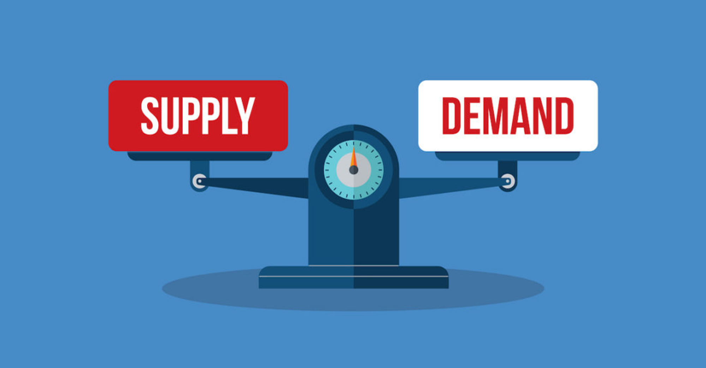

In this lecture, Harkirat explores building a financial exchange from first principles. He covers essential trading terminology and concepts before delving into the exchange's architecture, presenting both complex and simplified backend designs.

  

What is an Exchange?

Primary Function

Types of Exchanges

Brokers vs. Exchanges

Key Concepts in Exchange Operations

How Does an Exchange Work?

Price Determination Through Supply and Demand

Land Buying Example

Financial Jargons to Understand Exchanges

1] Order Books

2] Price of a Stock

3] Limit Order

4] Market Order

5] Liquidity and Market Depth

Maker and Taker

Markets

Base Asset and Quote Asset

Bid and Ask

How Orders are Made and Executed

1. Market Makers Creating Liquidity

2. User Order Process

Step 1: Requesting a Quote

Step 2: Placing an Order

Step 3: Order Execution

3. Market Maker Response

Key Concept: IOC (Immediate or Cancel) Orders

Backend Routes

User Authentication

Sign Up

Sign In

Order Management

Place Order

Check Order Status

Cancel Order

Get Quote

Websocket Streams

Why Websockets?

Where Websockets?

Architecture

1] Complex Backend Architecture:

2] Simpler Backend Architecture:

Key Differences:

Coding the API Server

  

# What is an Exchange?

An exchange is a marketplace that facilitates the trading of financial instruments, such as stocks, bonds, commodities, and cryptocurrencies.

### Primary Function

- Allows users to swap assets
- Common example: Exchanging currency (e.g., INR) for stocks (e.g., TATA shares)

### Types of Exchanges

1. Stock Exchanges
    - Examples:
        - NYSE (New York Stock Exchange)
        - NSE (National Stock Exchange of India)
        - BSE (Bombay Stock Exchange)
    - Purpose: Trade company stocks and other securities
2. Cryptocurrency Exchanges
    - Examples:
        - Binance
        - Coinbase
    - Purpose: Trade various cryptocurrencies

### Brokers vs. Exchanges

1. Brokers
    - Definition: Intermediaries that facilitate trading on exchanges
    - Examples:
        - Robinhood (US-based)
        - Zerodha (India-based)
        - Groww (India-based)
    - Role: Provide access to exchanges for individual traders
2. Key Differences
    - Exchanges: Operate the marketplace
    - Brokers: Provide access to the marketplace

### Key Concepts in Exchange Operations

1. Liquidity: Importance in maintaining efficient markets
2. Order Matching: How buy and sell orders are paired
3. Price Discovery: Process of determining the price of an asset
4. Regulatory Compliance: Adherence to financial regulations and laws

  

> You build an exchange usually by copying over the API structure of an existing exchange - [https://binance-docs.github.io/apidocs/spot/en/#new-order-trade](https://binance-docs.github.io/apidocs/spot/en/#new-order-trade)

  

  

  

# How Does an Exchange Work?

1. **User Registration and Authentication**
    - Users sign up and sign in to the exchange platform
2. **KYC and Demat Account Linking**
    - Users complete the KYC process by providing required documents
    - Users link their Demat account to the exchange
3. **Order Placement**
    - Users can place orders to buy or sell stocks listed on the exchange
    - Two main order types: limit orders and market orders (explained later)
4. **Balance and Holdings Management**
    - Users can view their cash balance and stock holdings
    - Cash balance is updated based on buy and sell transactions
    - Stock holdings are updated based on executed buy and sell orders
5. **Order Execution and Settlement**
    
    - Orders are matched and executed based on the exchange's order matching engine
    - Executed trades are settled, and balances are updated accordingly
    
      
    

## Price Determination Through Supply and Demand

The price of a stock or any asset is determined by the principles of supply and demand. Here's how it works in our day to day lives:



1. **Supply and Demand Imbalance**
    - If there are more buyers (demand) than sellers (supply) for a particular stock, the price tends to rise
    - If there are more sellers than buyers, the price tends to fall
2. **Buyer and Seller Competition**
    - When there is high demand, buyers compete by offering higher prices to acquire the stock
    - When there is high supply, sellers compete by lowering prices to attract buyers
3. **Market Forces and News**
    - Positive news or events about a company can increase demand, driving up the stock price
    - Negative news or events can increase supply (as investors sell), driving down the stock price
4. **Real Estate Example**
    - In the real estate market, high demand for properties in a particular area (e.g., due to population influx) can drive up prices
    - Limited supply of properties in that area further exacerbates the price increase

## Land Buying Example

To illustrate the concept of supply and demand, consider the example of buying a plot of land:

1. **Buyer's Offer:** A buyer approaches a broker and expresses willingness to pay, say, ₹40 lakhs for a plot of land
2. **Seller's Counteroffer:** The broker contacts the seller (owner of the land), who counters with an offer to sell at ₹42 lakhs
3. **Negotiation and Convergence:** The buyer and seller negotiate until they reach an agreed-upon price, or the deal falls through
4. **Multiple Buyers and Limited Supply:** If there are multiple buyers interested in the same property (high demand) and limited supply, buyers may outbid each other. This drives up the price as buyers compete to acquire the property
5. **Multiple Sellers and Limited Demand:** Conversely, if there are multiple sellers and limited demand, sellers may lower their prices to attract buyers. This drives down the price as sellers compete to sell their properties

> The principles of supply and demand apply to various assets, including stocks, real estate, and cryptocurrencies, determining their prices in the market.

  

  

  

# Financial Jargons to Understand Exchanges

## 1] Order Books

An order book is a central record that displays the outstanding buy and sell orders for a particular asset, such as a stock or cryptocurrency. It provides a transparent view of the supply and demand for that asset at various price levels.


  

To understand order books better, let's consider an example:

Imagine there are eight identical plots of land in Indiranagar, Bangalore. If you are a buyer interested in purchasing one of these plots, you would approach a broker and place your best offer, say ₹40 lakhs.

The broker maintains an order book, which is a record of all the buy and sell orders for these plots. Your offer of ₹40 lakhs would be recorded as a "bid" in the order book, represented by a green circle.

Now, if a seller comes along and is willing to sell one of the plots for ₹42 lakhs, the broker would record this as an "ask" in the order book, represented by a red circle.

The order book would then display:

- Bids (green circles): The prices buyers are willing to pay, arranged from highest to lowest.
- Asks (red circles): The prices sellers are willing to accept, arranged from lowest to highest.

As more buyers and sellers enter the market, their respective bids and asks are added to the order book. The goal is for the bids and asks to converge, where a buyer's bid matches a seller's ask. At this point, a transaction can occur, and the respective orders are removed from the order book.

For example, if a buyer increases their bid to ₹41 lakhs, and a seller lowers their ask to ₹41.5 lakhs, the spread between the bid and ask narrows. Eventually, when a bid and ask match, the transaction is executed, and the asset (in this case, the plot of land) is transferred from the seller to the buyer.

  

> The order book provides transparency by displaying the current supply and demand for an asset at various price levels. It helps buyers and sellers make informed decisions based on the prevailing market conditions.

  

Understanding order books is crucial in comprehending the price discovery mechanism in financial markets, as the last executed transaction price becomes the current market price for that asset.

  

  

## 2] Price of a Stock

The price of a stock is determined by the last executed order in the exchange's order book. Here's how it works:

- Each stock exchange (e.g., Zerodha, Groww) maintains its own order book for a particular stock.
- The order book records all the outstanding buy (bid) and sell (ask) orders for that stock at various price levels.
- When a buy order matches a sell order, a transaction is executed at an agreed-upon price.
- The price at which this last transaction occurred becomes the current market price of the stock on that exchange.


For example, if the last executed order for Tata Steel on Zerodha was at ₹200.10, then the current market price of Tata Steel on Zerodha would be ₹200.10. However, on a different exchange like Groww, the last executed order for Tata Steel might have been at ₹200.05, making that the current market price on Groww.

While different exchanges may have slightly different prices for the same stock at any given time, the actual real-world price is typically calculated by taking inputs from all major exchanges and determining a consolidated price.

> Thus, the price of a stock is not an average of past transactions or a predetermined value. It is simply the last price at which a buy order and a sell order were matched and executed on a particular exchange's order book.[1] This price represents the fair market value of the stock at that moment, as determined by the forces of supply and demand.

  

  

## 3] Limit Order

A limit order is a type of order where the trader specifies the maximum price they are willing to buy or the minimum price they are willing to sell a particular quantity of an asset.

When placing a limit order, the trader sets:

1. The quantity of the asset (e.g., 10 stocks of Apple)
2. The limit price at which they want to buy or sell

  


For example, a buy limit order could be "Buy 10 stocks of Apple at $150 or lower per share." This order will only execute if the market price is $150 or less. If the market price is higher than $150, the order will remain in the order book until the price drops to $150 or lower, or until the order is canceled.

Similarly, a sell limit order could be "Sell 10 stocks of Apple at $160 or higher per share." This order will only execute if the market price is $160 or higher. If the market price is lower than $160, the order will remain in the order book until the price rises to $160 or higher, or until the order is canceled.


> Limit orders provide traders with control over the price at which they are willing to execute a trade. However, there is a risk that the order may not execute if the market price never reaches the specified limit price. Hence, they are typically used by traders who have a specific price target in mind and are willing to wait for the market to reach that price level before executing the trade.

  

## 4] Market Order

A market order is a type of order where the trader instructs the broker or exchange to execute the trade immediately at the best available market price.

When placing a market order, the trader specifies only the quantity of the asset they want to buy or sell. The price is determined by the current market conditions and the availability of orders in the order book.


For example, if a trader places a market order to buy 100 shares of a stock, the order will be filled by taking the best available ask prices (sell orders) from the order book until the entire quantity of 100 shares is filled.

Market orders are typically used by traders who prioritize immediate execution over a specific price. However, there is a risk that the market order may execute at an unfavorable price, especially in volatile or illiquid markets, as the order will be filled at the best available prices in the order book at the time of execution.

> Market orders are often used by retail traders who want to buy or sell an asset quickly without having to specify a limit price. However, it's important to note that market orders can result in higher trading costs due to potential slippage (the difference between the expected price and the actual execution price).


Both limit orders and market orders are essential tools for traders, each with its own advantages and risks. Traders must carefully consider their trading strategies, risk tolerance, and market conditions when deciding which order type to use.

  

  

  

## 5] Liquidity and Market Depth

Liquidity and market depth refer to the ability of a market to handle large orders without significantly impacting the price of an asset. In the context of an exchange, these terms are closely related and describe the state of the order book.

- Liquidity refers to the ease with which an asset can be bought or sold without causing a significant change in its price. A liquid market has a high volume of trading activity and a large number of buy and sell orders in the order book.
- Market depth, on the other hand, refers to the quantity of orders available at different price levels in the order book. A market with high depth has a large number of orders concentrated around the current market price, allowing large orders to be executed without significantly moving the price.


When an order book has high liquidity and depth, it can absorb large buy or sell orders without causing significant price fluctuations. This is because there are enough orders on both sides of the book to match the incoming orders without depleting the available supply or demand.

For example, if a trader wants to buy 10,000 shares of a stock, a liquid market with high depth would have enough sell orders at or near the current market price to fill the order without significantly driving up the price. Conversely, if the market lacks depth, a large buy order could quickly consume the available sell orders, causing the price to rise sharply.

> Exchanges strive to maintain high liquidity and market depth to ensure efficient price discovery and smooth trading operations. They often incentivize market makers, who are firms or individuals that provide liquidity by continuously placing buy and sell orders in the order book, to enhance market depth and liquidity.

Market makers are incentivized through various means, such as lower trading fees, rebates, or other incentives, to encourage them to provide liquidity and maintain tight bid-ask spreads (the difference between the highest buy order and the lowest sell order).

  

## Maker and Taker

In the context of an exchange, the terms "maker" and "taker" refer to the roles played by traders in executing orders.

- A maker is a trader who places an order in the order book, providing liquidity to the market. When a maker's order is matched and executed against an incoming order, they are considered the liquidity provider.
- A taker, on the other hand, is a trader who submits an order that is immediately matched and executed against an existing order in the order book, removing liquidity from the market.

  

For example, if a trader places a buy order at the current market price, they are considered a taker because their order is immediately matched and executed against existing sell orders in the order book, consuming the available liquidity.

Exchanges often incentivize makers by charging them lower trading fees compared to takers. This is because makers are providing liquidity to the market, which is beneficial for the overall health and efficiency of the exchange. Takers, on the other hand, are charged higher fees because they are removing liquidity from the market.


The fee structure for makers and takers can vary across different exchanges and may also depend on factors such as trading volume, account type, or market conditions. Generally, the maker fee is lower than the taker fee, encouraging traders to provide liquidity to the order book.

By incentivizing makers and charging higher fees for takers, exchanges aim to maintain a healthy order book with sufficient liquidity, which ultimately benefits all market participants by facilitating efficient price discovery and trade execution.

  

> It's important to note that the roles of maker and taker are not fixed for a particular trader. A trader can be a maker on one trade and a taker on another, depending on whether their order is adding or removing liquidity from the order book.

  

  

### Markets

- Definition: A market is a specific trading pair of assets.
- Examples:
    - ETH-USDC: Ethereum traded against USD Coin
    - TATA-INR: Tata Motors stock traded against Indian Rupees
    - ETH-BTC: Ethereum traded against Bitcoin (often derived from ETH-USDC and BTC-USDC markets)

### Base Asset and Quote Asset

- Base Asset: The primary asset being traded (e.g., TATA in TATA-INR)
- Quote Asset: The asset used to price the base asset (e.g., INR in TATA-INR)

### Bid and Ask

- Bid: An order to buy at a specific price. Example: "I will buy 5 stocks of TATA for Rs 200/stock"
- Ask: An order to sell at a specific price. Example: "I will sell 5 stocks of TATA for Rs 201/stock"

  


  

  

  

  

# How Orders are Made and Executed

### 1. Market Makers Creating Liquidity

- Role of Market Makers:
    - Place orders on both sides of the orderbook (bids and asks)
    - Continuously update orders based on their assessment of fair asset price
    - Ensure there's always a market for traders to buy or sell
- Importance:
    - Without market makers, an exchange lacks the necessary liquidity to function effectively
    - They provide the foundation for a functional market

### 2. User Order Process

### Step 1: Requesting a Quote

- Users typically start by requesting a quote for the quantity they want to trade
- This gives them an idea of the current market price for their desired transaction

### Step 2: Placing an Order

- Users can then place an order that interacts with the existing orderbook
- Types of orders:
    1. Market Order: Executed immediately at the best available price
    2. Limit Order: Specifies a maximum (for buy) or minimum (for sell) price

### Step 3: Order Execution

- The exchange matches the user's order with existing orders in the book
- For large orders, this may "eat through" multiple price levels in the orderbook

### 3. Market Maker Response

- After significant orders are executed (orderbook gets "eaten"):
    - Market makers quickly place new orders
    - This replenishes liquidity in the orderbook
    - Helps maintain a stable and efficient market

### Key Concept: IOC (Immediate or Cancel) Orders

- Even when users place what appears to be a market order, it's often implemented as a special type of limit order:
    - Type: IOC (Immediate or Cancel)
    - Price: Set to the quote received in Step 1
    - Behavior:
        - Executes immediately for any available quantity at the specified price or better
        - Any unfilled portion is immediately canceled

  

  

# Backend Routes

## User Authentication

### Sign Up

```Shell
POST /api/v1/signup
```

- Allows new users to create an account
- Expected input: username, email, password (details to be implemented)
- Should return: User ID or confirmation message

### Sign In

```Plain
POST /api/v1/signin
```

- Authenticates existing users
- Expected input: email/username, password
- Returns: JWT for authenticated sessions

## Order Management

### Place Order

```Plain
POST /api/v1/order
```

- Allows users to place new orders
- Parameters:
    
    ```JSON
    {
      "type": "limit" | "market",
      "kind": "buy" | "sell",
      "price": number,
      "quantity": number,
      "market": "TATA-INR"
    }
    ```
    
- Returns: `orderId` and initial fill status

### Check Order Status

```Plain
GET /api/v1/order/:orderId
```

- Retrieves the current status of a specific order
- Returns: Fill status of the order

### Cancel Order

```Plain
DELETE /api/v1/order/:orderId
```

- Cancels an unfilled or partially filled order
- Removes the order from the orderbook if not yet executed

### Get Quote

```Plain
POST /api/v1/order/quote
```

- Provides a price quote for a potential order
- Parameters:
    
    ```JSON
    {
      "kind": "buy" | "sell",
      "quantity": number,
      "market": "TATA-INR"
    }
    ```
    
- Returns: Current market price for the specified quantity

  

  

  

# Websocket Streams

  

### Why Websockets?

1. Real-time Updates: Websockets allow for real-time, bidirectional communication between the client and server. This is crucial for providing live updates without constant polling.
2. Efficiency: Unlike traditional HTTP requests, websockets maintain an open connection, reducing overhead and latency for frequent updates.
3. Instant Data Delivery: As soon as new data is available on the server, it can be immediately pushed to the client without waiting for a request.
4. Reduced Server Load: By eliminating the need for frequent polling, websockets can significantly reduce the load on your server.

  


### Where Websockets?

1. Current Price: Websockets can push price updates to clients as soon as they change, ensuring users always see the most up-to-date prices.
2. Current Orderbook: Real-time updates to the orderbook (bids and asks) can be efficiently delivered via websockets, allowing traders to see market depth instantly.
3. Recent Trades: New trades can be pushed to clients immediately, providing a live feed of market activity.
4. Graph Data: For live-updating charts or graphs, websockets can stream new data points as they become available, creating smooth, real-time visualizations.

  

  

  

# Architecture

  

### 1] Complex Backend Architecture:

1. Browser: The client-side interface where users interact with the platform.
2. API Server: Handles incoming HTTP requests from the browser. It processes orders (e.g., /api/v1/order with parameters like kind: buy, type: limit, price: 200, quantity: 2, market: TATA_INR).
3. Orderbooks: Maintains separate orderbooks for different markets (TATA_INR, BATA_INR, ZOMATO_INR). Each orderbook keeps track of buy and sell orders for that specific market.
4. Queue: A message queue system that handles order processing and updates.
5. Websocket Servers: Provide real-time updates to clients about order status, book updates, and other relevant information.
6. Order Processing: The system processes orders, updates orderbooks, and generates events like ORDER_FILLED and BOOK_UPDATED.
7. Event Publishing: These events are published to the queue for further processing and to update clients via websockets.


  

### 2] Simpler Backend Architecture:

1. Browser: The client interface, same as in the complex architecture.
2. Orderbooks: Simplified to show only two markets (TATA_INR and BATA_INR).
3. Order Processing: Directly interacts with the orderbooks without an intermediate API server.
4. Queue: Handles events like ORDER_FILLED and BOOK_UPDATED.
5. Websocket Servers: Provide real-time updates to the browser.
6. Database Filler: A component that processes events from the queue and updates the database.
7. Database: Stores order and price information.


  

### Key Differences:

1. The complex architecture has an API server layer, while the simpler one processes orders directly.
2. The complex version shows more detailed event handling and queue processing.
3. The simpler architecture introduces a database filler component and explicit database storage.
4. The complex architecture shows more markets and detailed order parameters.

  

> Both architectures emphasize real-time processing and updates through websockets, which is crucial for a responsive trading platform. The choice between these architectures would depend on factors like expected trading volume, variety of markets, and scalability requirements.

  

  

  

# Coding the API Server

  

1. Project Setup:  
    The project is initialized with TypeScript and necessary dependencies.  
    
2. Orderbook Structure (src/orderbook.ts):
    
    ```TypeScript
    interface Order {
        price: number;
        quantity: number;
        orderId: string;
    }
    
    interface Bid extends Order {
        side: 'bid';
    }
    
    interface Ask extends Order {
        side: 'ask';
    }
    
    interface Orderbook {
        bids: Bid[];
        asks: Ask[];
    }
    
    export const orderbook: Orderbook = {
      bids: [],
      asks: []
    }
    
    export const bookWithQuantity: {bids: {[price: number]: number}; asks: {[price: number]: number}} = {
        bids: {},
        asks: {}
    }
    ```
    
    This defines the structure of the orderbook, including bids and asks.
    
3. Input Validation (src/types.ts):
    
    ```TypeScript
    import { z } from "zod";
    
    export const OrderInputSchema = z.object({
      baseAsset: z.string(),
      quoteAsset: z.string(),
      price: z.number(),
      quantity: z.number(),
      side: z.enum(['buy', 'sell']),
      type: z.enum(['limit', 'market']),
      kind: z.enum(['ioc']).optional(),
    });
    ```
    
    Uses Zod for input validation of order requests.
    
4. Main Server Logic (src/index.ts):
    
    ```Shell
    interface Fill {
        "price": number,
        "qty": number,
        "tradeId": number,
    }
    
    function fillOrder(orderId: string, price: number, quantity: number, side: "buy" | "sell", type?: "ioc"): { status: "rejected" | "accepted"; executedQty: number; fills: Fill[] } {
        const fills: Fill[] = [];
        const maxFillQuantity = getFillAmount(price, quantity, side);
        let executedQty = 0;
    
        if (type === 'ioc' && maxFillQuantity < quantity) {
            return { status: 'rejected', executedQty: maxFillQuantity, fills: [] };
        }
        
        if (side === 'buy') {
            orderbook.asks.forEach(o => {
                if (o.price <= price && quantity > 0) {
                    console.log("filling ask");
                    const filledQuantity = Math.min(quantity, o.quantity);
                    console.log(filledQuantity);
                    o.quantity -= filledQuantity;
                    bookWithQuantity.asks[o.price] = (bookWithQuantity.asks[o.price] || 0) - filledQuantity;
                    fills.push({
                        price: o.price,
                        qty: filledQuantity,
                        tradeId: GLOBAL_TRADE_ID++
                    });
                    executedQty += filledQuantity;
                    quantity -= filledQuantity;
                    if (o.quantity === 0) {
                        orderbook.asks.splice(orderbook.asks.indexOf(o), 1);
                    }
                    if (bookWithQuantity.asks[price] === 0) {
                        delete bookWithQuantity.asks[price];
                    }
                }
            });
    
            // Place on the book if order not filled
            if (quantity !== 0) {
                orderbook.bids.push({
                    price,
                    quantity: quantity - executedQty,
                    side: 'bid',
                    orderId
                });
                bookWithQuantity.bids[price] = (bookWithQuantity.bids[price] || 0) + (quantity - executedQty);
            }
        } else {
            orderbook.bids.forEach(o => {
                if (o.price >= price && quantity > 0) {
                    const filledQuantity = Math.min(quantity, o.quantity);
                    o.quantity -= filledQuantity;
                    bookWithQuantity.bids[price] = (bookWithQuantity.bids[price] || 0) - filledQuantity;
                    fills.push({
                        price: o.price,
                        qty: filledQuantity,
                        tradeId: GLOBAL_TRADE_ID++
                    });
                    executedQty += filledQuantity;
                    quantity -= filledQuantity;
                    if (o.quantity === 0) {
                        orderbook.bids.splice(orderbook.bids.indexOf(o), 1);
                    }
                    if (bookWithQuantity.bids[price] === 0) {
                        delete bookWithQuantity.bids[price];
                    }
                }
            });
    
            // Place on the book if order not filled
            if (quantity !== 0) {
                orderbook.asks.push({
                    price,
                    quantity: quantity,
                    side: 'ask',
                    orderId
                });
                bookWithQuantity.asks[price] = (bookWithQuantity.asks[price] || 0) + (quantity);
            }
        }
    
        return {
            status: 'accepted',
            executedQty,
            fills
        }
    }
    
    function getFillAmount(price: number, quantity: number, side: "buy" | "sell"): number {
        let filled = 0;
        if (side === 'buy') {
            orderbook.asks.forEach(o => {
                if (o.price < price) {
                    filled += Math.min(quantity, o.quantity);
                }
            });
        } else {
            orderbook.bids.forEach(o => {
                if (o.price > price) {
                    filled += Math.min(quantity, o.quantity);
                }
            });
        }
        return filled;
    }
    ```
    
    - Sets up an Express server
    - Defines a POST route for '/api/v1/order'
    - Implements order processing logic
    
    Key functions:
    
    - `fillOrder`: Processes an order, matching it against existing orders in the book
    - `getFillAmount`: Calculates the amount that can be filled for a given order
5. Order Processing:
    
    ```TypeScript
    app.post('/api/v1/order', (req, res) => {
      const order = OrderInputSchema.safeParse(req.body);
      if (!order.success) {
        res.status(400).send(order.error.message);
        return;
      }
    
      const { baseAsset, quoteAsset, price, quantity, side, kind } = order.data;
      const orderId = getOrderId();
    
      if (baseAsset !== BASE_ASSET || quoteAsset !== QUOTE_ASSET) {
        res.status(400).send('Invalid base or quote asset');
        return;
      }
    
      const { executedQty, fills } = fillOrder(orderId, price, quantity, side, kind);
    
      res.send({
        orderId,
        executedQty,
        fills
      });
    });
    ```
    
    This route handles incoming order requests, validates them, and processes them using the `fillOrder` function.
    
6. Order Filling Logic:  
    The  
    `fillOrder` function matches incoming orders against existing orders in the book, updating the orderbook and generating fills.

This implementation provides a basic structure for an orderbook system, handling limit orders and immediate-or-cancel (IOC) orders. It maintains the orderbook state and processes trades, but doesn't include features like persistence or real-time updates, which would be necessary for a production system.