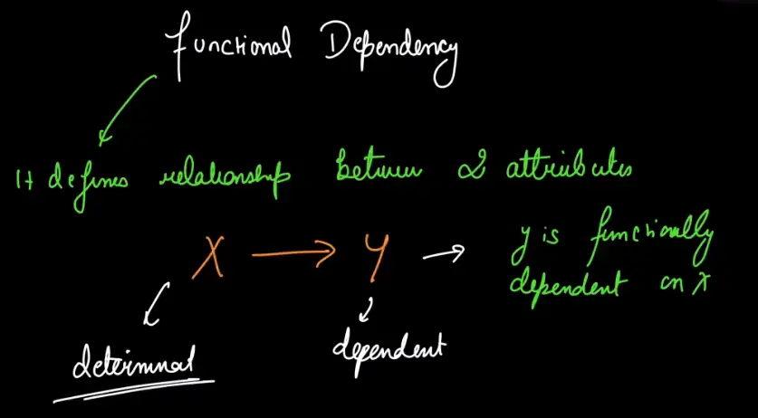
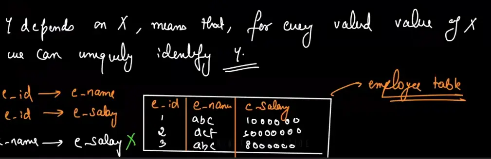
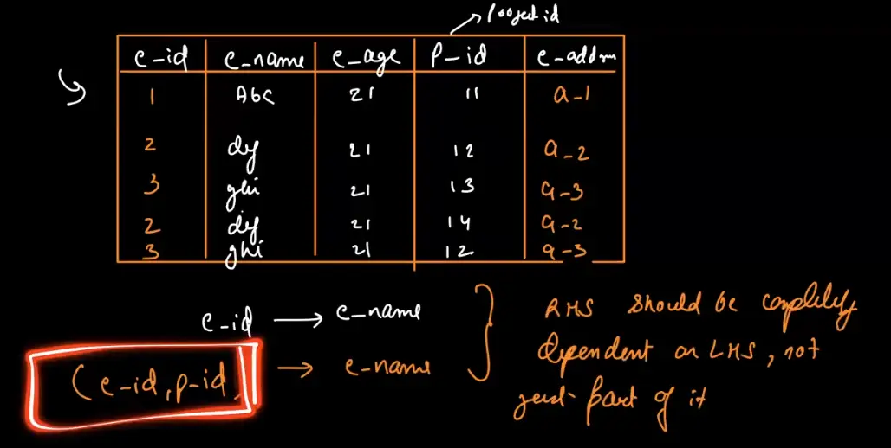
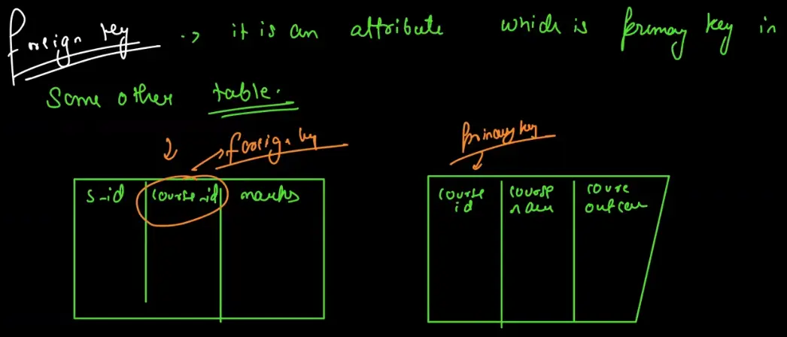
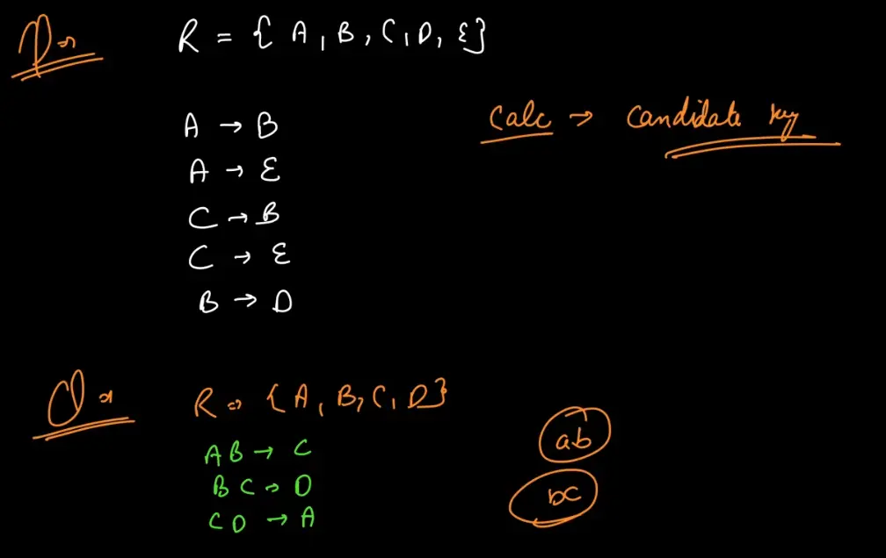

A **database schema** is the blueprint or structure of a database that defines how data is organized and managed. It includes the definitions of tables, columns, data types, relationships, constraints, and other elements that determine the layout of the database.

SCHEMA- BLUEPRINT 
SO BASICALLY YE EK BLUEPRINT/DESIGN HAI OF THE ACTUAL DATABASE WE'RE GOING TO MAKE // BUT YE ACTUAL DB NAHI HAI

How we will store data, structures of tables etc is defined in it 

**HERE WE ALSO TELL HOW THE TABLES ARE ASSOCIATED WITH EACH OTHER!!! RELATIONS BETWEEN THE TABLES** 

 Database Instance: It is the actual database we've prepared!

## FUNCTIONAL DEPENDENCY
It is within a table!
We refer as  COLUMNS= ATTRIBUTES  ROWS=TUPLES

### Definition

A functional dependency, denoted as A→B means:

- If two tuples (rows) in a table have the same value for attribute A, they must also have the same value for attribute B.

Here:

- A is called the **determinant**.
- B is called the **dependent**.

Example: Imagine a class where each student has a unique **roll number** (like an ID), and we also know their **name**. For example:

- Roll number 1 belongs to Alice.
- Roll number 2 belongs to Bob.
- Roll number 3 belongs to another Alice.

### Key Idea

- The **roll number** is unique for every student, so if you know a roll number, you can confidently say who the student is. For instance:
    - Roll number 1? That's Alice.
    - Roll number 2? That's Bob.

This means the roll number **determines the name**. In database terms, we say: **"Roll number determines name"** or **Roll_No → Name**.

### Why doesn't the reverse hold?

Now, think about the **name**. Multiple students could have the same name:

- Alice (Roll number 1).
- Alice (Roll number 3).

If someone just tells you "Alice," you can't figure out which roll number they are talking about. That’s why the name **does not determine the roll number**. In database terms: **Name → Roll_No does not hold.**

**MOST OF THE FAMOUS DB'S DON'T SUPPORT ASSERTIONS!**

FLOW!!!

# DB KEYS 

Ye jo set hai na usko hum SUPER KEY BOLTE HAIN!!!

**Candidate Key**

- A set of columns that could serve as a primary key because they uniquely identify rows.
- A table can have multiple candidate keys, but only one is chosen as the primary key.
- Example: In a `Books` table, both `ISBN` and `Library_ID` might be candidate keys.
A CANDIDATE KEY CAN ALSO HAVE MULTIPLE ATTRIBUTES

**Composite Key**

- A primary key made up of two or more columns.
- Used when no single column can uniquely identify rows.
- Example: In an `Orders` table, `Order_ID` and `Product_ID` together might form a composite key.

**Primary Key**

- A column or combination of columns that uniquely identifies every row in a table.
- It cannot have duplicate or NULL values.
- Example: In a `Students` table, `Roll_No` might be the primary key since each student has a unique roll number.

**Alternate Key**

- A candidate key that is not chosen as the primary key.
- Example: If `ISBN` is chosen as the primary key in a `Books` table, `Library_ID` becomes the alternate key.

**Foreign Key**

- A column or set of columns in one table that refers to the primary key in another table.
- It establishes relationships between tables.
- Example: In an `Orders` table, `Customer_ID` might be a foreign key referring to the `Customer_ID` in a `Customers` table.

