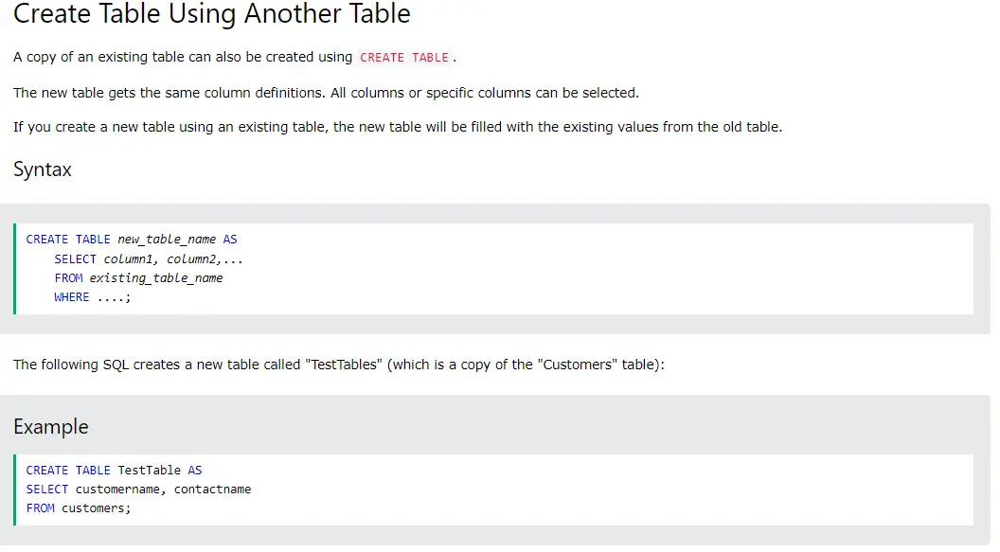
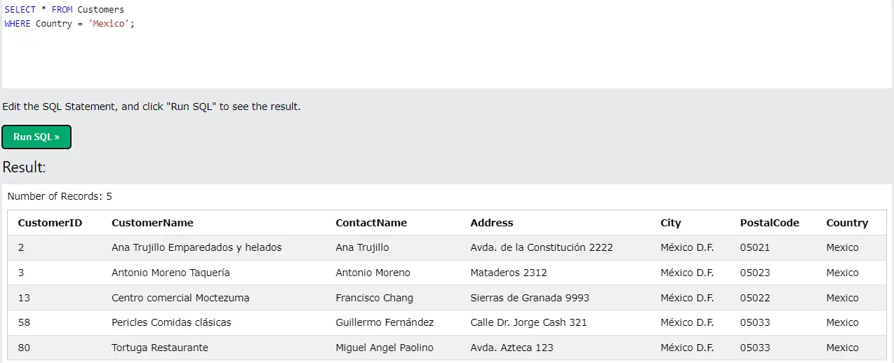
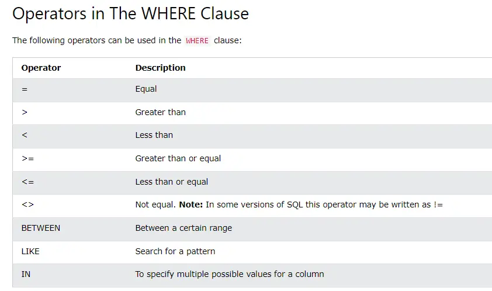
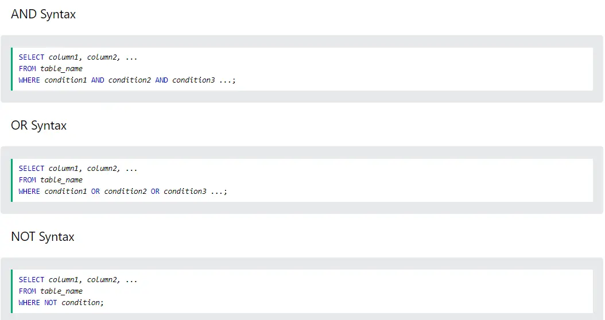
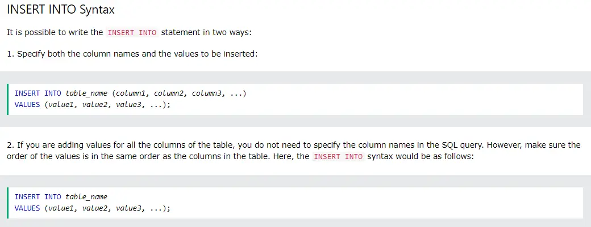
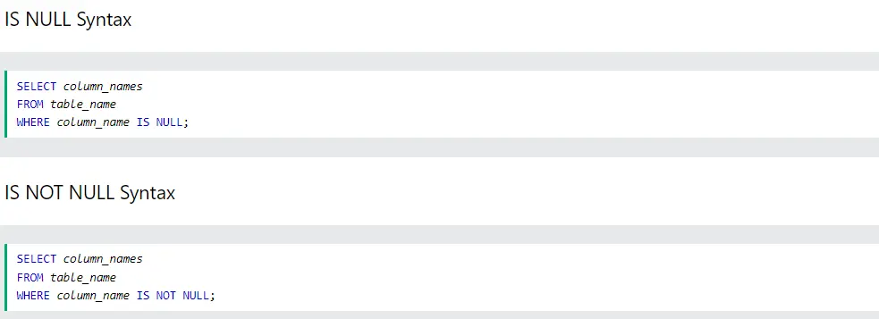
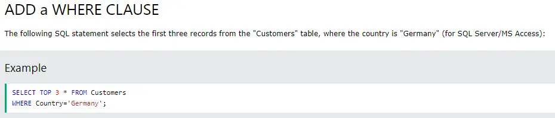
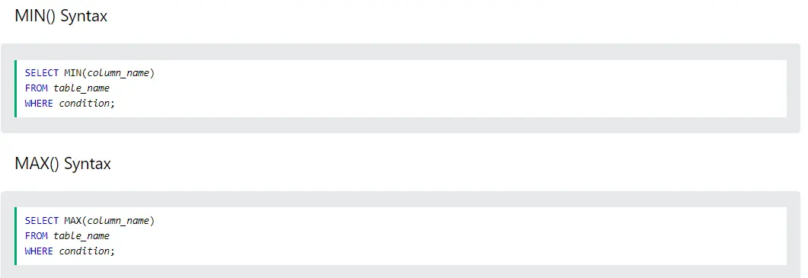
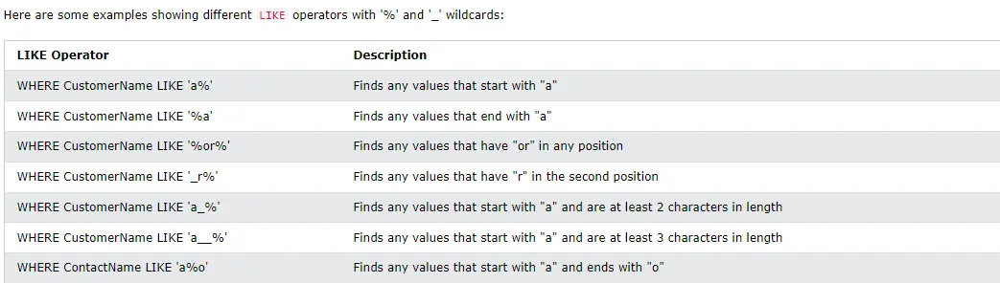
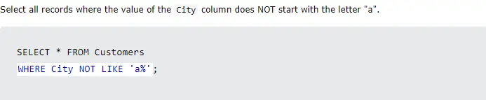

## What is SQL?

SQL is the standard language for dealing with Relational Databases. SQL is used to insert, search, update, and delete database records.

To login into mysql Server: `mysql -u username -p`

**SQL keywords are NOT case sensitive: `select` is the same as `SELECT`**

**Semicolon after SQL Statements?**
Some database systems require a semicolon at the end of each SQL statement.
Semicolon is the standard way to separate each SQL statement in database systems that allow more than one SQL statement to be executed in the same call to the server.


## SQL CREATE DATABASE Statement

The `CREATE DATABASE` statement is used to create a new SQL database.

`CREATE DATABASE _databasename_;`
## To show all databases in SQL

This command will list all the databases available in your SQL server. Make sure you have the necessary permissions to view the databases

`SHOW DATABASES`

## The MySQL DROP DATABASE Statement

The `DROP DATABASE` statement is used to drop an existing SQL database.

`DROP DATABASE _databasename_;`


## THE  MSQL USE Statement

To use a specific database in SQL, you can use the `USE` command. This command sets the specified database as the current database for your session, allowing you to run queries against it.

`USE database_name;`

TO RUN QUERIES AGAINST A DATABASE WE NEED TO FIRST USE IT
## The MySQL CREATE TABLE Statement

The `CREATE TABLE` statement is used to create a new table in a database.

`CREATE TABLE _table_name_ (`  
    `_column1name datatype_,`  
    `_column2name datatype_,`  
    `_column3name datatype_,`  
   `....`  
`);`

The column parameters specify the names of the columns of the table.

The datatype parameter specifies the type of data the column can hold (e.g. varchar, integer, date, etc.).

Each column in a database table is required to have a name and a data type.

An SQL developer must decide what type of data that will be stored inside each column when creating a table. The data type is a guideline for SQL to understand what type of data is expected inside of each column, and it also identifies how SQL will interact with the stored data.

**In MySQL there are three main  data types: string, numeric, and date and time.**




## The MySQL DROP TABLE Statement

The `DROP TABLE` statement is used to drop an existing table in a database.

`DROP TABLE _table_name_;`

## MySQL TRUNCATE TABLE

The `TRUNCATE TABLE` statement is used to delete the data inside a table, but not the table itself.

`TRUNCATE TABLE _table_name_;`

## The MySQL SELECT Statement

The `SELECT` statement is used to select data from a database. The data returned is stored in a result table, called the result-set.

SELECT HUM HAMESHA COLUMNS PAR LAGATE HAIN! AND FROM USS TABLE PAR LAGATE HAIN


### What is `COUNT`?

The `COUNT` function in SQL is used to count the number of rows that match a specified condition in a query


If you specify multiple columns, `DISTINCT` will consider the combination of those column


## The MySQL WHERE Clause

The `WHERE` clause is used to filter records.
It is used to extract only those records that fulfill a specified condition.

WHERE KISI BHI COLUMN KI PARTICULAR VALUES PAR LAGATA HAI!

`SELECT _column1_, _column2, ..._`  
`FROM _table_name_`  
`WHERE _condition_;`

**Note:** The `WHERE` clause is not only used in `SELECT` statements, it is also used in `UPDATE`, `DELETE`, etc.!


SELECT * FROM Customers  
WHERE Country = 'Mexico';

Even though you are filtering by `Country`, you may want to see all the details (like `CustomerID`, `Name`, `Address`, etc.) of the customers from Mexico.



## Text Fields vs. Numeric Fields

SQL requires single quotes around text values (most database systems will also allow double quotes).

However, numeric fields should not be enclosed in quotes:

SELECT * FROM Customers  
WHERE CustomerID = 1;




SELECT * FROM Customers WHERE NOT City = 'Berlin';
THIS IS EQUIVALENT TO=
`SELECT * FROM Customers`
`WHERE City <> 'Berlin';`

OR 

`SELECT * FROM Customers`
`WHERE City != 'Berlin';`

Example: SELECT CategoryID, SupplierID FROM Products
        WHERE Price<30;

THIS WORKS PERFECTLY FINE
## The MySQL AND, OR and NOT Operators

The `WHERE` clause can be combined with `AND`, `OR`, and `NOT` operators.

The `AND` and `OR` operators are used to filter records based on more than one condition:

- The `AND` operator displays a record if all the conditions separated by `AND` are TRUE.
- The `OR` operator displays a record if any of the conditions separated by `OR` is TRUE.

The `NOT` operator displays a record if the condition(s) is NOT TRUE.



EXAMPLE:
SELECT CategoryID,SupplierID FROM Products
WHERE Price<30 AND CategoryID>5 ;


## Combining AND, OR and NOT

You can also combine the `AND`, `OR` and `NOT` operators.

The following SQL statement selects all fields from "Customers" where country is "Germany" AND city must be "Berlin" OR "Stuttgart" (use parenthesis to form complex expressions):


## The MySQL ORDER BY Keyword

The `ORDER BY` keyword is used to sort the result-set in ascending or descending order.

The `ORDER BY` keyword sorts the records in ascending order by default. To sort the records in descending order, use the `DESC` keyword.

`SELECT _column1_, _column2, ..._`  
`FROM _table_name_`  
`ORDER BY _column1, column2, ..._ ASC|DESC;`

ASC:
SELECT * FROM Customers  
ORDER BY Country;

DESC:
SELECT * FROM Customers  
ORDER BY Country DESC;

SELECT CategoryID,SupplierID,Price FROM Products
ORDER BY Price DESC;


## ORDER BY Several Columns Example

The following SQL statement selects all customers from the "Customers" table, sorted by the "Country" and the "CustomerName" column. This means that it orders by Country, but if some rows have the same Country, it orders them by CustomerName

SELECT * FROM Customers  
ORDER BY Country, CustomerName;

SELECT * FROM Customers  
ORDER BY Country ASC, CustomerName DESC;


## The MySQL INSERT INTO Statement

The `INSERT INTO` statement is used to insert new records in a table.



## What is a NULL Value?

A field with a NULL value is a field with no value.

If a field in a table is optional, it is possible to insert a new record or update a record without adding a value to this field. Then, the field will be saved with a NULL value.
A NULL value is different from a zero value or a field that contains spaces. A field with a NULL value is one that has been left blank during record creation!

## How to Test for NULL Values?

It is not possible to test for NULL values with comparison operators, such as =, <, or <>.

We will have to use the `IS NULL` and `IS NOT NULL` operators instead.


**Tip:** Always use IS NULL to look for NULL values.

## The MySQL UPDATE Statement

The `UPDATE` statement is used to modify the existing records in a table

`UPDATE _table_name_`  
`SET _column1_ = _value1_, _column2_ = _value2_, ...`  
`WHERE _condition_;`

Careful when updating records in a table! Notice the `WHERE` clause in the `UPDATE` statement. The `WHERE` clause specifies which record(s) that should be updated. If you omit the `WHERE` clause, all records in the table will be updated!

UPDATE Customers  
SET ContactName = 'Alfred Schmidt', City = 'Frankfurt'  
WHERE CustomerID = 1;


## The MySQL DELETE Statement

The `DELETE` statement is used to delete existing records in a table.

`DELETE FROM _table_name_ WHERE _condition_;`
DELETE FROM Customers WHERE CustomerName='Alfreds Futterkiste';
Be careful when deleting records in a table! Notice the `WHERE` clause in the `DELETE` statement. The `WHERE` clause specifies which record(s) should be deleted. If you omit the `WHERE` clause, all records in the table will be deleted


The `SELECT TOP` clause is used to specify the number of records to return.

The `SELECT TOP` clause is useful on large tables with thousands of records. Returning a large number of records can impact performance.

`SELECT TOP 3 * FROM Customers;`
 Not all database systems support the `SELECT TOP` clause. MySQL supports the `LIMIT` clause to select a limited number of records, while Oracle uses `FETCH FIRST _n_ ROWS ONLY` and `ROWNUM`.


## SQL TOP PERCENT Example

The following SQL statement selects the first 50% of the records from the "Customers" table (for SQL Server/MS Access):
SELECT TOP 50 PERCENT * FROM Customers;




## The MySQL LIMIT Clause

The `LIMIT` clause is used to specify the number of records to return.

The `LIMIT` clause is useful on large tables with thousands of records. Returning a large number of records can impact performance.

`SELECT _column_name(s)_`
`FROM _table_name_`
`WHERE _condition_`
`LIMIT _number_ OFFSET _offset_;`

SELECT * FROM Customers  
LIMIT 3;

What if we want to select records 4 - 6 (inclusive)?

MySQL provides a way to handle this: by using OFFSET.

The SQL query below says "return only 3 records, start on record 4 (OFFSET 3)":

### Explanation:

- **`LIMIT 3`**: This specifies that you want to return 3 records.
- **`OFFSET 3`**: This tells MySQL to skip the first 3 records in the result set, effectively starting the selection from the 4th record.

## MySQL MIN() and MAX() Functions

The `MIN()` function returns the smallest value of the selected column.

The `MAX()` function returns the largest value of the selected column.



SELECT MIN(Price) AS SmallestPrice  
FROM Products;

 The `AS` keyword is used to assign an alias to the result of the `MIN(Price)` function. In this case, the result will be labeled as `SmallestPrice`, making it easier to reference in the result 


**Note:** NULL values are not counted.
**Note:** NULL values are ignored.
The `SUM` function can only take one argument, so you cannot sum multiple columns

Find the difference between the total number of **CITY** entries in the table and the number of distinct **CITY** entries in the table.  
The **STATION** table is described as follows:

SELECT COUNT(CITY) FROM STATION - SELECT DISTINCT COUNT(CITY)FROM STATION // WRONG


 It is not a valid SQL query. The reason is that you cannot directly subtract one `SELECT` statement from another like that.

`SELECT` 
    `(SELECT COUNT(CITY) FROM STATION) -`
    `(SELECT COUNT(DISTINCT CITY) FROM STATION) AS num_of_duplicates;`


The key difference is that you need to use a subquery structure to perform the subtraction, rather than directly subtracting one `SELECT` statement from another.


## The MySQL LIKE Operator

KYONKI YAHAN PAR HUM CONDITION BNA RAHE HAIN!!!

LIKE HAMESHA WHERE WALE CLAUSE K SATH AEGA!!!!!

The `LIKE` operator is used in a `WHERE` clause to search for a specified pattern in a column.

There are two wildcards often used in conjunction with the `LIKE` operator:

- The percent sign (%) represents zero, one, or multiple characters
- The underscore sign _ represents one, single character

The percent sign and the underscore can also be used in combinations!

SELECT _column1, column2, ..._  
FROM _table_name_  
WHERE _columnN_ LIKE _pattern_;

**Tip:** You can also combine any number of conditions using `AND` or `OR` operators.




## MySQL Wildcard Characters

A wildcard character is used to substitute one or more characters in a string.

Wildcard characters are used with the `[LIKE](https://www.w3schools.com/mysql/mysql_like.asp)` operator. The `LIKE` operator is used in a `WHERE` clause to search for a specified pattern in a column.


## The MySQL IN Operator

The `IN` operator allows you to specify multiple values in a `WHERE` clause.

The `IN` operator is a shorthand for multiple `OR` conditions.


```SQL
SQL
├── Database Objects
│   ├── DATABASE
│   │   ├── CREATE DATABASE db_name;      → creates a new database
│   │   ├── DROP DATABASE db_name;        → deletes entire database
│   │   └── USE db_name;                  → switch context to a database
│   │
│   ├── TABLE
│   │   ├── CREATE TABLE name (col datatype constraints...); → make new table
│   │   ├── ALTER TABLE name ADD col datatype;               → add new column
│   │   │                    DROP col;                       → remove column
│   │   │                    MODIFY col datatype;            → change column type
│   │   ├── DROP TABLE name;                                 → remove table completely
│   │   ├── TRUNCATE TABLE name;                             → remove all rows, keep structure
│   │   └── RENAME TABLE old TO new;                         → rename table
│   │
│   ├── VIEW
│   │   ├── CREATE VIEW v_name AS SELECT ...;                → save query as virtual table
│   │   ├── CREATE OR REPLACE VIEW ...;                      → update view definition
│   │   ├── WITH CHECK OPTION                                → prevents invalid inserts/updates
│   │   └── DROP VIEW v_name;                                → delete view
│   │
│   └── INDEX
│       ├── CREATE INDEX idx_name ON table(col);             → adds index (faster lookup)
│       ├── CREATE UNIQUE INDEX idx_name ON table(col);      → prevents duplicates
│       └── DROP INDEX idx_name;                             → removes index
│
├── Data Operations
│   ├── DML (Row-level changes)
│   │   ├── INSERT INTO table (col1, col2) VALUES (...);     → add new row
│   │   ├── UPDATE table SET col = value WHERE condition;    → modify rows
│   │   └── DELETE FROM table WHERE condition;               → remove rows
│   │
│   └── DQL (Querying)
│       └── SELECT
│           ├── SELECT * FROM table;                         → fetch all columns
│           ├── SELECT DISTINCT col FROM table;              → unique values
│           ├── SELECT ... WHERE condition;                  → filter rows
│           ├── SELECT ... ORDER BY col ASC/DESC;            → sorting
│           ├── SELECT ... LIMIT n OFFSET m;                 → pagination
│           ├── SELECT col, COUNT(*) FROM table GROUP BY col;→ grouping
│           ├── SELECT ... GROUP BY col HAVING condition;    → filter groups
│           └── CASE WHEN cond THEN val ELSE val END         → conditional output
│
├── Constraints (Rules on data)
│   ├── PRIMARY KEY   → uniquely identifies each row (implies NOT NULL)
│   ├── FOREIGN KEY   → link to another table’s PRIMARY KEY
│   ├── UNIQUE        → column must have unique values
│   ├── NOT NULL      → column cannot be empty
│   └── CHECK (expr)  → enforce condition (e.g. age > 18)
│
├── Joins (Combine tables)
│   ├── INNER JOIN      → rows with matches in both tables
│   ├── LEFT JOIN       → all rows from left + matched right
│   ├── RIGHT JOIN      → all rows from right + matched left
│   ├── FULL OUTER JOIN → all rows from both (null if no match)
│   ├── SELF JOIN       → table joined with itself (alias needed)
│   └── CROSS JOIN      → cartesian product (all combinations)
│
├── Aggregation
│   ├── COUNT(*)   → number of rows
│   ├── SUM(col)   → total
│   ├── AVG(col)   → average
│   ├── MIN(col)   → smallest value
│   ├── MAX(col)   → largest value
│   ├── GROUP BY   → group rows for aggregation
│   └── HAVING     → filter aggregated groups
│
├── Transactions (TCL)
│   ├── START TRANSACTION;              → begin transaction
│   ├── COMMIT;                         → permanently save changes
│   └── ROLLBACK;                       → undo changes since last COMMIT
│
├── Access Control (DCL)
│   ├── GRANT SELECT, INSERT ON table TO user;   → give permission
│   └── REVOKE SELECT ON table FROM user;        → take back permission
│
└── Hierarchical / Recursive Queries
    ├── Oracle: CONNECT BY PRIOR col = col START WITH ...;
    │          → recursive parent-child query
    ├── SQL Server: hierarchyid datatype, CTE recursion
    └── Standard SQL: 
        WITH RECURSIVE cte AS (
            SELECT ... UNION ALL SELECT ...
        )
        SELECT ... FROM cte;

```


## 📑 SQL Cheatsheet (Tabular Quick Reference)

|Category|Command|Purpose|Example|
|---|---|---|---|
|**DDL**|`CREATE DATABASE db;`|Make new DB|`CREATE DATABASE shop;`|
||`CREATE TABLE t (...)`|Make table|`CREATE TABLE users(id INT PRIMARY KEY, name VARCHAR(50));`|
||`ALTER TABLE t ADD col ...;`|Modify schema|`ALTER TABLE users ADD email VARCHAR(100);`|
||`TRUNCATE TABLE t;`|Delete all rows (fast)|`TRUNCATE TABLE logs;`|
||`DROP TABLE t;`|Remove table|`DROP TABLE users;`|
|**DML**|`INSERT INTO t(c1,...) VALUES(...);`|Add row|`INSERT INTO users(id,name) VALUES(1,'Sourav');`|
||`UPDATE t SET ... WHERE ...;`|Modify rows|`UPDATE users SET name='Rajvi' WHERE id=1;`|
||`DELETE FROM t WHERE ...;`|Delete rows|`DELETE FROM users WHERE id=1;`|
|**DQL**|`SELECT ... FROM ...;`|Query data|`SELECT name FROM users;`|
||`SELECT DISTINCT col FROM t;`|Unique rows|`SELECT DISTINCT dept FROM employees;`|
||`WHERE cond`|Row filter|`WHERE salary > 50000`|
||`ORDER BY col [ASC|DESC]`|Sorting|
||`LIMIT n OFFSET k`|Pagination|`LIMIT 5 OFFSET 10`|
||`GROUP BY ... HAVING ...`|Aggregation grouping|`GROUP BY dept HAVING SUM(salary)>100000`|
||`CASE WHEN ... THEN ... END`|Conditional|`CASE WHEN age>=18 THEN 'Adult' END`|
|**Constraints**|`PRIMARY KEY`|Unique + Not Null|`id INT PRIMARY KEY`|
||`FOREIGN KEY`|Parent-child link|`FOREIGN KEY(dept_id) REFERENCES dept(id)`|
||`UNIQUE`|No duplicates|`email VARCHAR(100) UNIQUE`|
||`NOT NULL`|Must have value|`name VARCHAR(50) NOT NULL`|
||`CHECK`|Rule per row|`age INT CHECK(age>=18)`|
|**Joins**|`INNER JOIN`|Only matches|`SELECT ... FROM A INNER JOIN B ON ...`|
||`LEFT JOIN`|Keep all left rows|`SELECT ... FROM A LEFT JOIN B ON ...`|
||`RIGHT JOIN`|Keep all right rows|`... RIGHT JOIN ...`|
||`FULL OUTER JOIN`|Keep all rows|`... FULL OUTER JOIN ...`|
||`SELF JOIN`|Table joined to itself|`FROM emp e1 JOIN emp e2`|
||`CROSS JOIN`|Cartesian product|`FROM A CROSS JOIN B`|
|**Aggregation**|`COUNT(*)`|Count rows|`SELECT COUNT(*) FROM users;`|
||`SUM(c), AVG(c)`|Totals/averages|`SELECT SUM(salary) FROM emp;`|
||`MIN/MAX(c)`|Extremes|`SELECT MAX(salary) FROM emp;`|
|**Views**|`CREATE VIEW v AS ...;`|Virtual table|`CREATE VIEW active_users AS SELECT * FROM users WHERE active=1;`|
||`WITH CHECK OPTION`|Enforce view condition|–|
|**Indexes**|`CREATE INDEX idx ON t(c);`|Faster lookups|`CREATE INDEX idx_name ON users(name);`|
||`DROP INDEX idx;`|Remove index|`DROP INDEX idx_name;`|
|**TCL**|`COMMIT;`|Save changes|–|
||`ROLLBACK;`|Undo changes|–|
|**DCL**|`GRANT ... TO user;`|Give rights|`GRANT SELECT ON users TO dev;`|
||`REVOKE ... FROM user;`|Take away rights|`REVOKE SELECT ON users FROM dev;`|
|**Recursion**|`WITH RECURSIVE ...`|Tree queries|`WITH RECURSIVE cte AS (...) SELECT ...;`|


