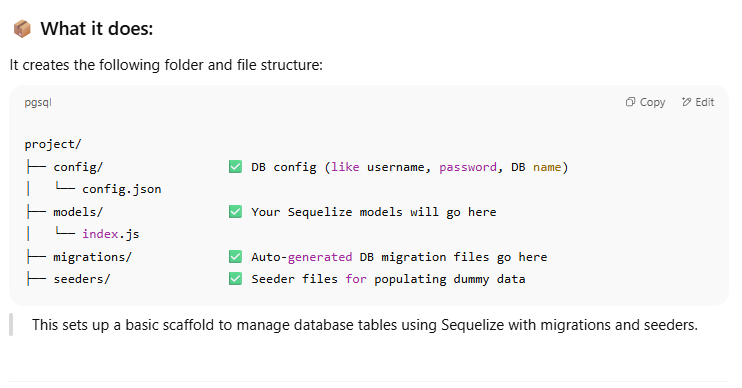
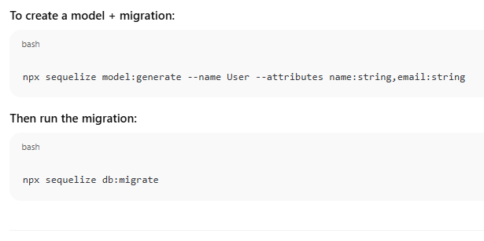
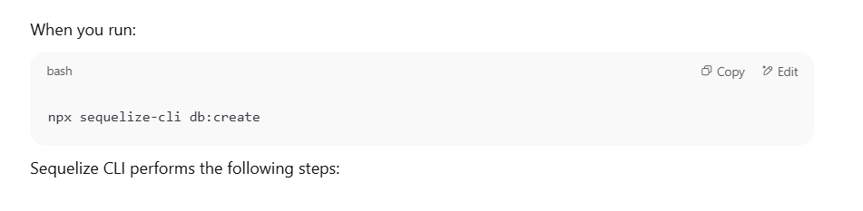
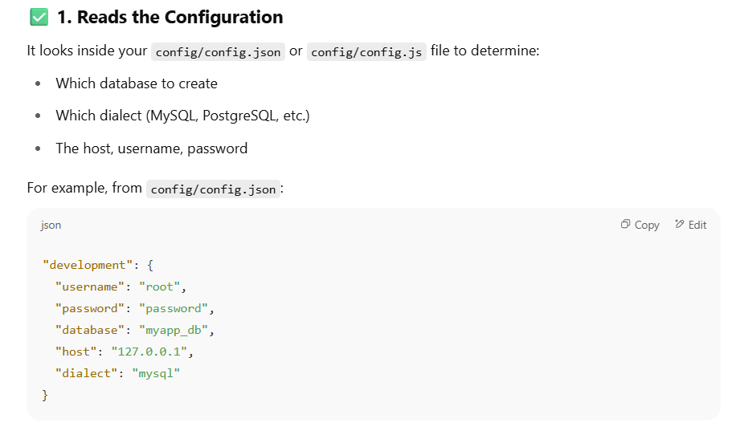

And sabse pehle go in the src folder and then do there
```javascript
npx sequelize init
```

You're using Sequelize CLI to **initialize a project structure** for Sequelize in your current folder.





To create a DB using  Sequelize cli


Chlo ab database ban gaya toh ab tables bana lete hain!


### Explanation:

This command uses **Sequelize CLI** to generate a **model** and its corresponding **migration file** in a Node.js project.

---



### Breakdown:
THERE IS NO SPACE WHEN WE'RE MAKING THE ATTRIBUTES
- `npx`: Runs a package (in this case, `sequelize`) without installing it globally.
    
- `sequelize`: Refers to the Sequelize CLI tool.
    
- `model:generate`: Tells Sequelize to generate a new model which is analogus to tables
    
- `--name Airplane`: Specifies the name of the model to be generated (in this case, `Airplane`).
    
- `--attributes modelNumber:string,capacity:integer`: Specifies the fields/columns of the model:
    
    - `modelNumber`: A string type attribute.
        
    - `capacity`: An integer type attribute.


It created two files as well!
 Models folder mein airplane.js

```javascript
'use strict';

const {

  Model

} = require('sequelize');

module.exports = (sequelize, DataTypes) => {

  class Airplane extends Model {

    /**

     * Helper method for defining associations.

     * This method is not a part of Sequelize lifecycle.

     * The `models/index` file will call this method automatically.

     */

    static associate(models) {

      // define association here

    }

  }

  Airplane.init({

    modelNumber: DataTypes.STRING,

    capacity: DataTypes.INTEGER

  }, {

    sequelize,

    modelName: 'Airplane',

  });

  return Airplane;

};
```

Ye itna code mujhe nahi likhna pada khud likha gaya apne ap!!
Ye fayda hai sequelize cli ka!


I can edit this as well based on my needs!

But in case if we check that the table is present or not ! It won't be !! This command just created two files ! one in models folder other in migrations folder!

- This only **creates two files**:
    
    1. A **model file** (`Airplane.js`) in the `/models` folder.
        
    2. A **migration file** (`xxxx-create-airplane.js`) in the `/migrations` folder.
        

⚠️ It does **NOT create tables in your database** yet.  
It only **prepares** the instructions to create a table

It's same like git add , but we didn't do git commit
### ✅ To Actually Create Tables in the Database

You must **run the migration** using this command:

npx sequelize db:migrate

### What This Command Does:

- Looks for all migration files in your `/migrations` directory.
    
- Executes each migration that **hasn’t been run yet**.
    
- Creates tables in your database according to those migration files.
    
- Records the migration history in a table called `SequelizeMeta`

The Migration folder file looks like this!


If we wanna do some change! This could be a good time!

WHat sequelize tells us that there are two levels of constraints that we can put!


**Javascript level** in models file


**DATABASE LEVEL** in migrations file

In this when that table will be created that table will have that constraints also!


Here maine model number par bd constraint rakha hai but capacity par nahi rakha!


Now creating a migration and applying a migration are two different things!


It applies all the pending migrations!
### How does `npx sequelize db:migrate` know which migrations are **pending**?

Sequelize uses a special table in your database called:

> **`SequelizeMeta`**

---

### ✅ Here's how it works:

1. When you first run:
    
    
    
    `npx sequelize db:migrate`
    
    - Sequelize checks the `/migrations` folder for all migration files.
        
    - It also checks the `SequelizeMeta` table in your database.
        
2. The `SequelizeMeta` table stores the **filenames** of all migration files that have already been executed.
    
3. For each file in `/migrations`, Sequelize:
    
    - Compares it to what's recorded in `SequelizeMeta`.
        
    - If a file **does not exist in `SequelizeMeta`**, Sequelize considers it a **pending migration**.
        
    - It then executes that migration's `up()` method and adds the filename to `SequelizeMeta`.
        

---

### 🧠 Example:

Suppose your `/migrations` folder has:


`20240523-create-airplane.js 20240524-create-airport.js`

And the current `SequelizeMeta` table has:


`| migration                     | |------------------------------| | 20240523-create-airplane.js  |`

Then running:


`npx sequelize db:migrate`

will:

- Skip `20240523-create-airplane.js` (already applied).
    
- Run `20240524-create-airport.js` (not in `SequelizeMeta` yet).
    
- Then add `20240524-create-airport.js` to the `SequelizeMeta` table after successful execution.
    

---

### 🔄 Undoing Migrations

You can also **undo** migrations:


`npx sequelize db:migrate:undo`

This will:

- Roll back the **most recent** migration (i.e., call its `down()` function).
    
- Remove that file name from `SequelizeMeta`.
    

Or to undo all:


`npx sequelize db:migrate:undo:all`

Table chli jaegi but sequleize meta file bachegi!

Generally we try to keep our models/ Table names singular


**Convention in Sequelize** (and in many ORMs) to separate concerns between:

- **Model (singular):** Represents a **single entity** or object in your application (e.g., `User`, `Airplane`).
    
- **Table (plural):** Represents a **collection** of those entities in the database (e.g., `Users`, `Airplanes`).


### Why This Convention?

#### 1. **Clarity & Natural Semantics**

- `Airplane` model → represents **one** airplane.
    
- `Airplanes` table → stores **many** airplanes.
    

This mirrors natural language:

> “One airplane goes into the airplanes table.”

#### . **Code vs Data Separation**

- Models are **code constructs** — used in logic, APIs, and business rules.
    
- Tables are **database constructs** — used to store rows of data.
    

Keeping them clearly distinct (by naming) avoids confusion and improves readability.

Model file mein singular hi hoga

When we do a migration async up is applied and when we undo , Async down function is applied!

So models is more related to js
and Migrations is more related to tables


NOW WHO TALKS TO MODELS?? REPOSITRY LAYER TALKS TO THE MODEL!!
### **What is the Repository Layer?**


**Why do we need the repository layer if models already define the table?**

## 💡 Step 1: What Models Do

### ✨ **Models define the shape of your data.**

Imagine you're building a LEGO airplane. The **model** is the **blueprint** that says:

- What parts are needed (columns)
    
- What type each part is (text, number, etc.)
    
- How the parts fit together (relations)


## Step 2: So What Is Missing?

The model defines the **structure**, but **not the actions**.

Here’s the problem:

If you want to create a new airplane or get one from the database, you still need to write:


## 🧰 Step 3: Repository = Action Manager

### A Repository is the **"how to use the model"** part.

It’s a layer between:

- 🔢 **Model** (knows the data shape)
    
- 🎮 **Service or Controller** (knows what user wants)
    

The **repository** handles:

- Creating
    
- Finding
    
- Deleting
    
- Updating


## 📦 Think of It Like This:

| Part of App    | What it does                    | Real-Life Analogy                              |
| -------------- | ------------------------------- | ---------------------------------------------- |
| **Model**      | Defines the table (structure)   | Blueprint for building a house                 |
| **Repository** | Talks to the DB using the model | Builder who reads the blueprint and constructs |
| **Service**    | Contains business rules         | Project manager telling builder what to do     |
| **Controller** | Responds to the user            | Receptionist who talks to the customer         |
## 🧁 So Why Do We Need the Repository?

### 🔁 Reusability

You don’t want to write the same `.create()` or `.findByPk()` again and again.

### 🧹 Clean Code

Controller and service don’t need to worry about database code.

### 🧪 Easy Testing

You can test your repository functions without starting your whole app.

## ✅ Final Answer (Simple)

> **Models = what the data looks like.**  
> **Repositories = how we interact with that data.**  
> We use the repository layer so our code is clean, reusable, and easier to manage.


## What Are Operators in Sequelize?

Operators in Sequelize help you build **more advanced WHERE conditions** — like:

- Find users **older than 18**
    
- Find flights with **price between 500 and 1000**
    
- Get all planes with **model NOT A320**
    

They're basically **commands for comparing/filtering** your data


## 🔥 Most Common Operators

|Operator|Meaning|Example|SQL Equivalent|
|---|---|---|---|
|`Op.eq`|Equal|`{ id: { [Op.eq]: 1 } }`|`id = 1`|
|`Op.ne`|Not equal|`{ id: { [Op.ne]: 1 } }`|`id != 1`|
|`Op.gt`|Greater than|`{ age: { [Op.gt]: 18 } }`|`age > 18`|
|`Op.gte`|Greater than or equal|`{ age: { [Op.gte]: 18 } }`|`age >= 18`|
|`Op.lt`|Less than|`{ age: { [Op.lt]: 18 } }`|`age < 18`|
|`Op.lte`|Less than or equal|`{ age: { [Op.lte]: 18 } }`|`age <= 18`|
|`Op.in`|In list|`{ id: { [Op.in]: [1,2,3] } }`|`id IN (1,2,3)`|
|`Op.notIn`|Not in list|`{ id: { [Op.notIn]: [1,2] } }`|`id NOT IN (1,2)`|
|`Op.like`|Pattern match|`{ name: { [Op.like]: '%raj%' } }`|`name LIKE '%raj%'`|
|`Op.between`|Between two values|`{ price: { [Op.between]: [500, 1000] } }`|`price BETWEEN 500 AND 1000`|

const { Op } = require("sequelize");
Post.findAll({
  where: {
    [Op.and]: [{ a: 5 }, { b: 6 }],            // (a = 5) AND (b = 6)
    [Op.or]: [{ a: 5 }, { b: 6 }],             // (a = 5) OR (b = 6)
    someAttribute: {
      // Basics
      [Op.eq]: 3,                              // = 3
      [Op.ne]: 20,                             // != 20
      [Op.is]: null,                           // IS NULL
      [Op.not]: true,                          // IS NOT TRUE
      [Op.or]: [5, 6],                         // (someAttribute = 5) OR (someAttribute = 6)

      // Using dialect specific column identifiers (PG in the following example):
      [Op.col]: 'user.organization_id',        // = "user"."organization_id"

      // Number comparisons
      [Op.gt]: 6,                              // > 6
      [Op.gte]: 6,                             // >= 6
      [Op.lt]: 10,                             // < 10
      [Op.lte]: 10,                            // <= 10
      [Op.between]: [6, 10],                   // BETWEEN 6 AND 10
      [Op.notBetween]: [11, 15],               // NOT BETWEEN 11 AND 15

      // Other operators

      [Op.all]: sequelize.literal('SELECT 1'), // > ALL (SELECT 1)

      [Op.in]: [1, 2],                         // IN [1, 2]
      [Op.notIn]: [1, 2],                      // NOT IN [1, 2]

      [Op.like]: '%hat',                       // LIKE '%hat'
      [Op.notLike]: '%hat',                    // NOT LIKE '%hat'
      [Op.startsWith]: 'hat',                  // LIKE 'hat%'
      [Op.endsWith]: 'hat',                    // LIKE '%hat'
      [Op.substring]: 'hat',                   // LIKE '%hat%'
      [Op.iLike]: '%hat',                      // ILIKE '%hat' (case insensitive) (PG only)
      [Op.notILike]: '%hat',                   // NOT ILIKE '%hat'  (PG only)
      [Op.regexp]: '^[h|a|t]',                 // REGEXP/~ '^[h|a|t]' (MySQL/PG only)
      [Op.notRegexp]: '^[h|a|t]',              // NOT REGEXP/!~ '^[h|a|t]' (MySQL/PG only)
      [Op.iRegexp]: '^[h|a|t]',                // ~* '^[h|a|t]' (PG only)
      [Op.notIRegexp]: '^[h|a|t]',             // !~* '^[h|a|t]' (PG only)

      [Op.any]: [2, 3],                        // ANY (ARRAY[2, 3]::INTEGER[]) (PG only)
      [Op.match]: Sequelize.fn('to_tsquery', 'fat & rat') // match text search for strings 'fat' and 'rat' (PG only)

      // In Postgres, Op.like/Op.iLike/Op.notLike can be combined to Op.any:
      [Op.like]: { [Op.any]: ['cat', 'hat'] }  // LIKE ANY (ARRAY['cat', 'hat'])

      // There are more postgres-only range operators, see below
    }
  }
});


So Anything related to queries will go in the repositry folder!


### 1. **`this.model.create(data)`**

This is a method provided by **Sequelize** (an ORM that lets you interact with a SQL database using JavaScript objects).

- `this.model` refers to a **Sequelize model** that was passed into the repository. For example, it could be a `User` model or a `Flight` model.
    
- `.create(data)` is a Sequelize function that:
    
    - **Creates a new row** in the database
        
    - **Uses the data** provided in the `data` object
        
    - **Automatically adds timestamps** (like createdAt, updatedAt) if your model has them
        

> For example, if `data` is:

js

CopyEdit

`{ name: 'Sourav', age: 25 }`

Then this line will create a new row in the database like:

|id|name|age|createdAt|updatedAt|
|---|---|---|---|---|
|1|Sourav|25|2025-05-27 12:34:00|2025-05-27 12:34:00|

---

### 🕒 2. **`await`**

- Database operations take time.
    
- `await` pauses this line until the data is actually written to the database.
    
- Without `await`, the program would continue running without waiting — which would break things.
    

---

### 🧠 3. **`const response =`**

This saves the result of the `.create(data)` call into the `response` variable.

- `response` will contain the newly created row **as a JavaScript object**, including things like `id`, `createdAt`, and other model properties.


CONTROLLER PASS ON THE CALL TO SERVICE! AND SERVICES USE REPOSITRIES TO INTERACT WITH THE DATABASE!!!


-----
How to use Service layer code--

## 💼 Scenario: Create an Airplane

We want a function in the service layer that:

- Receives data like `{ modelNumber: "Boeing 747", capacity: 400 }`
    
- Validates or processes it (you can add logic here later)
    
- Passes it to the repository to store in the DB
    
- Returns the created record
    

---

### ✅ Service Layer Code (📁 `services/airplane-service.js`)

```javascript
const { AirplaneRepository } = require('../repositories'); // Step 1: Import repo

// Airplane repositry ne ek class export ki thi uska hi object bana rahe hain hum!
// Step 2: Create a repo object to use its methods
const airplaneRepository = new AirplaneRepository();

// Step 3: Create service function
async function createAirplane(data) {
    try {
        // Call repository to save the airplane
        const airplane = await airplaneRepository.create(data);

        // You could add business logic here (e.g. check capacity, etc)

        return airplane;
    } catch (error) {
        // Handle or log error if needed
        console.error("Something went wrong in the service layer");
        throw error;
    }
}

// Step 4: Export function so it can be used in controller
module.exports = {
    createAirplane
};

```
---

## 🧠 How this service is used:

### 🧭 Controller Layer (Just for context)

```javascript
const { createAirplane } = require('../services/airplane-service');

async function handleCreateAirplane(req, res) {
    try {
        const airplane = await createAirplane(req.body);
        res.status(201).json({
            success: true,
            data: airplane,
        });
    } catch (error) {
        res.status(500).json({
            success: false,
            message: 'Something went wrong!',
        });
    }
}
```
---

## 🛠️ Repository Layer (Example structure)

Your `AirplaneRepository` might extend a generic CRUD class like:


```javascript
class AirplaneRepository extends CrudRepository {
    constructor() {
        super(Airplane); // Airplane is the model (Sequelize)
    }
}
```
---

## ✅ Summary:

|Layer|Role|
|---|---|
|**Model**|Table definition (`Airplane`)|
|**Repository**|Direct DB access using Sequelize|
|**Service**|Logic and rules for creating airplane|

This Lecture is pretty fuckin cool
### **What is `express.json()`?**

`express.json()` is a **built-in middleware function** in Express.

It tells your app:

> "Hey! When a request comes in with JSON data (usually in the body), please **parse** it and give it to me as a JavaScript object.

### Why `app.use(express.json())`?

Because when you send data from the frontend (like a POST request with `{ name: "Sourav" }`), Express **by default doesn't know how to read that body**.

So if you don’t use `express.json()`, then:


**es, you can change (or transform) the response object at any layer** — especially in the **service layer**, which is the best place to apply **business logic or transformation**.

---

### 🧠 WHY would you change the response?

Because sometimes:

- You want to **hide some fields** (e.g., `updatedAt`)
    
- You want to **rename fields** (e.g., from `modelNumber` → `model`)
    
- You want to **add computed values** (e.g., `isLargeAirplane: true`)
    
- Or apply some kind of **business logic** before sending it up
    

---

### 🔧 WHERE to change it?

| Layer          | Best For Changing Data? | Reason                                                 |
| -------------- | ----------------------- | ------------------------------------------------------ |
| **Repository** | ❌ Not ideal             | Should stick to pure DB operations                     |
| **Service**    | ✅ Yes!                  | Ideal for business rules, logic, transformation        |
| **Controller** | ✅ Sometimes             | For formatting responses or adding HTTP-specific logic |
### Summary

Yes, **you can and often should modify the response** in the service layer if:

- You want to apply logic
    
- You need to shape the data for the client
    
- You want to hide internal DB fields