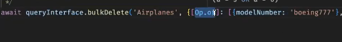

So if we don't send the capacity then The airplane is going to be created anyway but if we don't send the model number as well then an empty string will be stored in the table in place of the model number when i'm made a default value of the model number as the empty string


We don't want this!

so we won't the default value here and then error 500 internal server will come like this


so technically our server is working well but the issue is on the client side sending the wrong input but still it's showing internal sever error why??


Because of the control flow of the whole request code fatta in the repository layer since not in the controller or anywhere else so we should add a middleware to validate the incoming request!!


```javascript
const {StatusCodes} = require('http-status-codes')

function validateCreateRequest(req,res,next){
    if(!req.body.modelNumber){
        return res
                 .status(StatusCodes.BAD_REQUEST)
                 .json({
                success : false,
                message : 'Something went wrong while creating an aeroplane',
                data : {},
                error : {explanation : "Model number not found in the incoming request in the correct form"}
                 })
    }
    next();
}

module.exports = {
    validateCreateRequest
}

```


In JavaScript, the `Error` class is a built-in object used to represent runtime errors. It forms the foundation for all error types in JavaScript and can be extended to create custom error types.


## 🧨 JavaScript Error Handling 

### 🔹 1. What is the `Error` class in JavaScript?

- A built-in class to represent runtime errors.
    
- Helps throw, catch, and handle exceptions in a standard way.


### 3. Use Case Example:

```javascript
function divide(a, b) {
  if (b === 0) {
    throw new Error("Cannot divide by zero");
  }
  return a / b;
}

try {
  console.log(divide(10, 0));
} catch (err) {
  console.error("Caught error:", err.message);
}

```


**Can we pass other things as well?** 


We can make different classes of errors for client or server side errors!!

Now assume main age se sab kuch sahi bhejta huon and then kuch server side hoga in that case what will happen is that ki kuch server side error ana chahiye na like example liya ki maine na crud repository mein create ki creat likh diya ab toh server ana chahiye right!!


We need consistent errors right!! Think of it as an api now what will happen agar aese hi errors de rahi hai mere api as response to the request!!


## Why Create a Custom Error Class?

- Attach custom fields like `statusCode`, `explanation`, `metadata`, etc.
    
- Improve clarity and debugging in APIs
    
- Integrate easily with logging systems like `winston` or `pino`
    
- Avoid repeating boilerplate logic


You're creating a custom error class called `AppError` that extends JavaScript's built-in `Error` class.

- `class AppError extends Error` means you're inheriting everything from the built-in `Error` object.
    
- The `constructor(message, statusCode)` is your own custom constructor where you can define additional properties.
    
- `super(message)` calls the parent `Error` constructor to set the `message` and also initialize the `stack` trace.
    
- `this.statusCode = statusCode` adds a custom HTTP status code to the error object (like 404 or 500).
    
- `this.explanation = message` is an optional custom field that also stores the error message (you can rename this to anything you prefer, like `details` or `info`).
    

This pattern makes it easier to throw and catch structured errors in a backend application — especially useful in Express APIs where you want consistent error objects with status codes and explanations.


## 📝 Logging `Error.stack`

When an error is thrown, the `.stack` property gives the **stack trace** (i.e., where the error occurred in the code), which is super useful for debugging and logging.


### 🔍 What is `Error.captureStackTrace`?

It’s a **Node.js-specific method** that allows you to **customize or capture** the `.stack` property of an error. It helps ensure the **stack trace starts from where the actual error happened**, not from the custom class constructor.


### Common Error Subclasses

JavaScript has several built-in subclasses of `Error`:

| Name             | When it's used                             |
| ---------------- | ------------------------------------------ |
| `SyntaxError`    | Syntax is incorrect                        |
| `ReferenceError` | Reference to an undefined variable         |
| `TypeError`      | A value is not of the expected type        |
| `RangeError`     | A number is outside an allowable range     |
| `EvalError`      | An error related to the `eval()` function  |
| `URIError`       | Malformed URI passed to `decodeURI()` etc. |
| `AggregateError` | Represents multiple errors at once         |


if i send the  random number in the place of capacity!


Server blew up!

Now what can i do??
   name: 'SequelizeDatabaseError'

if we set some validation error then we we'll get this

```javascript
  capacity: {
        type: Sequelize.INTEGER,
        defaultValue : 0,
        validate : {
        max : 1000
      }
```

I did this in the models and the migration file so this is a database side check so we won't we able to do this check in the controller , this will happen in the services!!!

Now if we send capacity like 3000 validation error will come like this 
```javascript
errors: [
    ValidationErrorItem {
      message: 'Validation max on capacity failed',
      type: 'Validation error',
      path: 'capacity',
      value: '3000',
      origin: 'FUNCTION',
      instance: [Airplane],
      validatorKey: 'max',
      validatorName: 'max',
      validatorArgs: [Array],
      original: [Error]
    }
  ]
```


## 🔍 What the `errors` array means

The `errors` array holds **individual error objects**, **one for each validation rule that failed**.


Each object tells you:

| Key                              | What it Means                                                    |
| -------------------------------- | ---------------------------------------------------------------- |
| `message`                        | Human-readable description of the error                          |
| `type`                           | Always `"Validation error"` for Sequelize validation             |
| `path`                           | The field name (`capacity`)                                      |
| `value`                          | The actual value you passed (`1200`)                             |
| `validatorKey` / `validatorName` | The specific rule that failed (`max`)                            |
| `validatorArgs`                  | The argument used in validation (`200`)                          |
| `instance`                       | The model instance being validated                               |
| `origin`                         | `"FUNCTION"` indicates a custom validator or built-in validation |

### 🧠 So Why Is It an Array?

Because Sequelize allows **multiple validators** on the same or different fields, and you may violate more than one at a time.


The `errors` array is Sequelize's way of listing **all validation failures at once**, so you don’t need to catch one at a time — you can handle everything in a single response.


You're looping through `error.errors`, which is an array of validation error objects (as we discussed earlier), and collecting their `message` fields into an `explanation` array.


Even in production level code nobody writes raw string in the code!!!

**In production-level code, raw strings (especially error messages, UI text, or user-facing content) are generally avoided** for several reasons.

### 2. **Maintainability**

- When error strings are scattered in code, **they’re hard to maintain**.
    
- Centralizing them in a config file or translation file means you update the message in **one place**.
    

---

### 🧪 3. **Testability**

When you use string keys instead of raw text, **unit tests can validate** correct error keys are returned without worrying about wording changes.

---

### 🛡️ 4. **Security and Consistency**

- For example, production errors should not leak internal details like database constraints.
    
- Using standard keys and external messages ensures **consistent tone and safety**.
    

---

### 🧰 How it’s handled in production:

1. **Use a library like `i18next`, `i18n`, or `polyglot.js`** for Node.js.
    
2. Store all strings (errors, UI messages) in translation files.
    
3. Reference by keys in code.


Kuch chizen we do in models as well


### ✅ **Purpose of the `seeders` Folder**

The `seeders` folder contains **database seed files** — scripts that insert predefined data into your database. This is called **seeding**.

### **Use Cases of Seeders**

1. **Populate Database with Sample Data**
    
    - Useful for development and testing.
        
    - Example: Create dummy users, products, blog posts, etc.
        
2. **Initial Setup Data**
    
    - Insert required static data like roles (`admin`, `user`), categories, countries, etc.
        
3. **Demo or Testing**
    
    - Load consistent data before running automated tests or showing demos.
        
4. **Resetting Data**
    
    - In development, you can wipe the DB and re-run seeders to get a clean state.

### **How It Fits in MVC**

In MVC:

- **Model** defines the structure (`User`, `Post`, etc.).
    
- **Seeder** uses the **Model** to create actual records in the DB.
    

**Folder structure example (Node.js + Sequelize):**


The **`seeders/` folder** in a Sequelize-based Node.js project plays a crucial role in setting up **initial or sample data** for your database. It’s used with the Sequelize CLI to populate tables with data automatically.

### 1. **Insert Default Data**

For example:

- Predefined airplane models
    
- Default airports (Mumbai, Delhi, etc.)
    
- Sample flight schedules
    
- Roles or permissions (admin, user)


### ✅ 3. **CI/CD / Demo Deployments**

In production or staging, you may want to deploy a system **with some default setup** (like admin users, airline companies, etc.). Seeders help automate that.

---

### ✅ 4. **Rollback Capability**

Each seeder file has both:

- `up()` – to insert data
    
- `down()` – to remove that data
    

This makes it easy to undo:


`npx sequelize-cli db:seed:undo:all`


We can also seed individual files and Seed all files!!
And also undo all seed files!!



