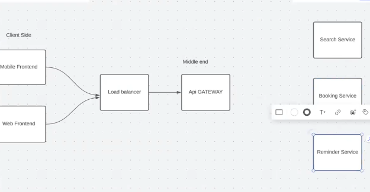
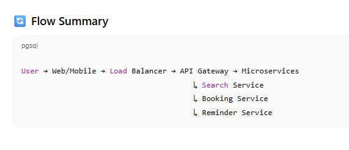
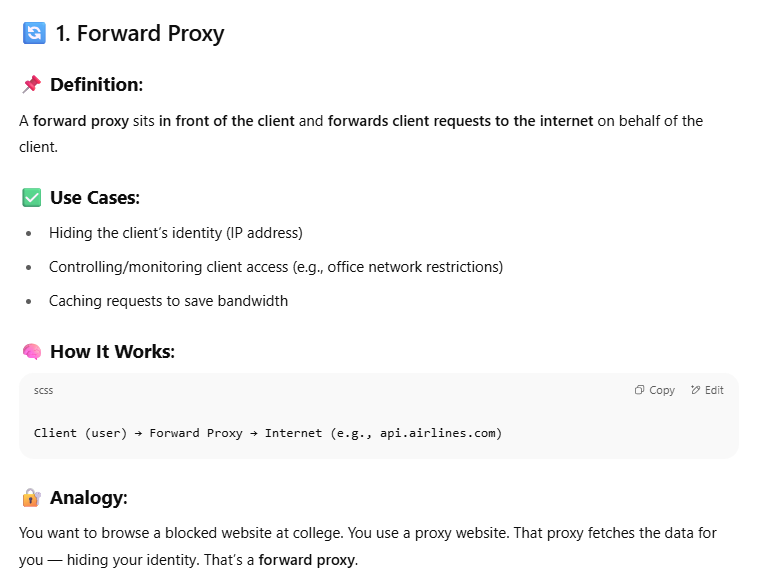
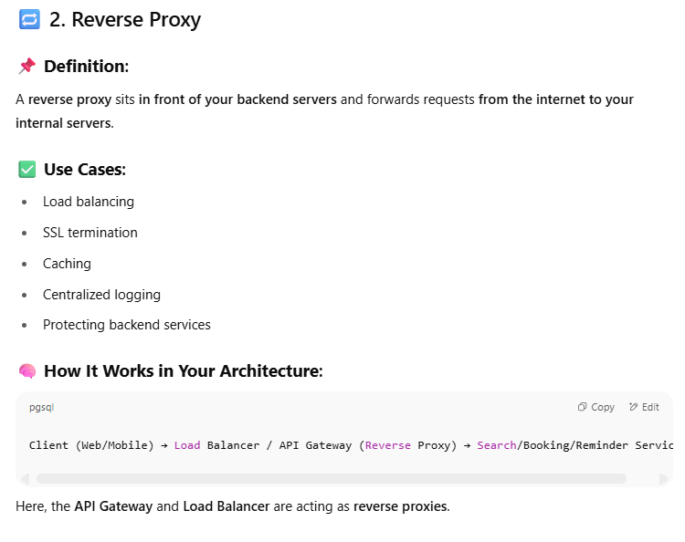
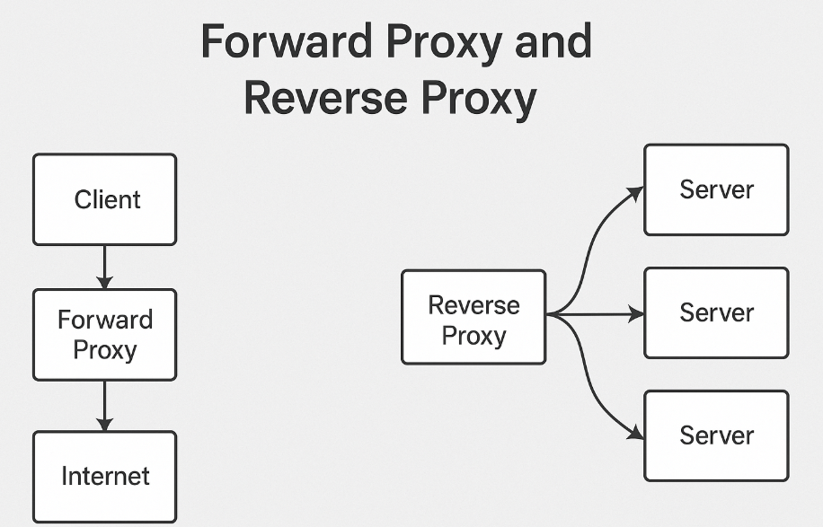
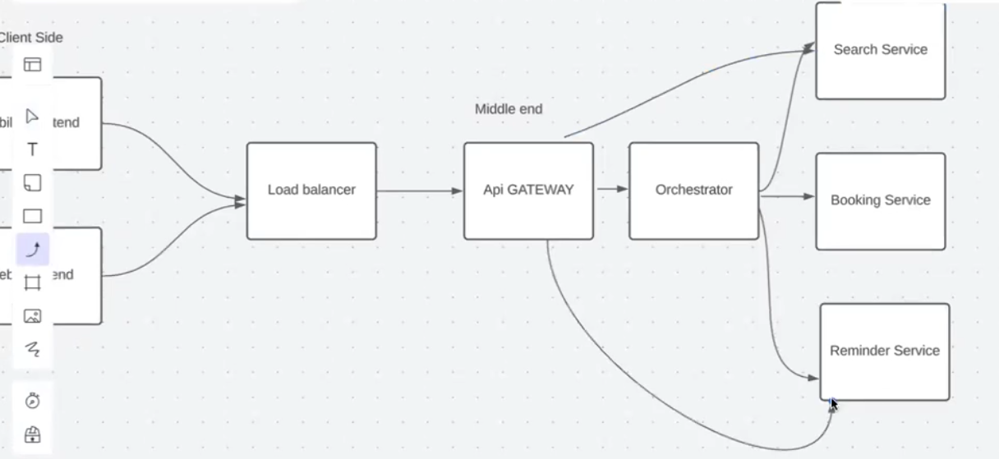
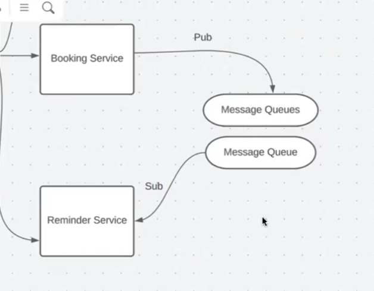
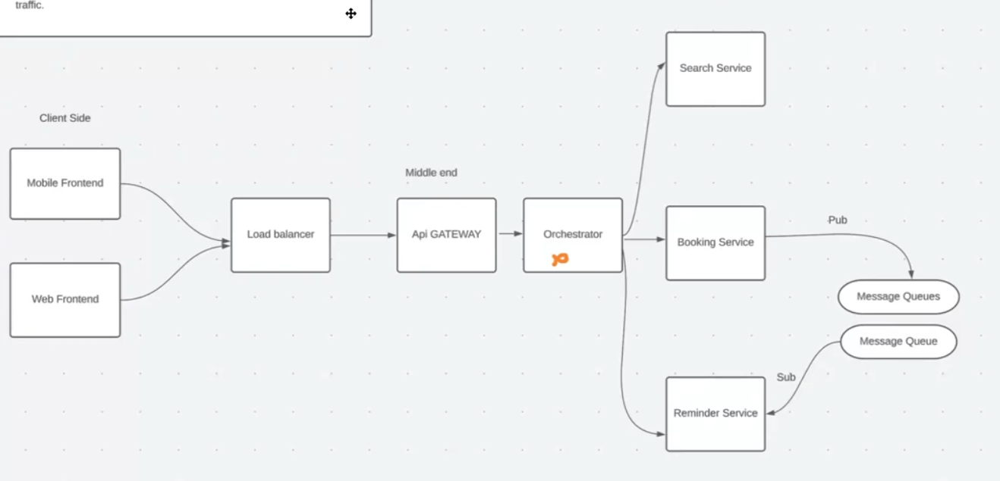

In System Design Interviews We need to have some Assumptions! And then we move on!!!!

### **Non-Functional Requirements Explained**

These don’t define specific features but rather **how the system should behave** under different conditions.

---

#### 1. **More Flight Searches than Bookings**

> **Implication**: Your **search APIs** (e.g., for flight listings, filtering) will be hit way more often than booking APIs.

- Optimize for **read-heavy traffic**.
    
- Use **caching** (e.g., Redis) for flight listings.
    
- Consider adding **rate limiting** to avoid abuse.
    

---

#### 2. **System Needs to Be Reliable for Booking**

> **Implication**: Bookings are critical operations and **must not fail**.

- Use **transactions** to ensure atomicity.
    
- Avoid race conditions (e.g., when booking the last seat).
    
- Add **retry mechanisms** or **message queues** for booking tasks.
    

---

#### 3. **1,00,000 Total Users (Expected)**

> **Implication**: Moderate user base — design your auth, user DB, and scaling policies accordingly.

- Use **indexed columns** for login/auth queries.
    
- Apply **JWT/token-based authentication** to offload DB.
    

---

#### 4. **1,00,000 Bookings per Quarter**

> ~1,100 bookings/day on average. Peak days may reach **100+ bookings/day**.

- Booking system must handle **burst traffic**.
    
- Monitor **database write performance** and use **batch inserts**, if needed.
    

---

#### 5. **Price Shouldn't Change During Payment**

> **Implication**: The price shown during checkout must remain constant until payment completes.

- Lock flight/seat data during payment flow (via DB-level lock or **cache-based token**).
    
- Use **temporary reservation TTL** (like a 10-minute hold).
    
- Don't recalculate price after initiating payment.
    

---

#### 6. **System Should Auto-Scale for 3x Traffic**

> You may need to scale from 100 → 300+ requests/sec.

- Deploy using **Docker + Kubernetes** or similar.
    
- Enable **horizontal pod autoscaling** (HPA).
    
- Monitor traffic with Prometheus/Grafana or DataDog.

**high-level architecture diagram**

#### 📱 **Client Side**

- **Mobile Frontend**
    
- **Web Frontend**
    

These are your **user interfaces** where customers:

- Search for flights
    
- View availability
    
- Book tickets
    
- Set reminders
    

---

#### ⚙️ **Middle End**

- **Load Balancer**  
    Routes incoming traffic (API calls) from both frontends to the backend services in a balanced way to:
    
    - Handle traffic spikes
        
    - Prevent server overload
        
    - Ensure high availability
        
- **API Gateway**  
    The central entry point for all frontend requests. It:
    
    - Authenticates and authorizes requests
        
    - Routes them to appropriate microservices
        
    - Can apply **rate limiting**, **caching**, and **logging**

#### 🧠 **Backend Microservices**

1. **Search Service**  
    Handles:
    
    - Flight listings
        
    - Filtering (date, location, airline)
        
    - Sorting by price/time
        
    - Optimized for **read-heavy** traffic
        
2. **Booking Service**  
    Handles:
    
    - Seat reservations
        
    - Payment processing
        
    - Order confirmation
        
    - High **write-reliability**
        
    - Needs **atomicity**, **idempotency**, **consistency**
        
3. **Reminder Service**  
    Handles:
    
    - Sending emails/SMS/notifications for upcoming flights
        
    - Built using **cron jobs** or **message queues**
        
    - Can use **BullMQ / Agenda / Celery** (based on your stack)

### In My Project:

- **Reverse Proxy**: Your **Load Balancer** and **API Gateway** are acting as **reverse proxies**, distributing and managing traffic to your microservices.
    
- **Forward Proxy**: Not directly used, unless you're restricting **internal service access to the internet** (e.g., via corporate proxy or VPN). Rare in simple backend setups.

In Big Applications!!

This diagram represents a **Publish-Subscribe (Pub/Sub) pattern** using **message queues** between microservices — a common architecture for decoupling services in scalable systems like your airplane project.

### Key Components:

---

### 🔹 **Booking Service (Publisher)**

- It **publishes events/messages** (like “booking confirmed”, “payment successful”, etc.) to a message queue.
    
- The service does not care who consumes the message — it just pushes it.
    

---

### 🔹 **Message Queues**

- These act as intermediaries or buffers that **store messages** until they’re processed by the subscribers.
    
- You could use systems like **RabbitMQ**, **Apache Kafka**, or **Redis Pub/Sub** here.
    
- They allow **asynchronous communication**: producer and consumer don’t need to be active at the same time.
    

---

### 🔹 **Reminder Service (Subscriber)**

- It **subscribes** to the message queue and reacts when relevant messages arrive.
    
- For example, it might listen for a “booking confirmed” event and then send a reminder email or notification.
    

---

### 🧠 Why Use This Pattern?

1. **Loose Coupling**: Booking and Reminder services don’t need to know about each other directly.
    
2. **Scalability**: You can scale each service independently.
    
3. **Reliability**: If Reminder Service is down, the queue can hold messages until it’s back up.
    
4. **Flexibility**: You can add more subscribers later (e.g., Analytics Service, Notification Service).

