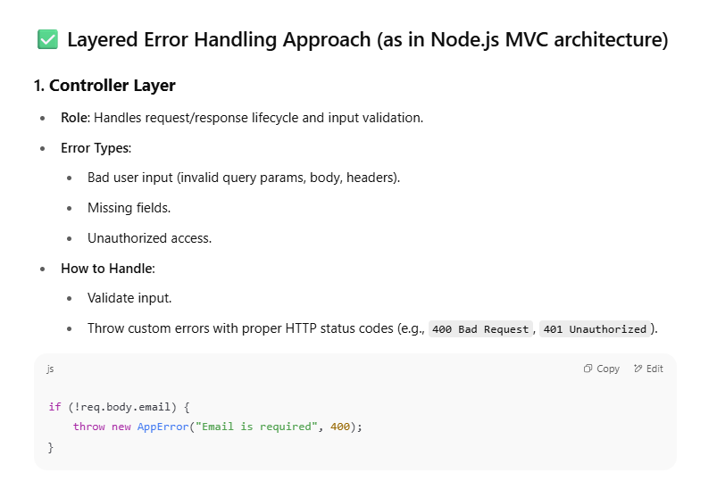
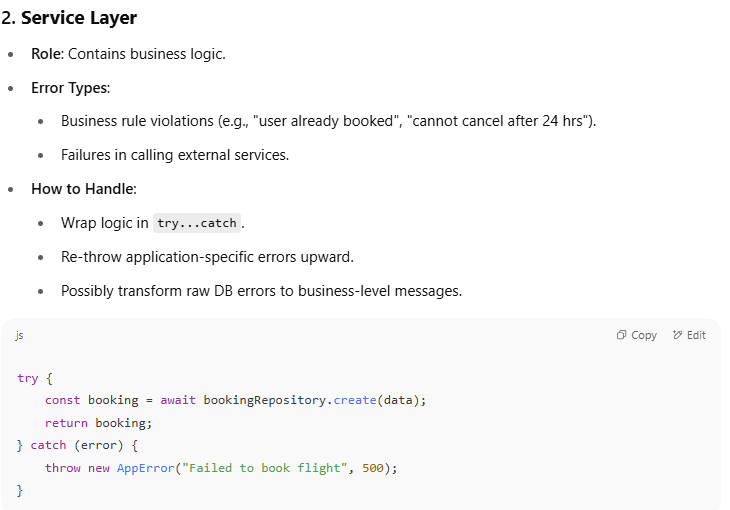
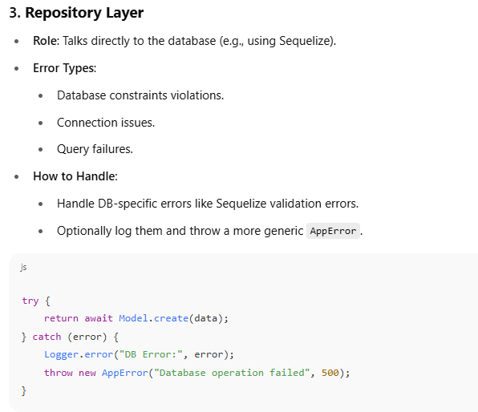
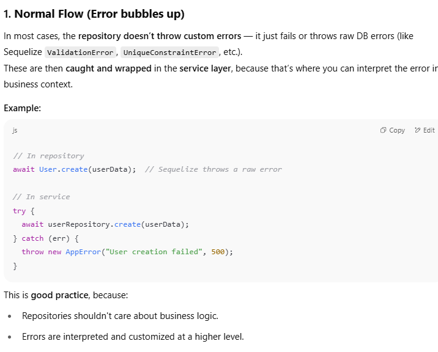
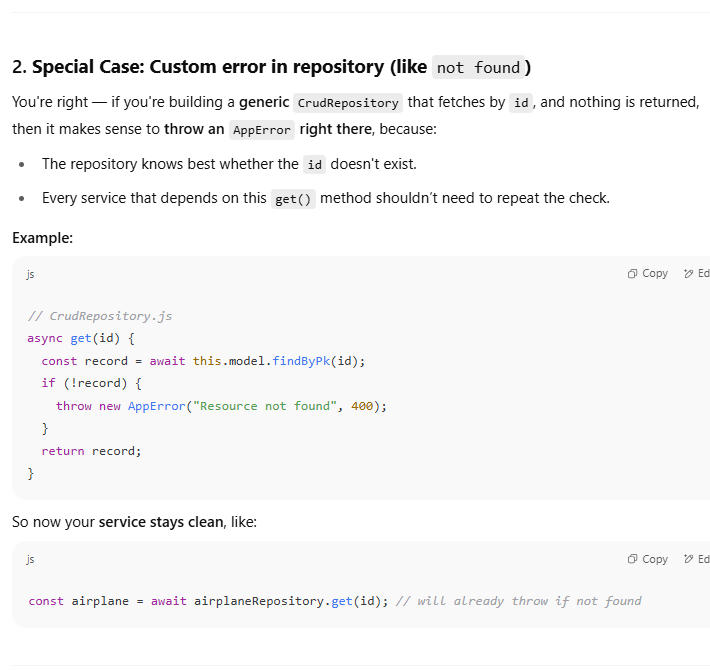
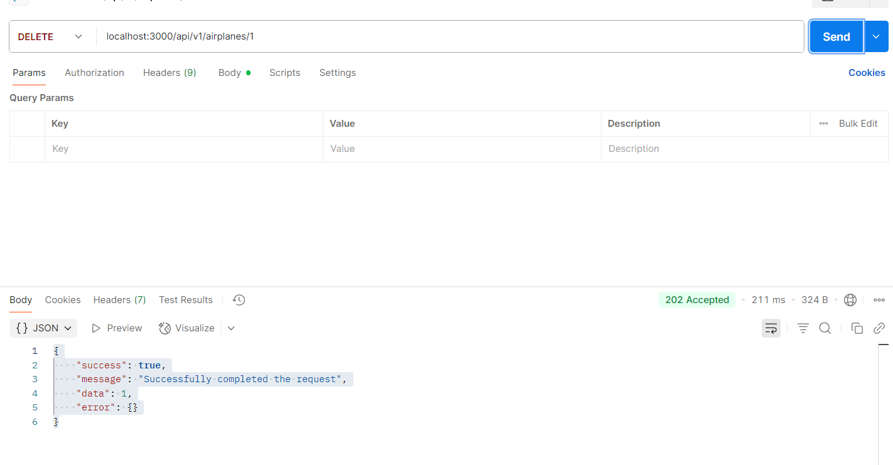
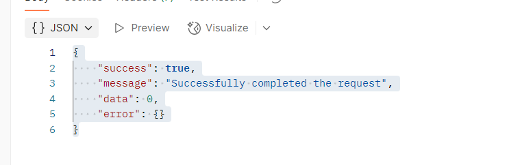
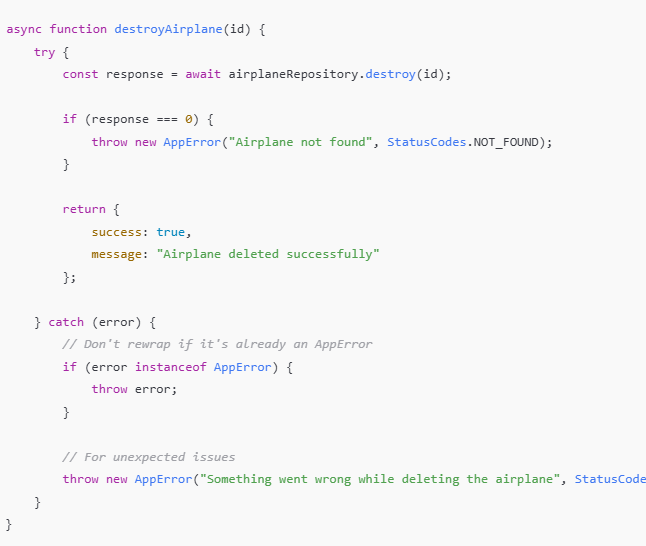
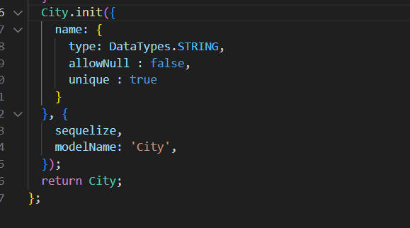

FLIGHT SEARCH SERVICE PAR AB HUM KARENGE!!

FIRST THINK OF DESIGN OF THE DATABASE!!

FLIGHT:
DELHI -> BOMBAY!

PLANES CAN BE USED IN MULTIPLE FLIGHTS!!
AN AIRPLANE CAN BELONG TO MULTIPLE FLIGHTS!

WE NEED DEPARTURE CITY! ARRIVAL CITY!
ARRIVAL TIME AND DEPARTURE TIME

PRICE 
BOARDING GATE!
TOTAL NUMBER OF SEATS!

IN ONE CITY YOU CAN HAVE MULTILPE AIRPORTS! SO DEPARTURE AND ARRIVAL AIRPORTS WOULD BE A BETTER OPTION


REST CONVENTIONS MEIN PATH PARAM LENA HI PADEGAA!!

ERROR 

```javascript
async function getAirplane(id) {
    try{
        const airplane = await airplaneRepository.get(id);
        if(!airplane){
            throw new AppError('Airplane does not exist',StatusCodes.NOT_FOUND )  // jaise hi try block se error phanka we go to catch block but jo error phenka us
                                                                                     // koi prorperties pehel hai hi na so check kiya instance ka
        }
        return airplane;
    }catch(error){
        if (error instanceof AppError) {
            throw error;
        }
       throw new AppError ("Cannot find the Plane",StatusCodes.BAD_REQUEST);
    }  
}

```











## ✅ What `.destroy()` returns:

Sequelize’s `.destroy()` **does not return the deleted record**.

Instead, it returns a **number** indicating **how many rows were deleted**.


But if we try to delete it again then this comes - the data property got changed and is par hi hum validation rakenge!


BETTER WAY TO WRITE CODE 


When a resource (like an airplane) is **not found while deleting**, you should:

---

### ✅ ❗️Throw the error in the **Service Layer**, **not** the Repository.

---

## ✅ Why the Service Layer?

The **repository** (or CRUD repo) is meant to do **low-level DB operations only** — no logic, no HTTP knowledge, no business rules.

Let the **Service Layer** handle:

- Business rules
    
- Response codes like 404
    
- Validations
    
- Error decisions


- Repository returns raw data (`0` or `1`) → Service decides what to do with it.


## ✅ Where should the "airplane exists" check happen?

### ✳️ **Short Answer**:

➡️ You should do **existence checks in the Service Layer**, **not in middleware**.

---

## 🧠 Why not Middleware?

Middleware in Express is meant for **cross-cutting concerns** like:

|Middleware is for…|Examples|
|---|---|
|Authentication|Check if user is logged in|
|Authorization|Check user roles or permissions|
|Logging|Winston/Morgan logging|
|Rate limiting|Protecting APIs|
|Request parsing|JSON parsing, etc.|

📛 But:

- Middleware **should not query the database** for specific business logic (like checking if an airplane exists).
    
- Doing DB calls in middleware breaks separation of concerns.
    

---

## ✅ Why Service Layer is Best:

- It has access to the repository.
    
- It understands the business logic: “If this airplane doesn’t exist → throw 404.”
    
- It keeps controller thin and clean.
    
- It allows you to **re-use logic** (say, you need to check if airplane exists before update/delete/view — you can call the same service method everywhere).


WRAPPINH IN CURLY BRACES HAPPENS WHEN THERE IS A CHANCE WE MIGHT RETURN MULTIPLE THINGS!

aur jo cred repo this.model.create() hai na this expects a object passes in it as described in the model!!!!
Toh vahan jo key hai wohi bhejni hai humein bhi !!!

Aur service layer mein jo repositry ki class import ki uske instance par service functions define krne hai!!!



City Model mein maine name unique bnaya tha! Ab jabh vohi name ka object fir se dalunga!
Quotes Consistent hone chahiye single ab se!!

-------------------------------------------------------------------------------------------------

### ✅ Entities Identified:

1. **Airplane**
    
2. **City**
    
3. **Airport**
    
4. **Flight**
    

---

### ✈️ Suggested Database Tables & Relationships:

#### 1. `airplane`

|Field|Type|Description|
|---|---|---|
|`id`|UUID / INT|Primary key|
|`model`|TEXT|Optional: airplane model info|
|`total_seats`|INTEGER|Number of seats in airplane|
|`airline`|TEXT|Airline name or code|

---

#### 2. `city`

|Field|Type|Description|
|---|---|---|
|`id`|UUID / INT|Primary key|
|`name`|TEXT|City name|

---

#### 3. `airport`

|Field|Type|Description|
|---|---|---|
|`id`|UUID / INT|Primary key|
|`name`|TEXT|Airport name|
|`code`|TEXT|Airport IATA/ICAO code (e.g., DEL)|
|`city_id`|UUID / INT|Foreign key → `city(id)`|

---

#### 4. `flight`

|Field|Type|Description|
|---|---|---|
|`id`|UUID / INT|Primary key|
|`airplane_id`|UUID / INT|Foreign key → `airplane(id)`|
|`departure_airport_id`|UUID / INT|Foreign key → `airport(id)`|
|`arrival_airport_id`|UUID / INT|Foreign key → `airport(id)`|
|`departure_time`|TIMESTAMP|Flight departure time|
|`arrival_time`|TIMESTAMP|Flight arrival time|
|`price`|DECIMAL|Price of flight|
|`boarding_gate`|TEXT|Optional: Boarding gate number|

---

### 🧠 Notes:

- Since an **airplane can belong to multiple flights**, the relationship is **one-to-many**: `airplane` → `flight`.
    
- Similarly, an **airport belongs to a city**, but **a city can have multiple airports**: `city` → `airport`.
    
- You have rightly modeled **departure and arrival as airport IDs**, not city names — this is more accurate and scalable.
    

---

### 🔁 Relationships Summary:

- `city` ⇨ `airport`: One-to-many
    
- `airplane` ⇨ `flight`: One-to-many
    
- `airport` ⇨ `flight` (departure/arrival): Many-to-one (used twice per flight)


