NOW HERE WE'LL TALK ABOUT AIRPORT AS A RESOURCE HERE!!
Pehle airport model generate karlo!!! 


Ye command src mein hi chlegi!!!


JAVASCRIPT CONSTRAINTS!!


NOW DB CONSTRAINTS!!


BUT ABHI KUCH HUA NAHI HAI!!
In Cities table/ City Model the primary key is the id!! And This id will get added as the foreign key for the Airports table!
Now how can we do that!
Also we need city id to become a foreign key in the airports table so this will be a database change!!
For database change we need migrations we know that!

## EXTRA INFORMATION
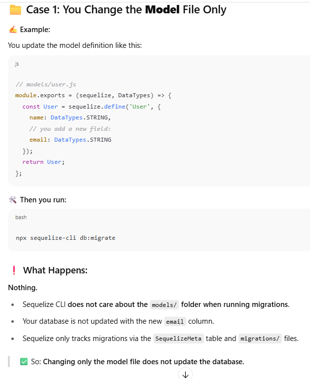


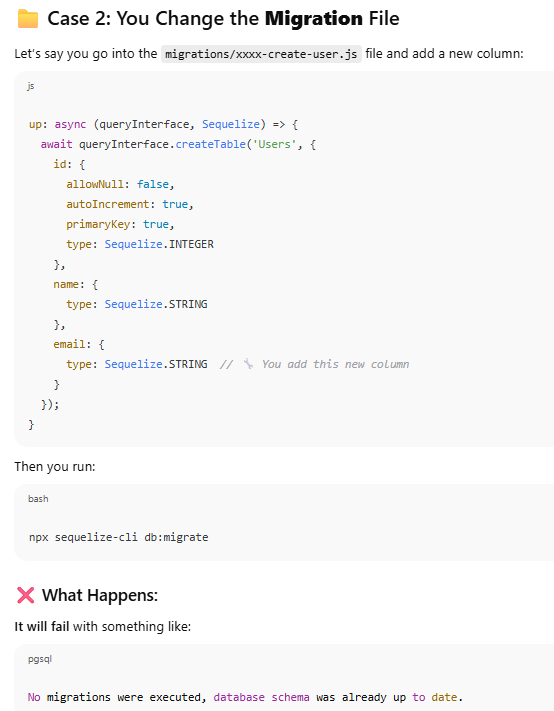


Why? Because:

- That migration has **already been applied**, and Sequelize CLI tracks it in the `SequelizeMeta` table.
    
- It won’t run the same migration again.
    

> 🧠 So: **Changing an old migration file has no effect after it's been applied once.**


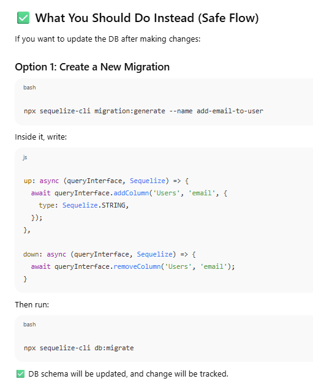

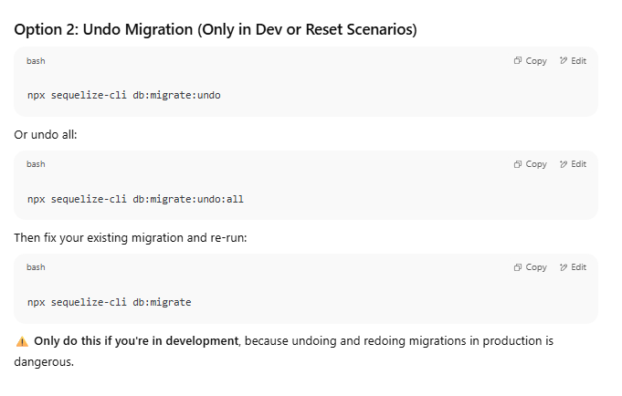

## ✅ Summary Table:

| You Change...                             | Run `db:migrate`          | What Happens?                  |
| ----------------------------------------- | ------------------------- | ------------------------------ |
| Only `models/` file                       | ✅ Runs, ❌ no DB change    | Model change is ignored by CLI |
| Only `migrations/` file (already applied) | ✅ Runs, ❌ nothing happens | Already applied, ignored       |
| New migration file                        | ✅ Runs, ✅ DB updated      | Schema changes applied         |
| Undo + edit migration                     | ✅ Runs, ✅ DB updated      | Only safe in dev/testing       |

Now changing models can have some effect!!

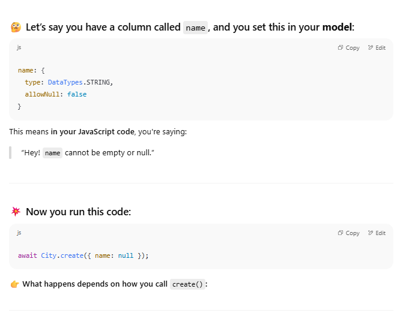

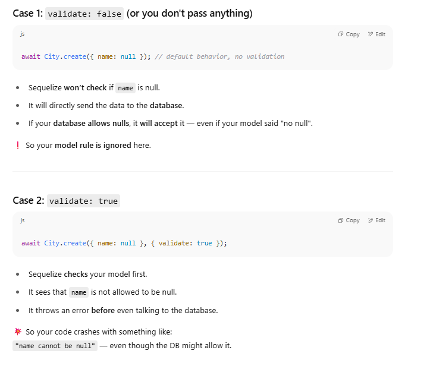

### ✅ Summary

|What You Do|Sequelize Checks?|DB Stops It?|Error?|
|---|---|---|---|
|`City.create({ name: null })`|❌ No|❓ Depends|Maybe no error|
|`City.create({ name: null }, { validate: true })`|✅ Yes|❌ Not needed|✅ Sequelize error|


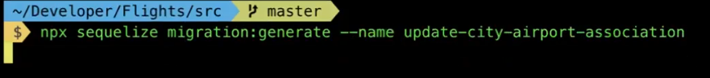

**generates a new empty migration file** with the name `update-city-airport-association`.  No models will be created
You will later edit this file to define the changes you want to make to your database schema (like adding or updating tables, columns, or associations)
👉 **Create a new migration file** so you can write code to **modify the database schema**, such as:

- Adding or updating tables
    
- Creating or updating associations (like foreign keys)
    
- Renaming or deleting columns
    
- Any structural database change
```javascript
async up (queryInterface, Sequelize) {
    /**
     * Add altering commands here.
     *  
     * Example:
     * await queryInterface.createTable('users', { id: Sequelize.INTEGER });
     * aesa sa hi toh code tha dusri migrations files ka!!!
     */
  },
```


## ✅ Step-by-Step: Add Foreign Key Constraint in Sequelize Migration

Assume:

- You **already have** both tables:
    
    - `Cities` (with `id` as primary key)
        
    - `Airports` (with `cityId` column)
        

You now want to make `cityId` in `Airports` a **foreign key** that references `Cities.id`.


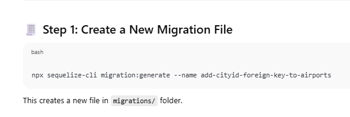

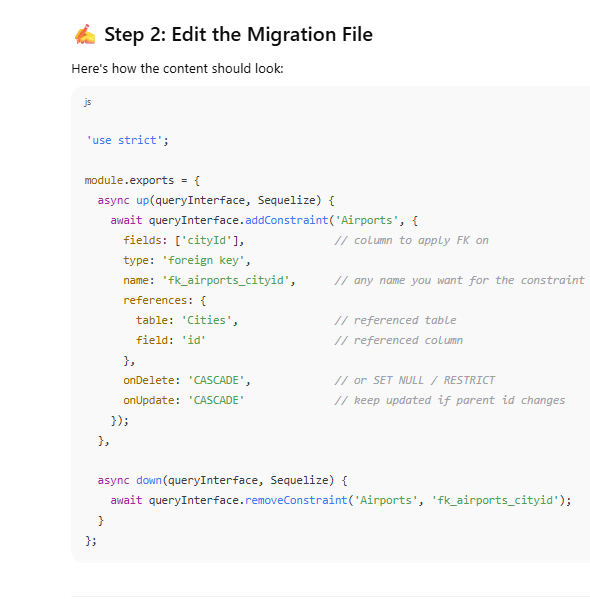

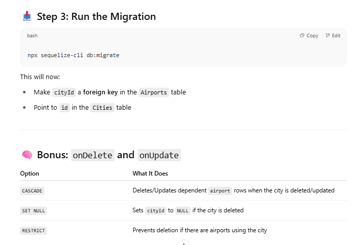


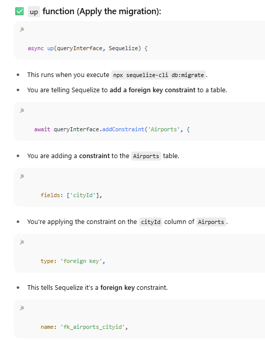

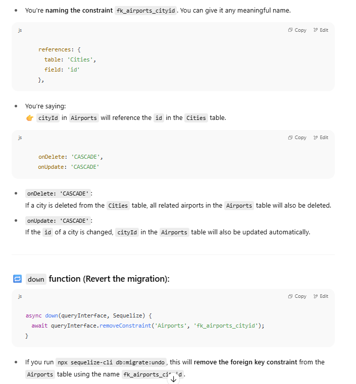


```javascript
queryInterface.addConstraint(tableName, options)
```

### **Arguments**

#### 1. **`tableName`** (string)

The name of the table where you want to add the constraint.

#### 2. **`options`** (object)

An object specifying the type and configuration of the constraint.


### 🧱 **Common `options` Fields**
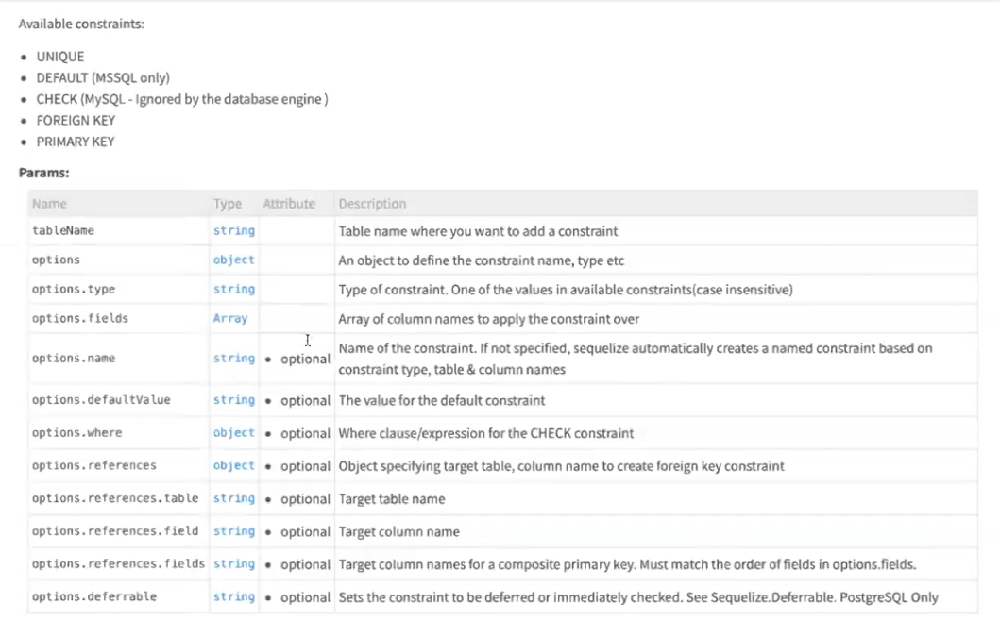

|Field|Type|Description|
|---|---|---|
|`fields`|`Array`|Column(s) the constraint applies to|
|`type`|`string`|Type of constraint — `'FOREIGN KEY'`, `'UNIQUE'`, `'CHECK'`, `'PRIMARY KEY'`, etc.|
|`name`|`string`|Name of the constraint (optional, but recommended for rollback)|
|`references`|`object`|Required for foreign keys: `{ table: 'ReferencedTable', field: 'id' }`|
|`onDelete`|`string`|Action when the referenced row is deleted: `'CASCADE'`, `'SET NULL'`, etc.|
|`onUpdate`|`string`|Action when the referenced row is updated|
|`where`|`object`|For `CHECK` constraints (rare)|
|`deferrable`|`Deferrable`|Used for deferrable constraints (Postgres only)|
```javascript
async up(queryInterface, Sequelize) {
  await queryInterface.addConstraint('YOUR_TABLE_NAME', {
    fields: ['YOUR_COLUMN_NAME'],         // The column in your table to apply the constraint on
    type: 'foreign key',                  // Type of constraint – here it's a FOREIGN KEY
    name: 'fk_yourtable_yourcolumn',      // Optional: give a custom name to the constraint
    references: {
      table: 'REFERENCED_TABLE_NAME',     // The table that holds the actual values (i.e. parent table)
      field: 'REFERENCED_COLUMN_NAME'     // The column in the referenced table to link to (usually "id")
    },
    onUpdate: 'CASCADE',                  // What to do if referenced column is updated
    onDelete: 'CASCADE'                   // What to do if referenced row is deleted
  });
}

```

### 📌 **Example for Foreign Key**

```javascript
await queryInterface.addConstraint('Airports', {
  fields: ['cityId'],
  type: 'FOREIGN KEY',// FOREIGN KEY SHOULD BE CAPITAL!
  name: 'city_fkey_constraint',
  references: {
    table: 'Cities',
    field: 'id',
  },
  onUpdate: 'CASCADE',
  onDelete: 'CASCADE',
});

```

----

### FOR DOWN FUNCTION

```javascript
await queryInterface.removeConstraint(tableName, constraintName);
```
### **What to pass:**

1. **`tableName`** – The name of the table from which you want to remove the constraint (e.g., `'airports'`).
    
2. **`constraintName`** – The exact name of the constraint you want to remove.

## What the `down` does

`down` is the **rollback** for your migration. Whatever you did in `up`, you should **undo in reverse order** in `down`.

For **adding a foreign key constraint** in `up`, you usually **remove that constraint** in `down`.
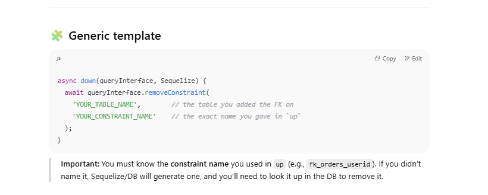


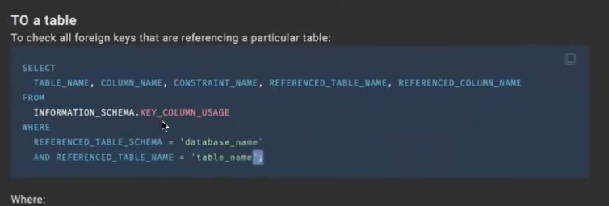


If someone clones your repository and you’ve properly set up your Sequelize migrations and database configuration, **they can easily set up the database just by running:**


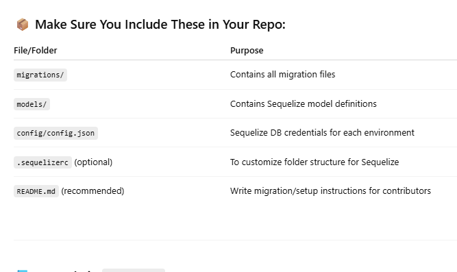


But migrations make changes at the database level anyway so who is going to make changes at the JavaScript level?

> **Migrations only change the _database schema_ — not the JavaScript model files.**

So to keep your **JavaScript layer (Sequelize models)** in sync with the **actual database schema (from migrations)**, you need to **manually update your model definitions** in JavaScript too.


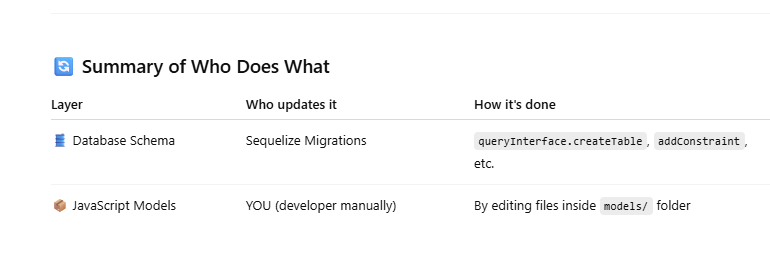

### 🧠 Why This Separation?

Because Sequelize allows you to:

- ✅ **Generate models** from an existing database (reverse engineer).
    
- ✅ Or **build migrations** to create/update tables.
    
- 🛠 But it **doesn’t auto-link model ↔ migration**, so **you must keep them in sync manually**.


Now sequelize also provides us javascript capabilities
This is for the airport model!!
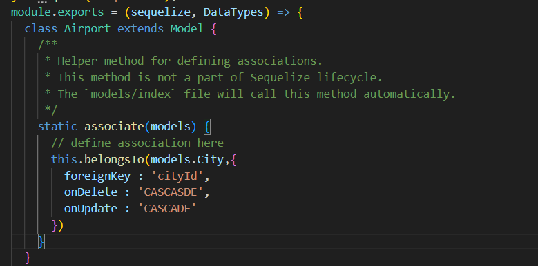

## ✅ What Goes Inside `static associate(models)`

### 🔹 Purpose:

To define **associations (relationships)** between models in one central, clean place.

## 🔗 Example: Define Relationships

Let's say:

- An **Airport** belongs to a **City**
    
- A **City** has many **Airports**


AIRPORT MODEL
```javascript
const { Model } = require('sequelize');

module.exports = (sequelize, DataTypes) => {
  class Airport extends Model {
    static associate(models) {
      // Airport belongs to one City
      this.belongsTo(models.City, {
        foreignKey: 'cityId',
        as: 'city'
      });
    }
  }

  Airport.init({
    name: DataTypes.STRING,
    cityId: DataTypes.INTEGER
  }, {
    sequelize,
    modelName: 'Airport'
  });

  return Airport;
};

  
```

CITY MODEL
```javascript
'use strict';
const {
  Model
} = require('sequelize');
module.exports = (sequelize, DataTypes) => {
  class City extends Model {
    /**
     * Helper method for defining associations.
     * This method is not a part of Sequelize lifecycle.
     * The `models/index` file will call this method automatically.
     */
    static associate(models) {
      // define association here
      this.hasMany(models.Airport,{
        foreignKey : 'cityId'
      })
    }
  }
  City.init({
    name: {
      type: DataTypes.STRING,
      allowNull : false,
      unique : true
    }
  }, {
    sequelize,
    modelName: 'City',
  });
  return City;
};

```

#### What it does:

- Inside the `Airport` model.
    
- Declares that each **Airport belongs to a City**.
    
- Links `Airport.cityId` → `City.id` via a **foreign key**.
    
- Adds cascading behavior:
    
    - **onDelete: 'CASCADE'** → If a City is deleted, its related Airports will be deleted too.
        
    - **onUpdate: 'CASCADE'** → If a City’s ID changes, the foreign key in Airports gets updated automatically.


```javascript
this.hasMany(models.Airport, {
  foreignKey: 'cityId',
});

```

#### ✅ What it does:

- Inside the `City` model.
    
- Declares that each **City has many Airports**.
    
- Also based on the same foreign key: `cityId`.

### 🔗 Together, these two define a **one-to-many** relationship:

> 📍 One **City** → Many **Airports**  
> 📍 Each **Airport** → Belongs to **one City**


|Term|Purpose|
|---|---|
|`static associate()`|Define relationships between models|
|`belongsTo()`|Many-to-One (e.g., Airport → City)|
|`hasMany()`|One-to-Many (e.g., City → many Airports)|
|`foreignKey`|Column used to establish the relationship|
|`as`|Alias to use in queries (`include: 'city'`)|


---

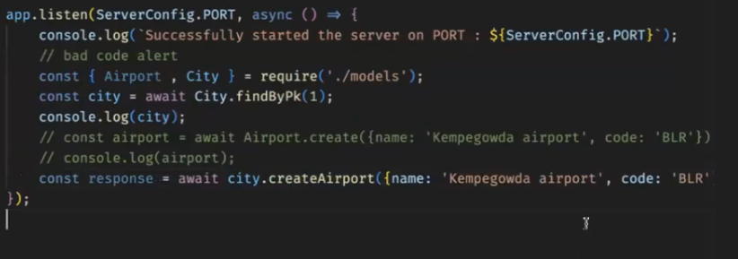

### ✅ So why does this feel weird?

Because this example:

- **Doesn’t go through controllers, services, or repositories.**
    
- **Directly uses Sequelize model instances.**


Sequelize uses these relationships to **automatically inject methods** like:

- `city.createAirport({...})` → which means “create an airport **and set its cityId to city.id**”
    
- `city.getAirports()` → fetch all airports belonging to this city
    

So it’s Sequelize magic: it gives you helper methods based on relationships.

Sequelize's association system is designed to make your code more **object-oriented** and **intuitive**


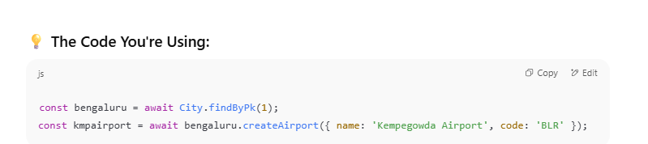

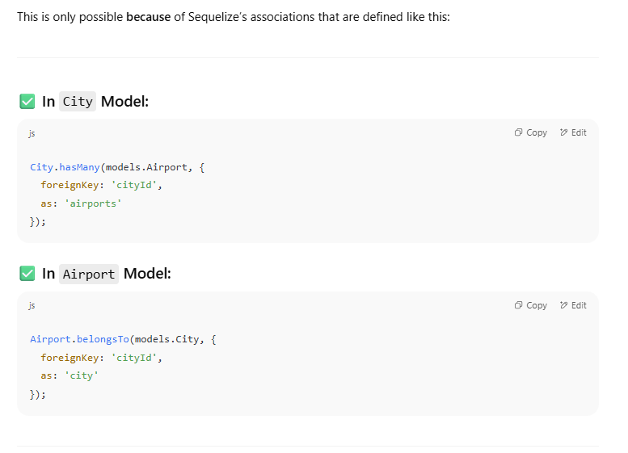

### 🧠 What `createAirport` Actually Does:

Once you define that a `City` has many `Airports`, Sequelize does this magic for you:

- Adds helper methods like:
    
    - `cityInstance.createAirport(...)`
        
    - `cityInstance.getAirports()`
        
    - `cityInstance.setAirports([...])`
        

And **`createAirport()`** internally:

- Takes the object you pass,
    
- Automatically fills the `cityId` field from `bengaluru.id`,
    
- Saves the new Airport to the database.
    

So this is **cleaner**, more **OOP-style**, and **less error-prone** than manually setting `cityId` every time.


Absolutely! When you define Sequelize associations like `hasMany`, `belongsTo`, etc., Sequelize **injects special helper functions** (also called "magic methods") into your models that let you interact with related data in an OOP-style.

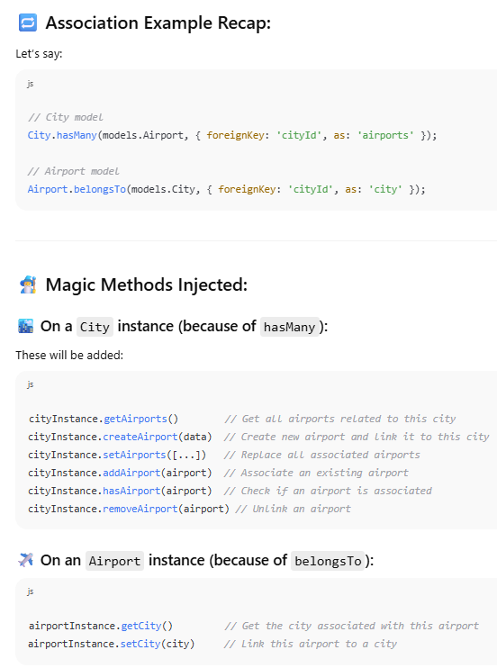

## 📌 Important:

- These magic methods only appear **after associations are set** in the `associate()` function inside your models.
    
- You should call these **on model instances** (not on the class).
    
- Always `await` them—they return Promises.
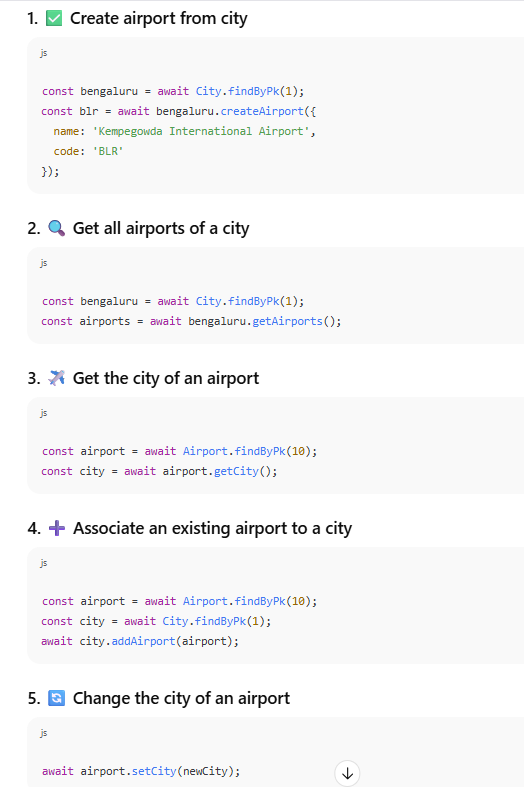


## 1. Foreign Key Constraints Recap:

When you define a foreign key like `cityId` in your `Airport` table, you're saying:

> "Each airport **must** belong to a city."

Now, the `ON DELETE` and `ON UPDATE` actions define **what happens to that foreign key when the parent (`City`) row is deleted or updated**.

## 🔥 2. Meaning of CASCADE:

| Constraint           | What it means                                                                                                          |
| -------------------- | ---------------------------------------------------------------------------------------------------------------------- |
| `ON DELETE CASCADE`  | If a city is deleted, **all related airports will also be automatically deleted**.                                     |
| `ON DELETE RESTRICT` | Prevents deleting the city **if any airports are linked to it**. (Default in many DBs)                                 |
| `ON UPDATE CASCADE`  | If you update the **primary key** of the city (usually `id`), the foreign key `cityId` in Airport will be updated too. |
🚨 **Most people never update primary keys**, so `ON UPDATE CASCADE` rarely matters in practice.  
But `ON DELETE CASCADE` is very useful and common.


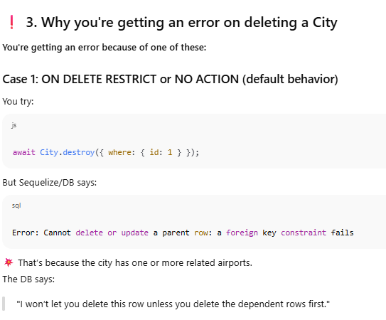

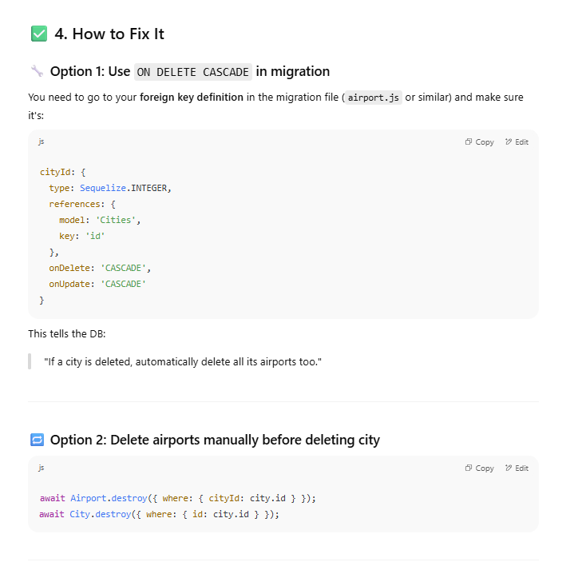

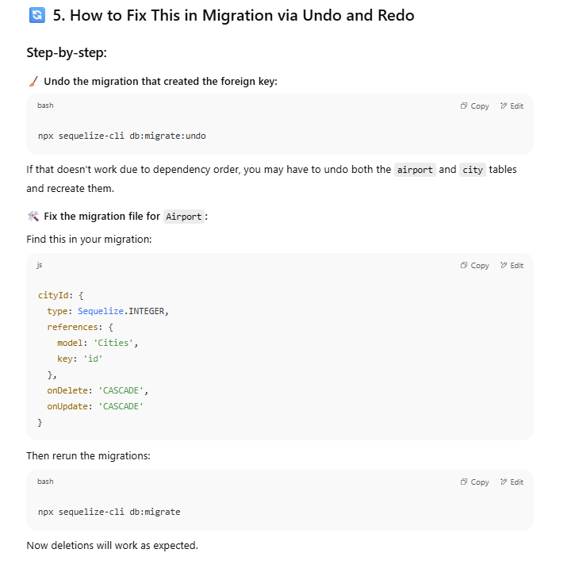

### 🔁 **ON DELETE CASCADE / ON UPDATE CASCADE — What Do They Do?**

1. **`ON DELETE CASCADE`**:
    
    - If you delete a parent record (e.g., a `City`), all **child records** (e.g., related `Airports`) will be **automatically deleted**.
        
    - This helps avoid foreign key constraint errors.
        
2. **`ON UPDATE CASCADE`**:
    
    - If you change the **primary key** of a parent (e.g., `City.id`), Sequelize (or DB) **automatically updates** the related foreign keys (e.g., `Airport.cityId`) to reflect that.

