Yes, the changes you made in the migration file will be applied — but only if that same migration file is the one being re-run.

If the file was already run earlier and recorded in the SequelizeMeta table, and you:


Then run db:migrate again,

✅ It will re-run the same migration file with the new logic.

⚠️ Important Caveat:
If you already ran the migration, and later you modify the file but do NOT undo it, Sequelize won’t re-run it (because it thinks it was already applied — tracked via SequelizeMeta table).


## flight model!!


```javascript
npx sequelize model:generate --name Flight --attribute flightNumber:string,airplaneId:integer,departureAirportId:integer,arrivalAirportId:integer,arrivalTime:date,departureTime:date,price:integer,boardingGate:string,totalSeats:integer
```


In Sequelize, you **can and should** add foreign key references directly in the migration files**—this is the correct way to establish relationships between tables at the **database level**

### ✅ **1. Add a column with reference in a migration**

When creating a new table and you want to reference another table (i.e., a foreign key):

```javascript
await queryInterface.createTable('Flights', {
  id: {
    allowNull: false,
    autoIncrement: true,
    primaryKey: true,
    type: Sequelize.INTEGER
  },
  departureAirportId: {
    type: Sequelize.INTEGER,
    references: {
      model: 'Airports',    // name of the referenced table
      key: 'id'             // primary key in referenced table
    },
    onUpdate: 'CASCADE',
    onDelete: 'SET NULL'
  },
  createdAt: {
    allowNull: false,
    type: Sequelize.DATE
  },
  updatedAt: {
    allowNull: false,
    type: Sequelize.DATE
  }
});

```

### ✅ **2. Or add the reference later using `addConstraint()`**
If the column already exists and you want to add the foreign key later:

```javascript
await queryInterface.addConstraint('Flights', {
  fields: ['departureAirportId'],
  type: 'foreign key',
  name: 'fk_flights_departure_airport', // optional but recommended
  references: {
    table: 'Airports',
    field: 'id'
  },
  onUpdate: 'CASCADE',
  onDelete: 'SET NULL'
});

```

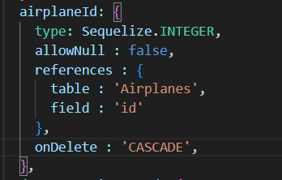

migrations file mein itne mein kam hojega!!
**And then we need to make changes in the models! as well!!**

## 👨‍🏫 What is `static associate(models)`?

In Sequelize, this method is where you define **model relationships (associations)** in **JavaScript**. This helps Sequelize understand:

- How your models are related.
    
- What helper functions to create (e.g., `.getFlights()`, `.setAirplane()`, etc.).
    
- How to write JOINs when you use `.include()` in your queries.
    

These associations are **purely JavaScript logic** (Sequelize-level, not database schema level).


## 🧠 Core Idea: Relationships Between Tables

In real-world data modeling, entities are **connected**.

For example:

- One **Airplane** can run many **Flights**
    
- One **Flight** departs from one **Airport**
    
- One **City** has many **Airports**

| Relationship Type            | Example                                                             |
| ---------------------------- | ------------------------------------------------------------------- |
| One-to-One                   | A user has one profile                                              |
| One-to-Many (or Many-to-One) | A city has many airports                                            |
| Many-to-Many                 | A flight has many passengers, and a passenger can take many flights |

## 🧩 Sequelize Associations = Telling Sequelize These Relationships

You're basically telling Sequelize:

> “This model is connected to that model in this specific way.”

Now let’s break down the two most common associations:  
🔹 `belongsTo()`  
🔹 `hasMany()`


## 🔁 `belongsTo()` — The _child_ points to the _parent_ via a foreign key

### Think like this:

> "I (the child) belong to that thing (the parent), and I store its ID."


```javascript
Flight.belongsTo(Airplane, {
  foreignKey: 'airplaneId'
});
```
This means:

- The `Flight` table has a column `airplaneId`
    
- Each `Flight` **belongs to** one `Airplane`
    
- It is a **many-to-one** relationship: many flights → one airplane
    

🔍 You’re saying:

> Each flight is **linked to** one airplane by storing its `airplaneId` in the flight row.

🧠 Logic:  
"Flight is the child, Airplane is the parent. The **child stores the parent ID**."

## 🌱 `hasMany()` — The _parent_ is linked to many _children_

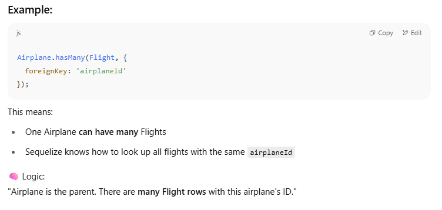

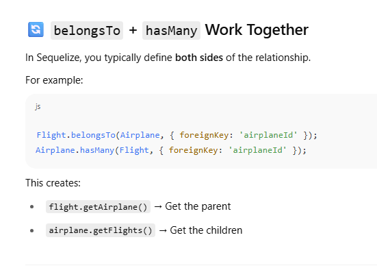
## Association = Two People Pointing Fingers

- `belongsTo()` → "I have the foreign key."
    
- `hasMany()` → "The other model has the foreign key that points to me

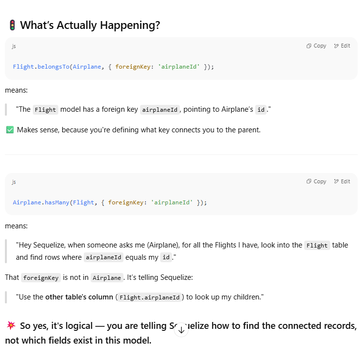

## 🧠 One-Liner Rule to Remember:

> **In Sequelize, `foreignKey` always tells Sequelize where to look — not necessarily where it's defined.**

So even if `airplaneId` isn’t in the Airplane model, it is in the Flight model, and `Airplane.hasMany(Flight, { foreignKey: 'airplaneId' })` is Sequelize’s way of **linking the two**.

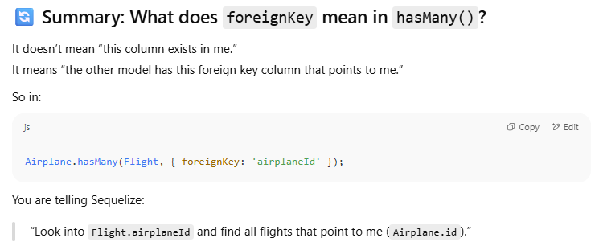

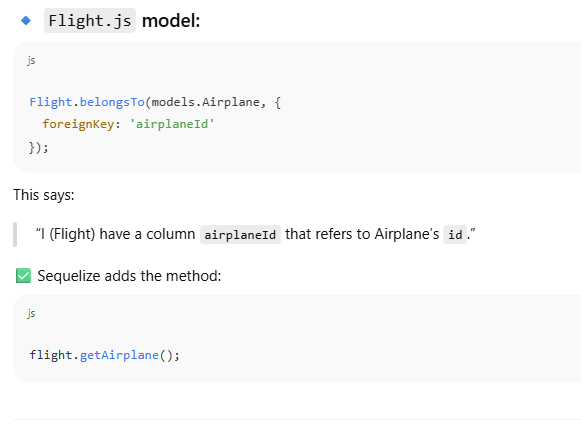

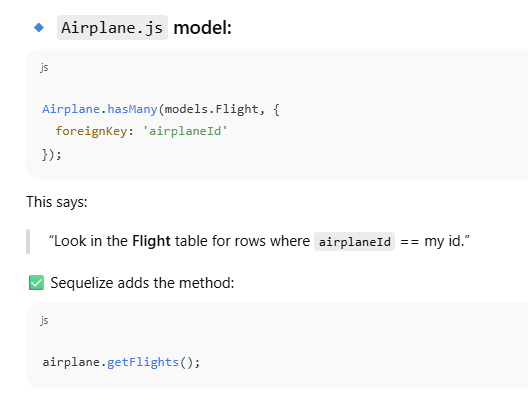

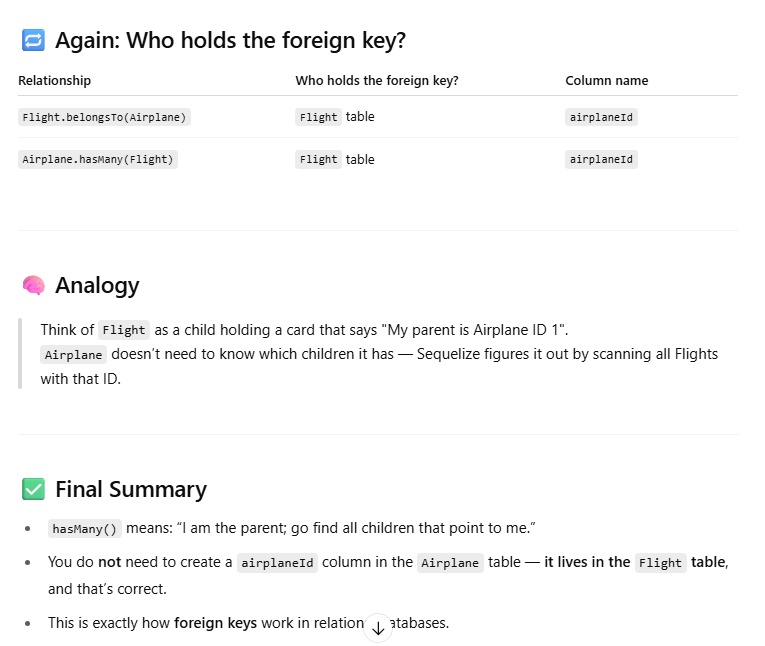

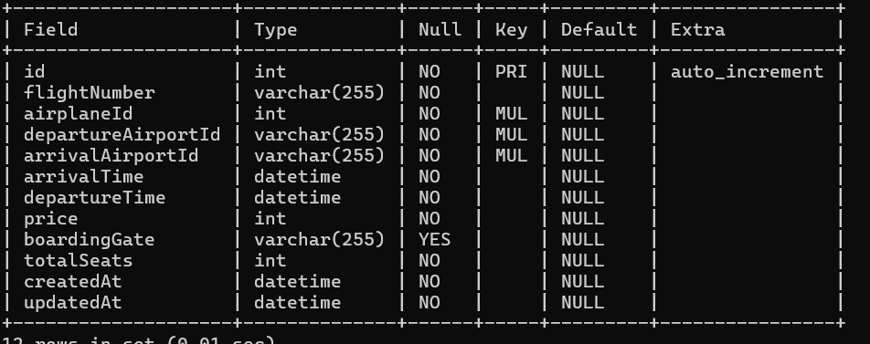

When you define associations in Sequelize (like `hasMany`, `belongsTo`, etc.), **Sequelize automatically creates helper methods on your models** to work with those relationships.
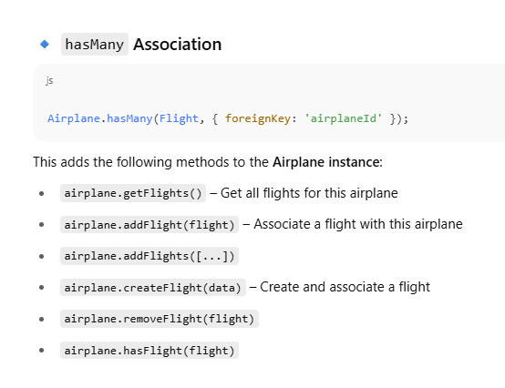

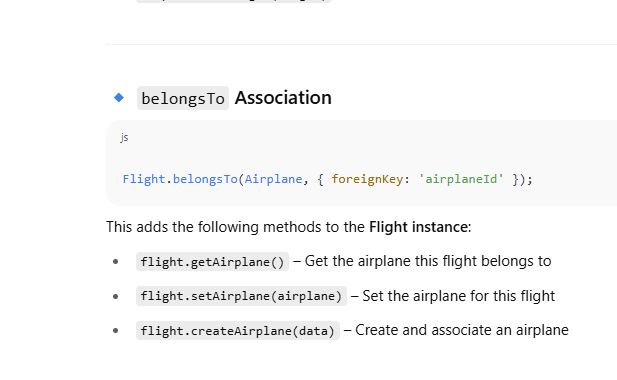


