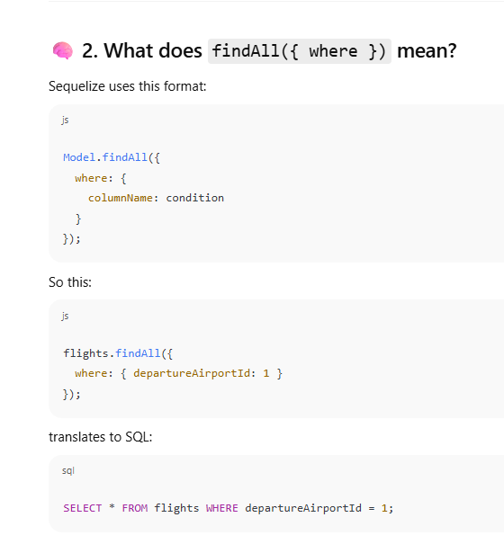
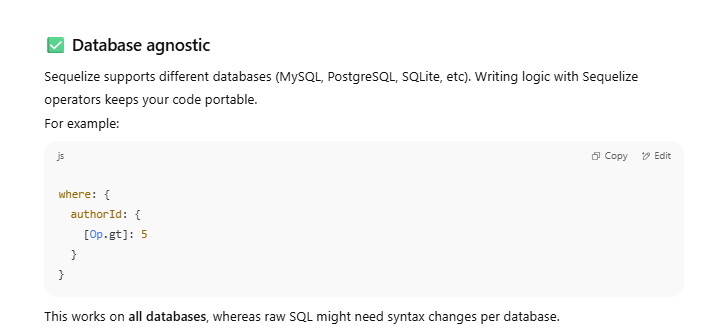

 
 ### 🧠 Bonus: When to Use What


|Type|URL Example|Access in Code|Use When|
|---|---|---|---|
|Route Param|`/airports/:id` → `/airports/2`|`req.params.id`|For resource-specific|
|Query Param|`/airports?id=2&sort=desc`|`req.query.id`|For filtering/sorting|
FLIGHTS SERVICE API


```javascript
const {FlightService} = require("../services")
const {StatusCodes} = require('http-status-codes')
const { error } = require("winston")
const{SuccessResponse,ErrorResponse}= require('../utils/common')
async function createFlight(req,res) {
    try {
        const flight = await FlightService.createFlight({
        flightNumber : req.body.flightNumber,
        airplaneId : req.body.airplaneId,
        departureAirportId : req.body.departureAirportId,
        arrivalAirportId : req.body.arrivalAirportId,
        arrivalTime : req.body.arrivalTime,
        departureTime : req.body.departureTime,
        price : req.body.price,
        boardingGate : req.body.boardingGate,
        totalSeats : req.body.totalSeats
        })
        SuccessResponse.data = airplane;
     return res
              .status(StatusCodes.CREATED)
              .json(SuccessResponse)
        
    } catch (error) {
        ErrorResponse.error = error;
        console.log("Caught error:", error);

        return res
                  .status(error.statusCode)
                  .json(ErrorResponse)
    }
    
}


module.exports = {
    createFlight
}

```
In your **Flight Controller**, when you're creating a new flight, you usually send an object to the **service** or **model layer** that **matches the Flight model's schema**.


`2025-08-01T10`, the `T` is **just a separator** between the **date** and the **time**.


## ✅ 4. Common Mistakes in Postman:

❌ `"2025/08/01 12:00"` → Wrong format (slashes not accepted)  
❌ `"01-08-2025"` → Ambiguous and not time-aware  
❌ `"2025-08-01 12:00 PM"` → Not ISO compliant


Now after creating flights now we just need to create filters!!

Filters jo hai na wo query params mein jate hain!!

```javascript
class FlightRepository extends CrudRepository {
    constructor(){
       super(flights);
    }
    async getAllFlights(filter){
        const response = await flights.findAll({
            where : filter
        });
        return response;
    }
}


```




## 🧠 1. Why Do We Need Operators in Sequelize?

In SQL, we don’t just check for equality — we do:

- greater than (`>`)
    
- less than (`<`)
    
- not equal (`!=`)
    
- between values
    
- match a list (`IN`)
    
- etc.
    

In Sequelize (which abstracts SQL in JavaScript), we use **special objects called operators** to express these conditions.


### 3. Basic SQL vs Sequelize Equivalent

| SQL                            | Sequelize Equivalent                     |
| ------------------------------ | ---------------------------------------- |
| `WHERE age = 25`               | `{ age: { [Op.eq]: 25 } }`               |
| `WHERE age > 30`               | `{ age: { [Op.gt]: 30 } }`               |
| `WHERE age >= 18`              | `{ age: { [Op.gte]: 18 } }`              |
| `WHERE age < 60`               | `{ age: { [Op.lt]: 60 } }`               |
| `WHERE age BETWEEN 18 AND 60`  | `{ age: { [Op.between]: [18, 60] } }`    |
| `WHERE name IN ('John','Ram')` | `{ name: { [Op.in]: ['John', 'Ram'] } }` |
| `WHERE name != 'Rajvi'`        | `{ name: { [Op.ne]: 'Rajvi' } }`         |
## 📦 4. Common Operators in Sequelize

| Sequelize Operator | SQL Equivalent | Use Case Example         |
| ------------------ | -------------- | ------------------------ |
| `Op.eq`            | `=`            | Exact match              |
| `Op.ne`            | `!=`           | Not equal                |
| `Op.gt`            | `>`            | Greater than             |
| `Op.gte`           | `>=`           | Greater than or equal    |
| `Op.lt`            | `<`            | Less than                |
| `Op.lte`           | `<=`           | Less than or equal       |
| `Op.between`       | `BETWEEN`      | Range queries            |
| `Op.in`            | `IN`           | One of multiple values   |
| `Op.notIn`         | `NOT IN`       | Not in a set             |
| `Op.like`          | `LIKE`         | Pattern match            |
| `Op.or`            | `OR`           | Multiple possibilities   |
| `Op.and`           | `AND`          | Combine multiple filters |
==**BHAI O should be in caps in Op**==
In Sequelize (and most ORMs), **you technically _can_ write raw SQL**, but it's **not the default approach**. Sequelize gives you an **abstraction over SQL** to make your code:
### ✅ **More secure**

Using Sequelize operators like `Op.eq`, `Op.in`, etc., **prevents SQL injection** attacks by safely escaping values.



`req.query` is a **JavaScript object** in Express.js that contains all the **query parameters** from the URL as **key-value pairs** (all values are strings by default).

TRIPS FILTER 
Custom filter object mein keys table ke coulms kok match karegi

```javascript
let customFilter = {};
    if(query.trips){
        [departureAirportId,arrivalAirportId] = query.trips.split('-');
        customFilter.departureAirportId = departureAirportId;
        customFilter.arrivalAirportId = arrivalAirportId;
        // if there are same then we'll just return an empty object or an error
    }
    try {
     const flights = await flightRepository.getAllFlights(customFilter);
```

Jada custom filter object banana pad raha hai!

```javascript
if(query.price){
    [minPrice,maxPrice] = query.price.split('-');
     customFilter.price = {
        [Op.between] : [minPrice,maxPrice]
    }
   }
```

Now here we can't just do customfilter.minPrice = minPrice!!
Because sare prices usee bade ya uske jitne hone chahiye!! Toh yahan operator ka use hoga !!


### ✅ In general: use **operators** when:

- You want to compare values (`<`, `>`, `BETWEEN`, `!=`, etc.)
    
- You want to filter using conditions — not assign new keys
    

---

### 🧠 Tip: Treat `customFilter` as **"where clause for SQL"**

So write it in such a way that it's telling Sequelize **what condition should apply on which column** — and the column names must match your model (like `price`, not `minPrice`).

But happens when we send price : 1000
Here maxPrice will be undefined then!!


## 💡 Purpose of `customFilter`

`customFilter` is an object that holds all the dynamic conditions you want to apply in a SQL `WHERE` clause. Sequelize allows you to use this with `findAll({ where: customFilter })` to filter results based on runtime query params.


## 🧠 Sequelize Operators Cheat Sheet

|**SQL Equivalent**|**Sequelize Operator**|**Usage Example**|
|---|---|---|
|`=`|`Op.eq`|`{ age: { [Op.eq]: 25 } }`|
|`!=`|`Op.ne`|`{ name: { [Op.ne]: 'John' } }`|
|`>`|`Op.gt`|`{ price: { [Op.gt]: 100 } }`|
|`>=`|`Op.gte`|`{ quantity: { [Op.gte]: 10 } }`|
|`<`|`Op.lt`|`{ age: { [Op.lt]: 18 } }`|
|`<=`|`Op.lte`|`{ discount: { [Op.lte]: 30 } }`|
|`BETWEEN X AND Y`|`Op.between`|`{ price: { [Op.between]: [100, 200] } }`|
|`NOT BETWEEN`|`Op.notBetween`|`{ rating: { [Op.notBetween]: [1, 3] } }`|
|`IN (a, b, c)`|`Op.in`|`{ category: { [Op.in]: ['food', 'drink'] } }`|
|`NOT IN (a, b)`|`Op.notIn`|`{ country: { [Op.notIn]: ['India', 'China'] } }`|
|`LIKE '%abc%'`|`Op.like`|`{ name: { [Op.like]: '%john%' } }`|
|`NOT LIKE`|`Op.notLike`|`{ email: { [Op.notLike]: '%@gmail.com' } }`|
|`IS NULL`|`Op.is`|`{ deletedAt: { [Op.is]: null } }`|
|`IS NOT NULL`|`Op.not`|`{ deletedAt: { [Op.not]: null } }`|
|`AND`|`Op.and`|`{ [Op.and]: [{ status: 'active' }, { age: { [Op.gte]: 18 } }] }`|
|`OR`|`Op.or`|`{ [Op.or]: [{ role: 'admin' }, { role: 'moderator' }] }`|
|`!= NULL`|`Op.not`|`{ deletedAt: { [Op.not]: null } }`|
|`NOT` (generic inverse)|`Op.not`|`{ status: { [Op.not]: 'inactive' } }`|
|`REGEXP` (MySQL/PG)|`Op.regexp`|`{ username: { [Op.regexp]: '^admin' } }`|
|`NOT REGEXP`|`Op.notRegexp`|`{ username: { [Op.notRegexp]: '^user' } }`|
|`ANY`|`Op.any` (Postgres only)|`{ role: { [Op.any]: ['admin', 'user'] } }`|
|`ALL`|`Op.all` (Postgres only)|`{ score: { [Op.gt]: { [Op.all]: [50, 60] } } }`|


```javascript
  if(query.sort){
    const params = query.sort.split(',')
    const sortFilters = params.map((param)=>param.split('_'));
    sortFilter = sortFilters
   }
```

```javascript
  async getAllFlights(filter,sort){
        const response = await flights.findAll({
            where : filter,
            order : sort
        });
        return response;
    }
```


### 🔁 Summary

- Sequelize allows **multi-level ordering**.
    
- It **does not override** previous order clauses — instead, it adds another layer.
    
- The order you specify in the array **matters a lot**.