FLIGHTS FROM DEL TO MUM

```json
{
    "success": true,
    "message": "Successfully completed the request",
    "data": [
        {
            "id": 2,
            "flightNumber": "UK808",
            "airplaneId": 2,
            "departureAirportId": "MUM",
            "arrivalAirportId": "BLR",
            "arrivalTime": "2022-01-17T04:33:12.000Z",
            "departureTime": "2022-01-17T01:33:12.000Z",
            "price": 3500,
            "boardingGate": null,
            "totalSeats": 120,
            "createdAt": "2025-07-29T07:10:56.000Z",
            "updatedAt": "2025-07-29T07:10:56.000Z"
        },
        {
            "id": 3,
            "flightNumber": "UK808",
            "airplaneId": 2,
            "departureAirportId": "MUM",
            "arrivalAirportId": "BLR",
            "arrivalTime": "2022-01-17T04:33:12.000Z",
            "departureTime": "2022-01-17T01:33:12.000Z",
            "price": 3500,
            "boardingGate": null,
            "totalSeats": 120,
            "createdAt": "2025-07-29T07:11:34.000Z",
            "updatedAt": "2025-07-29T07:11:34.000Z"
        },
        {
            "id": 4,
            "flightNumber": "UK808",
            "airplaneId": 2,
            "departureAirportId": "MUM",
            "arrivalAirportId": "BLR",
            "arrivalTime": "2022-01-17T04:33:12.000Z",
            "departureTime": "2022-01-17T01:33:12.000Z",
            "price": 3500,
            "boardingGate": null,
            "totalSeats": 120,
            "createdAt": "2025-07-29T07:12:43.000Z",
            "updatedAt": "2025-07-29T07:12:43.000Z"
        },
        {
            "id": 5,
            "flightNumber": "UK808",
            "airplaneId": 2,
            "departureAirportId": "DEL",
            "arrivalAirportId": "BLR",
            "arrivalTime": "2022-01-17T06:33:12.000Z",
            "departureTime": "2022-01-17T04:33:12.000Z",
            "price": 4000,
            "boardingGate": null,
            "totalSeats": 120,
            "createdAt": "2025-07-29T07:21:57.000Z",
            "updatedAt": "2025-07-29T07:21:57.000Z"
        },
        {
            "id": 6,
            "flightNumber": "UK808",
            "airplaneId": 2,
            "departureAirportId": "MUM",
            "arrivalAirportId": "BLR",
            "arrivalTime": "2022-01-17T16:33:12.000Z",
            "departureTime": "2022-01-17T14:33:12.000Z",
            "price": 4500,
            "boardingGate": null,
            "totalSeats": 120,
            "createdAt": "2025-07-29T08:48:21.000Z",
            "updatedAt": "2025-07-29T08:48:21.000Z"
        },
        {
            "id": 7,
            "flightNumber": "UK808",
            "airplaneId": 2,
            "departureAirportId": "MUM",
            "arrivalAirportId": "BLR",
            "arrivalTime": "2022-01-17T16:33:12.000Z",
            "departureTime": "2022-01-17T14:33:12.000Z",
            "price": 4500,
            "boardingGate": null,
            "totalSeats": 122,
            "createdAt": "2025-07-29T08:58:38.000Z",
            "updatedAt": "2025-07-29T08:58:38.000Z"
        },
        {
            "id": 8,
            "flightNumber": "UK808",
            "airplaneId": 2,
            "departureAirportId": "MUM",
            "arrivalAirportId": "DEL",
            "arrivalTime": "2022-01-17T17:33:12.000Z",
            "departureTime": "2022-01-17T10:33:12.000Z",
            "price": 4500,
            "boardingGate": null,
            "totalSeats": 122,
            "createdAt": "2025-07-29T12:46:28.000Z",
            "updatedAt": "2025-07-29T12:46:28.000Z"
        },
        {
            "id": 9,
            "flightNumber": "UK808",
            "airplaneId": 2,
            "departureAirportId": "DEL",
            "arrivalAirportId": "MUM",
            "arrivalTime": "2022-01-17T17:33:12.000Z",
            "departureTime": "2022-01-17T10:33:12.000Z",
            "price": 4500,
            "boardingGate": null,
            "totalSeats": 123,
            "createdAt": "2025-07-29T12:48:07.000Z",
            "updatedAt": "2025-07-29T12:48:07.000Z"
        }
    ],
    "error": {}
}

```


## 🚩 Problem You Raised

You have:

- 100 flights
    
- For each flight, you need:
    
    - Its `Airplane` details
        
    - Its `DepartureAirport`
        
    - Its `ArrivalAirport`
        

So you might think:

> "Do I have to query 100 flights, and then for each one, do 3 more queries? That's 1 + (100 × 3) = 301 queries!"

But Sequelize and SQL are smarter than that — this is where **`JOIN`s** shine.

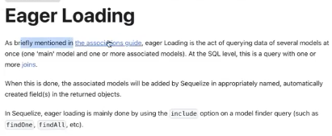

✅ Sequelize Code with All Joins
```javascript

const flights = await Flight.findAll({
    where: filter,
    order: sort,
    include: [
        {
            model: Airplane,
            as: 'airplane',   // alias as defined
        },
        {
            model: Airport,
            as: 'departureAirport',
        },
        {
            model: Airport,
            as: 'arrivalAirport',
        }
    ]
});


```

### 💥 What This Does Under the Hood

This generates **a single SQL query** that uses `JOIN` to fetch:

- Flights
    
- Their airplane info
    
- Their departure airport
    
- Their arrival airport

- Yes, Sequelize **supports JOIN** via `include`.
    
- You can **eager load** related models in **1 query**.
    
- Just make sure your **associations and aliases (`as`) match**.

## 🧒 Imagine This Story

You have a box full of **Flights**.  
Each **Flight** has:

- an **Airplane** it flies in ✈️
    
- a **Departure Airport** it leaves from 🛫
    
- an **Arrival Airport** it goes to 🛬

Now you want to **open the box** and see not just the flights —  
but also the **Airplanes** and **Airports** they belong to.

But there’s a problem…

If you don’t ask properly, Sequelize will say:

> "Oh, you only asked for flights. If you want the airplane and airport, you gotta ask again!"

So now, instead of asking again and again and again,  
you use a **magic word**: Include

This magic word tells Sequelize:

> "Hey buddy, while you're getting the flights, **also bring their airplane and airport too**!"


## ✨ What is `include`?

- `include` is a **special keyword in Sequelize**
    
- It lets you **JOIN other models (tables)** when fetching data.
    
- It works **only if associations are defined** (like `.belongsTo`, `.hasMany` etc.)


## ✅ When to Use `include`

|Situation|Use `include`?|
|---|---|
|You just need basic fields like `flightNumber`, `departureTime`|❌ No need|
|You need `Airplane` info like capacity or model|✅ Yes!|
|You want to show full `Airport` names, codes, locations|✅ Yes!|
|You're building APIs that return everything together|✅ Absolutely|


## 🛠️ How to Use `include`

Let’s say you want to get:

- all flights
    
- with their airplane
    
- and their departure & arrival airports


```javascript
const flights = await Flight.findAll({
  include: [
    {
      model: Airplane,
      as: 'airplane'
    },
    {
      model: Airport,
      as: 'departureAirport'
    },
    {
      model: Airport,
      as: 'arrivalAirport'
    }
  ]
});

```

## 🎯 What to Use in `include`

| Thing            | What it does                                                         |
| ---------------- | -------------------------------------------------------------------- |
| `model`          | Which model to JOIN (like `Airplane`, `Airport`)                     |
| `as`             | The **alias** you used when defining associations (`as: 'airplane'`) |
| `attributes`     | (Optional) To only include specific fields                           |
| `required: true` | (Optional) Makes the JOIN like an `INNER JOIN`                       |
| `where`          | (Optional) Filters just the included model                           |

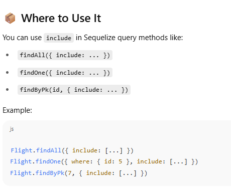

### 🧠 **What does `include: { model: Airplane }` actually do?**

It tells Sequelize:

> “When you’re finding flights, also bring the **Airplane** data that is connected to each flight.”


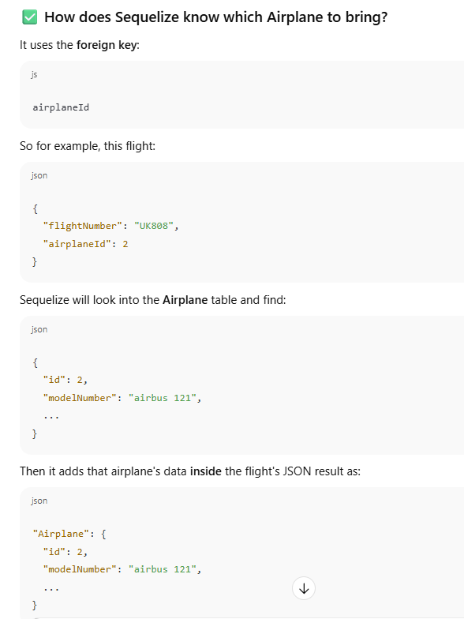
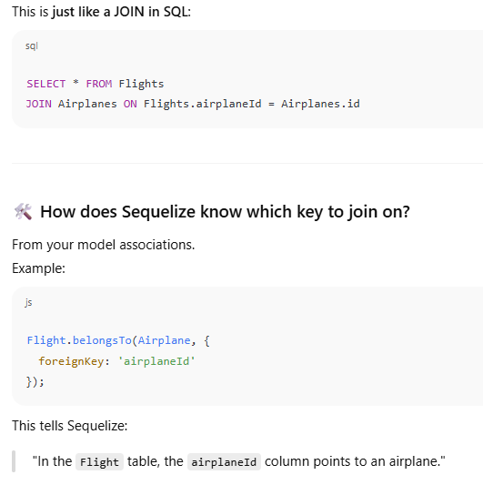
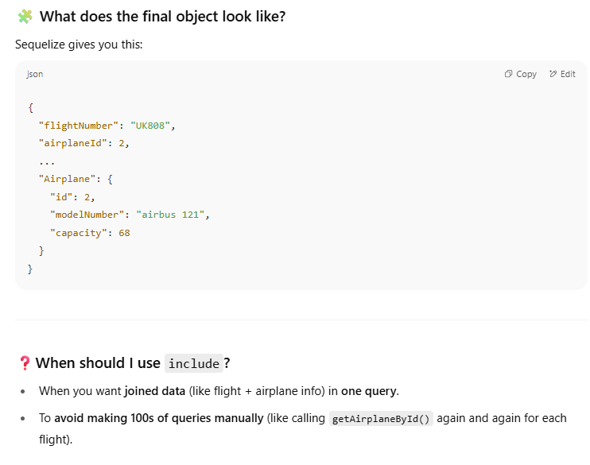

### ❓When should I use `include`?

- When you want **joined data** (like flight + airplane info) in **one query**.
    
- To **avoid making 100s of queries manually** (like calling `getAirplaneById()` again and again for each flight).

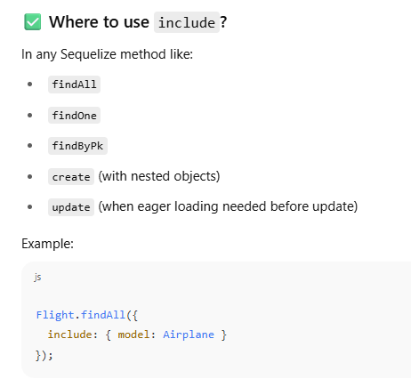

### 🧠 Why use it?

Because it's:

- Fast (single query instead of 100+)
    
- Clean (less code)
    
- Powerful (can include nested associations too, like `Airplane -> Manufacturer`)
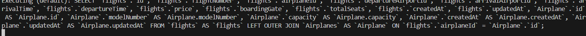

### 🔁 Default Behavior (without `required: true`)

By default, Sequelize uses a **left outer join**, which means:

- You will get **all records from the main model** (like `Flight`)
    
- Even if there is **no matching record in the included model** (like `Airplane`)
    
- The included model’s data will be `null` if it doesn't exist.

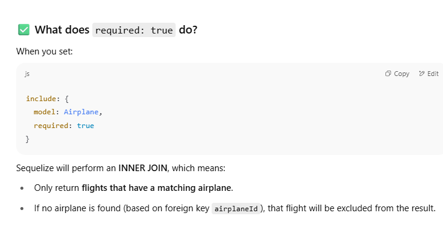

- .
    

---

### 🔧 Use Case — When should I use `required: true`?

- When you want to **filter out incomplete or broken data**
    
- When the association must exist for the data to be valid
    
- When you're doing joins and want to use `where` conditions on the included model


```SQL
-- LEFT JOIN (default behavior)
SELECT * FROM Flights LEFT JOIN Airplanes ON Flights.airplaneId = Airplanes.id;

-- INNER JOIN (required: true)
SELECT * FROM Flights INNER JOIN Airplanes ON Flights.airplaneId = Airplanes.id;

```


### 👶 Visual Baby Example:

- Flight → includes → Airplane
    
- Flight #1: has airplane ✔
    
- Flight #2: has airplane ✔
    
- Flight #3: airplane is missing ❌
    
- With `required: false` → all 3 flights come (but airplane for #3 is null)
    
- With `required: true` → only flight #1 and #2 come

Every `Flight` should have an associated `Airplane`, because a flight can't exist without a plane 🚫✈️… but in **real-world databases**, or while **testing, seeding, or debugging**, this kind of mismatch _can_ happen

### 👶 Let’s Imagine a School Analogy

You have:

- `Classroom` (like your `Flight`)
    
- `Teacher` (like your `Airplane`)
    

Every classroom **should** have a teacher assigned.

But sometimes:

1. The teacher left.
    
2. The teacher wasn’t assigned yet.
    
3. You deleted a teacher but forgot to update the classroom.
    

So now, a classroom exists without a teacher.

Same thing can happen in databases.


.

---

### 🛠 How Can a Flight Miss an Airplane?

Here are some **real examples**:

|Scenario|Why it happens|
|---|---|
|✅ Correctly linked|A flight has `airplaneId = 2`, and there's an airplane with `id = 2`.|
|❌ Orphaned flight|Someone deleted airplane with `id = 2`, but forgot to delete/update the flight.|
|❌ Missing link|While creating a flight, the `airplaneId` was accidentally set to `null` or wrong.|
|❌ Import/Seed error|While inserting data during testing, airplane table wasn’t populated fully.|

These inconsistencies are why `required: true` can be useful — it says:

> "I only care about **flights that are correctly linked to airplanes**.


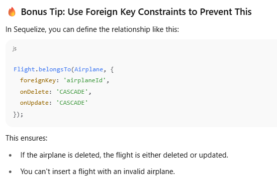

In Sequelize, the `include` property **can be an array** (not just an object), and it’s very powerful. This allows you to **include multiple associations** (joins), and **customize each one** in detail.

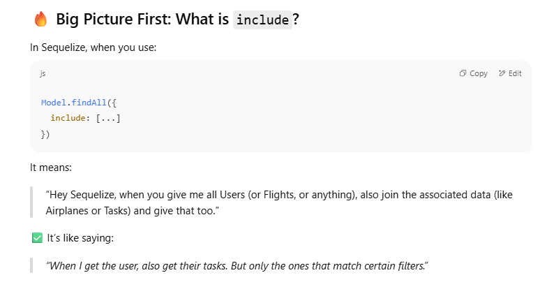

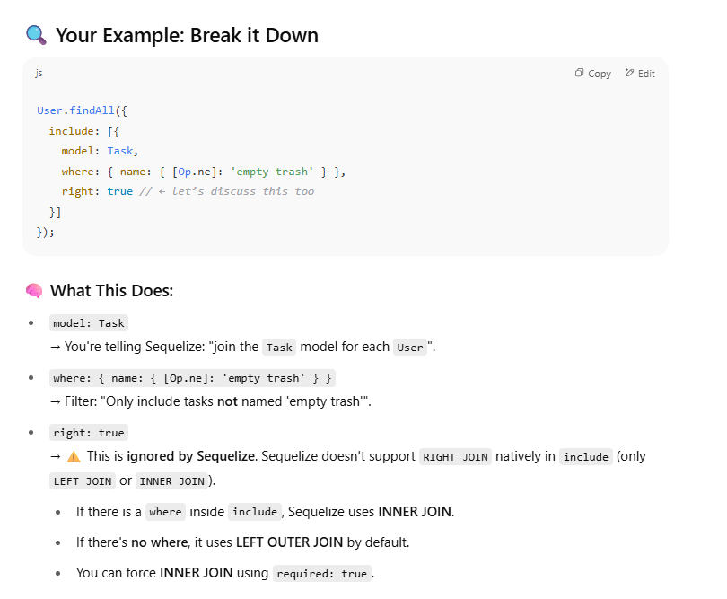

## 🧠 So What Can You Put in `include`?

Here’s a full list of common keys inside an `include` object:

| Key             | Purpose                                                          |
| --------------- | ---------------------------------------------------------------- |
| `model`         | The related model to join                                        |
| `as`            | If you're using an alias (`as`) in your association              |
| `where`         | Filters applied on the joined model (e.g., `Task`)               |
| `required`      | `true` → INNER JOIN  <br>`false` (default) → LEFT JOIN           |
| `attributes`    | Which columns to return from the joined model                    |
| `through`       | Used for `belongsToMany` relations (joins through a third table) |
| `include`       | Yes! You can nest more includes (deep joins!)                    |
| `separate`      | True = run a second query (used when you don’t want joins)       |
| `limit`/`order` | Only works in some cases when using `separate: true`             |
| `duplicating`   | Special handling for aggregate queries with `hasMany`            |
## Why Use `include[]` as Array?

Because sometimes you want **multiple relations**, or **deep joins**, or **custom logic** for each one (like filters, attributes, etc.).

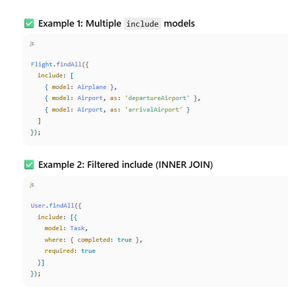

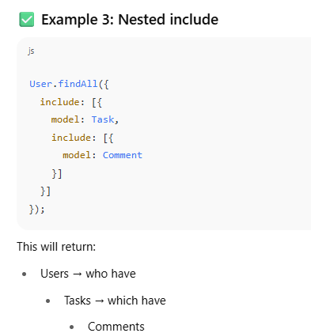


```javascript
User.findAll({
  include: [
    {
      model: Task,
      where: {
        name: {
          [Op.ne]: 'empty trash'
        }
      },
      required: true,
      attributes: ['id', 'name']
    },
    {
      model: Profile,
      attributes: ['firstName', 'lastName']
    }
  ]
});
```


Here’s what this does:

- `Task`: Only include users who **have tasks where task.name ≠ 'empty trash'`**.
    
    - Because `required: true` is set, it becomes `INNER JOIN`, so users without matching tasks are **excluded**.
        
- `Profile`: Always included (by default it's a `LEFT JOIN`), and only `firstName`, `lastName` fields are selected.


![[image-211.png]]

![[image-212.png]]

```javascript
 departureAirportId: {
        type: Sequelize.STRING,
        allowNull : false,
        references : {
          model : 'Airports',
          key : 'code'
        },
        onDelete : 'CASCADE'
      },

```


This means:  
🔗 `flights.departureAirportId` refers to **`Airports.code`**, not `Airports.id`.

But in your `FlightRepository` where you're doing this:

```javascript
include: [
  {
    model: Airplane,
    required: true
  },
  {
    model: Airport,
    required: true
  }
]

```


Sequelize doesn’t know **which** field of `Airport` to match with `departureAirportId` or `arrivalAirportId`, and by default, it tries to join on `Airport.id` — but you're linking to `Airport.code`, hence the mismatch and **empty results**.


```javascript
{
  model: Airport,
  required: true,
  on: {
    col1: Sequelize.where(
      Sequelize.col('flights.departureAirportId'),
      '=',
      Sequelize.col('Airport.code')
    )
  },
  attributes: [] // optional: exclude Airport fields from response
}

```


### 🧠 What does this mean?

Imagine two tables:

- ✈️ `flights` table with a column `departureAirportId`
    
- 🛫 `Airport` table with a column `code`
    

You want to **join** these tables, but instead of Sequelize automatically figuring out how, you're **telling it manually**:

> "Hey Sequelize, I want to connect `flights.departureAirportId` with `Airport.code`


### 📦 What does each part do?

| Part                                          | Meaning                                                                             |
| --------------------------------------------- | ----------------------------------------------------------------------------------- |
| `Sequelize.col('flights.departureAirportId')` | 📌 Tells Sequelize to pick the column `departureAirportId` from the `flights` table |
| `'='`                                         | 🔗 Tells Sequelize you're doing an **equality comparison** (`=`)                    |
| `Sequelize.col('Airport.code')`               | 📌 Tells Sequelize to pick the column `code` from the `Airport` table               |
Because:

- Sometimes Sequelize can't figure out the join.
    
- Or you want to join on **non-primary keys**, like `code` instead of `id`.
    
- Or you have **multiple conditions** to join on (like both `col1` and `col2`

## What is an alias?

An **alias** is just a **nickname** you give to something — in our case, to a table or a relationship.

It helps Sequelize (and you) **not get confused** when you're using the **same table multiple times** in a query.


### 🧠 Imagine this simple example:

You have a table called **Airport**, and your **Flight** has:

- a `departureAirportId`
    
- an `arrivalAirportId`
    

Both of them point to the **same Airport table**.

So you are saying:

> “Flight belongs to Airport... twice — once for departure, once for arrival.”


## ❌ Problem Without Alias:

If you don’t use an alias, Sequelize gets confused:

> “Wait! You said ‘include Airport’ two times. Which one is departure? Which one is arrival?”

It can’t tell the difference.


## ✅ Solution: Use `as`

You tell Sequelize:

> “Hey! Call the **first one** `departure_airport`, and call the **second one** `arrival_airport`.”

Now Sequelize knows:

- When you say `flight.departure_airport.name`, it means the takeoff airport.
    
- When you say `flight.arrival_airport.name`, it means the landing airport.

|Situation|Do you need `as`?|
|---|---|
|Including same table twice|✅ Yes, must use different aliases|
|Including a table only once|❌ No, alias is optional|
|Want to use a custom name in the result|✅ Optional but useful|

---

## 🧸 Real-Life Analogy

Imagine two people named "Ravi" in your classroom. If you say “Hey, Ravi!” — nobody knows which Ravi.

So your teacher gives them nicknames:

- “Big Ravi” (departure airport)
    
- “Small Ravi” (arrival airport)
    

Now whenever you say “Big Ravi,” we know who you mean.

That’s exactly what aliases (`as`) do.


## NOW WE WILL WORK ON THE SEATS TABLE!!


