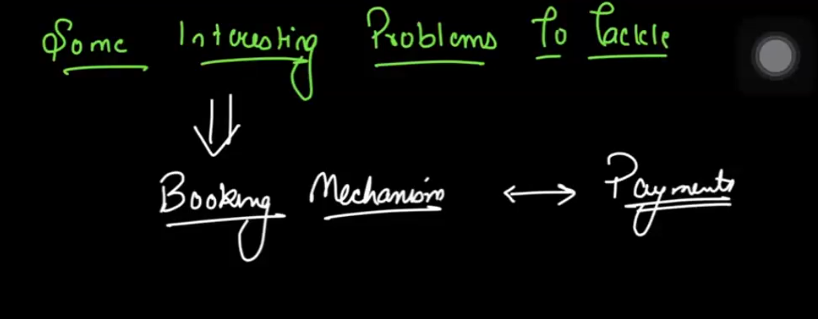
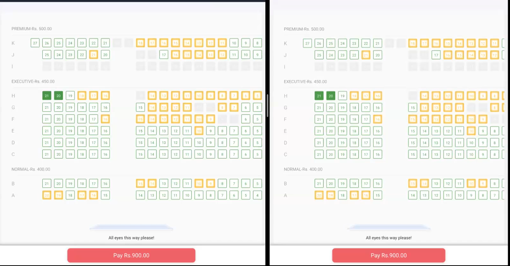
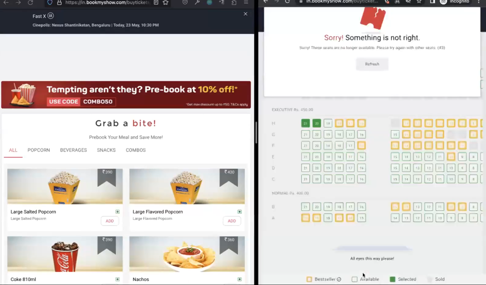
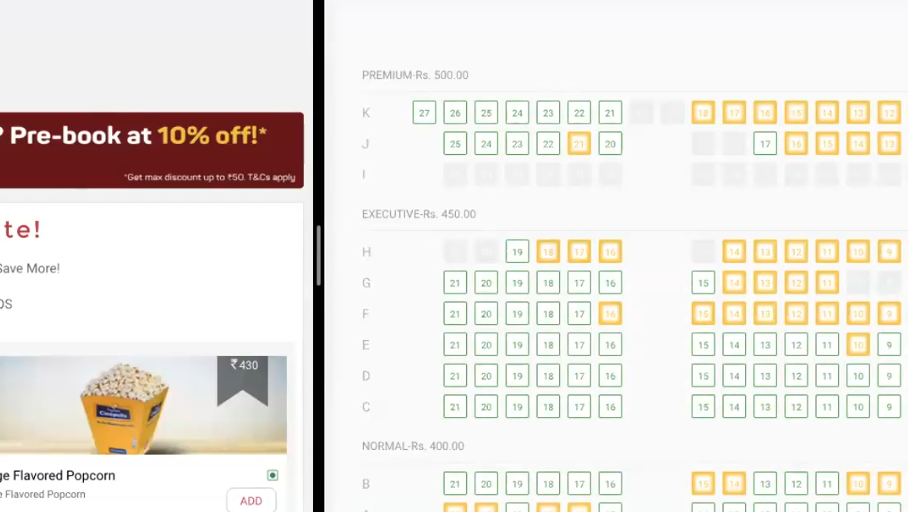
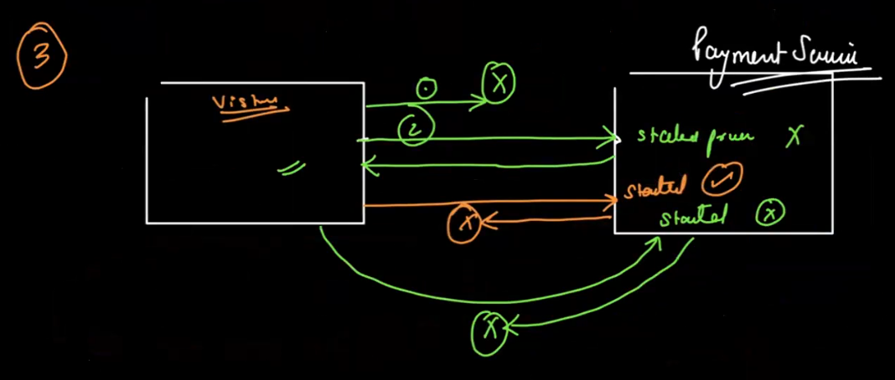
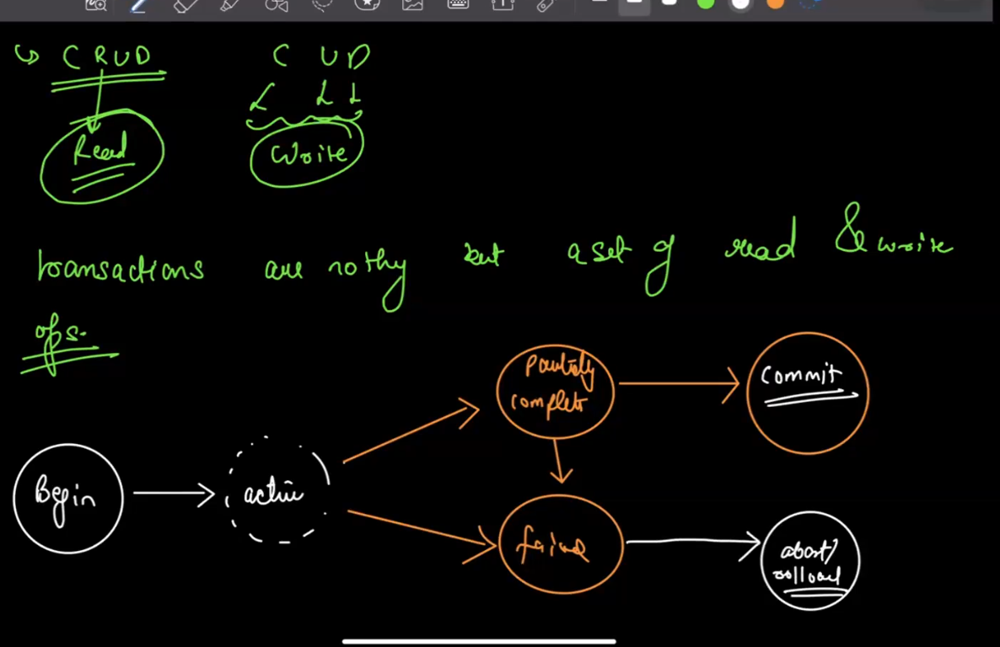
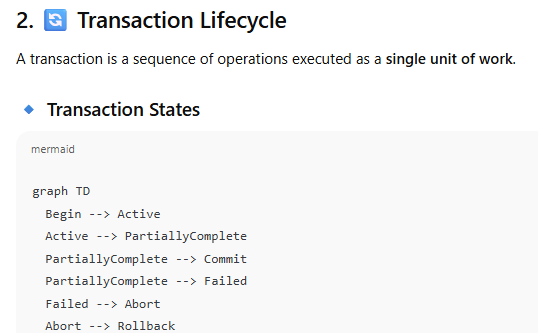
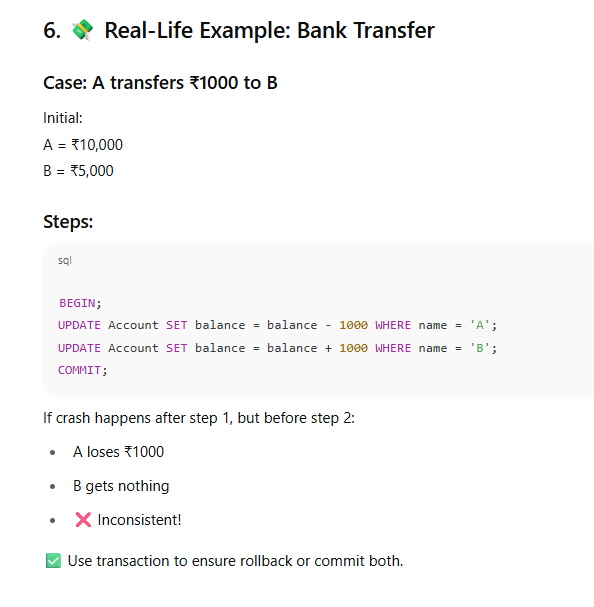
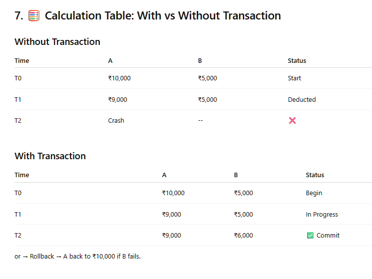

Now both the person will try to book seat 

Depending upon the speed of the network!!! Who gets it first and then the seats are locked!

h 20 and 21 are now locked you can see!!

This concurrency related problem can be seen across various platforms!!

Problems!!
1. Same Seat selection
2.  What if booking was done first and two people booked and only one seat is left then what will happen!!//

## IMAGE 1: "Unhappy paths"

### 💡 Core Point:

> "There are many unhappy paths and only one happy path."

### 🔄 Flow:

1. ✅ **Happy Path** (center arrow):
    
    - Client sends a request.
        
    - Server receives it.
        
    - Payment is made.
        
    - Seat is booked.
        
    - Confirmation is returned.
        
2. ❌ **Unhappy Path 1 (leftmost):**
    
    - Client sends a request.
        
    - Request **never reaches the server** (e.g., network error).
        
    - **User thinks** it went through → tries again → **duplicate attempt**.
        
3. ❌ **Unhappy Path 2 (middle-left):**
    
    - Request reaches server.
        
    - Payment service invoked.
        
    - **Payment fails** (card declined, 3DS issue).
        
    - Booking never happens.
        
4. ❌ **Unhappy Path 3 (middle-right):**
    
    - Payment is successful.
        
    - **But booking fails** due to:
        
        - Server crash.
            
        - DB write failure.
            
        - Network timeout.
            
    - User might get charged, but no seat booked!
        
5. ❌ **Unhappy Path 4 (rightmost):**
    
    - Everything went fine.
        
    - But **response failed** to reach the client.
        
    - User doesn't know what happened.
        
    - May retry → risk of **duplicate booking or payment**.
   

## Now we'll talk about database transactions!!!

- Try to think in terms for a product or a application! like in real life situations we might need to execute a series of queries to accomplish a task!
- we might do a club of crud operations! Example - When we make a payment through Paytm!! so many things happen actually!! these series of operation can execute a single unit of work & hence these series of operations are called as database transactions!!

so hindi mei bat karein toh database transactions ka matlb hota hai series of  DB queries that lead to a accomplishment of a single task
like jabh amazon se order karne wale hote hain toh inventory mein check hota haii  fir wahan se order karne k bad deduct bhi hota hai!!  these series of operations are called db transactions

### 🔄 **What is a Database Transaction?**

**Definition (simple)**:  
A **transaction** is a **sequence of operations (queries)** that are **executed as a single logical unit of work**. Either **all succeed (COMMIT)**, or **none at all (ROLLBACK)**.

### 📦 Real-Life Example: Amazon/Paytm/Flipkart Orders

When you order a product, the system performs **multiple steps**, like:

1. Check if item is available in inventory.
    
2. Deduct quantity from inventory.
    
3. Create a new order.
    
4. Create a payment entry.
    
5. Send notification to the user.
    
6. Maybe, update your wallet balance.
    
7. Generate invoice.

🧠 Imagine:  
If **step 3 fails (e.g., order couldn't be created)** but step 2 succeeded (inventory was reduced), that’s bad! The product is gone from inventory, but your order doesn’t exist.

So — all of these steps must **succeed together** or **fail together**.

This is the idea of a **transaction**.

### 💬 Hindi Explanation:

Bilkul sahi kaha tumne 👇

> Database transactions ka matlab hota hai ek sequence of queries jise ek saath chalaya jata hai — ya toh sabhi queries successfully ho jayein (commit) ya fir ek bhi fail ho toh puri ki puri process wapas le li jayein (rollback).

Amazon, Paytm mein:

- inventory check hona
    
- payment process hona
    
- order create hona  
    Yeh sab ek hi task ke part hain — aur yeh **transaction** mein likha jaata hai taaki system consistent rahe.

Now during the transaction execution our DB might go through a lot of changes & can be in an inconsistent intermediate state

### 💡 Real-Life Analogy

Imagine you're **booking a flight ticket** on a travel app like MakeMyTrip or Paytm.

Let’s say these are the steps (queries):

1. Check seat availability
    
2. Block seat temporarily
    
3. Deduct payment
    
4. Generate ticket
    
5. Send confirmation
    

During the middle of this process — let’s say payment is deducted but the seat couldn't be blocked — your **database is in an incomplete, inconsistent state**.

TDLR
- A **transaction** in DB is a **bundle of queries** that must run together.
    
- While these queries run **one-by-one**, your database **goes through temporary changes**.
    
- These temporary changes are called **intermediate states**.
    
- During these intermediate states, the DB **may not look correct or consistent**.

### ⚠️ Why This Is Important:

If something crashes or fails in between, and we don’t handle it, the database may end up in a **broken/incomplete state**.

That’s why we use **transactions** — so that if something goes wrong:

- We can **ROLLBACK** to the original state,
    
- Or if everything is successful, we **COMMIT** it to make it permanent.

## 🧨 THE PROBLEM

When you run multiple queries together in a **transaction** (e.g., booking a flight, transferring money), something may **fail halfway**.

### 🔥 Example:

Imagine transferring ₹500 from Account A to B:

1. Deduct ₹500 from A ✅
    
2. Add ₹500 to B ❌ (fails due to network/db crash)
    

Now the ₹500 is **gone from A but not added to B** — this is an **inconsistent, broken state**.

## 🧠 WHY WE NEED ACID

We need a system that ensures **data integrity** even when:

- There’s a **power failure**
    
- Code **crashes halfway**
    
- Two people are editing the **same data at once**
    

That’s where **ACID** comes in — it's a set of **guarantees** that databases (like MySQL, PostgreSQL, SQLite) follow for safe, reliable transactions.

## 🔐 ACID PROPERTIES — IN DEPTH

The image you shared outlines these 4 core properties:

### 🅰️ A - **Atomicity** = "All or Nothing"

> A **transaction** is a **bundle of statements** that are executed together to achieve **one final state**.

### 🧠 Real-life Analogy:

Think of a **bank transfer**:

- You **debit money from Account A**
    
- You **credit money to Account B**
    

You don’t want just one of them to happen — you want **both** or **none**. This is the essence of a transaction.

---

## 🔸 Why Use Transactions?

Because when we are attempting a transaction, we **either want all the statements to succeed** or **none of them**.

We **never** want to end up in an **intermediate state** (like money debited from A, but not credited to B).

## 🧨 This Principle is Called: **Atomicity**

- **Atomicity** means the **"all-or-nothing"** nature of transactions.
    
- If one part of the transaction fails, the **entire transaction is undone**.
    
- No partial updates are allowed.
    

> 📌 “Atomic” in computer science comes from the Greek word "atomos" — meaning **indivisible**.

---

## 🔁 **Transaction States**

There are 3 core states:

1. **Begin**
    
2. **Commit**
    
3. **Rollback**
    

### ✅ Begin

- Marks the **start** of a transaction.
    
- Think of it as opening a notebook and preparing to write.
    

### ✅ Commit

- All changes were **successfully applied**.
    
- Think of it as saving the file after editing — everything is permanent now.
    

### ✅ Rollback

- Something went wrong **in between** the operations.
    
- So we **undo** everything and return the system to the **previous stable state**.
    
- Think of it as pressing **Ctrl+Z** to undo everything.

### 🅲 C - **Consistency** = "Valid state always"

> "**Data stored in a DB is always valid & in a consistent state**"

- Ensures DB moves from one **valid state to another**.
    
- No corrupted data or broken rules (like negative bank balances, broken foreign keys).
    

**🧠 Helps with:**  
Prevents database from entering a state where **business rules are violated**.

🛠️ Example: If a product stock goes negative, consistency breaks. DB systems enforce constraints (via schema, triggers) to prevent this.

### 📦 Real-Life Example (Amazon / Paytm Style):

Let’s say you're using **Amazon** to place an order:

1. You add a product to cart.
    
2. You make the payment.
    
3. Inventory gets updated (1 unit deducted).
    
4. Order confirmation is sent.
    
5. Your order is saved in your orders table.
    

Now, imagine if:

- Payment was successful ✅
    
- But inventory update failed ❌
    
- And order still shows confirmed ✅
    

This is **bad and inconsistent** because:

- You've paid.
    
- But the inventory was not updated.
    
- And maybe there's no stock left!
### What Consistency Ensures:

If **any** of those steps fail, the entire operation is **rolled back**. So either:

- ✅ All operations succeed (payment, inventory, order record) → DB is consistent  
    **or**
    
- ❌ Nothing happens (no payment deducted, no record saved) → DB is still consistent
    

That’s what the line means:

> 💬 “Data stored in a DB is always valid and in a consistent state.”

---

### 🧾 Summary in Simple Words:

- **Consistency** = database will **never enter a broken or invalid state.**
    
- You can **trust** the data.
    
- This is done using **transactions** in SQL/Sequelize etc.
    
- A **failure in any one step** of a multi-step operation will cause everything to cancel.

### 🅸 I - **Isolation** = "Mind your own business"

- Multiple users can run transactions **at the same time**, but **they don’t interfere**.
    
- Each transaction runs as if it were **the only one**.
    

**🧠 Helps with:**  
Imagine two people booking the last seat on a flight. Isolation ensures only one succeeds.

🛠️ DB uses **locks**, **MVCC (Multi-Version Concurrency Control)** etc., to make this happen

Imagine two users making changes in the same database at the same time. The database system should handle this in such a way that each transaction acts **as if it is the only one being executed**, even when multiple transactions run **concurrently**.
### 🧠 Intuition

Let’s walk through the diagram step by step:

#### 🔸 1. Transactions T1 and T2

- Two transactions are shown:
    
    - `T1` (on the left)
        
    - `T2` (on the right)
        

#### 🔸 2. A Grid Representing Database

- The center of the image shows a **grid** — this represents **data cells** or **rows/columns** of a database table.
    
- Each transaction accesses or modifies a different part of the database:
    
    - `T1` is accessing or modifying value **‘X’**
        
    - `T2` is accessing or modifying value **‘Y’**
        

#### 🔸 3. Non-Isolated Case: What Happens If There's Interference?

- Suppose `T1` modifies a value (say X) and crashes or fails — it **rolls back** (undoes) its changes.
    
- If `T2` has already read the modified (but uncommitted) value X, it’s now acting based on invalid data.
    
- This is **interference**. It violates isolation.
    

#### 🔸 4. The Goal of Isolation

- Transactions should be **isolated**:
    
    - `T2` should **not see** any intermediate state of `T1`.
        
    - Even if `T1` fails, `T2` should be unaffected.
        
- So each transaction behaves **as if it’s alone** in the system.

### 🅳 D - **Durability** = "Saved forever"

- Once committed, the data **won’t be lost** — even if the server crashes.
    

**🧠 Helps with:**  
After your flight ticket is booked and payment is done, the system **must not forget it**, even if it crashes right after.

🛠️ Behind the scenes, databases use **write-ahead logs (WAL)** or **journals** to guarantee this.

## 1. ✅ CRUD Operations

**CRUD** is the foundation of interacting with any database:

|Operation|Meaning|Example|
|---|---|---|
|C|Create|INSERT INTO users (...)|
|R|Read|SELECT * FROM users|
|U|Update|UPDATE users SET name='John'|
|D|Delete|DELETE FROM users WHERE id=1|

🔁 All operations in a transaction are combinations of **Read** and **Write** (CUD).

| State              | Description                                      |
| ------------------ | ------------------------------------------------ |
| Begin              | Transaction starts                               |
| Active             | Performing read/write operations                 |
| Partially Complete | All steps done but not yet committed             |
| Commit             | All good, changes saved permanently              |
| Failed → Abort     | Something broke, go to rollback                  |
| Rollback           | Undo all changes and revert DB to original state |
|                    |                                                  |
|                    |                                                  |
|                    |                                                  |
🧠 Always use **transactions** to preserve data integrity when things go wrong.
## 3. 🧪 ACID Properties of Transactions

|Property|Meaning|Example|
|---|---|---|
|Atomicity|All or nothing|A → B transfer: both balances update or none|
|Consistency|DB moves from one valid state to another|Foreign keys, constraints always maintained|
|Isolation|Transactions run independently (no dirty interference)|A reads balance, B modifies it — A should not see uncommitted change|
|Durability|Once committed, it survives crashes|Power outage? Committed data is still saved|

## 4. 🛑 Concurrency Issues

|Issue|Explanation|Example|
|---|---|---|
|🔴 Lost Update|Two transactions overwrite each other|T1 and T2 both update x → one update gets lost|
|🟡 Dirty Read|Read data written by another uncommitted transaction|T2 reads a value T1 wrote but T1 rolls back|
|🟠 Non-repeatable Read|Same query gives different results within one transaction|T1 reads x → T2 updates x → T1 reads x again and sees different value|
|🟣 Phantom Read|Re-running a query gives extra/missing rows|T1 sees 3 rows → T2 adds one → T1 sees 4 rows|

## 5. 🔒 Isolation Levels

|Level|Dirty Read|Non-repeatable Read|Phantom Read|
|---|---|---|---|
|Read Uncommitted|❌ Allowed|❌|❌|
|Read Committed|✅ Avoided|❌|❌|
|Repeatable Read|✅|✅|❌|
|Serializable|✅|✅|✅|

📌 Tradeoff: Higher isolation = fewer anomalies but lower performance.

## 9. ⚖️ Serializability (Conflict & View)

### 🔹 Conflict Serializable

A schedule can be rearranged to look like one-at-a-time execution by swapping non-conflicting operations.

Use **precedence graph**:

- Nodes = transactions
    
- Edge Ti → Tj if Ti’s operation conflicts with Tj's and comes before it
    

🧠 If cycle exists → not conflict-serializable!

### 🔹 View Serializable

Weaker condition:

- Same initial reads
    
- Same final writes
    
- Same read-from mapping
    

More flexible, but harder to check.

