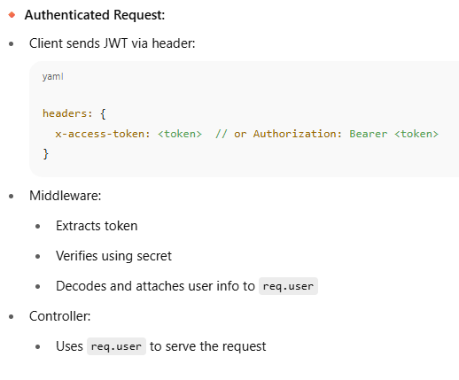

Ab authorisation kar rahe hair toh users ka hi toh auth karenge na bhai toh uske liye users model chahiye for sure!!!


To put stronger passwords in the db we can use regex as well!!!


## 🔍 What `validate` Does in Sequelize:

The `validate` key is used to define **model-level validations** in Sequelize. These are automatically run before **creating** or **updating** a record in the database. If a validation fails, Sequelize will **throw an error** and prevent the record from being saved.


## 📦 Other Useful `validate` Options

Here are more built-in validators you can use for Sequelize:

| Validator                   | Description                      |
| --------------------------- | -------------------------------- |
| `isEmail`                   | Checks for valid email format    |
| `isUrl`                     | Checks for a valid URL           |
| `isInt`                     | Checks for an integer            |
| `min`, `max`                | Min/max value (for numbers)      |
| `notEmpty`                  | Makes sure string is not empty   |
| `isIn: [['admin', 'user']]` | Only allows values from the list |
| `matches: /regex/`          | Validates using a regex pattern  |


## 💡 Conclusion

Your `validate: { len: [3, 50] }` is ensuring password length is appropriate. It's a good built-in validation for user input hygiene and security.

**Sequelize `validate` rules (like `len`, `isEmail`) are enforced only at the ORM (JavaScript) level — not at the database level.**

👉 If you want your database (MySQL, PostgreSQL, etc.) to also enforce these rules, you **must explicitly define those constraints in the migration files**.


## 📌 1. What is Validation in Sequelize?

Validation in Sequelize allows you to enforce rules on your model fields **before saving to the database**. These rules ensure data integrity and prevent invalid inputs like bad emails or too-short passwords.


## 📦 2. Where Can Validation Be Used?

| Type of Constraint             | Sequelize Model | Sequelize Migration | Notes                                                 |
| ------------------------------ | --------------- | ------------------- | ----------------------------------------------------- |
| `allowNull: false`             | ✅               | ✅                   | Enforced at both ORM and DB level                     |
| `unique: true`                 | ✅               | ✅                   | Enforced at DB level                                  |
| `validate: { isEmail: true }`  | ✅               | ❌                   | Sequelize-only, not supported in DB                   |
| `validate: { len: [3, 50] }`   | ✅               | ❌                   | ORM-only, but DB length can be set using `STRING(50)` |
| `validate: { notEmpty: true }` | ✅               | ❌                   | ORM-only                                              |
| `type: STRING(50)`             | ✅               | ✅                   | Enforced at DB level                                  |
| Regex: `validate: { matches }` | ✅               | ❌ (unless raw SQL)  | Sequelize-only unless using raw SQL CHECK             |
## ❗ 5. Key Points

- `validate` rules like `isEmail`, `len`, `matches` only work at the **Sequelize (JavaScript)** layer. MEANS THAT IT WILL BE APPLIED IN THE MODEL ONLY!
    
- These do **not** affect your database directly.
    
- For **DB-level safety**, define:
    
    - `allowNull: false`
        
    - `unique: true`
        
    - `STRING(n)` for length


After creating everything we've added a user in the users table and now the problem I'm facing is that my password is not encrypted meaning that anyone with access to users table will be able to see the password of email , now that's bad!!!

Sequelize **hooks** (also called **lifecycle hooks**) are functions that execute **automatically at specific points in a model’s lifecycle**, such as before or after creating, updating, or deleting a record.

They’re extremely useful for things like:

- Hashing passwords before saving
    
- Logging
    
- Automatically setting timestamps or flags
    
- Triggering notifications, emails, etc.

## Overview of Sequelize Hooks

### 🔄 Common Lifecycle Hooks

|Hook Name|When It Fires|
|---|---|
|`beforeValidate`|Before validation runs|
|`afterValidate`|After validation passes|
|`beforeCreate`|Before a new record is created|
|`afterCreate`|After a new record is created|
|`beforeUpdate`|Before updating an existing record|
|`afterUpdate`|After updating a record|
|`beforeDestroy`|Before deletion|
|`afterDestroy`|After deletion|
|`beforeSave`|Before `create` or `update`|
|`afterSave`|After `create` or `update`|
|`beforeBulkCreate`|Before `bulkCreate()`|
|`afterBulkCreate`|After `bulkCreate()`|
|`beforeFind`|Before a `find()` query runs|
|`afterFind`|After a `find()` query returns results|

This is just a js level concept not a db level concept!!!


## ✅ Best Practices

|Task|Recommended Hook|
|---|---|
|Hash password|`beforeCreate` / `beforeSave`|
|Set timestamps manually|`beforeCreate`|
|Send email after signup|`afterCreate`|
|Logging updates|`afterUpdate`|
|Soft delete logic|`beforeDestroy`|

The `bcryptjs` package (the lightweight version of bcrypt for Node.js) to **hash a password using Sequelize hooks** — specifically using the `beforeSave` hook, which works for both **creating and updating** users.


```javascript
User.beforeCreate(async function encrypt(user) {
    const salt = await bcrypt.genSalt(ServerConfig.SALT_ROUNDS);
    const encryptedPassword = await bcrypt.hash(user.password, salt);
    user.password = encryptedPassword;
});


```


**Sequelize hook** called `beforeCreate` to **encrypt (hash) the user's password** before saving it in the database.

This is a **security measure** to make sure plain text passwords are **never** stored in your database.


### 🧠 What’s Happening?

1. **Hook Type: `beforeCreate`**
    
    - Sequelize provides lifecycle hooks like `beforeCreate`, `afterCreate`, etc.
        
    - `beforeCreate` runs **just before** a new `User` is saved to the database using `User.create()`.
        
2. **Hook Function: `async function encrypt(user)`**
    
    - The argument `user` is the Sequelize model instance that's about to be saved.
        
    - It contains all the data passed to `User.create({ email, password })`.
        
3. **`bcrypt.genSalt(ServerConfig.SALT_ROUNDS)`**
    
    - Generates a **random salt** (random string used to strengthen the hash).
        
    - `SALT_ROUNDS` controls how strong and slow the salt generation is (more rounds = slower = more secure).
        
    - Example: `10` is commonly used.
        
4. **`bcrypt.hash(user.password, salt)`**
    
    - Hashes the plain password using the salt.
        
    - This gives you a **secure, irreversible hashed password**.
        
5. **`user.password = encryptedPassword`**
    
    - Replaces the original plain-text password with the hashed version **before saving to DB**


The error `Error: rounds must be a number` means that the value you're passing to `bcrypt.genSalt()` is **not a number**, but it **must be**


## 🔐 1. **Authentication – “Who are you?”**

### ❓What is it?

Authentication is the process of **verifying your identity** — making sure you are who you say you are.

### 🧠 Think of it as:

> 🔑 **Showing your ID card** to get into a building.

- You **enter your username and password** (or token, OTP, fingerprint).
    
- The system checks your credentials.
    
- If they match — ✅ you’re authenticated!
    

### 🛠 How it works (in a backend app):

- The client sends credentials via `POST /login`
    
- Backend checks them against the database:


## ✅ 2. **Authorization – “What can you do?”**

### ❓What is it?

Authorization is the process of **defining what actions an authenticated user can perform** — i.e., what resources they’re allowed to access.

### 🧠 Think of it as:

> 🚪 **Determining which rooms you can enter inside the building.**

- Are you just a visitor? You get access to the lobby.
    
- Are you staff? You get access to the work floor.
    
- Are you admin? You get access to the control room too


## 🧾 Real Example

You have 3 roles in your app:

- `customer`: can search & book flights
    
- `seller`: can create/manage flights
    
- `admin`: can manage all users and data
    

|Role|Can Access Routes|
|---|---|
|Customer|`/flights/search`, `/bookings/create`|
|Seller|`/flights/create`, `/flights/update/:id`|
|Admin|Everything, including `/admin/users`|

### Flow:

1. User logs in → Authentication (JWT token issued)
    
2. User makes request → Authorization middleware checks role
    
3. Access is granted or denied based on role.
    

---

## 🔄 Key Differences Summary:

|Feature|Authentication|Authorization|
|---|---|---|
|**Purpose**|Confirm **who** the user is|Confirm **what** the user can do|
|**Order**|Comes **first**|Happens **after** authentication|
|**Based on**|Username/password (or token, etc.)|Roles and permissions|
|**What it returns**|Identity (user ID, role, token)|Access (allow/deny specific routes)|
|**Failure Result**|401 Unauthorized|403 Forbidden|

## 🔐 JSON Web Token (JWT)

---

### 🧾 What is JWT?

A **JSON Web Token (JWT)** is an open standard (`RFC 7519`) for securely transmitting information between two parties as a JSON object.

- It is **digitally signed** so the information is **verified** and **trusted**.
    
- Signing can be done using a secret (`HMAC`) or a public/private key pair (`RSA` or `ECDSA`)


### ✅ When to Use JWT

- Stateless authentication
    
- Microservices communication
    
- Single Sign-On (SSO)
    
- When you want scalability without storing sessions in server memory


### 🧠 JWT vs Session-based Auth

| Feature              | JWT                        | Session-Based                 |
| -------------------- | -------------------------- | ----------------------------- |
| Stored where?        | Client-side (localStorage) | Server-side (in memory or DB) |
| Scalable?            | Yes (stateless)            | No (stateful)                 |
| Easy to use in APIs? | Yes                        | No                            |
| Invalidation?        | Hard (need blacklist)      | Easy (delete session)         |


### ⚙️ Where to Verify JWT?

- **Controller Level** – Not optimal.
    
- ✅ **Middleware Level** (Best practice):
    
    - A middleware verifies the token.
        
    - If valid, attaches user info to `req.user` for controller use.

### 🔁 Full Flow from Diagram 

#### 🔸 Sign-in Phase:

- **Client** → `/signin` → `{ email, password }`
    
- **Auth Service**:
    
    - Check if user exists
        
    - Compare password (usually hashed using `bcrypt`)
        
    - If valid, create and return JWT
        
- **Client**:
    
    - Stores JWT (green circle in image)



### ⚠️ Common JWT Mistakes

- ❌ Not setting `exp` (leads to infinite validity)
    
- ❌ Storing JWT in cookies without `httpOnly` or `secure`
    
- ❌ Not verifying JWT before use
    
- ❌ Putting sensitive data (like password) in the payload

---

## 🧠 Understanding the Repo Layer First

### What is the responsibility of a **Repository**?

- Directly talk to the database (via Sequelize in your case)
    
- Encapsulate DB-specific logic: models, queries, associations, transactions
    
- Keep all Sequelize code **isolated from your service or controller**
## ✅ When to use `where` inside the repository

You should **use `where` inside the repository** when:

### 1. You are exposing a specific method like `getUserByEmail`, `getFlightsByAirport`

These are **domain-specific** methods. The `where` logic is fixed and simple

```javascript
// ✅ Correct: repo owns the logic
async getUserByEmail(email) {
    return await User.findOne({
        where: { email }
    });
}

```


👉 **Why?**

- This keeps the service/controller clean and doesn't force it to know about Sequelize structure.
    
- Also prevents mistakes like using wrong keys or incorrect operators in `where`.


## ✅ Rule of Thumb

| Use Case                      | Should Repo Build `where`? | Why?                                       |
| ----------------------------- | -------------------------- | ------------------------------------------ |
| `getUserByEmail(email)`       | ✅ Yes                      | Simple, fixed query                        |
| `getFlightsByRoute(from, to)` | ✅ Yes                      | Fixed logic                                |
| `findAll(queryOptions)`       | ❌ No                       | You want flexibility (e.g., admin filters) |
| Dynamic filters from UI       | ❌ No                       | Keep logic in service or controller        |
| Very complex joins or raw SQL | ✅ Yes                      | Hide ORM complexity from service           |


----


Verifying token would give me back the id and email i used to encrypt the token in the first place!!!


If the token is invalid error aega!!


Bearer token

 User service code!!!
```javascript
 async function isAuthenticated(token) {
  try {
    if(!token){
        throw new AppError("Missing JWT TOKEN",StatusCodes.BAD_REQUEST);
    }
    const response = Auth.verifyToken(token);
    const user = await userRepository.get(response.id);
    if(!user){
      throw new AppError("No user found",StatusCodes.BAD_REQUEST);
    }
    return user.id;
  } catch (error) {
    if(error instanceof AppError) throw error;
    if(error.name = 'JsonWebTokenError'){
     throw new AppError("Invlaid JWT TOKEN",StatusCodes.BAD_REQUEST)
    }
  }  
 }

```

Middleware Function 
```javascript
async function checkAuth(req,res,next) {
    try {
    const response = await UserService.isAuthenticated(req.headers['x-access-token']);
    if(response){
        req.user = response
        next();
    }

    } catch (error) {
        return res
                 .status(error.statusCode)
                 .json(error)
    }
}
```

