## ☁️ Evolution: Physical Machines → VMs → Containers

### 🔧 1. **Physical Machines (Pre-cloud era)**

- One app per machine.
    
- Wasted resources (CPU, RAM unused).
    
- Hard to scale or replicate.
    
- Expensive and slow to provision new servers.
    

---

### ⚙️ 2. **Virtual Machines (VMs)**

> Multiple virtual OSes running on one physical host via a **hypervisor**.

- ✅ Better resource usage.
    
- ✅ Isolation: VM1 crash won’t affect VM2 (usually).
    
- ❌ Each VM is heavy (includes OS).
    
- ❌ Boot time is slow.
    
- ❌ Resource duplication (multiple OSes running).
    
- ❌ Harder to scale up/down quickly.


## 🏗️ Real Cloud Scenario: Public Cloud Providers

In AWS, Azure, GCP:

> One physical server = many virtual machines (VMs) from different customers.

So, your VM might **share hardware** with someone else's VM. This creates new risks:

### 😬 Potential Problems:

|Issue|Explanation|
|---|---|
|**Noisy Neighbor**|One VM uses too much CPU or I/O, affecting yours.|
|**Security breaches**|Exploits like Spectre can leak data across VMs.|
|**Hardware failure**|If the physical machine fails, all VMs on it go down.|
|**Inefficient scaling**|Spinning up new VMs is slow and heavy.|
## 🚀 Enter: Containers (like Docker)

Unlike VMs:

- ✅ **Share the same OS kernel**, so they are lightweight.
    
- ✅ **Start in milliseconds**.
    
- ✅ Can run **hundreds per machine** with less overhead.
    
- ✅ Easier to pack and migrate across systems.
    
- ✅ Perfect for **microservices**, **scaling**, and **cloud-native apps**.


### 📊 VM vs Container: In a Cloud Scenario

| Feature     | Virtual Machines        | Containers             |
| ----------- | ----------------------- | ---------------------- |
| Boot Time   | Minutes                 | Seconds / Milliseconds |
| Size        | GBs (whole OS)          | MBs (just app + deps)  |
| OS per unit | Each has its own        | Shared kernel          |
| Isolation   | Strong (hardware-level) | Medium (process-level) |
| Performance | Heavier                 | Faster                 |
| Portability | Lower                   | Very high              |
## ☁️ Cloud + Containers = 🔥

That’s why modern cloud systems don’t just use VMs. They:

- Run containers **inside VMs**.
    
- Use **orchestrators like Kubernetes** to manage them.
    
- Achieve high-density, fast-scaling, secure deployments.
    

---

### So to sum up:

> Cloud gave us flexibility. But containers gave us **speed, portability, efficiency**, and **developer freedom** within that cloud.


## 🔹 What Is Docker?

Docker is a tool that helps you run your application in a clean, consistent environment, no matter what machine you're using.


### 💡 Real-Life Problem:

You write an app on your laptop, it works.  
Your friend runs the same app on their laptop — it breaks.  
Why? Different setup (different Python/Node version, missing libraries, etc.)

### ✅ Docker Solves This:

Docker creates a small, isolated box (called a “container”) with your app + everything it needs — and it runs exactly the same on every machine.

## 🖼️ What Is a Docker Image?

Think of it like a 📸 photo of your app’s full setup.

- It includes:
    
    - Your app code
        
    - Installed packages (e.g., pip/npm)
        
    - System tools
        
    - Config files
        

✅ It’s **read-only** (you can't change the image once it's made).  
You use it to create containers.


## 📦 What Is a Docker Container?

A Docker container is like a **real, working toy made from the blueprint** (the image).

- It’s the running version of your app
    
- It’s isolated (doesn’t affect your host or other containers)
    
- You can run many containers from the same image
    

🧠 Tip:  
Image = Recipe / Blueprint  
Container = Cooked Meal / Live Toy


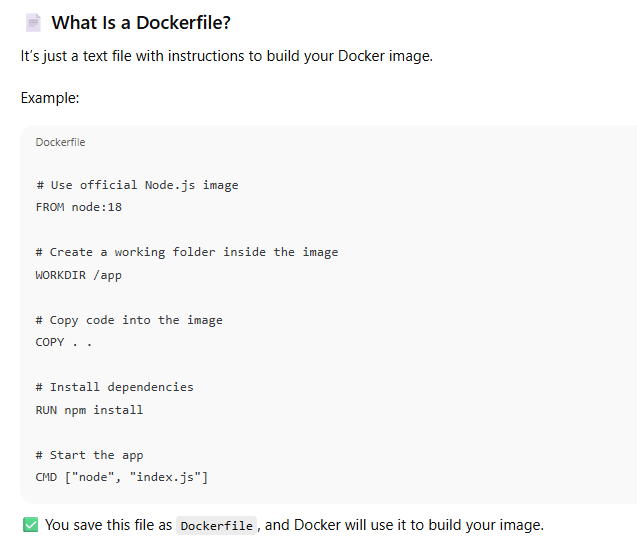


## 🆚 Dockerfile vs Docker Image

|**Dockerfile** 📝|**Docker Image** 📦|
|---|---|
|A **text file** with **instructions** to build a Docker image.|The actual **output (product)** created by running the Dockerfile — it's like a **snapshot** or **blueprint** of your app's environment.|
|Think of it like a **recipe**.|Think of it like the **final cake** made from that recipe.|
|You **write it manually** (or generate it).|You **build** it using `docker build`.|
|Not executable by itself.|Used to **create containers** using `docker run`.|
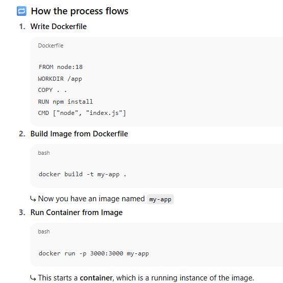


### 🎯 Real-Life Analogy (extended)

✅ **Dockerfile** = _Recipe Card_

> Instructions on how to make the cake.

✅ **Docker Image** = _Frozen Cake_

> The cake is fully prepared and stored in the freezer, ready to be used any time.

✅ **Container** = _Serving the Cake on a Plate_

> This is **taking the frozen cake out**, **unwrapping it**, and **putting it on the table for someone to eat**.  
> It’s the **running, active instance** of the image.

---

🔹 In more precise terms:

- The **image** is inert — it’s _just_ the packed environment with everything set up.
    
- A **container** is what happens when Docker **starts that image**, adds a writable layer on top (so it can change state), gives it resources (CPU, RAM), and connects it to the outside world (network ports).
    

---

💡 **Visual Metaphor Recap**

| Concept          | Analogy                       |
| ---------------- | ----------------------------- |
| **Dockerfile**   | 📄 Recipe Card                |
| **Docker Image** | 🎂 Frozen Cake in the Freezer |
| **Container**    | 🍽️ Cake Served, Ready to Eat |
## 👥 What Happens When Multiple Containers Run?

✅ Each container:

- Has its own file system
    
- Has its own processes
    
- Is isolated from others
    

⚠️ They all share the host’s Linux Kernel (not the full OS)

You can:

- Run 10 containers of the same image
    
- Give each container its own port
    
- Limit CPU/RAM for each


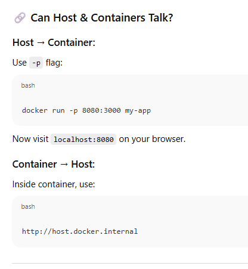

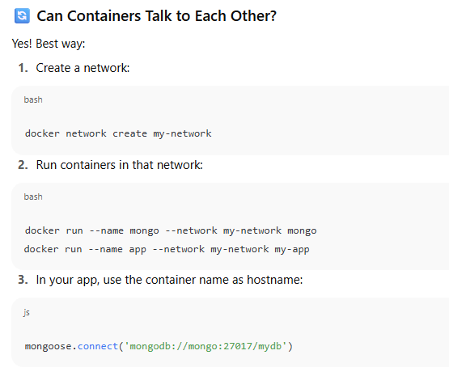


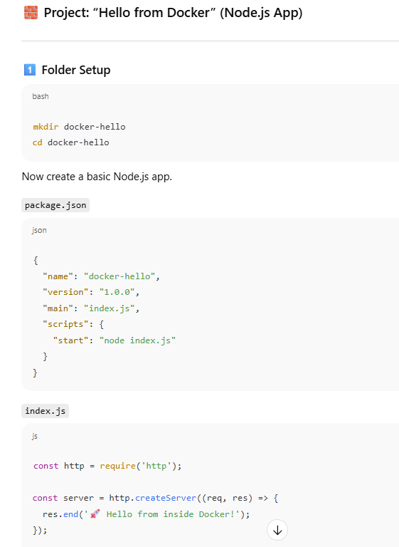

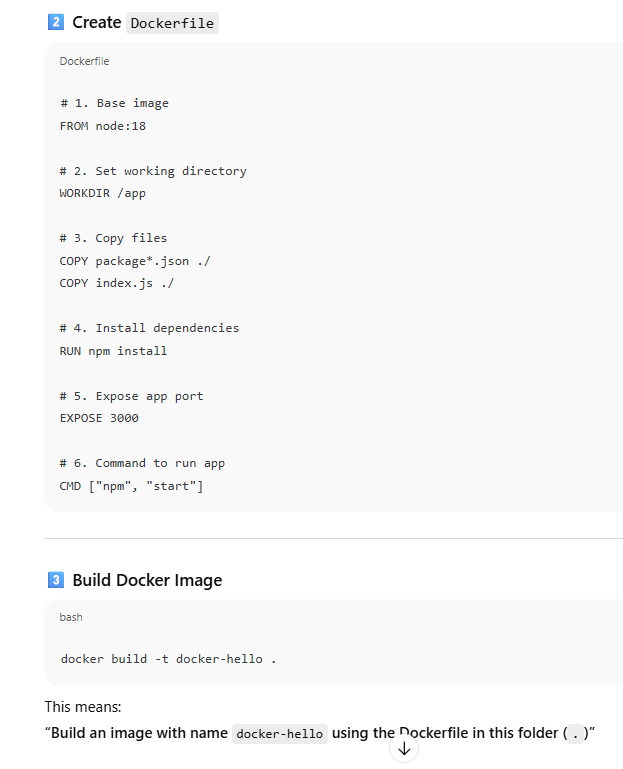

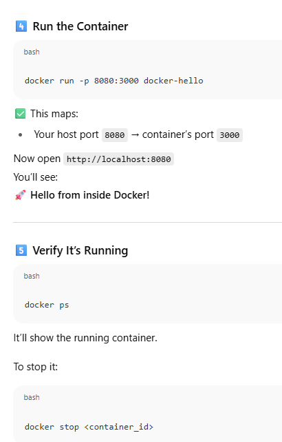

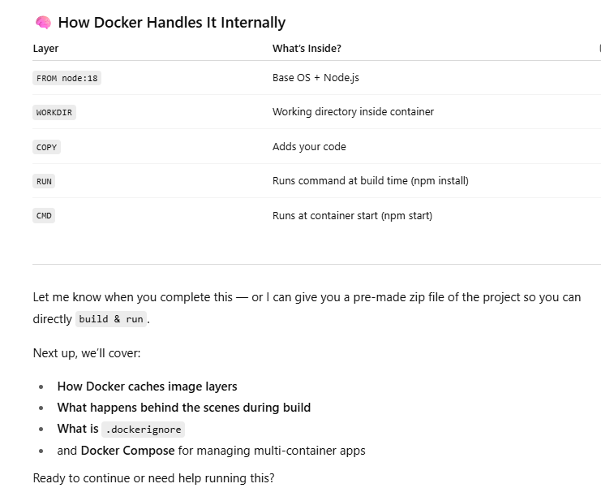


## 🆚 Docker Image vs Docker Container

|Aspect|**Docker Image** 📦 (Frozen Cake)|**Docker Container** 🍽️ (Cake on Plate)|
|---|---|---|
|**Definition**|Read-only, packaged snapshot of your app|A running, isolated instance created from an image|
|**State**|Static / not running|Dynamic / actively running|
|**Created by**|`docker build` (from a Dockerfile)|`docker run` (from an image)|
|**Persistence**|Does not change once built|Can have temporary writable changes|
|**Use case**|Acts as a template or mold|Used to run and test actual applications|
|**Filesystem**|Read-only|Has a writable layer added on top|
|**Multiple instances**|One image can spawn many containers|Each container is an independent runtime|
|**Analogy**|A frozen cake in the freezer|That cake served and being eaten|

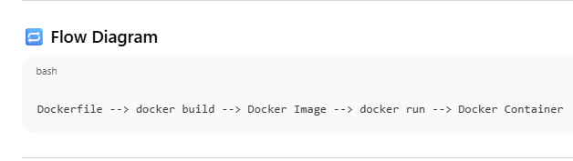


## ❓ WHY install the official Node.js image?

Because:

- ✅ You want a **clean, portable, isolated environment** with Node.js already installed.
    
- ✅ You don’t want to worry about OS differences or manually installing Node.js on every server or dev machine.
    
- ✅ You’re building a Node.js app and want to **package and run it inside a container**.
    

📦 Official Docker images are **trusted base environments** provided by Node.js team (on Docker Hub), pre-configured and tested.


## 🚀 BASIC DOCKER COMMANDS

### 🔧 Image Commands

|Command|Description|
|---|---|
|`docker build -t <name> .`|Build an image from Dockerfile in current directory|
|`docker images`|List all Docker images on your system|
|`docker rmi <image_id>`|Remove an image|

---

### 🚀 Container Commands

|Command|Description|
|---|---|
|`docker run <image>`|Run a container from an image|
|`docker run -it <image>`|Run interactively (like a terminal)|
|`docker run -d <image>`|Run in detached mode (in background)|
|`docker run -p 8080:3000 <image>`|Map host port 8080 to container port 3000|
|`docker run --name <container_name> <image>`|Give your container a name|

---

### 🔍 Container Info

|Command|Description|
|---|---|
|`docker ps`|Show **running** containers|
|`docker ps -a`|Show **all** containers (even stopped)|
|`docker logs <container_id>`|View container logs|
|`docker inspect <container_id>`|Get low-level details about container|

---

### 🛑 Manage Containers

|Command|Description|
|---|---|
|`docker stop <container_id>`|Stop a running container|
|`docker start <container_id>`|Start a stopped container|
|`docker restart <container_id>`|Restart container|
|`docker rm <container_id>`|Remove a container|
|`docker exec -it <container_id> bash`|Open bash shell **inside** a running container|

To run the docker image of node which we can pull easily!!

### 🔹 `docker run`

This tells Docker to start a new container from a given image.

---

### 🔹 `-it`

These are two options combined:

- `-i`: Keep STDIN open (interactive mode)
    
- `-t`: Allocate a pseudo-terminal (like a command prompt)
    

👉 Useful for **running commands** and seeing **output live**.

---

### 🔹 `--rm`

This deletes the container **automatically after it exits**.

📌 Use when you **don’t want leftover containers**.


## 🧠 `-it` = `-i` + `-t`

These are **two separate flags** that are commonly used together when you want to **interact with the container via the terminal**.


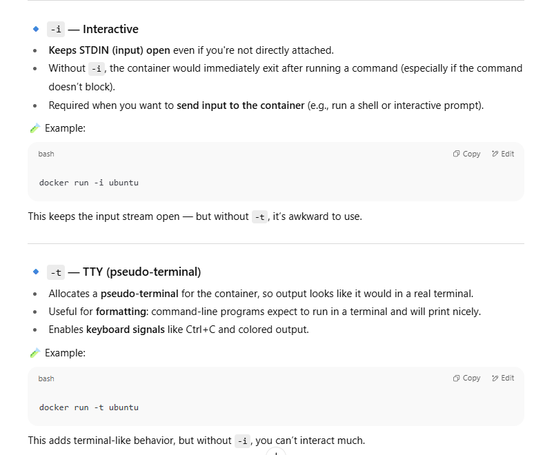


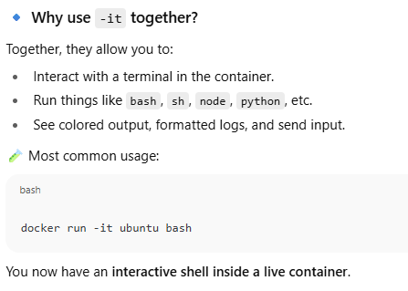

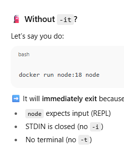


The `docker` command is the primary command-line interface (CLI) tool used to interact with Docker, a platform for developing, shipping, and running containers.

## Main Structure

The typical format for a Docker command is:

`docker [COMMAND] [OPTIONS] [ARGUMENTS]`


- **COMMAND:** The task you want Docker to perform (like `run`, `ps`, `images`).
    
- **OPTIONS:** Flags that modify the command’s behavior (like `-it`, `--rm`).
    
- **ARGUMENTS:** Additional information needed for the command (such as image names or container IDs)

## Common Docker Commands Explained

- `docker run IMAGE`: Creates and starts a new container from the specified image (e.g., `docker run alpine:3.18.2`).
    
    - `-it`: Runs the container in interactive mode with a terminal session.
        
    - `--rm`: Automatically removes the container after it exits.
        
- `docker ps`: Lists running containers.
    
- `docker ps -a`: Lists all containers, including stopped ones.
    
- `docker images`: Shows available images on your local machine.
    
- `docker ls`: While not a standalone command, often appears with options (for example, listing volumes or containers).
    
- `docker exec`: Runs a command inside an already running container.
    
- `docker stop CONTAINER`: Stops a running container.
    
- `docker rm CONTAINER`: Removes a stopped container.
    
- `docker rmi IMAGE`: Removes a Docker image.


##  1.`docker run --detach -it alpine:3.18.2`

- **Creates and starts a new Docker container** from the `alpine:3.18.2` image.
    
- `--detach`: Runs the container in the background (detached mode).
    
- `-it`: Allocates an interactive terminal, allowing for user input and output if you attach later.
    

## 2. `docker ps`

- **Lists all running containers**, showing details like container ID, image used, uptime, and names.
    

## 3. `docker attach <CONTAINER_ID>`

- **Re-attaches your terminal to a running container**, so you can interact with its shell.
    

## 4. Linux commands inside container (`ls`, `exit`)

- `ls`: Lists files and directories in the current directory (inside the container).
    
- `exit`: Exits the shell session in the container.
    

## 5. `docker rm <CONTAINER_NAME>`

- **Removes a stopped container**. The container must be stopped before removal.

```docker
docker run -it --detach --name custom-node node
```

## Breakdown:

- **docker run**: Starts a new Docker container.
    
- **-it**: Allocates an interactive terminal session. This allows you to interact with the container, though it’s more common in attached mode.
    
- **--detach**: Runs the container in the background (“detached mode”).
    
- **--name custom-node**: Assigns the name `custom-node` to your container for easier reference.
    
- **node**: The image to use—here, it uses the official “node” image from Docker Hub.

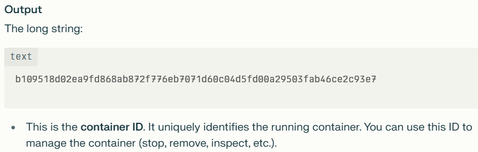

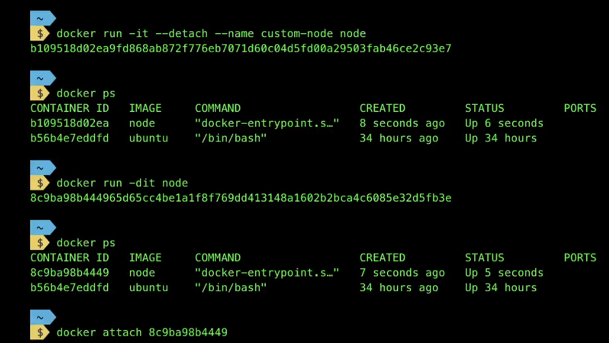


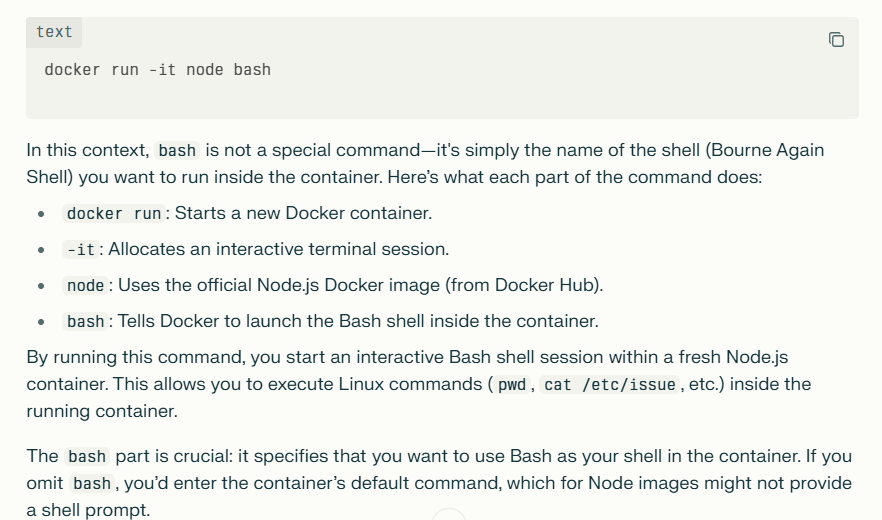

The key difference between `docker run -it node` and `docker run -it node bash` lies in _what command is executed_ when the container starts:

## 1. `docker run -it node`

- **What happens:** This starts a new container from the official `node` image and runs its _default command_.
    
- **Default command (ENTRYPOINT):** For the Node image, the default is to launch the Node.js REPL (interactive Node console). You see a prompt like `>`, where you can type JavaScript code directly.
    
- **Terminal:** You’re interacting with _Node.js_, not a Linux shell.
    

## 2. `docker run -it node bash`

- **What happens:** This starts the same `node` image, but _overrides the default command_ and instead runs `bash` (the Bash shell).
    
- **Terminal:** Now, you get a real Linux shell prompt (`root@...:/#`), where you can run Linux commands (`ls`, `pwd`, `cat`, etc.).
    
- **Bash as shell:** You’re in a _full Linux environment_, able to run any shell commands or scripts inside the container.


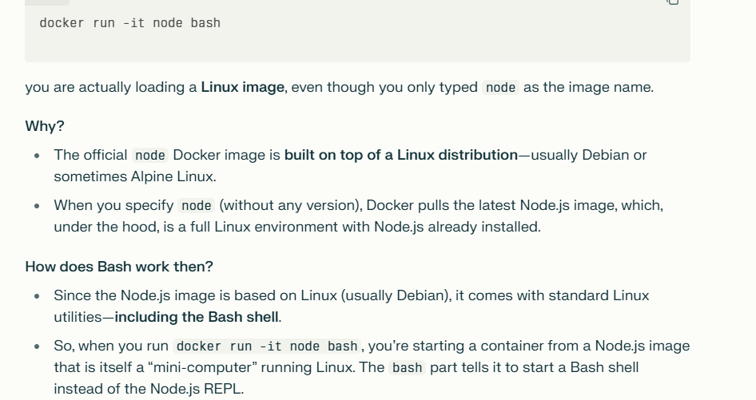


In Docker commands, **tags** are optional labels attached to Docker images to specify a particular version or variant of that image. A Docker image name typically looks like this:

`<repository>:<tag>`

- The **repository** is the name of the image (for example, `node` or `ubuntu`).
    
- The **tag** identifies a specific version or variant of that image (for example, `18.04`, `3.18.2`, or `latest`).
    

If no tag is provided, Docker defaults to the tag `latest`.

## Why are tags important?

- They help distinguish between different versions of the same image. For example, `ubuntu:20.04` and `ubuntu:18.04` are different versions of the Ubuntu image.
    
- Tags allow precise control over which image version you use when running or pulling an image.
    
- They can represent different builds, environments (like `dev`, `prod`), or configurations (like `alpine` vs. `buster` variants).


## Examples:

- `docker run node` is equivalent to `docker run node:latest` — it runs the latest Node.js image.
    
- `docker run alpine:3.18.2` runs the Alpine Linux image specifically tagged version 3.18.2.
    
- `myapp:v1` and `myapp:v2` would be two different tagged versions of your custom image called `myapp`.


Tags in Docker commands identify specific versions or variants of images, allowing you to manage and run the exact image you want. They are written after the image name following a colon (`:`). Without a tag, Docker assumes the `latest` tag by default.

This tagging system is crucial for version control, deployment consistency, and collaboration when using Docker images.

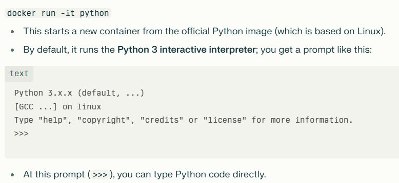


## `docker run -it python bash`

- This command starts the same Python image, **but overrides the default command** and launches the `bash` shell instead.
    
- Now you get a **Linux shell prompt** (`root@...:/#`), not a Python prompt.
    
- From here, you can run Linux commands. Now if do python3 now it will be the same  as of the above!!

## LINUX COMES WITH THE IMAGES 
- **Docker images are layered:** The `node` image is built _on top of_ a base Linux image, typically **Debian**, **Ubuntu**, or **Alpine**.
    
    - The base layer is a minimal operating system (Linux).
        
    - On top of that, packages like Node.js, npm, and other tools are added.
        
- **You never separately install Linux:** When you specify `docker run node`, Docker automatically pulls the full image, which _includes both_ Node.js and a minimal Linux OS.
    
- **That’s why:** When you check `docker inspect node`, you see environment variables like `PATH`, `PYTHON_VERSION`, etc., plus OS details (`"Os": "linux"`). It’s because you’re actually running a full Linux system—just a stripped-down one custom-built for containers.


## 1. What is `docker inspect`?

The `docker inspect` command displays **detailed, low-level information** about Docker objects. These can be:

- Containers
    
- Images
    
- Networks
    
- Volumes
    
- Plugins
    
- Nodes
    

It returns this information in **JSON format by default**, giving you a complete snapshot of how an object is configured and its current state


## 3. What Information Can You Get from `docker inspect`?

The output includes:

- **Config details**: Environment variables, commands, labels, entrypoint, etc.
    
- **Image details**: Parent image, creation time, architecture, tags.
    
- **Container details**: Mounts, network settings (IP/MAC address), volumes, ports, restart policies, state (running, exited, paused), log path.
    
- **Network**: Driver, subnet, connected containers, IPAM config.
    
- **Volumes**: Mount point, usage.
    

This is essential for troubleshooting (Why isn’t my app reachable? What volumes or networks are attached?), automation, debugging, or understanding how something was set u


## 1. `docker run -dit python`

- **Purpose:** Starts a new container from the `python` image in detached mode and with interactive terminal allocation.
    
    - `-d`: Runs the container in the background (detached mode).
        
    - `-i`: Allocates an interactive STDIN stream (allowing you to keep input open).
        
    - `-t`: Allocates a pseudo-TTY (gives you a terminal interface).
        
- **Result:** A new container is started, running the default command (`python3` interpreter), and you’ll get the container ID in the output.
    
- **Use case:** Launch background services or shells without immediately attaching to them[](https://docs.docker.com/reference/cli/docker/container/run/)[](https://www.geeksforgeeks.org/devops/docker-run-command/)[](https://refine.dev/blog/docker-run-command/)[](https://phoenixnap.com/kb/docker-run-command-with-examples)[](https://tutorials.ducatindia.com/docker/docker-run-command).

## 2. `docker ps`

- **Purpose:** Lists all running containers on your system.
    
- **Output columns:**
    
    - `CONTAINER ID`
        
    - `IMAGE`
        
    - `COMMAND` (entrypoint running in container)
        
    - `CREATED` (how long ago container started)
        
    - `STATUS` (running, paused, exited, etc.)
        
    - `PORTS` (any ports mapped to host)
        
    - `NAMES` (auto-generated or user-provided container name)
        
- **Common options:**
    
    - `docker ps -a`: Shows all containers, including stopped ones.
        
- **Use case:** Monitor or manage current containers, check health/status, find container IDs for later command


## 3. `docker pause <container_id>`

- **Purpose:** Suspends (freezes) all processes inside the specified container(s), using the Linux cgroups freezer.
    
- **How it works:**
    
    - All running processes are put “on hold” by Docker.
        
    - The container’s state, memory, open files/connections are preserved.
        
    - The container’s `STATUS` becomes “Paused.”
        
- **Why use it?**
    
    - Temporarily halt processing for maintenance, resource saving, or tests—without losing state.
        
    - Does not stop or kill the container

##  `docker unpause <container_id>`

- **Purpose:** Resumes (unfreezes) all processes in a container that was previously paused.
    
- **Effect:** The container continues running exactly where it left off, with all resources and connections intact.
    
- **Use case:** Quickly bring containers back online after maintenance or intentional pause


## 5. `docker kill <container_name|container_id>`

- **Purpose:** Immediately _forcibly_ terminates one or more running containers.
    
    - By default, sends the **SIGKILL** signal (cannot be caught or ignored).
        
    - Optionally, you can specify a different signal with `--signal`.
        
- **Effect:** The container’s process (and thus the container) stops instantly, without giving apps a chance to shut down gracefully.
    
    - All resources and open files are closed abruptly.
        
- **When to use:** If a container is unresponsive, needs instant shutdown, or won’t stop with `docker stop`.
    
- **Caution:** Data loss (unwritten buffers) or corruption can occur for stateful applications


## Running `docker run -it ubuntu`

- This runs the Ubuntu image interactively and executes the **default command** configured for the image.
    
- For official Ubuntu images, the default command is typically `/bin/bash` anyway.
    
- So you get an interactive Bash shell prompt immediately.
    

## Running `docker run -it ubuntu bash`

- This explicitly overrides the default command and runs `/bin/bash`.
    
- You get the same interactive Bash shell prompt.


## `docker run`

- **Purpose:** Creates and starts a **new container** from the specified image.
    
- **How to Use:**
    
    text
    
    `docker run [OPTIONS] IMAGE [COMMAND]`
    
- **What You Mention:**
    
    - You specify the **image name** (e.g., `ubuntu`, `node`, `python`), not a container.
        
- **What It Does:**
    
    - Pulls the image (if missing), creates a new container, and starts it with the **optional command** or the image’s default.
        
- **Example:**
    
    text
    
    `docker run -it ubuntu`
    
    (Creates and runs a new container from the `ubuntu` image.)
    

## `docker exec`

- **Purpose:** Runs a **new command** in an **already running container**.
    
- **How to Use:**
    
    text
    
    `docker exec [OPTIONS] CONTAINER [COMMAND]`
    
- **What You Mention:**
    
    - You specify an **existing container’s name or ID**.
        
- **What It Does:**
    
    - Executes the given command inside the existing container (without creating or starting a new one).
        
- **Example:**
    
    text
    
    `docker exec -it my_ubuntu_container ls`
    
    (Runs `ls` inside the `my_ubuntu_container`.)
    

## Key Differences Table

|Command|You Specify|What It Does|When to Use|
|---|---|---|---|
|`docker run`|**Image name**|Creates and starts a _new container_|Start a new environment|
|`docker exec`|**Container name/ID**|Runs command in _existing container_|Access a running container|

**Summary:**

- Use `docker run` with **image names** to start new containers.
    
- Use `docker exec` with **container names or IDs** to interact with containers that are **already running**.


## 1. `docker build .` and `docker build -t my-basic-image .`

- **Purpose:** Builds a Docker image from a Dockerfile located in the current directory (`.`).
    
- **Process:**
    
    - Docker reads instructions from a file named `Dockerfile`.
        
    - It creates an image layer by layer according to the commands in the Dockerfile. Each step outputs its status.
        
- **Usage:**
    
    - `docker build .` simply builds the image.
        
    - `docker build -t my-basic-image .` does the same build, but also tags (names) the image as `my-basic-image`, making it easier to reference later.
        

## Key flags:

- `-t` or `--tag`: Assigns a name (and optionally a tag) in the `name:tag` format. Example: `my-basic-image:latest`.


## 2. `docker run -it IMAGE_ID`

- **Purpose:** Runs a container from a specified image.
    
- **Options:**
    
    - `-i` (`--interactive`): Keeps STDIN open, so you can interact with the container.
        
    - `-t` (`--tty`): Allocates a pseudo-terminal, making interactive work in a shell possible.
        
- **Usage:**
    
    - `docker run -it 848435386cfa`: Runs the container in interactive mode.
        
    - Output (`100`): This container appears to execute a script or command that prints `100` (as defined by the Dockerfile).
        
    - `docker run -it 848435386cfa bash`: Runs a new shell (`bash`) inside the container, giving you a shell prompt to explore the container interactively.


## 3. Exploring the Container (`cat /etc/issue`)

- **Purpose:** Reads and displays system information.
    
- **Command:**
    
    - `cat /etc/issue`: Shows the Linux distribution information inside the container. Useful to know what OS or base image the container uses.
        

## 4. Exiting the Container (`exit`)

- **Purpose:** Terminates the interactive shell session, thereby stopping the container if no other process is running.
    
- **Typical result:** You return to the host machine’s shell


## 5. `docker rmi IMAGE_ID`

- **Purpose:** Removes a Docker image from the local storage.
    
- **Common issue:** You may get an error if the image is being used by a running or stopped container.
    
    - Example error: “unable to delete … image is being used by stopped container …”
        
- **Reason:** Docker prevents image deletion if it's still associated with a container (running or exited).
    

## 6. Forcibly Removing an Image (`docker rmi IMAGE_ID -f`)

- **Purpose:** Forces removal of the image even if containers (stopped or running) depend on it.
    
- **Usage:**
    
    - `docker rmi 848435386cfa -f`
        
- **Effect:** The image is deleted, and any containers using it are left in a dangling state or are also removed depending on Docker’s handling.


## 7. `docker run -it my-basic-image:latest`

- **Purpose:** Runs a container from a tagged image (`my-basic-image:latest`) in interactive mode, as explained above.
    
- **Typical outcome:** If the image entrypoint/script prints output (like `100`), you’ll see it in your terminal.


## Summary Table

|Command|Description|Common Usage Scenario|
|---|---|---|
|`docker build .`|Builds Docker image from current directory’s Dockerfile|Create a new image from a Dockerfile; default (unnamed) image tag|
|`docker build -t NAME .`|Builds and _tags_ the image for easy referencing|Build and name versioned/project-specific images|
|`docker run -it IMAGE`|Runs a container from an image in interactive mode with TTY|Test image, run shell, experiment interactively|
|`docker run -it IMAGE bash`|Starts a bash shell inside the running container|Open a terminal inside the container for inspection/debugging|
|`cat /etc/issue`|Displays Linux distribution inside a container|Learn base image OS in container|
|`exit`|Exits interactive container shell|Stop interactive session|
|`docker rmi IMAGE`|Removes Docker image from your local system|Clean up unused images|
|`docker rmi IMAGE -f`|Forcefully removes image, even if in use by stopped/running containers|Remove images blocked by dependencies|
|`docker run -it my-basic-image`|Runs a container from a customly named image, interactively|Start container from your own image|

## Additional Tips

- To see all images: `docker images` or `docker image ls`.
    
- To see all containers (including stopped): `docker ps -a`.
    
- To remove stopped containers: `docker rm CONTAINER_ID`.
    
- To prune unused images and containers: `docker system prune`


Dockerfile should have **no extension** when you create it in VS Code or any code editor. By industry convention, the file is simply named `Dockerfile` (no `.txt`, `.docker`, or any other extension). This naming is important because Docker's build tools look specifically for a file called `Dockerfile` in your project directory when building images, unless you specify a different file name with the `-f` flag.

## Why Might We Delete `node_modules` Before Building the Docker Image?

- **Platform Compatibility:** The `node_modules` folder may contain binaries or native modules compiled specifically for your host OS (e.g., Windows, Mac), but the Docker image likely uses a Linux environment. Copying host modules could cause errors.
    
- **Clean Install:** It’s better practice to let Docker install dependencies inside the image using `npm ci` or `npm install`, ensuring only the necessary, production-specific modules are included.
    
- **Image Size/Layering:** Excluding `node_modules` by using a `.dockerignore` file keeps images lean, reduces layer sizes, and avoids caching issues.


**Workflow:**

- Add `node_modules` to `.dockerignore` (not shown in your images, but strongly recommended).
    
- When you `COPY . .`, everything except ignored files/folders goes into the image.
    
- Then run `npm ci` to install fresh, compatible modules inside the image.
    


## What Does the `CMD` Instruction Do in Dockerfile? How, Why, and When Does It Work?

## What does it do?

- The `CMD` command specifies the default command to run when a container starts from the image.
    
- Example from your Dockerfile:
    
    text
    
    `CMD ["node", "index.js"]`
    
    This tells Docker: “when you start a container from this image, run `node index.js`.”
    

## How does it work?

- During build time, `CMD` just records the intended instruction.
    
- At container runtime, unless you specify a different command, Docker executes the CMD (in this case, starts your Node.js server).

## Why does it work?

- Docker containers need a process to run when started; usually, this is your application’s entrypoint (like a Node.js server for web backends). `CMD` provides that default process.
    
- If you run the container with a different command, Docker overrides the `CMD`.
    

## When does it work?

- `CMD` runs whenever the container is started _without_ a different command.
    
- If you run with `docker run my-image some-other-command`, it replaces `CMD`.
    
- If you just run `docker run my-image`, Docker uses the CMD.
    

## What does it do practically?

- In your case, it boots the server defined in `index.js`.


## How Can My Machine Contact the Server Inside the Container? (Networking & Ports)

By default, your Node.js app inside the container listens on port `3000`.  
**However, this port is inside the container—not accessible from your own machine unless mapped.**

- **Exposing the port:** Use the `-p` or `--publish` option to map container port to host port:
    
    text
    
    `docker run -it --init --publish 3000:5000 my-express-server:latest`
    
    This maps your host’s port **3000** to the **container’s 5000** (typo in image, should likely be `3000:3000` if the app uses 3000 inside and outside—but mapping is flexible).
    
    - Now, visiting `localhost:3000` on **your machine** will forward requests inside the container (to your Node.js server).


