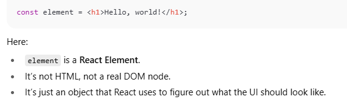
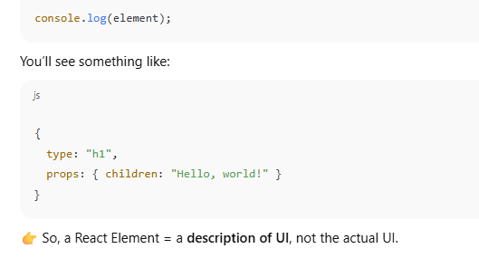
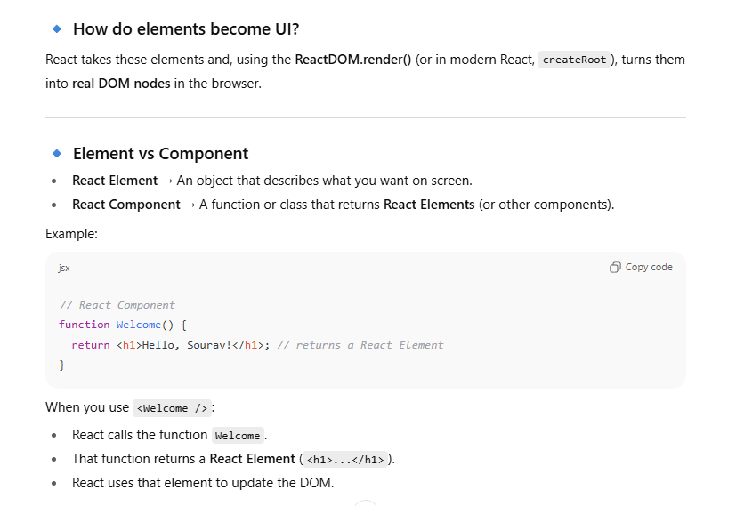
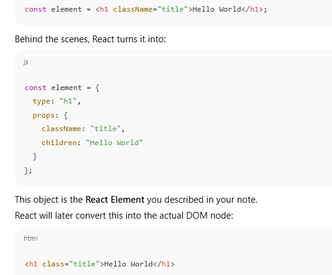
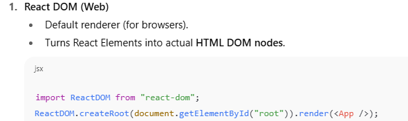
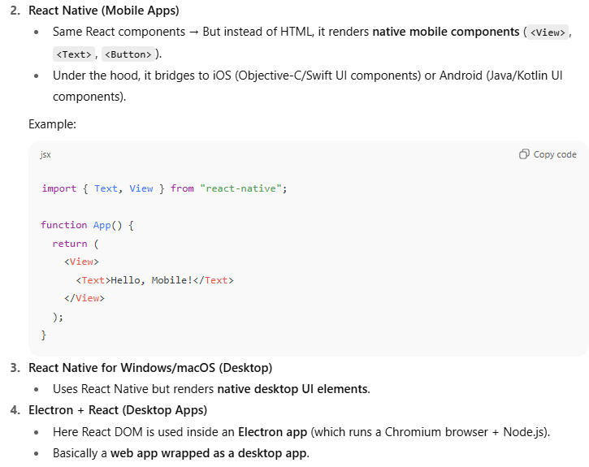
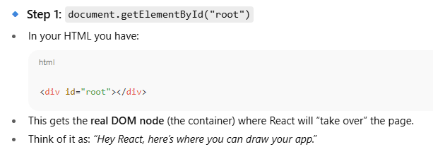
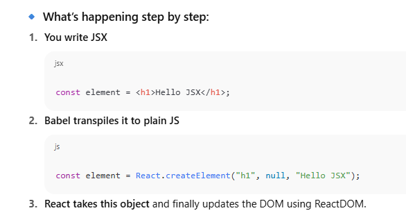
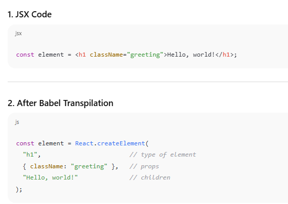
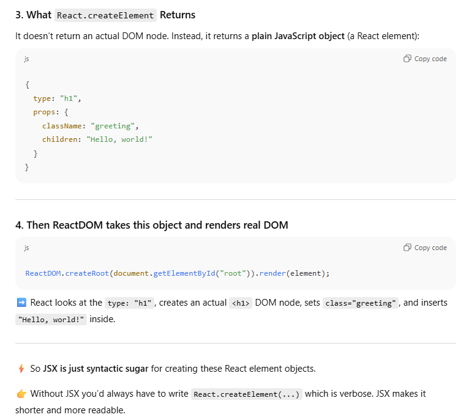

The rise of **React, Angular, Vue, and other libraries/frameworks**.

In plain **JavaScript (vanilla JS)**, even something as simple as a **To-Do App** requires:

- Selecting DOM elements
    
- Adding event listeners
    
- Manually updating the DOM when state changes
    
- Writing boilerplate for creating/removing tasks
    

For small apps it’s fine, but as soon as the app grows, **DOM manipulation becomes messy, repetitive, and error-prone**.

That’s why developers started using **libraries** like **React**:


That’s the whole point of these technologies: they exist to make developers’ lives easier, not harder. Let’s break it down simply:

### 🔹 Why libraries/frameworks were created

- **Ease of writing code** → Less boilerplate, fewer bugs.
    
- **Scalability** → Handling big, complex apps without code becoming a mess.
    
- **Maintainability** → Easier to update, fix, or extend code later.
    
- **Reusability** → Components/modules can be reused across the app.
    
- **Better developer experience (DX)** → Cleaner syntax, helpful tools, structured patterns.
    

### 🔹 Examples

- **React / Vue / Angular** → For building **interactive UIs** without manually updating DOM.
    
- **Express.js / Django / Spring** → For writing **backend APIs** quickly without reinventing HTTP handling.
    
- **Prisma / Sequelize / Hibernate** → For working with **databases** without writing raw SQL everywhere.
    
- **Tailwind CSS / Bootstrap** → For styling without writing tons of custom CSS.
    

👉 The idea is simple:  
**Developers can focus on business logic and features instead of wasting time on repetitive low-level details.**


A **Single Page Application (SPA)** is a type of web app that **loads a single HTML page once** and then **updates the page dynamically** as the user interacts with it — instead of reloading the whole page from the server each time.

### 🔹 How a Normal Website (Multi-Page Application, MPA) Works

1. You click a link → Browser sends request to server.
    
2. Server sends back a **whole new HTML page**.
    
3. Browser reloads the page completely.  
    ❌ This causes **full-page reloads** (slower, less smooth).
---
### 🔹 How a Single Page Application (SPA) Works

1. You load the app → Browser downloads **one main HTML file**, plus **JavaScript**.
    
2. The **JavaScript handles navigation** and updates the **DOM dynamically**.
    
3. Data is fetched from the server using **APIs (AJAX/Fetch/GraphQL)** without full reloads.  
    ✅ This makes it feel **fast and app-like**.


Whatever done here is done using js, single html download hoga and any change will be  driven by js!!


### 🔹 Example

- **MPA**: Traditional sites like Wikipedia, old e-commerce sites. Every click reloads the page.
    
- **SPA**: Gmail, Google Docs, Facebook, Twitter — when you click around, only the content updates, not the whole page.
    

---

### 🔹 Benefits of SPAs

- Faster navigation (no full reloads).
    
- Better user experience (smooth, app-like).
    
- Reusable components (React, Vue, Angular excel here).
    

### 🔹 Downsides of SPAs

- Initial load can be heavy (lots of JS).
    
- SEO is harder (because content is rendered by JS).
    
- Needs client-side routing & state management.


## 🔹 What is Component-Driven Architecture?

It’s a **way of building applications by breaking the UI into small, reusable, independent building blocks called _components_**.

Each **component**:

- Has its own **UI** (HTML/JSX).
    
- Has its own **logic** (JavaScript functions, state).
    
- Can be **reused** across the app.
    
- Can be **composed together** to build bigger features.
    

Think of components like **Lego blocks** 🧱 → each block does one thing, and by combining them, you build an entire app.


## 🔹 Why React Uses CDA

In traditional web dev (vanilla JS or jQuery):

- UI code (HTML), styling (CSS), and logic (JS) are often scattered.
    
- Reusing parts of the UI is hard.
    
- As apps grow, code becomes messy.
    

React solves this by saying:  
👉 “Everything is a component.”


## 🔹 Benefits of Component-Driven Architecture

1. **Reusability** → Make once, use everywhere.
    
2. **Maintainability** → Smaller pieces are easier to debug and update.
    
3. **Scalability** → Big apps are built from smaller units.
    
4. **Separation of concerns** → Each component manages its own state & logic.
    
5. **Consistency** → Same component = same behavior everywhere.
    

---

## 🔹 Real-life Analogy

Think of a **car** 🚗:

- Wheels, engine, seats, dashboard = **components**.
    
- Put together → you get the car (the **app**).
    
- If one part breaks, you replace just that part (e.g., a wheel) without rebuilding the whole car.


Bas ekbar code karlo component ko! bas fir bar bar use karte raho!! Ex. Sare linkedin Posts same type k hote hain!


## REACT ELEMENT 

👉 A **React Element** is a **plain JavaScript object** that describes:
A **React Element** is the **smallest building block** in React.  
It’s basically a **plain JavaScript object** that describes **what you want to see on the screen**.

- The **type** of the DOM node (e.g., `"div"`, `"h1"`, `"button"`) or a component.
    
- The **properties/attributes (props)** to be applied.
    
- The **children** (other elements inside it).


React then uses this description to:

1. Decide **what should appear on screen**.
    
2. Efficiently update the **real DOM** using its **Virtual DOM diffing algorithm**.









 SIMPLE STRUCTURE OF REACT ELEMENT



## Core Idea: React is UI Logic, Not Platform

React itself doesn’t know if you’re building for **browser**, **mobile**, or **desktop**.  
It only cares about:

- **Components** (functions/classes returning React Elements).
    
- **Elements** (objects describing UI).


👉 But to actually render something, React needs a **Renderer**.


## 🔹 Different Renderers for Different Platforms







```java
                React Core (logic: components, state, hooks)
                         |
        -------------------------------------
        |                                   |
    React DOM                          React Native
   (web renderer)                      (mobile renderer)
        |                                   |
   Browser DOM                        Native UI (Android/iOS)

```

- **Shared layer** = React Core (business logic + component architecture).
    
- **Platform-specific layer** = Renderer (DOM vs Native).

The **common logic** (like how components, props, state, hooks, context, reconciliation, and virtual DOM diffing work) lives in **React Core**.

Then, depending on the platform:

- **React DOM** → takes those React Elements and renders them as **HTML DOM nodes** in the browser.
    
- **React Native** → takes those same React Elements and renders them as **native mobile UI components** (`View`, `Text`, `Button`) on Android/iOS.

```HTML
<!DOCTYPE html>
<html>
  <head>
    <title>React CDN Example</title>
    <!-- React Core -->
    <script src="https://unpkg.com/react@18/umd/react.development.js"></script>
    <!-- React DOM -->
    <script src="https://unpkg.com/react-dom@18/umd/react-dom.development.js"></script>
  </head>
  <body>
    <div id="root"></div>

    <script>
      const element = React.createElement("h1", null, "Hello, world!");
      ReactDOM.createRoot(document.getElementById("root")).render(element);
    </script>
  </body>
</html>

```


- **HTML loads**  
    Browser reads your HTML and starts executing `<script>` tags in order.
    
- **React Core script loads**
    
    - `react.development.js` defines the **React global object** (`window.React`).
        
    - Inside it, you get all the core features:
        
        - `React.createElement`
            
        - `useState`, `useEffect`, and other hooks
            
        - Component handling
            
        - Virtual DOM + reconciliation logic
            
    
    👉 But note: React Core alone **doesn’t know how to draw anything on screen**.
    
- **React DOM script loads**
    
    - `react-dom.development.js` defines the **ReactDOM global object** (`window.ReactDOM`).
        
    - It provides the renderer for the **web** (browser DOM).
        
    - Key methods:
        
        - `ReactDOM.createRoot(container).render(element)`
            
        - `ReactDOM.hydrate()` (for server-side rendering)
            
    
    👉 ReactDOM takes the React Elements created by React Core and actually **creates/updates the real DOM nodes** inside the browser.


```
ReactDOM.createRoot(document.getElementById("root")).render(element);
```



### 🔹 Step 2: `ReactDOM.createRoot(...)`

- This tells React to create a **root container** inside that DOM node.
    
- The **root** is like React’s “workspace” for managing updates and rendering inside that container.
    
- New in React 18 → replaces the old `ReactDOM.render()`.
    
- It enables new features like **concurrent rendering** (better scheduling, smoother updates).
    

So after this, React knows:  
👉 _“I own this DOM area (the #root div). Anything inside, I’ll manage._


### 🔹 Step 3: `.render(element)`

- Now you give React **what you want to show**.
    
- Here, `element` is a **React Element object** (like `{ type: "h1", props: { children: "Hello" } }`).
    
- React takes this element and:
    
    1. Puts it into the **Virtual DOM**.
        
    2. Compares it with the current Virtual DOM (diffing).
        
    3. Creates the **real DOM nodes** (`<h1>Hello</h1>`) only where needed.
        
    4. Injects those nodes into the container (`#root`).

### 🔹 Analogy

Think of it like:

1. You have an **empty canvas** (`<div id="root">`).
    
2. `createRoot()` = giving React the **canvas + paintbrush**.
    
3. `.render(element)` = React starts drawing what you told it (`element`) on the canvas.


## What is a “root” in React?

A **root** is the **entry point between React and the real DOM**.  
It’s a special object that tells React:

- _“This area of the DOM belongs to me.”_
    
- _“Anything inside this container, I (React) will control, update, and clean up.”_
    

Without the root, React wouldn’t know **where** to render or **how** to manage updates.


## 🔹 Library vs Framework

- **Library** → A **toolbox**. You pick and choose functions/components to use inside your app.
    
- **Framework** → A **whole structure**. It decides how your app should be built, and you plug your code into it.
    

👉 Rule of thumb:

- In a **library**, **you control the flow** of the app.
    
- In a **framework**, **the framework controls the flow** (called _Inversion of Control_).


## 🔹 Why React is a **Library**

1. **Focus** → React only solves one problem: **building UI**.
    
    - It doesn’t include routing, state management, HTTP requests, or backend communication by default.
        
    - For those, you use extra libraries (e.g., React Router, Redux, Axios).
        
2. **Flexibility** → You decide:
    
    - How to structure your app.
        
    - Which libraries to add for routing, data, forms, etc.
        
    - Example: some people use Redux, some use Zustand, some just use React Context.
        
3. **Control flow** →
    
    - You call `ReactDOM.createRoot(...).render(...)`.
        
    - You decide when and where to render.
        
    - React doesn’t dictate folder structures or app lifecycle beyond the rendering process.


## 🔹 Framework Example (Angular)

Angular is a **framework** because:

- It gives you everything out of the box:
    
    - Routing, state management, HTTP, testing tools, CLI.
        
- It enforces a **strict structure** (modules, services, components).
    
- The framework **controls the flow**: you just fill in pieces.


## 🔹 First Principle

React **does not need JSX**.  
React only needs


```js
const element = React.createElement("h1", { className: "title" }, "Hello, Sourav!");
```


## 🔹 But why JSX then?

Think about what happens when your UI gets bigger.

```js
const app = React.createElement("div", null,
  React.createElement("h1", null, "My App"),
  React.createElement("p", null, "This is a paragraph"),
  React.createElement("ul", null,
    React.createElement("li", null, "Item 1"),
    React.createElement("li", null, "Item 2"),
    React.createElement("li", null, "Item 3")
  )
);

```

### With JSX
```jsx
const app = (
  <div>
    <h1>My App</h1>
    <p>This is a paragraph</p>
    <ul>
      <li>Item 1</li>
      <li>Item 2</li>
      <li>Item 3</li>
    </ul>
  </div>
);

```

👉 Both are **exactly the same thing** after compilation.  
But one looks like HTML (easy to read/maintain), and the other looks like a mess of function calls.


## 🔹 Why developers actually choose JSX

1. **Readability**  
    JSX looks like HTML → much easier to reason about when building UI.
    
2. **Maintainability**  
    Nested elements become hard to read without JSX. JSX keeps things tidy.
    
3. **Familiarity**  
    Most front-end devs already know HTML. JSX feels natural.
    
4. **Tooling**  
    Editors (VS Code) give syntax highlighting, autocompletion, error checking in JSX.
    

---

## 🔹 Analogy

- Writing React without JSX is like writing this sentence in **binary (01001000 01001001)**.
    
- Writing with JSX is like writing it in **English ("HI")**.  
    👉 Both mean the same thing, but one is way more human-friendly.
    

---

✅ So the answer:  
We use JSX **not because React requires it**, but because **humans require it** — it makes UI code readable, maintainable, and close to HTML.


## 🔹 JSX (JavaScript XML)

- JSX is a **syntax extension** to JavaScript.
    
- It lets you **write HTML-like code inside JavaScript**.
    
- It is **not valid JS by itself** — browsers don’t understand JSX.
    
- A tool (like **Babel**) **transpiles** JSX into plain JavaScript (`React.createElement`) before the browser runs it.

JSX → (transpilation using Babel) → JavaScript → (executed by browser).


### Why transpilation is needed?

- Browsers **don’t understand JSX**.
    
- They only understand **plain JS**.
    
- Babel acts as a “translator” to convert JSX → JS.










### What React is

- **React is not a programming language.**
    
- It’s a **JavaScript library** for building user interfaces.
    
- At its core, React is just **plain JavaScript functions + objects** that follow some rules.
    

---

### 🔹 What JSX is

- **JSX is not required** to use React.
    
- JSX is just **syntactic sugar** → a nicer way to write `React.createElement(...)`.
    
- JSX code is transpiled (by **Babel**) into **plain JavaScript** that React can understand like the functions we just talked about above 
    

---

### 🔹 Why React works everywhere

- Since **React code after transpilation is pure JavaScript**, it can run:
    
    - in the browser (via ReactDOM),
        
    - on mobile (via React Native),
        
    - even on server-side (Next.js, Node.js).
        

👉 That’s why React is so flexible — because at the end of the day, it’s **just JavaScript objects + functions**.

```
JSX (developer writes)
   ↓ (Babel transpiles)
React.createElement(...) calls (pure JS that contains the react functionlities)  
   ↓ (React library turns into objects)
React Elements (Virtual DOM tree in memory)
   ↓ (ReactDOM)
Real DOM (HTML in the browser)

```


