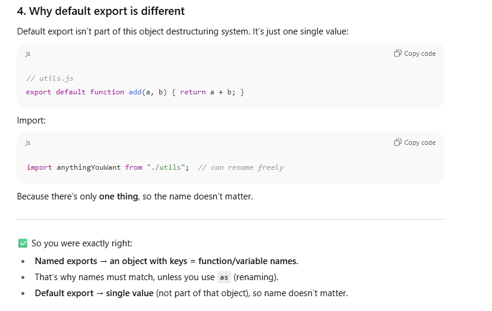
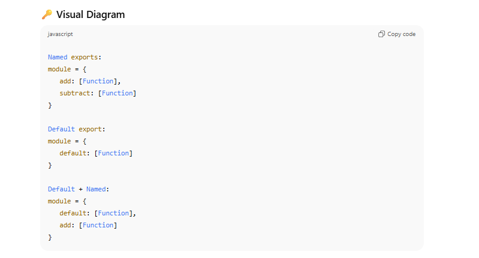
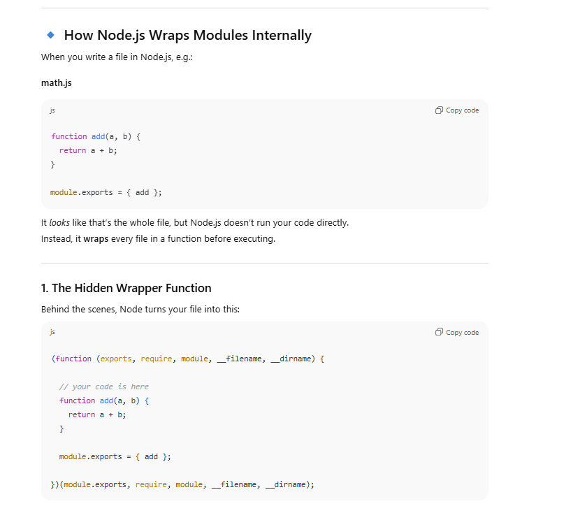

- **Minimalistic frameworks (like Svelte, Solid, etc.)**
    
    - Pros → small bundle size, fast performance, less overhead.
        
    - Cons → fewer built-in tools, smaller ecosystem, you spend more time wiring things up yourself.
        
- **Feature-rich frameworks/libraries (like React, Angular, Next.js, Vue)**
    
    - Pros → huge ecosystem, tons of pre-built libraries/components, great tooling, active community. This means **faster development and shipping** when business deadlines matter.
        
    - Cons → heavier runtime, sometimes more boilerplate, potentially slower than ultra-minimal frameworks.

👉 So when **developer productivity and time-to-market** are the top priority (like in startups or feature-heavy apps), choosing a _minimalistic_ framework might actually **slow you down** despite its performance edge.

That’s why React/Next.js, Angular, and Vue dominate — not because they’re the lightest, but because they **balance speed with developer experience**.


## We usually **don’t start a React project from scratch (with just an HTML file + React script tag)** because:

1. **React needs build tooling**
    
    - JSX isn’t valid JavaScript, so it must be transpiled (with Babel or SWC).
        
    - Modern React apps often use TypeScript, which also needs compilation.
        
    - Bundling, minifying, handling CSS, and optimizing assets all require tooling.
        
2. **Create React App (CRA) / Vite** give you this setup out of the box:
    
    - A **development server** with hot reloading (so changes instantly appear in the browser).
        
    - **Transpilation** (JSX → JavaScript, TS → JS).
        
    - **Bundling** (combines code + dependencies into optimized files).
        
    - **Environment configs** (dev vs prod builds, env variables, etc.).
        
    - **Zero setup** → you don’t waste time configuring Webpack, Babel, etc.
        
3. **Why Vite instead of CRA?**
    
    - CRA uses Webpack (slower builds).
        
    - Vite uses **esbuild + Rollup**, making dev server startup and hot reload much faster.
        
    - Vite is lighter, more modern, and now the preferred way to start new React apps.
        

⚡ In short:

- **CRA (old standard)** → good for learning React basics, but heavy.
    
- **Vite (modern standard)** → much faster, leaner, and better suited for production apps today.


Vite (pronounced **“veet”**, like _vite = fast_ in French) is a **modern frontend build tool** created by Evan You (the creator of Vue.js).

At its core, **Vite is a development server + build system** that makes working with modern JavaScript frameworks (React, Vue, Svelte, etc.) much faster than older tools like Webpack or Parcel.


### 🔑 What Vite does

1. **Development server (super fast)**
    
    - Uses **native ES modules (ESM)** in the browser, so you don’t need to bundle everything before starting.
        
    - Starts almost instantly, no matter how big your app is.
        
    - Uses **esbuild (written in Go)** for lightning-fast transformations (JSX → JS, TS → JS).
        
2. **Production build**
    
    - Uses **Rollup** internally to create optimized bundles for production (tree-shaking, minification, code-splitting).
        
3. **Out-of-the-box features**
    
    - Hot Module Replacement (HMR) → updates only the changed module instantly without refreshing the whole page.
        
    - TypeScript, JSX, CSS, PostCSS, and even Vue/Svelte support built-in.
        
    - Environment variables and mode-based configs (`.env`).


👉 In simple words:  
Vite = **fast dev server** (uses native ESM) + **optimized production bundler** (Rollup).


### 🔹 Why you don’t need `npm init` first in your folder

- `npm create vite@latest my-app` is a **scaffolding command**.
    
- It **creates the folder (`my-app`)** for you (if it doesn’t exist).
    
- Inside it, it sets up `package.json`, installs dependencies, and adds a starter template.
    
- So running `npm init` first would just be an extra step (not harmful, but unnecessary).


**React components** support the **DRY (Don’t Repeat Yourself)** principle:

---

### 🔹 1. What DRY means

- Instead of **copy-pasting** the same code everywhere, you **abstract** it into a single place.
    
- That way, if you need to change it, you update it once → and the change reflects everywhere.
    

---

### 🔹 2. How React components apply DRY

- In plain HTML/JS, if you had a button or a card repeating on 10 different pages, you’d **copy the same markup** multiple times.
    
- In React, you make it a **component**:


### 3. Benefits

✅ No duplicate markup or logic.  
✅ Easy to maintain (single source of truth).  
✅ Easier scaling — complex apps stay clean.  
✅ Reusable building blocks → **Lego-like architecture**.

---

### 🔹 4. Beyond UI → Logic reuse

React also supports **custom hooks** (`useFetch`, `useAuth`, etc.) so you can share logic across components without duplicating it.


## **What is a Component in React?**

In **React**, a **component** is simply a **reusable building block of UI**. Think of it as a **function or class** (but nowadays, mostly functions) that:

1. **Takes input (props)**
    
2. **Contains logic and UI structure**
    
3. **Returns JSX** (which React turns into actual HTML in the browser)


```js
function Hello() {
  return <h1>Hello World!</h1>;
}
```


- `Hello` is a **component**.
    
- It’s just a function.
    
- It returns JSX → React turns that into HTML


### **Why Components?**

- **Reusability** → Build once, use everywhere.
    
- **Separation of concerns** → Each piece of UI has its own logic + style.
    
- **Composability** → Small components combine into bigger UIs.

A **React Component = A function that returns UI (JSX) + optional logic**.  
It’s like a **blueprint** for a piece of the UI.


### **What is a Reusable Component?**

A **reusable component** is a component that can be used in **multiple places** with **different data or behavior** without rewriting the code.

Think of it like a **template**. You write it once, and then you can **customize it** using **props**.

```js
// Reusable Button component
function Button({ text, onClick, color }) {
  return (
    <button
      style={{ backgroundColor: color, padding: '10px 20px', border: 'none', borderRadius: '5px' }}
      onClick={onClick}
    >
      {text}
    </button>
  );
}

```


```jsx
function App() {
  return (
    <div>
      <Button text="Save" color="green" onClick={() => alert('Saved!')} />
      <Button text="Delete" color="red" onClick={() => alert('Deleted!')} />
      <Button text="Cancel" color="gray" onClick={() => alert('Cancelled!')} />
    </div>
  );
}

```


✅ Here, **one Button component** is used **three different ways** just by changing props.

### **Why Reusable Components Are Powerful**

1. **Less code** → Write once, use everywhere.
    
2. **Consistency** → All buttons, cards, headers look uniform.
    
3. **Easier maintenance** → Change the component code, and it updates everywhere it’s used.


Once you **define a component**, you “call” or **use** it by **including it in JSX like a custom HTML tag**.


### **Important Notes**

1. **Component names must start with a capital letter**
2. **Props are optional**
3. **Components can be nested**

```js
// Functional component
function Greeting(props) {
  return <h1>Hello, {props.name}!</h1>;
}


function App() {
  return (
    <div>
      <Greeting name="Sourav" />
      <Greeting name="Rohit" />
    </div>
  );
}


<greeting /> // ❌ Won't work since no capital letter
<Greeting /> // ✅ Works


function Welcome(props) {
  return <h1>Welcome!</h1>;
}

<Welcome /> // ✅ Works without props


// NESTING
function Header() { return <h2>Header</h2>; }
function Footer() { return <h2>Footer</h2>; }

function Layout() {
  return (
    <div>
      <Header />
      <p>Content goes here</p>
      <Footer />
    </div>
  );
}


```


- **Define a component** → `function ComponentName() {...}`
    
- **Call a component** → `<ComponentName />`


## MODULING 

## 1. React without modules (everything in one file)

Imagine you want to make a **profile page** with a header and a footer.


```js
// App.js
function Header() {
  return <h1>Welcome to My Profile</h1>;
}

function Footer() {
  return <p>© 2025 Sourav Rajvi</p>;
}

function App() {
  return (
    <div>
      <Header />
      <p>This is the main content.</p>
      <Footer />
    </div>
  );
}

export default App;

```


👉 This works fine, but if your app grows to **hundreds of components**, this file becomes messy.

## 2. Why we need **modularization**

Just like in normal programming:

- You don’t write all functions in one file.
    
- You **split code into modules/files** so that it’s easier to **read, reuse, and maintain**.
    

In React:

- Each **component** can live in its own file.
    
- This makes it reusable, testable, and easier to find later.


## 3. Splitting into files (modules)

Let’s split the above into 3 files:


## 4. What’s happening under the hood?

- `export default Something` → makes a component **available outside the file**.
    
- `import Something from "./Something"` → allows you to **use it in another file**.
    
- This is just **JavaScript ES Modules (ESM)**, not React-specific.


## 6. Why this matters

✅ Makes large apps maintainable  
✅ Easier collaboration (teams can work on different files)  
✅ Reusability (one component can be imported anywhere)  
✅ Debugging is easier (you know where to look)

---

👉 So, the **concept of modularization in React** is simply:

- **Each component = separate file (module)**
    
- Use **`export` / `import`** to connect them
    
- Organize files into folders (`components`, `pages`, `utils`, etc.)


✅ **Rule of thumb in React projects**:

- If a file is about **one main component** → use **default export**.
    
- If a file is about a **collection of utilities/components** → use **named exports**.
    
- If you want **both flexibility + clarity** → mix them.


### One main **component** + one or more **helper functions** in the same file
```js
// A helper function (not a component)
function formatName(user) {
  return `${user.firstName} ${user.lastName}`;
}

// The main React component
function UserCard({ user }) {
  return (
    <div>
      <h2>{formatName(user)}</h2>
      <p>Age: {user.age}</p>
    </div>
  );
}

// Export main component as default
export default UserCard;

// Export helper as named
export { formatName };

```


1. **Component = default export**  
    → makes it clear the file is _mainly_ about that component.
    
2. **Functions/utilities = named export**  
    → available if someone wants them, but not forced.
    
3. **Flexibility for consumers**
    
    - Easy single import (`import UserCard ...`)
        
    - Extra tools available if needed (`{ formatName }`)
        

---

🔑 **Best practice**:

- Use **default export** for the **main React component** in a file.
    
- Use **named exports** for any **helpers, constants, or extra small sub-components** that belong to it.

With use of named export se fayda kya hua jo humein export karwana chahte hai wohi hoga!


## 1. **Inline export (add `export` in front)**

You attach `export` **right where you define it**:

```js
// UserUtils.js
export function formatName(user) {
  return `${user.firstName} ${user.lastName}`;
}

export function getAgeInMonths(user) {
  return user.age * 12;
}

--
import { formatName, getAgeInMonths } from "./UserUtils";


```


## 2. **Export at the bottom (list them together)**

Define functions normally, then **export them in bulk**:

```js
// UserUtils.js
function formatName(user) {
  return `${user.firstName} ${user.lastName}`;
}

function getAgeInMonths(user) {
  return user.age * 12;
}

// Bulk export
export { formatName, getAgeInMonths };

---
import { formatName, getAgeInMonths } from "./UserUtils";


```


## ✅ Which one to use?

- **Inline (`export function ...`)** → good when you have many small utilities and want to see immediately that they’re exported.
    
- **Bulk export at the bottom (`export { ... }`)** → good when you want a clean file where all exports are listed in one place.
    

👉 Both are equally valid, just a matter of **style + team conventions**.








## 🔹 Key differences: CommonJS vs ES6 Modules

| Feature          | CommonJS (`require`)  | ES6 Modules (`import/export`)     |
| ---------------- | --------------------- | --------------------------------- |
| Export syntax    | `module.exports = {}` | `export` / `export default`       |
| Import syntax    | `require("...")`      | `import ... from "..."`           |
| Execution        | Synchronous           | Static (can be async in browsers) |
| Multiple exports | Yes, as object        | Yes, via named exports            |
| Default export   | No (hacky)            | Yes (built-in)                    |
| Browser support  | ❌ (needs bundler)     | ✅ (native in modern browsers)     |
## 🔹 Why React uses ES6 modules

- Works **natively in browsers** (via bundlers like Vite, Webpack, etc.).
    
- Cleaner, more declarative syntax.
    
- Supports **tree shaking** (removing unused code → smaller bundles).
    
- It’s the **future-proof standard**.


# 🔑 Key Differences Recap

|Feature|CommonJS|ES6 Modules (ESM)|
|---|---|---|
|Export many|`module.exports = { a, b }`|`export { a, b }`|
|Export one (default)|`module.exports = something`|`export default something`|
|Import many|`const { a, b } = require(...)`|`import { a, b } from ...`|
|Import default|`const thing = require(...)`|`import thing from ...`|
|Scope|Wrapped in function by Node|Strict module scope|

---

✅ So:

- **CommonJS** → `module.exports` + `require()`
    
- **ESM** → `export`/`export default` + `import`




