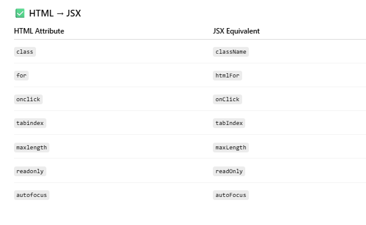

() As in lagana jaruri nahi hai in case of js 

## 2. JSX is just JavaScript expressions

Remember: JSX → compiled into `React.createElement(...)`.


## PROPS


The above `Button` always says **“Click Me”** → not flexible.

We want it to work in different places with **different labels or behavior**.

So, instead of hardcoding, we want to **parameterize** the component.


## 8. Summary of Flow (step-by-step order)

1. **Component = Function** returning JSX.
    
2. To make it **reusable**, we need inputs.
    
3. React provides **props** as the input system.
    
4. When we write `<Component attr="value" />`, React creates an object `{ attr: "value" }`.
    
5. That object is passed into the component as `props`.
    
6. Inside the component, we can use `props` dynamically.
    
7. For cleaner code, destructure `props` directly


```js
function Button({ label, color }) {
  return (
    <button style={{ backgroundColor: color }}>
      {label}
    </button>
  );
}

export default function App() {
  return (
    <div>
      <Button label="Save" color="blue" />
      <Button label="Cancel" color="red" />
    </div>
  );
}

```


## PROBLEM


A **reusable button** should **only care about rendering itself and detecting a click** — it shouldn’t decide what happens _after_ the click.

That’s the **responsibility of the parent** (the component that uses the button).  
This is where **functions as props** come in.


## 🔹 What happens under the hood

1. `<Button label="Save" onClick={handleSave} />` → React calls `Button({ label: "Save", onClick: handleSave })`.
    
2. Inside `Button`, it creates a `<button onClick={handleSave}>Save</button>`.
    
3. When clicked → `handleSave()` (from parent) runs.
    

So the **Button’s responsibility** = just rendering + forwarding the event.  
The **Parent’s responsibility** = deciding the actual logic.


This separation is called:  
✨ **Separation of Concerns**  
✨ **Dumb (presentational) vs Smart (container) components**


In **JSX**, attributes follow **camelCase** naming instead of HTML’s lowercase convention.

---

## 🔹 Why camelCase in JSX?

- JSX is **JavaScript**, not HTML.
    
- In JavaScript, property names are case-sensitive → so React sticks to **camelCase** for consistency.


Kyonki class as a js keyword pehle se majood hai toh fir hum class jsx mein use nahi kar sakte hain!!
```js
function App() {
  return (
    <div className="container">
      <label htmlFor="username">Username</label>
      <input type="text" id="username" autoFocus maxLength={10} />
      <button onClick={() => alert("Clicked!")} tabIndex={0}>
        Click Me
      </button>
    </div>
  );
}

```

## 🔹 Key Difference

- HTML is **not case-sensitive** (`onclick`, `ONCLICK`, `onClick` all same).
    
- JSX is **JavaScript-based** → only the exact camelCase works.


Hmare button ka kam chizon ko expect karna naki unko implement karna!!!


## **How to add CSS in React (JSX)**


And har badi company ki apni styling library hoti hai mostly

## Tailwind Works So Well with React


## When Tailwind is best

✅ Small → Large projects  
✅ Teams → keeps styles consistent  
✅ When **speed of development** is important  
✅ When you don’t want to maintain lots of `.css` files


Tailwind with vite - https://tailwindcss.com/docs/installation/using-vite

### A real-world reusable button with Tailwind + props

```js
<Button 
  text="Click me 1" 
  styleType="error" 
  onClickHandler={() => console.log("Click me 1")} 
/>

<Button 
  text="Click me 2" 
  onClickHandler={() => console.log("Click me 2")} 
/>

<Button 
  text="Click me 3" 
  styleType="success" 
  onClickHandler={() => console.log("Click me 3")} 
/>

```


## 🔹  Button.jsx

```jsx
function Button({ text, onClickHandler, styleType = "primary" }) {
  return (
    <button
      onClick={onClickHandler}
      className={`px-4 py-2 ${getButtonStyling(styleType)} text-white`}
    >
      {text}
    </button>
  );
}
function getButtonStyling(styleType) {
  if (styleType === "primary") return "bg-blue-500";
  else if (styleType === "secondary") return "bg-gray-500";
  else if (styleType === "error") return "bg-red-500";
  else if (styleType === "success") return "bg-green-500";
  else if (styleType === "warning") return "bg-yellow-500";
}

```

- `styleType = "primary"` → sets a **default** value if you don’t pass one.
    
- `className` combines **base styles** (`px-4 py-2 text-white`) with **dynamic styles** from `getButtonStyling(styleType)`.
    
- `onClick={onClickHandler}` → delegates the click responsibility to the parent.

- Function maps a `styleType` → Tailwind class.
    
- Keeps your JSX clean by pulling out logic.
    
- Very extensible: tomorrow you can add `"outline"`, `"disabled"`, `"info"`, etc.

## 🔹 How This All Ties Together

- **Reusable button**: One `Button` component, multiple styles & behaviors.
    
- **Tailwind**: Provides quick utility classes.
    
- **Props**: Pass `text`, `styleType`, `onClickHandler` from parent.
    
- **Function mapping**: `getButtonStyling` decides color dynamically.


In React, a functional component **must return a single parent element**.


## 🔹 Best Practice

👉 Use **Fragments (`<>...</>`)** if you don’t want an extra `<div>`.  
👉 Use `<div>` (or semantic tags like `<section>`, `<main>`, `<ul>`) when you actually need a container in the DOM. But we add an extra node in the dom when we wrap things in the div container which increases the memory consumption of it 


Making resuable components would be my job working as swe 1

## The **Presenter–Container Pattern** (also called **Smart–Dumb Components pattern**) is a way of **organizing components** so that responsibilities are clearly separated.


## 1. The Problem It Solves

In React, a single component can easily become a **mess**:

- It fetches data (API call)
    
- It manages state
    
- It decides how things look (JSX markup)
    
- It handles events
    

👉 This mixes **logic** + **presentation** in one place → hard to test, hard to reuse, and harder to maintain.


## 2. The Idea of the Pattern

We **split components into two types**:

### 🔹 **Container (Smart) Component**

- Handles **logic** (state, data fetching, event handling).
    
- Knows _what_ to render but not _how it looks_.
    
- Passes data + callbacks to presenter as **props**.
    

### 🔹 **Presenter (Dumb) Component**

- Handles **UI/presentation only**.
    
- Receives data and callbacks via props.
    
- Renders JSX.
    
- Is **reusable & stateless** (mostly).


## 3. Example Without the Pattern

```jsx
function UserProfile() {
  const [user, setUser] = useState(null);

  useEffect(() => {
    fetch("/api/user/1")
      .then(res => res.json())
      .then(data => setUser(data));
  }, []);

  if (!user) return <p>Loading...</p>;

  return (
    <div>
      <h1>{user.name}</h1>
      <p>{user.email}</p>
    </div>
  );
}

```


## 4. Example With Presenter–Container

**Container (smart)**
```jsx
function UserProfileContainer() {
  const [user, setUser] = useState(null);

  useEffect(() => {
    fetch("/api/user/1")
      .then(res => res.json())
      .then(data => setUser(data));
  }, []);

  if (!user) return <p>Loading...</p>;

  return <UserProfilePresenter user={user} />;
}

```


**Presenter (dumb)**
```jsx
function UserProfilePresenter({ user }) {
  return (
    <div>
      <h1>{user.name}</h1>
      <p>{user.email}</p>
    </div>
  );
}

```


## 5. Benefits

✅ Clear separation:

- **Container** = “What to render” (logic).

- **Presenter** = “How to render” (UI).


✅ Easier to test presenters (just pass mock props).  
✅ Easier to reuse presenters in multiple containers.  
✅ Containers can swap presenters if UI design changes.

---

## 6. Where It’s Used

- Large React apps.

- When you want **reusable UI components**.

- When logic (API/state) must be separated from UI (styling/markup).


Modern libraries like **Redux** or **Apollo Client** naturally encourage this separation.


## 1. Two Layers of a Component

- **Presentation Layer (UI):**
    
    - Deals only with _how things look_.
        
    - Takes props and renders JSX (markup, CSS, styling).
        
    - Dumb → doesn’t know _where data came from_.
        
    - Example: a `UserCard` that just renders a name/email passed in.
        
- **Logical / Container Layer:**
    
    - Deals with _how things work_.
        
    - Handles state, fetching, logic, event handling.
        
    - Knows _what data to pass to the presenter_.
        
    - Example: `UserCardContainer` that fetches a user from API and passes it to `UserCard`.

## 2. How They Work Together

- The **container** decides what data/actions the presenter needs.
    
- The **presenter** only renders that data.
    
- If you visualize it, the container is the “brain” 🧠, the presenter is the “face” 🎭.

## EXAMPLE

## 1. The Container (first screenshot)
```jsx
import TextInputForm from "./TextInputForm";

function TextInputFormContainer() {

  function handleFormSubmit(event) {
    event.preventDefault();
    console.log("Form submitted!");
  }

  function handleTextInputChange(event) {
    console.log("Text input changed!");
    console.log(event.target.value);
  }

  return (
    <TextInputForm
      handleFormSubmit={handleFormSubmit}
      handleTextInputChange={handleTextInputChange}
    />
  );
}

export default TextInputFormContainer;

```


### What’s happening here:

- This is the **Container (Smart Component)**.
    
- It contains the **logic**:
    
    - `handleFormSubmit` → prevents reload, logs submission.
        
    - `handleTextInputChange` → logs when user types.
        
- It doesn’t have any JSX for the form itself.
    
- Instead, it **passes the logic down as props** to `TextInputForm` (the Presenter).


## 2. The Presenter (second screenshot)

```jsx
import Button from "../Button/Button";
import TextInput from "../TextInput/TextInput";

function TextInputForm({ handleFormSubmit, handleTextInputChange }) {
  return (
    <form onSubmit={handleFormSubmit}>
      <div>
        <TextInput
          label="Enter a word or a phrase"
          placeholder="Enter a word or phrase here ..."
          onChangeHandler={handleTextInputChange}
        />
      </div>

      <div>
        <Button styleType="warning" text="Show / Hide" />
      </div>

      <div>
        <Button type="submit" styleType="primary" text="Submit" />
      </div>
    </form>
  );
}

export default TextInputForm;

```


### What’s happening here:

- This is the **Presenter (Dumb Component)**.
    
- It only cares about **how the form looks**.
    
- It gets `handleFormSubmit` and `handleTextInputChange` from props (given by the container).
    
- It wires them into the form and input field.
    
- Buttons and TextInput are purely UI-level, reusable components.

## 3. The Flow Together

1. **User types** → event triggers `handleTextInputChange` (from container).
    
    - Logs the text change.
        
2. **User submits** → event triggers `handleFormSubmit` (from container).
    
    - Prevents page reload, logs “Form submitted!”.
        
3. **Presenter doesn’t care about logic** → just ensures correct handlers are hooked up.
    
4. **Container doesn’t care about UI** → just passes logic to Presenter.


## Why Is This Powerful?

- The `TextInputForm` (Presenter) can be reused in other places with different logic — just pass different props.
    
- The `TextInputFormContainer` (Container) could later fetch data, validate inputs, call APIs, etc., **without touching UI code**.
    
- Testing is easier → test Presenter as a pure UI component, test Container logic separately.
    

---

✅ In short:

- **Container** = holds logic (functions, state, API).
    
- **Presenter** = holds UI (form, text field, buttons).
    
- Together → they create a clean, reusable, maintainable component.


**Presenter–Container pattern**, the **Container layer calls (renders) the UI/Presentation layer**.


EXAMPLE
1. **User types something** → Presenter (`TextInput`) triggers `onChangeHandler` → passes value up to Container.
    
2. **Container’s function runs** → logs, updates state, maybe hits API.
    
3. **User clicks Submit** → Presenter form calls `onSubmit` → Container’s logic handles it.
    

---

So the **Container is the boss** (logic),  
and the **Presenter is the employee** (UI worker).

👉 The Container never directly draws DOM — it always **calls the Presenter** (UI layer) and supplies it with props.


### 🔑 Benefits of this concept

1. **Separation of Concerns (SOC)**
    
    - **Container** = handles logic (state, API calls, event handling).
        
    - **Presenter** = handles UI (layout, styles, markup).
        
    - → Each piece has **one job only**, which makes the code cleaner.
        

---

2. **Reusability**
    
    - A **Presenter component** (like `Button`, `TextInput`) doesn’t care _where data comes from_.
        
    - That means you can reuse the same `Button` across 5 different containers.
        

---

3. **Testability**
    
    - You can test **presenters** with just “Does the button render correctly? Does it call onClick?” → super easy.
        
    - You can test **containers** by mocking presenters → just test logic and data flow separately.
        

---

4. **Scalability**
    
    - As apps grow, having **one big component with UI + logic mixed** becomes messy.
        
    - Containers keep things modular: you can swap the UI without touching the logic.
        

---

5. **Team Collaboration**
    
    - In bigger teams, **UI devs** can focus on Presenters, while **logic devs** work on Containers.
        
    - They don’t step on each other’s toes.
        

---

6. **Consistency**
    
    - You can build a library of **dumb/pure presenter components** (Button, Input, Card, Modal), and just wire them up with containers anywhere in the app.
        
    - Result → consistent UI and less code duplication.
        

---

👉 In short:

- Presenters = **clean, reusable, dumb UI**
    
- Containers = **smart, data-driven, replaceable logic**
    

Together, they make the app more **maintainable, testable, and scalable**.


## React components **aren’t just “UI templates”** — they can be **stateful, dynamic, and interactive**


## 🔹 5. Components can be “smart” or “dumb”

- **Presentational (dumb)** → UI only.
    
- **Container (smart)** → manages state, memory, logic, passes props down.


## STATE
UI won’t update

CONTAINER 
```jsx
import TextInputForm from "./TextInputForm";

function TextInputFormContainer() {
  // just a normal variable, not state
  let inputType = "password";

  function handleFormSubmit(event) {
    event.preventDefault();
    console.log("Form submitted");
  }

  function handleTextInputChange(event) {
    console.log("Text input changed");
    console.log(event.target.value);
  }

  function handleShowHideClick() {
    console.log("Show/Hide button clicked");
    if (inputType === "password") {
      inputType = "text";
    } else {
      inputType = "password";
    }
    console.log("inputType is now:", inputType);
  }

  return (
    <TextInputForm
      handleFormSubmit={handleFormSubmit}
      handleTextInputChange={handleTextInputChange}
      handleShowHideClick={handleShowHideClick}
      inputType={inputType} // 👈 UI never re-renders when this changes
    />
  );
}

export default TextInputFormContainer;

```


PRESENTER 
```JSX
import Button from "./Button/Button";
import TextInput from "./TextInput/TextInput";

function TextInputForm({ handleFormSubmit, handleTextInputChange, handleShowHideClick, inputType }) {
  return (
    <form onSubmit={handleFormSubmit}>
      <TextInput
        type={inputType} // 👈 gets the prop, but it won’t change after render
        label="Enter a word or a phrase"
        placeholder="Enter a word or phrase here..."
        onChangeHandler={handleTextInputChange}
      />

      <div>
        <Button
          styleType="warning"
          text="Show / Hide"
          onClickHandler={handleShowHideClick}
        />
      </div>

      <div>
        <Button type="submit" styleType="primary" text="Submit" />
      </div>
    </form>
  );
}

export default TextInputForm;

```


Koi change hi nahi aara ui mein


### 🚨 Key point: React only re-renders on **state** or **prop** change

React works on a **reactive model**:

- When **state changes** → React re-renders that component.
    
- When **props change** → React re-renders the child.
    
- But with a plain `let` variable → React has **no clue** something changed.
    

So after you click “Show/Hide”:

1. The variable changes in memory.
    
2. No re-render happens.
    
3. The `TextInput` still uses the old `inputType` that was passed during the last render.
    
4. UI still shows `"password"` → `****`.

### 🧠 Mental Model

Think of it like this:

- **Normal JS variable (`let`)** = scratchpad → not reactive.
    
- **React state (`useState`)** = special memory box → when you update it, React knows “oh, I need to re-run this component and refresh the UI”.


React components **do not track normal variables** like `let`, `var`, or `const` Track means here if these changes then react renders the ui again of that component  

### 🧠 Why?

- When React renders your component, it just **runs the function once**.
    
- Local variables (like `let inputType = "password"`) exist **only for that single render**.
    
- On the next render, React calls the function again → fresh variable → original value is again taken.


### even if component rerender again but the local variable will have the originall value not the new one so it's just a fucntion


- A **React component is just a function**.
    
- Every time React re-renders, it **calls that function again from scratch**.
    
- Local variables inside the function (`let`, `const`, `var`) are recreated fresh on each call.
    
- So they always start with their initial value, not whatever you changed them to before.


## ✅ Self-Closing Tags in JSX

(Always write with `/` in JSX)

- `<area />`
    
- `<base />`
    
- `<br />`
    
- `<col />`
    
- `<embed />`
    
- `<hr />`
    
- ``
    
- `<input />`
    
- `<link />`
    
- `<meta />`
    
- `<param />`
    
- `<source />`
    
- `<track />`
    
- `<wbr />`

## ❌ All Other Tags

All other tags (`<div>`, `<span>`, `<h1>`…`<h6>`, `<p>`, `<section>`, `<article>`, etc.)  
**must** have an opening and closing tag **if they contain children**.


