### 🔹 What are Hooks in React?

Hooks are **special functions** that let you “hook into” React’s **state** and **lifecycle features** inside functional components.

Before Hooks (introduced in React 16.8), state and lifecycle methods were only available in **class components**. Functional components were “stateless.”

Hooks changed that → now **functional components can do everything class components can**.


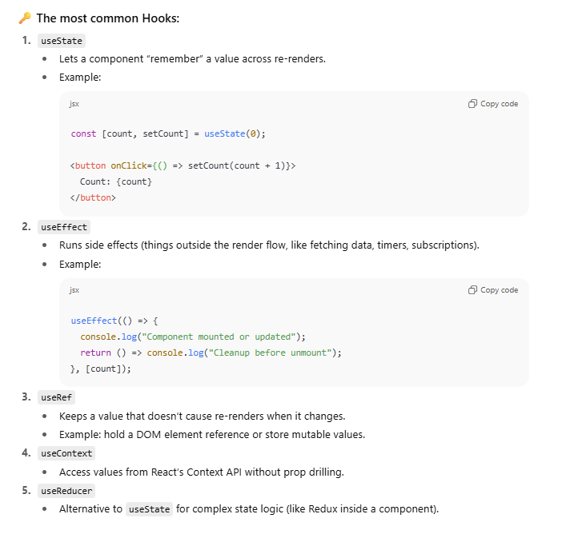


### 💡 Why Hooks are powerful:

- Make functional components **stateful**.
    
- Eliminate the need for most **class components**.
    
## - Encourage **cleaner separation of concerns** (logic vs UI).
    
- Make code **more reusable** through **custom hooks**.
    

---

👉 In short:  
Hooks are what give **functional components memory + superpowers**.  
Without them, your local variables (like you saw earlier) would reset on every re-render.


## The problem: UI needs to "remember" values

```js 
function Counter() {
  let count = 0;

  function increase() {
    count = count + 1;
    console.log(count);
  }

  return (
    <div>
      <h1>{count}</h1>
      <button onClick={increase}>+1</button>
    </div>
  );
}

```


👉 Problem: even if `increase()` changes `count`, the UI doesn’t update.  
Why? Because every time React re-renders this component,  
`count` is re-created with `0` (since it’s just a local variable).

We need a way for React to **store values between re-renders**.


## useState

`useState` is a React hook that lets a function component **remember a value between renders**.

```js
const [stateVariable, setStateFunction] = useState(initialValue);

```

- `stateVariable` → the current value (React remembers this for you).
    
- `setStateFunction` → a function to change the value.
    
- `initialValue` → starting/default value (only used on the very first render).

## 4. Example: Counter with `useState`

```js
import { useState } from "react";

function Counter() {
  // Declare state
  const [count, setCount] = useState(0);

  function increase() {
    setCount(count + 1); // update state
  }

  return (
    <div>
      <h1>{count}</h1>
      <button onClick={increase}>+1</button>
    </div>
  );
}

```


### What happens?

1. On first render → `count = 0`.
    
2. User clicks button → `setCount(count + 1)` tells React: _“hey, update state.”_
    
3. React **re-renders** the component.
    
4. On next render → `count` has the **new value** (not reset to 0).


## 5. Why not update variables directly?

If you did `count = count + 1` without `setCount`, React wouldn’t know something changed → no re-render.  
State updates are what **trigger re-renders** in React.


## 6. Some key points

- You can call `useState` multiple times in a component (for different values).
    
- State updates are **asynchronous** → React batches them for performance.
    
- State should be treated as **immutable** → never modify it directly (e.g., `count++` is wrong).


So every time we change the value of a state variable then the whole component connected to that state variable changes!!

### 🔄 How React handles multiple state variables

```jsx
import { useState } from "react";

function Profile() {
  const [name, setName] = useState("Sourav");
  const [age, setAge] = useState(25);
  const [isOnline, setIsOnline] = useState(false);

  return (
    <div>
      <h1>{name}</h1>
      <h2>{age}</h2>
      <p>{isOnline ? "Online ✅" : "Offline ❌"}</p>
      <button onClick={() => setAge(age + 1)}>Increase Age</button>
    </div>
  );
}

```


### ✅ Rule in React:

If **any one** of these state variables changes (`name`, `age`, or `isOnline`),  
👉 React **re-renders the entire `Profile` component**.


## 💡 Important clarifications

1. **Whole component re-renders, not the whole app.**
    
    - Only `Profile` (and its children) re-render, not every component in the app.
        
2. **All state values are preserved.**
    
    - If you only updated `age`, React re-renders but keeps the latest values for `name` and `isOnline`.
        
    - React doesn’t reset other states on re-render.
        
3. **Why not only re-render the changed part?**
    
    - Because React works with a **Virtual DOM**.
        
    - It re-runs the `Profile()` function (the component) to produce a new “UI tree” in memory.
        
    - Then React compares it with the old one and updates only the necessary DOM nodes.
        
    - This process is efficient → that’s React’s magic ✨.

### Any state change in a component → full component re-render → Virtual DOM diffing ensures only the necessary UI updates.

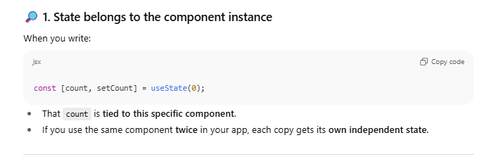

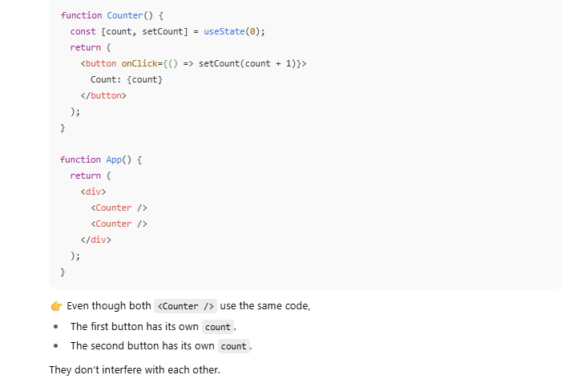

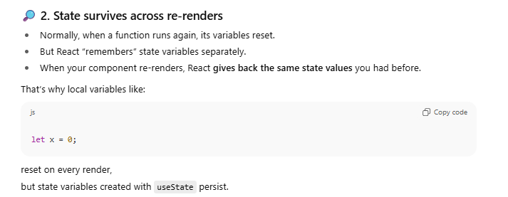


## 1. What is the frontend’s main job?

The **frontend** is the _interface_ between the user and the system.

- It shows information to the user.
    
- It collects information from the user (directly or indirectly).
    

So whenever you interact with a frontend (like Zomato, Swiggy, Amazon, YouTube), you’re constantly **sending signals** about what you want.


## 2. Two types of user data collection

1. **Explicit input** → When the user clearly gives data.
    
    - Example: filling a form (name, email, password).
        
    - Example: typing in a search bar.
        
2. **Implicit input** → When the user’s actions themselves are data.
    
    - Example: Clicking on a restaurant → you’re telling Zomato “show me this restaurant’s details.”
        
    - Example: Clicking _play_ on a YouTube video → you’re asking “give me this video’s data.”
        
    - Example: Scrolling → app learns what you’re looking at.


## 3. How this works technically

1. **User action on frontend** → User clicks a button, submits a form, or selects an item.
    
2. **Frontend captures the event** → In React/JS, we attach event listeners (`onClick`, `onChange`, etc.).
    
3. **Frontend sends request to backend (API)** → Usually via HTTP/HTTPS request.
    
    - Example: `GET /restaurants/123` → fetch restaurant details.
        
    - Example: `POST /login` → send login data.
        
4. **Backend processes and sends response** → The database + business logic runs.
    
5. **Frontend updates the UI with response** → Shows restaurant menu, confirms login, etc.

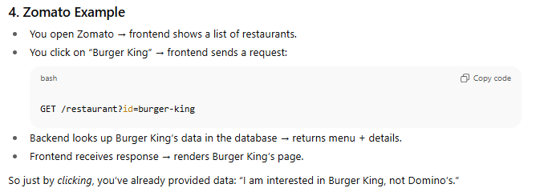


## . Why do we need state in React?

When a user interacts with the app (clicks, types, selects something), that data should be **remembered** so the UI can update accordingly.

- A **state variable** is where React stores this data.
    
- Whenever state changes, React **re-renders** the component to reflect the new data.

## . Accessing the data elsewhere

Once stored in state:

- You can **show it anywhere in the same component**.
    
- You can **pass it as props** to child components.
    
- You can **send it to backend APIs** (e.g., login data, selected restaurant).


## 1. Traditional Websites (Multi-Page Applications)

- Every time you click a link or perform an action → browser sends a request to the server.
    
- Server responds with a **new HTML page** → browser reloads the whole page.
    
- Even if only a small part of the page changes (like restaurant details), the **entire header, footer, and navigation bar** also reload.
    
- This makes it **slower** and not very smooth.


## 2. Single Page Applications (SPA)

- SPA loads **one main HTML file** only once (usually `index.html`).
    
- After that, all updates (like showing a restaurant, adding to cart, searching) happen via **JavaScript (React, Angular, Vue)** without a full reload.
    
- Only the part of the UI that needs to change gets updated.
    

👉 Example:

- Zomato’s header (logo, search bar, profile button) stays the same.
    
- When you click a restaurant, **only the restaurant details section updates**.
    
- This feels fast because the browser isn’t throwing away and re-downloading everything.

## 3. Why SPA is better

1. **Faster navigation** → only small data fetched via APIs.
    
2. **Smooth user experience** → no flickering or white screen between pages.
    
3. **Frontend handles routing** → React Router (for example) decides which component to show.
    
4. **Backend serves just data (JSON)** instead of full HTML pages.

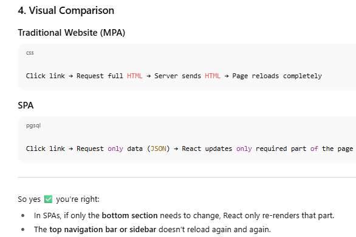


## 🔴 The Problem

React is a **Single Page Application** → it loads only one HTML page.

- By default, browsers expect multiple HTML files for multiple pages.
    
- Example: If you click `<a href="/about">About</a>`, the browser tries to **reload the whole page** and fetch `/about.html` from the server.
    
- But in React apps, there is no `about.html` → everything is supposed to be handled inside React.
    
- Result: Without fixing this, your SPA breaks the "no full reload" rule.
    

---

## 🟢 The Solution: React Router

React Router stops the browser from reloading the page. Instead:

- It **intercepts the click** before the browser makes a request.
    
- Uses the **History API** (`pushState`, `replaceState`) to change the URL **without reloading**.
    
- Tells React: _“Hey, load the `<About />` component now”_.
    
- Only the necessary part of the UI changes → rest of the page stays intact.
    

---

## ✅ In short

- **Problem:** Browser reloads the whole page when navigating between routes → breaks SPA behavior.
    
- **Solution:** React Router fakes page navigation by swapping components in React, while keeping the SPA intact (no reloads).


## Redirection in a SPA like React

In a SPA, we **don’t want a reload**. Instead, we just want React to show a different component when a certain URL (path) is hit.

This is handled by **React Router** (or similar libraries).


##  How React Router does redirection

React Router uses the **History API** (`pushState`, `replaceState`) under the hood.

- It changes the **URL in the address bar** (so it looks like navigation).
    
- But it **does not reload** the page.
    
- Instead, it tells React → _“Render this other component now.”_


So basically pages bhi components hi hote hain na bhai!


# 🌐 React Router — The Basics

## 1. What is React Router?

React by itself is only a **UI library**. It doesn’t know how to:

- Switch between pages
    
- Change the URL without reload
    
- Handle navigation (Home → About → Contact, etc.)
    

👉 **React Router** is a library that adds this missing functionality.  
It lets you create “multiple pages” in your **Single Page Application (SPA)** by swapping components based on the URL.

`npm install react-router-dom`

## 3. The Main Building Blocks

1. **`BrowserRouter`**
    
    - Wraps your whole app.
        
    - Enables React Router to listen to URL changes.
        
2. **`Routes`**
    
    - A container for all your routes (like a switch statement).
        
3. **`Route`**
    
    - Defines a path (like `/about`) and which component should render.
        
4. **`Link`**
    
    - React Router’s version of `<a>` tag.
        
    - Changes URL **without reloading**.


```js
import { BrowserRouter, Routes, Route, Link } from "react-router-dom";

function Home() {
  return <h2>Home Page</h2>;
}

function About() {
  return <h2>About Page</h2>;
}

function App() {
  return (
    <BrowserRouter>
      <nav>
        {/* Navigation without reload */}
        <Link to="/">Home</Link> | 
        <Link to="/about">About</Link>
      </nav>

      <Routes>
        {/* Define routes */}
        <Route path="/" element={<Home />} />
        <Route path="/about" element={<About />} />
      </Routes>
    </BrowserRouter>
  );
}

export default App;

```

## 1. `<BrowserRouter> … </BrowserRouter>`

- This is like the **big wrapper** for your whole app.
    
- It tells React:
    
    > “I want to use React Router. Please watch the browser’s URL and swap components when it changes.”
    
- It needs **opening and closing tags** because everything inside (like `<Routes>` and `<Link>`) should be aware of the router.
    

👉 That’s why we wrap our app inside `<BrowserRouter> … </BrowserRouter>`.  
It’s similar to how we wrap things in `<div> … </div>`.


## 2. `<Routes> … </Routes>`

- Think of `<Routes>` as a **container for all your possible paths**.
    
- It looks at the current URL and decides which `<Route>` should be shown.
    
- Only one matching route is rendered at a time.


## 3. `<Route path="/" element={<Home />} />`

- A **Route** connects a **path** (like `/about`) to a **component** (like `<About />`).
    
- `path="/"` → means “if the URL is exactly `/`, render this route.”
    
- `element={<Home />}` → tells React what to show.
    

So:

- When URL = `/`, React shows `<Home />`.
    
- When URL = `/about`, React shows `<About />`.

## 4. `<Link to="/"> … </Link>`

- This is React Router’s version of `<a>` tag.
    
- Why not just use `<a href="/">`?
    
    - Because `<a>` would trigger a **full reload** (bad for SPAs).
        
    - `<Link>` uses React Router to change the URL without reloading.
        
- `to="/"` → means “when clicked, go to `/` and show the matching route.”


## 🔄 How React Router works (step by step)

1. **`<Link to="...">`**
    
    - When you click a `Link`, React Router **changes the browser’s URL** using the **History API** (no reload).
        
2. **URL changes**
    
    - The URL in the address bar updates (e.g., from `/` → `/about`).
        
    - But instead of sending a request to the server, React Router intercepts it.
        
3. **`<Routes>` checks all `<Route>`s**
    
    - React Router looks at the new URL.
        
    - It tries to match it with the `path` in your `<Route>`.
        
4. **Matching `<Route>`’s component renders**
    
    - If URL = `/about` → `<About />` component is rendered.
        
    - If URL = `/` → `<Home />` component is rendered.
        
    - Rest of the app (like navbar) stays the same.
        

---

## ✨ Simplified in one sentence

👉 **Clicking `<Link>` changes the URL → React Router checks `<Routes>` → renders the matching `<Route>`’s component, without a full page reload.**


`<Route path="/about" element={<About />} />`

- `element={...}` is a **prop**.
    
- React Router expects the value of `element` to be a **JSX element** (not just a component function).
    

⚡ Difference:

- `<About />` → this is a JSX element (an actual object React can render).
    
- `About` → this is just the function (the component definition itself).
    

So we need to **pass `<About />` as a value** to the `element` prop.


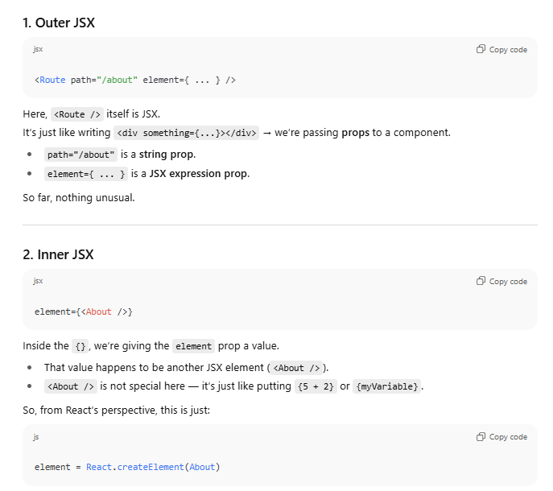


## 3. Why it _feels_ weird

It looks like **JSX inside JSX** because:

- `<Route>` is JSX (outer).
    
- `<About>` is also JSX (inner).
    
- And we’re nesting one as a **prop** of the other.
    

But actually, this is totally normal — React doesn’t care what type of value a prop has.

- Sometimes it’s a string (`path="/about"`).
    
- Sometimes it’s a number (`count={42}`).
    
- Sometimes it’s a function (`onClick={handleClick}`).
    
- Here it’s JSX (`element={<About />}`).

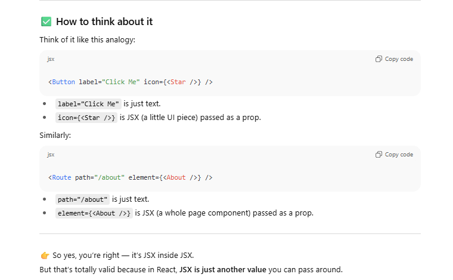


- There’s **no logic, no conditions**.
    
- Clicking `<Link to="/about">` → changes the URL → React Router matches `/about` → shows `<About />`.
    
- Clicking `<Link to="/">` → changes the URL → React Router matches `/` → shows `<Home />`.
    

It’s **straightforward navigation** — just like switching between tabs in a notebook.

---

## 🔑 Key point

At this level, React Router is only doing **static routing** (path → component).

- No login checks
    
- No permissions
    
- No redirects
    

Just “if path matches → render this component.”


Like if there is a submit button and then at that time we can't just submit some empty value! right we do have to check some or use some logic first!!
Programmatically controlling if we want to go from one page to the another 


- **Links (`<Link>`):** user clicks → URL changes → React Router shows new page. No conditions.
    
- **Programmatic navigation (`useNavigate`, `<Navigate>`):** you decide with logic whether the user should be allowed to move to another page.

# 🧭 Why programmatic navigation?

Normally in a website:

- `<a href="/about">About</a>` or `<Link to="/about">About</Link>` → directly sends you to `/about`.
    

But sometimes you don’t want to navigate **blindly**.  
You want conditions like:

- “Only go to `/dashboard` if the user is logged in.”
    
- “After submitting a form successfully, go to `/success`.”
    
- “If not allowed, stay here.”
    

That’s where **programmatic navigation** comes in.


# 1. `useNavigate` hook

👉 This is like a function you can call from inside your component to change the page.

### Example:

```js
import { useNavigate } from "react-router-dom";

function Login() {
  const navigate = useNavigate();

  function handleLogin() {
    // (pretend login works)
    const success = true;

    if (success) {
      navigate("/dashboard");  // ✅ redirect programmatically
    } else {
      alert("Login failed");
    }
  }

  return <button onClick={handleLogin}>Login</button>;
}

```


🔎 Here:

- No `<Link>` involved.
    
- On button click → your function runs.
    
- If `success` → `navigate("/dashboard")`.
    
- If not → stay on the same page.
    

This gives you **logic + navigation together**.


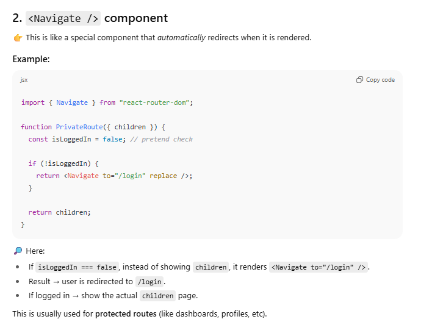

# ✅ Difference between them

- **`useNavigate`** = you call it _inside an event handler or function_. Think of it like a `navigate()` function.
    
- **`<Navigate />`** = you use it _in JSX directly_ to cause an instant redirect.

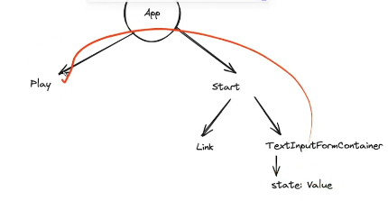

- **Path params** (a.k.a. dynamic segments) → `/users/:id`
    
- **Query params** (search string) → `/search?term=react&page=2`
    
- **Location object** (including **location.state**) → in-memory handoff during navigation
    
- **Lifting state up** (props up/down via a common parent)
    
- (Bonus) **Context / global stores** for app-wide state (briefly covered)

# 1) Path params (dynamic URL segments)

**When:** The value is part of the page’s identity (resource ID, slug).  
**Pros:** Bookmarkable, sharable, refresh-safe, SEO-friendly.  
**Cons:** Hierarchical, not great for lots of optional filters.


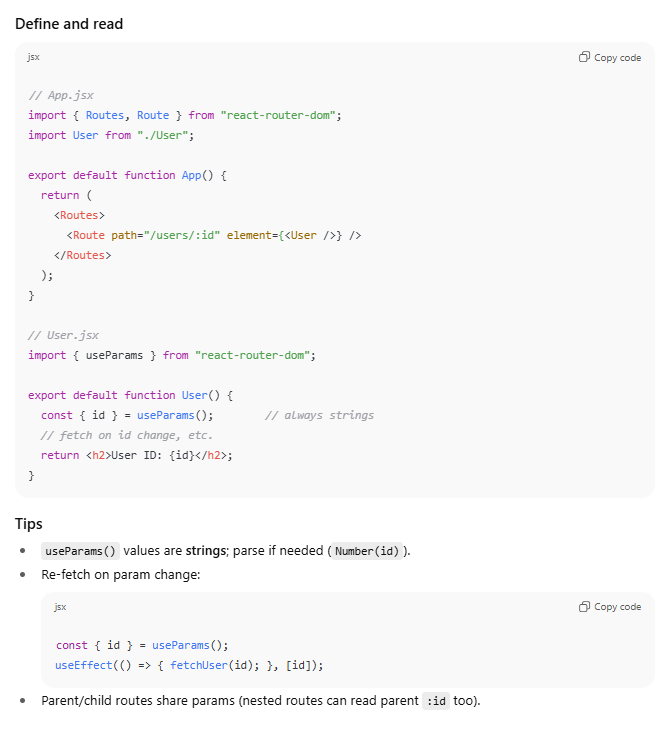


# 2) Query params (search string)

**When:** Extra, optional, multi-filter, or order-independent parameters.  
**Pros:** Bookmarkable, refresh-safe, good for filters/sort/pagination.  
**Cons:** Not as “identity-defining” as path params; everything is a string.

```js
import { useSearchParams } from "react-router-dom";

export default function SearchPage() {
  const [params, setParams] = useSearchParams();

  const term = params.get("term") ?? "";   // string or null
  const page = Number(params.get("page") ?? 1);

  function updateTerm(next) {
    setParams(prev => {
      const p = new URLSearchParams(prev);
      p.set("term", next);
      p.set("page", "1"); // reset page on new term
      return p;
    });
  }

  return (
    <>
      <input
        value={term}
        onChange={e => updateTerm(e.target.value)}
        placeholder="Search…"
      />
      <p>Page: {page}</p>
    </>
  );
}

```


### Tips

- Use `encodeURIComponent` if building URLs manually.
    
- Keep query params as the **source of truth** for filters—this makes the UI shareable and back/forward friendly.
    
- Treat values as strings; convert to booleans/numbers/dates as needed.


## 3) `useLocation()` and `location.state`

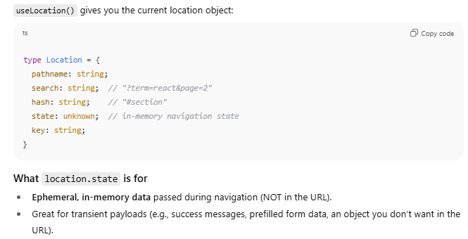


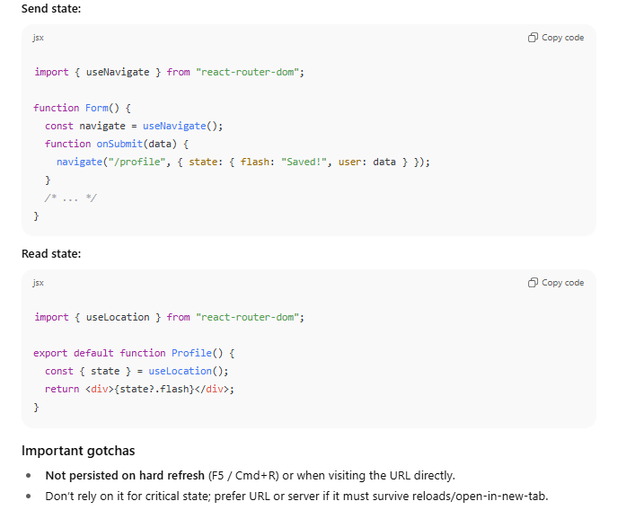


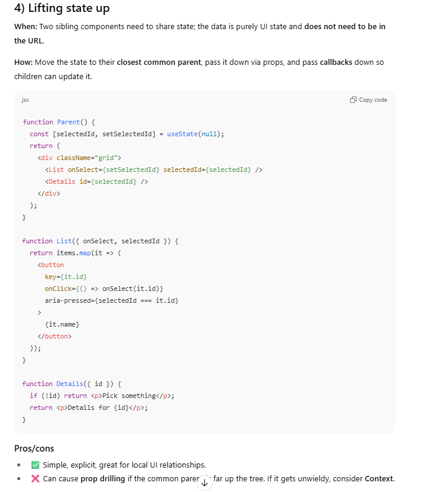


# 5) Choosing the right approach (rules of thumb)

- **Is the value part of “which page” it is?**  
    → **Path param** (`/products/:id`)
    
- **Is it optional, filter/sort/pagination, and should be sharable?**  
    → **Query params** (`?q=shoes&sort=price_asc&page=2`)
    
- **Is it a one-off handoff that shouldn’t appear in the URL and can be lost on refresh?**  
    → **`location.state`** via `navigate()` or `<Link state={...}>`
    
- **Is it purely UI state shared between siblings, not meaningful in the URL?**  
    → **Lift state up** (or Context if it spans many layers)
    
- **App-wide preferences (theme, auth user, cart) used everywhere?**  
    → **Context / global store** (Context API, Redux, Zustand, Jotai, etc.)


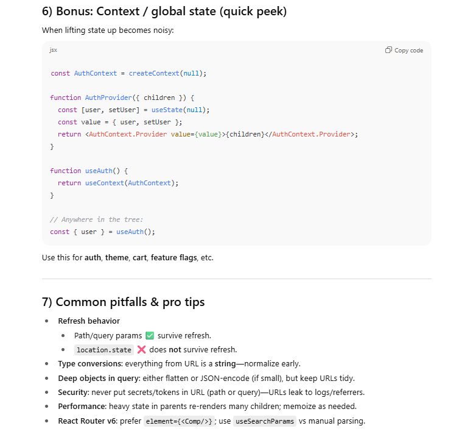


STATE MANAGEMENT LIBRARIES 
## Context API

- **What it is**: A built-in React feature (no extra library needed). Lets you avoid “prop drilling” by sharing state across components.
    
- **Use case**:
    
    - When your app has **simple to moderate state management needs**.
        
    - Example: Theme (light/dark), user authentication info, language settings.
        
- **Pros**:
    
    - No extra setup.
        
    - Simple for small-to-medium apps.
        
    - Less boilerplate than Redux.
        
- **Cons**:
    
    - When state updates are frequent and across many components, Context can cause **unnecessary re-renders**.
        
    - Debugging tools are limited compared to Redux.
        

---

## 🔹 Redux

- **What it is**: A state management library for **predictable state containers**.
    
- **Use case**:
    
    - When your app grows large and you need **complex state logic**.
        
    - Example: E-commerce cart with multiple conditions, large dashboards, chat apps.
        
- **Pros**:
    
    - Predictable state flow (single source of truth).
        
    - Powerful developer tools (time-travel debugging, middleware, logging).
        
    - Good for large teams — enforces clear structure.
        
- **Cons**:
    
    - More boilerplate (though Redux Toolkit reduces this).
        
    - Slight learning curve.
        

---

## 🔹 When to use what?

- ✅ Small/medium app → **Context API**
    
- ✅ Large/complex app with lots of global state → **Redux**
    
- ✅ If you want developer tools, middleware, and strict patterns → **Redux**
    
- ✅ If you just want to avoid prop drilling → **Context API**
    

---

👉 A lot of modern React projects **start with Context API**, and if state complexity grows, they migrate to **Redux (or Redux Toolkit)**.  
For backend-heavy projects (like your Book Bazaar project 🛒), if the frontend needs advanced state syncing with APIs (cart, wishlist, orders, authentication), **Redux Toolkit** would be a better bet.