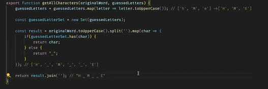
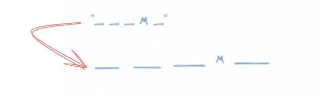
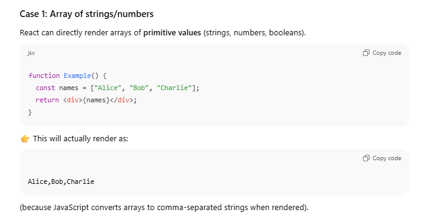
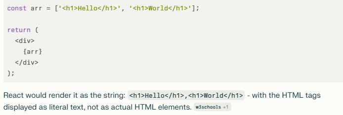
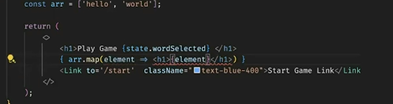
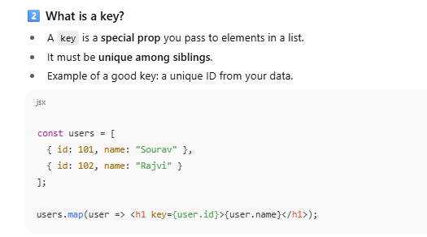
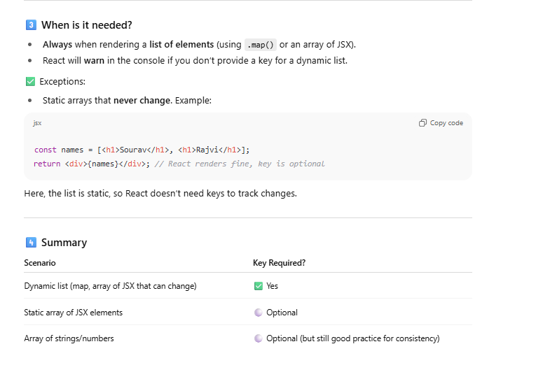

Now we'll work on the masked text!!

## Rendering a list

This happens because:

1. **React's automatic conversion**: When React encounters an array in JSX, it calls `toString()` on the array, which joins all elements with commas as separators
    
2. **Security feature**: React deliberately treats these as strings to prevent XSS attacks - it won't interpret the HTML tags as actual markup
    
3. **No JSX parsing**: The HTML strings like `'<h1>Hello</h1>'` are treated as plain text, not JSX elements

This works though but errror aega thoda

## Rendering lists in React & the `key` prop

### 1️⃣ Why do we need a key?

React uses a **Virtual DOM** to efficiently update the UI. When the state or props change, React:

1. Compares the **previous Virtual DOM** with the **new Virtual DOM**.
    
2. Determines the **minimum number of changes** needed to update the real DOM.
    

Without a `key`, React has no way to uniquely identify each element in a list. It will **fall back to using the index**, which can cause problems when:

- You insert, remove, or reorder elements.
    
- React may **reuse the wrong DOM nodes**, causing unexpected behavior.

