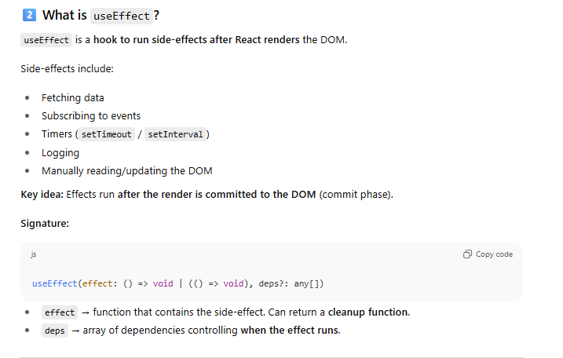
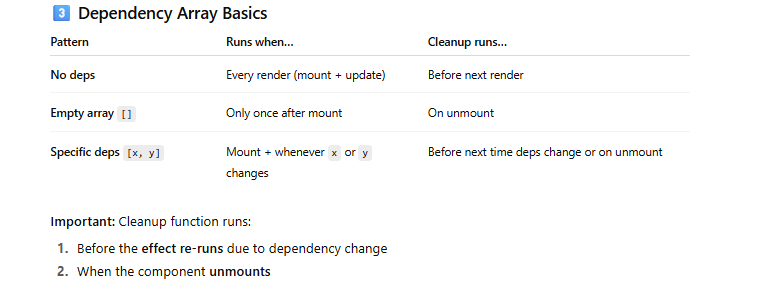
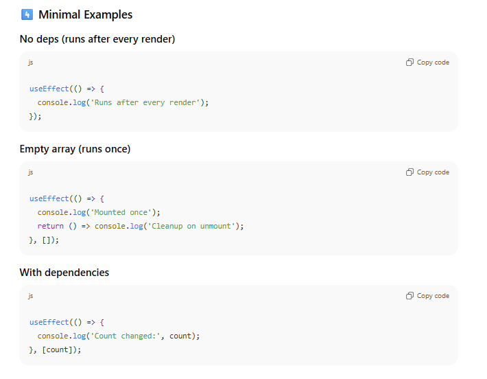

## **1️⃣ React Component Lifecycle Recap**

Before `useEffect`, class components had lifecycle methods:

|Phase|Methods|When used|
|---|---|---|
|Mounting|`constructor` → `render` → `componentDidMount`|Component first created & inserted into DOM. Good for initial data fetch.|
|Updating|`render` → `componentDidUpdate`|When props or state changes. Update DOM, fetch new data, side-effects.|
|Unmount|`componentWillUnmount`|Cleanup (timers, subscriptions, listeners) before component removed.|

`useEffect` in functional components **combines these lifecycle hooks** into a single API.

### 1. What is an _effect_?

In React, your component function should **describe the UI** (pure function → given state/props, return JSX).  
But real apps need **side-effects**:

- fetching data from an API
    
- subscribing to events (e.g. `window.addEventListener`)
    
- setting a timer (`setInterval`)
    
- updating the DOM or `document.title`
    

Those are **effects** — code that affects the outside world or depends on the outside world.

`useEffect` is React’s hook to run that code.

React Hooks can only be called inside the component not inside a callback

