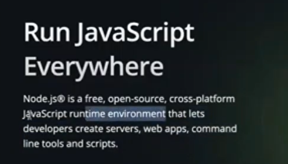

A **runtime environment** is the setting in which a program is executed. Think of it as the "world" your program lives in once it’s running.

It provides:

1. **Infrastructure for Execution**
    
    - The CPU, memory, operating system, and any libraries or frameworks needed to run the program.
        
2. **Supportive Tools & Services**
    
    - Garbage collection (automatic memory management).
        
    - Exception handling (how errors are caught and handled).
        
    - Thread management (if the program uses concurrency).
        
    - Input/output operations (e.g., reading files, printing to screen).
        
3. **Runtime Libraries**
    
    - Prebuilt functions your code can call (like math operations, string handling, database connectors, network communication).
        

---

### Examples

- **Node.js Runtime Environment**  
    Lets you run JavaScript outside the browser, providing things like `fs` (file system access) and `http` modules.
    
- **Java Runtime Environment (JRE)**  
    Runs compiled Java bytecode on the Java Virtual Machine (JVM), with standard Java libraries.
    
- **Python Interpreter**  
    Provides the Python runtime with built-in libraries, memory handling, and exception support.
    

---

👉 In short:  
A **runtime environment** is the layer that makes sure your code doesn’t just exist but actually _runs_, by giving it the necessary resources and rules of execution.

JS AS A PROGRAMMING LANAGUAGE HAS A COUPLE OF LIMITATIONS!!

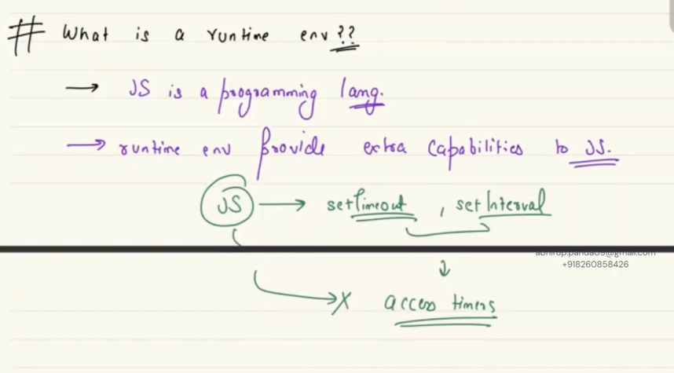

JavaScript doesn't know how to access timers
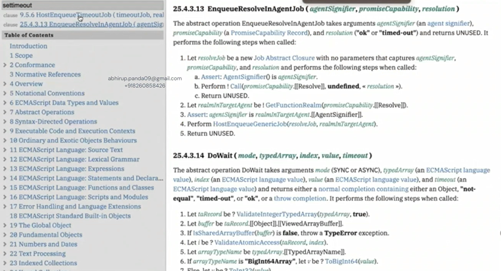

### 1. **ECMAScript vs JavaScript**

- **ECMAScript (ES)** is the _language specification_ (standardized by ECMA-262).
    
    - It defines core syntax and features: variables, loops, objects, arrays, promises, etc.
        
    - Think of it as: “The grammar + rules of the language.”
        
- **JavaScript** is the _implementation_ of ECMAScript in different environments.
    
    - Browsers and Node.js both implement ECMAScript, but they also add **extra APIs** on top to interact with the outside world.

###  **ECMAScript is a specification, not an implementation**

- **ECMAScript (ES)** is **not the language itself you run** — it’s the _blueprint / specification_.
    
    - It describes what the language should look like (syntax, semantics, built-in objects).
        
    - Example: `let`, `class`, `Promise`, `Array.prototype.map` are all defined in the ES spec.
        
- **JavaScript** is the **real-world implementation** of ECMAScript (in Chrome, Firefox, Node.js, etc.).
    
    - When we casually say “ECMAScript is a language,” it’s shorthand. Strictly speaking:
        
        - **Spec = ECMAScript**
            
        - **Implementation = JavaScript runtime (browser, Node.js, etc.)**

- The ECMAScript spec only covers **language-level constructs**.
    
- Things that depend on the environment (timers, DOM, networking, filesystem) are **deliberately excluded** because the spec doesn’t assume whether JS will run in a browser, on a server, on an IoT device, etc.
- **ECMAScript spec**:
    
    - Core objects: `Object`, `Array`, `Map`, `Set`, `Promise`.
        
    - Syntax: `if`, `while`, `async/await`.
        
- **Browser runtime adds**:
    
    - `setTimeout`, `fetch`, `document.getElementById` (because browser knows about HTML, network).
        
- **Node.js runtime adds**:
    
    - `setTimeout`, `fs`, `http`, `process` (because Node knows about files and OS).

- **ECMAScript = Grammar book** → defines _how sentences are formed_.
    
- **JavaScript runtime = Country using the grammar** → each country may add its own slang/phrases

- The term **JavaScript** is used broadly to mean _ECMAScript + runtime features_.
    
- That’s why people often blur the line and say “ECMAScript is JavaScript.”
    
- But strictly:
    
    - **ECMAScript** = the standard (what’s common everywhere).
        
    - **JavaScript** = the real thing you write/run (which includes environment extras).
- **They’re different** (spec vs implementation).
    
- But **JavaScript conforms to ECMAScript** and then extends it.

### 2. **Why `setTimeout`, `fetch`, `getElementById` are not in ECMAScript**

- ECMAScript doesn’t know about **HTML**, **network requests**, or **files**. It’s just the _language_.
    
- Functions like `setTimeout`, `fetch`, or `document.getElementById` are **not part of ECMAScript**, but provided by the **runtime environment** where JS runs.

### 3. **Different Runtimes, Different APIs**

- **Browser Runtime** adds:
    
    - `setTimeout`, `setInterval` → scheduling timers.
        
    - `fetch`, `XMLHttpRequest` → networking APIs.
        
    - `document.getElementById`, `querySelector` → DOM APIs (because browser has access to HTML).
        
    - `localStorage`, `sessionStorage` → storage APIs.
    
- **Node.js Runtime** adds:
    
    - `setTimeout`, `setInterval` → (similar timers).
        
    - `fs` module → file system access (because Node can interact with your OS).
        
    - `http` module → networking server/client.
        
    - `process` → info about the running process.

**Node.js** is a **runtime environment** that lets you run JavaScript code outside of a web browser.

Normally, JavaScript was created to run only inside browsers (like Chrome, Firefox) to make web pages interactive. But Node.js extends JavaScript’s use to the **server side** (backend).

### 1. The Context (Before 2009)

- **JavaScript** was stuck in browsers.
    
- Its main job: manipulate the DOM, respond to clicks, send AJAX requests.
    
- Browsers sandbox JavaScript for **security reasons**:
    
    - No direct file system access.
        
    - No access to OS processes.
        
    - No way to open raw network sockets.
        

So you couldn’t use JavaScript to build serious backend/server software.

---

### 2. Ryan Dahl’s Idea (2009)

Ryan thought:  
👉 _“What if JavaScript could run outside the browser?”_

- Use **Google’s V8 engine** (already very fast, thanks to Chrome).
    
- Build a **runtime environment** that gives JavaScript:
    
    - File system access (`fs`).
        
    - Process & memory access (`process`).
        
    - Networking (create servers, sockets, handle HTTP).

This runtime became **Node.js**.

---

### 3. Why it was Revolutionary

- Suddenly, JavaScript wasn’t just for **frontend** — it could now do **backend** too.
    
- This enabled:
    
    - Reading/writing files on disk.
        
    - Running OS-level tasks.
        
    - Accepting TCP/HTTP connections → building servers.
        
    - Communicating with other machines over the network.

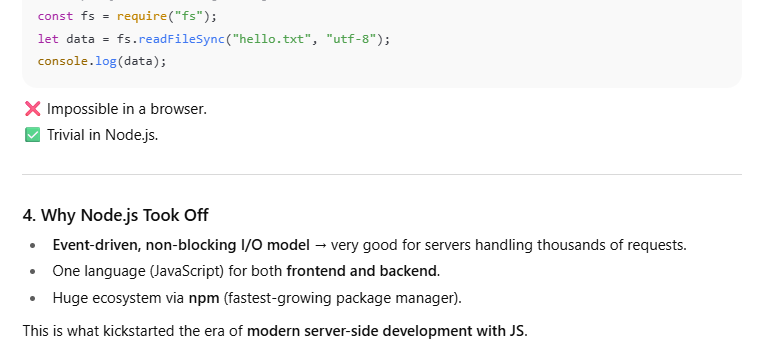

### 1. **What is a Framework?**

- A **framework** is a set of **pre-written code, structure, and conventions** to help you build applications faster.
    
- It dictates **how you should write your code** (inversion of control).
    
- Examples:
    
    - **Express.js** (web framework for Node.js).
        
    - **Django** (Python framework).
        
    - **Spring Boot** (Java framework).

👉 Framework = "predefined skeleton" → you plug your code into it.

---

### 2. **What is Node.js then?**

- **Node.js is NOT a framework.**
    
- It’s a **runtime environment**.
    
- It provides:
    
    - A **JavaScript engine (V8)** to run JS code outside the browser.
        
    - APIs for OS-level operations (file system, processes, networking).
        
    - An event loop & async I/O model.
        

But:

- It doesn’t force structure.
    
- It doesn’t tell you _how_ to build your app.
    
- It’s just the **platform** where you run your code.

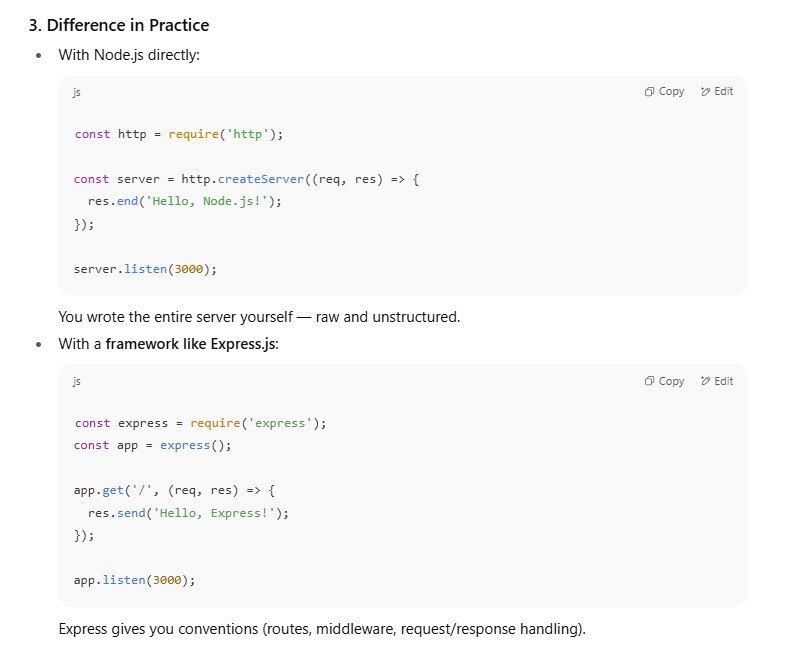

In programming, scaffolding refers to ==the automated generation of basic code structures, often used to kickstart application development==.

###  Node.js and the DOM

- **Node.js does NOT have a DOM.**
    
    - Node.js runs outside the browser → there’s no HTML page to render.
        
    - That means no `document`, no `window`, no `getElementById`.
        

So you cannot do direct DOM manipulation with Node.js.
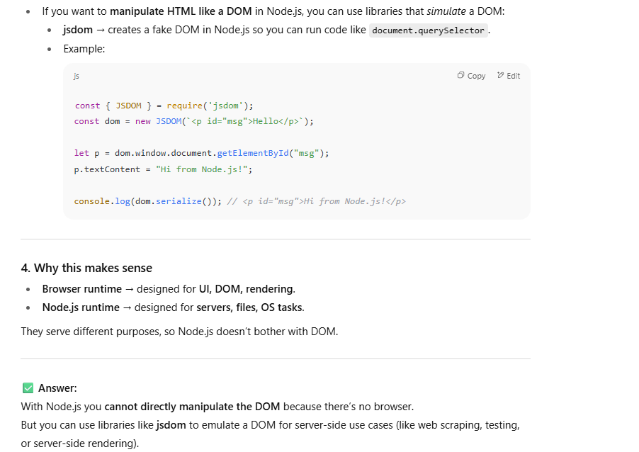

## What does “cross-platform” mean in general?

- **Cross-platform** = “works on multiple operating systems without changing code.”
    
- Platforms = Windows 🪟, macOS 🍏, Linux 🐧.
    
- If something is **cross-platform**, you can:
    
    - Write a program once.
        
    - Run it on different OSes with little/no modification.

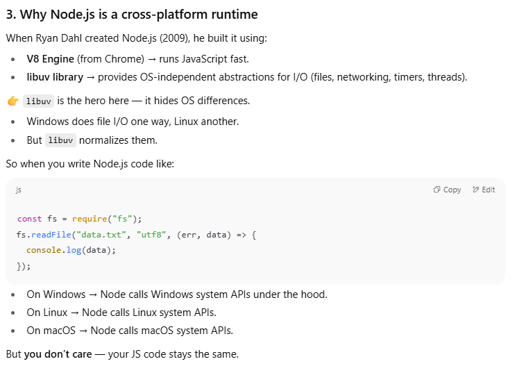

Before Node.js, if you wrote server software in **C/C++**, you often had to rewrite parts of it for different operating systems.  
Node.js removed that pain:

- Same JS code.
    
- Run anywhere (Windows, Linux, macOS).
    
- That’s why people call it a **cross-platform runtime**.

Node.js is a cross-platform runtime because it lets JavaScript code run outside the browser on any operating system (Windows, Linux, macOS) without needing to rewrite code, thanks to the V8 engine + libuv library handling OS differences under the hood.

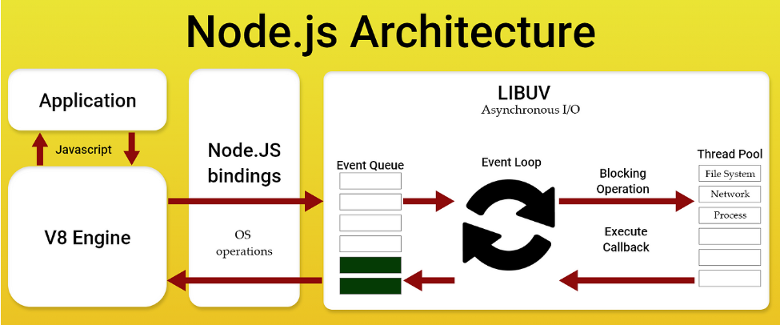

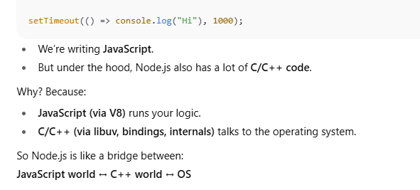

## **JavaScript Layer**

This is what _you_ interact with as a developer.

- It’s the **high-level APIs** written in JavaScript, exposed for you to use.
    
- Examples:
    
    - `setTimeout`
        
    - `fs.readFile`
        
    - `http.createServer`
        

But those functions you call in JS don’t _actually_ perform the task directly.  
Instead, they:

- Call into Node’s **C++ bindings layer**, which then interacts with the OS.

## **C++ Layer**

This is Node.js’ internal core, written in C/C++.

- Provides low-level implementations of things like file I/O, networking, timers.
    
- Uses **libuv** to talk to the operating system in a cross-platform way.
    
- Bridges the gap between **JavaScript (V8)** and **system calls (Windows/Linux/macOS)**.
    

For example:

- When you call `setTimeout` in JS → it’s defined in JS layer.
    
- That call is passed down to the **C++ layer** → which uses libuv to register the timer with the OS event loop.
    
- When the timer expires, libuv pushes the callback back into V8 to run your JS function.

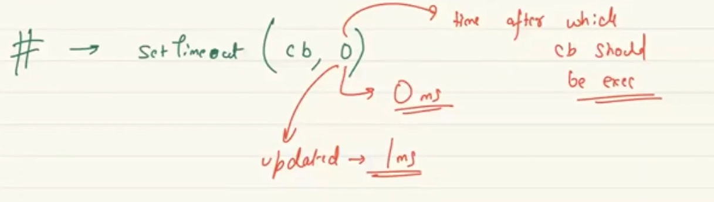

- Originally, JS only lived in **browsers** (sandboxed, no direct access to files, CPU, or network sockets beyond HTTP).

👉 That’s why JS by itself **cannot**:

- Open files on your disk.
    
- Talk directly to the network with sockets.
    
- Create threads.
    
- Call operating system functions like `read()` or `open()`.

It’s **too high-level and too restricted**.

## 2. Enter V8 (JS Engine)

- V8 is Google’s **JavaScript engine** (written in C++).
    
- Its job: take JS code and run it fast (compiles JS → machine code).
    
- But V8 only gives you **pure JS runtime**: numbers, strings, objects, promises.
    
- V8 has **no file system, no HTTP, no setTimeout** — those are added by _runtimes_ like browsers or Node.js.
    

👉 V8 = **executes your JS** but doesn’t give you OS powers.

## 4. Why Node.js Needs **Three Languages**

Node.js is a **hybrid system**:

1. **JavaScript (lib/ folder in repo)**
    
    - Friendly APIs developers use (`fs.readFile`, `http.createServer`, `setTimeout`).
        
    - Written in plain JS.
        
    - But these JS functions don’t “do” the work themselves — they **delegate down**.
        
2. **C++ (src/ folder in repo)**
    
    - The “glue” between JS (via V8) and the OS.
        
    - Defines **bindings** (native functions JS can call).
        
    - Example: JS `fs.readFile` → calls into a C++ function → which invokes libuv.
        
3. **C (deps/libuv, OpenSSL, zlib, etc.)**
    
    - Handles raw system-level tasks.
        
    - libuv (C library) = event loop + async I/O.
        
    - OpenSSL (C library) = HTTPS/crypto.
        
    - zlib (C library) = compression.
        

👉 Think of it like:

- **JS** = steering wheel, dashboard (easy for you).
    
- **C++** = gearbox, pedals (bridge).
    
- **C** = engine and wheels (directly push the OS).
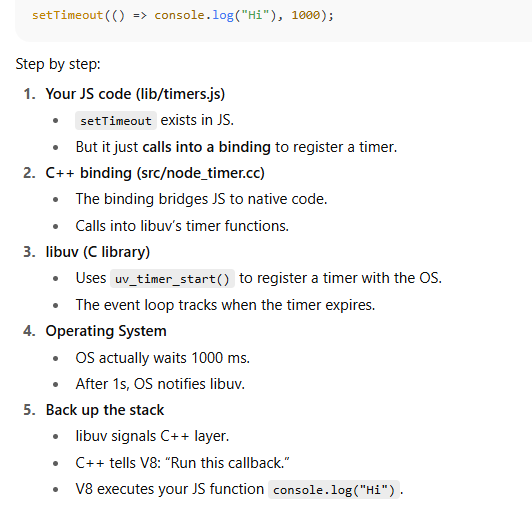

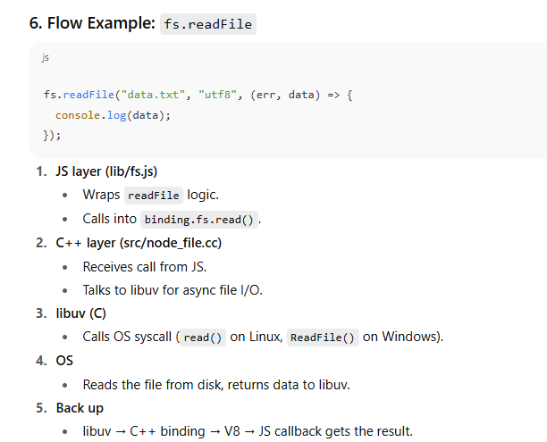

## Why Not “Just JS Everywhere”?

- **JS can’t make syscalls.** It can’t call Linux’s `read()`, or Windows’ `CreateFile()`.
    
- Without C/C++, JS is stuck in a sandbox.
    
- Node.js uses **C++** because:
    
    - It integrates with V8 (which is also C++).
        
    - It’s good for building large systems (classes, RAII, etc.).
        
- Node.js uses **C** because:
    
    - Libraries like libuv, OpenSSL, zlib are in C (closer to OS).
        

👉 So:

- If Node was **only JS** → no filesystem, no network, no timers.
    
- If Node was **only C++** → developers would hate it (too verbose).
    
- The combo gives us the best of both worlds.

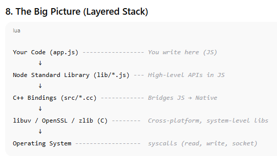

- Browser runtime and Node.js runtime communicate using the **Internet Protocols** (HTTP, WebSocket, etc).
    
- They don’t “share functions” or “call each other’s methods”.
    
- Instead:
    
    - **Browser = client** → makes request.
        
    - **Node.js = server** → listens and responds.
        

Think of it as:  
🔹 Browser runtime is like a **phone**.  
🔹 Node runtime is like the **telephone exchange**.  
The **HTTP protocol** is the “language” they use to talk.

## 1. What even is a JS engine?

- A **JavaScript engine** is a **program** that takes your **JS code (text)** and turns it into something the computer can actually run (**machine code**).
    
- It’s like the “brain” of JavaScript.
    
- Examples:
    
    - **V8** (Chrome, Node.js)
        
    - **SpiderMonkey** (Firefox)
        
    - **JavaScriptCore** (Safari)
        

---

## 2. Why do we need it?

Computers don’t understand `let x = 10;`.  
They only understand **binary machine instructions** (like `10101010`).  
So we need a translator → **JS Engine**.

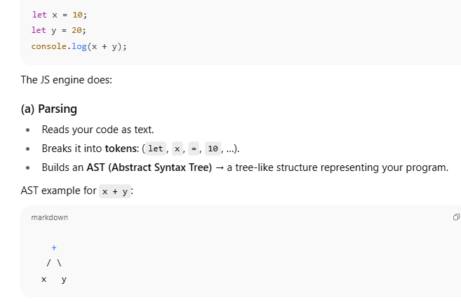

### (b) **Interpretation / Compilation**

- Old engines only **interpreted** JS (ran line by line → slow).
    
- Modern engines (like V8) use **JIT compilation**:
    
    1. Interpreter (Ignition in V8) → runs code quickly first.
        
    2. Profiler watches code that runs often (“hot code”).
        
    3. Compiler (TurboFan in V8) → optimizes hot code into **fast machine code**.
        

So your JS runs almost as fast as C++.

---

### (c) **Execution**

- The generated machine code executes on CPU.
    
- If optimization assumptions fail, V8 can **deoptimize** and go back to slower code.
    

---

### (d) **Memory Management**

- The engine also handles memory:
    
    - Allocates memory for variables, objects, arrays.
        
    - Uses **Garbage Collector (GC)** to clean unused memory automatically.

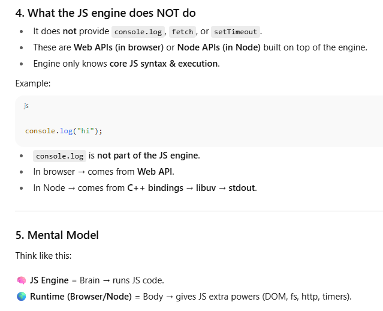

**A JavaScript engine takes raw JS code, parses it, compiles it into machine code, runs it on CPU, manages memory, but does not give external APIs (those come from the runtime).**

## 1. Node.js stack (zoomed in)

- **Your JS code** → runs inside **V8 engine**.
    
- V8 doesn’t know about files, timers, sockets.
    
- Node.js provides **bindings** (C++ + libuv) that let JS talk to the OS.
    
- **libuv** is like a “bridge” → it wraps OS features into a uniform API.
    

---

## 2. Example 1 → `console.log("hi")`

- Your JS calls `console.log`.
    
- Node maps that to **C++ code** that writes to `stdout`.
    
- `stdout` is just a **stream handled by the OS** (usually your terminal).
    
- OS sends the text to your terminal screen (maybe via a driver).
    

So yes → the OS prints it.

---

## 3. Example 2 → `setTimeout(() => {}, 1000)`

- You ask Node to run a callback after 1s.
    
- Node hands this request to **libuv**.
    
- libuv sets a **timer handle** using OS functionality (if available) or its own event loop logic.
    
- The OS keeps track of time (using its **system clock / kernel timers**).
    
- After ~1000 ms, OS notifies libuv → libuv pushes callback into Node’s event loop → your JS callback finally runs.
    

So yes → the **OS clock** is what makes timers reliable.

---

## 4. Example 3 → Networking (`http.createServer(...)`)

- Node asks OS: “Hey, listen on port 3000.”
    
- OS opens a **socket** (network endpoint).
    
- OS handles packets (TCP, UDP) at a low level.
    
- When a new request comes in, OS wakes Node/libuv, and your callback runs in JS.
    

So again → **OS does the heavy lifting**.

---

## 5. Key insight 🧠

✅ Node.js (and browser) → **abstractions**.  
✅ libuv + C++ → **bridge**.  
✅ OS → **real worker** (timers, IO, networking, processes, stdout, etc).  
✅ CPU → executes the final machine instructions.

---

👉 So your feeling is correct:  
**Everything in the end is done by the OS (or hardware, like CPU/clock). Node (and libuv) just give you a nice JS-friendly way to access it.**

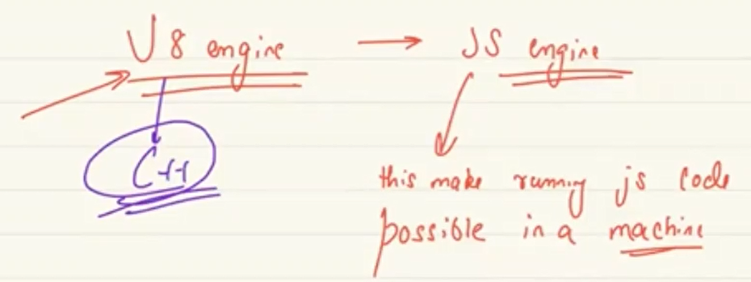

## Why do we have **many engines**?

Because **different companies, browsers, and projects** wanted their _own implementation_ of JavaScript. Reasons:

### (a) Browser competition 🏁

- Each browser wanted to optimize JS performance for _its own needs_.
    
- JavaScript was getting heavy (Google Docs, Gmail, React apps, etc.), so speed was a big deal.
    
- So:
    
    - **Google** built **V8** (used in Chrome, Node.js).
        
    - **Mozilla** built **SpiderMonkey** (first ever JS engine, still in Firefox).
        
    - **Apple** built **JavaScriptCore** (aka Nitro, in Safari).
        
    - **Microsoft** built **Chakra** (used in Edge Legacy).
        

---

### (b) Different trade-offs ⚖️

Each engine makes choices:

- **Speed vs Memory** (V8 goes for aggressive JIT optimization).
    
- **Security** (JavaScriptCore is deeply tied to Safari’s sandbox).
    
- **Portability** (SpiderMonkey is very hackable and used in many research projects).
    
- **Compatibility** with OS or tools.

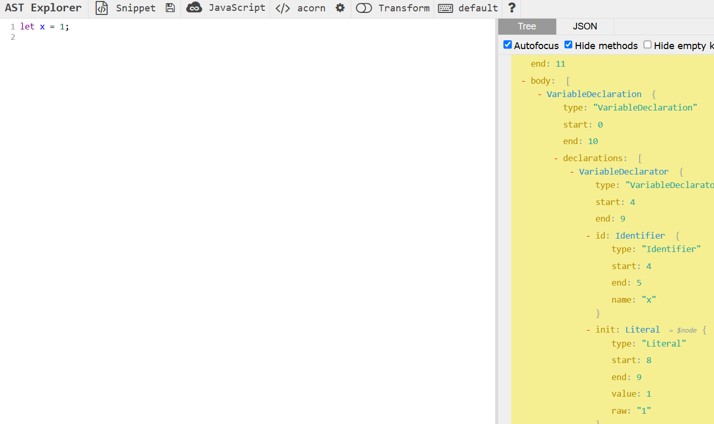
This is ast tree!!
# 🧩 Components of V8 Engine

## 1. **Parser**

👉 **Job:** Read raw JavaScript text and convert it into a structured format (AST).

- The computer doesn’t understand `"let x = 10;"`. It only sees it as text.
    
- Parser breaks it into **tokens** (like `let`, `x`, `=`, `10`, `;`).
    
- Then it builds a **tree** structure called the **Abstract Syntax Tree (AST)**.

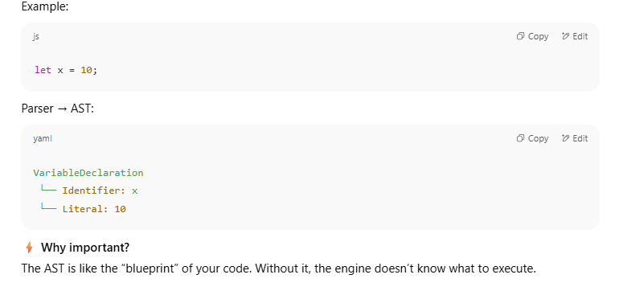

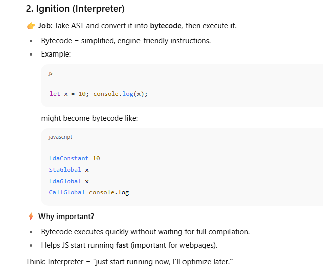

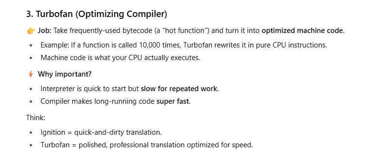

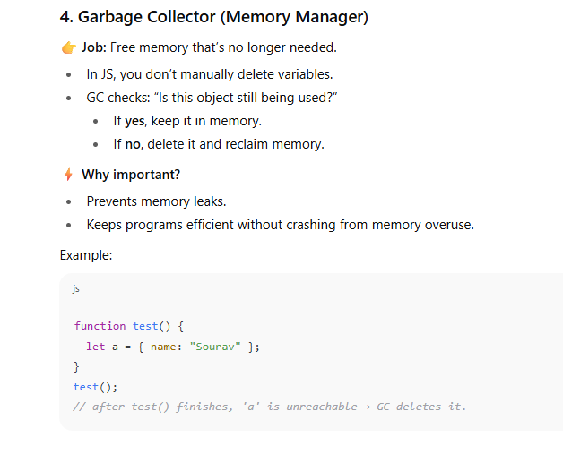

# 🔄 How They Work Together

1. Parser → builds AST from your JS text.
    
2. Ignition → AST → Bytecode → starts execution.
    
3. Turbofan → turns hot bytecode into optimized machine code.
    
4. Garbage Collector → cleans up memory during/after execution.
    

---

If you imagine V8 as a **kitchen**:

- Parser = reading the recipe.
    
- Ignition = start cooking quickly, even if messy.
    
- Turbofan = improve cooking with better tools once you know the recipe is used a lot.
    
- GC = cleaning up used dishes so the kitchen doesn’t overflow.

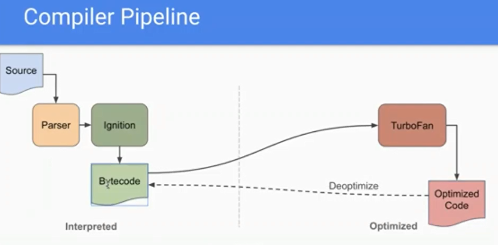

# 🧠 What is Compilation?

Compilation = turning **human-readable code** (JS, C, etc.) → **machine code** (CPU instructions).  
Two big styles:

---

## 1. **Ahead-of-Time Compilation (AOT)**

👉 Compile everything **before** the program runs.

- Example: C, C++
    
    - You run `gcc file.c → file.exe`.
        
    - Now `file.exe` is pure machine code.
        
    - CPU runs it directly — **super fast startup**.
        

⚡ Pros:

- Very fast execution (already machine code).
    
- No runtime compilation overhead.
    

⚠️ Cons:

- Can’t optimize based on _actual runtime behavior_.
    
- Big binaries (compiled upfront).
    

---

## 2. **Just-in-Time Compilation (JIT)**

👉 Compile **while the program is running**.

- Example: Java, JavaScript (V8).
    
- Steps:
    
    1. Start fast using interpreter (bytecode).
        
    2. While running, JIT notices “this function is hot 🔥”.
        
    3. Compiler converts that function → optimized machine code **on the fly**.
        

⚡ Pros:

- Optimizes based on **real program usage** (e.g., types of variables).
    
- Good balance: start fast, run fast later.
    

⚠️ Cons:

- Slower startup (compilation happens at runtime).
    
- More complex runtime (interpreter + compiler + GC).
    

---

# 🔎 Where V8 Fits

- **Parser** → AST.
    
- **Ignition (Interpreter)** → Bytecode (fast startup).
    
- **Turbofan (Compiler)** → JIT optimization.
    

So V8 uses a **hybrid model**:

- Start with Ignition (fast, but slower long-term).
    
- Promote hot code → Turbofan (JIT, fast long-term).
    

---

# 🔄 AOT vs JIT in Practice

|Feature|AOT (C/C++)|JIT (V8 JS)|
|---|---|---|
|Compilation time|Before running|While running|
|Startup speed|🚀 Fast|🐢 Slower (bytecode first)|
|Runtime optimization|❌ None|✅ Yes, based on usage|
|File size|Big binary upfront|Smaller (source + engine)|

---

# 🍩 Analogy

- **AOT**: You bake the entire cake in the morning → ready to eat instantly when someone asks.
    
- **JIT**: You start with a half-prepared dough, then finish baking only the slices people actually order → flexible but adds delay when cooking.
    

---

👉 Bonus: Some languages (like **Java with GraalVM**, or **.NET Native**) combine both:

- **Tiered compilation** = start JIT, but also allow optional AOT for known code.

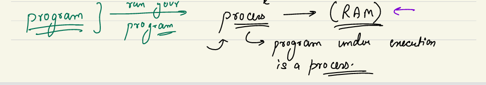

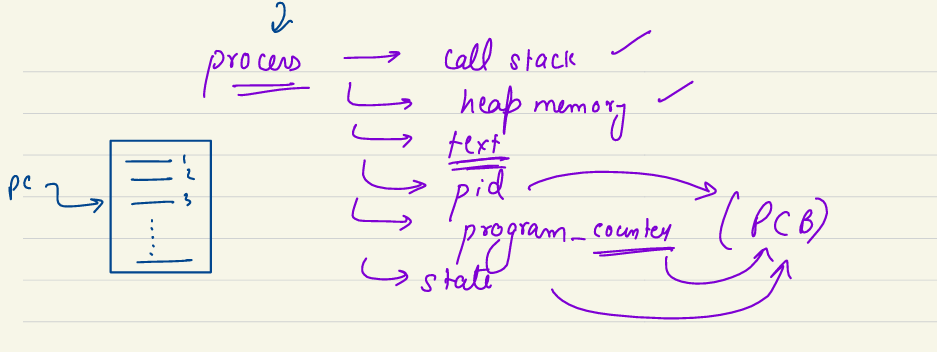

## 1. **Program vs Process**

- A **program** is just a passive piece of code stored on disk (e.g., `a.exe`, `python script.py`).
    
    - It contains instructions written by a programmer.
        
    - But it is not _doing anything_ yet — it’s just static data on storage (hard disk/SSD).
        
- A **process** is a **program in execution**.
    
    - When you run a program, the OS loads it from disk into **RAM**.
        
    - It assigns resources (memory, CPU time, etc.).
        
    - It becomes _active_ and starts executing instructions.
        
    - Example: Double-clicking `chrome.exe` creates a **Chrome process**.
        

👉 So:  
**Program = passive (on disk)**  
**Process = active (in RAM, running under OS)**

## 2. **What happens when a program becomes a process**

When the OS runs a program:

1. It loads the program into **RAM**.
    
2. It creates a **Process Control Block (PCB)** — a data structure that stores info about this process.
    
3. It allocates memory regions (explained below).
    
4. It sets up execution (starting point: the main function).

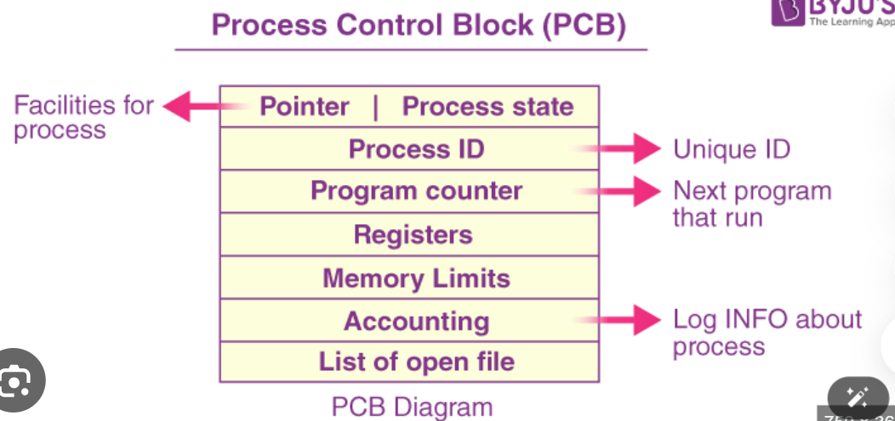

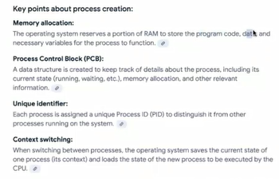

## 3. **Memory structure of a process**

A process in memory is divided into parts:

- **Text (Code segment)** → contains the actual machine instructions.
    
- **Heap memory** → dynamically allocated memory (`malloc`, `new` in C++/Java).
    
- **Call stack** → used for function calls, local variables, return addresses.
    
- **Data segment** → global variables, static variables.
    

So when you write a program, once running, it has:

- **Code (text)**
    
- **Heap**
    
- **Stack**
    
- **Data**

## 4. **Process Control Block (PCB)**

The PCB is like an **ID card** of a process that the OS uses to manage it.  
It stores:

- **PID (Process ID):** Unique identifier for each process.
    
- **Program Counter (PC):** Address of the next instruction to execute.
    
- **Process State:** Running, Ready, Waiting, etc.
    
- **CPU Registers:** Current values of registers (so it can resume later).
    
- **Memory info:** Which memory areas (heap, stack, text) belong to the process.
    
- **Scheduling info:** Priority, etc.
    

👉 When a process is stopped and later resumed, the PCB makes sure it continues from **exactly where it left off**.

