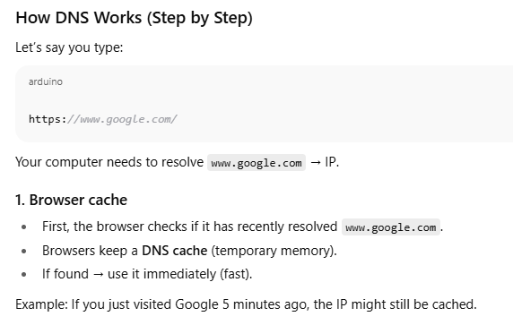
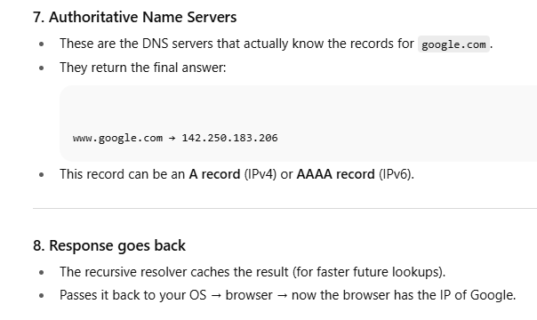
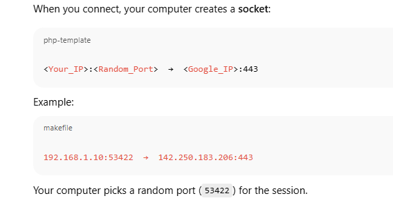
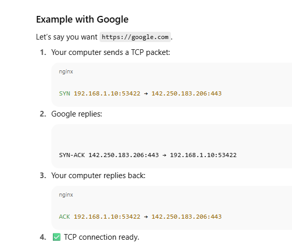
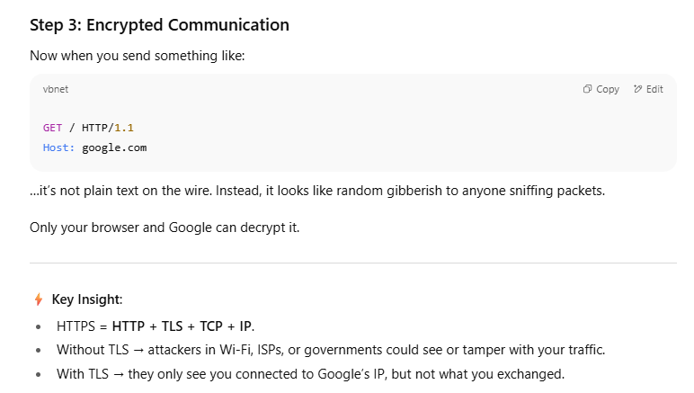
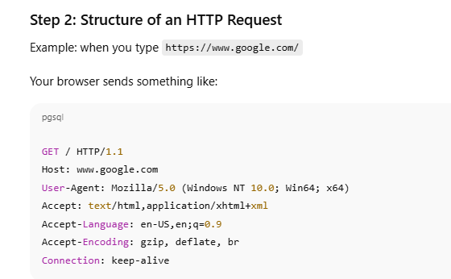
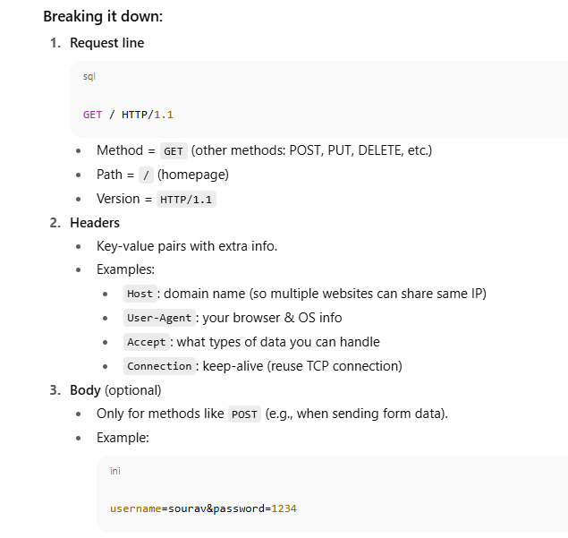
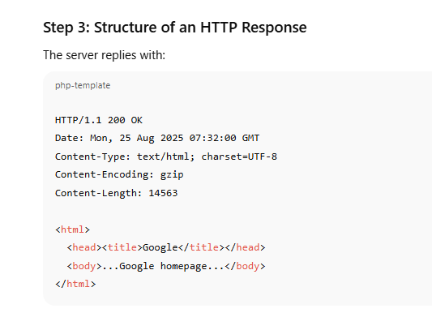
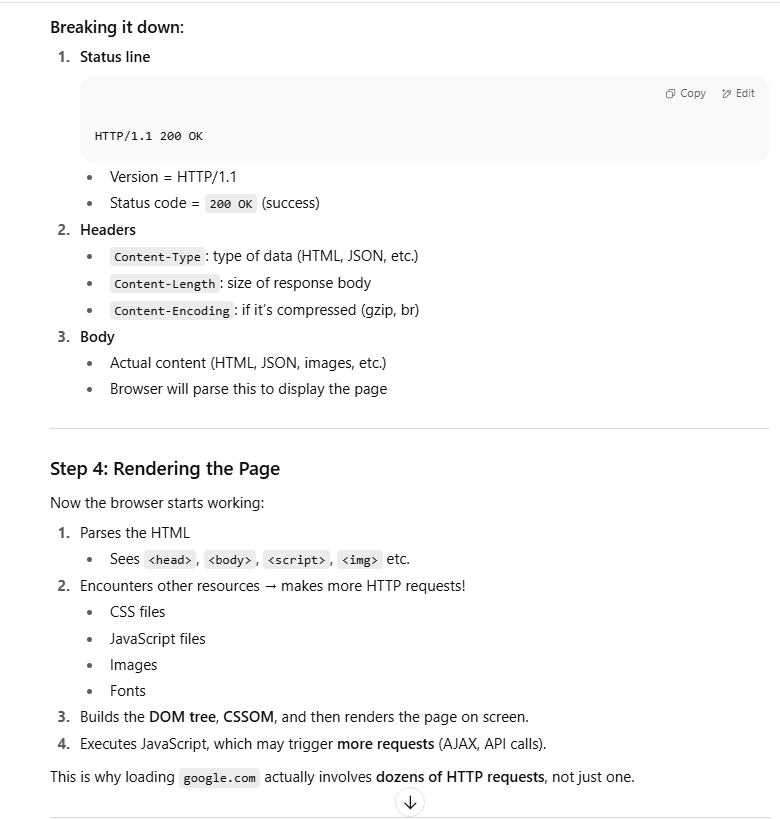

### Step 1: The Starting Question

👉 _What happens when you type `google.com` in the browser and press Enter?_

To answer this, we need to understand a **chain of events** that happen, from your computer all the way to Google’s servers, and back again. At a high level:

1. **You enter a URL** (`https://www.google.com`) in the browser.
    
2. The browser needs to know the **IP address** of `google.com` (because the internet runs on IPs, not names).
    
3. This requires **DNS resolution** (turning the human-readable name → IP address).
    
4. Once the IP is known, your computer establishes a **connection** (TCP, TLS/HTTPS).
    
5. Then it sends an **HTTP request** (like “give me Google’s homepage”).
    
6. Google’s server processes the request and sends back a **response**.
    
7. The browser receives it and **renders the webpage**.
    

Now let’s go into **depth**, one topic at a time.

### Topic 1: What is a URL?

A **URL** (Uniform Resource Locator) is the way we humans specify _where something is on the web_.

Example:https://www.google.com/search?q=chatgpt

It has parts:

1. **Scheme / Protocol** → `https://`
    
    - Tells the browser _how_ to talk to the server.
        
    - `http` (not secure) or `https` (secure, encrypted).
        
    - Others exist: `ftp://`, `mailto:`, etc.
        
2. **Host** → `www.google.com`
    
    - The domain name of the server.
        
    - Needs to be converted into an IP to actually find the server.
        
3. **Port** (optional) → If not specified, defaults:
    
    - 80 for HTTP
        
    - 443 for HTTPS
        
4. **Path** → `/search`
    
    - The “location” on the server. Like a folder/file.
        
5. **Query parameters** → `?q=chatgpt`
    
    - Extra data sent to the server (in this case: `q` = “chatgpt”).
        
6. **Fragment** (optional, not sent to server) → `#section1`
    
    - Just tells the browser where to jump in the page.

## Topic 2: Why the server needs an IP

Imagine you’re sending a letter:

- The **name** (`google.com`) is like saying _“send it to Google”_.
    
- But the **postal system** doesn’t work on names — it needs an **address** (like “1600 Amphitheatre Parkway, Mountain View, CA”).
    
- On the internet, that “address” is an **IP address**.
    

### What is an IP?

An **IP address (Internet Protocol address)** is a unique identifier for every device on a network. It’s how computers find each other.

Two main versions:

1. **IPv4**:
    
    - Example: `142.250.183.206` (one of Google’s IPs).
        
    - Format: 4 numbers (0–255) separated by dots.
        
    - Total: ~4.3 billion possible addresses.
        
    - Problem: we ran out of IPv4 addresses.
        
2. **IPv6**:
    
    - Example: `2404:6800:4009:823::200e`
        
    - Much larger address space (2^128 addresses).
        
    - Slowly replacing IPv4.
        

### Why can’t we just use IPs?

- Humans can’t remember `142.250.183.206` easily.
    
- Servers can change IPs (e.g., load balancing, moving data centers).
    
- That’s why we need **domain names** → easy to remember, and they can point to different IPs dynamically.
    

---

⚡ **Key connection**:

- Browser has `google.com`.
    
- It needs the IP (like `142.250.183.206`).
    
- This translation is done by **DNS**.

## Topic 3 Preview: DNS Basics

Before we dive deep into DNS resolution, here’s a taste:

- DNS = **Domain Name System**.
    
- Works like a **phonebook**:
    
    - You know the person’s name (“Google”).
        
    - DNS tells you their phone number (IP).
        
- DNS itself is a huge distributed system across the world.
    
- Even DNS servers themselves have IPs! (otherwise how would you reach them?).

# Topic 3: DNS (Domain Name System)

### The Problem It Solves

- Humans: remember names → `google.com`.
    
- Computers: need numbers → `142.250.183.206`.
    
- DNS is the **translation system** between the two.
    
- Think of it like a **giant phonebook of the internet**, but it’s not centralized in one place — it’s **distributed globally**.

### 2. OS cache

- If browser doesn’t have it, it asks the **Operating System’s DNS resolver**.
    
- Your OS also maintains a cache.
    
- On Linux/macOS → `nscd`, `systemd-resolved`.
    
- On Windows → DNS Client Service.
    

---

### 3. Router cache

- If OS doesn’t know, it forwards the request to the **DNS server configured in your network settings** (usually your router or your ISP’s resolver).
    
- Routers sometimes cache DNS too.

### 4. Recursive Resolver (ISP or public DNS)

- If router doesn’t know, it sends the request to a **recursive DNS resolver**.
    
- Examples:
    
    - ISP’s resolver
        
    - Public resolvers (Google DNS `8.8.8.8`, Cloudflare `1.1.1.1`)
        
- Recursive resolver’s job: do all the hard work of finding the IP by querying other DNS servers.
### 5. Root Servers

- If recursive resolver doesn’t have the answer, it starts from the top:
    
    - Root servers (there are 13 logical root servers worldwide).
        
    - They don’t know the IP of `google.com`, but they know where to find **TLD servers** (`.com`, `.org`, `.net`, etc.).

### 6. TLD (Top-Level Domain) Servers

- The `.com` DNS servers know: _“I don’t have the exact record, but I know which DNS servers handle `google.com`.”_
    
- They give back the **Authoritative Name Server** for `google.com`.

You type `www.google.com`:

1. Browser cache? ❌ Not found.
    
2. OS cache? ❌ Not found.
    
3. Router cache? ❌ Not found.
    
4. Recursive resolver (e.g., Google’s `8.8.8.8`)? ❌ Doesn’t have it.
    
5. Root server → says: “Ask `.com` servers.”
    
6. `.com` server → says: “Ask Google’s authoritative servers.”
    
7. Google’s authoritative server → replies with IP `142.250.183.206`.
    
8. Your computer finally has the IP.
    

---

⚡ **Key Insight**: Even DNS servers themselves are reached via IP.

- Example: Google DNS (`8.8.8.8`) is an IP.
    
- When you configure DNS in your system, you set an IP, not a name.
    
- This is the “bootstrap problem” solved by having **well-known IPs** for DNS resolvers.
    

---

✅ Now your browser has the IP → next step: **establishing a connection with that server (TCP, then TLS if HTTPS).**

**DNS → IP** into **how your computer actually connects to that server**.

You now have Google’s IP address. But just knowing the IP isn’t enough — you need a **connection** to send and receive data. This is where **TCP** comes in.

# Topic 4: TCP Connection

### Why TCP?

- The Internet (IP layer) just delivers packets, but:
    
    - They may arrive **out of order**
        
    - They may get **lost**
        
    - They may get **duplicated**
        
- TCP (Transmission Control Protocol) sits _on top of IP_ to provide:  
    ✅ Reliability  
    ✅ Ordered delivery  
    ✅ Error detection & correction  
    ✅ Flow control (not overwhelming the receiver)
    

That’s why most of the web (HTTP/HTTPS) uses TCP.

## Step 1: Ports & Sockets

- IP tells _where the machine is_.
    
- **Port number** tells _which application on that machine_.
    

Example:

- `google.com:443` → IP `142.250.183.206` on port `443`.
    
- Port 443 = HTTPS
    
- Port 80 = HTTP
    
- Port 25 = SMTP (mail)
    

💡 Think: The IP is the _street address_, the port is the _apartment number_.

When you connect, your computer creates a **socket**:

## Step 2: TCP 3-Way Handshake

Before sending real data, TCP does a handshake to establish a **reliable connection**.

Sequence:

1. **SYN** (Synchronize)
    
    - Your computer → Google:  
        “Hey, I want to start a connection. Here’s my sequence number.”
        
2. **SYN-ACK** (Synchronize-Acknowledge)
    
    - Google → Your computer:  
        “Got it. Here’s my sequence number. I acknowledge yours.”
        
3. **ACK** (Acknowledge)
    
    - Your computer → Google:  
        “Acknowledged. Let’s talk.”
        

✅ Now the connection is established.

## Step 3: Data Transmission

Now real data (HTTP request) flows:

- Data is broken into **segments**.
    
- TCP ensures all packets arrive in order.
    
- If some are lost, TCP retransmits.
    

---

⚡ **Key Insight**:

- TCP handshake happens _before_ HTTP request.
    
- For HTTPS, after TCP, there’s an **extra handshake (TLS/SSL)** for encryption.
    

---

✅ At this point, your browser has:

1. DNS → IP of Google
    
2. TCP connection established to port 443

# Topic 5: TLS Handshake (for HTTPS)

### Why TLS?

- TCP gives reliability, but **no security**.
    
- If we only used TCP+HTTP:
    
    - Data is sent **in plain text** (anyone on the path can read it).
        
    - Attackers can **modify packets** (man-in-the-middle attack).
        
- TLS adds:  
    ✅ Encryption (privacy)  
    ✅ Authentication (is this really Google?)  
    ✅ Integrity (data not altered in transit)

## Step 1: Certificates & Public Key Infrastructure (PKI)

- Every HTTPS website has a **digital certificate**.
    
- Certificate includes:
    
    - Domain name (e.g., `google.com`)
        
    - Server’s **public key**
        
    - Issuer info (a Certificate Authority, like DigiCert, Let’s Encrypt, etc.)
        
- Your browser **trusts** a set of Certificate Authorities (CAs).
    

So when you connect to `https://google.com`, the server shows you its certificate, and your browser checks:

- Is it issued by a trusted CA?
    
- Is it valid (date not expired)?
    
- Does it match the domain you typed?
    

If all good → browser trusts it.

## Step 2: TLS Handshake (Simplified Flow)

### 1. **Client Hello**

- Your browser → Google:
    
    - “Hi, I want to talk securely. Here are the encryption algorithms (cipher suites) I support.”
        
    - Sends a random number (used later in key generation).
        

### 2. **Server Hello**

- Google → Your browser:
    
    - Chooses one encryption algorithm from your list.
        
    - Sends its certificate (with public key).
        
    - Sends another random number.
        

### 3. **Certificate Verification**

- Browser checks Google’s certificate against its trusted CA list.
    
- If fake or expired → you get “⚠️ Your connection is not private.”
    

### 4. **Key Exchange**

- Browser and server now need to agree on a **shared secret key** (used for symmetric encryption).
    
- Done using one of these:
    
    - **RSA** (older): Browser encrypts a secret with server’s public key.
        
    - **Diffie-Hellman / ECDHE** (modern): Both sides exchange values and independently compute the same secret.
        

### 5. **Session Key Created**

- Both sides now have the same session key.
    
- From this point onward:
    
    - Data is encrypted with **symmetric encryption** (fast).
        
    - Only browser & server know the key.
        

### 6. **Handshake Finished**

- Browser: “I’m ready, encrypted from now on.”
    
- Server: “Same here.”
    

✅ Secure channel established.

# Topic 6: HTTP Request–Response Cycle

### Recap of where we are:

- URL typed → DNS gave IP
    
- TCP handshake established connection
    
- TLS handshake secured the connection
    
- ✅ Now: browser sends **HTTP request** through that secure channel
    

---

## Step 1: What is HTTP?

- **HyperText Transfer Protocol** → the language browsers & servers use to talk.
    
- It’s **application-layer** (on top of TCP/TLS).
    
- It defines rules:
    
    - How requests are structured
        
    - How responses are structured
        

Versions:

- **HTTP/1.1** (most common, uses text-based requests)
    
- **HTTP/2** (binary, multiplexing, faster)
    
- **HTTP/3** (uses QUIC, UDP-based, even faster)
    

For now, let’s stick with **HTTP/1.1** (the basics).

**Key Insight**:

- HTTP is **stateless** → each request is independent.
    
- That’s why cookies, sessions, tokens exist (to maintain “logged-in” state).
    

---

✅ Now we’ve fully gone through:

1. URL → DNS → IP
    
2. TCP connection
    
3. TLS handshake (secure channel)
    
4. HTTP request → response → browser rendering
    

👉 Next, I can teach you about **optimization details** like:

- Why `Connection: keep-alive` matters
    
- HTTP/2 multiplexing vs HTTP/1.1
    
- HTTP/3 (QUIC over UDP)

