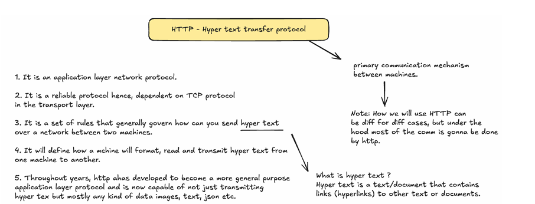

HTTP is a general purpose protocol! Har jagah use ho skata hai wo with some extra work!!

- **HTTP (Hypertext Transfer Protocol)** is indeed a **network protocol at the application layer**.
    
- It’s commonly used for **communication between machines on the web** (like your browser talking to a server).
    
- But HTTP is **not the only networking protocol**.
    

👉 Think of networking as a layered model:

1. **Application layer** – HTTP, FTP, SMTP, DNS, etc. (depends on the use case).
    
2. **Transport layer** – TCP or UDP. (HTTP relies on TCP).
    
3. **Network layer** – IP (routes packets).
    
4. **Link/Physical layers** – Ethernet, Wi-Fi, etc.

### 🔹 HTTP/1.0

- No support for persistent connections.
    
- Each request → new TCP connection → response → close.
    
- Very inefficient (lots of overhead).
    

---

### 🔹 HTTP/1.1

- **Persistent connection** (a single TCP connection can handle multiple requests/responses).
    
- Supports **chunked transfer encoding** → responses can be streamed in parts.
    
- Became the **most widely used version** for a long time.
    

---

### 🔹 HTTP/2

- Big performance improvements:
    
    - **Multiplexing**: multiple requests/responses can be sent in parallel over one TCP connection.
        
    - **Header compression** (HPACK) → reduces overhead.
        
    - **Server push**: server can send data without the client asking first.
        

---

### 🔹 HTTP/3

- Uses **QUIC protocol** instead of plain TCP.
    
    - QUIC is built on **UDP** but provides reliability like TCP.
        
    - Handles packet loss better → faster page loads, lower latency.
        
    - Default in modern browsers like Chrome, Edge, and services like Google & Cloudflare.