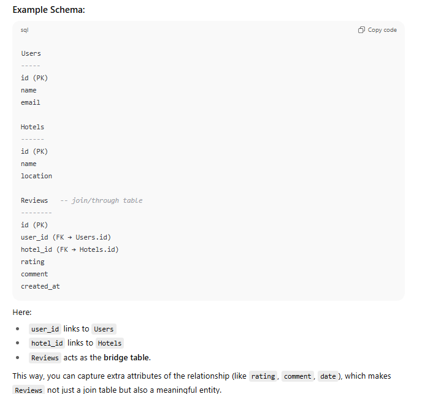
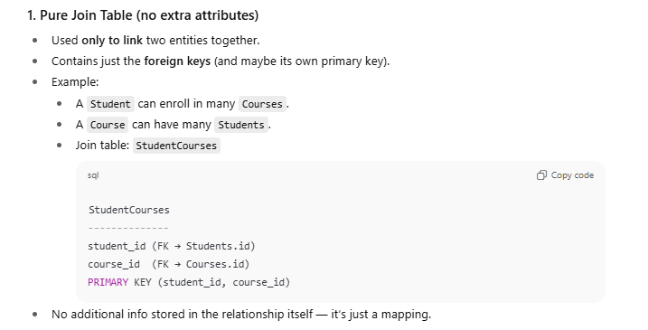
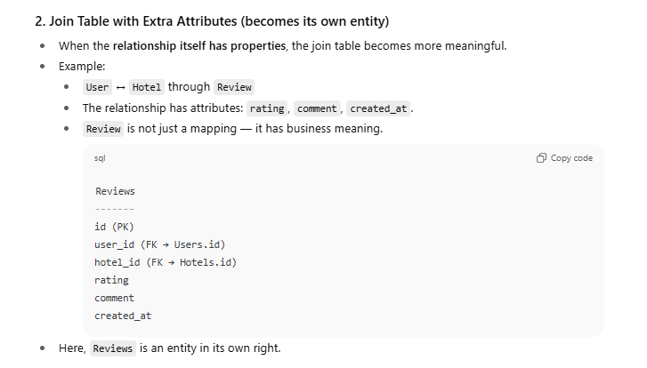
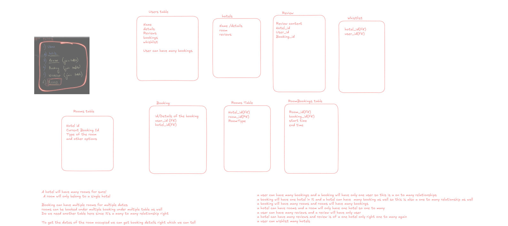
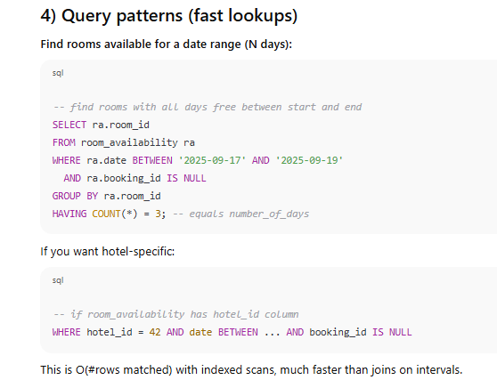
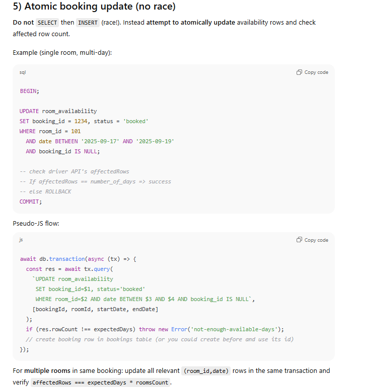
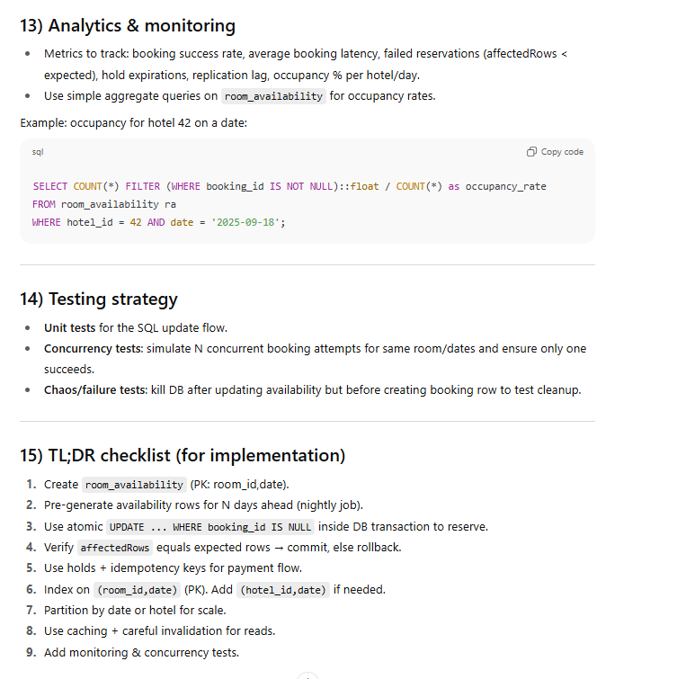
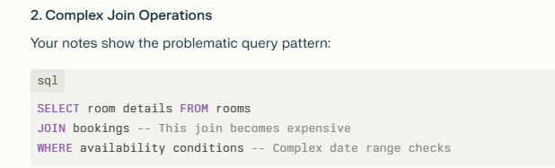
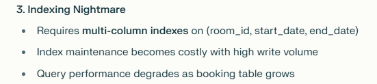
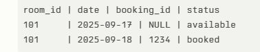

## 1. What is Data Modeling / DB Schema Design?

It’s the process of:

- Understanding the problem domain (what the app needs to store).
    
- Identifying **entities** (things you need to keep data about, like _Users, Orders, Products_).
    
- Defining **relationships** between them (one-to-many, many-to-many, etc.).
    
- Mapping this into tables with keys (primary keys, foreign keys) or collections (if NoSQL).
    
- Ensuring the schema is efficient, scalable, and prevents redundancy.
    

Basically: **turning real-world requirements into structured data storage**.

WHY IS IT ASKED!!
Because:

- Every application needs persistent data storage.
    
- It tests your **understanding of problem breakdown, relational thinking, and trade-offs**.
    
- It shows whether you can think in terms of **entities, relationships, normalization, and queries**.
    

It’s often paired with system design at a smaller scale (sometimes called **"low-level design"** for freshers).


## 3. Typical Flow in an Interview

You’ll usually get a **requirement** and be asked to design a DB schema for it.

### Example:

👉 “Design a schema for a food delivery app (like Swiggy/Zomato).”

Steps:

1. **Identify entities**
    
    - Users, Restaurants, Dishes, Orders, Payments, Delivery Partners.
        
2. **Define attributes**
    
    - User: id, name, email
        
    - Restaurant: id, name, location
        
    - Order: id, userId, restaurantId, status, totalAmount, createdAt
        
3. **Relationships**
    
    - A user can place many orders → (1-to-many)
        
    - An order can have many dishes → (many-to-many, need a join table `OrderItems`)
        
    - A restaurant has many dishes → (1-to-many)
        
4. **Sketch schema**  
    Tables:
    
    - `Users(id PK, name, email, phone, createdAt)`
        
    - `Restaurants(id PK, name, location)`
        
    - `Dishes(id PK, restaurantId FK, name, price)`
        
    - `Orders(id PK, userId FK, restaurantId FK, status, totalAmount, createdAt)`
        
    - `OrderItems(orderId FK, dishId FK, quantity)`
        
    - `Payments(id PK, orderId FK, amount, method, status, createdAt)`
        
5. **Discuss trade-offs**
    
    - Normalization vs denormalization (do you store dish price in `OrderItems` too, to keep historical price? → Yes).
        
    - Scaling (sharding, indexes).


# Principles of DB Schema Design for Interviews (Explained from Scratch)

## **1. Minimize Data Duplication → Normalization**

- **Why?**  
    Duplicate data wastes storage, makes updates harder (if the same data is stored in 3 tables, you need to update all), and increases chances of inconsistency.  
    → e.g., if a user’s phone number changes, and you stored it inside _orders_ as well as _users_, you risk stale data.
    
- **How to achieve this? → Normalization**  
    Normalization is breaking data into multiple related tables so each fact is stored only once.
    
    - **1NF (First Normal Form):** No repeating groups or arrays inside a row. Each column must hold atomic values.  
        _Bad:_ `orders(id, items = "pizza, burger")`  
        _Good:_ Split into `orders` and `order_items`.
        
    - **2NF (Second Normal Form):** Every non-key column must depend on the **whole primary key**.  
        _Bad:_ In `order_items(orderId, dishId, dishName)`, dishName depends only on dishId, not (orderId + dishId).  
        _Good:_ Move `dishName` into `dishes` table.
        
    - **3NF (Third Normal Form):** No transitive dependencies (non-key column depending on another non-key).  
        _Bad:_ In `users(id, city, state)`, state depends on city, not directly on id.  
        _Good:_ Move `city → state` mapping into a separate table.
        
- **Trade-off**: Too much normalization = too many joins → slow queries.  
    👉 That’s why we sometimes **denormalize** for performance (e.g., storing dish price inside `order_items` to preserve historical prices).


## **2. Tables Should Reflect Relationships + Queries**

- **Why?**  
    DB design isn’t just about storing data — it’s about **retrieving it efficiently**. If you design only for storage, queries will become painful.
    
- **Relationships you need to model:**
    
    - **1:1** → e.g., `user` and `user_profile`
        
    - **1:M (one-to-many)** → e.g., one `restaurant` has many `dishes`
        
    - **M:N (many-to-many)** → e.g., one `order` can contain many `dishes` AND one `dish` can be in many `orders` → needs a **junction table** like `order_items`
        
- **Design with Queries in Mind:**  
    Always ask: _What queries will the app run most often?_  
    Example (for Zomato/Blinkit):
    
    - Show all items in a restaurant → need index on `dishes.restaurantId`.
        
    - Show all past orders of a user → need index on `orders.userId`.
        
    - Show top 10 selling items → design `order_items` table so you can aggregate quickly.
        

👉 So schema design = **entities + attributes + relationships + query patterns**.


## **3. Keep It Real — Use Domain-Specific Scenarios**

- **Why?**  
    In interviews, they often test if you can **map a real-world product into a schema**. It shows you can understand the company’s business domain.
    
- **Example:** If interviewing at Zomato/Swiggy →  
    They might ask: “Design a DB schema for an online grocery delivery system (like Blinkit).”
    
    You’d say:
    
    - **Entities**:
        
        - `Users` (customers)
            
        - `Restaurants` / `Stores`
            
        - `Products` (items sold)
            
        - `Orders`
            
        - `OrderItems`
            
        - `Payments`
            
        - `DeliveryPartners`
            
    - **Relationships**:
        
        - A `user` can place many `orders`.
            
        - An `order` can have many `products` → via `order_items`.
            
        - A `store` sells many `products`.
            
        - A `deliveryPartner` delivers many `orders`.
            
    - **Query-driven design:**
        
        - “Get all active orders for a delivery partner” → `orders` indexed on `deliveryPartnerId + status`.
            
        - “Get user’s order history” → `orders.userId`.
            
        - “Get top 5 products sold today” → aggregation on `order_items`.
            

👉 By **tying the schema to real-life business use cases**, you show the interviewer you think like a product engineer, not just a coder.


# 📝 Cheat-Sheet You Can Use in Interview

Whenever asked to design a DB schema:

1. **Clarify the requirements** (What entities exist? What data do we need to store?).
    
2. **List entities + attributes**.
    
3. **Define relationships** (1:1, 1:N, M:N).
    
4. **Apply normalization** (reduce duplication, avoid anomalies).
    
5. **Check query patterns** (make sure frequent queries are efficient).
    
6. **Consider trade-offs** (normalization vs denormalization, indexing, scalability)

## _“Design a DB schema for a hotel booking system (like Booking.com)”_

The interviewer isn’t looking for a **perfect production schema** — they’re looking at your **thought process, clarity, and ability to reason about trade-offs**.
Kyonki har approach k koi na koi trade off honge honge hi honge


# 🧭 Step-by-Step Approach in an Interview

---

## **1. Clarify Requirements First (Don’t Jump to Tables)**

Ask questions to narrow scope. Example:

- Can users book multiple rooms at once?
    
- Can a room be booked by multiple people at the same time? (No → must prevent double booking).
    
- Do we support reviews, payments, cancellations?
    
- Do we support multiple cities/countries?
    

👉 This shows you **think like a product engineer**.


## **2. Identify Core Entities**

Think in **nouns** from the problem statement. For Booking.com:

- Users (customers)
    
- Hotels
    
- Rooms (each hotel has multiple rooms)
    
- Bookings
    
- Payments
    
- Reviews
    

(You can add extras if time permits: amenities, locations, loyalty points, etc.)

## **3. Define Relationships**

Now, link them:

- A `Hotel` has many `Rooms` (1-to-many).
    
- A `User` can make many `Bookings` (1-to-many).
    
- A `Booking` is for 1 `Room`, but can also include multiple days (date range).
    
- A `Booking` has 1 `Payment`.
    
- A `User` can write many `Reviews` for many `Hotels` (many-to-many, solved by `Reviews` table).


## NOTE
- You have **Table A** (say, `Users`)
    
- You have **Table B** (say, `Hotels`)
    
- A user can review many hotels, and a hotel can have reviews from many users → that’s a **many-to-many relationship**.
    

👉 To resolve this, you always introduce a **third table (join/through table)**











NOW MY SOLUTION!




 This is a naive approach that most developers initially consider, but fails under real-world load. The date-centric, pre-computed availability approach you're advocating is exactly what production booking systems like Booking.com and Airbnb use to handle millions of concurrent users without overbooking incidents.

The key insight is treating **availability as first-class data** rather than a derived calculation, which transforms expensive read operations into simple index lookups while making write operations atomic and safe.


# 1) Problem 

- Naive design stores bookings as time-interval rows and derives availability by joining `rooms ↔ bookings`.
    
- That causes heavy write contention, expensive date-range joins, complex indexing, and risk of overbooking under concurrency.

# 2) High-level solution idea

**Treat availability as first-class, precomputed data**.  
Create a `room_availability` table with one row per `(room_id, date)` (or the smallest time unit you need). Read queries become cheap indexed lookups; writes become atomic updates on predictable rows.


```SQL
-- simplified Postgres-style
CREATE TABLE rooms (
  id BIGSERIAL PRIMARY KEY,
  hotel_id BIGINT NOT NULL,
  room_type TEXT,
  capacity INT
);

CREATE TABLE bookings (
  id BIGSERIAL PRIMARY KEY,
  user_id BIGINT NOT NULL,
  created_at TIMESTAMP DEFAULT now(),
  status TEXT,           -- 'confirmed', 'cancelled', 'pending'
  total_amount NUMERIC
  -- add idempotency_key if needed
);

-- availability: one row per room per date
CREATE TABLE room_availability (
  room_id BIGINT NOT NULL,
  date DATE NOT NULL,
  booking_id BIGINT NULL,       -- NULL => available, otherwise linked booking
  hold_id UUID NULL,            -- optional: temporary hold before payment
  status TEXT NOT NULL DEFAULT 'available',
  PRIMARY KEY (room_id, date)
);

```


- `PRIMARY KEY (room_id, date)` gives fast row-level lookup/locking for updates.
    
- Optionally include `hotel_id` in `room_availability` (denormalization) to avoid JOINs when searching by hotel — useful at scale.







Why this works:

- The `UPDATE ... WHERE booking_id IS NULL` is atomic: concurrent attempts will only let the first succeed for those rows; others will only affect fewer rows and you can detect failure and rollback.
    

---

# 6) Holds / Payment flow (recommended patterns)

Two common patterns:

A. **Reserve first → Charge**

1. Atomically reserve availability (as above) and set `booking.status = 'pending'`.
    
2. Charge payment.
    
3. On success, set `booking.status = 'confirmed'`.
    
4. On payment failure, rollback or release availability.
    

B. **Hold token then confirm**

1. Create a short-lived `hold` on the availability: update `hold_id` and `hold_expires_at` (instead of booking_id).
    
2. User completes payment within X minutes. If confirmed, swap `hold_id` → `booking_id`. Background job clears expired holds.
    

Use **idempotency keys** for payment and booking creation to prevent duplicate charges / multiple bookings on retry.

---

# 7) Indexing & storage tradeoffs (practical)

- **Primary key on (room_id, date)** is critical: it gives direct point-update performance.
    
- Common search: filter by `date` and `hotel_id` → add index on `(date, hotel_id)` or `(hotel_id, date)`. Choose based on whether your typical query filters by hotel first or by date first.
    
- If your search mostly uses date range + hotel, use `(hotel_id, date)`.
    
- If you do many updates by `(room_id, date)` keep the PK and maybe an extra index on `date` for range scanning across hotels.
    
- **Denormalization**: storing `hotel_id` in `room_availability` speeds room search (avoids JOIN); small duplication cost vs big query win.
    

Storage example (ballpark): `rooms * days * row_size` — usually cheap on modern infra.

---

# 8) Partitioning & sharding (scale)

- Partition `room_availability` by date range (monthly/yearly) or by hotel region to keep partitions small and speed queries/maintenance.
    
- Partitioning helps purge old data and reduce index size.
    
- If sharding by hotel, ensure bookings don't cross shards. If multi-shard bookings are needed, you'll face distributed transactions (avoid if possible).
    

---

# 9) Caching & replication

- Availability checks are read-heavy — use **read replicas** and caches (Redis).
    
- Be careful: after a booking write, read-replica lag can cause stale reads. Use one of:
    
    - Read from primary immediately after write for the booking confirmation step.
        
    - Invalidate cache keys for affected rooms/dates on successful booking.
        
    - Short TTLs for cache entries.
        
- Cache key idea: `availability:hotel:42:2025-09-17:2025-09-19` — invalidate on booking.
    

---

# 10) Concurrency controls & isolation

- Single `UPDATE` + check pattern avoids explicit locks. It relies on row locking semantics in the DB.
    
- Alternative approaches:
    
    - **SELECT ... FOR UPDATE** then update (locks rows but requires they exist).
        
    - **Optimistic retry**: attempt UPDATE and retry on failure a small number of times.
        
    - **Advisory locks** for coarse-grain locking per-room, but avoid at scale.
        
- Isolation level `READ COMMITTED` with atomic UPDATE pattern is usually enough. `SERIALIZABLE` is heavier and often unnecessary.
    

---

# 11) Cancellations & refunds

- On cancellation: in a transaction, set `booking.status = 'cancelled'` and set `room_availability.booking_id = NULL` for affected dates; commit after refund completed (or have compensation step).
    
- For partial refunds, store refund policy metadata and calculate amounts.
    

---

# 12) Edge cases & cautions

- **Timezones**: store dates/times in UTC; convert for local display. For hotel check-in/out you may treat nights as date boundaries in hotel local time.
    
- **Partial-day bookings** (hourly rooms): use datetime granularity or slot-based rows instead of `DATE`.
    
- **Maintenance/blocked days**: mark `status = 'blocked'` in `room_availability`.
    
- **Overnight check-out on same day**: define precise inclusive/exclusive rules for date ranges (e.g., `date` rows represent nights).
    
- **Bulk updates** (seasonal closures): maintain maintenance jobs that bulk update `room_availability`.




## **Primary Issues with the Original Design**

## **1. Heavy Write Problem**

- The booking table becomes a **bottleneck** for all reservation operations
    
- Every booking attempt requires **expensive joins** between booking and room tables
    
- **Write contention** occurs when multiple users try to book simultaneously







## **Better Approach**

## **Date-Centric Pre-computed Design**

From your notes, you're advocating for:

**Room_Availability Table Structure:**





## **Key Advantages You've Highlighted:**

**1. Simple Indexing:**

- Only need **single column index** on `date`
    
- No complex multi-column indexes required
    

**2. Atomic Updates:**

- Instead of `INSERT` new booking records
    
- Simple `UPDATE booking_id = 1234 WHERE booking_id IS NULL`
    
- **Prevents race conditions**

**3. Synchronous Operations:**  
Your notes emphasize: "Asynchronous can do overbooking, so we'll do it synchronously"

- Prevents the classic race condition where two users book the same room
    
- Database transactions ensure atomicity
    

## **The "Storage is Cheap, RAM is Expensive" Philosophy**

Your notes capture this key insight:

- **Pre-compute availability data** rather than calculating on-the-fly
    
- Store more redundant data to avoid expensive real-time calculations
    
- Users don't want to wait for complex joins and date calculations
    

## **Performance Impact**

Your analysis shows:

- **Original**: O(n log n) complexity with joins
    
- **Your approach**: O(log n) with simple index lookups
    
- **Scalability**: Distributed writes across date ranges instead of centralized booking table
    

## **Real-world Implementation Benefits**

From your notes, this approach:

- **Eliminates overbooking** through atomic updates
    
- **Scales horizontally** by partitioning on date ranges
    
- **Supports high concurrency** without lock contention
    
- **Enables simple caching** strategies