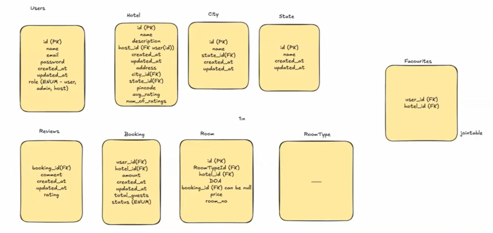

## 1. **Auditing and Data Tracking**

## The Importance of Audit Fields

Every table should include these mandatory fields:

- **`created_at`**: Timestamp when the record was first inserted
    
- **`updated_at`**: Timestamp when the record was last modified
    

**Why this matters:**

- **Compliance**: Many industries require audit trails
    
- **Debugging**: Track when data issues were introduced
    
- **Analytics**: Understand user behavior patterns over time
    
- **Data integrity**: Identify stale or outdated records
    

**Implementation example:**

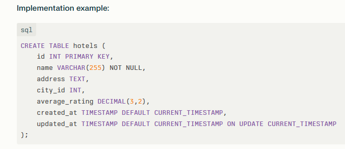

## 2. **Authorization Through Role-Based Access Control (RBAC)**

## Role System Design

Your schema shows a `role` field in the Users table with values like `ENUM('user', 'admin', 'host')`.

**Authorization Benefits:**

- **Security**: Control who can perform specific actions
    
- **Scalability**: Easy to add new roles and permissions
    
- **Maintainability**: Centralized permission management

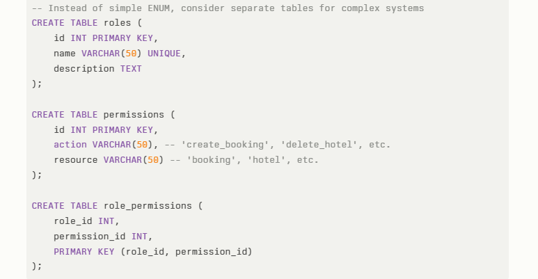

## 3. **Normalization vs. Denormalization Trade-offs**

## The City Table Example

You correctly identified that storing city names directly in hotels would create maintenance issues.

**Problems with denormalized approach:**

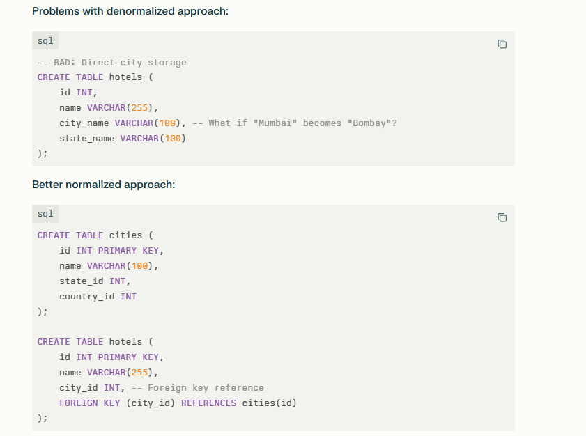

**Benefits of normalization:**

- **Data consistency**: One place to update city information
    
- **Storage efficiency**: No duplicate city names
    
- **Referential integrity**: Foreign key constraints prevent orphaned data

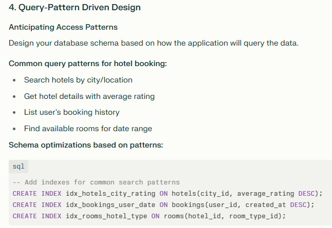

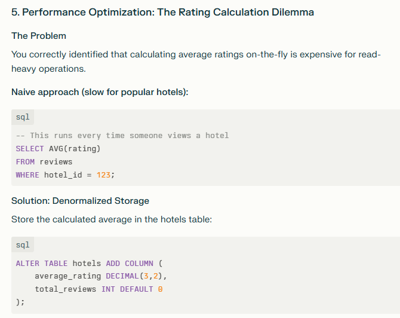

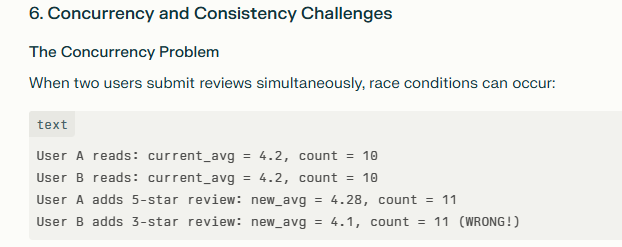

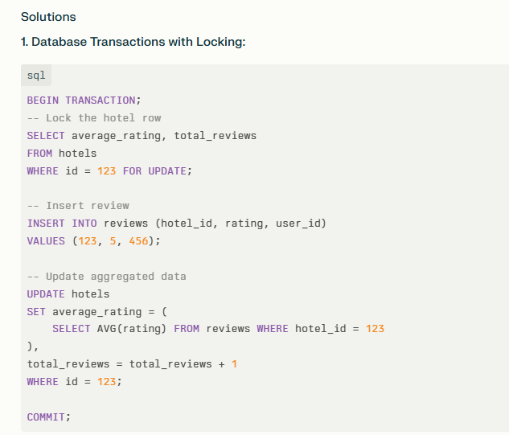

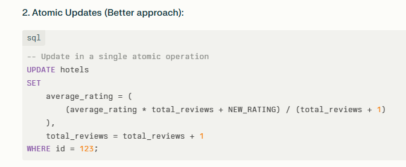

## 7. **Batch Processing Strategy**

## The Product Manager Perspective

As you noted, immediate consistency isn't always necessary. Consider business requirements:

**When to use real-time updates:**

- Critical financial transactions
    
- Inventory management
    
- User authentication
    

**When batch processing is acceptable:**

- Rating aggregations
    
- Analytics data
    
- Recommendation systems

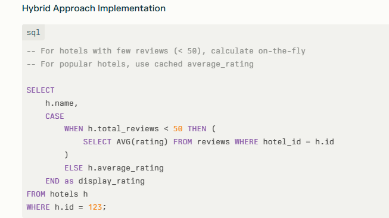

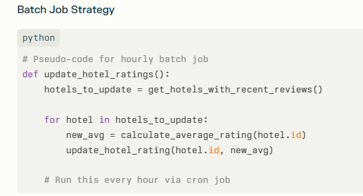

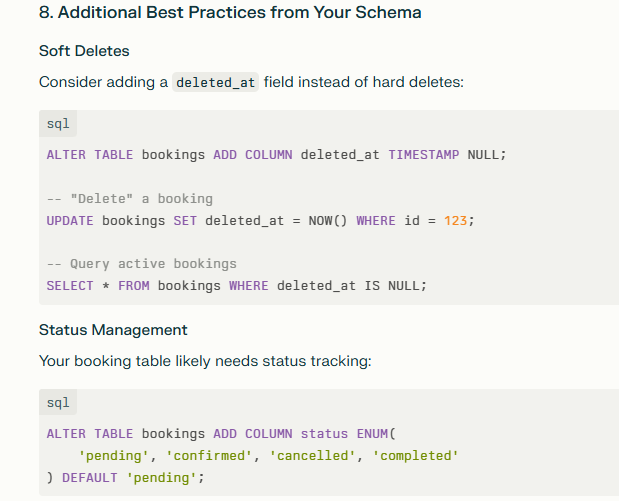

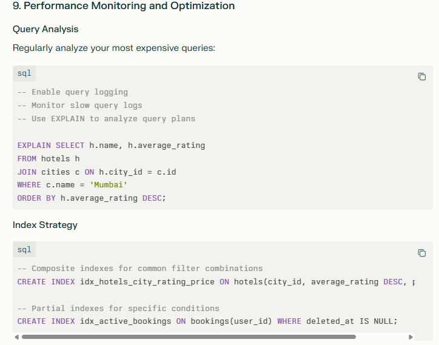

# TWITTER DB

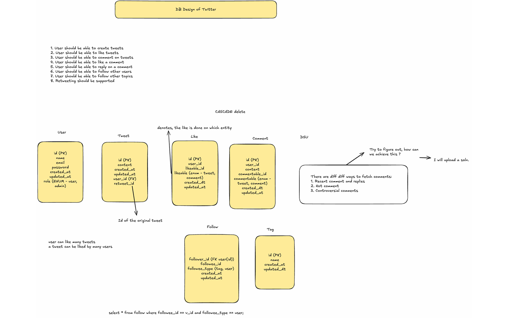

