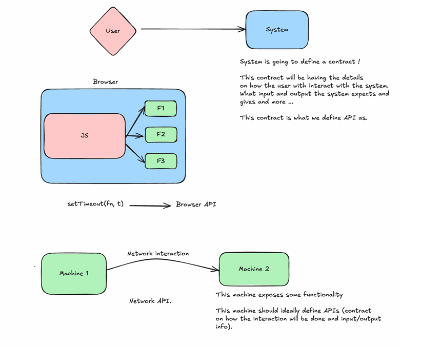
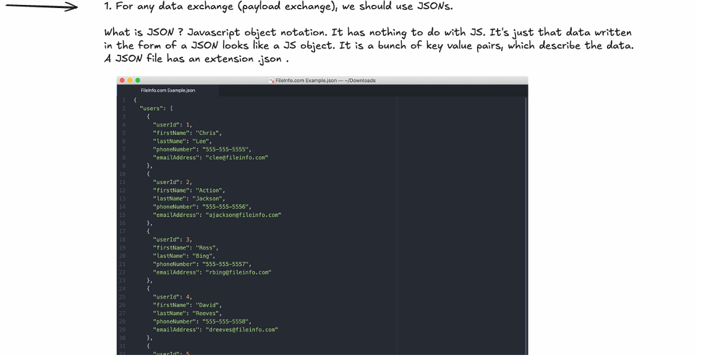
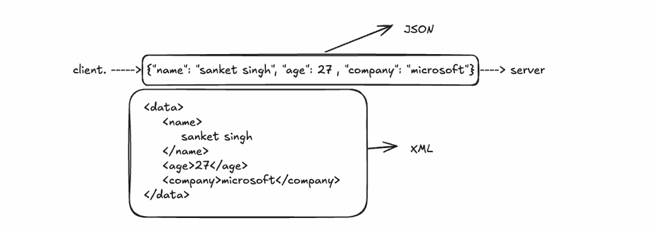
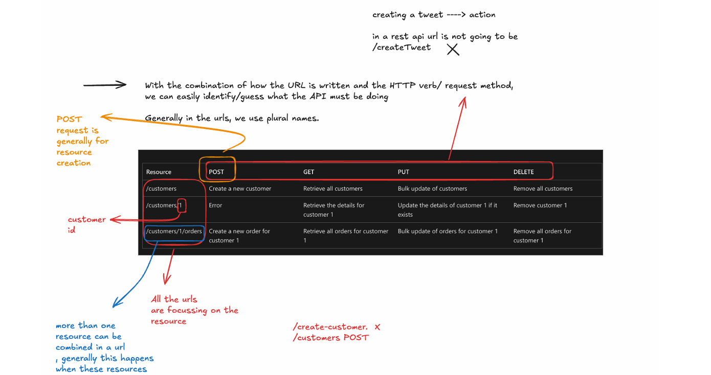
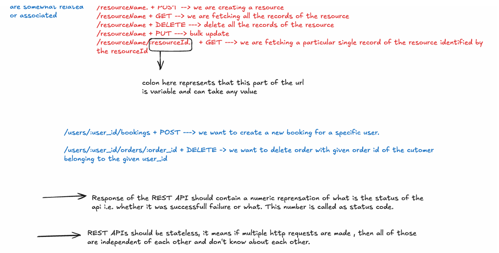
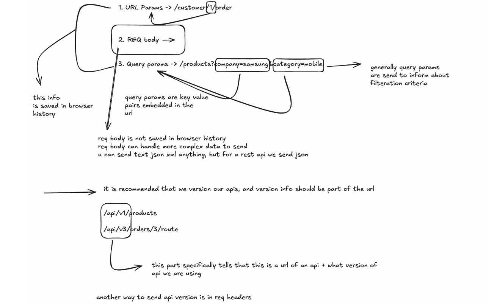

## What is an API?

An API (Application Programming Interface) is **a contract** that defines how one piece of software can interact with another piece of software.

Just as banks have dedicated mechanisms for users to interact with them without knowing the internal workings, APIs provide a way for the outer world to interact with a system while keeping the complex operations abstracted from the end user

## API Implementation Standards

There are several recommendations for implementing network APIs, and while not following them won't break functionality, it can impact code readability :

- **SOAP** (Simple Object Access Protocol)
    
- **REST** (Representational State Transfer)
    
- **GraphQL**
    
- **gRPC**
    

These standards define how to send data between systems, what formats to use, and how the contract should look

## REST APIs Fundamentals

REST stands for **Representational State Transfer** and is built on two fundamental principles :

1. **Platform Independence** - Can work across different platforms and technologies
    
2. **Loose Coupling** - Systems can interact without being tightly dependent on each other

## JSON Data Format

REST APIs use **JSON** (JavaScript Object Notation) for all data exchange. Despite the name suggesting a connection to JavaScript, JSON is language-independent and consists of key-value pairs that describe data

Json seems very light compared to the other formats like xml which is recommended in the soap

