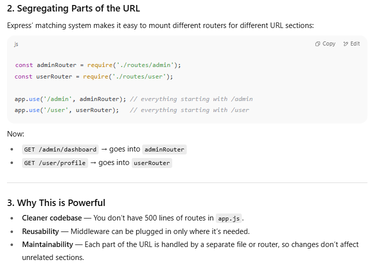

## 1️⃣ What are Environment Variables?

Environment variables (often called **env vars**) are key-value pairs stored outside your code, used to configure applications dynamically.

**Why use them?**

- **Security:** Don’t hardcode sensitive data like API keys, passwords, or database credentials.
    
- **Flexibility:** Easily switch configuration between development, testing, and production environments.
    
- **Portability:** Your app behaves differently based on where it runs, without changing the code.


## 4️⃣ Best Practices

1. **Never commit `.env` to Git** → add it to `.gitignore`.
    
2. Use descriptive names: `DB_HOST`, `API_KEY`, `JWT_SECRET`.
    
3. Default values in code are good (`process.env.PORT || 3000`).
    
4. Use **dotenv-safe** or **dotenv-flow** for managing multiple environments.


## 3️⃣ What is `process`?

- `process` is a **global object** in Node.js.
    
- It provides info and control over the **current Node.js process** (the running instance of your app).
    
- You can access things like:
    
    - `process.env` → environment variables
        
    - `process.argv` → command-line arguments
        
    - `process.exit()` → exit the app
        
    - `process.cwd()` → current working directory
        

You **don’t need to import it**. Node.js makes it available automatically.


## 5️⃣ Can we do `process.somethingElse`?

Yes, but only if Node.js defines it. Some **common properties**:

| Property                | Description               |
| ----------------------- | ------------------------- |
| `process.env`           | Env variables             |
| `process.argv`          | Command-line arguments    |
| `process.cwd()`         | Current working directory |
| `process.exit()`        | Exit process              |
| `process.memoryUsage()` | Memory stats              |
Ya toh main ek kam kar sakta tha ki evnvironment var ko os mein hardcode kar deta and then since node js provides a global which is the process object and then using that we could have set use the env variables!!


![[image-450.png


## **Step 1: Understand the functionality you are looking for**

- Ask yourself: _What exactly am I trying to find in the code?_
    
- Example: In `dotenv`, the functionality is “take key-value pairs from `.env` file and put them into `process.env`.”
    

---

## **Step 2: Explore the project structure**

- Open the repo and check files/folders: `README.md`, `index.js`, `lib/`, `src/`.
    
- Check `package.json`:
    
    - `"main"` field → entry point of the package.
        
    - `"scripts"` → might give hints about tests or builds.
        
- Example: `dotenv`’s main file is `lib/main.js` or `index.js`.
    

---

## **Step 3: Identify main functions**

- Look for functions that likely implement the feature:
    
    - Use keywords from your functionality. Example: `config`, `parse`, `load`.
        
- Open those files and see what the functions do.
    

---

## **Step 4: Trace the flow**

- Look for:
    
    1. Reading input (like reading `.env` file using `fs` module)
        
    2. Processing/parsing the input
        
    3. Applying it (like assigning to `process.env`)
        
- Follow the chain of function calls to see how data flows.
    

---

## **Step 5: Look for helpers or utilities**

- Check if parsing, validation, or assignment is delegated to another file/module.
    
- Example: `dotenv` might use a `parse` function in a separate file.
    

---

## **Step 6: Check tests and examples**

- Test files often show **how the feature is used** and can reveal edge cases.
    
- Example: `dotenv/test/config.test.js` shows how `.env` gets loaded into `process.env`.
    

---

## **Step 7: Grep or search**

- Use the repo search:
    
    - Search for keywords like function names (`config`) or variables (`process.env`).
        
- This helps you pinpoint where the main functionality happens.
    

---

## **Step 8: Understand options/configs**

- Packages often have options that modify behavior.
    
- Check function parameters and default values.
    
- Example: `dotenv.config({ path, override })`.


## 1️⃣ Why we use Key Vaults / Secret Managers

Traditionally, `.env` files or OS-level environment variables were enough. But in **real-world production applications**:

- Hardcoding secrets in `.env` or code is **risky** (can leak in repos or logs).
    
- Managing multiple environments (dev, staging, prod) becomes messy.
    
- Rotation of secrets (changing passwords, API keys) is **manual and error-prone**.
    

So companies use **Key Vaults / Secret Managers**:

- **AWS Secrets Manager**
    
- **Azure Key Vault**
    
- **HashiCorp Vault**
    
- **Google Secret Manager**
    

These store **sensitive data securely**, allow **dynamic access**, and support **automatic rotation**.


```typescript
import { Request, Response } from 'express';

export const pluginHandler = (req: Request, res: Response) => {
  res.send('Pong');
};
```


- `next()` → play the **next song** in the **same playlist**.
    
- `next('route')` → **skip the rest of this playlist** and jump to the **next playlist** with the same path.


## **Flow Explanation**

### **Case 1 — When `id` ≠ '0'**

1. Request comes in: `/user/123`
    
2. First middleware in **first route** runs:
    
    - `req.params.id` is `'123'` → not equal to `'0'`
        
    - Calls `next()` → this moves to the **next middleware in the same route**.
        
3. Second middleware in first route runs:
    
    - Sends `"regular"` response.
        
4. **End of request** — second `app.get` is **never reached**, because the first route already handled the response.
    

**Output:** `"regular"`

---

### **Case 2 — When `id` === '0'**

1. Request comes in: `/user/0`
    
2. First middleware in **first route** runs:
    
    - `req.params.id` is `'0'`
        
    - Calls `next('route')` → **special keyword** in Express.
        
3. `next('route')` **skips all remaining middlewares in the current route** and jumps directly to the **next route handler** that matches the path.
    
4. First middleware of **second route** runs:
    
    - Sends `"special"` response.
        

**Output:** `"special"`


If you call `next(err)` (where `err` is anything that’s **not** `'route'`), Express will treat it as an error and skip to **error-handling middleware** (`app.use((err, req, res, next) => { ... })`).

### In your code when `id === '0'`

- You call `next('route')`
    
- Because `'route'` is **the special keyword**, Express:
    
    1. Skips the `res.send('regular')` middleware in the first route
        
    2. Finds the next `app.get('/user/:id', ...)`
        
    3. Runs that one → sends `"special"`


To skip the rest of the router’s middleware functions, call `next('router')` to pass control back out of the router instance.

This example shows a middleware sub-stack that handles GET requests to the `/user/:id` path.


```typescript
const express = require('express')
const app = express()
const router = express.Router()

// predicate the router with a check and bail out when needed
router.use((req, res, next) => {
  if (!req.headers['x-auth']) return next('router')
  next()
})

router.get('/user/:id', (req, res) => {
  res.send('hello, user!')
})

// use the router and 401 anything falling through
app.use('/admin', router, (req, res) => {
  res.sendStatus(401)
})

```


You’ve got:

1. An Express **Router** (`router = express.Router()`).
    
2. A **middleware** inside the router that checks for a custom header `x-auth`.
    
3. A `GET /user/:id` route inside the router.
    
4. You mount the router under `/admin` in your app, followed by a fallback handler that sends `401 Unauthorized`.
    

---

### **Key new thing: `next('router')`**

- `next('router')` is another special built-in keyword in Express.
    
- It means:
    
    > “Stop running anything else in the current **router**, and move to the next middleware after the router in the main app.”
    

---

## **How the flow works**

Let’s break down **two cases**:

---

### **Case 1 — Request with `x-auth` header present**

Example: `GET /admin/user/123` with  
`x-auth: abc123`

1. Request hits `app.use('/admin', router, fallback)`.
    
2. Inside `router`, the first `.use()` middleware runs:
    
    - It sees `x-auth` exists.
        
    - Calls `next()` → continues inside the **same router**.
        
3. Router finds `GET /user/:id` → sends `"hello, user!"`.
    
4. The `fallback` middleware (`res.sendStatus(401)`) is **never called**, because the router already sent a response.
    

**Output:** `"hello, user!"`

---

### **Case 2 — Request without `x-auth` header**

Example: `GET /admin/user/123` with  
(no `x-auth` header)

1. Request hits `app.use('/admin', router, fallback)`.
    
2. Inside router’s first `.use()` middleware:
    
    - No `x-auth` header → calls `next('router')`.
        
3. Express sees `'router'` keyword:
    
    - Skips the **rest of the current router's stack** (so `/user/:id` inside the router is never reached).
        
    - Moves to the **next middleware after the router** in the `app.use()` chain.
        
4. That “next middleware” is `(req, res) => res.sendStatus(401)`.
    
5. Response is `401 Unauthorized`.
    

**Output:** `401`

---

## **Key difference: `'route'` vs `'router'`**

| Keyword          | Effect                                                                                                       |
| ---------------- | ------------------------------------------------------------------------------------------------------------ |
| `next('route')`  | Skip rest of current **route** middlewares, move to next matching route in the same app/router.              |
| `next('router')` | Skip rest of current **router** entirely, jump to the next middleware **after** this router in the main app. |
- [express.static](https://expressjs.com/en/4x/api.html#express.static) serves static assets such as HTML files, images, and so on.
- [express.json](https://expressjs.com/en/4x/api.html#express.json) parses incoming requests with JSON payloads. **NOTE: Available with Express 4.16.0+**
- [express.urlencoded](https://expressjs.com/en/4x/api.html#express.urlencoded) parses incoming requests with URL-encoded payloads. **NOTE: Available with Express 4.16.0+**

`cookie-parser` in Express is basically a helper that **reads cookies from the HTTP request** and makes them easy to use inside your route handlers.


## Third-party middleware

Use third-party middleware to add functionality to Express apps.

Install the Node.js module for the required functionality, then load it in your app at the application level or at the router level.

The following example illustrates installing and loading the cookie-parsing middleware function `cookie-parser`.


| Middleware module                                                                     | Description                                                                                         |
| ------------------------------------------------------------------------------------- | --------------------------------------------------------------------------------------------------- |
| [body-parser](https://expressjs.com/en/resources/middleware/body-parser.html)         | Parse HTTP request body.                                                                            |
| [compression](https://expressjs.com/en/resources/middleware/compression.html)         | Compress HTTP responses.                                                                            |
| [connect-rid](https://expressjs.com/en/resources/middleware/connect-rid.html)         | Generate unique request ID.                                                                         |
| [cookie-parser](https://expressjs.com/en/resources/middleware/cookie-parser.html)     | Parse cookie header and populate `req.cookies`. See also [cookies](https://github.com/jed/cookies). |
| [cookie-session](https://expressjs.com/en/resources/middleware/cookie-session.html)   | Establish cookie-based sessions.                                                                    |
| [cors](https://expressjs.com/en/resources/middleware/cors.html)                       | Enable cross-origin resource sharing (CORS) with various options.                                   |
| [errorhandler](https://expressjs.com/en/resources/middleware/errorhandler.html)       | Development error-handling/debugging.                                                               |
| [method-override](https://expressjs.com/en/resources/middleware/method-override.html) | Override HTTP methods using header.                                                                 |
| [morgan](https://expressjs.com/en/resources/middleware/morgan.html)                   | HTTP request logger.                                                                                |
| [multer](https://expressjs.com/en/resources/middleware/multer.html)                   | Handle multi-part form data.                                                                        |
| [response-time](https://expressjs.com/en/resources/middleware/response-time.html)     | Record HTTP response time.                                                                          |
| [serve-favicon](https://expressjs.com/en/resources/middleware/serve-favicon.html)     | Serve a favicon.                                                                                    |
| [serve-index](https://expressjs.com/en/resources/middleware/serve-index.html)         | Serve directory listing for a given path.                                                           |
| [serve-static](https://expressjs.com/en/resources/middleware/serve-static.html)       | Serve static files.                                                                                 |
| [session](https://expressjs.com/en/resources/middleware/session.html)                 | Establish server-based sessions (development only).                                                 |
| [timeout](https://expressjs.com/en/resources/middleware/timeout.html)                 | Set a timeout perioHTTP request processing.                                                         |
| [vhost](https://expressjs.com/en/resources/middleware/vhost.html)                     | Create virtual domains.                                                                             |
|                                                                                       |                                                                                                     |


Note how `next()` is called after `await cookieValidator(req.cookies)`. This ensures that if `cookieValidator` resolves, the next middleware in the stack will get called. If you pass anything to the `next()` function (except the string `'route'` or `'router'`), Express regards the current request as being an error and will skip any remaining non-error handling routing and middleware function


> **A pipeline of middleware functions** where each one can:
> 
> 1. **Do something** with the request or response
>     
> 2. **Pass control forward** (or skip/jump) to the next thing in the chain
>     

---

### **How it plays out**

1. A request comes in.
    
2. Express starts at the first middleware in the chain.
    
3. Each middleware can:
    
    - Read/change **`req`** (e.g., parse cookies, read body, authenticate user)
        
    - Read/change **`res`** (e.g., set headers, write output)
        
    - Decide whether to:
        
        - `next()` → Continue in the same stack
            
        - `next('route')` → Skip rest of current route, jump to next route
            
        - `next('router')` → Skip rest of current router, go to next middleware after router
            
        - **Send a response** (and stop the chain)
            
4. Eventually, a middleware sends the final response to the client.
    

---

### **Real-world analogy**

Think of **Express middleware** like a **series of security checkpoints** in an airport:

- **First checkpoint**: Scan your ticket (if invalid → deny entry)
    
- **Second checkpoint**: Check your ID
    
- **Third checkpoint**: Security check
    
- **Gate**: Board the flight
    

At each step, someone can:

- Let you pass to the next step (`next()`)
    
- Send you to a different line (`next('route')` or `next('router')`)
    
- Stop you entirely (send response)


Even though all middlewares/routes live in the same big ordered stack, **only those whose path matches the request are actually executed**.


gives us separation of concerns!!

segregating parts of url also works great




To register a router we use app.use() and when we want to register a route handler or a controller then we use app.method or whatever required!!


