## **1. What is Commitlint?**

Commitlint is a tool that **checks your Git commit messages** to make sure they follow a specific format (usually the Conventional Commits standard).

It’s useful because:

- Keeps commit history **consistent and readable**.
    
- Makes **changelogs** and **semantic versioning** automation possible.
    
- Helps teams quickly understand _why_ a change was made


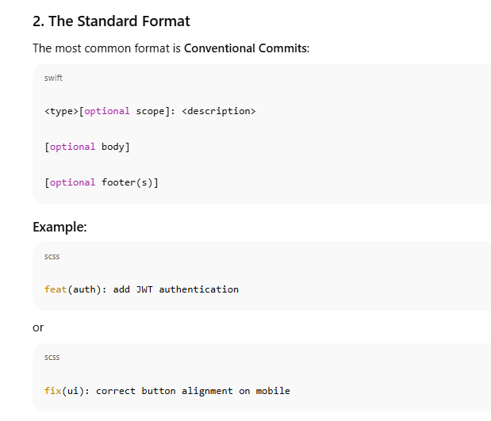


### **Common Types**

| Type       | Meaning                                     |
| ---------- | ------------------------------------------- |
| `feat`     | New feature                                 |
| `fix`      | Bug fix                                     |
| `docs`     | Documentation only changes                  |
| `style`    | Formatting, no code change (e.g., prettier) |
| `refactor` | Code change that’s not a bug fix or feature |
| `test`     | Adding/updating tests                       |
| `chore`    | Maintenance, build tasks, etc.              |
## **3. How Commitlint Works**

- You install Commitlint and a config (like `@commitlint/config-conventional`).
    
- You tell Git to **run Commitlint whenever you make a commit** (via **Husky** pre-commit or commit-msg hooks).
    
- If the commit message doesn’t match the rules, Commitlint **rejects** it.


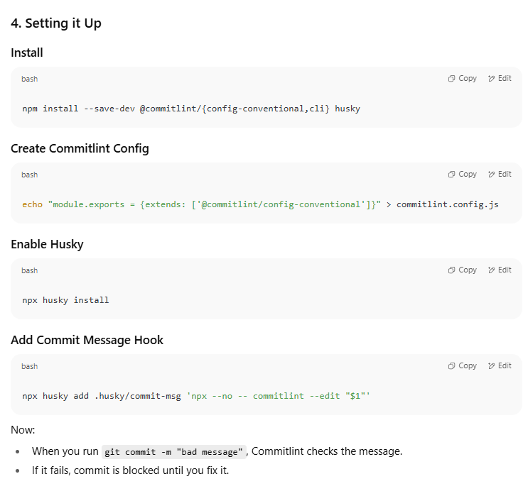

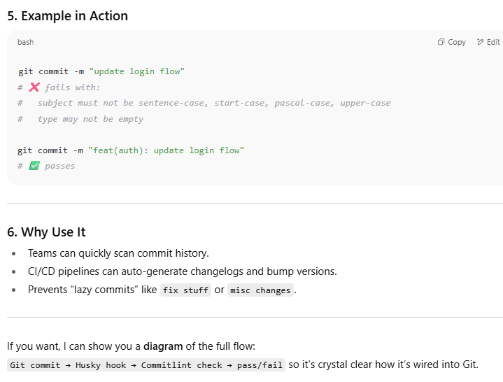

## **Step-by-Step Flow**

1. **Git Commit**  
    You try to commit some changes using `git commit -m "...message..."`.
    
2. **Husky Intercepts**  
    Husky has a `commit-msg` hook that **runs Commitlint before the commit is saved**.
    
3. **Commitlint Validation**  
    Commitlint checks the message against the rules you configured.
    
4. **Pass / Fail Decision**
    
    - If your message matches the rules (e.g., `feat: add dark mode`), commit proceeds.
        
    - If it doesn’t (e.g., `updated stuff`), commit fails with an error telling you what to fix.
        

---

✅ **Essence:** Commitlint itself just checks messages. Husky is what makes it run automatically _every time_ you commit.


Big companies like Microsoft, LinkedIn, Google, etc., often use a **“squash and merge”** (or even a **“sync from monorepo”**) strategy instead of keeping every tiny local commit from feature branches.
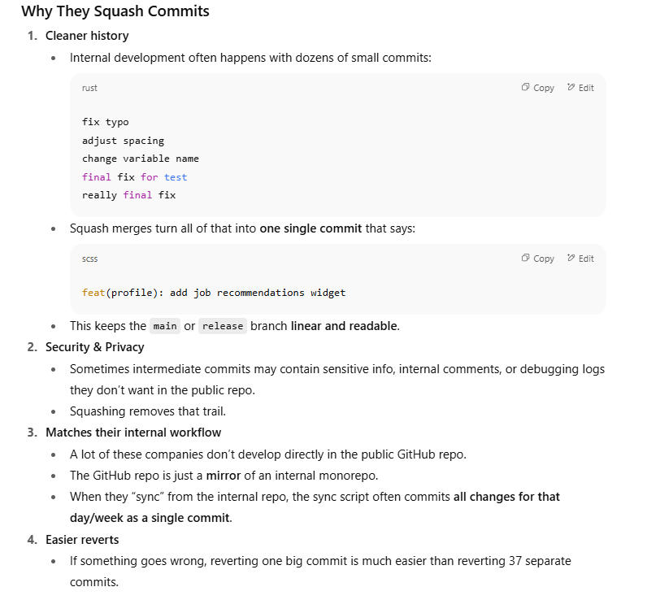

In a **squash & merge** workflow, all the little commit messages you wrote while working on your branch don’t survive.

When they squash:

- All commits in the PR are combined into **one single commit**.
    
- The **commit message** for that single commit is usually taken from the **pull request title + description** (sometimes editable during merge).
    

So, in that model:

- Your _individual_ commit messages are mainly for **you and your reviewers** during development.
    
- The **final PR title/description** becomes the **permanent commit message** in `main`.


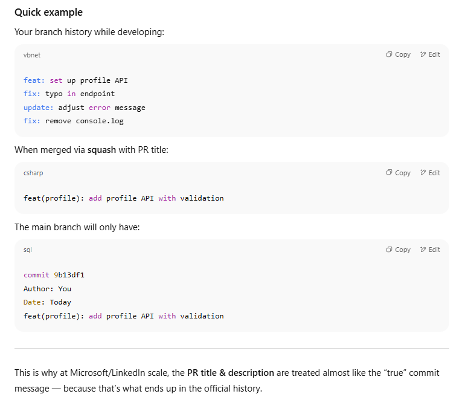


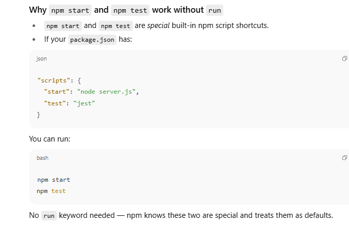


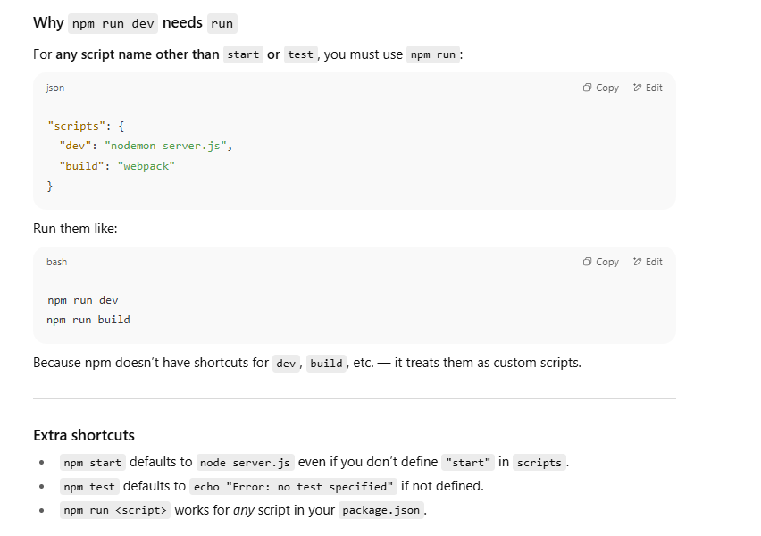

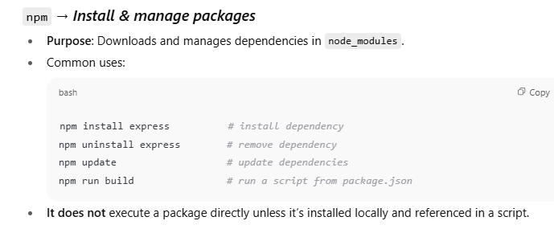


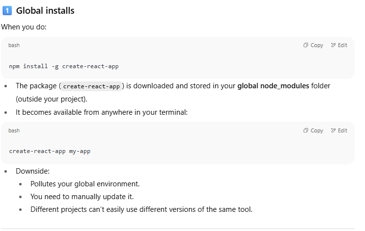


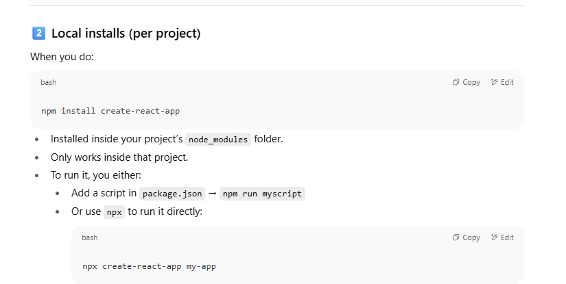

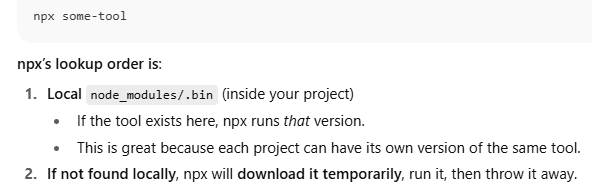


# Understanding req.body undefined in Express and how body parsing works

When sending JSON via Postman and seeing `req.body` as `undefined` in an Express app, the issue is almost always that the body hasn’t been parsed yet. Express does not parse request bodies by default—it needs explicit middleware to know how to read and decode the incoming payload.


## 1) What Express gives you out of the box

- Route params and query strings are always strings encoded in the URL and are parsed by Express (and Node’s URL utilities). That’s why `req.params` and `req.query` typically work without extra setup.
    
- Examples:
    
    - URL params: `/users/:id` → `req.params.id` is a string like "42".
        
    - Query params: `/search?q=hello&page=2` → `req.query.q` is "hello", `req.query.page` is "2".
        

## 2) Why req.body is undefined

- HTTP request bodies can be in many formats: JSON, form data (urlencoded), multipart/form-data (files), plain text, XML, protobuf, etc.
    
- Express doesn’t assume a format and doesn’t parse the body automatically.
    
- If no body-parsing middleware runs (or the content type doesn’t match the parser), `req.body` remains `undefined`.

## 3) How Express parses bodies: middleware

Express uses body-parsing middleware to read the raw incoming bytes and transform them into JavaScript objects placed on `req.body`. You must choose the correct parser(s) for the content type you expect from clients.

- For JSON: `express.json()`
    
- For URL-encoded form submissions: `express.urlencoded({ extended: true })`
    
- For raw or text bodies: `express.raw()` or `express.text()`
    
- For multipart/form-data (file uploads): third-party middleware like `multer`
    
- For XML or custom formats: use third-party parsers or write your own middleware

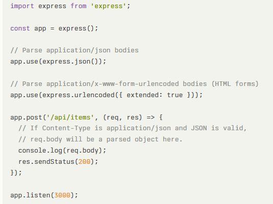


## 4) Content-Type and why it matters

Parsers run based on the request’s Content-Type header:

- `express.json()` parses only when `Content-Type: application/json` (or JSON-like, depending on options).
    
- `express.urlencoded()` parses only when `Content-Type: application/x-www-form-urlencoded`.
    
- If Postman sends JSON but the header isn’t set to `application/json`, the JSON parser won’t run, and `req.body` will be `undefined`.
    

Checklist for Postman when sending JSON:

- Select “Body” → “raw” → choose “JSON” from the dropdown.
    
- Postman will set `Content-Type: application/json` automatically.
    
- Ensure the JSON is valid (no trailing commas, proper quotes).

## 5) Serialization vs. deserialization

- Serialization: turning an in-memory structure (e.g., an object, a tree) into bytes for transport (JSON string, form-encoded string, etc.).
    
- Deserialization: turning those bytes back into an in-memory structure on the server.
    
- Express doesn’t decide the format; the client does (by how it serializes and which Content-Type it uses).
    
- Express, via middleware, deserializes the body into `req.body` if a matching parser is configured.
    

Analogy to your note about a binary tree: if one machine serializes a tree as JSON and sends it with `Content-Type: application/json`, `express.json()` will deserialize it back into a JS object on the server.


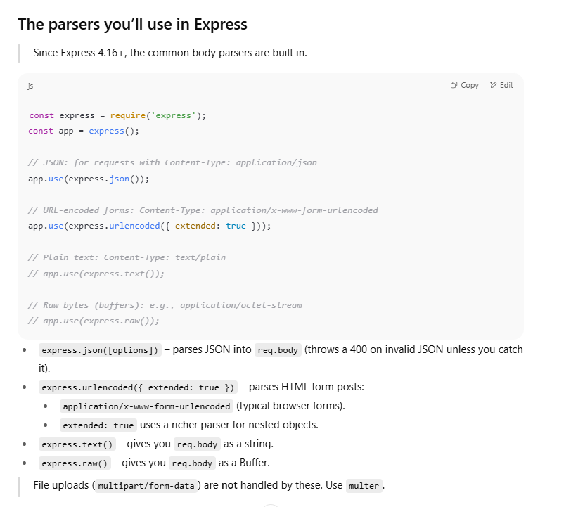


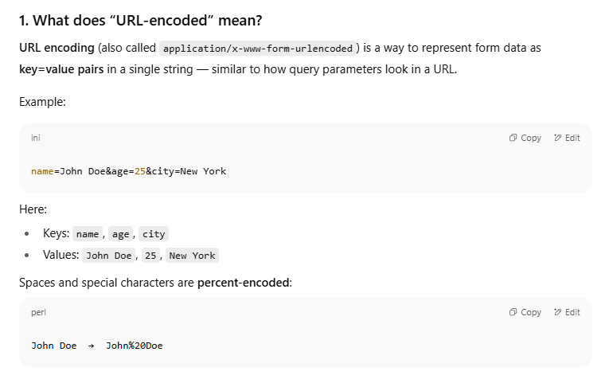


## **2. Why is it called URL-encoded?**

Because the format follows the same rules as encoding query parameters in a URL — safe characters stay the same, unsafe ones are encoded (`%20`, `%3A`, etc.).

Even though it’s _used in the body of the request_, the **format** is like what you’d see in a URL query string.


## **3. When is it used?**

- It’s the default content type for HTML `<form>` submissions without `enctype="multipart/form-data"`.
    
- Common for **simple text field submissions** (logins, search forms).
    
- Less common for modern APIs (which often use JSON).

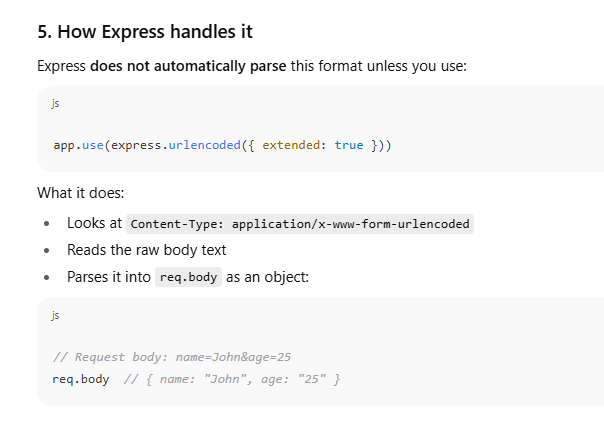

- **The request body is just raw bytes** coming over the network.
    
- Those bytes could represent:
    
    - JSON (`application/json`)
        
    - URL-encoded form data (`application/x-www-form-urlencoded`)
        
    - XML (`application/xml`)
        
    - Plain text (`text/plain`)
        
    - Multipart/form-data (files, images, etc.)
        
    - Or literally _anything_ else
        

---

Since Express **can’t guess** the meaning or structure of the body, it doesn’t parse it automatically for you.

Instead, it says:

> “Tell me which format(s) you care about, and I’ll give you middleware that knows how to parse it into `req.body`.”

---

### That’s why you pick:

- `express.json()` → if you expect JSON bodies
    
- `express.urlencoded()` → if you expect URL-encoded form data
    
- A library like `multer` → if you expect file uploads
    
- A custom parser → if you expect XML or some custom format
    

---

This flexibility is powerful because:

1. **Performance** – You don’t waste CPU parsing formats you don’t need.
    
2. **Security** – You don’t accidentally parse and trust data in an unexpected format.
    
3. **Control** – You can decide how strict or loose the parsing is.


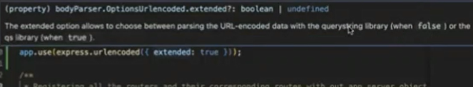


but rest encourages to send json data anyway then we won't even send url encoded data!!
## **. REST and JSON**

- Modern REST APIs **almost always** use `application/json` for request and response bodies.
    
- This means:
    
    - You _usually_ send JSON data in the body → `Content-Type: application/json`
        
    - The server parses it using `express.json()` so that `req.body` becomes a real JavaScript object.
        
- **URL-encoded data** (`application/x-www-form-urlencoded`) is mostly used for:
    
    - Old HTML forms
        
    - Some legacy APIs
        
    - Very small payloads
        
- In a pure REST API, URL-encoded payloads are _rare_, because JSON is more flexible.

in case of the url params we need to tell express after this there this is url params so use :id and so like url can look like profile/4/photos and it will always be handled as string 

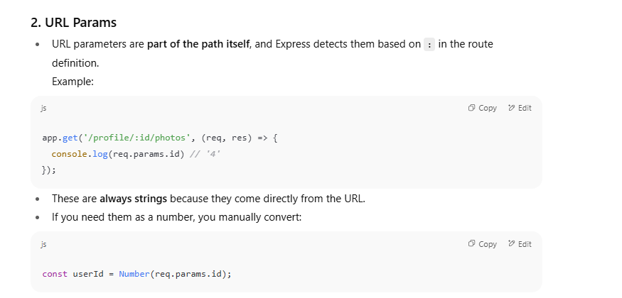

- **URL/query params** → Express handles automatically, always strings
Url params are mostly 3 levels!!

But JSON is not type safe like it can literally have anything! 

----
## The Problem: Unreliable Input Data

When you build an API, you define an expected structure for the data you receive. For example, for a user creation endpoint, you might expect an object with a `name` (a string) and an `age` (a positive number).

However, you can't trust the client to always send the data in the correct format. They might send:

- `age` as a string (`"twenty-seven"`)
    
- A negative `age`
    
- Missing fields (e.g., no `name`)
    
- Extra, unexpected fields
    

If your main business logic (the "controller" in a Model-View-Controller architecture) has to handle all these possibilities, it becomes bloated and violates the principle of **Separation of Concerns**. A controller's job should be to handle the core logic of the request, not to clean up messy data.

This is where a data validation library like **Zod** comes in.


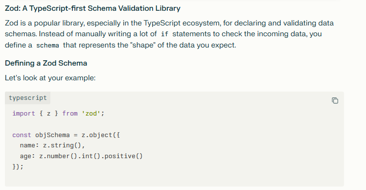

Here's what this code does:

- `z.object({...})`: This defines that you expect the data to be an object.
    
- `name: z.string()`: This specifies that the object must have a key named `name`, and its value must be a string.
    
- `age: z.number().int().positive()`: This is a great example of **chaining** validations. It specifies that the object must have a key named `age`, and its value must be a `number`, an `integer`, and a `positive` number.

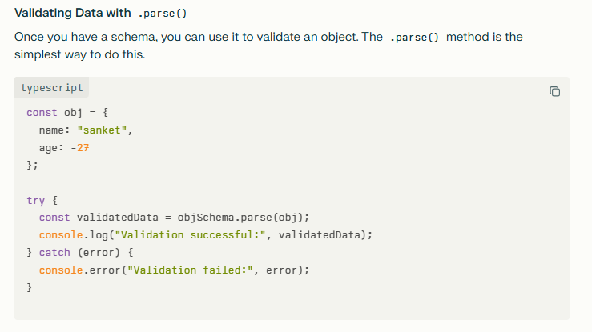


In this case, the `age` is negative, which violates the `.positive()` rule. Zod will see this and **throw an error**. This is a key concept: if validation fails, `parse()` doesn't return `false` or `null`; it throws a detailed error that explains exactly what was wrong with the data. If the validation succeeds, it returns the data (often with types inferred correctly if you're using TypeScript).


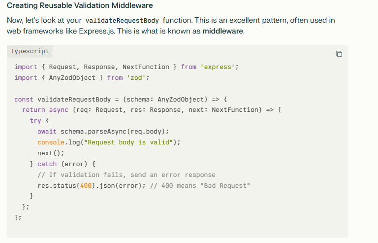


Let's break down this middleware factory:

1. **`validateRequestBody` is a function that _returns_ another function.** This is a common pattern for creating configurable middleware. You pass the Zod schema you want to use for a particular route.
    
2. **The returned function is the actual middleware.** It has the standard `(req, res, next)` signature.
    
3. **Inside the middleware:**
    
    - It tries to validate `req.body` against the provided `schema`.
        
    - If `schema.parseAsync(req.body)` is successful, it means the data is valid. It then calls `next()`, which passes control to the next function in the chain (usually your main controller logic).
        
    - If `parseAsync()` throws an error, the `catch` block executes. Instead of crashing the server, it gracefully sends a `400 Bad Request` response to the client, often including the validation error details from Zod. This tells the client exactly what they did wrong.


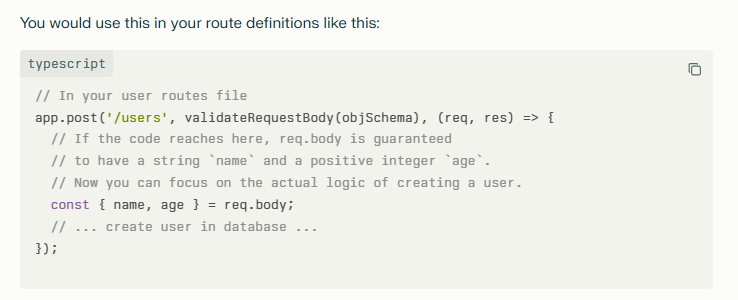


## Asynchronous Validation with `.parseAsync()`

You correctly pointed out the use of `parseAsync()`. While simple validations like checking for a string or a positive number are synchronous and very fast, some validations might be **asynchronous**.

When might you need asynchronous validation?

- **Database Checks:** You might want to check if a username or email already exists in the database. This requires a database query, which is an I/O operation and should be asynchronous.
    
- **API Calls:** You might need to validate an address by calling an external address validation API.
    

Zod supports this with `.refine()` or `.superRefine()` in combination with `async` functions.


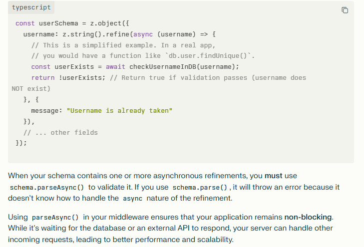


Without Zod:

- TypeScript only checks **compile-time types** — meaning it **can’t protect you** from bad data coming from the client or database at runtime.
    
- You’d write manual `if (!req.body.name || typeof req.body.name !== 'string')` checks everywhere — repetitive and error-prone.
    

With Zod:

- **One line** to define the expected structure
    
- Automatically **rejects invalid requests**
    
- Gives **clear error messages**
    
- **Type inference** — your TypeScript types come directly from the schema


Without Zod — if you forget a check, the app might crash.  
With Zod — the request is rejected before even hitting your business logic.


## 3️⃣ When to use Zod?

In a Node + Express project:

- **Validating incoming requests** (`req.body`, `req.query`, `req.params`)
    
- **Validating config files** or environment variables
    
- **Validating database query results** if the DB might return unexpected data
    
- **Validating external API responses**
    

In short — **anywhere data crosses a trust boundary** (i.e., comes from outside your code).


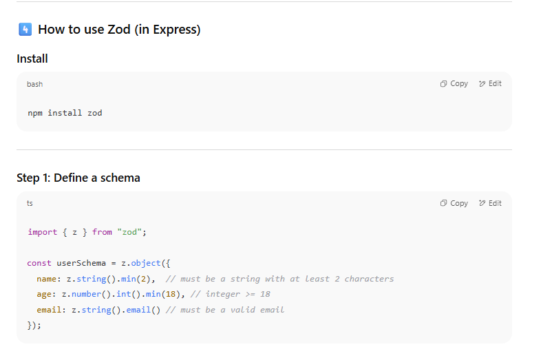


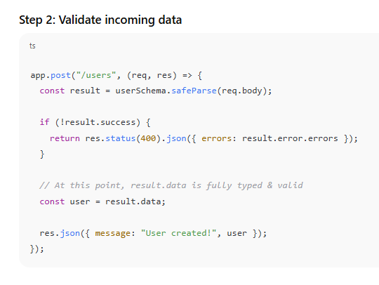


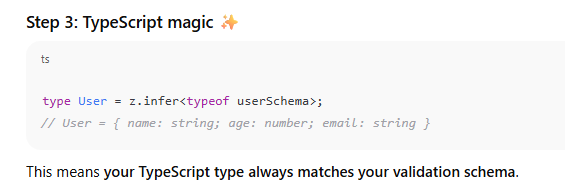
## Should you use it?

✅ Use it if:

- You’re writing APIs that accept input from users or external systems
    
- You want **runtime safety** + **TypeScript types**
    
- You want **clean, DRY validation code**
    

⚠️ Maybe skip if:

- You’re in a quick throwaway prototype where you don’t care about validation
    
- Your project is pure JavaScript without TypeScript (still usable, but less benefit)
    
- Performance is _extremely_ critical and you want to avoid any runtime validation (rare case)

Zod is like a **rulebook** for any data (usually objects, but also strings, numbers, arrays, etc.), and it will check that the data follows those rules at **runtime**.

Think of it like this:

- **Input data comes in** → Zod compares it to your schema →  
    ✅ **Pass** → you get the clean, typed data  
    ❌ **Fail** → you get a detailed error explaining _what_ was wrong and _where_
    

---

### It’s not just for objects

You can validate **any type of value**


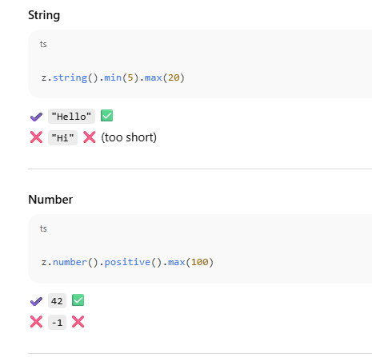


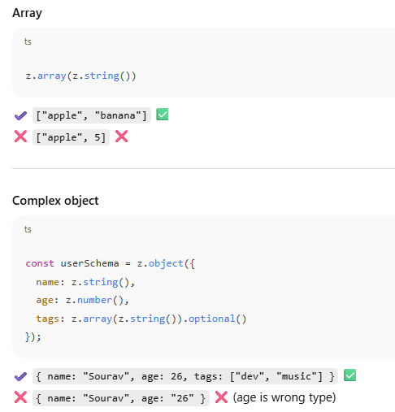


So yes — Zod can be used to **validate any value**, but in an Express backend, you’ll mostly be validating **objects** coming in via:

- `req.body` (POST data)
    
- `req.query` (query params)
    
- `req.params` (URL params)


```typescript
import express, { Request, Response, NextFunction } from "express";
import { z } from "zod";

const app = express();
app.use(express.json());

// ---- SCHEMAS ----

// URL params schema
const paramsSchema = z.object({
  id: z.string().uuid(), // must be a valid UUID string
});

// Query string schema
const querySchema = z.object({
  includePosts: z.enum(["true", "false"]).default("false"),
});

// Request body schema
const bodySchema = z.object({
  name: z.string().min(2),
  age: z.number().int().min(18),
});

// ---- VALIDATION MIDDLEWARE ----
function validateRequest({
  body,
  query,
  params,
}: {
  body?: typeof bodySchema;
  query?: typeof querySchema;
  params?: typeof paramsSchema;
}) {
  return (req: Request, res: Response, next: NextFunction) => {
    try {
      if (body) {
        req.body = body.parse(req.body);
      }
      if (query) {
        req.query = query.parse(req.query);
      }
      if (params) {
        req.params = params.parse(req.params);
      }
      next();
    } catch (err) {
      if (err instanceof z.ZodError) {
        return res.status(400).json({
          errors: err.errors,
        });
      }
      next(err);
    }
  };
}

// ---- ROUTE ----
app.post(
  "/users/:id",
  validateRequest({
    body: bodySchema,
    query: querySchema,
    params: paramsSchema,
  }),
  (req: Request, res: Response) => {
    // ✅ At this point:
    // req.body is typed and valid
    // req.query is typed and valid
    // req.params is typed and valid
    res.json({
      message: "User data is valid!",
      data: {
        params: req.params,
        query: req.query,
        body: req.body,
      },
    });
  }
);

app.listen(3000, () => {
  console.log("Server running on port 3000");
});


```


- **Schemas** define rules for params, query, and body separately.
    
- **`validateRequest` middleware**:
    
    - Runs `.parse()` on each part of the request.
        
    - If it fails → sends a `400` with details.
        
    - If it passes → replaces the raw request data with the validated & typed version.
        
- **Route handler** now receives **100% valid data**.


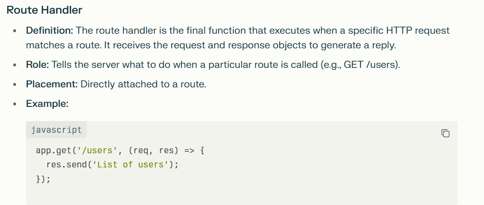


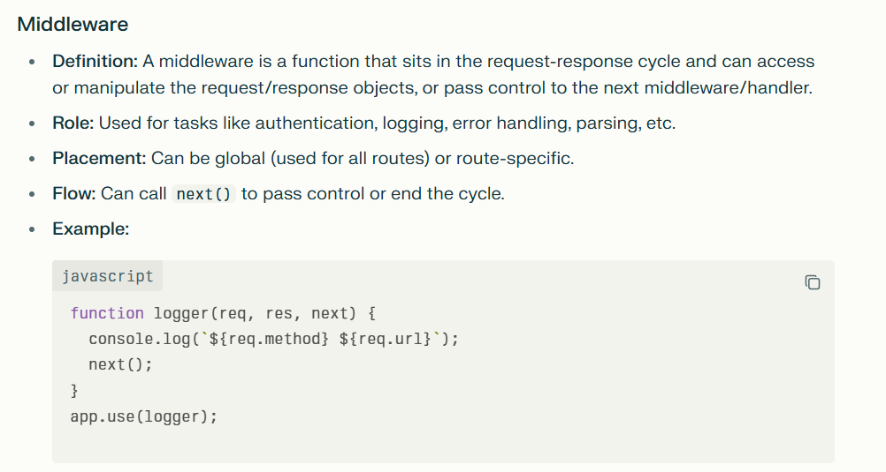


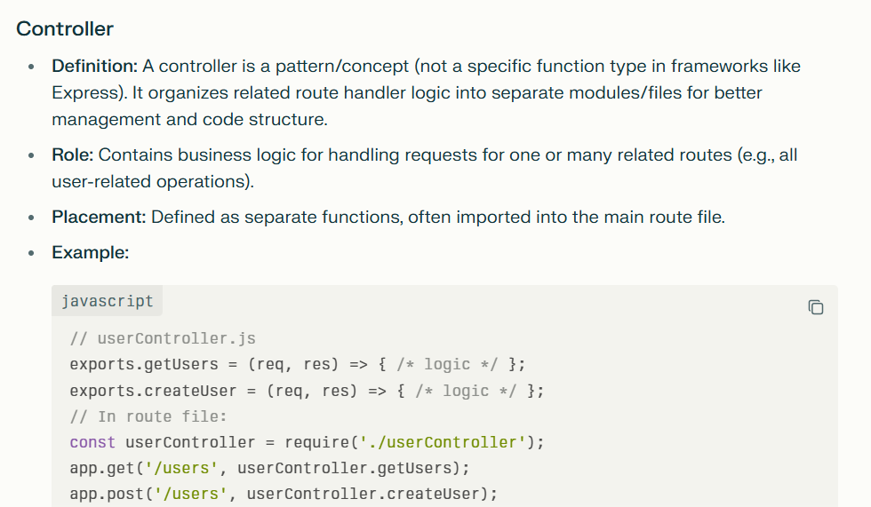

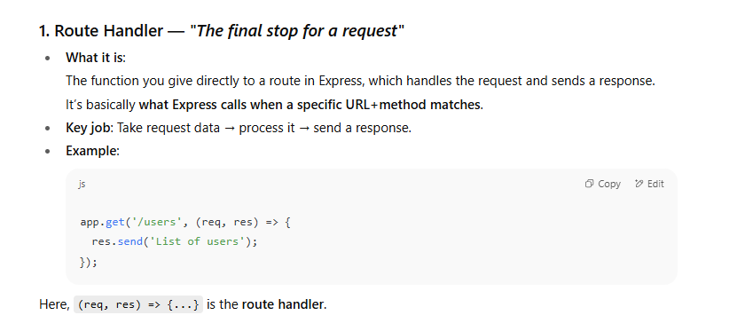


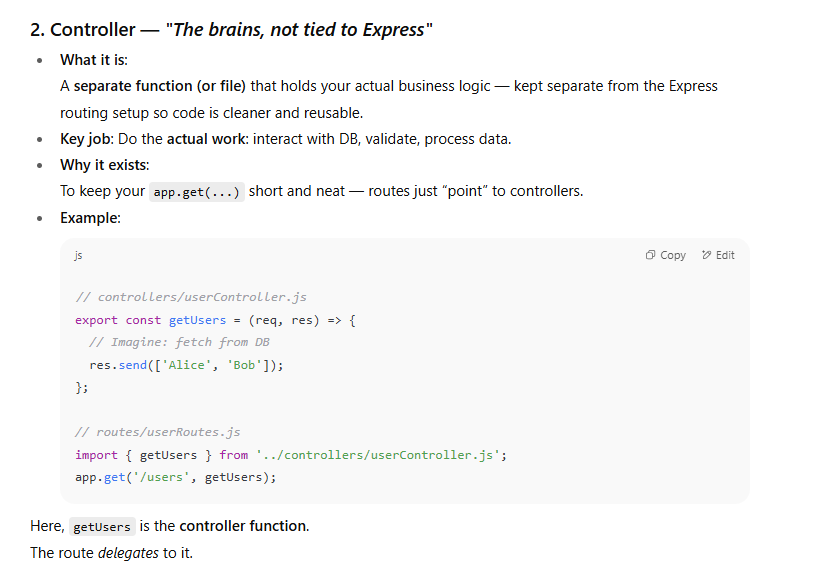


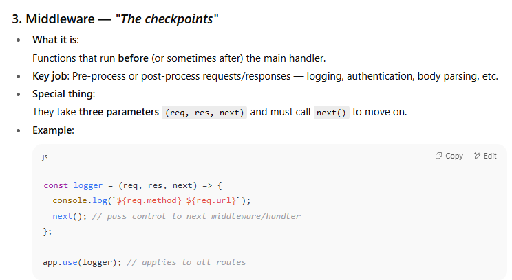


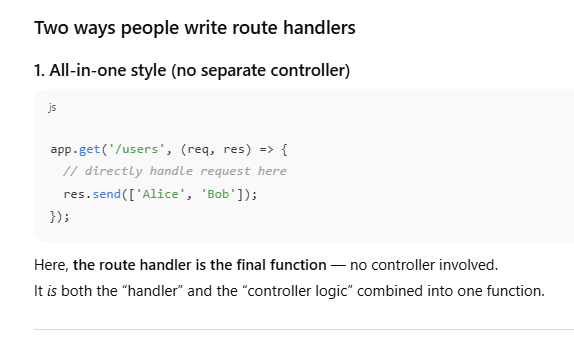


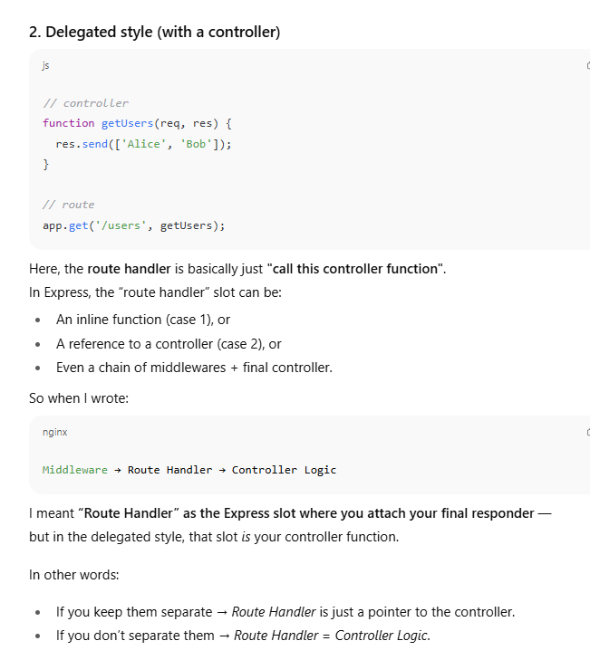


