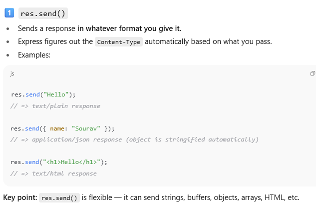
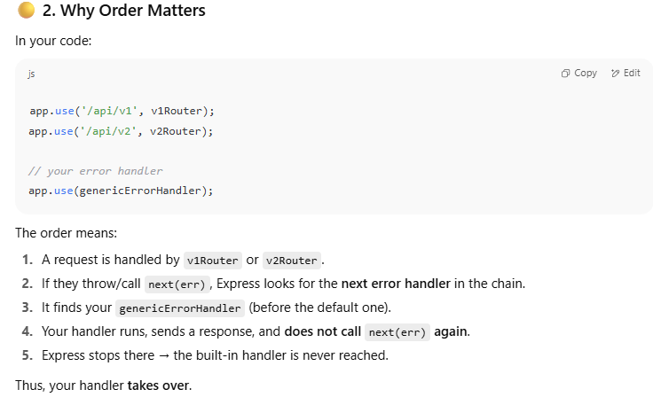

## 3️⃣ What actually gets sent over the network

When you do either `res.send()` or `res.json()`:

- Data is converted into a **string** (if not already)
    
- Sent over HTTP as raw text (bytes)
    
- Browser or client parses it based on the **Content-Type** header

## 4️⃣ In REST APIs, what do we use and why?

In REST:

- **JSON** is the standard for data exchange (`application/json`)
    
- Why?
    
    - Lightweight
        
    - Human-readable
        
    - Language-agnostic
        
    - Easy to parse in clients
        

So in practice:

- Use `res.json()` when sending structured data.
    
- Use `res.send()` when sending plain text, HTML, or non-JSON responses.

| Method       | Auto Content-Type | Data type flexibility  | Common in REST?                                     |
| ------------ | ----------------- | ---------------------- | --------------------------------------------------- |
| `res.send()` | Depends on input  | ✅ Any type             | ⚠️ Only if sending text or already-stringified JSON |
| `res.json()` | application/json  | 🚫 Only objects/arrays | ✅ Yes, standard                                     |


## 5️⃣ TL;DR mental model

**Request**:  
Client says — _"I’m sending you data in this format"_ → via `Content-Type` header  
Server uses middleware to parse it.

**Response**:  
Server says — _"I’m sending you data in this format"_ → via `Content-Type` header  
Client (Postman, browser, mobile app) parses it accordingly.


```ts
export const pingHandler = async (req: Request, res: Response): Promise<void> => {
  res.json({
    message: "Pong",
    success: true
  });
};

```


### `async (req: Request, res: Response): Promise<void> => { ... }`

- **`async`**: This function can use `await` inside it (useful if you need to fetch from DB, call APIs, etc.).
    
- **`req: Request`**:  
    Type annotation from Express — `req` is the incoming HTTP request object.
    
- **`res: Response`**:  
    Type annotation from Express — `res` is the HTTP response object you send data back with.
    
- **`: Promise<void>`**:  
    This function returns a Promise that resolves to nothing (`void`), which is normal for an Express handler.


## 🔴 3. Why this matters

- If **your code throws synchronously** (during that call), Express is still inside its `try/catch`, so it catches it.
    
- If **your code throws later (async)**, then Express’s `try/catch` is already finished → the error “escapes” → Express never sees it → you must manually call `next(err)`.


- **Sync throw** → Express internally does `next(err)` for you.
    
- **Async** → you must do `next(err)` yourself.
    
- In both cases, if you don’t write your own error handler, Express eventually calls its **built-in default handler**.


We need  To send some custom error response instead of sending this generic code all the time!!!

 Also error handling logic can be same for a lot of cases!!!!!!





# 🎯 Final Takeaway

- **Polymorphism** = same method, different behavior depending on object.
    
- **Inheritance (classes)** = good for reusing code in a straight hierarchy.
    
- **Problem**: Real-world systems often need **multiple capabilities**, which inheritance can’t handle (no multiple inheritance).
    
- **Interfaces** = let you **compose multiple abilities** flexibly, without messy inheritance chains.
    
- **Best practice**: Use interfaces for contracts (e.g., UpiEnabled, EmiEnabled), use abstract classes for shared logic.


# 🧑‍🏫 Can interfaces and classes extend each other?

---

## 1. **Interface extending a class**

Yes, in **TypeScript**, an interface can extend a class.  
👉 But what does that mean?

When an interface extends a class:

- It takes the **shape (properties + methods)** of that class.
    
- It does **not** inherit the implementation (only the structure).


## 4. **Summary Table**

|Case|Allowed?|Explanation|
|---|---|---|
|**Interface extends Class**|✅ Yes|Copies the structure of the class (not code).|
|**Class extends Interface**|❌ No|A class must `implement` an interface instead.|
|**Interface extends Interface**|✅ Yes|Can extend one or multiple interfaces.|
|**Class extends Class**|✅ Yes|Normal inheritance (single only).|

---

⚡️ Rule of thumb:

- **extends** = taking structure + (if class) code.
    
- **implements** = agreeing to a contract (must provide implementation yourself).


Your code should be in such a way that express error handler should be called!  Your code should go through all the test cases!! 


