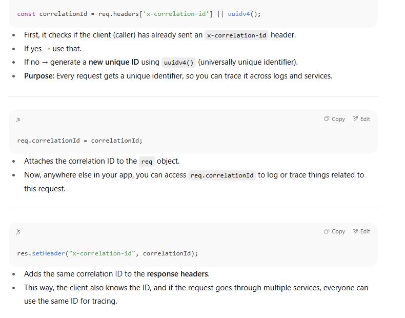

When your app is running on a customer’s server or in the cloud, you can’t just `console.log` and stare at the terminal. Instead:

### 🔎 Why Logging Is Important

1. **Debugging in production**
    
    - If a customer calls saying _“The page is blank”_ or _“Payment failed”_, you can’t reproduce it instantly.
        
    - Logs tell you _what happened before the crash_ → request path, user ID, DB query, error stack trace, etc.
        
2. **Tracing Issues Across Systems**
    
    - In microservices or distributed systems, one request may pass through multiple services.
        
    - Without logs, you won’t know _where_ the request failed. With logs, you can trace the journey.
        
3. **Performance Monitoring**
    
    - Logs can show slow queries, high memory usage, or bottlenecks.
        
    - Example: `DB query took 3.5s` → you immediately know where to optimize.
        
4. **Security & Auditing**
    
    - Logs help detect suspicious behavior (e.g., repeated failed logins).
        
    - Companies often need logs for compliance (GDPR, HIPAA, etc.).

- **Logging** ensures developers/operators know what’s happening behind the scenes.

# 🟢 What is Winston?

Winston is the most popular **logging library for Node.js**.  
It gives you **structured, level-based logging** (not just `console.log` spaghetti).

### Why not just `console.log`?

- `console.log` is **always the same level** (you can’t tell if it’s info, warning, or error).
    
- No log rotation, no saving to files.
    
- No timestamps by default.
    
- In production, raw logs get messy very quickly.
    

Winston solves this with:

1. **Log Levels** → (error, warn, info, debug, etc.).
    
2. **Transports** → Decide _where_ to log (console, file, database, external services).
    
3. **Formats** → Pretty print, JSON, timestamps, colors.
    
4. **Custom loggers** → Different loggers for different modules (auth, db, etc.).

What goes inside `createLogger()` in Winston.???

---

## 🔑 What are Log Levels?

- **Log levels** are categories that indicate how important or severe a log message is.
    
- They help developers filter logs depending on the situation:
    
    - In **development**, you may want detailed logs.
        
    - In **production**, you usually want only warnings or errors.

---

## 🚦 Common Log Levels (from lowest → highest severity)

Most logging systems (like Winston, Bunyan, Python’s `logging`, Java’s Log4j) follow similar conventions:

1. **DEBUG** 🛠️
    
    - Very detailed information (used for debugging during development).
        
    - Example: “User object after parsing request: {id: 12, name: 'Sourav'}”
        
2. **INFO** ℹ️
    
    - General information about the app’s normal flow.
        
    - Example: “Server started on port 3000”
        
3. **WARN / WARNING** ⚠️
    
    - Something unexpected happened, but the app is still running fine.
        
    - Example: “API response time exceeded 2 seconds”
        
4. **ERROR** ❌
    
    - A problem occurred that prevented some functionality.
        
    - Example: “Database connection failed: timeout”
        
5. **FATAL / CRITICAL** 💀
    
    - Very severe errors that likely crash the app or require immediate attention.
        
    - Example: “Out of memory – shutting down”
        

---

## 📊 How They’re Used

- Each log message is tagged with a **level**.
    
- You can configure your logger to **capture only certain levels** depending on the environment:
    
    - Development → `DEBUG` and above
        
    - Staging → `INFO` and above
        
    - Production → `WARN` and above
        

So if you set level = `WARN`, then only `WARN`, `ERROR`, and `FATAL` logs will appear.

---

✅ In short: **log levels are filters that let you control the noise in your logs while still keeping the critical information.**

# Step 3: Log Levels

Winston has **default levels** (similar to syslog):

|Level|Priority|Use Case|
|---|---|---|
|error|0|App crashed, DB connection failed|
|warn|1|Something unexpected, but app works|
|info|2|General info (server started, user logged in)|
|http|3|Track HTTP requests|
|verbose|4|Extra details|
|debug|5|For developers (debugging only)|
|silly|6|Rarely used|

👉 **`level` in config decides the lowest priority that will be logged.**  
If you set `"info"`, then `"warn"` and `"error"` will log too (since they’re higher priority).

# Step 7: Advanced Stuff

- Different loggers for different modules (`authLogger`, `dbLogger`).
    
- Send logs to cloud services (AWS CloudWatch, LogDNA, Datadog).
    
- Log rotation with `winston-daily-rotate-file`.

✅ So Winston replaces messy `console.log`s with **structured, multi-level, multi-destination logging**.

## 🛠️ Where to Use `logger` in Your App

Once you create your `logger` with `createLogger()`,  
you can call methods like `logger.info()`, `logger.error()`, `logger.warn()`, etc. **anywhere in your code** where you want to record something.

👉 So basically:

- You **create the logger once** (usually in a separate file like `logger.js`).
    
- Then you **import and use it anywhere** in your project instead of `console.log()`.

👉 _“What if some async/inner function runs that’s not directly tied to the request middleware — how do we keep the correlation id alive?”_

This is a **real problem** in Node.js because of its async nature (callbacks, promises, setTimeout, etc.). Let’s break it down:

---

## 🔎 The Problem

- Middleware sets `req.correlationId` when an HTTP request comes in.
    
- You log inside the request handler → ✅ correlation id is present.
    
- But deep inside:
    
    - Some async DB call
        
    - Or a queue consumer
        
    - Or a background job (not tied to HTTP request)
        

Your `req` object is gone → ❌ correlation id lost.

###  **Async Context Propagation (Best Way)**

Node.js has a special API for this:  
👉 **AsyncLocalStorage** (from `async_hooks` module).

It lets you store data (like correlation id) for the lifetime of an async chain, even across callbacks/promises.

## 2. Solution: `AsyncLocalStorage`

`AsyncLocalStorage` (from the `async_hooks` module) lets you store data **per asynchronous execution chain**.  
That means if you set a value at the start of a request, you can access it **anywhere later in that async flow**, without passing it manually.

### . The Core Issue in Node.js

- Node.js is **single-threaded** but **asynchronous**.
    
- That means your code is constantly “pausing” and “resuming” at different points (callbacks, promises, timers, DB queries).
    

👉 Imagine you start handling **Request A**, then Node pauses it to handle **Request B**, then resumes A, then C, then B again… all interleaved.

Now, if you want to keep **some piece of data tied to Request A** (like a correlation ID), you need a way to “carry it along” no matter how many times the execution jumps between requests.

### 🧩 2. Analogy

Think of a **backpack** 🎒:

- Each request gets its own backpack when it arrives.
    
- Everything that happens **in that request’s async flow** should have access to that backpack.
    
- Even if Node switches between requests, you don’t lose the backpack contents.
    

`AsyncLocalStorage` = a system that **manages those backpacks** for you.  
So whenever you log, you can peek inside the current request’s backpack.

### 3. What It Actually Is

`AsyncLocalStorage` is a **class** from Node’s `async_hooks` module that lets you:

- **Run code with a “store” (context object)** attached.
    
- **Retrieve that store later**, anywhere in the same async chain.
    

That "store" can hold anything:

- `correlationId`
    
- `userId`
    
- `tenantId`
    
- `request start time`  
    etc.

👉 `.run()` is how you **start a new context** and attach data to it.  
👉 `.getStore()` is how you **read that context later** in async code.

## 1️⃣ How to Generate (Make) a Correlation ID

A correlation ID is just a **unique identifier** per request (or per workflow).  
Most common → **UUID v4** (random unique 128-bit string).

### Why does this happen fundamentally?

- The `req` object is **scoped only to the HTTP lifecycle**.
    
- Async/background jobs run **outside that lifecycle** (different tick of event loop, different worker process, sometimes different service).
    
- Without a mechanism like `AsyncLocalStorage` or explicit propagation, correlationId is lost.
    

---

✅ That’s why **attaching correlationId only to `req` works for simple synchronous request-response**, but fails in:

- Delayed async tasks (setTimeout, promises).
    
- Background workers (queues, cron jobs).
    
- Cross-service calls (HTTP requests to other microservices).

The reason we put the correlation ID in the **response header** (`res.setHeader("x-correlation-id", correlationId)`) is so that:

### 1. **Traceability for the client**

- When the client (browser, mobile app, or another microservice) gets the response, it can see **which correlation ID was used**.
    
- If something goes wrong, the client can send that ID back in bug reports, support tickets, or retry requests.
    
- Example:
    
    - Client: sends request → gets response with `x-correlation-id: 1234`.
        
    - Later, user complains "This request failed with correlation ID 1234."
        
    - You search your logs for `1234` and immediately see the full request flow.
        

---

### 2. **Consistency across systems**

- In distributed systems (say, Service A → Service B → Service C), each service forwards the same correlation ID in request/response headers.
    
- This way, every system in the chain knows **it’s the same request**, and you can trace it end-to-end.
    

---

### 3. **Debugging & Monitoring**

- Tools like Kibana, Elasticsearch, Datadog, or Grafana can automatically pick up correlation IDs from headers.
    
- This makes logs searchable by correlation ID, which is super useful for root-cause analysis.
    

---

✅ In short: putting it in the **header** makes it **visible externally** (not just inside the server).  
If you only stored it in `req.correlationId`, only your server code would know. By setting it in headers, **both the client and any other services** can also carry it forward.

## 🔹 Why Daily Rotate?

- Normally Winston with `File` transport writes to one file (`app.log`).
    
- Over time → file becomes huge (GBs).
    
- Instead: split logs by **date** (or size).
    
    - `app-2025-08-17.log`
        
    - `app-2025-08-18.log`
        
    - `app-2025-08-19.log`
        
- Old logs can auto-delete after X days.

### 🔎 What happens here:

- `logs/` → means Winston will create a folder named `logs` in your project’s root directory.
    
- Inside it, files like:
    
    `logs/app-2025-08-17.log logs/app-2025-08-18.log logs/app-2025-08-19.log`
    
- If the folder doesn’t exist, you usually need to create it manually, otherwise Winston might throw an error.

## 🧩 Two Worlds of Logs

1. **Operational Logs (OLTP-style usage)**
    
    - Purpose: debugging, monitoring, tracing requests in real time.
        
    - Tools: Winston, ELK (Elasticsearch + Logstash + Kibana), Graylog, Datadog, Splunk.
        
    - Stored in: log storage/search systems (not typically OLAP DBs).
        
2. **Analytical Logs (OLAP-style usage)**
    
    - Purpose: find **patterns** in logs over time → e.g.,
        
        - “What % of requests fail per day?”
            
        - “Which API endpoint is slowest?”
            
        - “How many users see error X by country?”
            
    - This is **analytics** → perfect for OLAP (Online Analytical Processing)

## 📊 So, Do We Put Logs in OLAP?

👉 Usually, **not directly**. Logs are:

- high-volume,
    
- unstructured/semi-structured (JSON),
    
- very granular (millions per day).
    

Instead, the typical flow is:

1. **Generate logs** (with Winston, etc.).
    
2. **Ship them** to a log collector (Filebeat, Fluentd, Kafka, Logstash).
    
3. **Store them** in something that supports fast search:
    
    - Elasticsearch (most common),
        
    - OpenSearch,
        
    - Loki (Grafana).
        
4. **Aggregate + Analyze**
    
    - Either inside those tools (Kibana dashboards)
        
    - OR ETL (Extract-Transform-Load) logs → OLAP DB (like ClickHouse, BigQuery, Snowflake) for deeper analysis.

## Why Not Just Dump Everything in OLAP?

- Logs are **too fine-grained** for OLAP directly.
    
- OLAP works better on **aggregated events** (e.g., “API latency avg per endpoint per hour”), not raw stack traces.
    
- That’s why the pattern is:
    
    - Use **log stores (ELK/Datadog)** for debugging/tracing.
        
    - Use **OLAP DBs** for aggregated analytics (trends, patterns).

## Why Not Just Winston?

- Winston is only a **logger** → it formats logs and writes them to destinations (console, file, DB, etc.).
    
- But Winston itself doesn’t:
    
    - Index logs
        
    - Search logs
        
    - Provide dashboards or analytics
        
    - Handle **huge scale** (millions of logs per day)
        

So Winston is perfect for **creating logs**, but not for **managing logs** once they leave your app.

---

## 🔎 Why Elasticsearch?

Elasticsearch is a **search + analytics engine** designed for massive, semi-structured data (like logs).

### Key Benefits:

1. **Fast search** 🔍
    
    - You can query:
        
        - “Show all ERROR logs in last 1h”
            
        - “Find all logs with correlationId=1234”
            
    - Even if you have millions of logs, Elasticsearch indexes them for near real-time search.
        
2. **JSON-friendly** 🧾
    
    - Logs are often JSON (level, timestamp, correlationId, message).
        
    - Elasticsearch stores JSON natively, so you can query on any field.
        
3. **Scalable** ⚡
    
    - Handles billions of logs per day across clusters.
        
4. **Integration with Kibana** 📊
    
    - Kibana (the dashboarding tool for Elasticsearch) lets you visualize logs:
        
        - Error trends
            
        - Latency histograms
            
        - API usage charts

## 🧩 What is Amazon Redshift?

- **Redshift** = Amazon’s **OLAP (Online Analytical Processing)** data warehouse.
    
- Optimized for:
    
    - Aggregations (SUM, AVG, COUNT)
        
    - Analytics across billions of rows
        
    - BI dashboards (Tableau, Power BI, Looker, QuickSight)
        

Not optimized for:

- Real-time search
    
- Debugging individual log lines
    
- Handling high-frequency inserts (like raw logs every second)
    

---

## 🔎 Elasticsearch vs Redshift for Logs

|Feature|Elasticsearch 🟡|Redshift 🔴|
|---|---|---|
|**Best for**|Search & filtering logs (real-time debugging)|Aggregated analytics (trends, BI)|
|**Data type**|Semi-structured JSON|Structured tables (columnar storage)|
|**Query style**|`level:error AND correlationId=1234`|`SELECT COUNT(*) FROM logs WHERE level='error'`|
|**Use case**|“What happened in request 1234?”|“How many errors per service per day?”|
|**Latency**|Real-time (seconds)|Batch (minutes–hours)|
|**Scaling**|Horizontally across nodes|Columnar, suited for TB–PB scale|

---

## 📊 Logs + Redshift Flow

You usually **don’t dump raw Winston logs directly into Redshift**.  
Instead, the pattern is:

1. **App logs (Winston)** → JSON
    
2. **Log pipeline (S3, Kafka, Firehose, etc.)** → Collect/store raw logs
    
3. **ETL process** (Glue, Spark, dbt, etc.) → Transform logs
    
    - Example: convert from raw JSON into structured tables
        
    - Fields: timestamp, level, service, correlationId, latency, error_type
        
4. **Load into Redshift**
    
    - Now you can query:
        
        `SELECT service, COUNT(*) AS error_count FROM logs WHERE level = 'error' GROUP BY service;`

