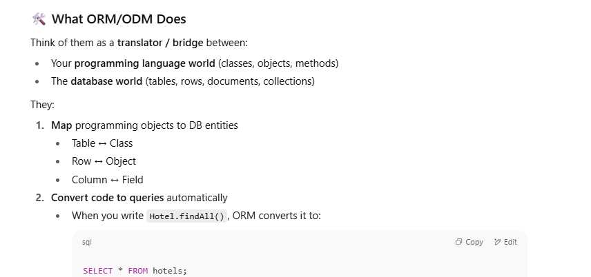

> _ORM/ODM is a library which lets us write DB interactions in our favorite programming language (JS, Java, Python, etc.), and the library converts it to raw DB queries._

Databases **don’t understand JS, Java, Python, etc.**  
They only understand their **own query languages**:

- RDBMS (MySQL, Postgres, Oracle) → **SQL**
    
- NoSQL (MongoDB, Cassandra, etc.) → **query APIs / DSLs**
    

👉 But as developers, we want to **stay in our favorite language** (JS, Java, Python) instead of constantly writing raw queries.

That’s where **ORM/ODM libraries** come in





**Handle boilerplate automatically**

- Escaping special characters (SQL injection safety).
    
- Managing connections, transactions, migrations.
    
- Ensuring schema consistency.


```ts
// SQL (for Postgres/MySQL)
const hotels = await db.query("SELECT * FROM hotels WHERE city = 'Delhi'");


// Sequelize ORM
const hotels = await Hotel.findAll({
  where: { city: "Delhi" }
});


Client ----> Express Server ----> ORM/ODM ----> Database
   ^              |                   |              |
   |              v                   v              v
   |         (JS/TS Code)        (Translate)     (Raw SQL/Query)
   |              ^                   |              |
   +--------------+<------------------+<-------------+


```

## 🎯 Why Use ORM/ODM?

✅ **Productivity** → less SQL/DB boilerplate  
✅ **Readability** → code feels native to your language  
✅ **Portability** → change DB engines with minimal code changes  
✅ **Safety** → prevents SQL injection if used correctly  
✅ **Integration with OOP** → work with objects, not just strings

**ORM/ODM = Translator between Programming Language Code ↔ Raw DB Queries.**

## 1️⃣ DB Driver (Low-Level Communication Layer)

- The **driver** is the actual bridge between your app and the database.
    
- It knows how to **speak the database protocol** (like TCP packets, authentication, query execution).
    

Example drivers in Node.js:

- `mysql2` → MySQL
    
- `pg` → PostgreSQL
    
- `oracledb` → Oracle
    
- `mongodb` → MongoDB
    

👉 If you install **just the driver**, you **can directly query the DB** using raw SQL (or raw Mongo queries).


```ts
import mysql from "mysql2/promise";

const connection = await mysql.createConnection({ host: "localhost", user: "root", database: "test" });

const [rows] = await connection.execute("SELECT * FROM hotels WHERE city = ?", ["Delhi"]);
console.log(rows);


```

✅ Works perfectly fine.  
❌ But you’re writing raw SQL, no models, no OOP abstraction.


## 5️⃣ Summary of Differences

| Case                     | What You Have        | How You Query                   | Pros                              | Cons                                      |
| ------------------------ | -------------------- | ------------------------------- | --------------------------------- | ----------------------------------------- |
| **Only Driver**          | `mysql2`, `pg`, etc. | Raw SQL queries                 | Full control, performance         | Verbose, no OOP abstraction               |
| **Only ORM (no driver)** | Sequelize            | ❌ Won’t work                    | N/A                               | Can’t connect to DB                       |
| **ORM + Driver**         | Sequelize + `mysql2` | OOP style (`findAll`, `create`) | Productivity, abstraction, safety | Slight overhead, sometimes less optimized |


**Connection to DB = driver’s job.**  
**ORM = sits above driver, organizes your queries, but always goes through the driver.**


## What ORM Does

- You write **OOP-style code** (classes, objects, methods).
    
- ORM **converts** it into raw **SQL queries** under the hood.
    
- Then the **driver sends those SQL queries** to the database.

👉 **ORM = Converts OOP-style code into SQL**  
👉 **Driver = Sends that SQL to the DB & manages the connection**


## 🔹 Why Sequelize CLI Exists

Sequelize has **two main parts**:

1. **Sequelize ORM library** → lets you define models and write queries in OOP style.
    
2. **Sequelize CLI (Command Line Interface)** → a developer tool that helps you **set up, manage, and evolve your database schema**.
    

---

### ⚡ Without CLI

You could still use Sequelize just fine:

- Define models in code
    
- Sync them with DB using `sequelize.sync()`
    
- Run raw migrations manually (SQL scripts)
    

But this quickly becomes messy in real projects.


The primary benefit of the Sequelize CLI is that it automates repetitive and error-prone tasks, allowing you to focus on writing your application's business logic.[](https://www.clearpeaks.com/the-benefits-of-using-sequelize-orm-in-modern-web-development/)

|Feature|With Sequelize CLI|Without Sequelize CLI|
|---|---|---|
|**Project Structure**|Generates a standardized and organized folder structure for models, migrations, and seeders [](https://www.c-sharpcorner.com/article/how-to-use-sequelize-cli-in-node/).|You have to design and implement your own project structure.|
|**Database Configuration**|Creates a `config.json` file to manage database connections for different environments [](https://sequelize.org/docs/v7/cli/).|You need to create and manage your own configuration solution.|
|**Model Generation**|Provides commands to generate model files, which automatically creates the corresponding migration file [](https://dev.to/maliksamad/sequelize-cli-typescript-4ff0).|You have to manually create both the model file and the corresponding logic to update the database schema.|
|**Database Migrations**|Offers commands to create, run, and undo migrations, simplifying database schema management [](https://stackoverflow.com/questions/27835801/how-to-auto-generate-migrations-with-sequelize-cli-from-sequelize-models).|You are responsible for writing and managing your own migration scripts, which can be complex.|
|**Data Seeding**|Includes commands for creating and running seed files to populate your database [](https://www.zipy.ai/blog/sequelize-cli-guide).|You would need to write custom scripts to seed your database.|

In essence, the Sequelize CLI provides a robust framework for managing your database interactions throughout the development lifecycle. It streamlines the setup process, enforces a consistent project structure, and provides powerful tools for managing your database schema, ultimately saving you significant time and effort

Here’s a comparison of how your workflow would differ when performing common database tasks.

## 1. Initial Project Setup

- **Without CLI**: You would need to manually create the entire folder structure for your project. This includes creating folders for configuration files, models, and any scripts you write to manage the database. You'd also have to write the initial database connection logic yourself, including a system to handle different configurations for development, testing, and production.
    
- **With CLI**: You run a single command: `npx sequelize-cli init`. This instantly generates a standardized project structure with `config`, `models`, `migrations`, and `seeders` directories, complete with the necessary configuration files and a model indexer.
    

## 2. Creating a New Database Table

Let's say you want to create a `Users` table.

- **Without CLI**:
    
    1. **Create Model File**: Manually create a `user.js` file inside your `models` folder.
        
    2. **Define the Model**: In that file, write the Sequelize model definition using `sequelize.define()`.
        
    3. **Update Model Index**: Manually add a line to your `models/index.js` to import and include the new `User` model.
        
    4. **Sync the Schema**: To create the table in the database, you would rely on the `sequelize.sync()` method. This approach has major drawbacks:
        
        - `sequelize.sync()` will not perform updates on an existing table.
            
        - `sequelize.sync({ force: true })` will drop the table if it exists and recreate it, **deleting all your data**. This makes it unsuitable for production or any environment with persistent data.  
            You'd have to write a custom script to run this sync process and decide how to manage it as your application grows.
            
- **With CLI**:
    
    1. **Generate Model and Migration**: Run a single command like `npx sequelize-cli model:generate --name User --attributes firstName:string,lastName:string`.
        
    2. **What Happens Automatically**: This command creates the `user.js` model file with the correct attributes and, crucially, also generates a new **migration file**. This migration file contains the precise, non-destructive code to create the `Users` table (`queryInterface.createTable(...)`).
        
    3. **Run the Migration**: Execute `npx sequelize-cli db:migrate`. The CLI runs the migration, safely creating the table in your database without affecting other tables or data.
        

## 3. Modifying an Existing Table

Now, imagine you need to add an `email` column to your `Users` table.

- **Without CLI**:
    
    1. **Update the Model**: Manually edit your `user.js` model file to include the `email` attribute.
        
    2. **Update the Database**: This is the most problematic step. Since `sequelize.sync()` doesn't alter existing tables, you have two poor choices:
        
        - **Destructive Sync**: Run `sequelize.sync({ force: true })`, which would add the column but also wipe all your user data.
            
        - **Manual SQL/Scripting**: You would have to write and run a raw SQL `ALTER TABLE` statement yourself or create a custom script using Sequelize's `queryInterface.addColumn()`. You would then be responsible for tracking which developer or server has run this script, creating a high risk of inconsistency and errors.
            
- **With CLI**:
    
    1. **Update the Model**: Manually edit the `user.js` model file to add the `email` attribute.
        
    2. **Generate a New Migration**: Run `npx sequelize-cli migration:generate --name add-email-to-users`.
        
    3. **Define the Change**: The CLI creates a new, empty migration file. You add one line of code to the `up` method (`await queryInterface.addColumn('Users', 'email', ...)` ) and one line to the `down` method to make the change reversible.
        
    4. **Run the Migration**: Execute `npx sequelize-cli db:migrate`. Sequelize’s migration system knows this is a new change and executes only this migration, safely altering your table without data loss.
        

## Summary of Key Workflow Differences

|Task|Workflow without Sequelize CLI (Manual)|Workflow with Sequelize CLI (Automated)|
|---|---|---|
|**Schema Changes**|Relies on `sequelize.sync()` (often destructive) or error-prone manual SQL scripts.|Uses a robust migration system that provides version control for your database schema.|
|**Consistency**|High risk of schemas becoming out of sync between developers and deployment environments.|Ensures every database instance is identical by tracking which migrations have run.|
|**Collaboration**|Difficult. A new developer has no clear, automated way to set up their local database to match the current schema.|Simple. A new developer just runs `npx sequelize-cli db:migrate` to bring their database up to date.|
|**Reversibility**|No built-in way to undo a schema change.|Every migration can have a `down` function, allowing you to easily revert changes with `db:migrate:undo`.|

In short, working without the Sequelize CLI forces you to reinvent a system for managing database schema changes—a system that is critical for development, collaboration, and deployment. The CLI provides this system out of the box, saving you time and preventing countless potential issues.

## The Core Problem: Keeping Database Schemas in Sync

Imagine a team of developers working on the same project. Each developer has a copy of the application and their own local database to test their changes.

Now, Developer A needs to add a new `email` column to the `Users` table. They make the change and push their code. What happens to Developer B?

- **The Manual, Error-Prone Way (Without CLI)**:
    
    1. Developer B pulls the latest code. The application code now expects an `email` column, but their local database doesn't have it. Their application will crash.
        
    2. Developer A has to somehow tell Developer B how to update their database. This usually involves sending a raw SQL command over Slack or email, like: `ALTER TABLE "Users" ADD COLUMN "email" VARCHAR(255);`.
        
    3. Developer B must manually connect to their database and run this command.
        
    4. This process is slow, prone to typos, and gets incredibly complicated when multiple developers are making different changes. It's easy to forget to run a script, run it twice, or run the wrong one.
        

## The Solution: `db:migrate`

The Sequelize CLI solves this problem by treating your database schema like source code—it's version-controlled and automated.

Here’s what happens when you use the CLI:

1. **Changes are Coded into Files**: When Developer A needs to add the `email` column, they don't write SQL. Instead, they run a CLI command like `sequelize migration:generate --name add-email-to-users`. This creates a new **migration file** in the project's `migrations` folder. This file contains JavaScript code describing the change.[](https://blog.devops.dev/modifying-existing-sequelize-migrations-97be5371c32e)
    
2. **Tracking What's Been Done**: Sequelize creates a special table in your database called `SequelizeMeta`. This table acts as a log, keeping a record of every migration file that has already been successfully run on that specific database.[](https://sequelize.org/docs/v6/other-topics/migrations/)
    
3. **The "Magic" of `db:migrate`**: When any developer runs `npx sequelize-cli db:migrate`:
    
    - Sequelize looks at the `migrations` folder in the project.
        
    - It compares the list of files in that folder with the list of migrations already recorded in the `SequelizeMeta` table.[](https://sequelize.org/docs/v6/other-topics/migrations/)
        
    - It then automatically executes **only the new migrations**—the ones that haven't been run yet on their database.
        

## The "Teammates" Scenario Explained

So, the statement "**Teammates? They just run `db:migrate` → their DB schema matches yours (no manual `.sql` copy-pasting)**" means:

- **Developer A**: Makes a change, generates a migration file, and commits that file to the git repository along with their other code changes.
    
- **Developer B**: Pulls the latest code from git. They now have the new migration file on their machine.
    
- **The Simple Fix**: Instead of asking what changed, Developer B simply runs `npx sequelize-cli db:migrate` in their terminal.
    
- **The Result**: The CLI sees the new migration file, checks their `SequelizeMeta` table, realizes it hasn't run this migration yet, and executes it. Their local database is instantly and automatically updated to match Developer A's schema.
    

This workflow eliminates the need for manual communication about database changes, prevents errors, and ensures that every developer and every deployment environment (like staging or production) has a perfectly synchronized and up-to-date database structure. It provides a reliable, repeatable, and automated way to manage the evolution of your database schema.


## 3. Examples to Make It Clear

- **Sequelize CLI** → Dev Dependency (used to generate models/migrations during development, not needed when app runs).
    
- **Sequelize ORM** → Dependency (needed at runtime for DB queries).
    
- **mysql2 / pg** → Dependency (driver needed at runtime).
    
- **nodemon** → Dev Dependency (auto-restarts server in development).
    
- **jest / mocha** → Dev Dependency (for tests only).
    

---

## 🔹 4. Rule of Thumb

- If it’s needed for the app to **run in production** → put in `dependencies`.
    
- If it’s only for **development convenience** → put in `devDependencies`


## 🔹 What is `dialect` in `config.json`?

In Sequelize (and other ORMs), **dialect** means:  
👉 _Which database engine are you using?_

Because SQL is a **standard**, but each database has its **own flavor (dialect)**.

- MySQL and PostgreSQL both use SQL, but not exactly the same.
    
- Example:
    
    - MySQL uses `AUTO_INCREMENT`
        
    - PostgreSQL uses `SERIAL`
        
    - SQLite stores everything in a single file
        

So Sequelize needs to know:

> “Which SQL flavor should I generate queries for?”

---

## 🔹 Common Dialects Supported by Sequelize

- `"mysql"` → MySQL / MariaDB (driver: `mysql2`)
    
- `"postgres"` → PostgreSQL (driver: `pg`)
    
- `"sqlite"` → SQLite (driver: `sqlite3`)
    
- `"mssql"` → Microsoft SQL Server (driver: `tedious`)


✅ So your approach is correct:

- `sequelizerc` = map paths.
    
- Run commands as usual (`migration:generate`, `db:migrate`, `db:seed`) and Sequelize respects your folder structure.

A migration is composed of two primary functions: `up` and `down`.


## `up` Function

This function is executed when you run the migration. Its purpose is to create a new table called `hotels`.


```ts
async up (queryInterface: QueryInterface) {
  await queryInterface.sequelize.query('
    CREATE TABLE IF NOT EXISTS hotels (
      id INT AUTO_INCREMENT PRIMARY KEY,
      name VARCHAR(255) NOT NULL,
      address VARCHAR(255) NOT NULL,
      location VARCHAR(255) NOT NULL,
      created_at TIMESTAMP DEFAULT CURRENT_TIMESTAMP,
      updated_at TIMESTAMP DEFAULT CURRENT_TIMESTAMP ON UPDATE CURRENT_TIMESTAMP
    );'
  );
},
```


- **`CREATE TABLE IF NOT EXISTS hotels`**: This SQL command creates a new table named `hotels`, but only if a table with that name doesn't already exist.
    
- **Columns**:
    
    - `id`: An integer that automatically increments and serves as the unique primary key for each record.
        
    - `name`, `address`, `location`: Text fields (up to 255 characters) that cannot be empty.
        
    - `created_at`: A timestamp that automatically records when a new hotel entry is created.
        
    - `updated_at`: A timestamp that records when the entry was created and is automatically updated every time the record is changed.
        

## `down` Function

This function is executed when you need to **undo** or **rollback** the migration. It does the exact opposite of the `up` function.

```ts

async down (queryInterface: QueryInterface) {
  await queryInterface.sequelize.query('
    DROP TABLE IF EXISTS hotels;'
  );
}
```


- **`DROP TABLE IF EXISTS hotels`**: This command completely deletes the `hotels` table from the database, if it exists.

While writing raw SQL in your migration files works, the generally recommended best practice is to **use the migration files generated by the Sequelize CLI** and its helper methods.

**Pros:**

- **Safety and Readability**: Helper methods are less prone to typos and syntax errors than writing raw SQL. They make the migration's purpose clear even to those who aren't SQL experts.[](https://www.linkedin.com/pulse/database-migration-best-practices-developers-guide-safer-srikanth-r-rqaoc)
    
- **Database Agnostic**: Sequelize's helpers abstract away the differences between SQL dialects (like PostgreSQL, MySQL, etc.). If you switch databases, your migrations are more likely to work without changes.
    
- **Consistency**: It keeps your codebase consistent. You're using the ORM's abstraction layer everywhere, from models to migrations.
    
- **Standard Practice**: This is the method shown in the official Sequelize documentation and is the standard workflow for most developers, making your project easier for others to understand.[](https://sequelize.org/docs/v6/other-topics/migrations/)
    

**Cons:**

- **Less Control**: For highly complex or database-specific features (like special index types or check constraints), the helper methods may not be sufficient.

## Writing Raw SQL in Migrations

As seen in your image, you can use `queryInterface.sequelize.query()` to execute any raw SQL command.[](https://www.reddit.com/r/node/comments/m6axph/how_to_send_raw_queries_to_the_db_through/)

**Pros:**

- **Full Control**: You can write any query your database supports, giving you maximum flexibility for complex schemas or performance optimizations.[](https://www.reddit.com/r/node/comments/m6axph/how_to_send_raw_queries_to_the_db_through/)
    
- **Potentially Faster for Experts**: If you are very comfortable with SQL, writing the query directly might feel quicker than looking up the correct Sequelize helper method.
    
- **Handles Complex Cases**: This is the go-to solution when Sequelize's built-in helpers can't handle a specific requirement.
    

**Cons:**

- **Loses Abstraction**: You are bypassing the main benefit of an ORM. Your migrations become tied to a specific database dialect.
    
- **Higher Risk of Errors**: You are responsible for writing perfectly correct SQL syntax, which can be easy to get wrong.
    
- **Reduced Readability**: Raw SQL can be harder to read and maintain for other developers on your team compared to the clear, purpose-built helper methods


Reserve the use of raw SQL (`queryInterface.sequelize.query()`) for specific cases where the standard helpers are not capable of performing the task you need.

When working with Sequelize in a TypeScript project. The `sequelize-cli` is a JavaScript-based tool and doesn't natively understand TypeScript files. However, you can absolutely configure it to use your `config.ts` file with a straightforward workaround.

The solution is to create a JavaScript "bridge" file that uses `ts-node` to load your TypeScript configuration on the fly. Here is a step-by-step guide.

## Step 1: Install `ts-node`

If you haven't already, you need `ts-node` to allow Node.js to execute TypeScript files directly. Install it as a development dependency:
npm install --save-dev ts-node


`npm install --save-dev ts-node`

## Step 2: Create a `.sequelizerc` File

This file lives in the root of your project and tells the `sequelize-cli` where to find your configuration, models, and migration files. Create a file named `.sequelizerc` and add the following code.[](https://sequelize.org/docs/v7/cli/)

Notice that the `config` path points to a `.js` file, not your `.ts` file. This is the crucial first step.[](https://dev.to/maliksamad/sequelize-cli-typescript-4ff0)


## Step 4: Your TypeScript Configuration (`config.ts`)

Your actual `config.ts` file can now be written purely in TypeScript, using environment variables and any other logic you need. The `sequelize.config.js` file will simply import and re-export its contents.

Here is an example of what `src/config/config.ts` might look like:


## How It Works

With this setup, the process is as follows:

1. You run a command like `npx sequelize-cli db:migrate`.
    
2. The CLI reads the `.sequelizerc` file to find the path to its configuration.
    
3. It loads the JavaScript file: `src/config/sequelize.config.js`.
    
4. The first line of that file, `require('ts-node/register');`, enables Node.js to process TypeScript files.[](https://dev.to/maliksamad/sequelize-cli-typescript-4ff0)
    
5. The next line successfully imports the `config` object from your `config.ts` file.
    
6. The configuration is exported in the plain JavaScript format that the CLI expects, allowing it to connect to your database and run the migrations.


