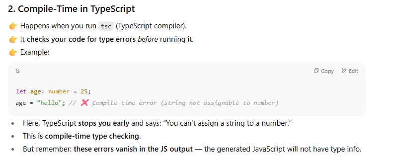
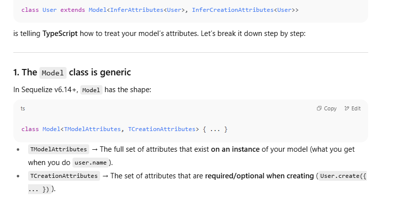
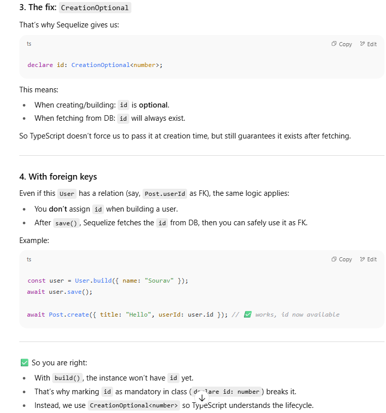
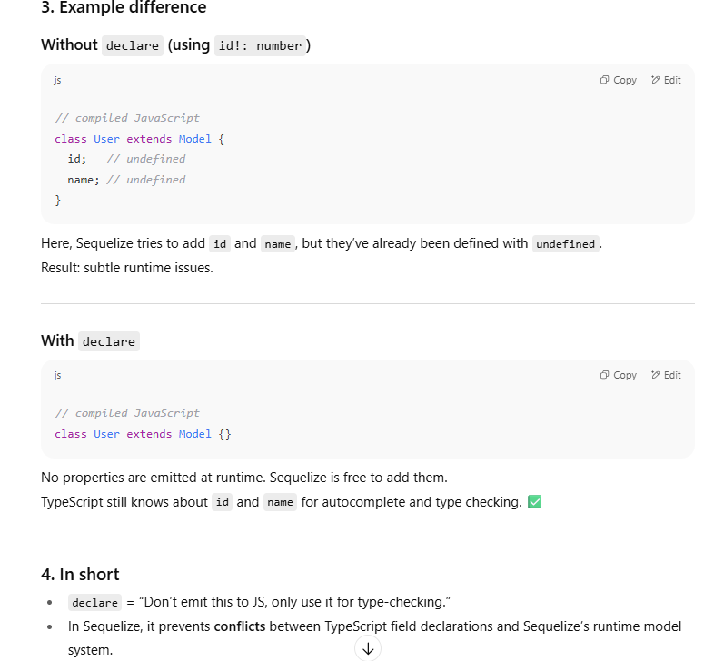

 Each migration file represents a single, specific change to your database. They are designed to be run in a strict sequence to build your database schema step-by-step.

This sequence is determined by the timestamp in the filename that `sequelize-cli` generates (e.g., `20250818150000-create-users.js`). When you run migrations, Sequelize reads these files in alphabetical (and therefore chronological) order to apply the changes correctly


For example:

1. **Migration 1:** Creates the `Users` table.
    
2. **Migration 2:** Creates the `Posts` table with a `userId` foreign key.
    
3. **Migration 3:** Adds a new `email` column to the `Users` table

Toh inki sabki alag migration files banegi!!


This system ensures that if you set up a new database from scratch, the tables and columns are created in the correct order, preventing errors like trying to add a foreign key to a table that doesn't exist yet.


## Coming Back and Forth: The `up` and `down` Functions

Your understanding of moving back and forth between these structures is also spot on. This is the entire purpose of having both an `up` and a `down` function in every migration file.[](https://sequelize.org/docs/v6/other-topics/migrations/)

- **Going "Up" (Forward)**: When you run `sequelize-cli db:migrate`, the system looks at a special table in your database called **`SequelizeMeta`**. This table records which migrations have already been run. It then executes the `up` function of all migrations that are not yet in the `SequelizeMeta` table, bringing your database to the latest version.[](https://ajibaddemotiv.hashnode.dev/mastering-sequelize-migrations-and-seeders-in-node-js)
    
- **Going "Down" (Backward)**: When you run `sequelize-cli db:migrate:undo`, it looks at the most recent migration recorded in the `SequelizeMeta` table and executes its corresponding `down` function. This reverts the last change made. You can undo multiple migrations by running the command repeatedly, effectively traveling back in time through your database's history.

## Why This Is So Powerful

This system of sequential, reversible changes is a cornerstone of modern software development for several reasons:

- **Collaboration**: Everyone on the team can stay in sync with the latest database structure.
    
- **Safety**: If you deploy a new version and discover a bug, you can instantly roll back the database changes by running the `down` migration.[](https://www.linkedin.com/pulse/database-migration-best-practices-developers-guide-safer-srikanth-r-rqaoc)
    
- **Consistency**: It guarantees that the database schema is identical across all environments (development, testing, production).


`npx sequelize-cli db:migrate:undo:all --to XXXXXXXXXXXXXX-create-posts.js`

## Command Components

- **`db:migrate:undo:all`**: This part of the command tells Sequelize to revert **all** migrations that have been applied to the database. If you run this command alone, it will execute the `down` function of every single migration file, taking your database schema all the way back to an empty state.[](https://ajibaddemotiv.hashnode.dev/mastering-sequelize-migrations-and-seeders-in-node-js)
    
- **`--to XXXXXXXXXXXXXX-create-posts.js`**: This is the crucial option that modifies the `undo:all` command. The `--to` flag specifies a target migration file. When you use it with `undo:all`, you are telling Sequelize: "Revert all migrations, but **stop** when you get to this one".[](https://sequelize.org/docs/v6/other-topics/migrations/)
    

## What It Actually Does

Instead of reverting _every_ migration, this command reverts all migrations that were run **after** the `XXXXXXXXXXXXXX-create-posts.js` migration. The state of the database will be exactly as it was after the `create-posts` migration was successfully run.

## A Practical Example

Imagine your migration history looks like this, from oldest to newest:

1. `...-create-users.js`
    
2. `...-create-posts.js` **(Your Target)**
    
3. `...-add-email-to-users.js`
    
4. `...-add-likes-to-posts.js`
    

When you run `npx sequelize-cli db:migrate:undo:all --to ...-create-posts.js`, the following will happen:

- The `down` function of `...-add-likes-to-posts.js` will be executed.
    
- The `down` function of `...-add-email-to-users.js` will be executed.
    
- The process will then **stop**.
    

The final state of your database will have the `users` table and the `posts` table, but the `email` column and the `likes` functionality will be gone. It's a precise way to jump back to a specific version of your schema.

### Modern Layered Architecture

**Model (Entity/Domain model)**

- Represents **data structures** (User, Product, Order).
    
- Often just POJOs/DTOs (Plain objects) with validation.
    
- Sometimes contains _lightweight business rules_, but in layered style, heavy logic moves to **Service**.

In js/ts we want to interact with classes, objects not sql queries!!





## 4. **Key Difference**

|Feature|Compile-Time (TypeScript)|Run-Time (JavaScript)|
|---|---|---|
|**When it happens**|Before running, during compilation|While executing program|
|**Checks for**|Type errors, missing properties, etc.|Actual logic & values|
|**Who does it**|TypeScript compiler (`tsc`)|JS engine (Node, V8, Browser)|
|**Errors caught**|Type mismatches, invalid calls|Exceptions, crashes|


- **You don’t create the properties.**
    
- **Sequelize does at runtime.**
    
- **TypeScript only needs “declarations” for type-checking, not real values.**

```ts
import { Model, InferAttributes, InferCreationAttributes, CreationOptional } from 'sequelize';

// order of InferAttributes & InferCreationAttributes is important.
class User extends Model<InferAttributes<User>, InferCreationAttributes<User>> {
  // 'CreationOptional' is a special type that marks the field as optional
  // when creating an instance of the model (such as using Model.create()).
  declare id: CreationOptional<number>;
  declare name: string;
  // other attributes...
}

```


### Step 1: `Model<A, B>`

Think of Sequelize’s `Model` class as a **box** that needs **two labels**:

- `A` = “What the model looks like when I already have it” (instance).
    
- `B` = “What I need to give when I’m creating it” (creation).
    

So it’s like:

`class Model<InstanceShape, CreationShape> { ... }`


### 3. General rule

- Some fields **must be present** in the instance, because the DB always provides them (like `id`, `createdAt`).
    
- But they are **not required when creating** because Sequelize/DB will fill them in for you.
    

---

### 4. Example in plain words

Think of `id` as a **roll number** in a school:

- When the school database shows you a student record → it always has a roll number.
    
- But when a new student joins → you don’t assign your own roll number, the school gives one automatically.
    

That’s why `id` is:

- Present in the **instance type**.
    
- Absent (or optional) in the **creation type**.





`InferAttributes<User>, InferCreationAttributes<User>>` =  
“Tell TypeScript: _this model has these fields (id, name, ...), and when I call `.create()`, make some optional if I marked them with `CreationOptional`._”


Mark a field as `CreationOptional` **if Sequelize (or the database) will auto-generate it** when you insert a new row.

👉 Example cases:

- `id` → usually `autoIncrement` primary key
    
- `createdAt` / `updatedAt` → Sequelize adds them automatically if timestamps are enabled
    
- `deletedAt` → if you use **paranoid** mode
    
- Any field with `defaultValue` in the schema (since you don’t need to pass it manually)


|Method|Saves to DB immediately?|When to use|
|---|---|---|
|`Model.create()`|✅ Yes (INSERT immediately)|Quick create + save in one step|
|`Model.build()`|❌ No (only creates in memory)|When you want to modify first, then save|
|`instance.save()`|Depends (INSERT if new, UPDATE if existing)|To persist changes on an instance|




## What `declare` means

The `declare` keyword tells TypeScript:

> “This property **exists at runtime**, but TypeScript should not generate any code for it. Just treat it as a type.”

So it’s purely for the **type system**, not for emitted JavaScript.




## 3. JS vs TS difference

- **JavaScript:**  
    You don’t declare fields at all. Sequelize just attaches them via `.init()`.
    
- **TypeScript:**  
    You **must declare fields (with `declare`)** so TypeScript knows about them at compile time.  
    Sequelize still attaches them dynamically at runtime.


`declare` is used to tell the compiler "this thing (usually a variable) exists already, and therefore can be referenced by other code, also there is no need to compile this statement into any JavaScript

Just **declaring a class with fields does nothing**.  
To actually connect it to a database table, you must call `.init()` on it.


- `class Book { declare title: string }` = _“Hey TypeScript, I promise `title` exists.”_
    
- `Book.init({...}, {...})` = _“Hey Sequelize, map this class to the `books` table with these columns.”_

## 1. What is `init()`?

The `Model.init()` function is what actually **registers your class as a Sequelize model** and maps it to a database table.

When you create a class that extends `Model`, Sequelize doesn’t yet know:

- Which table it should use
    
- What columns exist
    
- What their types are
    

👉 `init()` fills in that gap.


```ts
Book.init(
  // 1️⃣ Attributes
  {
    id: {
      type: DataTypes.INTEGER,
      primaryKey: true,
      autoIncrement: true,
    },
    title: {
      type: DataTypes.STRING,
      allowNull: false,
    },
    author: {
      type: DataTypes.STRING,
      allowNull: true,
    },
  },
  // 2️⃣ Options
  {
    sequelize,          // the Sequelize instance (connection)
    modelName: "Book",  // Sequelize's internal name
    tableName: "books", // the actual table name in DB (optional) // IMPORTANT
    timestamps: true,   // adds createdAt and updatedAt
  }
);
```


## 4. What happens inside `init()`?

When you call `Book.init(...)`:

- Sequelize **stores the mapping**:
    
    - `Book` class ↔ `books` table
        
    - `title` property ↔ `title` column (STRING)
        
    - `author` property ↔ `author` column (STRING)
        
- Sequelize **injects runtime getters/setters** into your `Book` class.  
    So now `Book.findAll()` or `Book.create({ title: "X" })` works.
    

Without `init()`, Sequelize doesn’t know anything about the table or columns.


## Options

Some important ones:

- **sequelize** → required, the database connection
    
- **modelName** → name Sequelize uses internally (like in associations)
    
- **tableName** → actual DB table (defaults to pluralized form of modelName)
    
- **timestamps** → adds `createdAt` & `updatedAt` columns
    
- **underscored** → changes column names to `snake_case` instead of `camelCase`


We create a new file name sequelize.ts in the models folder and in that we do this to connect sequelize to the db!!
## . Why do we put it in `sequelize.ts`?

- Because **all models need to share the same connection**.
    
- Instead of each model reconnecting with the raw config (wasteful + buggy), you create **one Sequelize instance** here and import it into your models.

## . So is this the “first connection”?

✅ Yes.  
This `sequelize = new Sequelize(...)` line is the **only place where the DB connection is created**.  
Your `config` files just store credentials, they don’t connect.


### 🔹 **Migrations**

- Used when you want to **change the table itself** (structure / schema).
    
- Example actions:
    
    - Create a new table (`books`)
        
    - Add a column (`published_year`)
        
    - Remove a column
        
    - Add indexes / constraints
        

👉 Think: _“Change the shape of the database.”_

---

### 🔹 **Models**

- Used when you want to **work with the data (rows)** inside the table.
    
- Example actions (CRUD):
    
    - Insert a row → `Book.create({ title: "1984" })`
        
    - Read rows → `Book.findAll()`
        
    - Update a row → `Book.update(...)`
        
    - Delete a row → `Book.destroy(...)`
        

👉 Think: _“Use the database after it exists.”_

---

### ✅ Super simple analogy

- **Migration** = Build/renovate the building 🏗️
    
- **Model** = Live and work inside the building 🏠
    

---

So exactly as you said:

- **CRUD = Models**
    
- **DB structure changes = Migrations**


✅ So yes — after you define a class **and call `.init()` on it**, Sequelize _automatically_ injects all these helper functions (`create`, `findAll`, `update`, `destroy`, etc.) into your model class.

That’s why we don’t have to write SQL ourselves anymore.


⚡ **But normally**:

- Use **migrations** → create/alter tables
    
- Use **models** → CRUD with helper functions
    
- Use **raw queries** only for edge cases


- **Migrations** need a DB connection so they can run SQL (`CREATE TABLE`, `ALTER TABLE`, etc.).
    
- **Models** also need the same DB connection so they can run CRUD queries (`INSERT`, `SELECT`, etc.).


### ✅ Typical Setup

1. **`config/config.json` (or `.ts`)**
    
    - Stores DB credentials (username, password, db name, etc.).
        
    - Used by **Sequelize CLI** for migrations.
        
2. **`models/index.ts`**
    
    - Imports those credentials.
        
    - Creates a single Sequelize instance.
        
    - Initializes all models with it.
        
    - Exports models + sequelize instance for app code (CRUD).
        
3. **Migrations + Seeders**
    
    - CLI automatically picks up that same config.
        
    - Uses the same DB connection details.
        

---

### ⚡ Analogy

Think of the **Sequelize instance** like your Wi-Fi router 🛜.

- Migrations = setting up or rearranging furniture in the house 🛋️
    
- Models = living in the house, opening/closing doors, using things 🚪
    

Both use the same Wi-Fi. You don’t need two routers.


First server is up we should also make sure we're connected to the db as well!!


Sanket writes the api from the bottom up approach and like he first starts with the repository layer !


# 1. What is a DTO?

**DTO = Data Transfer Object**

👉 It’s just a plain object (or class in TypeScript) that defines the **shape of data** you expect when data is coming **into** or going **out of** your application.

Think of it like:

- **Client → Backend**: request body (from Postman, frontend, mobile app, etc.)
    
- **Backend → Client**: response body
    

DTOs are like **contracts**:

> “This is exactly the data format I accept or return.”


# 4. DTO vs Model

🚫 Don’t confuse with Sequelize model.

- **Model** → database representation (id, timestamps, etc.)
    
- **DTO** → client request/response representation (only the fields you need)
    

For example:

- Model: `id, name, email, passwordHash, createdAt, updatedAt`
    
- DTO: `name, email, password` (no `id` yet, no `passwordHash` — frontend never sends this)

# 6. Lifecycle with DTO

1. **Postman request → DTO**  
    (validate + transform raw body into DTO class)
    
2. **DTO → Service → Model**  
    (use DTO data to create/update a Sequelize model in DB)
    
3. **Model → DTO (Response DTO)**  
    (filter sensitive fields before sending response)


## 2. Why a separate layer?

Without a DTO layer, your controller directly talks to models. That can cause:

- Leaking of sensitive data (password hashes go to Postman by mistake).
    
- Accepting unexpected data (attackers add extra JSON fields).
    
- Tight coupling (your DB schema dictates what API looks like).
    

DTO layer solves this by being a **translator**:

- From **raw request** → into a **clean object**.
    
- From **model** → into a **safe response**.

The **DTO layer** = a **shield** between your raw HTTP world (Postman, frontend, API consumers) and your business logic/database.


now how we use it let's see--


Repo mein pure db interactions hai bas right!!!


now service layer k andar sirf buisness logic par kam hoga!!


now controller 


# 1. What is the **Validator Layer**?

- When data comes from Postman → it first goes into **DTOs** (structure).
    
- But we also need to **validate** it (rules).
    
- That’s what the **Validator Layer** does.
    

👉 **DTO layer says:** “Data should look like this.” 
👉 **Validator layer says:** “And it must follow these rules.”


# 2. Why separate validator layer?

If you skip validation:

- Postman might send `{ email: "not-an-email" }`
    
- Or `{ password: "123" }` (too short)
    
- Or `{ name: "" }` (empty string)
    

If this bad data reaches your **service/db layer**, your system may break.

The **validator layer** ensures data is:

- Correct type
    
- Not missing required fields
    
- Matches patterns (like valid email)
    
- Within limits (min/max length, ranges)


# 6. Key Difference (DTO vs Validator Layer)

|Layer|Responsibility|
|---|---|
|**DTO Layer**|Defines the shape of data (structure/fields).|
|**Validator**|Defines the rules for each field.|
|**Together**|Make sure only clean & correct data enters.|

---

# 7. Analogy 🎓

- **DTO layer** = The blank form you must fill (structure).
    
- **Validator layer** = The rules the clerk checks: “email must be valid, age must be > 18, password must be ≥ 6 chars.”
    
- Together, they protect the **service layer** from garbage data.


Yes, usually the same API serves both mobile and desktop apps but problem arrises!!


# 1. Problem: One Backend, Many Frontends

Suppose you have **one API** and multiple clients:

- Web app (React)
    
- Mobile app (React Native)
    
- Desktop app (Electron)
    

If all these directly consume the same backend API, issues come up:

- Mobile needs **lighter data** (slow network, small screen).
    
- Web needs **richer data** (big screen, more details).
    
- Desktop may need **extra features**.
    

👉 If the backend tries to serve **everyone equally**, it becomes **bloated and complex**.


# 5. Benefits

✅ Faster performance (less over-fetching for mobile)  
✅ Cleaner frontend code (frontend doesn’t need to filter data itself)  
✅ Easier backend maintenance (core backend stays generic, logic in BFF)  
✅ Allows frontend teams to move independently (each has its own BFF layer)

---

# 6. When to use BFF

- You have **multiple frontends** with different needs.
    
- Your core backend is **microservices** (lots of small APIs, frontend would need to call many).
    
- You want to **decouple frontend and backend teams**.

GraphQL is often seen as an **alternative to the BFF pattern**, because it solves some of the same problems in a different way. Let’s compare them clearly.

---

## 1. Problem Reminder

- Different frontends (web, mobile, desktop) need **different shapes of data**.
    
- REST APIs (or one backend) either **over-fetch** (send too much) or **under-fetch** (need multiple calls).
    

---

## 2. BFF Way

👉 Create a **separate backend layer** per frontend.

- Mobile BFF trims fields → lighter response.
    
- Web BFF aggregates more → richer response.
    
- Each BFF talks to the **core backend services**


## 4. Comparing GraphQL vs BFF

|Aspect|BFF Pattern|GraphQL|
|---|---|---|
|Approach|Create **separate backends** per frontend|**One endpoint**, clients choose fields|
|Who controls shape|Backend team (each BFF decides)|Frontend team (queries decide)|
|Performance|Good, but can duplicate logic across BFFs|Very good, avoids over/under-fetching|
|Complexity|Multiple codebases (one BFF per frontend)|Single schema, but resolver logic can get complex|
|Flexibility|Low → every change needs backend updates|High → frontend queries can evolve fast|

---

## 5. When to Use Which?

- **Use BFF** when:
    
    - You want **strict control** over what each frontend can/can’t access.
        
    - Teams are separate (mobile team owns mobile BFF).
        
    - You have heavy business logic specific to frontend.
        
- **Use GraphQL** when:
    
    - You want **flexibility** (frontend chooses data).
        
    - You want to reduce the number of endpoints.
        
    - You have many frontends with slightly different needs.
        

👉 Some companies even mix both:

- A **GraphQL server** per frontend (GraphQL-as-BFF).
    

---

## 6. Analogy 🎓

- **BFF** = Multiple fixed menus (mobile menu, web menu, desktop menu).
    
- **GraphQL** = Buffet style → frontend picks exactly what it wants from one kitchen.
    

---

✅ So yes — **GraphQL can replace the BFF layer in many cases**, but if you need **strict separation & control per frontend**, BFF is still useful.