## 💡 MySQL Column Type Cheat Sheet

|Use Case|Suggested Type|Storage / Range (Signed)|Notes / When to Upgrade|
|---|---|---|---|
|**Auto-increment IDs**|INT|4 bytes, -2,147,483,648 → 2,147,483,647|Usually enough; use BIGINT if expecting >2B rows|
|**Huge IDs / counters**|BIGINT|8 bytes, ±9.22×10¹⁸|Rare; only for massive-scale apps|
|**Small counters / flags**|TINYINT|1 byte, -128 → 127|0/1 or small status codes|
|**Moderate counters**|SMALLINT|2 bytes, -32,768 → 32,767|Useful for small lookup tables|
|**Regular numeric values**|INT / DECIMAL|INT = 4 bytes, DECIMAL(n,m) precise numbers|Money often stored as DECIMAL to avoid float rounding|
|**Large numeric / money**|BIGINT / DECIMAL|BIGINT = 8 bytes|For very large amounts, or storing cents instead of decimals|
|**Short text (names, titles)**|VARCHAR(n)|1 byte per char + 1/2 bytes length overhead|n = max chars expected|
|**Long text**|TEXT / MEDIUMTEXT|Up to 65k / 16M chars|For descriptions, content|
|**Dates & times**|DATE / DATETIME / TIMESTAMP|3–8 bytes|Choose based on needed precision and timezone handling|
|**Boolean**|TINYINT(1)|1 byte|MySQL doesn’t have native BOOLEAN; 0 = false, 1 = true|
### 🔹 Practical Tips

1. **Always estimate your max value** first.
    
2. **Use the smallest type** that safely fits the data — saves space & improves performance.
    
3. **For IDs**: INT is standard, BIGINT only if you expect huge scale.
    
4. **Money**: Use `DECIMAL` or store in cents as INT to avoid floating point rounding issues.
    
5. **Flags / enums**: TINYINT is perfect.

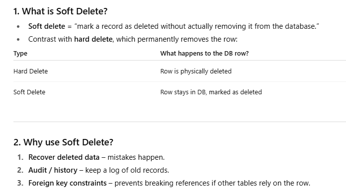


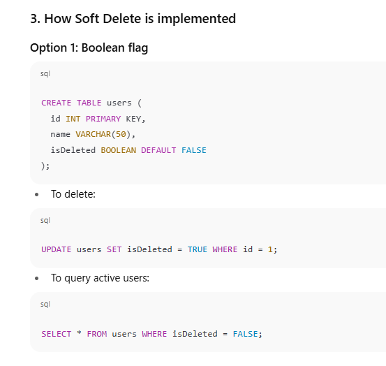


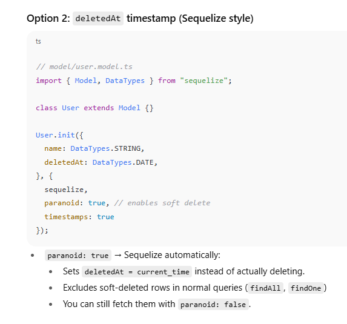

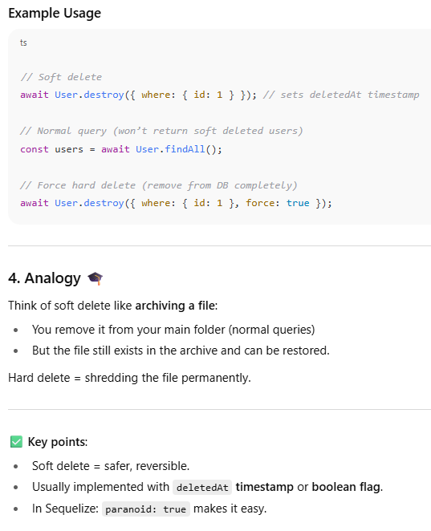

You can write migrations in **two main ways**:

1. **SQL-based (raw SQL)**
    
2. **QueryInterface (Sequelize helpers)**

## 1️⃣ SQL-based migrations (raw SQL)

- You literally write **SQL statements** in your migration file.
    
- Sequelize just runs them for you.
```ts
export async function up(queryInterface: any, Sequelize: any) {
  await queryInterface.sequelize.query(`
    CREATE TABLE users (
      id INT PRIMARY KEY AUTO_INCREMENT,
      name VARCHAR(255) NOT NULL,
      email VARCHAR(255) UNIQUE NOT NULL,
      createdAt DATETIME NOT NULL,
      updatedAt DATETIME NOT NULL
    );
  `);
}

```


### ✅ Pros:

- Full control over **exact SQL syntax**.
    
- Can use **DB-specific features** (e.g., MySQL triggers, indexes).
    
- Works even if you don’t use Sequelize models.
    

### ❌ Cons:

- Less portable (SQL dialect-specific).
    
- More error-prone for big schema changes.
    
- You need to manually write `createdAt`/`updatedAt` if you want timestamps.


## 2️⃣ QueryInterface-based migrations (Sequelize helpers)

- Sequelize provides **helper functions** that abstract SQL.

```ts
export async function up(queryInterface: any, Sequelize: any) {
  await queryInterface.createTable('Users', {
    id: {
      type: Sequelize.INTEGER,
      autoIncrement: true,
      primaryKey: true,
    },
    name: {
      type: Sequelize.STRING,
      allowNull: false,
    },
    email: {
      type: Sequelize.STRING,
      allowNull: false,
      unique: true,
    },
    createdAt: {
      type: Sequelize.DATE,
      allowNull: false,
    },
    updatedAt: {
      type: Sequelize.DATE,
      allowNull: false,
    },
  });
}

```

### ✅ Pros:

- **DB-agnostic** → works across MySQL, Postgres, SQLite, etc.
    
- Cleaner, easier to read and maintain.
    
- Works well with Sequelize models.
    

### ❌ Cons:

- Less control over raw SQL optimizations.
    
- Some advanced DB features might not be supported directly.


## 3️⃣ When to use which

|Scenario|Recommended method|
|---|---|
|Simple table/column changes|QueryInterface (Sequelize helper)|
|Complex SQL features (views, triggers, raw joins, custom indexes)|Raw SQL|
|Need DB-agnostic migrations|QueryInterface|
|Need full control over performance|Raw SQL|

---

## 4️⃣ Mental model

- **QueryInterface** = “Sequelize speaks for me in its own language” → safer, portable
    
- **Raw SQL** = “I speak directly to the DB” → full control, but more responsibility


**Multiple ways to do CRUD**:

## 1️⃣ Using **Model objects** (OOP style)

- This is **object-oriented**, uses the **Model class**.
    
- Works directly with Sequelize models, strongly typed in TypeScript.

```ts
// Create
const user = await User.create({ name: "Sourav", email: "rajvi@example.com" });

// Read
const foundUser = await User.findByPk(1);

// Update
await User.update({ name: "Rajvi" }, { where: { id: 1 } });

// Delete (soft or hard depending on model)
await User.destroy({ where: { id: 1 } });

```


✅ Pros:

- Fully integrated with **Sequelize models**.
    
- Works with **associations, hooks, validations**.
    
- Typescript types work nicely (`InferAttributes`, `CreationOptional`, etc.).
    

---

## 2️⃣ Using **raw SQL** (queryInterface or sequelize.query)

- Sometimes you need **complex queries** not easily expressed via the model.
    
- You can write **SQL directly** and execute it via Sequelize.


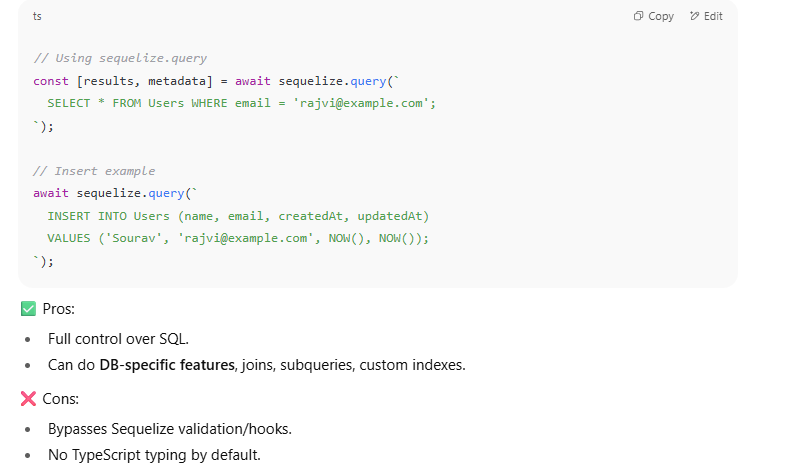


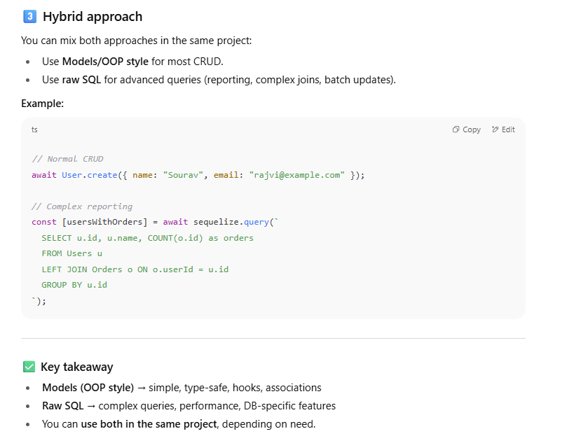


# **Sequelize CRUD Cheat Sheet**

|Operation|Model / OOP Style|Raw SQL Style (`sequelize.query`)|
|---|---|---|
|**Create**|`ts const user = await User.create({ name: "Sourav", email: "rajvi@example.com" });`|``ts await sequelize.query(` INSERT INTO Users (name, email, createdAt, updatedAt) VALUES ('Sourav', 'rajvi@example.com', NOW(), NOW()); `);``|
|**Read (all)**|`ts const users = await User.findAll();`|``ts const [users] = await sequelize.query(` SELECT * FROM Users; `);``|
|**Read (by ID)**|`ts const user = await User.findByPk(1);`|``ts const [user] = await sequelize.query(` SELECT * FROM Users WHERE id = 1; `);``|
|**Read (with condition)**|`ts const users = await User.findAll({ where: { name: "Sourav" } });`|``ts const [users] = await sequelize.query(` SELECT * FROM Users WHERE name = 'Sourav'; `);``|
|**Update**|`ts await User.update({ name: "Rajvi" }, { where: { id: 1 } });`|``ts await sequelize.query(` UPDATE Users SET name = 'Rajvi' WHERE id = 1; `);``|
|**Delete (hard)**|`ts await User.destroy({ where: { id: 1 }, force: true });`|``ts await sequelize.query(` DELETE FROM Users WHERE id = 1; `);``|
|**Delete (soft, paranoid)**|`ts await User.destroy({ where: { id: 1 } }); // sets deletedAt timestamp if paranoid:true`|``ts await sequelize.query(` UPDATE Users SET deletedAt = NOW() WHERE id = 1; `);``|
|**Count**|`ts const count = await User.count({ where: { name: "Sourav" } });`|``ts const [{ count }](%7B%20count%20%7D.md) = await sequelize.query(` SELECT COUNT(*) as count FROM Users WHERE name = 'Sourav'; `);``|
|**Raw query with join**|Not directly via model — use `sequelize.query`|``ts const [results] = await sequelize.query(` SELECT u.id, u.name, COUNT(o.id) as orders FROM Users u LEFT JOIN Orders o ON o.userId = u.id GROUP BY u.id; `);``|

---

### ✅ Tips:

1. **Use OOP / Model style** for normal CRUD — safer, type-checked, supports hooks, associations, validations.
    
2. **Use Raw SQL** for:
    
    - Complex joins
        
    - Aggregate reports
        
    - DB-specific features or performance optimizations
        
3. You **can mix both** in the same project — most teams do.
# **Backend Flow Diagram**

```d
POST /users (from Postman / Mobile / Web)
        │
        ▼
========================
  DTO Layer (Data Transfer Object)
========================
- Defines the **shape** of incoming data
- Example: CreateUserDto { name, email, password }
- Ensures only expected fields pass through
        │
        ▼
========================
  Validator Layer
========================
- Checks **rules / constraints**
  - name: string, not empty
  - email: valid email
  - password: min 6 chars
- Can throw errors before hitting service
        │
        ▼
========================
  Controller Layer
========================
- Receives request DTO (validated)
- Calls Service Layer
- Returns response DTO
        │
        ▼
========================
  Service Layer (Business Logic)
========================
- Contains application logic
- Decides how to create/update/fetch/delete data
- Can call:
    - **Model CRUD** (OOP style)
        Example: User.create(dto)
    - **Raw SQL** (for complex queries)
        Example: sequelize.query(`SELECT ... JOIN ...`)
        │
        ▼
========================
  Model / Database Layer
========================
- Sequelize Models represent tables
- Soft delete, associations, hooks handled here
- Database executes queries
        │
        ▼
========================
  Response DTO
========================
- Filters/structures data before sending back
- Removes sensitive info (e.g., passwordHash)
        │
        ▼
Postman / Mobile / Web (Client receives JSON)

```


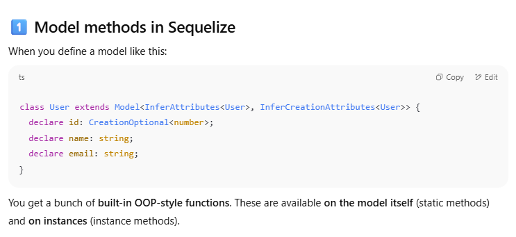


## 2️⃣ Common **static methods** (Model-level, call on the class)

| Method                    | Description                   | Example                                                                       |
| ------------------------- | ----------------------------- | ----------------------------------------------------------------------------- |
| `findByPk(pk)`            | Find row by primary key       | `const user = await User.findByPk(1);`                                        |
| `findOne(options)`        | Find first row matching query | `const user = await User.findOne({ where: { email: "a@b.com" } });`           |
| `findAll(options)`        | Find multiple rows            | `const users = await User.findAll({ where: { name: "Sourav" }, limit: 10 });` |
| `create(values)`          | Insert new row                | `const user = await User.create({ name: "Sourav", email: "a@b.com" });`       |
| `update(values, options)` | Update rows                   | `await User.update({ name: "Rajvi" }, { where: { id: 1 } });`                 |
| `destroy(options)`        | Delete rows                   | `await User.destroy({ where: { id: 1 } });`                                   |
| `count(options)`          | Count rows matching query     | `const c = await User.count({ where: { name: "Sourav" } });`                  |
| `bulkCreate(array)`       | Insert multiple rows          | `await User.bulkCreate([{name:"A"}, {name:"B"}]);`                            |
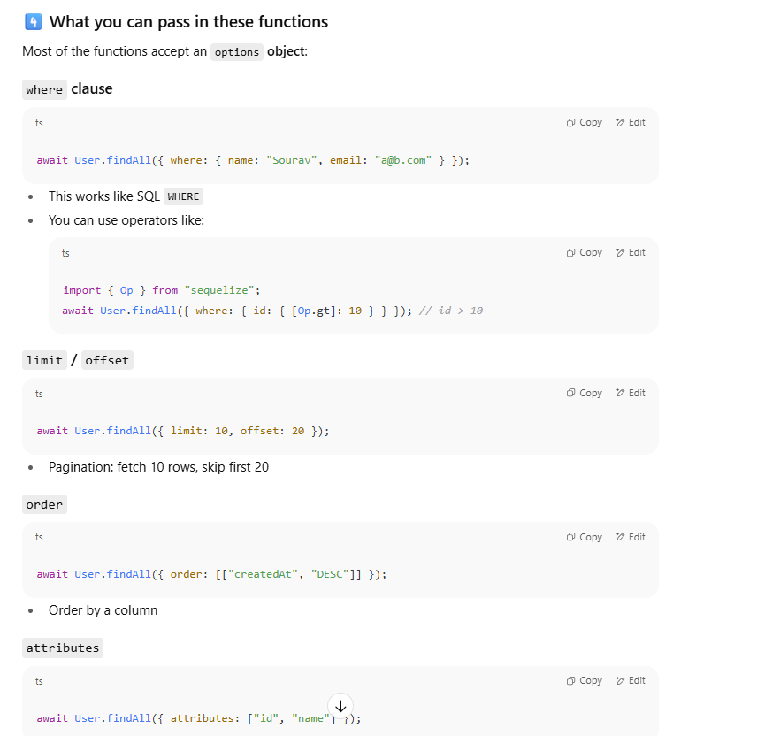

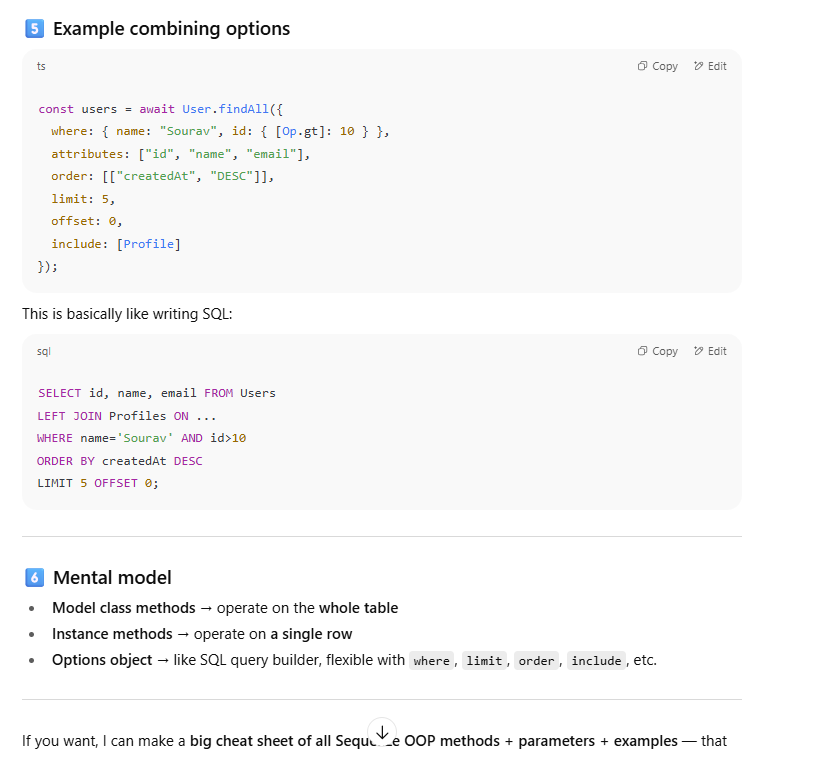


Even if we use paranoid property we still need to have the deletedAt field
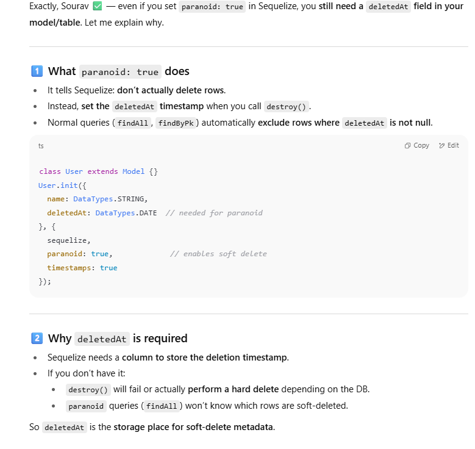


## 1️⃣ **Stored Procedures (DB concept)**

**Definition:**  
A stored procedure is a **predefined SQL program saved in the database** that can perform operations like `SELECT`, `INSERT`, `UPDATE`, `DELETE`, or even complex business logic.

- Runs on the **database server**, not in your app.
    
- Can take **parameters** and return **results**.

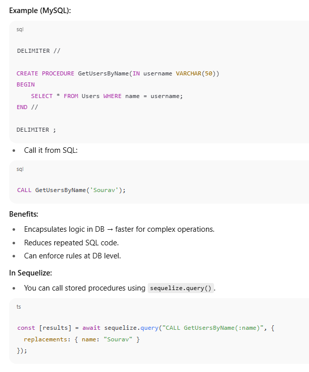

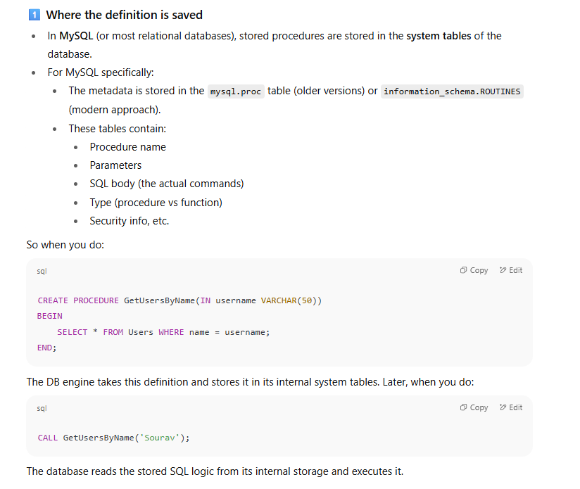


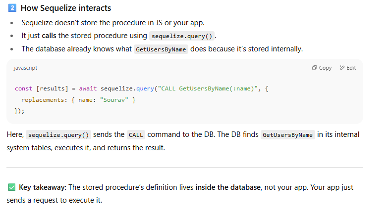


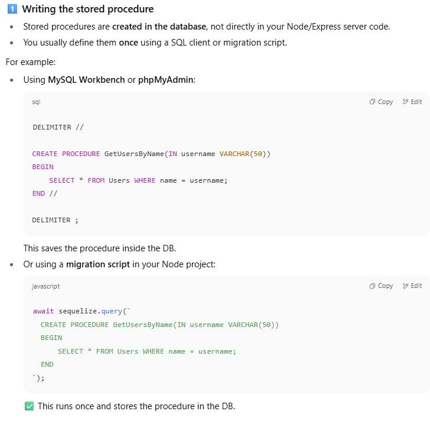


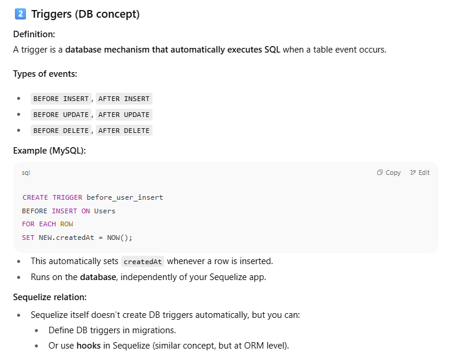

Triggers are purely a **database-level feature**, so you always need to use **raw SQL** to create them.


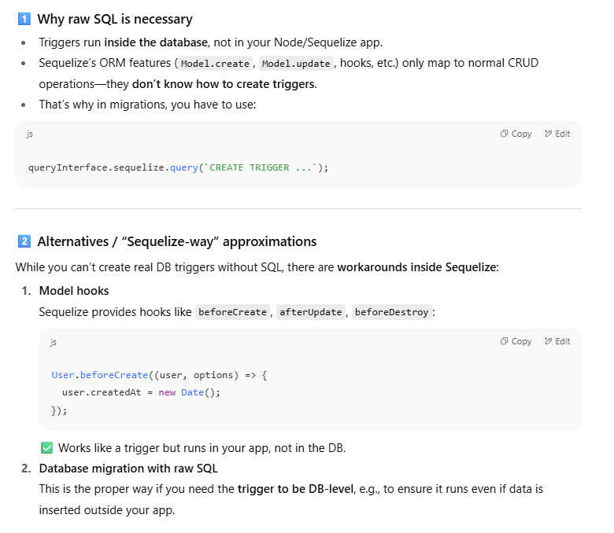


### 3️⃣ Summary

|Approach|Runs Where|Pros|Cons|
|---|---|---|---|
|Raw SQL trigger in migration|Database|Works for all clients, automatic|Must write SQL manually|
|Sequelize hooks|App (Node)|Easier to maintain in JS|Only works via Sequelize operations|

---

💡 Key point: If you want **DB-level guarantees**, you **must use raw SQL**. Sequelize hooks are just an app-level alternative.


## 3️⃣ **Hooks (Sequelize concept)**

**Definition:**  
Hooks are **functions you attach to models** that run **before or after certain actions** in Sequelize (insert, update, delete, find).

- Runs **inside your app**, not in DB.
    
- Can modify data, perform checks, log actions, etc.
    

**Types of hooks:**

|Hook|When it runs|
|---|---|
|`beforeCreate`|Before `create()` is executed|
|`afterCreate`|After `create()` completes|
|`beforeUpdate`|Before `update()`|
|`afterUpdate`|After `update()`|
|`beforeDestroy`|Before `destroy()`|
|`afterDestroy`|After `destroy()`|
|`beforeFind`|Before `findAll` / `findOne`|
|`afterFind`|After fetching data|


```ts
User.beforeCreate((user, options) => {
  user.name = user.name.trim();  // sanitize name before saving
});

User.afterCreate((user, options) => {
  console.log(`New user created: ${user.name}`);
});

```


**Difference from triggers:**

- **Trigger:** DB-level, runs automatically even if app doesn’t exist.
    
- **Hook:** ORM-level, runs in your app via Sequelize methods.


## 4️⃣ Quick Comparison

|Concept|Runs Where|Purpose / Use Case|
|---|---|---|
|Stored Procedure|Database|Encapsulate complex DB logic|
|Trigger|Database|Auto-run SQL on table events|
|Hook|Sequelize App|Run JS code before/after model actions|


## Hooks operate on **Sequelize objects**

- Hooks run **inside your Node.js app**, whenever you call a Sequelize method (`create`, `update`, `destroy`, `find`, etc.).
    
- They operate on **instances of your model**, i.e., JS objects representing DB rows

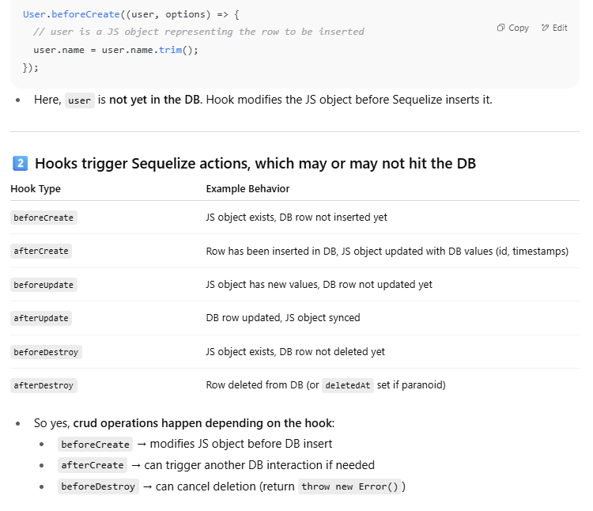


## Key points

1. **Hooks are mostly JS-level**, working on model instances.
    
2. **DB interaction occurs when Sequelize executes the query**, which hooks can **intercept, modify, or react to**.
    
3. Hooks are **conditional** — you can add logic like:
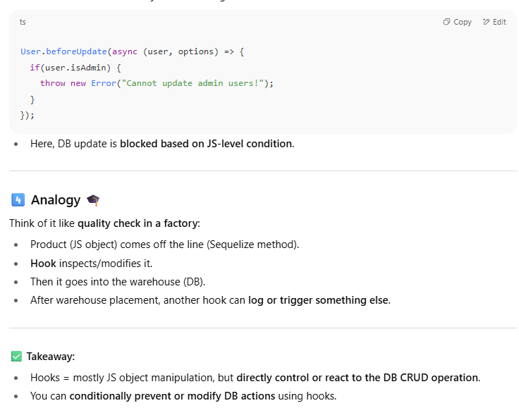


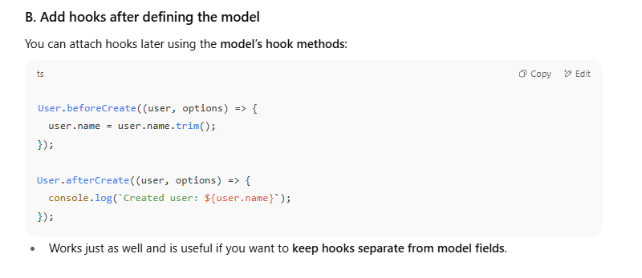

## 2️⃣ Scope of hooks

- Hooks attached to a **model class** will run **for every instance of that model** when the associated action is called.
    
- You **cannot attach hooks to a single row instance**; it’s always **at the model level**.


Let’s take a **Hotel model** example and write **practical hooks** you’d use in a real app. I’ll cover `beforeCreate`, `afterCreate`, `beforeUpdate`, `beforeDestroy`, and `afterFind`.

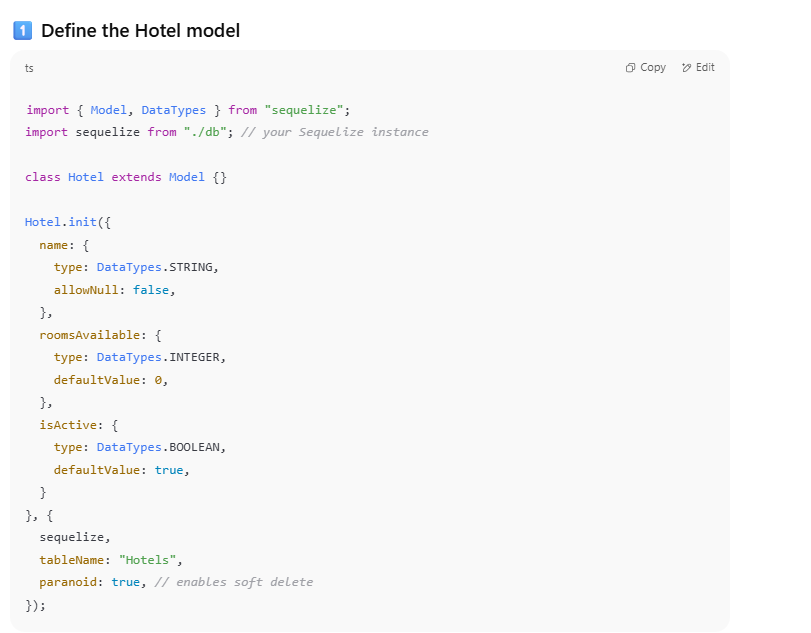


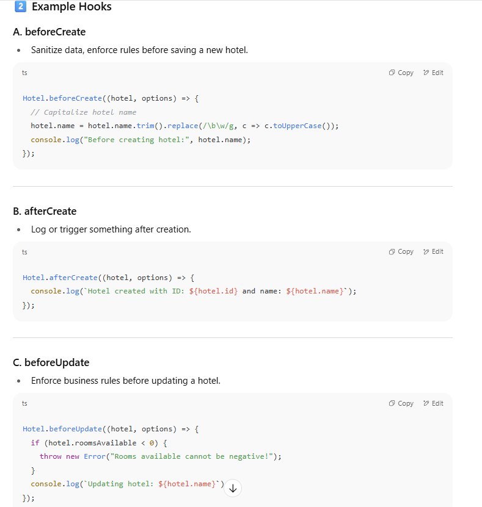


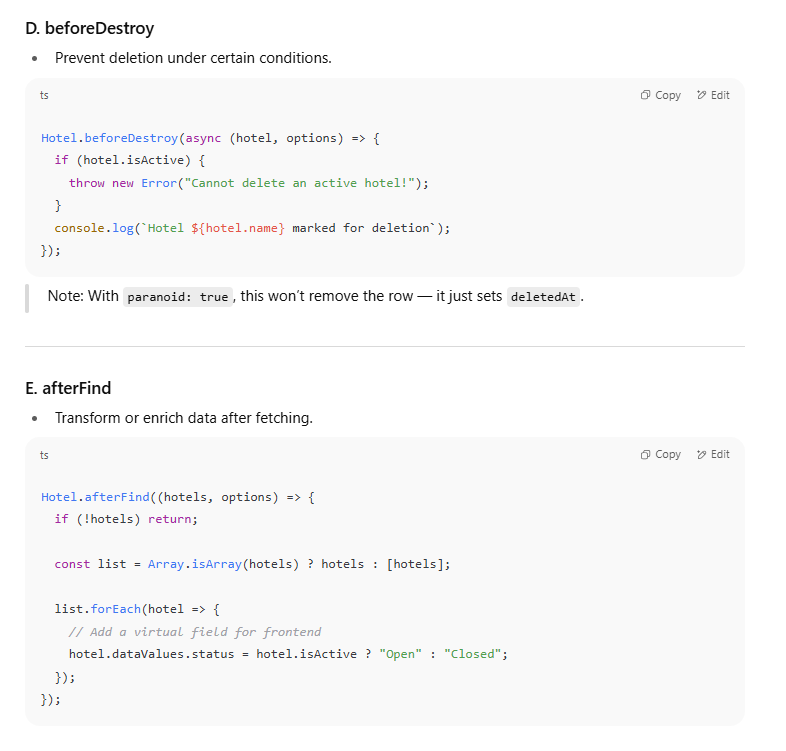
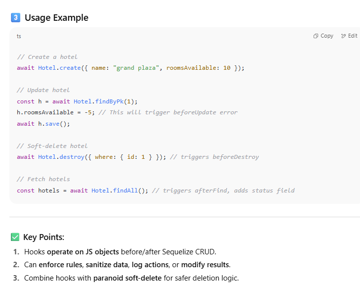

A **tombstone** in a database is basically a **marker that indicates a record has been deleted** without actually removing it from the database immediately. It’s widely used in distributed databases and systems that implement **soft deletes**. Let me explain in detail:

---

### 1️⃣ Concept

- Instead of physically deleting a record, the database marks it as deleted using a **tombstone flag** or **deleted timestamp**.
    
- The record is still stored in the DB, but the system treats it as “deleted.”
    
- This is common in systems that need **replication, auditing, or conflict resolution**
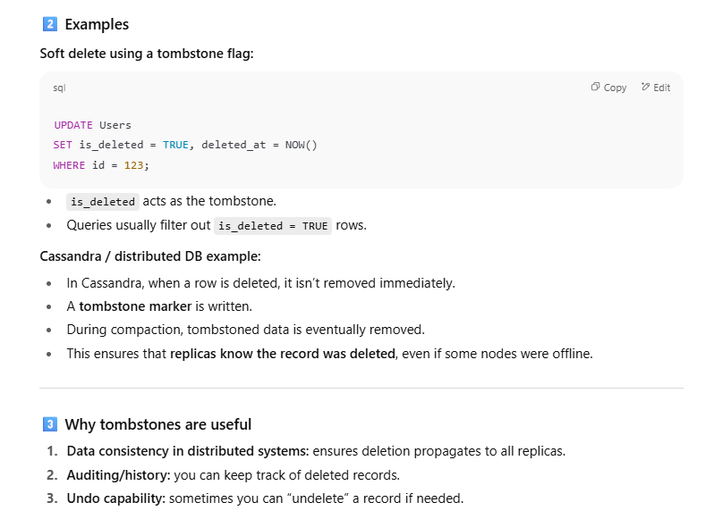


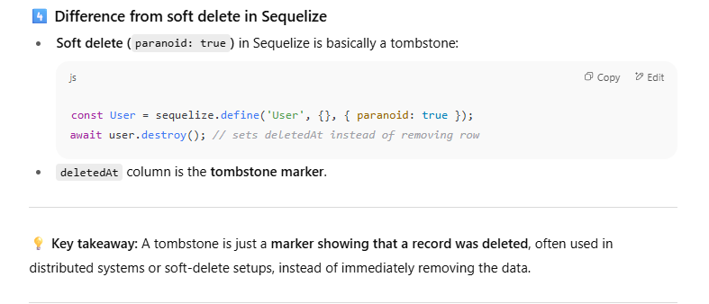


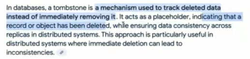


**Entities involved:**

1. Problem
    
2. Submissions (users’ solutions)
    
3. Contests
    
4. User ratings
    
5. Discussion/comments
    
6. Tags / topics
    

---

### 1️⃣ What happens if we do a hard delete

- **Problem table** → row removed
    
- **Submissions table** → foreign key references break → submissions get deleted or become orphaned
    
- **Contest table** → if the problem was part of a contest, the contest structure breaks
    
- **Ratings** → recalculation needed, because users’ contest performance depended on the problem
    
- **Discussions / comments / solutions** → could also break
    

⚠️ **Potential issues:**

- Orphaned records → database integrity errors
    
- Users’ historical data disappears → affects leaderboards, ratings
    
- Contests may become invalid → unfair or broken scoring
    
- Analytics/statistics become inconsistent


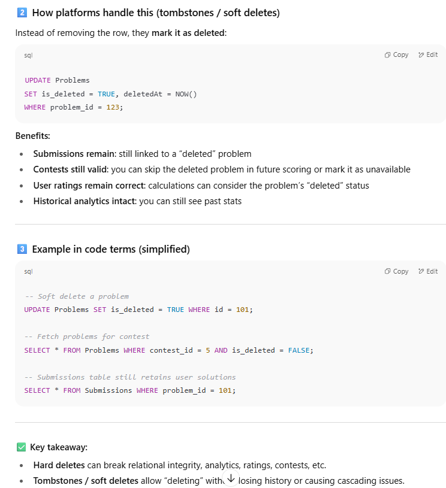


# 1. The Two Worlds in Any App

Whenever you build a system, there are **two domains** at play:

### 🟦 Application Layer (JS/ORM)

- Written in JavaScript/TypeScript (or any app language).
    
- Holds **business logic**: rules like _“a user can’t place an order if their account is inactive”_.
    
- Talks to the DB indirectly, usually through an **ORM** or repository.
    
- Fast-changing: features, product rules, workflows → these evolve weekly/monthly.
    

### 🟨 Database Layer

- The **source of truth** where data is persisted.
    
- Holds **data integrity and performance logic**: indexes, constraints, query optimizations, compaction (in NoSQL), replication.
    
- Slower-changing: schema design, partitioning, query tuning → these are expensive to redo and evolve slower.
    

👉 Think of it like:  
**App Layer = “What should happen?”**  
**DB Layer = “How the data is actually stored and kept correct?”**


# 2. Why Split Them?

If you mix both, you get brittle systems.  
Example: putting all rules in DB procedures makes it hard to test or change quickly.  
Or, putting all responsibility in JS means you ignore DB mechanics like tombstones, indexes, or constraints.

The split gives:

- **Agility** → tweak business rules quickly in JS.
    
- **Integrity** → DB enforces correctness & optimizes data access.
# 3. Responsibilities of Each Layer

### Application Layer (JS/ORM)

- **Business workflows** (placeOrder, deactivateUser, refundPayment).
    
- **Validation** (email format, password length, order amount > 0).
    
- **Orchestration** across services (call payments API + persist order).
    
- **Soft deletes** (mark `is_deleted = true`) instead of hard deletes.
    
- **Repository abstraction**: ORM models hide raw queries, so code doesn’t care if DB is MySQL, Postgres, Cassandra, etc.
    

### Database Layer

- **Constraints** (unique email, foreign key, not null).
    
- **Indexes** for query speed.
    
- **Replication/consistency** (Cassandra tombstones, PostgreSQL WAL, etc).
    
- **Performance tuning** (partitioning, compaction, vacuum).
    
- **Physical delete semantics** (tombstones in Cassandra, vacuum in Postgres).


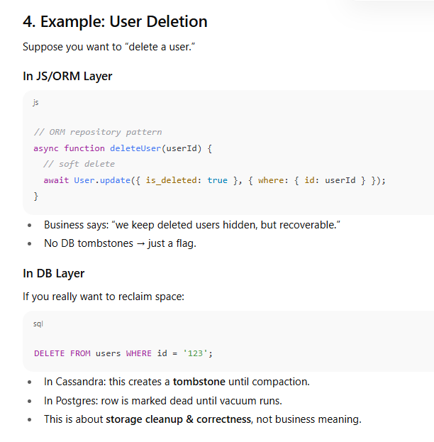


# 5. ORM as the Bridge

The ORM is the translator between these worlds:

- **ORM entity/model** = represents a DB row but lives in code.
    
- ORM can map:
    
    - `softDelete()` → just sets `is_deleted = true`.
        
    - `hardDelete()` → actually issues a DB delete (and triggers tombstones in Cassandra).
        
- Good ORMs let you _choose_ the strategy so you don’t unknowingly harm DB performance.
    

---

# 6. General Rule of Thumb

- **Keep business logic in JS/ORM layer** (soft delete flags, validation, workflows).
    
- **Keep data correctness/performance in DB layer** (constraints, indexes, compaction policies).
    
- **Only push heavy set-based logic down** (e.g., “aggregate orders by month” is cheaper in DB).
    

This is why engineers say:  
👉 “App owns the _what_, DB owns the _how_.”


